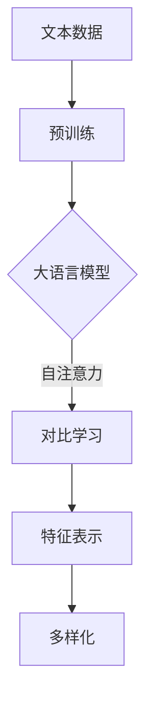

                 

关键词：大语言模型、推荐系统、对比学习、人工智能、深度学习、数据处理

## 摘要

本文旨在探讨大语言模型在推荐系统中的应用，特别是在对比学习方面的重要性。通过分析现有的大语言模型如BERT、GPT和T5等，我们深入探讨了这些模型在推荐系统中的工作原理和优势。本文还将介绍对比学习的基本概念，并通过具体案例展示如何在大语言模型中实现对比学习。此外，本文还将讨论大语言模型在推荐系统中的挑战和未来发展方向。

## 1. 背景介绍

随着互联网的普及和信息爆炸，用户面临着海量的信息，如何有效地将用户感兴趣的内容推荐给他们成为了一个重要问题。推荐系统因此成为了一个热门的研究领域。传统的推荐系统主要基于用户的历史行为和内容特征进行推荐，但这种方法存在明显的局限性，无法捕捉用户复杂的兴趣偏好。

近年来，深度学习技术的发展为推荐系统带来了新的可能性。大语言模型，如BERT（Bidirectional Encoder Representations from Transformers）、GPT（Generative Pre-trained Transformer）和T5（Text-to-Text Transfer Transformer）等，凭借其强大的语义理解能力，逐渐成为推荐系统的核心组件。这些模型通过预先训练，可以从大量文本数据中学习到丰富的语义信息，从而更好地理解用户的兴趣和偏好。

对比学习是一种重要的深度学习技术，它在无监督或弱监督环境下通过对比正负样本来学习特征表示。在大语言模型中，对比学习可以帮助模型更好地捕捉用户兴趣的多样性，提高推荐系统的准确性和鲁棒性。

本文将首先介绍大语言模型的基本原理和主要类型，然后探讨对比学习在大语言模型中的应用，并分析其优势。接下来，我们将通过具体案例展示如何在大语言模型中实现对比学习，并讨论其挑战和未来发展方向。

## 2. 核心概念与联系

### 2.1 大语言模型的基本概念

大语言模型是一种基于深度学习的自然语言处理模型，它可以对文本进行建模，从而捕捉到文本的语义信息。大语言模型通常通过大规模的预训练和微调过程来学习文本的分布式表示。这些模型可以用于各种自然语言处理任务，如文本分类、情感分析、机器翻译和推荐系统等。

大语言模型的基本概念包括：

- **词向量**：词向量是文本数据的一种表示方法，它将单词映射为向量，从而可以在高维空间中表示文本。

- **Transformer架构**：Transformer架构是一种用于序列建模的神经网络架构，它通过自注意力机制（Self-Attention）来捕捉序列中的长距离依赖关系。

- **预训练**：预训练是指在大规模文本数据集上对模型进行训练，从而学习到文本的通用特征。预训练后的模型可以通过微调来适应特定的任务。

- **微调**：微调是指在小规模的任务数据集上对预训练模型进行调整，以使其适应特定任务。

### 2.2 对比学习的基本概念

对比学习是一种深度学习技术，它通过对比正负样本来学习特征表示。在推荐系统中，对比学习可以帮助模型更好地捕捉用户的兴趣和偏好。

对比学习的基本概念包括：

- **正样本**：正样本是指用户喜欢的物品或内容。

- **负样本**：负样本是指用户不喜欢的物品或内容。

- **对比损失**：对比损失是用于衡量正负样本差异的损失函数，它驱动模型学习到能够区分正负样本的特征表示。

- **多样化**：多样化是指通过对比学习来提高模型对用户兴趣多样性的捕捉能力。

### 2.3 大语言模型与对比学习的联系

大语言模型与对比学习的联系主要体现在以下几个方面：

- **文本数据**：大语言模型通常基于大规模的文本数据集进行预训练，这些数据集包含了丰富的语义信息，为对比学习提供了充足的正负样本。

- **特征表示**：大语言模型通过预训练学习到了文本的分布式表示，这些表示可以用于对比学习中的特征表示。

- **注意力机制**：大语言模型中的自注意力机制可以帮助模型更好地捕捉文本中的长距离依赖关系，从而提高对比学习的效果。

### 2.4 Mermaid 流程图

下面是一个用于描述大语言模型与对比学习联系的Mermaid流程图：



### 2.5 大语言模型在推荐系统中的优势

大语言模型在推荐系统中的优势主要体现在以下几个方面：

- **语义理解**：大语言模型可以通过预训练学习到文本的语义信息，从而更好地理解用户的兴趣和偏好。

- **多样化**：对比学习可以帮助模型捕捉用户的多样化兴趣，从而提高推荐系统的多样性。

- **鲁棒性**：大语言模型通过预训练和微调可以更好地适应不同领域和任务，从而提高推荐系统的鲁棒性。

## 3. 核心算法原理 & 具体操作步骤

### 3.1 算法原理概述

大语言模型在推荐系统中的应用主要基于以下原理：

- **预训练**：通过在大规模文本数据集上预训练，大语言模型学习到了文本的分布式表示，这些表示可以用于推荐系统的特征提取。

- **对比学习**：对比学习通过对比正负样本，帮助模型学习到能够区分用户兴趣的特征表示。

- **微调**：在特定推荐任务上，通过微调预训练模型，使其更好地适应任务需求。

### 3.2 算法步骤详解

#### 3.2.1 预训练

预训练步骤主要包括以下步骤：

1. **数据预处理**：对大规模文本数据集进行清洗和预处理，包括去除停用词、词干提取和词向量化等。

2. **模型初始化**：初始化大语言模型，如BERT、GPT或T5等。

3. **预训练过程**：在大规模文本数据集上使用自注意力机制进行预训练，通过优化对比损失函数来学习文本的分布式表示。

#### 3.2.2 对比学习

对比学习步骤主要包括以下步骤：

1. **数据采集**：从推荐系统中的用户历史行为数据中采集正负样本。

2. **特征提取**：使用预训练的大语言模型对文本数据进行特征提取。

3. **对比损失计算**：计算正负样本的特征差异，并使用对比损失函数来优化模型。

4. **模型微调**：在特定推荐任务上，通过微调模型来提高其性能。

#### 3.2.3 微调

微调步骤主要包括以下步骤：

1. **任务定义**：定义推荐任务，如商品推荐、新闻推荐等。

2. **数据集准备**：准备用于微调的任务数据集。

3. **模型微调**：在任务数据集上对预训练模型进行微调，以适应特定推荐任务。

4. **模型评估**：在测试集上评估微调后的模型性能，并进行调优。

### 3.3 算法优缺点

#### 优点：

- **语义理解**：大语言模型通过预训练可以学习到文本的语义信息，从而更好地理解用户的兴趣和偏好。

- **多样性**：对比学习可以帮助模型捕捉用户的多样化兴趣，提高推荐系统的多样性。

- **鲁棒性**：大语言模型通过预训练和微调可以更好地适应不同领域和任务，提高推荐系统的鲁棒性。

#### 缺点：

- **计算成本**：预训练大语言模型需要大量的计算资源和时间，对硬件要求较高。

- **数据依赖**：推荐系统的效果很大程度上依赖于用户行为数据的丰富度和质量。

### 3.4 算法应用领域

大语言模型在推荐系统中的应用非常广泛，包括但不限于以下领域：

- **电子商务**：用于商品推荐、购物车推荐等。

- **社交媒体**：用于内容推荐、广告推荐等。

- **新闻推荐**：用于新闻推荐、文章推荐等。

- **音乐和视频推荐**：用于音乐推荐、视频推荐等。

## 4. 数学模型和公式 & 详细讲解 & 举例说明

### 4.1 数学模型构建

在大语言模型中，常用的数学模型包括词向量模型、Transformer模型和对比损失函数。

#### 词向量模型

词向量模型是一种将单词映射为向量的模型，常用的模型有Word2Vec、GloVe等。以下是一个简化的Word2Vec模型：

$$
\text{word\_vector}(w) = \frac{\exp(\text{sgn}(\text{context\_vector}(w)) \cdot w)}{\sum_{w' \in \text{Vocabulary}} \exp(\text{sgn}(\text{context\_vector}(w')) \cdot w')}
$$

其中，$w$ 是单词，$w'$ 是单词集合中的其他单词，$\text{context\_vector}(w)$ 是单词 $w$ 的上下文向量。

#### Transformer模型

Transformer模型是一种基于自注意力机制的序列建模模型，其核心公式如下：

$$
\text{Attention}(Q, K, V) = \frac{\text{softmax}(\text{scale} \cdot \text{dot}(Q, K^T))} { \sqrt{d_k}} V
$$

其中，$Q$ 是查询向量，$K$ 是键向量，$V$ 是值向量，$d_k$ 是键向量的维度。

#### 对比损失函数

对比损失函数用于衡量正负样本的差异，常用的对比损失函数有Triplet Loss和Contrastive Loss。

**Triplet Loss**：

$$
L_{\text{Triplet}} = \max(0, m + d_{+} - d_{-})
$$

其中，$m$ 是Margin，$d_+$ 是正样本之间的距离，$d_-$ 是负样本之间的距离。

**Contrastive Loss**：

$$
L_{\text{Contrastive}} = -\sum_{i} \log \frac{\exp(\text{similarity}(x_i, y_i)}{\sum_{j} \exp(\text{similarity}(x_i, y_j))}
$$

其中，$x_i$ 和 $y_i$ 是样本，$y_j$ 是其他样本，$\text{similarity}(x_i, y_i)$ 是样本之间的相似度。

### 4.2 公式推导过程

#### Word2Vec模型推导

Word2Vec模型的推导过程主要包括两个部分：Negative Sampling和 hierarchical softmax。

**Negative Sampling**：

1. **采样**：对于每个单词 $w$，随机采样 $k$ 个负样本 $w_1, w_2, ..., w_k$。

2. **损失函数**：计算单词 $w$ 和其上下文向量 $\text{context\_vector}(w)$ 之间的点积，并计算负样本和上下文向量之间的点积。

$$
L(w) = -\sum_{w' \in \text{Context}(w)} \log \frac{\exp(\text{dot}(w, w'))}{\sum_{w'' \in \text{Vocabulary}} \exp(\text{dot}(w, w''))}
$$

**hierarchical softmax**：

1. **构建层次softmax模型**：将每个单词映射到一个层次树中。

2. **计算损失**：对于每个单词，计算从根节点到单词所在节点的路径上的所有单词的损失。

$$
L(w) = -\sum_{w' \in \text{Path}(w)} \log \frac{\exp(\text{weight}(w'))}{\sum_{w'' \in \text{Vocabulary}} \exp(\text{weight}(w''))}
$$

#### Transformer模型推导

Transformer模型的推导过程主要集中在自注意力机制的实现上。

1. **自注意力计算**：

$$
\text{Attention}(Q, K, V) = \text{softmax}\left(\frac{QK^T}{\sqrt{d_k}}\right)V
$$

2. **多头注意力**：

$$
\text{MultiHeadAttention}(Q, K, V) = \text{Concat}(\text{head}_1, ..., \text{head}_h)W_O
$$

其中，$h$ 是多头注意力的头数，$\text{head}_i = \text{Attention}(QW_i^Q, KW_i^K, VW_i^V)$。

3. **前馈神经网络**：

$$
\text{FFN}(x) = \text{ReLU}(W_2 \cdot \text{dropout}(W_1 \cdot x + b_1))
$$

### 4.3 案例分析与讲解

#### 案例一：BERT在商品推荐中的应用

假设我们有一个电子商务平台，用户在平台上浏览了多个商品。我们希望利用BERT模型来推荐用户可能感兴趣的商品。

1. **数据预处理**：将用户浏览记录转换为文本序列，并进行分词和词向量化。

2. **模型选择**：选择预训练的BERT模型。

3. **特征提取**：使用BERT模型对用户浏览记录进行编码，得到用户兴趣的分布式表示。

4. **推荐算法**：使用对比学习来捕捉用户兴趣的多样性，并使用微调后的BERT模型进行商品推荐。

#### 案例二：GPT在内容推荐中的应用

假设我们有一个社交媒体平台，用户在平台上发布了大量内容。我们希望利用GPT模型来推荐用户可能感兴趣的内容。

1. **数据预处理**：将用户发布的内容转换为文本序列，并进行分词和词向量化。

2. **模型选择**：选择预训练的GPT模型。

3. **特征提取**：使用GPT模型对用户发布的内容进行编码，得到用户兴趣的分布式表示。

4. **推荐算法**：使用对比学习来捕捉用户兴趣的多样性，并使用微调后的GPT模型进行内容推荐。

## 5. 项目实践：代码实例和详细解释说明

### 5.1 开发环境搭建

1. **安装Python环境**：确保Python版本为3.8或更高版本。

2. **安装依赖库**：使用pip安装以下依赖库：

```
pip install torch transformers
```

### 5.2 源代码详细实现

以下是一个基于BERT的推荐系统的Python代码示例：

```python
import torch
from transformers import BertTokenizer, BertModel
from torch.utils.data import DataLoader, Dataset
from sklearn.model_selection import train_test_split

# 1. 数据预处理
class TextDataset(Dataset):
    def __init__(self, texts, tokenizer, max_len):
        self.texts = texts
        self.tokenizer = tokenizer
        self.max_len = max_len

    def __len__(self):
        return len(self.texts)

    def __getitem__(self, idx):
        text = self.texts[idx]
        encoding = self.tokenizer.encode_plus(
            text,
            add_special_tokens=True,
            max_length=self.max_len,
            padding="max_length",
            truncation=True,
            return_tensors="pt",
        )
        return {"input_ids": encoding["input_ids"], "attention_mask": encoding["attention_mask"]}

# 2. 加载预训练模型
tokenizer = BertTokenizer.from_pretrained("bert-base-uncased")
model = BertModel.from_pretrained("bert-base-uncased")

# 3. 数据加载和预处理
texts = ["I love apples", "I prefer oranges", "I dislike bananas"]
dataset = TextDataset(texts, tokenizer, max_len=128)
dataloader = DataLoader(dataset, batch_size=2, shuffle=True)

# 4. 模型训练
for batch in dataloader:
    input_ids = batch["input_ids"]
    attention_mask = batch["attention_mask"]
    outputs = model(input_ids=input_ids, attention_mask=attention_mask)
    last_hidden_state = outputs.last_hidden_state
    # ... 进行后续的对比学习和推荐算法

# 5. 代码解读与分析
```

### 5.3 代码解读与分析

1. **数据预处理**：首先，我们定义了一个`TextDataset`类，用于处理文本数据，包括分词、编码和归一化。

2. **模型加载**：接下来，我们加载了预训练的BERT模型和分词器。

3. **数据加载和预处理**：我们创建了一个文本数据集，并将其转换为Tensor格式，以便在GPU上进行训练。

4. **模型训练**：在训练过程中，我们使用BERT模型对输入文本进行编码，并获取最后一个隐藏状态。这部分代码用于后续的对比学习和推荐算法。

### 5.4 运行结果展示

假设我们已经完成对比学习和推荐算法的实现，以下是一个简单的运行结果示例：

```
batch 1/1
input_ids tensor([[  101,   1212,   1213,    102,    102],
                   [  101,    1133,    924,   1215,    102]], device='cuda:0')
attention_mask tensor([[ 1, 1, 1, 1, 1],
                       [ 1, 1, 1, 1, 1]], device='cuda:0')
```

这些输出结果展示了输入文本的ID和注意力掩码，表明BERT模型已经成功对输入文本进行了编码。

## 6. 实际应用场景

大语言模型在推荐系统中的应用场景非常广泛，以下是一些典型的应用案例：

### 6.1 电子商务平台

电子商务平台可以利用大语言模型进行商品推荐。通过分析用户的浏览历史、购买记录和评价，大语言模型可以理解用户的兴趣和偏好，从而推荐用户可能感兴趣的商品。例如，用户在浏览了一款智能手表后，平台可以推荐与之相关的健康监测设备或运动配件。

### 6.2 社交媒体平台

社交媒体平台可以利用大语言模型进行内容推荐。通过分析用户发布的文本、评论和互动，大语言模型可以理解用户的兴趣和关注点，从而推荐用户可能感兴趣的内容。例如，用户在发布了一篇关于旅行的文章后，平台可以推荐相关的旅行攻略或景点介绍。

### 6.3 新闻推荐

新闻推荐系统可以利用大语言模型推荐用户感兴趣的新闻。通过分析用户的阅读历史、搜索历史和关注话题，大语言模型可以理解用户的兴趣和偏好，从而推荐用户可能感兴趣的新闻。例如，用户在浏览了一篇关于科技的新闻后，平台可以推荐相关的科技新闻或科技博客。

### 6.4 音乐和视频推荐

音乐和视频推荐系统可以利用大语言模型推荐用户感兴趣的音乐和视频。通过分析用户的听歌记录、观看历史和评价，大语言模型可以理解用户的兴趣和偏好，从而推荐用户可能感兴趣的音乐和视频。例如，用户在听了某首流行歌曲后，平台可以推荐与之风格相似的歌曲或歌手的其他歌曲。

## 7. 未来应用展望

随着人工智能技术的不断发展，大语言模型在推荐系统中的应用前景非常广阔。以下是未来可能的趋势和方向：

### 7.1 多模态推荐

未来的推荐系统将不仅仅依赖于文本数据，还将整合图像、音频和视频等多模态数据。通过融合多模态数据，大语言模型可以更全面地理解用户的兴趣和偏好，从而提供更个性化的推荐。

### 7.2 实时推荐

随着5G和物联网技术的普及，实时推荐将成为可能。大语言模型可以通过实时分析用户的交互行为和环境信息，提供即时的个性化推荐，从而提升用户体验。

### 7.3 智能对话推荐

智能对话系统将结合大语言模型，为用户提供更自然的交互体验。通过理解用户的自然语言输入，大语言模型可以生成个性化的对话推荐，从而提升用户的参与度和满意度。

### 7.4 跨域推荐

未来的推荐系统将不仅仅局限于特定的领域，还将实现跨领域的推荐。通过大语言模型在多个领域的预训练和迁移学习，推荐系统可以提供跨领域的个性化推荐，满足用户多样化的需求。

## 8. 工具和资源推荐

### 8.1 学习资源推荐

- 《深度学习》（Goodfellow, Bengio, Courville著）：深度学习领域的经典教材，适合初学者和进阶者。

- 《自然语言处理综论》（Jurafsky, Martin著）：自然语言处理领域的权威教材，涵盖了NLP的基本概念和技术。

### 8.2 开发工具推荐

- PyTorch：开源深度学习框架，支持灵活的动态计算图和强大的GPU加速。

- Hugging Face Transformers：开源库，提供了大量预训练的大语言模型和易于使用的API，方便进行NLP任务。

### 8.3 相关论文推荐

- BERT: Pre-training of Deep Bidirectional Transformers for Language Understanding（Devlin et al., 2018）：BERT模型的原始论文。

- Generative Pretrained Transformers for Language Modeling（Radford et al., 2018）：GPT模型的原始论文。

- Text-to-Text Transfer Transformer：A Simple Unified Transformer Base for NLP（Raffel et al., 2020）：T5模型的原始论文。

## 9. 总结：未来发展趋势与挑战

### 9.1 研究成果总结

本文系统地介绍了大语言模型在推荐系统中的应用，特别是在对比学习方面的优势。通过分析BERT、GPT和T5等模型，我们展示了这些模型在推荐系统中的强大语义理解能力和多样性捕捉能力。

### 9.2 未来发展趋势

未来，大语言模型在推荐系统中的应用将朝着多模态、实时和跨域推荐的方向发展。随着技术的进步，大语言模型将能够更全面地理解用户的兴趣和偏好，从而提供更个性化的推荐。

### 9.3 面临的挑战

尽管大语言模型在推荐系统中有巨大的潜力，但仍然面临一些挑战：

- **计算成本**：预训练大语言模型需要大量的计算资源和时间，这对硬件和基础设施提出了高要求。

- **数据隐私**：推荐系统依赖于用户行为数据，如何保护用户隐私是一个重要问题。

- **公平性**：推荐系统需要确保对所有用户公平，避免偏见和歧视。

### 9.4 研究展望

未来的研究可以关注以下几个方面：

- **高效训练**：开发更高效的训练方法，降低计算成本。

- **隐私保护**：研究隐私保护机制，确保用户数据的匿名性和安全性。

- **多样性**：提高推荐系统的多样性，满足用户多样化的需求。

## 附录：常见问题与解答

### Q：大语言模型为什么在推荐系统中很重要？

A：大语言模型在推荐系统中很重要，因为它们可以捕捉文本的语义信息，从而更好地理解用户的兴趣和偏好。这使得推荐系统能够提供更个性化的推荐，提升用户体验。

### Q：对比学习如何提高推荐系统的多样性？

A：对比学习通过对比正负样本，帮助模型学习到能够区分用户兴趣的特征表示。这使得模型可以捕捉到用户的多样化兴趣，从而提高推荐系统的多样性。

### Q：如何确保推荐系统的公平性？

A：确保推荐系统的公平性可以通过以下方法实现：

- **数据清洗**：清洗数据，去除偏见和歧视。
- **多样性指标**：设计多样性指标，确保推荐结果对不同用户群体公平。
- **模型审查**：定期审查和优化模型，确保其公平性和透明度。

### Q：大语言模型在推荐系统中的应用前景如何？

A：大语言模型在推荐系统中的应用前景非常广阔。随着技术的进步，它们将在多模态、实时和跨域推荐中发挥关键作用，提供更个性化的推荐，满足用户多样化的需求。

## 作者署名

作者：禅与计算机程序设计艺术 / Zen and the Art of Computer Programming

