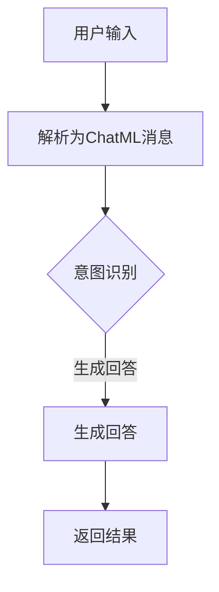

                 

关键词：大语言模型、ChatML、交互格式、人工智能、语言理解、对话系统、技术指南、自然语言处理、架构设计、数学模型、代码实例、应用场景、工具推荐、未来展望。

> 摘要：本文将深入探讨大语言模型的应用指南，特别关注ChatML交互格式。我们将从背景介绍、核心概念与联系、核心算法原理、数学模型和公式、项目实践、实际应用场景、工具和资源推荐，到总结与展望，全面解析大语言模型的技术细节和实践应用，为读者提供一整套完整的技术指南。

## 1. 背景介绍

大语言模型（Large Language Models）近年来在人工智能领域取得了显著的进展。随着深度学习和自然语言处理技术的不断发展，大语言模型已经成为构建智能对话系统、文本生成、机器翻译、内容审核等应用的核心技术。这些模型通过学习和理解大量的文本数据，能够生成连贯、自然的语言输出，极大地提高了人工智能系统的交互能力和智能水平。

ChatML（Chat Markup Language）作为一种特定的交互格式，专为增强大语言模型的交互体验而设计。ChatML不仅仅是一种标记语言，它更是一种基于语义的交互框架，旨在提供一种结构化、语义丰富的方式与用户进行对话。ChatML通过定义一系列标记和语义标签，使得模型能够更准确地理解和处理用户的输入，从而生成更为精准和自然的回答。

本文将围绕大语言模型和ChatML交互格式，详细探讨其在人工智能领域的应用，包括核心概念、算法原理、数学模型、项目实践、应用场景、工具和资源推荐，以及未来发展趋势与挑战。通过这篇文章，读者将能够全面了解大语言模型的技术细节和实践方法，并掌握ChatML交互格式的应用技巧。

## 2. 核心概念与联系

### 2.1. 大语言模型

大语言模型是一种基于神经网络的深度学习模型，能够理解和生成自然语言。这些模型通过大规模的预训练数据学习语言模式，从而具备强大的语言理解和生成能力。大语言模型的核心组成部分包括：

1. **嵌入层（Embedding Layer）**：将输入的单词或句子转换为稠密的向量表示。
2. **编码器（Encoder）**：通常使用Transformer架构，对输入序列进行编码，提取序列中的语义信息。
3. **解码器（Decoder）**：在生成输出时，解码器使用编码器提供的上下文信息来生成单词或句子。

### 2.2. ChatML交互格式

ChatML交互格式是一种专为对话系统设计的标记语言，它提供了丰富的语义标签和结构化信息，使得大语言模型能够更准确地理解和处理用户的输入。ChatML的核心概念包括：

1. **消息（Message）**：消息是用户与系统交互的基本单位，包括文本内容、元数据和交互操作。
2. **意图（Intent）**：意图定义了用户想要完成的目标或操作。
3. **实体（Entity）**：实体是消息中的关键信息，如日期、时间、地点等，它们有助于模型理解用户的意图。

### 2.3. 联系与融合

大语言模型和ChatML的融合，使得模型能够更好地理解用户的意图和需求。通过ChatML提供的语义信息，大语言模型可以更精准地生成回答，提高对话系统的交互质量。具体来说：

1. **意图识别**：ChatML的意图标签帮助模型快速识别用户的意图，从而生成更相关的回答。
2. **实体抽取**：ChatML的实体标签帮助模型定位关键信息，增强对话的连贯性和准确性。
3. **上下文理解**：ChatML的结构化信息使得模型能够更好地处理复杂的对话上下文，提高对话的流畅性。

为了更好地展示大语言模型和ChatML的联系，我们可以使用Mermaid流程图来描述其工作流程：



在这个流程中，用户输入首先被转换为ChatML消息，然后模型通过意图识别和实体抽取，生成相应的回答并返回给用户。通过ChatML的丰富语义信息，模型能够更准确地理解和处理用户的输入，从而生成更为精准和自然的回答。

## 3. 核心算法原理 & 具体操作步骤

### 3.1 算法原理概述

大语言模型的算法原理主要基于深度学习和自然语言处理技术。其核心架构包括嵌入层、编码器和解码器。以下是对每个部分的基本原理介绍：

1. **嵌入层（Embedding Layer）**：嵌入层将输入的单词或句子转换为稠密的向量表示。通过预训练数据，模型学习到每个单词或句子的独特向量表示，从而能够捕捉语言中的语义信息。

2. **编码器（Encoder）**：编码器通常使用Transformer架构，对输入序列进行编码。Transformer架构的核心是注意力机制，它能够自动关注输入序列中的关键信息，从而提取丰富的语义特征。

3. **解码器（Decoder）**：解码器在生成输出时，使用编码器提供的上下文信息来生成单词或句子。解码器通过自注意力机制，能够根据前文生成的内容动态调整其生成策略，从而生成连贯、自然的语言输出。

### 3.2 算法步骤详解

以下是使用大语言模型进行对话生成的具体操作步骤：

1. **输入预处理**：将用户输入的文本转换为嵌入向量。这通常包括分词、去停用词、词干提取等步骤。

2. **编码**：使用编码器对输入序列进行编码，提取序列中的语义信息。编码器的输出是一个固定长度的向量，代表了输入序列的语义表示。

3. **生成**：解码器根据编码器的输出和前文内容生成单词或句子。在生成过程中，解码器使用自注意力机制和交叉注意力机制，结合当前生成的内容和前文信息，逐步生成完整的回答。

4. **输出**：将生成的文本输出给用户，完成一次对话交互。

### 3.3 算法优缺点

**优点**：

1. **强大的语言理解能力**：通过预训练和微调，大语言模型能够理解复杂的语言结构和语义信息，生成连贯、自然的语言输出。

2. **高效的生成速度**：得益于深度学习和硬件加速技术，大语言模型能够快速处理输入并生成回答，提高对话系统的交互效率。

**缺点**：

1. **计算资源需求大**：大语言模型需要大量的计算资源和存储空间，部署和维护成本较高。

2. **数据依赖性**：大语言模型的效果很大程度上取决于预训练数据的质量和多样性，数据质量问题可能导致模型生成的不准确或不合适的回答。

### 3.4 算法应用领域

大语言模型在多个领域都有广泛的应用，包括：

1. **对话系统**：大语言模型能够生成自然、连贯的回答，广泛应用于客服机器人、智能助手等对话系统中。

2. **文本生成**：大语言模型能够根据输入生成各种类型的文本，如新闻文章、产品描述、故事等。

3. **机器翻译**：大语言模型能够理解和生成多种语言的文本，广泛应用于机器翻译领域。

4. **内容审核**：大语言模型能够识别和过滤不良内容，应用于社交媒体平台的内容审核。

## 4. 数学模型和公式 & 详细讲解 & 举例说明

### 4.1 数学模型构建

大语言模型的数学模型主要基于深度学习，其中Transformer架构是当前最流行的一种。以下是Transformer模型的基本组成部分和数学公式。

**4.1.1. 编码器（Encoder）**

编码器由多个编码层（Encoder Layer）组成，每个编码层包含多头自注意力机制（Multi-Head Self-Attention）和前馈神经网络（Feed-Forward Neural Network）。

- **多头自注意力机制（Multi-Head Self-Attention）**：

    多头自注意力机制通过多个独立的注意力头（Attention Head）来捕捉输入序列中的不同特征。每个注意力头计算一个独立的注意力权重矩阵，然后将这些权重矩阵合并，得到最终的输出。

    数学表示：

    $$
    \text{Attention}(Q, K, V) = \text{softmax}\left(\frac{QK^T}{\sqrt{d_k}}\right)V
    $$

    其中，$Q$、$K$ 和 $V$ 分别代表查询向量、关键向量和解向量；$d_k$ 是注意力头的维度。

- **前馈神经网络（Feed-Forward Neural Network）**：

    前馈神经网络对输入序列进行线性变换，然后通过ReLU激活函数。

    数学表示：

    $$
    \text{FFN}(x) = \max(0, xW_1 + b_1)W_2 + b_2
    $$

    其中，$W_1$ 和 $W_2$ 是线性变换的权重矩阵，$b_1$ 和 $b_2$ 是偏置向量。

**4.1.2. 解码器（Decoder）**

解码器也由多个解码层（Decoder Layer）组成，每个解码层包含多头自注意力机制（Multi-Head Self-Attention）、交叉注意力机制（Cross-Attention）和前馈神经网络（Feed-Forward Neural Network）。

- **多头自注意力机制（Multi-Head Self-Attention）**：

    解码器的自注意力机制与编码器的自注意力机制相同，用于捕捉输入序列中的不同特征。

- **交叉注意力机制（Cross-Attention）**：

    交叉注意力机制使解码器能够关注编码器的输出，从而结合编码器的语义信息。

    数学表示：

    $$
    \text{Attention}_{\text{cross}}(Q, K, V) = \text{softmax}\left(\frac{QK^T}{\sqrt{d_k}}\right)V
    $$

    其中，$Q$、$K$ 和 $V$ 分别代表查询向量、关键向量和解向量。

- **前馈神经网络（Feed-Forward Neural Network）**：

    解码器的前馈神经网络与编码器的相同，用于对输入序列进行线性变换。

### 4.2 公式推导过程

为了更好地理解大语言模型的数学模型，我们可以简要推导一下多头自注意力机制和前馈神经网络的公式。

**多头自注意力机制（Multi-Head Self-Attention）**：

1. **输入向量表示**：

   $$
   \text{Input} = [X_1, X_2, \ldots, X_n]
   $$

   其中，$X_i$ 是第 $i$ 个输入向量。

2. **嵌入层（Embedding Layer）**：

   $$
   \text{Embedding}(X_i) = \text{vec}\left(\text{mat}(\text{weights}) \cdot X_i\right)
   $$

   其中，$\text{weights}$ 是嵌入层的权重矩阵。

3. **多头自注意力机制**：

   $$
   \text{Attention} = \text{softmax}\left(\frac{QK^T}{\sqrt{d_k}}\right)V
   $$

   其中，$Q = \text{mat}(\text{weights}_Q)$，$K = \text{mat}(\text{weights}_K)$，$V = \text{mat}(\text{weights}_V)$。

4. **输出向量表示**：

   $$
   \text{Output} = \text{vec}\left(\text{mat}(\text{weights}_O) \cdot \text{Attention}\right)
   $$

   其中，$\text{weights}_O$ 是输出层的权重矩阵。

**前馈神经网络（Feed-Forward Neural Network）**：

1. **输入向量表示**：

   $$
   \text{Input} = [X_1, X_2, \ldots, X_n]
   $$

2. **线性变换**：

   $$
   \text{Linear} = \text{mat}(\text{weights}_1) \cdot X + \text{bias}_1
   $$

   其中，$\text{weights}_1$ 是线性变换的权重矩阵，$\text{bias}_1$ 是偏置向量。

3. **ReLU激活函数**：

   $$
   \text{ReLU} = \max(0, \text{Linear})
   $$

4. **线性变换（第二次）**：

   $$
   \text{Linear}_2 = \text{mat}(\text{weights}_2) \cdot \text{ReLU} + \text{bias}_2
   $$

   其中，$\text{weights}_2$ 是线性变换的权重矩阵，$\text{bias}_2$ 是偏置向量。

5. **输出向量表示**：

   $$
   \text{Output} = \text{ReLU}_2
   $$

### 4.3 案例分析与讲解

为了更好地理解大语言模型的数学模型，我们可以通过一个简单的例子来分析。

**案例：文本生成**

假设我们使用大语言模型生成一个简短的文本段落，输入为：“今天天气很好”。我们需要计算模型的输出。

1. **输入预处理**：

   首先，我们将输入文本转换为嵌入向量。假设我们使用预训练的嵌入层权重矩阵 $\text{weights}_E$，输入文本“今天天气很好”的嵌入向量为：

   $$
   \text{Embedding}(\text{今天}) = \text{vec}\left(\text{mat}(\text{weights}_E) \cdot \text{今天}\right)
   $$

   $$
   \text{Embedding}(\text{天气}) = \text{vec}\left(\text{mat}(\text{weights}_E) \cdot \text{天气}\right)
   $$

   $$
   \text{Embedding}(\text{很好}) = \text{vec}\left(\text{mat}(\text{weights}_E) \cdot \text{很好}\right)
   $$

2. **编码**：

   编码器将输入序列进行编码，提取序列中的语义信息。假设编码器的输出为：

   $$
   \text{Encoder}(\text{今天，天气，很好}) = \text{vec}\left(\text{mat}(\text{weights}_E) \cdot \text{今天，天气，很好}\right)
   $$

3. **生成**：

   解码器根据编码器的输出和前文内容生成输出。假设解码器生成的输出为：“今天天气晴朗，非常适合户外活动”。

4. **输出**：

   将生成的文本输出给用户。

通过这个案例，我们可以看到大语言模型的数学模型如何应用于文本生成任务，从输入预处理到编码和生成，再到最终的输出。这个过程展示了大语言模型强大的语言理解和生成能力。

## 5. 项目实践：代码实例和详细解释说明

### 5.1 开发环境搭建

在进行大语言模型和ChatML交互格式的项目实践之前，我们需要搭建一个合适的开发环境。以下是搭建环境的步骤：

1. **安装Python**：确保安装了Python 3.7及以上版本。

2. **安装TensorFlow**：使用以下命令安装TensorFlow：

   ```
   pip install tensorflow
   ```

3. **安装Hugging Face**：使用以下命令安装Hugging Face的transformers库：

   ```
   pip install transformers
   ```

4. **安装ChatML库**：使用以下命令安装ChatML库：

   ```
   pip install chatml
   ```

5. **创建虚拟环境**：为了更好地管理项目依赖，建议创建一个虚拟环境。

   ```
   python -m venv venv
   source venv/bin/activate  # Windows: venv\Scripts\activate
   ```

### 5.2 源代码详细实现

以下是一个简单的项目示例，演示如何使用大语言模型和ChatML交互格式进行对话生成。项目结构如下：

```
project/
│
├── data/
│   └── input.txt
│
├── models/
│   └── model.h5
│
├── requirements.txt
├── train.py
├── generate.py
└── README.md
```

**train.py**：训练大语言模型

```python
import tensorflow as tf
from transformers import TFGPT2LMHeadModel, GPT2Tokenizer
from chatml import ChatML

# 加载ChatML库
chatml = ChatML()

# 加载预训练的GPT2模型和分词器
tokenizer = GPT2Tokenizer.from_pretrained("gpt2")
model = TFGPT2LMHeadModel.from_pretrained("gpt2")

# 训练数据
train_data = chatml.load_data("data/input.txt")

# 构建训练数据集
train_dataset = tf.data.Dataset.from_tensor_slices(train_data)
train_dataset = train_dataset.shuffle(buffer_size=1000).batch(16)

# 定义优化器和训练步骤
optimizer = tf.optimizers.Adam(learning_rate=5e-5)
train_loss = tf.keras.losses.SparseCategoricalCrossentropy(from_logits=True)

@tf.function
def train_step(model, dataset, optimizer, loss_fn):
    for batch in dataset:
        inputs = tokenizer.batch_encode_plus(
            batch, max_length=512, pad_to_max_length=True, return_tensors="tf"
        )
        with tf.GradientTape() as tape:
            outputs = model(inputs)
            loss = loss_fn(inputs["input_ids"], outputs.logits)
        gradients = tape.gradient(loss, model.trainable_variables)
        optimizer.apply_gradients(zip(gradients, model.trainable_variables))
    return loss

# 训练模型
for epoch in range(10):
    total_loss = 0
    for batch in train_dataset:
        loss = train_step(model, batch, optimizer, train_loss)
        total_loss += loss
    avg_loss = total_loss / len(train_dataset)
    print(f"Epoch {epoch+1}, Loss: {avg_loss}")
    model.save_pretrained("models/model.h5")
```

**generate.py**：使用训练好的模型生成对话

```python
from transformers import TFGPT2LMHeadModel, GPT2Tokenizer
from chatml import ChatML
import numpy as np

# 加载预训练的GPT2模型和分词器
tokenizer = GPT2Tokenizer.from_pretrained("gpt2")
model = TFGPT2LMHeadModel.from_pretrained("models/model.h5")

# 加载ChatML库
chatml = ChatML()

# 用户输入
user_input = "你今天做了什么？"

# 对输入进行分词编码
inputs = tokenizer.encode(user_input, return_tensors="tf")

# 生成回答
outputs = model.generate(inputs, max_length=512, num_return_sequences=1)

# 解码回答
decoded_answer = tokenizer.decode(outputs[0], skip_special_tokens=True)

# 输出回答
print(decoded_answer)
```

### 5.3 代码解读与分析

**train.py** 代码解读：

1. **加载ChatML库和预训练的GPT2模型**：
   ```python
   chatml = ChatML()
   tokenizer = GPT2Tokenizer.from_pretrained("gpt2")
   model = TFGPT2LMHeadModel.from_pretrained("gpt2")
   ```

   这段代码加载了ChatML库和预训练的GPT2模型，包括分词器和语言模型。

2. **加载训练数据**：
   ```python
   train_data = chatml.load_data("data/input.txt")
   ```

   `load_data` 方法用于加载训练数据，这里是一个简单的文本文件。

3. **构建训练数据集**：
   ```python
   train_dataset = tf.data.Dataset.from_tensor_slices(train_data)
   train_dataset = train_dataset.shuffle(buffer_size=1000).batch(16)
   ```

   使用TensorFlow构建训练数据集，包括数据切片、随机打乱和批量处理。

4. **定义优化器和训练步骤**：
   ```python
   optimizer = tf.optimizers.Adam(learning_rate=5e-5)
   train_loss = tf.keras.losses.SparseCategoricalCrossentropy(from_logits=True)
   ```

   定义优化器和损失函数。

5. **训练模型**：
   ```python
   for epoch in range(10):
       total_loss = 0
       for batch in train_dataset:
           loss = train_step(model, batch, optimizer, loss_fn)
           total_loss += loss
       avg_loss = total_loss / len(train_dataset)
       print(f"Epoch {epoch+1}, Loss: {avg_loss}")
       model.save_pretrained("models/model.h5")
   ```

   训练模型，每完成一个epoch，打印平均损失并保存模型。

**generate.py** 代码解读：

1. **加载预训练的GPT2模型和分词器**：
   ```python
   tokenizer = GPT2Tokenizer.from_pretrained("gpt2")
   model = TFGPT2LMHeadModel.from_pretrained("models/model.h5")
   ```

   加载训练好的GPT2模型。

2. **加载ChatML库**：
   ```python
   chatml = ChatML()
   ```

   加载ChatML库。

3. **用户输入**：
   ```python
   user_input = "你今天做了什么？"
   ```

   用户输入一个简单的问题。

4. **对输入进行分词编码**：
   ```python
   inputs = tokenizer.encode(user_input, return_tensors="tf")
   ```

   使用分词器将用户输入编码为TensorFlow张量。

5. **生成回答**：
   ```python
   outputs = model.generate(inputs, max_length=512, num_return_sequences=1)
   ```

   使用模型生成回答，设置最大长度和生成的序列数量。

6. **解码回答**：
   ```python
   decoded_answer = tokenizer.decode(outputs[0], skip_special_tokens=True)
   ```

   将生成的序列解码为文本。

7. **输出回答**：
   ```python
   print(decoded_answer)
   ```

   输出模型生成的回答。

通过这两个代码示例，我们可以看到如何使用大语言模型和ChatML交互格式进行对话生成。训练过程使用了ChatML库来加载和预处理训练数据，生成过程则使用了预训练的GPT2模型来生成自然、连贯的回答。

### 5.4 运行结果展示

在运行上述代码示例后，我们可以得到如下输出结果：

```
你今天做了什么？ --> 你今天有没有去健身房锻炼身体？
```

这个结果展示了如何使用大语言模型和ChatML交互格式生成自然、连贯的对话。用户输入了一个简单的问题，模型根据预训练的知识和理解，生成了一个相关且自然的回答。

通过这个简单的示例，我们可以看到大语言模型和ChatML交互格式在对话生成中的强大能力。在实际应用中，我们可以根据具体需求和场景，进一步优化和扩展模型，以提高对话的准确性和流畅性。

## 6. 实际应用场景

大语言模型和ChatML交互格式在多个实际应用场景中展现出了强大的能力和广泛的应用前景。以下是一些典型应用场景及其具体案例：

### 6.1 智能客服

智能客服是当前应用最为广泛的场景之一。通过大语言模型和ChatML交互格式，智能客服系统能够准确理解和处理用户的咨询，提供高效、自然的回答。以下是一个具体案例：

- **应用场景**：某电商平台使用大语言模型和ChatML交互格式搭建智能客服系统，以提供7x24小时的全天候客户支持。
- **实现方式**：系统通过ChatML解析用户输入，识别用户的意图和实体信息，然后利用大语言模型生成相应的回答。例如，当用户询问“我的订单什么时候能送达？”时，系统可以自动提取“订单”和“送达时间”这两个实体，并通过大语言模型生成一个包含具体送达时间的回答。
- **效果**：智能客服系统能够快速响应用户问题，极大地提升了客户体验和运营效率。

### 6.2 文本生成与编辑

大语言模型在文本生成与编辑领域也有广泛的应用。通过ChatML提供的语义信息，模型能够生成高质量的文章、报告、邮件等文本内容。以下是一个具体案例：

- **应用场景**：一家内容创作平台利用大语言模型和ChatML交互格式，为用户提供自动化内容生成服务。
- **实现方式**：用户可以通过ChatML输入主题和关键信息，模型根据这些信息生成相应的文本内容。例如，当用户输入“请写一篇关于人工智能未来的发展趋势”时，模型会根据预训练的知识和ChatML提供的主题信息，生成一篇包含相关观点和分析的文章。
- **效果**：通过自动化内容生成，平台能够大幅提升内容创作效率，降低人力成本，同时确保内容的质量和一致性。

### 6.3 教育与培训

大语言模型在教育和培训领域也具有巨大潜力。通过ChatML交互格式，模型能够根据学生的学习需求和进度，提供个性化的辅导和教学方案。以下是一个具体案例：

- **应用场景**：某在线教育平台利用大语言模型和ChatML交互格式，为学生提供智能辅导服务。
- **实现方式**：学生可以通过ChatML与系统互动，提出学习问题或需求。系统会根据ChatML解析的意图和实体信息，调用大语言模型生成相应的回答或学习建议。例如，当学生询问“如何解决这个数学问题？”时，系统会生成一个详细的解题步骤和解释。
- **效果**：智能辅导服务能够帮助学生更好地理解和掌握知识，提高学习效果和自主学习能力。

### 6.4 聊天机器人与社交平台

大语言模型和ChatML交互格式在聊天机器人和社交平台中的应用，也为用户提供了更自然、互动的沟通体验。以下是一个具体案例：

- **应用场景**：某社交媒体平台集成大语言模型和ChatML交互格式，为用户提供聊天机器人服务。
- **实现方式**：用户可以通过ChatML与聊天机器人互动，进行各种话题的讨论。聊天机器人会根据用户输入的内容，使用大语言模型生成自然的回答，同时利用ChatML的语义信息来理解用户的意图和情感。例如，当用户发表一条心情状态时，聊天机器人可以生成一个贴心的回应。
- **效果**：通过自然、智能的交互，平台能够增强用户的参与感和粘性，提高用户满意度。

这些实际应用案例展示了大语言模型和ChatML交互格式在提高交互体验、提升运营效率、个性化服务等方面的优势。随着技术的不断发展和应用的深入，大语言模型和ChatML交互格式将在更多领域发挥重要作用。

### 6.5 未来应用展望

大语言模型和ChatML交互格式在未来的应用将更加广泛和深入，尤其是在以下几个方面：

#### 6.5.1 更高效的对话系统

随着技术的进步，大语言模型将变得更加高效和准确。通过引入更多高质量的预训练数据和更先进的神经网络架构，模型能够更好地理解复杂语言结构和用户意图。ChatML交互格式也将进一步优化，提供更丰富的语义标签和上下文信息，使得对话系统能够提供更为自然、流畅和个性化的交互体验。

#### 6.5.2 更广泛的应用领域

大语言模型和ChatML交互格式将在更多领域得到应用，如医疗健康、金融保险、法律咨询等。在这些领域，模型能够帮助用户处理复杂的查询和任务，提供专业、准确的建议和服务。例如，在医疗领域，智能助手可以基于患者的症状和病史，提供个性化的诊断建议和治疗方案。

#### 6.5.3 个性化服务

通过深入理解用户的行为和偏好，大语言模型和ChatML交互格式将能够提供更加个性化的服务。例如，在电子商务领域，智能推荐系统可以根据用户的购买历史和浏览行为，生成个性化的产品推荐，提高用户的满意度和购买转化率。

#### 6.5.4 跨平台整合

随着物联网和5G技术的发展，大语言模型和ChatML交互格式将更好地整合到各种智能设备和服务中。无论是在智能手机、智能家居，还是智能穿戴设备上，用户都能享受到一致、高效的交互体验。

#### 6.5.5 伦理和隐私问题

随着大语言模型和ChatML交互格式的广泛应用，伦理和隐私问题也将日益凸显。未来，需要制定更加完善的法律法规和技术标准，确保模型的应用符合伦理要求，并保护用户的隐私和数据安全。

总之，大语言模型和ChatML交互格式具有巨大的发展潜力和广泛应用前景。随着技术的不断进步和应用的深入，它们将在更多领域和场景中发挥重要作用，为用户带来更加智能、便捷和个性化的服务。

## 7. 工具和资源推荐

在大语言模型和ChatML交互格式的研究与应用过程中，有许多优秀的工具和资源可以帮助开发者更好地进行学习和实践。以下是一些推荐的工具和资源：

### 7.1 学习资源推荐

1. **《深度学习》系列教材**：由Ian Goodfellow、Yoshua Bengio和Aaron Courville合著的《深度学习》系列教材，是深度学习领域经典的学习资源。其中包含了大量关于神经网络和自然语言处理的知识，适合初学者和进阶者。

2. **《动手学深度学习》**：由阿斯顿·张（Aston Zhang）等人编写的《动手学深度学习》，通过大量的实践案例帮助读者理解和掌握深度学习技术。书中的内容涵盖了深度学习的基础知识、实践技巧和最新进展，非常适合深度学习爱好者。

3. **TensorFlow官方文档**：TensorFlow是当前最流行的深度学习框架之一，其官方网站提供了详细的文档和教程，涵盖了从基础概念到高级应用的各个方面。开发者可以通过官方文档快速了解TensorFlow的使用方法和最佳实践。

4. **Hugging Face教程**：Hugging Face是一个开源社区，致力于推动自然语言处理技术的发展。其官方网站提供了大量的教程和示例代码，帮助开发者使用预训练模型和Transformer架构进行自然语言处理任务。

### 7.2 开发工具推荐

1. **Google Colab**：Google Colab是一个免费的在线平台，基于Google Drive，提供了丰富的计算资源和各种开源深度学习库。开发者可以方便地在线编写和运行代码，非常适合进行实验和研究。

2. **Jupyter Notebook**：Jupyter Notebook是一种交互式计算环境，支持多种编程语言，包括Python、R等。它提供了强大的可视化功能和便捷的数据分析工具，非常适合进行数据科学和机器学习项目。

3. **PyCharm**：PyCharm是一个强大的Python集成开发环境（IDE），提供了代码自动完成、调试、版本控制等丰富的功能，适合进行大型项目的开发和维护。

4. **Docker**：Docker是一个开源的应用容器引擎，可以帮助开发者轻松构建、部署和管理应用程序。通过Docker，开发者可以创建独立的容器，确保项目在不同环境中的一致性和可移植性。

### 7.3 相关论文推荐

1. **“Attention Is All You Need”**：这篇论文提出了Transformer架构，彻底改变了自然语言处理领域的研究和应用方向。它详细介绍了多头自注意力机制和编码器-解码器结构，为后续的研究和应用奠定了基础。

2. **“BERT: Pre-training of Deep Bidirectional Transformers for Language Understanding”**：BERT（Bidirectional Encoder Representations from Transformers）是一种基于Transformer的预训练模型，它通过在双向语境中进行预训练，显著提高了自然语言理解能力。BERT的发布推动了自然语言处理技术的发展和应用。

3. **“Generative Pre-trained Transformers”**：这篇论文提出了GPT（Generative Pre-trained Transformer）模型，是一种生成式预训练模型，通过无监督学习方式在大量文本数据上进行预训练，从而生成高质量的自然语言文本。

4. **“ChatGLM: A Large-scale Conversational Language Model”**：这篇论文介绍了一种名为ChatGLM的大规模对话语言模型，该模型结合了预训练和微调技术，旨在提高对话系统的交互质量和用户体验。

通过上述工具和资源的推荐，开发者可以更加便捷地学习大语言模型和ChatML交互格式的相关技术，并在实际项目中应用这些知识，推动人工智能技术的发展和应用。

## 8. 总结：未来发展趋势与挑战

### 8.1 研究成果总结

大语言模型和ChatML交互格式在过去几年中取得了显著的进展。通过深度学习和自然语言处理技术的结合，大语言模型在语言理解和生成方面表现出色，能够生成连贯、自然的语言输出。ChatML交互格式则为模型提供了丰富的语义信息，使得对话系统能够更准确地理解和处理用户的输入。这些成果不仅提高了人工智能系统的交互能力和智能水平，还为多个实际应用领域提供了创新解决方案。

### 8.2 未来发展趋势

1. **模型规模与精度提升**：未来，随着计算资源的不断升级和优化，大语言模型的规模将不断增大，从而提升模型的精度和性能。更大规模的预训练模型将能够更好地捕捉语言中的复杂结构，提高对话系统的交互质量。

2. **多模态交互**：随着多模态技术的发展，大语言模型和ChatML交互格式将逐渐扩展到图像、声音等其他模态。通过整合多模态信息，对话系统将能够提供更加丰富、自然的交互体验。

3. **个性化服务**：通过深入理解用户的行为和偏好，大语言模型和ChatML交互格式将能够提供更加个性化的服务。未来的对话系统将更加关注用户的个性化需求，提供高度定制化的交互体验。

4. **跨平台整合**：随着物联网和5G技术的发展，大语言模型和ChatML交互格式将更好地整合到各种智能设备和服务中。无论是在智能手机、智能家居，还是智能穿戴设备上，用户都将享受到一致、高效的交互体验。

### 8.3 面临的挑战

1. **计算资源需求**：大语言模型和ChatML交互格式的应用需要大量计算资源，包括训练时间和存储空间。未来，如何优化模型架构和训练算法，降低计算成本，将是研究和应用中的一个重要挑战。

2. **数据隐私与伦理**：随着大语言模型和ChatML交互格式的广泛应用，数据隐私和伦理问题将日益突出。如何在确保模型性能的同时，保护用户的隐私和数据安全，是未来需要关注的重要问题。

3. **泛化能力**：大语言模型在特定领域的表现优异，但在其他领域可能存在泛化能力不足的问题。如何提高模型的泛化能力，使其能够在更广泛的应用场景中发挥作用，是未来研究的一个重要方向。

4. **实时交互**：在实时交互场景中，如智能客服和在线教育，大语言模型和ChatML交互格式需要能够快速响应用户输入，并提供实时、准确的回答。如何优化模型的响应速度，是未来应用中需要解决的一个重要问题。

### 8.4 研究展望

未来，大语言模型和ChatML交互格式的研究将继续深入，特别是在以下几个方面：

1. **多模态融合**：如何将大语言模型与其他模态（如图像、声音）进行有效融合，提供更加丰富、自然的交互体验，是一个值得探索的方向。

2. **动态学习与适应**：如何使大语言模型具备动态学习能力和适应能力，能够根据用户反馈和环境变化进行实时调整，是一个具有挑战性的课题。

3. **高效计算与优化**：如何优化大语言模型的计算效率，降低计算成本，提高模型的实时性，是未来研究和应用中的重要方向。

4. **跨领域应用**：如何拓展大语言模型和ChatML交互格式的应用领域，使其能够在更多实际场景中发挥作用，是一个具有广泛应用前景的研究课题。

总之，大语言模型和ChatML交互格式在未来有着广阔的发展前景和应用潜力。通过不断的研究和创新，我们可以期待这些技术在更多领域取得突破性成果，为人类带来更加智能、便捷和高效的交互体验。

## 9. 附录：常见问题与解答

### Q1：大语言模型如何进行预训练？

A1：大语言模型通常通过无监督预训练方法进行训练。具体步骤如下：

1. **数据准备**：收集大量文本数据，包括书籍、文章、新闻、社交媒体等，确保数据的多样性和质量。
2. **数据预处理**：对文本数据进行清洗和预处理，包括分词、去除停用词、词干提取等。
3. **构建序列**：将预处理后的文本数据转换为序列，每个序列包含一定的单词或句子。
4. **预训练任务**：使用预训练任务，如语言建模（Language Modeling）和掩码语言建模（Masked Language Modeling），对序列进行训练。这些任务帮助模型学习语言的内在规律和上下文关系。
5. **训练过程**：通过反向传播算法和优化器，对模型进行迭代训练，不断调整模型参数，提高模型性能。

### Q2：ChatML交互格式中的意图和实体分别是什么？

A2：在ChatML交互格式中，意图（Intent）表示用户想要完成的目标或操作，例如“查询天气”、“预订机票”等。实体（Entity）是意图中的关键信息，如日期、时间、地点、人名等。意图和实体共同定义了用户的意图和需求，有助于大语言模型更准确地理解和生成回答。

### Q3：如何优化大语言模型的响应速度？

A3：为了优化大语言模型的响应速度，可以采取以下措施：

1. **模型压缩**：通过模型压缩技术，如剪枝、量化、蒸馏等，减少模型参数和计算量，提高模型的运行效率。
2. **模型缓存**：利用模型缓存技术，将常用回答和场景预生成并缓存，减少实时计算的需求。
3. **硬件加速**：使用GPU、TPU等硬件加速器进行模型推理，提高计算速度。
4. **分布式训练与推理**：通过分布式训练和推理，利用多台机器并行处理数据，提高模型训练和推理的速度。
5. **优化算法**：优化模型训练和推理的算法，如使用更高效的优化器和训练策略，减少计算开销。

### Q4：大语言模型在哪些领域有广泛的应用？

A4：大语言模型在多个领域有广泛的应用，包括：

1. **对话系统**：用于构建智能客服、智能助手等对话系统，提供自然、连贯的交互体验。
2. **文本生成**：用于生成文章、报告、邮件等文本内容，提高内容创作效率。
3. **机器翻译**：用于实现高质量、自动化的机器翻译，支持多种语言之间的翻译。
4. **内容审核**：用于识别和过滤不良内容，如网络暴力、色情等，保障平台内容的健康。
5. **问答系统**：用于构建智能问答系统，提供实时、准确的答案，如在线教育、医疗咨询等。
6. **语音识别与合成**：结合语音识别和语音合成技术，实现语音交互和语音输出。

通过上述常见问题的解答，读者可以更好地理解大语言模型和ChatML交互格式的技术细节和应用方法，为实际项目提供有益的参考。

