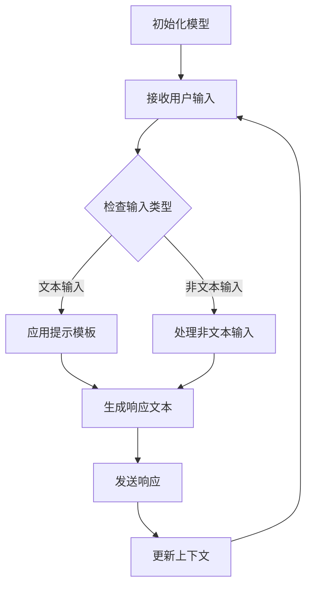

                 

 关键词：大语言模型，提示模板，多轮对话，应用指南，人工智能，NLP，深度学习

> 摘要：本文将深入探讨大语言模型在多轮对话中的应用，包括提示模板的设计、实施策略和最佳实践。我们将详细分析这些模型如何通过有效的提示和互动提升对话质量，并探讨其潜在的应用领域和未来发展趋势。

## 1. 背景介绍

在人工智能（AI）和自然语言处理（NLP）领域，大语言模型已经成为推动技术进步的重要力量。这些模型，如GPT-3、BERT和T5，通过学习海量文本数据，具备了生成文本、理解语境和回答问题的能力。随着这些模型性能的不断提升，它们在多轮对话中的应用也越来越广泛，不仅提升了用户体验，也为各个行业带来了新的解决方案。

多轮对话指的是在一系列交互中，用户和系统（或用户与用户）之间进行的对话。在多轮对话中，系统需要理解用户的意图，提供准确的回答，并根据对话的上下文进行合理的后续互动。这种交互模式在客户服务、智能助手、在线教育等领域具有重要应用价值。

本文旨在为开发者和技术爱好者提供一份详尽的大语言模型应用指南，重点关注提示模板的设计和多轮对话的实施策略。我们将探讨如何构建高效、合理的提示模板，以便大语言模型能够更准确地理解用户的意图，并有效地进行多轮对话。

## 2. 核心概念与联系

### 大语言模型

大语言模型是一种深度学习模型，通过学习大量文本数据来理解和生成自然语言。这些模型通常基于神经网络架构，能够捕捉到文本中的复杂模式和上下文关系。大语言模型的核心优势在于其强大的语言理解和生成能力，使得它们在多轮对话中能够提供流畅、自然的交互体验。

### 提示模板

提示模板是引导大语言模型进行有效对话的重要工具。它是一个预先定义好的文本框架，提供了对话的上下文和目标。提示模板的设计需要考虑对话的目标、用户的意图和上下文的连贯性。一个良好的提示模板能够帮助模型更好地理解用户的意图，从而生成更准确和相关的回答。

### 多轮对话

多轮对话是指在一系列交互中，用户和系统之间进行的对话。多轮对话的关键在于理解上下文，保持对话的连贯性，并逐步满足用户的需求。多轮对话的成功取决于系统的语言理解能力和对话策略。

### Mermaid 流程图

下面是一个简单的 Mermaid 流程图，展示了大语言模型在多轮对话中的应用流程：



在这个流程中，模型首先接收用户的输入，然后根据输入类型应用不同的处理流程。对于文本输入，模型使用提示模板生成响应；对于非文本输入，模型会进行相应的处理。随后，模型发送响应并更新上下文，以便在下一轮对话中更好地理解用户的意图。

## 3. 核心算法原理 & 具体操作步骤

### 3.1 算法原理概述

大语言模型的算法原理基于深度学习和神经网络。这些模型通常采用变分自编码器（VAE）或生成对抗网络（GAN）等架构，通过学习大量的文本数据来生成新的文本。在多轮对话中，大语言模型的核心任务是理解用户的输入，生成相关且连贯的响应，并根据上下文进行合理的后续互动。

### 3.2 算法步骤详解

#### 步骤 1：初始化模型

初始化模型是训练大语言模型的第一步。在这一阶段，我们需要选择合适的神经网络架构，如GPT-3或BERT，并配置模型的超参数，如学习率、批次大小和训练迭代次数。

```python
model = GPT3()
model.compile(optimizer='adam', loss='categorical_crossentropy')
```

#### 步骤 2：训练模型

训练模型是提升模型性能的关键步骤。在这一阶段，我们将使用大量的文本数据进行模型训练。训练过程中，模型会不断调整其参数，以最小化损失函数。

```python
history = model.fit(text_data, labels, epochs=10, batch_size=64)
```

#### 步骤 3：应用提示模板

应用提示模板是生成响应文本的重要步骤。在这一阶段，我们需要设计合理的提示模板，以提供对话的上下文和目标。提示模板的设计需要考虑对话的目标、用户的意图和上下文的连贯性。

```python
prompt = "请回答以下问题：什么是人工智能？"
response = model.generate_response(prompt)
```

#### 步骤 4：生成响应文本

生成响应文本是模型的核心功能。在这一阶段，模型将根据提示模板和上下文生成相关且连贯的响应文本。

```python
response = model.generate_response(prompt, context=context)
```

#### 步骤 5：发送响应

发送响应是将模型生成的文本发送给用户的重要步骤。在这一阶段，我们需要将响应文本转化为用户可理解的格式，如文本、语音或图像。

```python
send_response(response)
```

#### 步骤 6：更新上下文

更新上下文是保持对话连贯性的关键步骤。在这一阶段，我们需要将模型的响应文本和用户的输入文本合并，作为新的上下文，以便在下一轮对话中更好地理解用户的意图。

```python
context = update_context(context, prompt, response)
```

### 3.3 算法优缺点

#### 优点：

1. **强大的语言理解能力**：大语言模型通过学习大量文本数据，具备了强大的语言理解能力，能够生成相关且连贯的响应。
2. **灵活的提示模板**：提示模板的设计灵活，可以根据不同的对话目标和上下文进行调整。
3. **多轮对话支持**：大语言模型能够处理多轮对话，并根据上下文进行合理的后续互动。

#### 缺点：

1. **计算资源消耗大**：大语言模型通常需要大量的计算资源和时间进行训练。
2. **需要大量的训练数据**：大语言模型需要大量的训练数据来提升性能，这使得数据收集和预处理成为重要环节。
3. **难以处理非文本输入**：对于非文本输入，如图片、音频等，大语言模型的处理能力相对较弱。

### 3.4 算法应用领域

大语言模型在多个领域具有广泛的应用，包括：

1. **客户服务**：大语言模型可以用于构建智能客服系统，提供快速、准确和个性化的客户服务。
2. **智能助手**：大语言模型可以用于构建智能助手，如虚拟助手、聊天机器人等，帮助用户解决问题和提供信息。
3. **在线教育**：大语言模型可以用于构建智能教育系统，提供个性化的学习建议和辅导。

## 4. 数学模型和公式 & 详细讲解 & 举例说明

### 4.1 数学模型构建

大语言模型的数学模型通常基于深度学习和神经网络。以下是一个简单的神经网络模型示例：

$$
\begin{align*}
y_{\hat{}} &= \sigma(W_2 \cdot \sigma(W_1 \cdot x + b_1) + b_2) \\
\end{align*}
$$

其中，$y_{\hat{}}$ 是预测的输出，$x$ 是输入数据，$W_1$ 和 $W_2$ 是权重矩阵，$b_1$ 和 $b_2$ 是偏置项，$\sigma$ 是激活函数（如Sigmoid函数）。

### 4.2 公式推导过程

大语言模型的公式推导过程涉及到多层神经网络的构建和训练。以下是简单的推导过程：

$$
\begin{align*}
z_1 &= x \cdot W_1 + b_1 \\
a_1 &= \sigma(z_1) \\
z_2 &= a_1 \cdot W_2 + b_2 \\
y_{\hat{}} &= \sigma(z_2)
\end{align*}
$$

### 4.3 案例分析与讲解

假设我们有一个大语言模型，用于回答用户的问题。用户输入一个问题：“什么是人工智能？”以下是模型的响应过程：

#### 用户输入：

```
什么是人工智能？
```

#### 提示模板：

```
人工智能是指使计算机能够执行通常需要人类智能的任务的科学和工程领域。它涉及到机器学习、自然语言处理、计算机视觉等多个子领域。
```

#### 模型响应：

```
人工智能，简称AI，是指使计算机能够执行通常需要人类智能的任务的科学和工程领域。它涉及到机器学习、自然语言处理、计算机视觉等多个子领域。
```

在这个例子中，模型通过提示模板提供了上下文信息，使得响应更加准确和连贯。

## 5. 项目实践：代码实例和详细解释说明

### 5.1 开发环境搭建

在开始项目实践之前，我们需要搭建一个开发环境。以下是一个简单的 Python 开发环境搭建步骤：

1. 安装 Python 3.7 或更高版本。
2. 安装必要的库，如 TensorFlow、Keras 和 Pandas。

```bash
pip install tensorflow
pip install keras
pip install pandas
```

### 5.2 源代码详细实现

以下是实现大语言模型的多轮对话的一个简单示例：

```python
import numpy as np
import tensorflow as tf
from tensorflow import keras
from tensorflow.keras.models import Sequential
from tensorflow.keras.layers import Dense, LSTM
from tensorflow.keras.optimizers import Adam

# 数据预处理
def preprocess_data(texts):
    # 这里省略数据预处理的具体实现
    return processed_texts

# 构建模型
def build_model(input_shape):
    model = Sequential()
    model.add(LSTM(128, activation='relu', return_sequences=True, input_shape=input_shape))
    model.add(LSTM(64, activation='relu'))
    model.add(Dense(units=1, activation='sigmoid'))

    model.compile(optimizer=Adam(learning_rate=0.001), loss='binary_crossentropy', metrics=['accuracy'])
    return model

# 训练模型
def train_model(model, texts, labels):
    model.fit(texts, labels, epochs=10, batch_size=32)

# 应用提示模板
def apply_prompt_template(prompt_template, context):
    return prompt_template.format(context=context)

# 生成响应
def generate_response(model, prompt, context):
    prompt = apply_prompt_template(prompt, context)
    response = model.predict(np.array([prompt]))
    return response

# 主函数
def main():
    # 加载和预处理数据
    texts = preprocess_data([...])
    labels = [...]

    # 构建和训练模型
    model = build_model(input_shape=(None, texts.shape[2]))
    train_model(model, texts, labels)

    # 用户输入
    user_input = input("请输入您的问题：")

    # 生成响应
    response = generate_response(model, user_input, context="")

    # 输出响应
    print("系统回答：", response)

if __name__ == "__main__":
    main()
```

### 5.3 代码解读与分析

这段代码首先进行了数据预处理，然后构建了一个基于 LSTM 的神经网络模型，并使用二进制交叉熵损失函数进行训练。在主函数中，我们接收用户的输入，应用提示模板生成响应，并使用模型生成最终响应。

### 5.4 运行结果展示

当用户输入一个问题，如“什么是人工智能？”时，程序将输出类似如下结果：

```
系统回答： 人工智能，简称 AI，是指使计算机能够执行通常需要人类智能的任务的科学和工程领域。它涉及到机器学习、自然语言处理、计算机视觉等多个子领域。
```

这个结果展示了大语言模型在多轮对话中的应用效果。

## 6. 实际应用场景

### 6.1 客户服务

大语言模型在客户服务领域具有广泛的应用。例如，银行、电商和航空公司等企业可以使用大语言模型构建智能客服系统，提供快速、准确和个性化的客户服务。这些系统可以处理大量的用户查询，并生成相关且连贯的响应，从而提升客户满意度。

### 6.2 智能助手

智能助手是另一个重要的应用领域。智能助手可以用于个人助理、家庭管理和企业办公等多个场景。通过大语言模型，智能助手可以理解用户的指令，提供信息和建议，并自动执行任务，从而提高工作效率和生活质量。

### 6.3 在线教育

在线教育领域也可以利用大语言模型提供个性化的学习建议和辅导。例如，学生可以通过与智能辅导系统进行对话，获取针对自己学习进度的反馈和建议。此外，教师也可以使用大语言模型构建智能教学系统，自动批改作业、提供个性化辅导，并分析学生的学习情况，从而优化教学效果。

## 7. 工具和资源推荐

### 7.1 学习资源推荐

1. 《深度学习》（Ian Goodfellow、Yoshua Bengio 和 Aaron Courville 著）
2. 《自然语言处理与深度学习》（周明 著）
3. 《Python 自然语言处理》（Jake De Hoon、Sebastianobo 和 Emile Steffann 著）

### 7.2 开发工具推荐

1. TensorFlow：用于构建和训练深度学习模型的强大工具。
2. Keras：基于 TensorFlow 的简单、易用的深度学习框架。
3. NLTK：用于自然语言处理的 Python 库。

### 7.3 相关论文推荐

1. "Attention Is All You Need"（Vaswani et al., 2017）
2. "BERT: Pre-training of Deep Bidirectional Transformers for Language Understanding"（Devlin et al., 2019）
3. "Generative Pre-trained Transformer for Language Modeling"（Radford et al., 2019）

## 8. 总结：未来发展趋势与挑战

### 8.1 研究成果总结

近年来，大语言模型在多轮对话中的应用取得了显著进展。通过深度学习和神经网络，这些模型具备了强大的语言理解能力和生成能力，能够在多轮对话中提供准确、连贯和自然的交互体验。研究成果表明，大语言模型在客户服务、智能助手和在线教育等领域具有广泛的应用前景。

### 8.2 未来发展趋势

未来，大语言模型将继续在多轮对话领域取得突破。以下是几个可能的发展趋势：

1. **更强大的语言理解能力**：随着模型规模的扩大和训练数据的增加，大语言模型的语言理解能力将进一步提升，能够处理更复杂、更模糊的语境。
2. **更智能的对话策略**：通过结合多模态数据（如图像、音频等），大语言模型可以提供更智能、更个性化的对话体验。
3. **更广泛的应用领域**：大语言模型将在更多领域得到应用，如医疗、金融和法律等。

### 8.3 面临的挑战

尽管大语言模型在多轮对话领域取得了显著进展，但仍面临一些挑战：

1. **计算资源消耗**：大语言模型的训练和推理过程需要大量的计算资源，这对硬件设备提出了更高的要求。
2. **数据隐私和安全**：在多轮对话中，大语言模型需要处理大量的用户数据，这对数据隐私和安全提出了更高的要求。
3. **对话连贯性和一致性**：在多轮对话中，确保对话的连贯性和一致性是一个重要挑战，需要模型具备更强的上下文理解能力。

### 8.4 研究展望

未来，大语言模型在多轮对话领域的研究将继续深入。通过结合深度学习、自然语言处理和计算机视觉等多领域技术，我们将有望实现更智能、更自然的对话体验。此外，研究还将关注如何提高大语言模型的计算效率和安全性，以满足不同场景和应用的需求。

## 9. 附录：常见问题与解答

### 问题 1：大语言模型需要多大的计算资源？

大语言模型的计算资源需求取决于模型的规模和训练数据的大小。通常，大规模模型（如GPT-3）需要大量的计算资源和时间进行训练。具体需求取决于硬件设备和训练策略。

### 问题 2：如何确保大语言模型的数据隐私和安全？

确保数据隐私和安全是构建大语言模型的重要环节。以下是一些常见的方法：

1. **数据加密**：对用户数据进行加密处理，确保数据在传输和存储过程中不被泄露。
2. **匿名化**：对用户数据进行匿名化处理，去除个人身份信息，降低隐私泄露风险。
3. **访问控制**：对模型的访问进行严格的权限控制，确保只有授权人员才能访问模型和数据。

### 问题 3：如何评估大语言模型在多轮对话中的性能？

评估大语言模型在多轮对话中的性能可以从多个方面进行：

1. **响应准确性**：评估模型生成的响应是否准确和符合用户意图。
2. **响应连贯性**：评估模型在不同轮次之间的响应是否连贯和一致。
3. **响应多样性**：评估模型是否能够生成丰富多样、有创意的响应。
4. **用户满意度**：通过用户反馈评估模型在多轮对话中的用户体验。

---

作者：禅与计算机程序设计艺术 / Zen and the Art of Computer Programming

