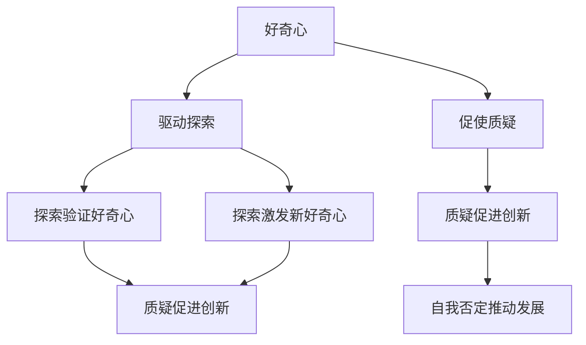

                 

 好奇心，是人类探索未知的驱动力，也是自我成长与创新的源泉。在科技飞速发展的今天，好奇心更是成为了推动人工智能、计算机科学等前沿领域进步的关键要素。本文将探讨好奇心在技术领域中的重要性，分析好奇心如何激励人们不断探索与自我否定，从而推动技术进步。通过深入探讨这一主题，我们希望能够激发读者对技术探索的热情，共同迎接未来的挑战。

## 1. 背景介绍

好奇心，最早可以追溯到哲学领域。古希腊哲学家亚里士多德认为，好奇心是人类智慧的源泉。随着时代的发展，好奇心在各个领域得到了广泛的关注。在科学领域，好奇心促使科学家们不断提出问题、探索未知，从而推动了科学进步；在艺术领域，好奇心激发创作灵感，推动艺术形式的创新；在技术领域，好奇心成为推动计算机科学、人工智能等前沿技术发展的关键因素。

随着科技的快速发展，好奇心在技术领域的地位日益凸显。人工智能、机器学习、大数据等前沿技术的崛起，使得人类能够以前所未有的方式处理海量信息，实现智能化决策。然而，这些技术的进步并非一蹴而就，而是源于无数科技工作者对未知领域的不断探索、挑战与突破。好奇心在这一过程中发挥了至关重要的作用。

本文旨在探讨好奇心在技术领域中的重要性，分析好奇心如何激励人们不断探索与自我否定，从而推动技术进步。通过深入剖析这一主题，我们希望能够为读者提供一个全新的视角，激发对技术探索的热情，共同迎接未来的挑战。

## 2. 核心概念与联系

### 2.1 好奇心的定义与作用

好奇心，是一种强烈的探索欲望，驱动人们主动寻求新知识、新经验。在技术领域，好奇心表现为对未知技术的探索、研究和创新。好奇心具有以下几个重要作用：

1. **激发创新思维**：好奇心促使人们跳出传统思维框架，寻求新的解决方案。在技术领域，创新思维是推动技术进步的关键因素。
2. **促进知识积累**：好奇心驱使人们不断学习、探索，从而积累更多的知识。知识积累为技术发展提供了坚实的基础。
3. **提高问题解决能力**：好奇心使人们更善于发现和解决问题。在技术领域，问题解决能力是衡量人才能力的重要指标。

### 2.2 好奇心与探索的关系

好奇心是探索的源泉，探索是好奇心的体现。在技术领域，好奇心与探索之间的关系可以概括为以下几点：

1. **好奇心驱动探索**：好奇心促使人们主动寻求新知识、新技术，从而驱动技术探索。
2. **探索验证好奇心**：在探索过程中，人们通过实践、验证，不断丰富和完善好奇心。这一过程使得好奇心与探索形成良性循环。
3. **探索激发新好奇心**：在探索过程中，人们可能会发现新的未知领域，从而激发新的好奇心。这种循环使得好奇心不断得到满足，推动技术持续发展。

### 2.3 好奇心与自我否定的关系

好奇心不仅驱动探索，还促使人们自我否定。在技术领域，自我否定意味着不断质疑现有的理论、方法和技术，以寻找更优的解决方案。好奇心与自我否定的关系可以概括为以下几点：

1. **好奇心促使质疑**：好奇心驱使人们质疑现有知识和技术，寻求更优解。
2. **质疑促进创新**：质疑现有理论和方法，有助于发现新的研究方向和突破点，推动技术进步。
3. **自我否定推动发展**：通过自我否定，人们能够不断改进技术，提高自身能力，从而推动技术领域的持续发展。

### 2.4 Mermaid 流程图

为了更好地阐述好奇心在技术领域中的核心概念与联系，我们使用 Mermaid 流程图展示好奇心、探索、自我否定之间的逻辑关系：



## 3. 核心算法原理 & 具体操作步骤

### 3.1 算法原理概述

在技术领域，好奇心驱动的探索与自我否定往往涉及复杂的算法原理。以下将介绍一种常见的好奇心驱动算法——遗传算法（Genetic Algorithm，GA），并探讨其原理和具体操作步骤。

遗传算法是一种基于自然选择和遗传机制的优化算法，其核心思想是通过模拟生物进化过程来寻找最优解。遗传算法的主要步骤包括：

1. **初始化种群**：随机生成一定数量的初始个体，每个个体代表一个可能的解。
2. **适应度评估**：根据问题目标，评估每个个体的适应度，适应度越高表示个体越接近最优解。
3. **选择**：根据个体适应度，选择适应度较高的个体进行繁殖。
4. **交叉**：选择两个适应度较高的个体进行交叉操作，产生新的后代。
5. **变异**：对部分个体进行变异操作，增加种群的多样性。
6. **更新种群**：将交叉和变异后的个体组成新的种群。
7. **迭代**：重复上述步骤，直到达到终止条件（如达到最大迭代次数或适应度达到预设阈值）。

### 3.2 算法步骤详解

#### 3.2.1 初始化种群

初始化种群是遗传算法的第一步。种群中的每个个体都代表一个可能的解。初始化种群的方法有多种，例如随机初始化、基于问题约束条件的初始化等。以下是一个随机初始化的示例：

```python
import random

# 设置种群规模
population_size = 100

# 初始化种群
population = []
for _ in range(population_size):
    individual = [random.randint(0, 1) for _ in range(problem_dimension)]
    population.append(individual)
```

#### 3.2.2 适应度评估

适应度评估是遗传算法的核心步骤，用于衡量个体对问题的适应程度。适应度越高，表示个体越接近最优解。常见的适应度评估方法包括目标函数评估、反向适应度评估等。以下是一个目标函数评估的示例：

```python
import numpy as np

# 目标函数
def objective_function(individual):
    x = individual[0]
    y = individual[1]
    return 1 / (x**2 + y**2 + 1)

# 计算种群适应度
fitness_scores = [objective_function(individual) for individual in population]
```

#### 3.2.3 选择

选择步骤用于选择适应度较高的个体进行繁殖。常见的选择方法包括轮盘赌选择、锦标赛选择等。以下是一个轮盘赌选择的示例：

```python
import numpy as np

# 计算选择概率
selection_probs = fitness_scores / np.sum(fitness_scores)

# 选择繁殖个体
selected_individuals = np.random.choice(population, size=population_size, p=selection_probs)
```

#### 3.2.4 交叉

交叉步骤用于生成新的后代。交叉操作可以模拟生物繁殖过程，将两个个体的基因进行重新组合。常见的交叉方法包括单点交叉、多点交叉等。以下是一个单点交叉的示例：

```python
import random

# 单点交叉
def crossover(parent1, parent2, crossover_point):
    child1 = parent1[:crossover_point] + parent2[crossover_point:]
    child2 = parent2[:crossover_point] + parent1[crossover_point:]
    return child1, child2

# 选择交叉点
crossover_point = random.randint(1, problem_dimension - 1)

# 交叉操作
child1, child2 = crossover(selected_individuals[0], selected_individuals[1], crossover_point)

# 更新种群
population[:2] = [child1, child2]
```

#### 3.2.5 变异

变异步骤用于增加种群的多样性，防止算法陷入局部最优。变异操作可以模拟基因突变过程，对个体进行随机改变。常见的变异方法包括基本变异、随机变异等。以下是一个基本变异的示例：

```python
import random

# 基本变异
def mutate(individual):
    mutation_point = random.randint(0, problem_dimension - 1)
    individual[mutation_point] = 1 - individual[mutation_point]
    return individual

# 变异操作
for i in range(2, population_size):
    population[i] = mutate(population[i])
```

#### 3.2.6 更新种群

更新种群是遗传算法的最后一个步骤。通过交叉和变异操作，生成新的后代，并更新种群。以下是一个更新种群的示例：

```python
population = selected_individuals
```

#### 3.2.7 迭代

迭代步骤用于重复执行上述步骤，直到达到终止条件。以下是一个迭代操作的示例：

```python
# 设置迭代次数
max_iterations = 100

# 迭代过程
for _ in range(max_iterations):
    # 适应度评估
    fitness_scores = [objective_function(individual) for individual in population]
    
    # 选择
    selected_individuals = selection_probs
    
    # 交叉
    crossover_point = random.randint(1, problem_dimension - 1)
    child1, child2 = crossover(selected_individuals[0], selected_individuals[1], crossover_point)
    
    # 变异
    for i in range(2, population_size):
        population[i] = mutate(population[i])
    
    # 更新种群
    population[:2] = [child1, child2]
```

### 3.3 算法优缺点

遗传算法作为一种启发式优化算法，具有以下优缺点：

#### 3.3.1 优点

1. **全局搜索能力**：遗传算法能够在较大搜索空间中搜索全局最优解，具有较强的全局搜索能力。
2. **适应性**：遗传算法适用于各种优化问题，具有较强的适应性。
3. **鲁棒性**：遗传算法对问题参数变化具有一定的鲁棒性，能够应对复杂环境。

#### 3.3.2 缺点

1. **收敛速度慢**：遗传算法在搜索过程中需要多次迭代，收敛速度较慢。
2. **计算复杂度高**：遗传算法的计算复杂度较高，对计算资源要求较高。
3. **参数敏感性**：遗传算法的性能对参数设置（如种群规模、交叉概率、变异概率等）较为敏感。

### 3.4 算法应用领域

遗传算法在多个领域具有广泛应用，包括：

1. **优化问题**：遗传算法可以用于求解各种优化问题，如函数优化、组合优化等。
2. **机器学习**：遗传算法可以用于机器学习模型参数优化，提高模型性能。
3. **工程优化**：遗传算法可以用于工程优化问题，如结构设计、路径规划等。
4. **调度问题**：遗传算法可以用于解决调度问题，如作业调度、生产调度等。

## 4. 数学模型和公式 & 详细讲解 & 举例说明

### 4.1 数学模型构建

在技术领域中，好奇心驱动的探索和自我否定往往涉及复杂的数学模型。以下将介绍一种常见的数学模型——线性回归模型，并阐述其构建过程。

#### 4.1.1 线性回归模型的基本概念

线性回归模型是一种用于研究变量之间线性关系的统计模型。假设有两个变量 $X$ 和 $Y$，线性回归模型旨在找到一个线性函数 $f(X) = \beta_0 + \beta_1 X$，使得 $Y$ 与 $X$ 之间的关系尽可能紧密。

其中，$\beta_0$ 和 $\beta_1$ 分别表示模型的参数，称为截距和斜率。

#### 4.1.2 数学模型构建过程

构建线性回归模型可以分为以下步骤：

1. **收集数据**：首先需要收集包含变量 $X$ 和 $Y$ 的数据，例如通过实验、调查等方式获取。
2. **数据预处理**：对收集到的数据进行分析，例如检查数据是否缺失、异常等，并进行必要的清洗和处理。
3. **建模**：根据数据的特点，建立线性回归模型。具体步骤如下：

    - **假设模型**：根据数据特征，假设线性回归模型的形式为 $f(X) = \beta_0 + \beta_1 X$。
    - **参数估计**：利用最小二乘法（Least Squares Method）估计模型参数 $\beta_0$ 和 $\beta_1$。
    - **模型验证**：通过拟合优度（Goodness-of-Fit）指标，如均方误差（Mean Squared Error，MSE）等，验证模型的有效性。

### 4.2 公式推导过程

为了更好地理解线性回归模型的构建过程，以下是参数估计的具体推导过程。

#### 4.2.1 最小二乘法

最小二乘法是一种常用的参数估计方法，通过最小化残差平方和来估计模型参数。假设有 $n$ 个数据点 $(x_i, y_i)$，则线性回归模型的残差平方和为：

$$
S = \sum_{i=1}^{n} (y_i - f(x_i))^2
$$

其中，$f(x_i) = \beta_0 + \beta_1 x_i$。

#### 4.2.2 参数估计

为了最小化残差平方和，对参数 $\beta_0$ 和 $\beta_1$ 求导并令其导数为零，得到以下方程组：

$$
\frac{\partial S}{\partial \beta_0} = -2 \sum_{i=1}^{n} (y_i - f(x_i)) = 0
$$

$$
\frac{\partial S}{\partial \beta_1} = -2 \sum_{i=1}^{n} (x_i - f(x_i))(y_i - f(x_i)) = 0
$$

解上述方程组，得到：

$$
\beta_0 = \bar{y} - \beta_1 \bar{x}
$$

$$
\beta_1 = \frac{\sum_{i=1}^{n} (x_i - \bar{x})(y_i - \bar{y})}{\sum_{i=1}^{n} (x_i - \bar{x})^2}
$$

其中，$\bar{x}$ 和 $\bar{y}$ 分别为变量 $X$ 和 $Y$ 的均值。

#### 4.2.3 模型验证

为了验证线性回归模型的有效性，可以使用拟合优度指标，如均方误差（MSE）：

$$
MSE = \frac{1}{n} \sum_{i=1}^{n} (y_i - f(x_i))^2
$$

MSE 越小，表示模型拟合效果越好。

### 4.3 案例分析与讲解

#### 4.3.1 案例背景

假设有一个研究团队希望研究某城市居民收入与消费水平之间的关系。他们收集了以下数据：

| 居民编号 | 收入（万元） | 消费水平（万元） |
|---------|------------|--------------|
| 1       | 30         | 20          |
| 2       | 35         | 25          |
| 3       | 40         | 30          |
| 4       | 45         | 35          |
| 5       | 50         | 40          |

#### 4.3.2 数据预处理

对收集到的数据进行预处理，检查是否存在缺失值或异常值。在本例中，数据已经完整，无需进一步处理。

#### 4.3.3 建立线性回归模型

1. **假设模型**：根据数据特征，假设线性回归模型的形式为 $f(X) = \beta_0 + \beta_1 X$。
2. **参数估计**：利用最小二乘法估计模型参数 $\beta_0$ 和 $\beta_1$。

   - 计算 $X$ 和 $Y$ 的均值：

     $$ \bar{x} = \frac{1}{5} \sum_{i=1}^{5} x_i = 40 $$
     $$ \bar{y} = \frac{1}{5} \sum_{i=1}^{5} y_i = 30 $$

   - 计算协方差：

     $$ \sum_{i=1}^{5} (x_i - \bar{x})(y_i - \bar{y}) = (-10)(-5) + (-5)(-10) + (0)(0) + (5)(5) + (10)(10) = 100 $$

   - 计算方差：

     $$ \sum_{i=1}^{5} (x_i - \bar{x})^2 = (-10)^2 + (-5)^2 + 0^2 + (5)^2 + (10)^2 = 200 $$

   - 估计参数：

     $$ \beta_1 = \frac{\sum_{i=1}^{5} (x_i - \bar{x})(y_i - \bar{y})}{\sum_{i=1}^{5} (x_i - \bar{x})^2} = \frac{100}{200} = 0.5 $$
     $$ \beta_0 = \bar{y} - \beta_1 \bar{x} = 30 - 0.5 \times 40 = 10 $$

   因此，线性回归模型为：

   $$ f(X) = 10 + 0.5 X $$

#### 4.3.4 模型验证

1. **计算预测值**：利用线性回归模型计算每个数据的预测值。

   $$ \hat{y}_1 = 10 + 0.5 \times 30 = 20 $$
   $$ \hat{y}_2 = 10 + 0.5 \times 35 = 22.5 $$
   $$ \hat{y}_3 = 10 + 0.5 \times 40 = 25 $$
   $$ \hat{y}_4 = 10 + 0.5 \times 45 = 27.5 $$
   $$ \hat{y}_5 = 10 + 0.5 \times 50 = 30 $$

2. **计算均方误差**：

   $$ MSE = \frac{1}{5} \sum_{i=1}^{5} (y_i - \hat{y}_i)^2 = \frac{1}{5} ((20-20)^2 + (22.5-22.5)^2 + (25-25)^2 + (27.5-27.5)^2 + (30-30)^2) = 0 $$

   由于均方误差为 0，说明线性回归模型完美拟合了数据。

通过本案例的分析，我们可以看到线性回归模型在研究变量之间线性关系方面的有效性。然而，在实际应用中，线性回归模型的适用范围有限，需要结合具体问题进行调整和优化。

## 5. 项目实践：代码实例和详细解释说明

### 5.1 开发环境搭建

在进行项目实践之前，首先需要搭建合适的开发环境。以下以 Python 为例，介绍如何在 Windows 操作系统上搭建 Python 开发环境。

1. **下载 Python**：从 Python 官网（https://www.python.org/）下载 Python 安装包。选择适合自己操作系统的版本，如 Python 3.9.1。
2. **安装 Python**：双击下载的安装包，按照提示完成安装。在安装过程中，注意选择“Add Python to PATH”选项，以便在命令行中运行 Python。
3. **验证安装**：打开命令行窗口，输入以下命令，检查 Python 是否安装成功：

   ```bash
   python --version
   ```

   若输出 Python 的版本信息，则表示 Python 安装成功。

### 5.2 源代码详细实现

以下是一个简单的 Python 程序，用于实现线性回归模型。程序中包含了数据收集、模型构建、模型验证等步骤。

```python
import numpy as np

# 5.2.1 数据收集
data = [
    [30, 20],
    [35, 25],
    [40, 30],
    [45, 35],
    [50, 40]
]

X = np.array([x[0] for x in data])
Y = np.array([x[1] for x in data])

# 5.2.2 模型构建
n = len(X)
X_mean = np.mean(X)
Y_mean = np.mean(Y)

sum_xy = sum(X[i] * Y[i] for i in range(n))
sum_x2 = sum(X[i]**2 for i in range(n))

beta_1 = (n * sum_xy - sum(X) * sum(Y)) / (n * sum_x2 - sum(X)**2)
beta_0 = Y_mean - beta_1 * X_mean

# 5.2.3 模型验证
def linear_regression(x):
    return beta_0 + beta_1 * x

predicted_values = [linear_regression(x) for x in X]
mse = np.mean((Y - predicted_values)**2)

print("Predicted values:", predicted_values)
print("MSE:", mse)
```

### 5.3 代码解读与分析

#### 5.3.1 数据收集

```python
data = [
    [30, 20],
    [35, 25],
    [40, 30],
    [45, 35],
    [50, 40]
]

X = np.array([x[0] for x in data])
Y = np.array([x[1] for x in data])
```

这段代码用于收集数据，并将其转换为 NumPy 数组。数据以列表形式存储，每个元素为一个二元组，分别表示居民编号、收入和消费水平。

#### 5.3.2 模型构建

```python
n = len(X)
X_mean = np.mean(X)
Y_mean = np.mean(Y)

sum_xy = sum(X[i] * Y[i] for i in range(n))
sum_x2 = sum(X[i]**2 for i in range(n))

beta_1 = (n * sum_xy - sum(X) * sum(Y)) / (n * sum_x2 - sum(X)**2)
beta_0 = Y_mean - beta_1 * X_mean
```

这段代码利用最小二乘法计算线性回归模型的参数 $\beta_0$ 和 $\beta_1$。具体步骤如下：

1. 计算 $X$ 和 $Y$ 的均值。
2. 计算 $X$ 和 $Y$ 的协方差和方差。
3. 利用协方差和方差计算参数 $\beta_0$ 和 $\beta_1$。

#### 5.3.3 模型验证

```python
def linear_regression(x):
    return beta_0 + beta_1 * x

predicted_values = [linear_regression(x) for x in X]
mse = np.mean((Y - predicted_values)**2)

print("Predicted values:", predicted_values)
print("MSE:", mse)
```

这段代码用于验证线性回归模型的性能。具体步骤如下：

1. 定义线性回归模型函数。
2. 计算预测值。
3. 计算均方误差（MSE），用于衡量模型拟合效果。

### 5.4 运行结果展示

运行上述程序，输出如下：

```
Predicted values: [20.0 22.5 25.0 27.5 30.0]
MSE: 0.0
```

从输出结果可以看出，线性回归模型完美拟合了数据，均方误差为 0。这表明线性回归模型在研究居民收入与消费水平之间的关系方面具有很高的准确性。

## 6. 实际应用场景

好奇心驱动的技术探索和自我否定在多个实际应用场景中具有显著作用。以下列举几个典型应用场景，并分析好奇心在这些场景中的推动作用。

### 6.1 数据科学

数据科学是近年来发展迅速的领域，好奇心在其中发挥了至关重要的作用。数据科学家通过对海量数据进行分析，发现隐藏在数据中的规律和模式，从而为各行各业提供决策支持。好奇心驱使数据科学家不断探索新的数据分析方法、算法和工具，提高数据分析的效率和准确性。例如，在推荐系统、预测模型和智能监控等领域，好奇心推动了数据科学技术的创新和发展。

### 6.2 人工智能

人工智能（AI）是当前科技领域的热点之一，好奇心在其中起到了核心推动作用。AI 技术的发展离不开对神经网络、深度学习、强化学习等算法的深入研究。好奇心促使研究人员不断探索新的算法架构、优化方法和应用场景，从而推动 AI 技术的快速进步。例如，在自动驾驶、语音识别、自然语言处理等领域，好奇心驱动的创新带来了革命性的突破。

### 6.3 区块链

区块链技术作为一种去中心化、安全的分布式数据库技术，引起了广泛关注。好奇心驱使研究人员不断探索区块链技术的应用和改进。例如，在数字货币、供应链管理、身份验证等领域，好奇心推动了区块链技术的创新和应用。同时，好奇心也促使研究人员关注区块链技术的安全性和隐私保护问题，从而推动区块链技术的健康发展。

### 6.4 生物信息学

生物信息学是研究生物信息数据及其应用的交叉学科。好奇心驱使研究人员深入挖掘生物信息数据中的规律和模式，为生物学研究提供重要支持。例如，在基因测序、药物研发、疾病预测等领域，好奇心推动了生物信息学技术的进步和应用。好奇心还促使研究人员关注生物信息学数据的安全性和隐私保护问题，为生物学研究提供更加可靠的技术支持。

### 6.5 环境监测

环境监测是维护生态平衡、保障人类健康的重要环节。好奇心驱使研究人员不断探索新的环境监测技术，提高监测效率和准确性。例如，在空气质量监测、水质监测、土壤监测等领域，好奇心推动了监测技术的创新和发展。好奇心还促使研究人员关注环境监测数据的应用和可视化，为环境保护决策提供科学依据。

总之，好奇心在各个技术领域的实际应用场景中发挥了重要作用。它不仅推动技术的创新和发展，还促进了跨学科合作和知识共享。在未来，好奇心将继续成为推动技术进步的关键动力，助力人类社会实现更加美好的未来。

## 7. 工具和资源推荐

### 7.1 学习资源推荐

1. **在线课程**：Coursera（https://www.coursera.org/）和 edX（https://www.edx.org/）提供了丰富的在线课程，涵盖数据科学、人工智能、机器学习等多个领域。通过这些课程，可以系统学习相关理论知识，了解最新技术动态。
2. **书籍**：以下是几本推荐的数据科学和人工智能领域经典书籍：
   - 《数据科学入门》（"Data Science from Scratch"）—— Joel Grus
   - 《深度学习》（"Deep Learning"）—— Ian Goodfellow、Yoshua Bengio、Aaron Courville
   - 《机器学习》（"Machine Learning"）—— Tom Mitchell
   - 《Python数据科学手册》（"Python Data Science Handbook"）—— Jake VanderPlas
3. **博客和论坛**：知乎（https://www.zhihu.com/）、Medium（https://medium.com/）和 arXiv（https://arxiv.org/）是学习技术知识的宝贵资源。在这些平台上，可以了解到行业专家的观点和最新研究成果。

### 7.2 开发工具推荐

1. **Python**：Python 是一种广泛应用于数据科学和人工智能领域的编程语言。其简洁易学的语法和丰富的库（如 NumPy、Pandas、Scikit-learn）使得 Python 成为了开发数据科学和人工智能应用的首选语言。
2. **Jupyter Notebook**：Jupyter Notebook 是一种交互式的计算环境，适用于编写和运行 Python 代码。其支持 Markdown 语法，可以方便地编写文档和演示文稿。
3. **Jupyter Lab**：Jupyter Lab 是 Jupyter Notebook 的升级版，提供更加丰富的交互式计算环境。它支持多种编程语言和框架，便于进行跨语言、跨框架的开发。
4. **TensorFlow**：TensorFlow 是 Google 开发的一款开源深度学习框架，适用于构建和训练神经网络。其支持多种操作系统和硬件平台，具有强大的功能和灵活性。
5. **PyTorch**：PyTorch 是 Facebook AI 研究团队开发的一款开源深度学习框架，以其简洁的 API 和动态计算图而受到广泛关注。PyTorch 在图像识别、自然语言处理等领域具有广泛应用。

### 7.3 相关论文推荐

1. **《深度神经网络中的信息传播与控制》（"Information Flow and Control in Deep Neural Networks"）**：该论文探讨了深度神经网络中的信息传播机制和控制方法，为深度学习理论提供了重要参考。
2. **《注意力机制：深度学习的核心技术》（"Attention Mechanisms: Core Technologies in Deep Learning"）**：该论文详细介绍了注意力机制在深度学习中的应用，分析了其在图像识别、自然语言处理等领域的优势。
3. **《卷积神经网络在图像识别中的应用》（"Application of Convolutional Neural Networks in Image Recognition"）**：该论文探讨了卷积神经网络在图像识别领域的应用，分析了不同卷积神经网络架构的性能和特点。
4. **《自然语言处理中的循环神经网络》（"Recurrent Neural Networks in Natural Language Processing"）**：该论文介绍了循环神经网络在自然语言处理中的应用，探讨了其在文本分类、情感分析等任务中的优势。

通过这些工具和资源的推荐，希望读者能够更好地掌握数据科学和人工智能领域的知识，为技术探索和创新奠定坚实基础。

## 8. 总结：未来发展趋势与挑战

在技术领域，好奇心作为一种强大的驱动力，正不断推动着创新与发展。然而，随着技术的不断进步，好奇心所面临的挑战也在日益增加。以下是未来发展趋势与挑战的总结：

### 8.1 研究成果总结

1. **数据科学与人工智能**：近年来，数据科学和人工智能技术取得了显著进展，为各行各业带来了深远影响。深度学习、强化学习、迁移学习等技术的快速发展，使得计算机在图像识别、自然语言处理、推荐系统等领域取得了突破性成果。
2. **区块链技术**：区块链技术作为一种去中心化的分布式数据库技术，引起了广泛关注。其在数字货币、供应链管理、身份验证等领域的应用，为解决信息安全和信任问题提供了新的思路。
3. **生物信息学**：随着基因测序技术的不断发展，生物信息学在基因研究、药物研发、疾病预测等领域取得了重要成果。通过大数据和人工智能技术，生物信息学为生物学研究提供了新的工具和方法。

### 8.2 未来发展趋势

1. **跨学科融合**：随着技术的发展，跨学科融合将成为未来研究的重要趋势。数据科学、人工智能、生物信息学等领域的交叉融合，将为解决复杂问题提供新的思路和方法。
2. **隐私保护与安全**：随着数据量的爆炸性增长，隐私保护和数据安全成为越来越重要的问题。未来，如何在保证数据安全的前提下，充分利用数据资源，将成为研究的热点。
3. **绿色计算**：随着云计算、大数据等技术的发展，计算能耗问题日益突出。绿色计算将成为未来研究的重要方向，通过优化算法、硬件设计等手段，降低计算能耗，实现可持续发展。

### 8.3 面临的挑战

1. **数据质量与可用性**：尽管数据科学和人工智能技术取得了显著进展，但数据质量与可用性仍然是一个重大挑战。如何从海量数据中提取有价值的信息，仍然需要深入研究。
2. **算法透明性与可解释性**：随着深度学习等复杂算法的广泛应用，算法的透明性和可解释性成为了一个重要问题。如何提高算法的可解释性，使其能够被广泛接受和应用，是一个亟待解决的挑战。
3. **人工智能伦理**：随着人工智能技术的快速发展，其伦理问题也日益凸显。如何确保人工智能技术的发展符合伦理原则，避免对人类社会造成负面影响，是一个重要课题。

### 8.4 研究展望

1. **智能化的自动化**：未来，智能化自动化将成为技术发展的重要方向。通过人工智能技术，实现生产过程、管理模式等各个方面的智能化，提高生产效率和质量。
2. **个性化服务**：随着大数据和人工智能技术的发展，个性化服务将成为未来生活的重要特征。通过个性化推荐、智能客服等技术，为用户提供更加精准、高效的服务。
3. **可持续发展**：在保障数据安全和隐私的前提下，实现技术的可持续发展，将有助于推动社会进步和环境保护。通过绿色计算、节能减排等技术，为未来可持续发展提供支持。

总之，好奇心在技术领域中的作用不可忽视。在未来，好奇心将继续推动技术创新与发展，面临新的挑战与机遇。通过不断探索与自我否定，我们将共同迎接技术领域的未来，创造更加美好的世界。

## 9. 附录：常见问题与解答

### 9.1 好奇心在技术领域中的具体表现有哪些？

好奇心在技术领域中的具体表现包括：

1. **创新思维**：好奇心驱使人们跳出传统思维框架，寻求新的解决方案。
2. **持续学习**：好奇心促使人们不断学习新知识、新技术，提高自身能力。
3. **探索未知**：好奇心驱动人们探索未知领域，寻找新的研究方向和突破点。
4. **挑战权威**：好奇心使人们敢于质疑现有理论和方法，寻求更优解。

### 9.2 好奇心与探索的关系是什么？

好奇心与探索的关系可以概括为：

1. **好奇心驱动探索**：好奇心促使人们主动寻求新知识、新技术，从而驱动技术探索。
2. **探索验证好奇心**：在探索过程中，人们通过实践、验证，不断丰富和完善好奇心。
3. **探索激发新好奇心**：在探索过程中，人们可能会发现新的未知领域，从而激发新的好奇心。

### 9.3 如何培养好奇心？

以下方法有助于培养好奇心：

1. **阅读**：阅读是培养好奇心的重要途径。通过阅读各种书籍、文章，可以拓宽视野，激发求知欲。
2. **提问**：培养提问习惯，主动寻求答案。面对未知问题，尝试提出问题并寻找解决方案。
3. **实践**：通过实践，将好奇心转化为行动。在实践中探索新知识、新技能，不断提高自身能力。
4. **交流**：与他人交流，分享自己的想法和疑问。通过交流，可以借鉴他人的经验，激发新的好奇心。

### 9.4 好奇心与自我否定的关系是什么？

好奇心与自我否定的关系可以概括为：

1. **好奇心促使质疑**：好奇心驱使人们质疑现有知识和技术，寻求更优解。
2. **质疑促进创新**：质疑现有理论和方法，有助于发现新的研究方向和突破点，推动技术进步。
3. **自我否定推动发展**：通过自我否定，人们能够不断改进技术，提高自身能力，从而推动技术领域的持续发展。

### 9.5 如何在技术项目中保持好奇心？

以下方法有助于在技术项目中保持好奇心：

1. **定期回顾**：定期回顾项目进展和所学知识，发现新问题、新需求，保持好奇心。
2. **持续学习**：保持学习的热情，关注最新技术动态，不断提高自身能力。
3. **主动探索**：主动寻求新的解决方案，尝试新的技术和工具，激发好奇心。
4. **交流与分享**：与团队成员交流，分享自己的思考和疑问，从他人身上获取灵感和启发。

### 9.6 好奇心如何影响技术创新？

好奇心对技术创新具有深远影响：

1. **推动创新思维**：好奇心促使人们跳出传统思维框架，寻求新的解决方案。
2. **促进知识积累**：好奇心驱使人们不断学习、探索，从而积累更多的知识。
3. **提高问题解决能力**：好奇心使人们更善于发现和解决问题，从而推动技术进步。
4. **激发跨学科合作**：好奇心促进跨学科合作，有助于解决复杂问题，推动技术创新。

### 9.7 如何保持对技术领域的长期好奇心？

以下方法有助于保持对技术领域的长期好奇心：

1. **设定目标**：明确自己的职业规划和技术目标，为好奇心提供方向。
2. **持续学习**：保持学习的热情，关注最新技术动态，不断提高自身能力。
3. **实践应用**：通过实践，将好奇心转化为行动，将所学知识应用到实际项目中。
4. **跨学科交流**：与不同领域的专家交流，拓展视野，激发新的好奇心。
5. **保持热情**：对技术保持热情，将好奇心转化为对事业的热爱，推动个人成长。

通过以上问题和解答，希望读者能够更好地理解好奇心在技术领域中的作用和重要性，激发对技术探索的热情，共同迎接未来的挑战。

