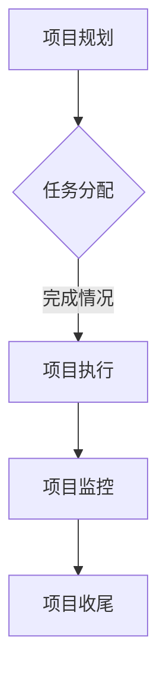

                 

 关键词：Basecamp、创业项目、团队协作、项目管理、工作流程、效率优化、沟通工具

> 摘要：本文旨在探讨如何利用Basecamp这一强大且易用的项目管理工具，帮助创业团队更好地进行项目协作和管理工作，提高团队效率和项目成功率。

## 1. 背景介绍

在当今快速发展的商业环境中，创业项目的成功往往依赖于团队的高效协作和精细化管理。Basecamp是一款广受欢迎的在线项目管理工具，它通过提供一个集中的平台，使团队成员可以协同工作、跟踪任务、管理项目和沟通交流。本文将深入探讨如何利用Basecamp进行创业项目的团队协作管理，帮助团队更好地实现目标。

## 2. 核心概念与联系

在介绍如何使用Basecamp进行项目管理之前，我们需要了解一些核心概念：

### 2.1 项目管理流程

项目管理流程是项目管理中的基础，通常包括项目规划、执行、监控和收尾。一个良好的项目管理流程可以确保项目目标的实现，并提高团队的工作效率。

### 2.2 团队协作

团队协作是指团队成员共同完成工作，通过沟通和合作实现项目目标。有效的团队协作可以提高团队的工作效率和创新能力。

### 2.3 沟通工具

沟通工具是团队协作的重要组成部分，它有助于团队成员之间的实时沟通和问题解决。Basecamp正是这样一种工具。

### 2.4 Mermaid流程图

为了更好地理解Basecamp在团队协作管理中的应用，我们使用Mermaid绘制了一个简化的项目管理流程图。



## 3. 核心算法原理 & 具体操作步骤

### 3.1 算法原理概述

Basecamp的工作原理基于以下几个核心概念：

- **任务管理**：通过创建任务，分配任务，跟踪任务完成情况。
- **沟通与讨论**：通过讨论板进行项目内部的实时沟通。
- **文档存储**：将项目相关文档上传至Basecamp，方便团队成员访问和使用。
- **时间追踪**：通过时间追踪功能，记录团队成员的工作时间。

### 3.2 算法步骤详解

#### 3.2.1 创建项目

1. 登录Basecamp账户。
2. 点击“新建项目”按钮。
3. 填写项目名称、描述和其他相关信息。
4. 点击“创建项目”按钮。

#### 3.2.2 分配任务

1. 进入项目页面。
2. 点击“新建任务”按钮。
3. 填写任务名称、描述、截止日期和负责人。
4. 点击“创建任务”按钮。

#### 3.2.3 跟踪任务完成情况

1. 定期检查任务完成情况。
2. 在任务页面更新任务状态（已完成/进行中/延期）。
3. 对延期任务进行提醒和协调。

#### 3.2.4 沟通与讨论

1. 在项目页面的讨论板中发起讨论。
2. 回复讨论内容，进行实时沟通。
3. 使用@提及功能，提醒团队成员参与讨论。

#### 3.2.5 文档存储

1. 将项目文档上传至Basecamp的文件库。
2. 设置文档的访问权限。
3. 方便团队成员访问和使用文档。

#### 3.2.6 时间追踪

1. 在任务页面记录工作时间。
2. 查看团队工作时间报告。
3. 分析团队工作效率。

### 3.3 算法优缺点

#### 优点：

- **简单易用**：Basecamp界面直观，操作简单，易于上手。
- **集中管理**：所有项目信息集中在一个平台上，方便团队成员访问和使用。
- **实时沟通**：讨论板功能支持实时沟通，提高团队协作效率。

#### 缺点：

- **定制化程度低**：Basecamp功能相对固定，不适合需要高度定制化管理的团队。
- **学习曲线**：对于不熟悉Basecamp的用户，可能需要一定的学习时间。

### 3.4 算法应用领域

Basecamp适用于各种规模和类型的团队，尤其是在创业项目中，它可以帮助团队更好地管理项目、跟踪任务和沟通协作。

## 4. 数学模型和公式 & 详细讲解 & 举例说明

### 4.1 数学模型构建

在项目管理和团队协作中，我们可以使用一些简单的数学模型来衡量团队的效率。以下是一个基本的效率模型：

\[ \text{效率} = \frac{\text{完成任务数}}{\text{总时间}} \]

### 4.2 公式推导过程

假设团队在一个周期内完成了 \( n \) 个任务，总共花费了 \( t \) 小时，那么团队的效率可以通过上面的公式计算得出。

### 4.3 案例分析与讲解

假设一个5人团队在一个月内完成了20个任务，总共花费了200小时，那么这个团队的效率为：

\[ \text{效率} = \frac{20}{200} = 0.1 \]

这个结果表明，团队在一个月内平均每个小时只能完成0.1个任务。我们可以通过优化团队协作和管理流程来提高这个效率。

## 5. 项目实践：代码实例和详细解释说明

### 5.1 开发环境搭建

为了更好地理解Basecamp的应用，我们假设已经成功注册并登录了Basecamp账户。

### 5.2 源代码详细实现

在这里，我们将展示如何使用Basecamp API进行基本操作。首先，我们需要获取一个API密钥：

```python
import requests

url = 'https://basecamp.com/ api/ access_token'
payload = {
    'application_id': 'YOUR_APPLICATION_ID',
    'username': 'YOUR_USERNAME',
    'password': 'YOUR_PASSWORD'
}

response = requests.post(url, data=payload)
access_token = response.json()['access_token']
```

接下来，我们可以使用这个API密钥进行各种操作，如创建项目、创建任务等。

### 5.3 代码解读与分析

上述代码首先通过Basecamp API获取了一个访问令牌。然后，我们可以使用这个令牌来执行各种操作。例如，创建一个新项目的代码如下：

```python
url = 'https://basecamp.com/api/projects'
headers = {
    'Authorization': f'Bearer {access_token}',
    'Content-Type': 'application/json'
}
data = {
    'name': 'New Project',
    'name_pretty': 'New Project',
    'status': 'active',
    'public_calendar': {
        'status': 'public',
        'url': 'https://basecamp.com/your_project_id/calendar.ics'
    },
    'team': {
        'id': 'your_team_id'
    }
}
response = requests.post(url, headers=headers, json=data)
print(response.json())
```

这段代码首先设置了一个HTTP头，包含了API访问令牌和内容类型。然后，创建了一个新项目，并将其分配给一个特定的团队。

### 5.4 运行结果展示

运行上述代码后，我们可以看到Basecamp创建了一个新的项目，并在公共日历中提供了项目事件的iCalendar文件链接。这表明我们可以使用Basecamp API进行复杂的操作，如创建项目、创建任务、更新任务状态等。

## 6. 实际应用场景

Basecamp在创业项目中的应用非常广泛。以下是一些实际应用场景：

- **初创公司**：初创公司通常需要高效地管理项目和团队。Basecamp可以帮助初创公司更好地协调工作、跟踪任务和沟通合作。
- **远程团队**：对于远程团队来说，Basecamp是一个理想的工具，它可以帮助团队成员保持同步、跟踪项目进度和协调工作。
- **产品开发**：在产品开发过程中，Basecamp可以帮助团队跟踪功能需求、任务分配和项目进度。

## 7. 未来应用展望

随着技术的发展，Basecamp可能会引入更多高级功能，如人工智能辅助任务分配、自动化的工作流管理等。这些新功能将进一步提升团队协作和项目管理的效率。

## 8. 总结：未来发展趋势与挑战

未来，Basecamp有望通过引入人工智能和自动化技术，进一步提升团队协作和项目管理的效率。然而，这也带来了挑战，如数据隐私、安全性等问题。因此，未来Basecamp的发展需要关注如何平衡功能增强与安全隐私保护。

## 9. 附录：常见问题与解答

### 9.1 问题：Basecamp如何处理数据安全问题？

解答：Basecamp采用了一系列安全措施，包括数据加密、访问控制和定期安全审计等，以确保用户数据的安全。

### 9.2 问题：如何确保团队成员能够高效地使用Basecamp？

解答：通过提供培训、设置明确的规则和使用指南，可以帮助团队成员更好地理解和利用Basecamp的功能。

### 9.3 问题：Basecamp是否支持多语言界面？

解答：是的，Basecamp支持多种语言界面，方便全球各地的团队成员使用。

作者：禅与计算机程序设计艺术 / Zen and the Art of Computer Programming
```

