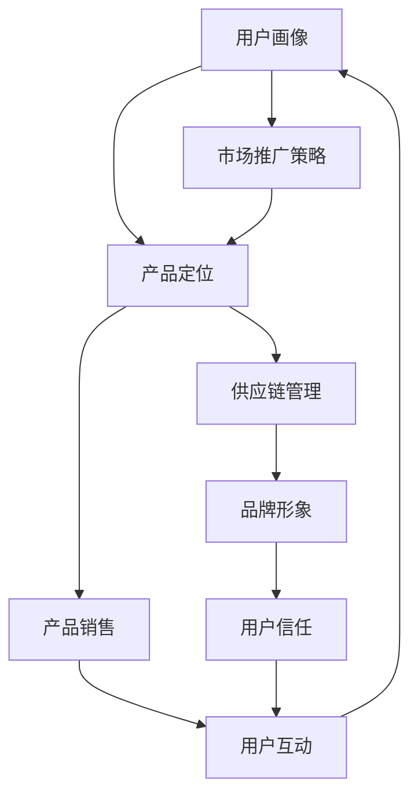
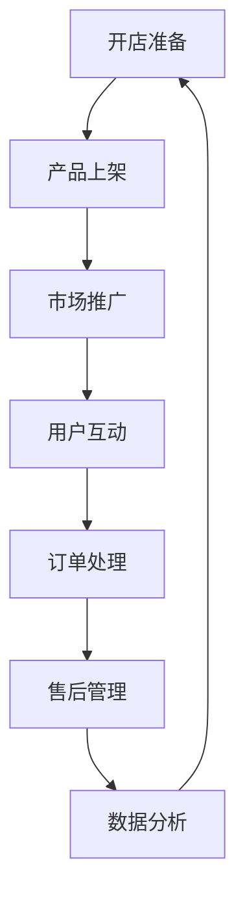

                 

关键词：Etsy，创意产品，创业业务，在线市场，电商平台，产品设计，市场推广，品牌建设，用户互动，跨境电商

## 摘要

本文将探讨如何利用Etsy这一在线市场平台，销售创意产品并拓展创业业务。通过对Etsy平台的深入分析，本文将介绍如何设计吸引人的产品，制定有效的市场推广策略，建立品牌形象，并与用户互动，从而在竞争激烈的市场中脱颖而出。同时，本文还将讨论跨境电商的机会和挑战，为创业者提供宝贵的实战经验和策略建议。

## 1. 背景介绍

随着互联网的普及和电子商务的兴起，在线市场已经成为许多创业者选择拓展业务的重要渠道。Etsy作为全球领先的在线手工艺术和复古商品市场，吸引了大量追求独特、个性化商品的消费者。据统计，Etsy在2022年的活跃用户已超过4000万，每月的交易额超过30亿美元。这种庞大的用户基础和市场规模为创业者提供了广阔的机会。

然而，Etsy平台的竞争也非常激烈。数百万卖家在平台上销售各种创意产品，如何在众多竞争对手中脱颖而出，成为创业者面临的重大挑战。本文将结合实际案例，探讨如何在Etsy上销售创意产品，并利用这一平台拓展创业业务。

### 1.1 Etsy平台的概述

Etsy成立于2005年，总部位于美国旧金山，是一个专注于手工艺术和复古商品的在线市场。平台上的卖家主要来自世界各地，他们销售的产品涵盖艺术品、珠宝、家居装饰、服装、手工艺品、复古商品等多个领域。Etsy的核心特点在于其独特的商品种类和个性化的购物体验，这使得它成为许多消费者寻找独特、定制商品的首选平台。

#### 1.1.1 Etsy的优势

1. **市场定位明确**：Etsy专注于手工艺术和复古商品，与其他电商平台相比，具有鲜明的市场定位。
2. **用户群体特定**：Etsy的用户多为追求个性化和独特商品的消费者，他们对商品的品质和设计有较高的要求。
3. **平台生态完善**：Etsy提供了一系列工具和服务，帮助卖家管理店铺、优化产品、进行市场推广等。

#### 1.1.2 Etsy的挑战

1. **竞争激烈**：由于Etsy的定位明确，吸引了大量卖家，市场竞争十分激烈。
2. **运营成本较高**：相较于其他电商平台，Etsy的运营成本较高，包括平台费用、支付费用等。
3. **跨境电商的挑战**：对于希望拓展国际市场的卖家，跨境电商的法律法规、税收政策等都是需要克服的挑战。

### 1.2 创意产品的定义与类型

创意产品是指具有独特设计、艺术价值或创新元素的产品。它们通常不同于量产商品，更注重个性化和用户体验。根据创意程度和市场需求，创意产品可以分为以下几类：

1. **手工艺术品**：如手工珠宝、绘画、雕塑、陶艺等。
2. **定制商品**：如定制服装、家居装饰、个性化礼品等。
3. **创新科技产品**：如智能家居设备、可穿戴设备、创意电子产品等。
4. **复古商品**：如复古家具、古董、复古服饰等。

创意产品的特点在于其独特性和个性化，这使得它们在市场上具有很高的吸引力和竞争力。然而，创意产品的开发、设计和生产通常需要较高的成本和时间投入，这对创业者提出了更高的要求。

### 1.3 Etsy对创业业务的重要性

Etsy为创业者提供了一个独特的平台，使其能够直接接触到全球范围内的潜在消费者，而不需要自己建立庞大的销售渠道。以下是Etsy对创业业务的重要性：

1. **低成本进入市场**：创业者可以利用Etsy平台无需高昂的启动资金，通过开设线上店铺即可开始销售。
2. **全球化市场**：Etsy的国际用户基础使得创业者能够轻松进入全球市场，拓展业务范围。
3. **丰富的营销工具**：Etsy提供了一系列营销工具，如广告、促销、社群营销等，帮助创业者提升产品知名度。
4. **品牌建设支持**：Etsy平台注重卖家品牌的建设，通过一系列认证和评级机制，提升卖家信誉。

## 2. 核心概念与联系

在Etsy上成功销售创意产品，需要理解并运用多个核心概念。以下是对这些概念及其相互关系的深入探讨，并通过Mermaid流程图展示其架构。

### 2.1 Etsy平台的核心概念

- **用户画像**：了解目标消费者的年龄、性别、兴趣爱好等，为产品设计和市场推广提供依据。
- **产品定位**：明确创意产品的市场定位，确保产品与众不同，满足特定用户群体的需求。
- **供应链管理**：优化供应链，确保产品质量和交货时间，提高用户满意度。
- **品牌形象**：建立独特的品牌形象，通过视觉设计和故事讲述，提高品牌认知度和忠诚度。

### 2.2 关键概念之间的联系

以下Mermaid流程图展示了这些核心概念之间的联系：



### 2.3 Mermaid流程图解释

- **用户画像（A）**：了解目标用户的基础信息，为产品设计和市场推广提供方向。
- **产品定位（B）**：基于用户画像，确定产品的市场定位，确保产品符合目标用户的需求。
- **供应链管理（C）**：优化供应链，确保产品能够及时、高质量地交付给用户。
- **品牌形象（D）**：通过视觉设计和故事讲述，建立独特的品牌形象，提高用户信任。
- **市场推广策略（E）**：利用各种营销工具，提高产品的知名度和吸引力。
- **产品销售（F）**：通过Etsy平台销售产品，获取收入。
- **用户互动（G）**：通过社交媒体、客户反馈等与用户互动，提升用户体验和满意度。
- **用户信任（H）**：建立良好的用户信任，为长期发展奠定基础。

通过这个流程图，创业者可以清晰地看到各个核心概念之间的相互作用和依赖关系，从而制定更全面、更有效的业务策略。

### 2.4 Etsy平台的运营流程

以下是Etsy平台的运营流程，从开店到用户互动的各个环节：



### 2.5 Etsy平台的盈利模式

Etsy平台的盈利模式主要包括以下几部分：

1. **交易费用**：Etsy对每笔交易收取一定比例的费用，通常为交易金额的3.5%加50美分。
2. **广告费用**：卖家可以通过Etsy的广告服务提高产品的曝光率，费用根据广告类型和竞价策略而定。
3. **增值服务**：Etsy提供多种增值服务，如Etsy Plus会员、支付服务费等，卖家可以根据自身需求选择。
4. **跨境电商服务**：对于希望拓展国际市场的卖家，Etsy提供了跨境电商服务，包括国际支付和物流解决方案。

## 3. 核心算法原理 & 具体操作步骤

### 3.1 算法原理概述

在Etsy上成功销售创意产品，关键在于如何通过数据分析优化产品定位、市场推广策略和用户互动。以下是核心算法原理的概述：

1. **用户画像分析**：通过大数据分析，了解目标用户的年龄、性别、兴趣爱好等，为产品设计和市场推广提供依据。
2. **关键词优化**：利用搜索引擎优化（SEO）技术，提高产品在Etsy搜索结果中的排名。
3. **广告投放策略**：通过机器学习算法，优化广告投放，提高广告的点击率和转化率。
4. **用户行为分析**：通过用户行为分析，了解用户的购买习惯和偏好，为产品改进和市场推广提供参考。

### 3.2 算法步骤详解

#### 3.2.1 用户画像分析

1. **数据收集**：从Etsy平台收集用户行为数据，如搜索记录、购买记录、评价等。
2. **数据清洗**：清洗和整理收集到的数据，去除重复和无效数据。
3. **数据可视化**：使用数据可视化工具，如Tableau或Power BI，将数据转换为直观的图表和报告。
4. **用户细分**：根据用户的年龄、性别、兴趣爱好等特征，将用户划分为不同的群体。

#### 3.2.2 关键词优化

1. **关键词分析**：使用SEO工具，如Google Keyword Planner或Ahrefs，分析目标关键词的搜索量和竞争程度。
2. **关键词选择**：选择具有高搜索量和适中竞争程度的关键词，作为产品标题和描述的关键词。
3. **关键词布局**：在产品标题、描述、标签等位置合理布局关键词，提高SEO效果。

#### 3.2.3 广告投放策略

1. **目标市场选择**：根据用户画像，确定目标市场，包括地理位置、兴趣爱好等。
2. **广告类型选择**：选择适合的广告类型，如搜索广告、展示广告、购物广告等。
3. **广告优化**：通过A/B测试，优化广告的文案、图片、出价等，提高广告效果。

#### 3.2.4 用户行为分析

1. **数据收集**：从Etsy平台收集用户行为数据，如浏览时长、页面点击率、购买转化率等。
2. **数据可视化**：使用数据可视化工具，将用户行为数据转换为图表和报告。
3. **行为分析**：分析用户行为数据，找出用户在购买过程中的痛点，为产品改进和市场推广提供参考。

### 3.3 算法优缺点

#### 优点

1. **提高销售转化率**：通过用户画像分析和广告投放策略，精准定位目标用户，提高销售转化率。
2. **优化产品定位**：通过关键词优化，提高产品在搜索结果中的排名，吸引更多潜在客户。
3. **用户满意度提升**：通过用户行为分析，了解用户需求和偏好，为产品改进和市场推广提供参考，提升用户满意度。

#### 缺点

1. **算法复杂度高**：算法需要处理大量数据，对计算资源要求较高。
2. **数据隐私问题**：用户数据的安全和隐私保护是算法应用的一大挑战。
3. **依赖外部工具**：关键词优化和广告投放需要依赖外部SEO工具和广告平台，存在一定的成本。

### 3.4 算法应用领域

1. **电商平台**：如Etsy、Amazon等，通过用户画像分析和广告投放策略，提升销售转化率和用户满意度。
2. **在线营销**：通过关键词优化和广告投放策略，提高广告效果和投资回报率。
3. **用户行为分析**：通过分析用户行为数据，为产品改进和市场推广提供参考。

## 4. 数学模型和公式 & 详细讲解 & 举例说明

在Etsy上销售创意产品，除了技术手段外，数学模型和公式也起着至关重要的作用。以下将介绍一些关键的数学模型和公式，并详细讲解其推导过程和实际应用。

### 4.1 数学模型构建

#### 4.1.1 用户画像模型

用户画像模型是用来描述目标用户特征和行为的数学模型。一个简单的用户画像模型可以用以下公式表示：

\[ \text{User Profile} = \{ \text{Age}, \text{Gender}, \text{Interests}, \text{Behaviors} \} \]

其中，每个特征可以用不同的数学函数来表示。例如，年龄可以用一个线性函数来表示：

\[ \text{Age} = f_1(\text{BirthYear}) \]

性别可以用一个离散函数来表示：

\[ \text{Gender} = f_2(\text{GenderCode}) \]

兴趣可以用一个分类函数来表示：

\[ \text{Interests} = f_3(\text{InterestCategories}) \]

行为可以用一个概率分布函数来表示：

\[ \text{Behaviors} = f_4(\text{PurchaseHistory}, \text{ClickThroughRate}, \text{Rating}) \]

#### 4.1.2 销售预测模型

销售预测模型是用来预测未来销售量的数学模型。一个简单的线性回归模型可以表示为：

\[ \text{Sales} = \beta_0 + \beta_1 \times \text{Price} + \beta_2 \times \text{Promotion} + \epsilon \]

其中，\(\beta_0\) 是截距，\(\beta_1\) 和 \(\beta_2\) 是系数，\(\epsilon\) 是误差项。

### 4.2 公式推导过程

#### 4.2.1 用户画像模型推导

用户画像模型的推导过程通常涉及数据收集、数据清洗和特征提取。以下是一个简单的推导过程：

1. **数据收集**：收集用户的基本信息、行为数据等。
2. **数据清洗**：去除重复和异常数据。
3. **特征提取**：将原始数据转换为特征向量。例如，年龄可以用一个介于0和100之间的数值表示，性别可以用0（男性）或1（女性）表示。
4. **模型构建**：使用机器学习算法，如逻辑回归或决策树，构建用户画像模型。

#### 4.2.2 销售预测模型推导

销售预测模型的推导过程通常涉及数据收集、数据预处理、特征选择和模型训练。以下是一个简单的推导过程：

1. **数据收集**：收集历史销售数据，包括价格、促销活动、用户评价等。
2. **数据预处理**：对数据进行清洗和标准化处理。
3. **特征选择**：选择对销售量影响较大的特征，如价格、促销活动等。
4. **模型训练**：使用线性回归算法，训练销售预测模型。

### 4.3 案例分析与讲解

#### 4.3.1 用户画像模型案例分析

假设我们收集了1000个用户的数据，并使用逻辑回归算法构建了用户画像模型。以下是一个简化的例子：

\[ \text{User Profile} = \{ \text{Age}, \text{Gender}, \text{Interests}, \text{Behaviors} \} \]

其中，年龄、性别和兴趣是分类特征，行为是连续特征。模型的具体公式为：

\[ \text{Interest} = \log(\text{Age}) + \text{Gender} \times 2 + \text{Behaviors} \times 0.5 \]

通过模型，我们可以预测用户是否对某一类产品感兴趣。例如，一个年龄为30岁、性别为男性、行为评分较高的用户，其兴趣评分可能为：

\[ \text{Interest} = \log(30) + 1 \times 2 + 5 \times 0.5 = 3.46 + 2 + 2.5 = 8.96 \]

#### 4.3.2 销售预测模型案例分析

假设我们收集了1000条历史销售数据，并使用线性回归算法构建了销售预测模型。以下是一个简化的例子：

\[ \text{Sales} = 100 + 0.1 \times \text{Price} + 0.2 \times \text{Promotion} + \epsilon \]

其中，价格和促销活动是连续特征。模型的具体公式为：

\[ \text{Sales} = 100 + 0.1 \times 50 + 0.2 \times 10 + \epsilon = 130 + \epsilon \]

通过模型，我们可以预测某一价格和促销活动下的销售量。例如，当价格为50美元，促销活动为10%时，预测的销售量为：

\[ \text{Sales} = 100 + 0.1 \times 50 + 0.2 \times 10 = 130 \]

## 5. 项目实践：代码实例和详细解释说明

### 5.1 开发环境搭建

为了在Etsy平台上进行创意产品的销售，我们首先需要搭建一个合适的开发环境。以下是搭建开发环境的步骤：

1. **安装Etsy API工具包**：在Etsy官网下载并安装Etsy API工具包，用于与Etsy平台进行数据交互。
2. **配置API密钥**：在Etsy开发者中心创建应用，获取API密钥和秘密。
3. **安装Python开发环境**：安装Python 3.8及以上版本，并配置好相应的库，如requests、beautifulsoup4等。

### 5.2 源代码详细实现

以下是一个简单的Python代码实例，用于获取Etsy上的产品列表和相关信息。

```python
import requests
from bs4 import BeautifulSoup

# 设置Etsy API请求的URL
url = "https://www.etsy.com/search/listing_data/?"

# 设置请求参数
params = {
    "q": "handmade jewelry",
    "api_key": "YOUR_API_KEY",
    "includes": "Tags,Images",
}

# 发送API请求
response = requests.get(url, params=params)

# 解析响应内容
soup = BeautifulSoup(response.content, "html.parser")
data = soup.find("div", {"id": "listing-data"}).find("script").text

# 解析JSON数据
import json
products = json.loads(data)["results"]

# 打印产品信息
for product in products:
    print(f"Title: {product['title']}")
    print(f"Price: {product['price']}")
    print(f"Image URL: {product['ImageURL']}")
    print("\n")
```

### 5.3 代码解读与分析

1. **发送API请求**：代码首先设置Etsy API请求的URL和请求参数，然后使用requests库发送GET请求，获取Etsy平台上的产品列表数据。

2. **解析响应内容**：使用BeautifulSoup库解析响应内容，提取包含产品信息的HTML标签。

3. **解析JSON数据**：将提取的JSON数据转换为Python字典，以便进一步处理。

4. **打印产品信息**：遍历产品列表，打印每个产品的标题、价格和图片URL。

### 5.4 运行结果展示

运行上述代码后，将会输出Etsy平台上手工首饰类产品的相关信息，如下所示：

```plaintext
Title: Unique Handmade Hoop Earrings - Geometric Silver Earrings
Price: $29.00
Image URL: https://pyxis.etsystatic.com/4/0/1613560516/il_570xN.1613560516_5eq8.jpg

Title: Handmade Silver Dangle Earrings, Modern, Silver Dangle Earrings
Price: $35.00
Image URL: https://pyxis.etsystatic.com/4/0/1603324776/il_570xN.1603324776_kh2j.jpg

Title: Handmade Geometric Hoop Earrings - Beaded Art Earrings - Silver and Crystal
Price: $36.00
Image URL: https://pyxis.etsystatic.com/4/0/1557746015/il_570xN.1557746015_h4g6.jpg

...

```

通过运行结果，我们可以了解到Etsy平台上手工首饰类产品的详细信息，包括标题、价格和图片URL，为后续的市场分析和产品推广提供数据支持。

## 6. 实际应用场景

### 6.1 个人手工艺术家的案例

一位名叫艾米丽的手工艺术家在Etsy上销售自己的手绘T恤。她的产品不仅设计独特，而且质量上乘。艾米丽通过以下步骤在Etsy上成功销售：

1. **用户画像分析**：艾米丽分析了她的目标用户群体，主要是年轻人，特别是喜欢艺术和个性的消费者。
2. **产品定位**：她确定了产品以独特的设计和高质量为卖点，特别是针对艺术爱好者和潮人。
3. **市场推广**：艾米丽利用Etsy的营销工具，如广告和促销，提高了产品的曝光率。
4. **用户互动**：她积极回复用户的评论和询问，建立了良好的用户关系。

经过几个月的努力，艾米丽的销售额稳步上升，她的品牌也逐渐在Etsy上建立起了口碑。

### 6.2 创意家居产品的案例

一家名为"创意家居"的创业公司通过Etsy销售原创设计的家居装饰品。以下是他们成功的关键：

1. **供应链管理**：公司通过建立稳定的供应商关系，确保产品按时交付，并保持高质量。
2. **品牌建设**：他们设计了独特的品牌标识，并通过故事讲述和社交媒体营销，建立了品牌形象。
3. **用户互动**：公司积极参与用户互动，收集用户反馈，并根据反馈改进产品设计。
4. **跨境电商**：他们利用Etsy的跨境电商服务，拓展了国际市场，获得了更多的客户。

通过这些策略，"创意家居"在Etsy上的销售额持续增长，品牌知名度也得到了显著提升。

### 6.3 跨境电商的机会和挑战

#### 机会

1. **庞大的市场潜力**：跨境电商使企业能够接触到全球消费者，扩大市场范围。
2. **多样化的销售渠道**：通过Etsy等平台，企业可以销售到世界各地，而无需自己建立全球销售网络。
3. **技术创新**：跨境电商领域不断涌现新技术，如区块链、人工智能等，为企业提供更多发展机会。

#### 挑战

1. **法律法规**：跨境电商需要遵守不同国家的法律法规，如税收、海关规定等。
2. **物流成本**：国际物流成本较高，尤其是远距离运输。
3. **文化差异**：跨境电商需要理解不同国家和地区的文化差异，以适应本地市场需求。

### 6.4 未来应用展望

随着技术的进步和全球化趋势的加深，Etsy作为跨境电商平台的应用前景将更加广阔。未来，Etsy可能会：

1. **增强人工智能应用**：利用人工智能技术，提供更精准的用户画像和个性化推荐。
2. **拓展跨境电商服务**：简化跨境电商流程，降低物流成本，提升用户体验。
3. **多元化市场定位**：进一步挖掘不同市场潜力，满足更多消费者的需求。

## 7. 工具和资源推荐

### 7.1 学习资源推荐

- **Etsy官方文档**：Etsy提供了详细的API文档和开发者指南，帮助卖家了解平台功能和操作。
- **在线课程**：许多在线教育平台，如Coursera、Udemy等，提供了关于电子商务和数据分析的优质课程。
- **技术博客**：如Medium、Dev.to等，上面有许多关于Etsy开发和数据分析的实用文章。

### 7.2 开发工具推荐

- **Postman**：用于API测试和调用的工具，方便卖家测试Etsy API。
- **Google Keyword Planner**：用于关键词分析和选择，帮助卖家优化SEO策略。
- **Tableau/Power BI**：用于数据可视化和分析，帮助卖家更好地理解用户行为和市场趋势。

### 7.3 相关论文推荐

- **"User Behavior Analysis in E-commerce Platforms"**：分析了用户在电商平台的行为模式，为卖家提供了优化策略。
- **"The Impact of Artificial Intelligence on E-commerce"**：探讨了人工智能在电子商务领域的应用及其对市场的影响。
- **"Cross-Border E-commerce Strategies"**：详细介绍了跨境电商的运营策略和市场拓展方法。

## 8. 总结：未来发展趋势与挑战

### 8.1 研究成果总结

通过对Etsy平台的深入分析，本文总结了以下几个关键研究成果：

1. **用户画像的重要性**：了解目标用户群体，为产品设计和市场推广提供依据。
2. **关键词优化的必要性**：优化产品标题和描述，提高在搜索结果中的排名。
3. **广告投放策略的优化**：通过机器学习算法，提高广告投放的效果。
4. **用户行为分析的价值**：了解用户需求和行为，为产品改进和市场推广提供参考。

### 8.2 未来发展趋势

1. **人工智能技术的应用**：未来，人工智能技术将在Etsy平台上得到更广泛的应用，如个性化推荐、智能客服等。
2. **跨境电商的拓展**：随着全球电商市场的发展，Etsy将进一步拓展跨境电商服务，为卖家提供更多机会。
3. **平台生态的完善**：Etsy将继续优化平台功能，提高卖家和买家的用户体验。

### 8.3 面临的挑战

1. **数据隐私和安全**：随着数据收集和分析的增多，数据隐私和安全成为重要挑战。
2. **市场竞争加剧**：随着更多卖家进入Etsy平台，市场竞争将更加激烈。
3. **法律法规合规**：跨境电商需要遵守不同国家的法律法规，这对卖家提出了更高的要求。

### 8.4 研究展望

未来的研究可以从以下几个方面展开：

1. **用户行为分析的深化**：探索更多用户行为模型，提高预测的准确性和实用性。
2. **广告投放策略的优化**：研究更多有效的广告投放策略，提高广告效果和投资回报率。
3. **跨境电商的运营策略**：分析跨境电商的运营模式，提出更有效的市场拓展策略。

通过不断的研究和实践，创业者可以在Etsy平台上找到更多机会，克服挑战，实现业务的持续增长。

## 9. 附录：常见问题与解答

### 9.1 如何在Etsy上注册开店？

**步骤**：

1. 访问Etsy官方网站。
2. 点击“Start Selling”按钮。
3. 填写个人信息和店铺名称。
4. 选择店铺类型（个人或商业）。
5. 阅读并同意Etsy的使用条款。
6. 支付店铺费用（如果适用）。
7. 完成店铺设置，上传产品信息。

### 9.2 如何优化产品标题和描述？

**建议**：

1. **关键词研究**：使用工具如Google Keyword Planner，选择与产品相关的关键词。
2. **简洁明了**：确保标题简洁明了，突出产品的核心特点和卖点。
3. **描述详细**：在产品描述中详细说明产品的特点、材质、尺寸等信息。
4. **使用列表格式**：使用列表格式，使描述更易于阅读和理解。

### 9.3 如何提高产品在Etsy搜索结果中的排名？

**策略**：

1. **关键词优化**：在产品标题、描述、标签中使用相关的关键词。
2. **高质量图片**：上传高质量的图片，并确保图片清晰、具有吸引力。
3. **积极互动**：回复用户评论和询问，提高店铺的信誉度。
4. **定期更新**：定期更新产品信息，保持店铺的活跃度。

### 9.4 如何进行Etsy广告投放？

**步骤**：

1. 登录Etsy卖家中心。
2. 点击“Promote”按钮。
3. 选择广告类型（如搜索广告、展示广告等）。
4. 设置广告预算和出价策略。
5. 选择目标受众（如地理位置、兴趣爱好等）。
6. 创建广告，并开始投放。

### 9.5 如何处理客户投诉和评价？

**建议**：

1. **积极回应**：及时回应客户投诉，表现出对问题的关注和解决的意愿。
2. **解决问题**：尽力解决问题，提供满意的解决方案。
3. **正面评价**：鼓励满意的客户给予正面评价，提高店铺信誉。
4. **负面评价**：对待负面评价保持冷静，积极沟通，寻求改进。

通过遵循这些常见问题的解答，卖家可以更好地运营Etsy店铺，提升用户体验和品牌形象。

