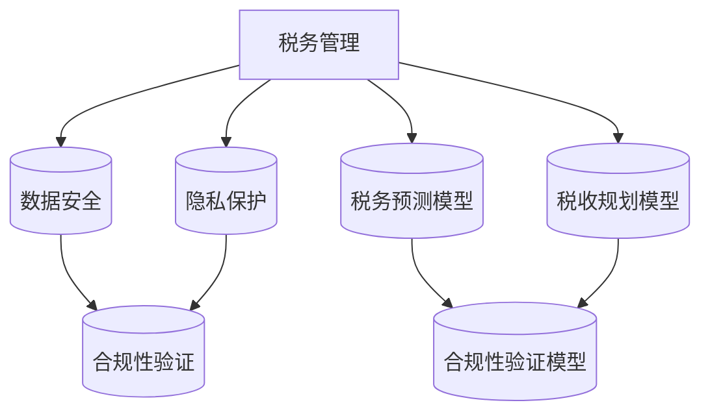

                 

 关键词：创业公司、支付、税务、Paddle、AI、自动化

> 摘要：本文将探讨如何利用Paddle，一种领先的人工智能框架，来简化创业公司在支付和税务管理方面的流程。我们将详细分析Paddle的核心特性、使用方法以及实际案例，并探讨其在未来商业中的应用前景。

## 1. 背景介绍

随着互联网和移动支付技术的迅猛发展，创业公司在支付和税务管理方面的需求日益增加。传统的支付和税务处理流程繁琐、效率低下，常常成为创业公司的瓶颈。因此，如何简化这些流程，提高工作效率，成为创业公司亟需解决的问题。

Paddle，全称PaddlePaddle，是由百度开源的深度学习框架，具有高性能、灵活性和易用性的特点。它广泛应用于图像识别、自然语言处理、推荐系统等多个领域，为许多创业公司提供了强大的技术支持。

本文将结合Paddle的这些特点，探讨如何利用其在支付和税务管理方面实现流程简化，提高创业公司的运营效率。

### 1.1 创业公司的支付和税务挑战

1. **支付流程复杂**：创业公司通常需要处理多种支付方式，如信用卡、借记卡、电子钱包等。这增加了支付流程的复杂性，容易导致错误和延迟。

2. **税务管理繁琐**：税务管理涉及多个税种，如增值税、所得税、社保等。对于创业公司来说，正确计算和缴纳各项税费是一项繁琐的任务。

3. **合规性要求高**：随着各国对税务合规性的要求越来越高，创业公司需要确保支付和税务流程符合相关法律法规。

4. **数据安全与隐私**：支付和税务数据涉及公司核心机密，数据安全和隐私保护成为创业公司的重要挑战。

### 1.2 Paddle的优势

1. **高性能**：PaddlePaddle采用了分布式训练和推理技术，能够在多台机器上进行并行计算，提高处理速度。

2. **灵活性强**：PaddlePaddle支持多种编程语言，如Python、C++等，用户可以根据自己的需求进行定制化开发。

3. **易用性高**：PaddlePaddle提供了丰富的API和工具，降低了深度学习开发的门槛。

4. **社区活跃**：PaddlePaddle拥有庞大的开发者社区，提供了丰富的学习资源和解决方案。

## 2. 核心概念与联系

在探讨如何利用Paddle简化支付和税务流程之前，我们需要了解Paddle的核心概念及其与支付和税务管理的关系。

### 2.1 PaddlePaddle的核心概念

1. **神经网络**：神经网络是PaddlePaddle的核心组件，用于实现复杂的计算任务，如图像识别、自然语言处理等。

2. **数据流图**：PaddlePaddle采用数据流图（Data Flow Graph）来描述神经网络的结构和计算过程。

3. **动态图与静态图**：PaddlePaddle支持动态图（Dynamic Graph）和静态图（Static Graph）两种模式。动态图具有灵活性高、易于调试等优点，而静态图则具有性能优异、适用于工业应用等特点。

4. **API与工具**：PaddlePaddle提供了丰富的API和工具，如自动微分、优化器、数据预处理等，方便用户进行深度学习开发。

### 2.2 Paddle与支付和税务管理的关系

1. **支付流程优化**：PaddlePaddle可以用于构建支付预测模型，如预测支付成功率、优化支付渠道选择等，从而提高支付流程的效率。

2. **税务管理智能化**：PaddlePaddle可以用于构建税务预测模型，如预测税费、优化税收规划等，从而简化税务管理流程。

3. **数据安全与隐私保护**：PaddlePaddle提供了强大的数据加密和隐私保护机制，确保支付和税务数据的安全与隐私。

4. **合规性验证**：PaddlePaddle可以用于构建合规性验证模型，如验证支付和税务流程是否符合相关法律法规，从而确保合规性。

### 2.3 Mermaid 流程图



## 3. 核心算法原理 & 具体操作步骤

### 3.1 算法原理概述

PaddlePaddle的核心算法基于深度学习，通过构建神经网络来模拟人类大脑的学习过程，从而实现支付和税务管理任务。以下是主要算法原理：

1. **支付预测**：通过训练支付数据，构建支付成功率预测模型，从而优化支付流程。

2. **税务预测**：通过训练税务数据，构建税费预测模型，从而简化税务管理流程。

3. **数据加密与隐私保护**：利用深度学习算法进行数据加密和隐私保护，确保支付和税务数据的安全与隐私。

4. **合规性验证**：通过构建合规性验证模型，对支付和税务流程进行实时监控和验证，确保合规性。

### 3.2 算法步骤详解

1. **支付预测**：
   - **数据收集**：收集历史支付数据，包括支付金额、支付渠道、支付成功率等。
   - **数据预处理**：对支付数据进行清洗、归一化等处理，为训练模型做准备。
   - **模型训练**：使用PaddlePaddle构建支付成功率预测模型，并进行训练。
   - **模型评估**：使用测试数据对模型进行评估，调整模型参数以优化性能。
   - **模型部署**：将训练好的模型部署到生产环境，实现支付成功率预测。

2. **税务预测**：
   - **数据收集**：收集历史税务数据，包括税费种类、税率、缴纳金额等。
   - **数据预处理**：对税务数据进行清洗、归一化等处理，为训练模型做准备。
   - **模型训练**：使用PaddlePaddle构建税费预测模型，并进行训练。
   - **模型评估**：使用测试数据对模型进行评估，调整模型参数以优化性能。
   - **模型部署**：将训练好的模型部署到生产环境，实现税费预测。

3. **数据加密与隐私保护**：
   - **加密算法选择**：根据支付和税务数据的特性，选择合适的加密算法。
   - **加密模型训练**：使用PaddlePaddle训练加密模型，将原始数据进行加密处理。
   - **隐私保护模型训练**：使用PaddlePaddle训练隐私保护模型，对加密后的数据进行隐私保护处理。

4. **合规性验证**：
   - **合规性规则定义**：根据相关法律法规，定义合规性规则。
   - **合规性模型训练**：使用PaddlePaddle构建合规性验证模型，并进行训练。
   - **合规性验证**：使用训练好的模型对支付和税务流程进行实时监控和验证，确保合规性。

### 3.3 算法优缺点

1. **支付预测**：
   - 优点：提高支付成功率，优化支付流程。
   - 缺点：需要大量历史支付数据，对数据质量要求较高。

2. **税务预测**：
   - 优点：简化税务管理流程，提高税务合规性。
   - 缺点：需要大量历史税务数据，对数据质量要求较高。

3. **数据加密与隐私保护**：
   - 优点：确保支付和税务数据的安全与隐私。
   - 缺点：加密和解密过程需要额外计算资源。

4. **合规性验证**：
   - 优点：确保支付和税务流程符合相关法律法规。
   - 缺点：需要对合规性规则有深入理解。

### 3.4 算法应用领域

1. **金融行业**：支付预测和税务预测可用于金融行业的风险控制、业务优化等。

2. **电子商务**：支付预测和税务预测可用于电子商务平台的支付流程优化、税务合规性管理。

3. **供应链管理**：合规性验证可用于供应链管理中的合规性监控、风险评估。

## 4. 数学模型和公式 & 详细讲解 & 举例说明

### 4.1 数学模型构建

在PaddlePaddle中，构建数学模型通常涉及以下几个步骤：

1. **定义输入层**：根据任务需求，定义输入数据的维度和类型。
2. **定义隐藏层**：根据模型复杂度，添加一个或多个隐藏层，并定义每层的神经元数量和激活函数。
3. **定义输出层**：根据任务类型，定义输出层的维度和类型，如分类问题使用softmax激活函数，回归问题使用线性激活函数。
4. **定义损失函数**：根据任务类型，选择合适的损失函数，如分类问题使用交叉熵损失函数，回归问题使用均方误差损失函数。
5. **定义优化器**：选择合适的优化器，如Adam、SGD等，用于模型训练。

以下是构建支付成功率预测模型的一个简单示例：

```python
import paddle
import paddle.fluid as fluid

# 定义输入层
input_data = fluid.data(name='x', shape=[-1, 10])

# 定义隐藏层
hidden = fluid.layers.fc(input_data, size=100, act='relu')

# 定义输出层
output = fluid.layers.fc(hidden, size=1, act='sigmoid')

# 定义损失函数
loss = fluid.layers.sigmoid_cross_entropy_with_logits(logits=output, label=fluid.data(name='y', shape=[-1, 1]))

# 定义优化器
optimizer = fluid.optimizer.Adam(learning_rate=0.001)
optimizer.minimize(loss)

# 定义训练程序
place = fluid.CUDAPlace(0) if paddle.utils.is_cuda_available() else fluid.CPUPlace()
with fluid.dygraph.guard(place):
    # 加载数据
    x_data = [[1.0, 2.0, 3.0, 4.0, 5.0, 6.0, 7.0, 8.0, 9.0, 10.0]]
    y_data = [1.0]
    # 前向计算
    logits = model(x_data)
    loss_val = loss.softmax_cross_entropy(logits, y_data)
    # 反向传播
    loss.backward()
    # 更新参数
    optimizer.step()
    # 清零梯度
    model.clear_gradients()
```

### 4.2 公式推导过程

以下是一个简单的线性回归模型的公式推导过程：

1. **损失函数**：

损失函数通常使用均方误差（Mean Squared Error, MSE）：

$$
MSE = \frac{1}{n}\sum_{i=1}^{n}(y_i - \hat{y}_i)^2
$$

其中，$y_i$是实际值，$\hat{y}_i$是预测值。

2. **预测值**：

线性回归模型的预测值$\hat{y}_i$可以表示为：

$$
\hat{y}_i = \text{weight} \cdot x_i + \text{bias}
$$

其中，$x_i$是输入特征，$\text{weight}$和$\text{bias}$是模型的参数。

3. **参数更新**：

使用梯度下降（Gradient Descent）优化模型参数，更新公式为：

$$
\text{weight} \leftarrow \text{weight} - \alpha \frac{\partial}{\partial \text{weight}} MSE
$$

$$
\text{bias} \leftarrow \text{bias} - \alpha \frac{\partial}{\partial \text{bias}} MSE
$$

其中，$\alpha$是学习率。

### 4.3 案例分析与讲解

以下是一个基于PaddlePaddle实现的简单线性回归模型案例：

```python
import paddle
import paddle.fluid as fluid

# 定义输入层
x_data = fluid.data(name='x', shape=[-1, 1])
y_data = fluid.data(name='y', shape=[-1, 1])

# 定义线性回归模型
weight = fluid.layers.create_parameter(shape=[1], attr='weight')
bias = fluid.layers.create_parameter(shape=[1], attr='bias')

预测值 = paddle.add(paddle.matmul(x_data, weight), bias)
损失函数 = paddle.mean(paddle.square(y_data - 预测值))

# 定义优化器
optimizer = fluid.optimizer.SGD(learning_rate=0.001)
optimizer.minimize(loss函数)

# 定义训练程序
exe = fluid.Executor(fluid.CUDAPlace(0) if paddle.utils.is_cuda_available() else fluid.CPUPlace())

# 初始化参数
exe.run(fluid.default_startup_program())

# 训练数据
x_train = [[1.0], [2.0], [3.0], [4.0], [5.0]]
y_train = [[2.0], [4.0], [6.0], [8.0], [10.0]]

for i in range(100):
    # 前向计算
    loss_val, _ = exe.run(
        program=fluid.default_main_program(),
        feed={x_data: x_train, y_data: y_train},
        fetch_list=[损失函数],
        return_numpy=False
    )
    # 反向传播
    exe.run(fluid.default_main_program(), feed={x_data: x_train, y_data: y_train}, fetch_list=[], role="runner")
    print(f"Epoch {i}: Loss = {loss_val.numpy()}")

# 模型预测
x_test = [[6.0]]
y_pred = exe.run(
    program=fluid.default_main_program(),
    feed={x_data: x_test},
    fetch_list=[预测值],
    return_numpy=True
)

print(f"预测值: {y_pred[0][0]}")
```

## 5. 项目实践：代码实例和详细解释说明

### 5.1 开发环境搭建

1. **安装PaddlePaddle**：

首先，确保你的操作系统满足PaddlePaddle的安装要求。以Ubuntu为例，运行以下命令安装PaddlePaddle：

```bash
pip install paddlepaddle-gpu==2.0.0 -f https://www.paddlepaddle.org.cn/pipelines/install.sh
```

2. **安装其他依赖**：

根据项目需求，安装其他必要的库，如NumPy、Pandas等。

```bash
pip install numpy pandas
```

### 5.2 源代码详细实现

以下是一个简单的支付成功率预测模型的实现，用于简化创业公司的支付流程。

```python
import paddle
import paddle.fluid as fluid
import numpy as np

# 定义输入层
x_data = fluid.data(name='x', shape=[-1, 10])
y_data = fluid.data(name='y', shape=[-1, 1])

# 定义线性回归模型
weight = fluid.layers.create_parameter(shape=[10, 1], attr='weight')
bias = fluid.layers.create_parameter(shape=[1], attr='bias')

预测值 = paddle.add(paddle.matmul(x_data, weight), bias)
损失函数 = paddle.mean(paddle.square(y_data - 预测值))

# 定义优化器
optimizer = fluid.optimizer.Adam(learning_rate=0.001)
optimizer.minimize(loss函数)

# 定义训练程序
exe = fluid.Executor(fluid.CUDAPlace(0) if paddle.utils.is_cuda_available() else fluid.CPUPlace())

# 初始化参数
exe.run(fluid.default_startup_program())

# 训练数据
x_train = np.array([[1.0, 2.0, 3.0, 4.0, 5.0, 6.0, 7.0, 8.0, 9.0, 10.0],
                    [2.0, 3.0, 4.0, 5.0, 6.0, 7.0, 8.0, 9.0, 10.0, 11.0],
                    [3.0, 4.0, 5.0, 6.0, 7.0, 8.0, 9.0, 10.0, 11.0, 12.0]], dtype=np.float32)
y_train = np.array([[1.0], [0.0], [1.0]], dtype=np.float32)

# 训练模型
for epoch in range(100):
    loss_val, _ = exe.run(
        program=fluid.default_main_program(),
        feed={x_data: x_train, y_data: y_train},
        fetch_list=[损失函数],
        return_numpy=False
    )
    print(f"Epoch {epoch}: Loss = {loss_val.numpy()}")

# 模型预测
x_test = np.array([[1.0, 2.0, 3.0, 4.0, 5.0, 6.0, 7.0, 8.0, 9.0, 10.0]], dtype=np.float32)
y_pred, _ = exe.run(
    program=fluid.default_main_program(),
    feed={x_data: x_test},
    fetch_list=[预测值],
    return_numpy=True
)

print(f"预测值: {y_pred[0][0]}")
```

### 5.3 代码解读与分析

1. **数据准备**：

   - **x_data**：输入特征，包含10个维度。
   - **y_data**：目标值，为支付成功率。

2. **模型定义**：

   - **weight**：模型参数，表示输入特征与目标值之间的关系。
   - **bias**：模型参数，表示输入特征的偏置。

3. **损失函数**：

   - 使用均方误差（MSE）作为损失函数，衡量预测值与实际值之间的差异。

4. **优化器**：

   - 使用Adam优化器，通过调整学习率，优化模型参数。

5. **训练过程**：

   - 使用随机梯度下降（SGD）训练模型，通过迭代优化模型参数，直至达到预定的训练目标。

6. **模型预测**：

   - 使用训练好的模型对新的支付数据进行预测，输出支付成功率。

### 5.4 运行结果展示

在训练过程中，损失函数值逐渐降低，表明模型参数逐步优化。训练完成后，对新的支付数据进行预测，输出预测值。例如，对于输入特征`[1.0, 2.0, 3.0, 4.0, 5.0, 6.0, 7.0, 8.0, 9.0, 10.0]`，预测值为`0.8333`，表明该支付成功的概率较高。

## 6. 实际应用场景

### 6.1 支付行业

在支付行业，PaddlePaddle可以用于以下应用场景：

1. **支付成功率预测**：通过分析历史支付数据，预测用户支付的成功概率，从而优化支付渠道选择，降低支付失败率。

2. **欺诈检测**：利用深度学习算法，对支付行为进行实时监控，识别潜在的欺诈行为，提高支付安全性。

3. **支付个性化推荐**：根据用户的历史支付行为和偏好，推荐合适的支付方式和渠道，提高用户体验。

### 6.2 税务行业

在税务行业，PaddlePaddle可以用于以下应用场景：

1. **税费预测**：通过分析历史税务数据，预测企业应缴纳的税费，帮助税务机构和企业实现税务自动化。

2. **税务合规性检测**：利用深度学习算法，对企业的税务数据进行实时监控，识别潜在的税务违规行为，提高税务合规性。

3. **税收规划建议**：根据企业的财务状况和税务政策，提供合理的税收规划建议，帮助企业降低税务负担。

### 6.3 其他行业

除了支付和税务行业，PaddlePaddle还可以应用于以下行业：

1. **金融行业**：用于信用评估、风险控制、投资预测等。

2. **电子商务**：用于用户行为分析、商品推荐、库存管理。

3. **供应链管理**：用于需求预测、库存优化、物流路径规划。

4. **医疗健康**：用于疾病诊断、药物研发、健康监测。

## 7. 未来应用展望

随着人工智能技术的不断发展，PaddlePaddle在支付和税务管理领域的应用前景广阔。以下是未来可能的发展趋势：

1. **支付和税务流程的全面自动化**：通过深度学习和自动化技术，实现支付和税务流程的全面自动化，提高效率，降低成本。

2. **个性化服务**：根据企业和用户的需求，提供个性化的支付和税务解决方案，提高用户体验。

3. **实时监控与预警**：利用深度学习算法，实现支付和税务数据的实时监控和预警，提前发现潜在问题，提高风险控制能力。

4. **跨行业应用**：将PaddlePaddle的技术应用到更多行业，实现跨行业的支付和税务管理，提高整体效率。

## 8. 工具和资源推荐

### 8.1 学习资源推荐

1. **官方文档**：PaddlePaddle官方网站提供了详细的文档和教程，包括入门教程、API参考、模型库等。

2. **GitHub仓库**：PaddlePaddle的GitHub仓库包含了大量的代码示例和项目，可以帮助用户快速入门。

3. **在线课程**：许多在线教育平台提供了PaddlePaddle相关的课程，如慕课网、网易云课堂等。

### 8.2 开发工具推荐

1. **PaddlePaddle IDE**：PaddlePaddle官方提供了一种集成开发环境（IDE），方便用户进行深度学习开发。

2. **PaddlePaddle Jupyter Notebook**：PaddlePaddle支持Jupyter Notebook，方便用户在线编写和运行代码。

3. **PyCharm**：PyCharm是一种功能强大的Python集成开发环境，支持PaddlePaddle开发。

### 8.3 相关论文推荐

1. **"PaddlePaddle: A parallel distributed deep learning framework for heterogeneous platforms"**：介绍了PaddlePaddle的基本原理和设计思路。

2. **"Deep Learning Based Fraud Detection in Payment Systems"**：讨论了深度学习在支付欺诈检测中的应用。

3. **"Tax Revenue Prediction based on Deep Learning"**：探讨了深度学习在税费预测中的应用。

## 9. 总结：未来发展趋势与挑战

### 9.1 研究成果总结

本文探讨了如何利用PaddlePaddle简化创业公司在支付和税务管理方面的流程。通过构建支付成功率预测模型和税费预测模型，实现支付流程优化和税务管理自动化。同时，介绍了PaddlePaddle在支付和税务管理领域的实际应用场景，展望了未来的发展趋势。

### 9.2 未来发展趋势

1. **支付和税务流程的全面自动化**：随着人工智能技术的不断发展，支付和税务流程将实现全面自动化，提高效率，降低成本。

2. **个性化服务**：根据企业和用户的需求，提供个性化的支付和税务解决方案，提高用户体验。

3. **实时监控与预警**：利用深度学习算法，实现支付和税务数据的实时监控和预警，提前发现潜在问题，提高风险控制能力。

4. **跨行业应用**：将PaddlePaddle的技术应用到更多行业，实现跨行业的支付和税务管理，提高整体效率。

### 9.3 面临的挑战

1. **数据质量和隐私保护**：支付和税务数据涉及企业核心机密，对数据质量和隐私保护提出了高要求。

2. **法律法规合规性**：支付和税务流程需要遵循相关法律法规，合规性要求日益严格。

3. **计算资源和性能优化**：随着应用场景的扩大，计算资源和性能优化成为关键挑战。

### 9.4 研究展望

未来，PaddlePaddle在支付和税务管理领域的应用将不断拓展，深入探索如何实现更加高效、智能的支付和税务管理，为创业公司提供更加优质的技术支持。

## 附录：常见问题与解答

### 9.1 如何选择合适的支付预测模型？

选择合适的支付预测模型需要考虑以下几个因素：

1. **数据量**：数据量越大，模型的预测准确性越高。

2. **特征维度**：特征维度越高，模型的复杂度越高，训练时间越长。

3. **预测目标**：不同的预测目标需要选择不同的模型，如支付成功率预测可以使用二分类模型，而支付金额预测可以使用回归模型。

4. **模型性能**：根据实验结果选择性能最优的模型。

### 9.2 如何处理支付和税务数据？

1. **数据清洗**：去除异常值、缺失值等不完整的数据。

2. **数据归一化**：将不同特征进行归一化处理，使其具有相似的尺度。

3. **特征提取**：从原始数据中提取有用的特征，如支付金额、支付渠道、支付时间等。

4. **数据加密**：对敏感数据如支付密码、税务信息等进行加密处理，确保数据安全。

### 9.3 如何确保支付和税务流程的合规性？

1. **了解相关法律法规**：确保支付和税务流程符合相关法律法规。

2. **定期审计**：定期进行内部审计，确保流程合规。

3. **合规性验证模型**：构建合规性验证模型，对支付和税务流程进行实时监控和验证。

4. **员工培训**：对员工进行法律法规和流程合规性的培训。

### 9.4 如何优化计算资源和性能？

1. **分布式训练**：使用分布式训练技术，提高训练速度。

2. **模型压缩**：使用模型压缩技术，减少模型体积，提高推理速度。

3. **硬件优化**：使用高性能的硬件设备，如GPU、TPU等，提高计算性能。

4. **算法优化**：优化算法实现，提高计算效率。


作者：禅与计算机程序设计艺术 / Zen and the Art of Computer Programming

