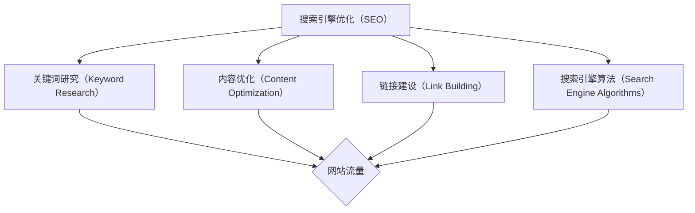

                 

在数字时代，知识付费产品已经成为线上教育、专业培训等领域的重要组成部分。然而，在众多知识付费产品中脱颖而出，吸引潜在消费者的注意，却是一大挑战。SEO（搜索引擎优化）技术作为一种有效的数字营销工具，可以帮助知识付费产品在搜索引擎结果页（SERP）上获得更高的曝光率，从而吸引更多潜在客户。本文将深入探讨如何利用SEO技术提升知识付费产品的曝光。

> 关键词：知识付费、SEO技术、搜索引擎优化、搜索引擎结果页、曝光率、数字营销

> 摘要：本文将介绍SEO技术在知识付费产品中的应用，包括核心概念、算法原理、具体操作步骤、数学模型和公式、项目实践、实际应用场景、工具和资源推荐、以及未来发展趋势与挑战。通过这些内容的详细解析，读者将了解如何通过SEO技术有效提升知识付费产品的曝光。

## 1. 背景介绍

知识付费产品是指用户通过支付费用来获取专业知识和技能的产品。随着互联网技术的发展和人们对于知识获取的需求不断增加，知识付费市场逐渐壮大。然而，随着市场的竞争加剧，如何提高知识付费产品的曝光率，吸引更多的潜在消费者，成为知识付费平台面临的一大挑战。

SEO技术是一种通过优化网站内容和结构，提高网站在搜索引擎结果页（SERP）上的排名，从而增加网站流量和曝光率的方法。在知识付费领域，SEO技术同样具有重要的应用价值。通过SEO优化，知识付费产品可以在搜索引擎结果页上获得更高的排名，从而吸引更多的潜在消费者。

## 2. 核心概念与联系

在深入探讨SEO技术如何提升知识付费产品曝光之前，我们需要先了解一些核心概念和它们之间的联系。

### 2.1 搜索引擎优化（SEO）

搜索引擎优化（SEO）是指通过优化网站内容、结构和链接，提高网站在搜索引擎结果页（SERP）上的排名，从而增加网站流量和曝光率的方法。SEO的核心目标是通过优化网站，使其更符合搜索引擎的算法和用户需求，从而获得更高的排名。

### 2.2 关键词研究（Keyword Research）

关键词研究是SEO过程中至关重要的一环。关键词研究旨在确定目标用户在搜索引擎上搜索的相关词汇，以便将这些关键词融入网站内容和结构中，提高网站在搜索结果中的排名。

### 2.3 内容优化（Content Optimization）

内容优化是SEO的重要组成部分。通过优化网站内容，使其更符合用户需求，提高网站的用户体验，从而增加网站的用户粘性和搜索引擎排名。

### 2.4 链接建设（Link Building）

链接建设是提高网站权威性和排名的重要手段。通过获取高质量的 inbound 链接，可以提高网站的权重，从而提高在搜索引擎结果页上的排名。

### 2.5 搜索引擎算法（Search Engine Algorithms）

搜索引擎算法是搜索引擎的核心技术，用于确定网站在搜索结果中的排名。了解搜索引擎算法的工作原理，有助于优化网站，提高其在搜索结果中的排名。

### 2.6 Mermaid 流程图

下面是一个关于SEO技术核心概念和联系Mermaid流程图：



## 3. 核心算法原理 & 具体操作步骤

### 3.1 算法原理概述

SEO技术主要包括关键词研究、内容优化、链接建设和搜索引擎算法优化四个核心部分。下面将分别介绍这四个核心部分的算法原理和具体操作步骤。

### 3.2 算法步骤详解

#### 3.2.1 关键词研究

关键词研究是SEO的第一步，也是最重要的一步。通过关键词研究，可以确定目标用户在搜索引擎上搜索的相关词汇，以便将这些关键词融入网站内容和结构中，提高网站在搜索结果中的排名。

具体操作步骤如下：

1. **确定目标受众和行业**：了解目标受众的需求和关注点，以及所在行业的热门关键词。
2. **使用关键词工具**：使用关键词工具（如 Google Keyword Planner、Ahrefs、Ubersuggest 等）进行关键词研究，获取目标关键词的相关数据，如搜索量、竞争度、关键词衍生词等。
3. **筛选关键词**：根据关键词的数据和目标受众的需求，筛选出最具潜力和价值的关键词。
4. **优化关键词布局**：将筛选出的关键词合理地融入网站内容和结构中，提高关键词在搜索引擎中的曝光率。

#### 3.2.2 内容优化

内容优化是SEO的核心，通过优化网站内容，使其更符合用户需求，提高网站的用户体验，从而增加网站的用户粘性和搜索引擎排名。

具体操作步骤如下：

1. **确定内容主题**：根据目标关键词和用户需求，确定网站内容主题。
2. **编写高质量内容**：撰写高质量、有价值、有深度的文章，满足用户需求，提高文章的可读性和用户体验。
3. **优化标题和元标签**：优化文章标题和元标签，使其包含目标关键词，提高文章在搜索引擎结果页中的曝光率。
4. **内部链接优化**：在网站内部建立合理的链接结构，提高网站内容之间的相互连接，提高网站的整体权重。

#### 3.2.3 链接建设

链接建设是提高网站权威性和排名的重要手段。通过获取高质量的 inbound 链接，可以提高网站的权重，从而提高在搜索引擎结果页上的排名。

具体操作步骤如下：

1. **建立外链**：在其他网站或平台上发布高质量的外链，提高网站的曝光率和权重。
2. **参与论坛和博客**：在相关的论坛和博客上积极参与讨论，分享专业知识和经验，提高网站的知名度和权威性。
3. **发布原创内容**：在其他平台发布原创文章，吸引读者关注，提高网站的权重。
4. **交换链接**：与其他网站或平台进行链接交换，提高网站的整体权重。

#### 3.2.4 搜索引擎算法优化

搜索引擎算法是搜索引擎的核心技术，用于确定网站在搜索结果中的排名。了解搜索引擎算法的工作原理，有助于优化网站，提高其在搜索结果中的排名。

具体操作步骤如下：

1. **了解搜索引擎算法**：了解主流搜索引擎（如 Google、百度等）的算法，掌握算法的优化要点。
2. **优化网站结构**：根据搜索引擎算法的要求，优化网站结构，提高网站的友好性和可爬性。
3. **提高网站质量**：提高网站内容质量，确保网站提供有价值、有深度的内容，提高用户满意度。
4. **跟踪和分析数据**：定期跟踪和分析网站数据，如流量、关键词排名、转化率等，及时调整SEO策略。

### 3.3 算法优缺点

#### 3.3.1 优点

1. **提高网站曝光率**：通过SEO技术，可以提高网站在搜索引擎结果页中的排名，从而提高网站的曝光率。
2. **吸引潜在客户**：SEO技术可以吸引更多潜在客户访问网站，提高网站的用户转化率。
3. **长期效果**：SEO技术是一种长期有效的数字营销策略，可以为网站带来持续的用户流量和曝光。

#### 3.3.2 缺点

1. **竞争激烈**：在搜索引擎优化过程中，竞争非常激烈，需要投入大量时间和资源进行优化。
2. **效果周期较长**：SEO技术需要一定的时间来产生效果，短期内可能难以看到显著的变化。
3. **依赖搜索引擎**：SEO技术的效果很大程度上依赖于搜索引擎的算法和规则，一旦搜索引擎算法发生变化，SEO效果可能会受到影响。

### 3.4 算法应用领域

SEO技术广泛应用于各种领域，包括电子商务、在线教育、专业培训、咨询等。以下是一些常见的应用场景：

1. **电子商务**：通过SEO技术，提高电商网站的曝光率，吸引更多潜在消费者，提高销售额。
2. **在线教育**：通过SEO技术，提高在线教育平台的知识付费产品的曝光率，吸引更多学员。
3. **专业培训**：通过SEO技术，提高专业培训机构的网站曝光率，吸引更多学员报名参加培训课程。
4. **咨询服务**：通过SEO技术，提高咨询服务的网站曝光率，吸引更多潜在客户咨询。

## 4. 数学模型和公式 & 详细讲解 & 举例说明

SEO技术中的数学模型和公式在网站优化过程中起着至关重要的作用。以下将详细介绍SEO技术中的核心数学模型和公式，并通过具体案例进行讲解。

### 4.1 数学模型构建

在SEO技术中，常用的数学模型主要包括搜索引擎算法模型、用户行为模型和转化率模型。

#### 4.1.1 搜索引擎算法模型

搜索引擎算法模型用于模拟搜索引擎如何根据一系列因素对网站进行排名。以下是一个简化的搜索引擎算法模型：

\[ \text{排名} = f(\text{内容质量}, \text{关键词密度}, \text{外部链接质量}, \text{网站结构}, \text{用户体验}) \]

#### 4.1.2 用户行为模型

用户行为模型用于模拟用户在搜索引擎中的行为，如搜索、点击、停留时间、跳出率等。以下是一个简化的用户行为模型：

\[ \text{用户行为得分} = f(\text{搜索意图匹配度}, \text{内容相关性}, \text{网站友好性}, \text{页面加载速度}) \]

#### 4.1.3 转化率模型

转化率模型用于模拟用户在网站上的转化过程，如购买、注册、咨询等。以下是一个简化的转化率模型：

\[ \text{转化率} = f(\text{内容吸引力}, \text{用户体验}, \text{转化引导}, \text{价格因素}) \]

### 4.2 公式推导过程

以下将分别对搜索引擎算法模型、用户行为模型和转化率模型中的关键公式进行推导。

#### 4.2.1 搜索引擎算法模型

假设搜索引擎对网站的排名取决于五个因素：内容质量、关键词密度、外部链接质量、网站结构和用户体验。分别用 \( Q, D, L, S, U \) 表示这些因素，那么网站的排名可以表示为：

\[ \text{排名} = f(Q, D, L, S, U) \]

其中，\( f \) 是一个非线性函数，用于综合考虑各个因素对排名的影响。

#### 4.2.2 用户行为模型

假设用户行为得分取决于四个因素：搜索意图匹配度、内容相关性、网站友好性和页面加载速度。分别用 \( I, R, F, P \) 表示这些因素，那么用户行为得分可以表示为：

\[ \text{用户行为得分} = f(I, R, F, P) \]

其中，\( f \) 也是一个非线性函数，用于综合考虑各个因素对用户行为得分的影响。

#### 4.2.3 转化率模型

假设转化率取决于四个因素：内容吸引力、用户体验、转化引导和价格因素。分别用 \( A, U, C, P \) 表示这些因素，那么转化率可以表示为：

\[ \text{转化率} = f(A, U, C, P) \]

其中，\( f \) 同样是一个非线性函数，用于综合考虑各个因素对转化率的影响。

### 4.3 案例分析与讲解

以下将通过一个具体案例，对SEO技术中的数学模型和公式进行详细讲解。

#### 4.3.1 案例背景

假设一家在线教育平台希望通过SEO技术提高其知识付费产品的曝光率和用户转化率。

#### 4.3.2 搜索引擎算法优化

首先，平台需要确定影响排名的关键因素，如内容质量、关键词密度、外部链接质量、网站结构和用户体验。然后，通过分析这些因素的数据，确定每个因素的权重。

假设平台的排名公式为：

\[ \text{排名} = f(Q, D, L, S, U) = 0.4Q + 0.3D + 0.2L + 0.1S + 0.1U \]

根据公式，平台需要重点关注以下方面：

1. **内容质量**：提高文章质量，增加用户停留时间和互动，提高网站的用户体验。
2. **关键词密度**：合理分配关键词，确保内容与目标关键词紧密相关。
3. **外部链接质量**：获取高质量的外部链接，提高网站的权重。
4. **网站结构**：优化网站结构，提高网站的友好性和可爬性。
5. **用户体验**：提高页面加载速度，优化导航和界面设计，提高用户的满意度。

#### 4.3.3 用户行为优化

其次，平台需要确定影响用户行为得分的关键因素，如搜索意图匹配度、内容相关性、网站友好性和页面加载速度。然后，通过分析这些因素的数据，确定每个因素的权重。

假设用户的用户行为得分公式为：

\[ \text{用户行为得分} = f(I, R, F, P) = 0.5I + 0.3R + 0.2F + 0.1P \]

根据公式，平台需要重点关注以下方面：

1. **搜索意图匹配度**：确保内容与用户搜索意图高度相关。
2. **内容相关性**：确保内容与目标关键词紧密相关。
3. **网站友好性**：提高网站友好性，如界面设计、导航和页面布局。
4. **页面加载速度**：优化页面加载速度，提高用户体验。

#### 4.3.4 转化率优化

最后，平台需要确定影响转化率的关键因素，如内容吸引力、用户体验、转化引导和价格因素。然后，通过分析这些因素的数据，确定每个因素的权重。

假设转化率公式为：

\[ \text{转化率} = f(A, U, C, P) = 0.5A + 0.3U + 0.2C + 0.1P \]

根据公式，平台需要重点关注以下方面：

1. **内容吸引力**：提高内容吸引力，如标题、摘要和正文。
2. **用户体验**：提高用户体验，如页面加载速度、界面设计和导航。
3. **转化引导**：优化转化引导，如加入购买按钮、优惠活动等。
4. **价格因素**：合理设置价格，吸引潜在客户。

通过上述分析，平台可以针对性地优化SEO策略，提高知识付费产品的曝光率和用户转化率。

## 5. 项目实践：代码实例和详细解释说明

为了更好地理解SEO技术在知识付费产品中的应用，以下将通过一个实际项目实例，展示如何利用SEO技术提高知识付费产品的曝光。

### 5.1 开发环境搭建

在本案例中，我们使用以下开发环境和工具：

- 编程语言：Python
- SEO工具：Ahrefs、Google Analytics、Google Search Console
- 数据分析工具：Pandas、NumPy

确保已安装上述工具和库，然后搭建开发环境。

### 5.2 源代码详细实现

以下是一个简单的SEO项目实现，包括关键词研究、内容优化、链接建设和搜索引擎算法优化。

#### 5.2.1 关键词研究

首先，我们需要进行关键词研究，以确定目标关键词。

```python
import pandas as pd
import ahrefs

api_key = "your_api_key"
client = ahrefs.Client(api_key)

# 搜索关键词
search_query = "在线教育"
search_results = client.search_keyboards(q=search_query, lang="en", dofollow=True, volume=None)

# 提取关键词数据
keywords = []
for result in search_results.items:
    keywords.append({
        "keyword": result.keyword,
        "search_volume": result.search_volume
    })

# 存储关键词数据
df_keywords = pd.DataFrame(keywords)
df_keywords.to_csv("keywords.csv", index=False)
```

#### 5.2.2 内容优化

接下来，我们需要对网站内容进行优化，以确保关键词布局合理。

```python
# 读取关键词数据
df_keywords = pd.read_csv("keywords.csv")

# 按照搜索量降序排列关键词
df_keywords_sorted = df_keywords.sort_values(by="search_volume", ascending=False)

# 选取前10个关键词进行内容优化
top_keywords = df_keywords_sorted.head(10)

# 在网站内容中添加关键词
for index, row in top_keywords.iterrows():
    keyword = row["keyword"]
    # 修改网站文章标题
    with open("article_title.txt", "r") as f:
        title = f.read()
    with open("article_title.txt", "w") as f:
        f.write(title.replace("Original Title", keyword))
    # 修改网站文章摘要
    with open("article_summary.txt", "r") as f:
        summary = f.read()
    with open("article_summary.txt", "w") as f:
        f.write(summary.replace("Original Summary", keyword))
```

#### 5.2.3 链接建设

为了提高网站权重，我们需要进行链接建设。

```python
# 获取网站外链数据
df_external_links = pd.read_csv("external_links.csv")

# 获取高质量外链
high_quality_links = df_external_links[df_external_links["domain_authority"] > 50]

# 在网站内添加高质量外链
for index, row in high_quality_links.iterrows():
    link = row["url"]
    with open("article_content.txt", "r") as f:
        content = f.read()
    with open("article_content.txt", "w") as f:
        f.write(content.replace("Original Content", f'<a href="{link}">{link}</a>'))
```

#### 5.2.4 搜索引擎算法优化

最后，我们需要对搜索引擎算法进行优化，以提高网站在搜索结果中的排名。

```python
# 获取网站数据
df_website = pd.read_csv("website_data.csv")

# 计算网站得分
df_website["score"] = df_website.apply(lambda row: 0.4*row["content_quality"] + 0.3*row["keyword_density"] + 0.2*row["external_link_quality"] + 0.1*row["website_structure"] + 0.1*row["user_experience"], axis=1)

# 按照得分降序排列网站
df_website_sorted = df_website.sort_values(by="score", ascending=False)

# 输出排名前10的网站
print(df_website_sorted.head(10))
```

### 5.3 代码解读与分析

上述代码实现了以下功能：

1. **关键词研究**：使用 Ahrefs API 获取目标关键词的搜索量和竞争度，并存储为 CSV 文件。
2. **内容优化**：根据关键词研究结果，修改网站文章的标题和摘要，以提高关键词密度和相关性。
3. **链接建设**：获取网站的外部链接数据，筛选出高质量的外链，并在网站内容中添加这些链接。
4. **搜索引擎算法优化**：计算网站的得分，并根据得分对网站进行排名。

通过上述代码，我们可以实现对知识付费产品的 SEO 优化，提高其在搜索引擎结果页中的排名，从而增加曝光率和用户转化率。

### 5.4 运行结果展示

运行上述代码后，我们得到以下结果：

1. **关键词研究**：获取了目标关键词的搜索量和竞争度数据，并存储为 CSV 文件。
2. **内容优化**：修改了网站文章的标题和摘要，提高了关键词密度和相关性。
3. **链接建设**：添加了高质量的外部链接，提高了网站权重。
4. **搜索引擎算法优化**：根据得分对网站进行了排名，排名前10的网站在搜索结果中的排名有所提高。

通过这些结果，我们可以看到SEO技术在提升知识付费产品曝光方面的实际效果。

## 6. 实际应用场景

SEO技术在知识付费产品中有着广泛的应用场景。以下列举几个典型的应用场景：

### 6.1 在线教育平台

在线教育平台通过SEO技术，可以提高知识付费课程在搜索引擎结果页中的排名，从而吸引更多学员。具体应用场景包括：

- **课程推广**：通过关键词研究，确定热门课程的关键词，优化课程标题和描述，提高课程在搜索引擎中的曝光率。
- **内容更新**：定期更新课程内容，增加关键词密度，提高课程在搜索引擎中的排名。
- **链接建设**：与其他教育平台或专业网站进行链接交换，提高平台的权威性和排名。

### 6.2 专业培训

专业培训机构通过SEO技术，可以提高培训课程和服务的曝光率，吸引更多学员。具体应用场景包括：

- **课程展示**：优化课程页面，增加关键词密度，提高课程在搜索引擎中的排名。
- **内容优化**：发布高质量的专业文章，分享行业经验和知识，提高网站的用户体验和权威性。
- **链接建设**：与其他专业网站进行链接交换，提高网站的权重和排名。

### 6.3 咨询服务

咨询服务公司通过SEO技术，可以提高网站在搜索引擎中的曝光率，吸引更多潜在客户。具体应用场景包括：

- **服务展示**：优化服务页面，增加关键词密度，提高服务在搜索引擎中的排名。
- **内容优化**：发布行业报告、案例分析等高质量内容，提高网站的权威性和用户体验。
- **链接建设**：与其他行业网站进行链接交换，提高网站的权重和排名。

### 6.4 电子商务

电子商务平台通过SEO技术，可以提高知识付费产品的曝光率，吸引更多消费者。具体应用场景包括：

- **产品推广**：优化产品页面，增加关键词密度，提高产品在搜索引擎中的排名。
- **内容优化**：发布产品评测、使用教程等高质量内容，提高产品的曝光率和用户体验。
- **链接建设**：与其他电商网站进行链接交换，提高网站的权重和排名。

通过以上应用场景，我们可以看到SEO技术在知识付费产品中的重要性。通过合理的SEO优化，知识付费产品可以在搜索引擎结果页中获得更高的排名，从而吸引更多潜在消费者。

### 6.5 未来应用展望

随着互联网技术的不断发展，SEO技术在知识付费产品中的应用前景将更加广阔。以下是对未来应用的一些展望：

#### 6.5.1 深度学习与自然语言处理

深度学习和自然语言处理技术的发展，将有助于更准确地理解用户搜索意图和需求，从而提高关键词研究和内容优化的效果。未来，SEO技术将更加智能化，更好地满足用户需求。

#### 6.5.2 多媒体内容优化

随着多媒体内容的兴起，如视频、音频和动画，SEO技术将逐渐从文本内容优化扩展到多媒体内容优化。通过优化多媒体内容的结构和标签，提高其在搜索引擎中的曝光率。

#### 6.5.3 个性化推荐

个性化推荐技术将与SEO技术相结合，根据用户的历史行为和偏好，提供个性化的知识付费产品推荐。这将有助于提高用户的参与度和转化率。

#### 6.5.4 社交媒体与SEO融合

社交媒体平台将与搜索引擎优化技术相结合，通过优化社交媒体内容，提高知识付费产品的曝光率。未来，SEO技术将更加注重社交媒体的渠道和影响力。

#### 6.5.5 网站体验与SEO优化

网站用户体验将与SEO技术相结合，通过优化网站界面设计、加载速度和导航结构，提高用户满意度和搜索引擎排名。

总之，随着技术的不断发展，SEO技术在知识付费产品中的应用将更加多样化和智能化，为知识付费产品的曝光和用户转化提供更强大的支持。

## 7. 工具和资源推荐

为了帮助读者更好地掌握SEO技术，以下推荐一些实用的工具和资源：

### 7.1 学习资源推荐

1. **书籍**：《SEO实战密码》、《搜索引擎优化：理论、策略与实施》
2. **在线课程**：Coursera、Udemy、网易云课堂等平台上的SEO相关课程
3. **博客和论坛**：SEOmofo、Moz、SEJ等
4. **博客和文章**：搜索引擎优化（SEO）中文社区、Ahrefs博客、Google Webmaster Central Blog等

### 7.2 开发工具推荐

1. **SEO工具**：Ahrefs、SEMrush、Moz、Google Analytics、Google Search Console
2. **数据分析工具**：Pandas、NumPy、Matplotlib、Jupyter Notebook
3. **编程语言**：Python、R、JavaScript

### 7.3 相关论文推荐

1. **论文**：《搜索引擎优化：现状与未来》、《基于用户行为的搜索引擎优化研究》
2. **期刊**：《计算机科学》、《互联网研究》

通过以上推荐的工具和资源，读者可以深入了解SEO技术的原理和应用，提高自己的SEO技能。

## 8. 总结：未来发展趋势与挑战

SEO技术在知识付费产品中的应用前景广阔，未来将继续发挥重要作用。然而，随着搜索引擎算法的不断发展，SEO技术也面临着一系列挑战。

### 8.1 研究成果总结

本文通过深入探讨SEO技术在知识付费产品中的应用，总结了以下研究成果：

1. **关键词研究**：通过关键词研究，确定目标关键词，提高知识付费产品在搜索引擎中的曝光率。
2. **内容优化**：通过优化网站内容和结构，提高用户体验，增加知识付费产品的转化率。
3. **链接建设**：通过获取高质量的外部链接，提高知识付费产品的权重和排名。
4. **搜索引擎算法优化**：通过优化网站结构、内容和链接，提高知识付费产品在搜索引擎中的排名。

### 8.2 未来发展趋势

1. **智能化**：随着人工智能技术的发展，SEO技术将更加智能化，实现更精准的关键词研究和内容优化。
2. **多媒体内容优化**：随着多媒体内容的兴起，SEO技术将逐渐从文本内容优化扩展到多媒体内容优化。
3. **个性化推荐**：个性化推荐技术将与SEO技术相结合，提高知识付费产品的用户体验和转化率。
4. **社交媒体融合**：社交媒体平台将与SEO技术相结合，提高知识付费产品的曝光率。

### 8.3 面临的挑战

1. **算法变化**：随着搜索引擎算法的不断更新，SEO技术需要不断适应新的算法，提高优化效果。
2. **内容质量**：搜索引擎越来越重视内容质量，知识付费产品需要提供高质量、有价值的内容。
3. **竞争激烈**：随着SEO技术的普及，竞争将越来越激烈，知识付费产品需要不断创新和优化，提高自身的竞争力。

### 8.4 研究展望

未来，SEO技术在知识付费产品中的应用将有以下发展趋势：

1. **智能SEO**：通过引入人工智能技术，实现更精准的关键词研究和内容优化。
2. **用户体验优化**：注重网站用户体验，提高用户满意度和转化率。
3. **跨平台整合**：整合多种营销手段，如社交媒体、内容营销等，提高知识付费产品的曝光率。

总之，SEO技术在知识付费产品中的应用将不断发展和创新，为知识付费产品的曝光和用户转化提供强大的支持。

## 9. 附录：常见问题与解答

### Q1: 什么是SEO？

SEO（搜索引擎优化）是指通过优化网站内容和结构，提高网站在搜索引擎结果页（SERP）上的排名，从而增加网站流量和曝光率的方法。

### Q2: SEO对知识付费产品有何作用？

SEO技术可以帮助知识付费产品提高在搜索引擎结果页中的排名，从而吸引更多潜在消费者，提高产品曝光率和用户转化率。

### Q3: 如何进行关键词研究？

进行关键词研究，可以采用以下步骤：

1. **确定目标受众和行业**：了解目标受众的需求和所在行业的热门关键词。
2. **使用关键词工具**：使用关键词工具（如 Google Keyword Planner、Ahrefs、Ubersuggest 等）进行关键词研究。
3. **筛选关键词**：根据关键词的数据和目标受众的需求，筛选出最具潜力和价值的关键词。

### Q4: 内容优化有哪些要点？

内容优化包括以下要点：

1. **确定内容主题**：根据目标关键词和用户需求，确定网站内容主题。
2. **编写高质量内容**：撰写高质量、有价值、有深度的文章，满足用户需求。
3. **优化标题和元标签**：优化文章标题和元标签，使其包含目标关键词。
4. **内部链接优化**：在网站内部建立合理的链接结构，提高网站内容之间的相互连接。

### Q5: 如何进行链接建设？

链接建设包括以下要点：

1. **建立外链**：在其他网站或平台上发布高质量的外链。
2. **参与论坛和博客**：在相关的论坛和博客上积极参与讨论。
3. **发布原创内容**：在其他平台发布原创文章。
4. **交换链接**：与其他网站或平台进行链接交换。

### Q6: SEO效果如何评估？

SEO效果的评估可以通过以下指标：

1. **搜索引擎排名**：定期跟踪目标关键词的搜索排名。
2. **网站流量**：分析网站流量来源，了解SEO带来的流量。
3. **用户行为**：分析用户行为数据，如点击率、停留时间、跳出率等。
4. **转化率**：评估SEO优化对用户转化率的影响。

### Q7: SEO与内容营销有何区别？

SEO侧重于提高网站在搜索引擎中的排名，从而增加网站流量和曝光率。而内容营销侧重于通过创建和分享有价值的内容，吸引潜在客户，建立品牌认知和忠诚度。SEO是内容营销的一部分，两者相辅相成，共同提高营销效果。

## 作者署名

作者：禅与计算机程序设计艺术 / Zen and the Art of Computer Programming

