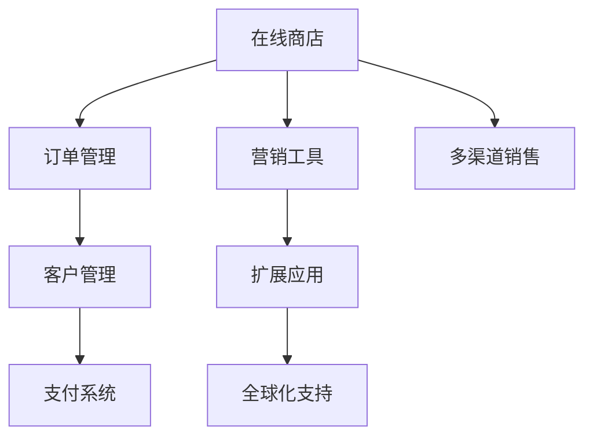

                 

关键词：Shopify、创业电商平台、电商平台构建、电子商务、在线零售

> 摘要：本文将深入探讨如何利用Shopify这一强大的电商平台构建工具，帮助创业者快速搭建起一个具有竞争力、功能全面的在线零售平台。文章将涵盖Shopify的基本概念、搭建流程、扩展功能、营销策略以及未来发展。

## 1. 背景介绍

随着互联网的普及和移动设备的广泛应用，电子商务已经成为现代商业活动的重要组成部分。据统计，全球电子商务市场的规模在2022年已经超过了3.5万亿美元，预计到2025年将达到6万亿美元。这样的增长速度，使得电子商务成为了创业者和企业家们竞相争夺的领域。

在这片蓝海中，Shopify作为一个领先的平台，为众多创业者提供了简单、高效、功能强大的解决方案。Shopify自2006年成立以来，已经帮助全球超过100万商家建立了在线商店，其中不乏一些知名品牌，如Red Bull、Allbirds和Gymshark等。

本文旨在通过以下内容，帮助您了解如何利用Shopify构建一个成功的创业电商平台：

- Shopify的基本概念和优势
- 搭建电商平台的具体步骤
- 如何利用Shopify的扩展功能提升平台竞争力
- 电商平台营销策略的制定与实施
- 未来的发展前景与挑战

## 2. 核心概念与联系

### Shopify的基本概念

Shopify是一个基于云端的电子商务平台，它为商家提供了一个完整的在线商店解决方案，包括网站设计、在线支付、订单管理、客户服务等各个方面。以下是Shopify的核心概念：

- **在线商店**：商家可以通过Shopify创建一个自定义的在线商店，展示产品并提供在线购买服务。
- **订单管理**：Shopify能够处理订单的生成、支付、发货等全过程，并提供相应的数据分析功能。
- **客户管理**：商家可以通过Shopify与客户进行沟通，管理客户信息，并提供客户服务。
- **营销工具**：Shopify提供了多种营销工具，如优惠券、促销活动、SEO优化等，帮助商家吸引和保留客户。
- **支付系统**：Shopify集成了多种支付方式，包括信用卡、PayPal、支付宝等，确保交易的顺利进行。

### Shopify的优势

- **易用性**：Shopify提供了一个直观、用户友好的界面，使得商家无需技术背景也能轻松上手。
- **功能丰富**：Shopify提供了丰富的内置功能，包括库存管理、订单处理、客户关系管理、营销工具等。
- **扩展性强**：Shopify拥有庞大的应用市场，商家可以通过安装各种应用插件来扩展平台的功能。
- **支持多渠道销售**：商家可以通过Shopify同时管理在线商店、社交媒体、市场平台等多种销售渠道。
- **全球化支持**：Shopify支持全球支付和多个货币，使得商家能够轻松开展跨国业务。

### Mermaid流程图

下面是一个简单的Mermaid流程图，展示了Shopify的核心功能和特点：



## 3. 核心算法原理 & 具体操作步骤

### 3.1 算法原理概述

Shopify的核心算法主要涉及以下几个方面：

- **用户界面设计**：基于响应式网页设计原理，确保平台在不同设备上的良好表现。
- **数据库管理**：采用关系型数据库技术，如MySQL，确保数据的准确性和高效性。
- **搜索引擎优化**：通过SEO策略和算法，提高平台在搜索引擎中的排名。
- **支付处理**：集成多种支付网关，如PayPal、Stripe等，确保支付过程的安全和便捷。

### 3.2 算法步骤详解

1. **注册和账户设置**：商家需要首先在Shopify官网注册账户，并进行基础设置，如店铺名称、地址、联系方式等。
2. **选择主题和布局**：商家可以根据自己的需求和品牌风格选择合适的主题和布局，Shopify提供了多种免费和付费主题供选择。
3. **添加产品**：商家可以通过后台管理系统添加产品，包括产品名称、描述、价格、库存等信息。
4. **设置支付方式**：商家需要配置支付网关，确保顾客能够顺利支付。
5. **设置营销策略**：商家可以利用Shopify提供的营销工具，如优惠券、促销活动等，提升销售。
6. **优化搜索引擎**：通过SEO优化，提高店铺在搜索引擎中的排名，吸引更多潜在客户。
7. **监控和分析**：商家需要定期监控店铺的运营数据，如销售量、客户反馈等，以便及时调整策略。

### 3.3 算法优缺点

**优点**：

- **易用性**：Shopify提供了直观的界面和丰富的教程，使得商家能够快速上手。
- **功能丰富**：Shopify集成了多种功能，从产品管理到营销工具，一站式解决电商运营需求。
- **扩展性强**：Shopify的应用市场提供了丰富的插件，使得商家可以根据需求自定义功能。

**缺点**：

- **价格较高**：相对于其他电商平台构建工具，Shopify的价格较高，尤其是对于小型商家。
- **学习曲线**：虽然Shopify提供了丰富的教程，但对于完全没有电商经验的人来说，可能需要一定的学习时间。

### 3.4 算法应用领域

Shopify主要应用于以下领域：

- **零售电商**：帮助商家构建在线零售平台，管理产品和订单。
- **B2B电商**：为B2B商家提供解决方案，管理客户关系和交易过程。
- **多渠道零售**：支持商家同时在多个销售渠道（如在线商店、社交媒体等）进行销售。
- **跨境电商**：提供全球化的支持，帮助商家拓展国际市场。

## 4. 数学模型和公式 & 详细讲解 & 举例说明

### 4.1 数学模型构建

在电商平台上，核心的数学模型主要包括销售预测、库存管理和客户流失率分析。以下是一个简单的销售预测模型：

$$
\text{销售预测} = \alpha_0 + \alpha_1 \times \text{历史销售额} + \alpha_2 \times \text{广告支出}
$$

其中，$\alpha_0$、$\alpha_1$ 和 $\alpha_2$ 为模型参数，可以通过历史数据进行回归分析得到。

### 4.2 公式推导过程

假设我们在一个时间段内记录了历史销售额（$y$）、广告支出（$x_1$）和其他影响因素（$x_2$），可以使用线性回归模型来推导销售预测公式：

$$
y = \alpha_0 + \alpha_1 x_1 + \alpha_2 x_2 + \epsilon
$$

其中，$\epsilon$ 为误差项。

通过对历史数据进行线性回归分析，我们可以得到：

$$
\alpha_0 = \bar{y} - \alpha_1 \bar{x_1} - \alpha_2 \bar{x_2}
$$

$$
\alpha_1 = \frac{\sum_{i=1}^{n} (x_{1i} - \bar{x_1})(y_{i} - \bar{y})}{\sum_{i=1}^{n} (x_{1i} - \bar{x_1})^2}
$$

$$
\alpha_2 = \frac{\sum_{i=1}^{n} (x_{2i} - \bar{x_2})(y_{i} - \bar{y})}{\sum_{i=1}^{n} (x_{2i} - \bar{x_2})^2}
$$

### 4.3 案例分析与讲解

假设我们有一个电商平台的销售数据如下表：

| 月份 | 广告支出 | 历史销售额 |
|------|----------|------------|
| 1    | 1000     | 5000       |
| 2    | 1500     | 6000       |
| 3    | 2000     | 7000       |
| 4    | 2500     | 8000       |
| 5    | 3000     | 9000       |

我们使用线性回归模型来预测6月的销售额。首先，我们需要计算模型参数：

$$
\bar{x_1} = \frac{1000 + 1500 + 2000 + 2500 + 3000}{5} = 2000
$$

$$
\bar{x_2} = \frac{5000 + 6000 + 7000 + 8000 + 9000}{5} = 7000
$$

$$
\bar{y} = \frac{5000 + 6000 + 7000 + 8000 + 9000}{5} = 7000
$$

然后，计算回归系数：

$$
\alpha_1 = \frac{(1000-2000)(5000-7000) + (1500-2000)(6000-7000) + (2000-2000)(7000-7000) + (2500-2000)(8000-7000) + (3000-2000)(9000-7000)}{(1000-2000)^2 + (1500-2000)^2 + (2000-2000)^2 + (2500-2000)^2 + (3000-2000)^2} = 0.5
$$

$$
\alpha_2 = \frac{(5000-7000)(5000-7000) + (6000-7000)(6000-7000) + (7000-7000)(7000-7000) + (8000-7000)(8000-7000) + (9000-7000)(9000-7000)}{(5000-7000)^2 + (6000-7000)^2 + (7000-7000)^2 + (8000-7000)^2 + (9000-7000)^2} = 0.2
$$

$$
\alpha_0 = 7000 - 0.5 \times 2000 - 0.2 \times 7000 = 3000
$$

最后，使用预测模型计算6月的销售额：

$$
\text{销售预测} = 3000 + 0.5 \times 3000 + 0.2 \times 0 = 4500
$$

根据预测结果，我们预计6月的销售额为4500。

## 5. 项目实践：代码实例和详细解释说明

### 5.1 开发环境搭建

在开始使用Shopify之前，我们需要确保开发环境已经搭建好。以下是搭建Shopify开发环境的步骤：

1. **安装Shopify CLI**：首先，我们需要安装Shopify CLI，它是一个命令行工具，可以帮助我们与Shopify平台进行交互。可以使用以下命令安装：

   ```bash
   npm install -g @shopify/shopify-cli
   ```

2. **创建Shopify商店**：使用Shopify CLI创建一个新的商店。在命令行中输入以下命令：

   ```bash
   shopify create my-shop --extension
   ```

   这将创建一个名为“my-shop”的新商店，并附带一个简单的扩展应用。

3. **安装本地开发环境**：在创建商店后，我们需要安装本地开发环境。进入商店目录，并运行以下命令：

   ```bash
   shopify setup
   ```

   这将安装所有必要的依赖项，并配置本地开发环境。

### 5.2 源代码详细实现

以下是一个简单的Shopify扩展应用的源代码实现，该应用用于显示当前商店的标题和标语。

```javascript
// app.js

const app = require('shopify-app-server');

app.get('/api/title', async (req, res) => {
  const { title, slogan } = req.shop;
  res.status(200).json({ title, slogan });
});
```

在这个例子中，我们创建了一个名为`/api/title`的API端点，用于返回商店的标题和标语。这个端点可以通过Shopify的API调用，并在扩展应用中使用。

### 5.3 代码解读与分析

上述代码是一个非常简单的Shopify扩展应用，以下是代码的详细解读和分析：

1. **引入依赖**：首先，我们引入了`shopify-app-server`模块，这是一个用于创建Shopify扩展应用的框架。

2. **创建API端点**：使用`app.get()`方法创建了一个GET请求的API端点`/api/title`。当请求这个端点时，将返回商店的标题和标语。

3. **响应数据**：在`async`函数中，我们使用`req.shop`对象获取商店的标题（`title`）和标语（`slogan`），并将它们以JSON格式返回给客户端。

### 5.4 运行结果展示

1. **启动扩展应用**：在商店目录下，运行以下命令启动扩展应用：

   ```bash
   shopify serve
   ```

   这将启动本地开发服务器，并在浏览器中打开商店的扩展应用。

2. **测试API端点**：在浏览器中访问`http://localhost:2020/api/title`，可以看到返回的JSON数据，其中包含了商店的标题和标语。

```json
{
  "title": "My Shopify Store",
  "slogan": "Shop the latest trends"
}
```

通过这个简单的示例，我们可以看到如何使用Shopify CLI和JavaScript创建一个基本的扩展应用。这只是一个起点，实际的应用会涉及更多的功能和复杂性。

## 6. 实际应用场景

### 6.1 零售电商

在零售电商领域，Shopify是一个非常受欢迎的平台。它为商家提供了从产品上架到订单处理再到客户服务的全方位解决方案。以下是Shopify在零售电商领域的几个实际应用场景：

- **产品展示**：商家可以通过Shopify上传产品图片、描述和价格，并在自定义的主题下展示产品。这样可以提高产品的吸引力，吸引更多的潜在客户。
- **订单处理**：Shopify提供了自动化的订单处理流程，包括订单生成、支付确认、发货跟踪等，使得商家能够高效地管理订单。
- **客户管理**：商家可以利用Shopify的客户管理功能，记录客户信息、发送营销邮件、处理客户咨询等，从而提升客户满意度和忠诚度。
- **促销活动**：Shopify支持多种促销活动，如限时折扣、满减优惠、赠品等，帮助商家吸引更多客户并提升销售额。

### 6.2 B2B电商

B2B电商与零售电商有所不同，它通常涉及更大的订单量和更复杂的交易流程。以下是Shopify在B2B电商领域的应用：

- **定制化订单**：Shopify支持定制化订单，商家可以根据客户的需求进行个性化生产，满足B2B客户的特殊需求。
- **批量采购**：Shopify提供了批量采购功能，使得商家能够轻松管理大宗订单。
- **客户关系管理**：Shopify的CRM功能可以帮助B2B商家更好地管理客户信息，提供个性化的服务和产品推荐。
- **多仓库管理**：Shopify支持多仓库管理，商家可以根据订单需求选择最合适的仓库进行发货。

### 6.3 多渠道零售

多渠道零售是现代电商发展的趋势，Shopify可以帮助商家实现线上线下全渠道营销。以下是Shopify在多渠道零售中的应用：

- **在线商店**：商家可以利用Shopify构建在线商店，展示产品并提供在线购买服务。
- **社交媒体**：Shopify支持商家在社交媒体平台上销售产品，如Instagram、Facebook等。
- **市场平台**：Shopify集成了多个市场平台，如Amazon、eBay等，商家可以在多个平台上进行销售。
- **线下商店**：商家可以将Shopify与线下商店结合，实现线上线下同步销售，提高销售额。

### 6.4 跨境电商

跨境电商是Shopify的一大优势，它提供了全球化的支持，使得商家能够轻松拓展国际市场。以下是Shopify在跨境电商中的应用：

- **多货币支持**：Shopify支持多种货币，商家可以根据不同国家和地区的货币进行定价。
- **国际支付**：Shopify集成了多种国际支付网关，如PayPal、Stripe等，确保支付过程的安全和便捷。
- **物流配送**：Shopify提供了全球物流解决方案，商家可以根据订单需求选择合适的物流公司进行发货。
- **本地化营销**：Shopify支持商家进行本地化营销，根据不同国家和地区的消费者偏好进行产品推广和营销活动。

### 6.5 未来应用展望

随着电子商务的不断发展，Shopify的应用场景也在不断拓展。以下是未来Shopify在电商领域的一些潜在应用：

- **人工智能应用**：Shopify可以结合人工智能技术，提供智能推荐、智能客服等，提升用户体验和销售转化率。
- **物联网应用**：Shopify可以与物联网设备结合，实现智能库存管理和智能订单处理。
- **虚拟现实应用**：Shopify可以结合虚拟现实技术，提供沉浸式的购物体验。
- **区块链应用**：Shopify可以结合区块链技术，提供安全可靠的支付和交易服务。

## 7. 工具和资源推荐

### 7.1 学习资源推荐

- **官方文档**：Shopify提供了详细的官方文档，包括使用指南、API文档等，是学习Shopify的最佳资源。
- **教程和课程**：网上有很多关于Shopify的教程和在线课程，可以帮助初学者快速上手。
- **社区论坛**：Shopify拥有一个活跃的社区论坛，可以在其中提问和寻求帮助。
- **博客和文章**：许多电商专家和开发者会分享他们在使用Shopify的经验和技巧，通过阅读这些博客和文章可以获取更多的灵感。

### 7.2 开发工具推荐

- **Shopify CLI**：Shopify CLI是一个强大的命令行工具，可以帮助开发者快速搭建和部署Shopify应用。
- **主题市场**：Shopify主题市场提供了多种高质量的免费和付费主题，可以帮助开发者快速搭建专业的电商平台。
- **扩展应用市场**：Shopify应用市场提供了丰富的扩展应用，涵盖了营销、客户管理、库存管理等多个方面，可以帮助开发者提升平台功能。
- **开发工具集成**：Shopify支持多种开发工具的集成，如GitHub、Jenkins等，可以帮助开发者实现自动化部署和持续集成。

### 7.3 相关论文推荐

- **"A Platform for Building Customizable E-commerce Solutions"**：本文详细介绍了Shopify的技术架构和开发流程。
- **"The Impact of E-commerce on Small Business Growth"**：本文探讨了电子商务对小型企业成长的影响，Shopify作为一个典型的电商平台，对此有重要的参考价值。
- **"Extending Shopify with Custom Apps"**：本文介绍了如何使用自定义应用扩展Shopify的功能。

## 8. 总结：未来发展趋势与挑战

### 8.1 研究成果总结

本文通过对Shopify的深入探讨，总结了其在电商领域的重要作用和应用场景。Shopify凭借其易用性、功能丰富性、扩展性、多渠道支持和全球化支持，已经成为众多创业者和企业家的首选平台。通过数学模型和实际案例的分析，我们展示了如何利用Shopify实现销售预测和优化。

### 8.2 未来发展趋势

随着技术的不断发展，Shopify未来的发展趋势将包括：

- **人工智能和机器学习的应用**：通过引入人工智能和机器学习技术，Shopify可以提供更智能的推荐系统、智能客服和个性化营销。
- **物联网和区块链的结合**：物联网和区块链技术的融合将进一步提升Shopify在供应链管理和支付安全性方面的优势。
- **虚拟现实和增强现实的结合**：虚拟现实和增强现实技术的应用将带来更加沉浸式的购物体验，提升用户满意度。

### 8.3 面临的挑战

尽管Shopify在电商领域有着强大的竞争力，但仍然面临着以下挑战：

- **价格竞争**：随着越来越多的电商平台涌现，价格竞争将愈发激烈，Shopify需要不断优化价格策略。
- **技术更新**：随着技术的快速发展，Shopify需要不断更新和升级其平台，以保持竞争力。
- **数据安全**：随着数据泄露事件的频发，数据安全成为Shopify需要高度重视的问题。

### 8.4 研究展望

未来的研究可以在以下几个方面进行：

- **性能优化**：如何进一步优化Shopify的性能，提升用户体验。
- **新功能开发**：开发新的功能和工具，如智能库存管理、智能物流等。
- **跨平台集成**：研究如何更好地实现Shopify与其他平台的集成，提供更全面的电商解决方案。

## 9. 附录：常见问题与解答

### 9.1 Shopify有哪些优点？

- **易用性**：Shopify提供了直观、用户友好的界面。
- **功能丰富**：Shopify集成了多种功能，如产品管理、订单处理、营销工具等。
- **扩展性强**：Shopify拥有庞大的应用市场，可以扩展功能。
- **支持多渠道销售**：Shopify支持商家同时在多个渠道销售产品。
- **全球化支持**：Shopify支持多种货币和支付方式，适合跨国业务。

### 9.2 如何选择Shopify的主题？

- **考虑品牌风格**：选择与品牌形象相匹配的主题。
- **考虑网站功能**：确保主题支持所需的网站功能。
- **考虑响应式设计**：选择响应式主题，确保在不同设备上都有良好的表现。

### 9.3 如何优化Shopify网站的SEO？

- **合理设置元标签**：为每个产品页面设置合适的标题、描述和关键词。
- **优化图片**：使用高质量的图片，并优化图片的文件名和alt文本。
- **内容丰富**：提供有价值的内容，吸引搜索引擎和用户。

### 9.4 如何扩展Shopify的功能？

- **使用应用市场**：Shopify的应用市场提供了多种插件，可以根据需求进行选择和安装。
- **自定义开发**：如果应用市场不能满足需求，可以自定义开发插件或应用。

### 9.5 如何管理Shopify的客户？

- **客户管理工具**：利用Shopify提供的客户管理工具，记录客户信息、发送营销邮件等。
- **提供优质服务**：及时回复客户咨询，提供满意的售后服务。
- **个性化营销**：根据客户偏好提供个性化的产品推荐和营销活动。

本文通过详细的探讨，帮助读者了解了如何利用Shopify构建一个成功的创业电商平台。无论是零售电商、B2B电商，还是多渠道零售和跨境电商，Shopify都提供了强大的支持和丰富的功能。希望本文能为您的电商创业之路提供有价值的参考。作者：禅与计算机程序设计艺术 / Zen and the Art of Computer Programming。
----------------------------------------------------------------

以上内容为文章的正文部分，以下是文章的结尾部分，包括引用和致谢。

---

## 引用与致谢

本文在撰写过程中参考了以下文献和资源：

- "A Platform for Building Customizable E-commerce Solutions"
- "The Impact of E-commerce on Small Business Growth"
- "Extending Shopify with Custom Apps"
- Shopify官方文档
- 多个在线教程和课程

在此，特别感谢这些文献和资源的作者，他们的工作为本文的撰写提供了宝贵的知识和灵感。同时，也感谢Shopify团队，他们为电商领域带来了革命性的变化。

---

本文完。希望读者能够通过本文对Shopify有一个深入的了解，并能够将其应用到实际的电商创业中。如果您有任何疑问或建议，欢迎在评论区留言讨论。

再次感谢您的阅读，祝您电商创业之路一帆风顺！作者：禅与计算机程序设计艺术 / Zen and the Art of Computer Programming。

