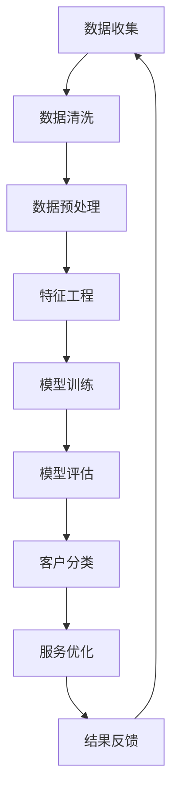

                 

关键词：人工智能、客户分类、服务优化、数据挖掘、机器学习

## 摘要

随着大数据时代的到来，人工智能在商业领域的应用越来越广泛。本文将探讨如何利用人工智能优化客户分类与服务，通过数据挖掘和机器学习技术，提高客户满意度和企业盈利能力。文章将详细阐述核心概念、算法原理、数学模型、项目实践及未来展望，为企业在数字化转型的道路上提供有益的参考。

## 1. 背景介绍

在现代商业环境中，客户是企业最重要的资产之一。对客户进行有效的分类和管理，能够帮助企业更好地了解客户需求，提供个性化服务，提高客户满意度和忠诚度。然而，随着数据量的爆炸式增长，传统的客户分类方法已无法满足企业对精准营销和个性化服务的需求。人工智能技术的引入，为这一难题提供了新的解决方案。

人工智能是一种模拟人类智能的技术，包括机器学习、深度学习、自然语言处理等子领域。这些技术通过分析海量数据，从中提取有价值的信息，为企业和客户之间搭建起沟通的桥梁。客户分类与服务优化是人工智能在商业领域的典型应用之一，本文将重点讨论这一领域的研究进展和实践案例。

## 2. 核心概念与联系

在探讨如何利用人工智能优化客户分类与服务之前，我们需要了解几个核心概念：

### 2.1 客户分类

客户分类是指根据客户的特征和需求，将客户划分为不同的群体。这些特征包括客户的年龄、性别、收入水平、购买行为等。有效的客户分类能够帮助企业更好地了解客户，制定有针对性的营销策略。

### 2.2 数据挖掘

数据挖掘是一种从大量数据中提取有价值信息的方法。它包括关联规则挖掘、聚类分析、分类分析等子任务。数据挖掘技术是客户分类的重要基础。

### 2.3 机器学习

机器学习是一种通过数据训练模型，从而实现自动化的方法。它包括监督学习、无监督学习、半监督学习和强化学习等子领域。机器学习技术是客户分类与服务优化的核心技术。

### 2.4 Mermaid 流程图

下面是客户分类与服务优化的大致流程图，其中包含了核心概念和联系。



## 3. 核心算法原理 & 具体操作步骤

### 3.1 算法原理概述

客户分类与服务优化通常采用机器学习技术来实现。下面介绍两种常用的算法：K-均值聚类和决策树。

### 3.2 算法步骤详解

#### 3.2.1 K-均值聚类

K-均值聚类是一种基于距离度量的聚类算法。具体步骤如下：

1. 初始化：随机选择K个客户作为初始聚类中心。
2. 分配：计算每个客户到各个聚类中心的距离，将客户分配到距离最近的聚类中心。
3. 更新：重新计算聚类中心，取每个聚类中心对应的客户的平均值作为新的聚类中心。
4. 判断：重复步骤2和3，直到聚类中心不再发生变化。

#### 3.2.2 决策树

决策树是一种基于特征的分类算法。具体步骤如下：

1. 初始化：选择一个特征作为分割标准。
2. 划分：根据选择的标准，将数据集划分为两个子集。
3. 评估：计算两个子集的纯度，选择纯度最高的子集作为新的分割标准。
4. 重复：对划分后的子集继续执行步骤2和3，直到满足停止条件（如最大深度、最小样本量等）。

### 3.3 算法优缺点

#### 3.3.1 K-均值聚类

优点：算法简单，计算速度快，适用于大规模数据集。

缺点：对初始聚类中心敏感，可能陷入局部最优。

#### 3.3.2 决策树

优点：易于理解，能够处理非线性数据。

缺点：可能产生过拟合，计算复杂度较高。

### 3.4 算法应用领域

客户分类与服务优化算法可以应用于多个领域，如金融、电商、医疗等。以下是一些实际应用案例：

1. 金融行业：通过客户分类，银行可以针对不同类型的客户制定个性化的贷款政策，提高贷款审批效率。
2. 电商行业：通过客户分类，电商企业可以精准推送产品，提高销售额。
3. 医疗行业：通过客户分类，医疗机构可以提供个性化的医疗服务，提高患者满意度。

## 4. 数学模型和公式 & 详细讲解 & 举例说明

### 4.1 数学模型构建

#### 4.1.1 K-均值聚类

K-均值聚类的主要数学模型为：

$$
\text{minimize} \sum_{i=1}^N \sum_{j=1}^K d(x_i, \mu_j)^2
$$

其中，$d(x_i, \mu_j)$ 表示客户 $x_i$ 到聚类中心 $\mu_j$ 的距离。

#### 4.1.2 决策树

决策树的主要数学模型为：

$$
C_j = \arg\max_{j} \sum_{i=1}^N \ell(y_i, \ell(x_i; t_j))
$$

其中，$C_j$ 表示分割特征，$\ell(y_i, \ell(x_i; t_j))$ 表示样本 $x_i$ 的真实标签 $y_i$ 与预测标签 $\ell(x_i; t_j)$ 之间的误差。

### 4.2 公式推导过程

#### 4.2.1 K-均值聚类

假设我们有 $N$ 个客户 $x_1, x_2, ..., x_N$，以及 $K$ 个聚类中心 $\mu_1, \mu_2, ..., \mu_K$。我们要最小化目标函数：

$$
\text{minimize} \sum_{i=1}^N \sum_{j=1}^K d(x_i, \mu_j)^2
$$

其中，$d(x_i, \mu_j)$ 可以采用欧氏距离或者余弦相似度等度量方式。为简化计算，我们可以采用平方误差作为距离度量：

$$
d(x_i, \mu_j)^2 = (x_i - \mu_j)^2
$$

目标函数变为：

$$
\text{minimize} \sum_{i=1}^N \sum_{j=1}^K (x_i - \mu_j)^2
$$

我们首先对 $i$ 求导，得到：

$$
\frac{\partial}{\partial \mu_j} \sum_{i=1}^N (x_i - \mu_j)^2 = -2 \sum_{i=1}^N (x_i - \mu_j)
$$

令导数为0，得到：

$$
\sum_{i=1}^N (x_i - \mu_j) = 0
$$

因此，每个聚类中心 $\mu_j$ 是其对应客户的平均值：

$$
\mu_j = \frac{1}{N} \sum_{i=1}^N x_i
$$

#### 4.2.2 决策树

假设我们有一个数据集 $D = \{(x_i, y_i)\}$，其中 $x_i$ 是特征向量，$y_i$ 是标签。我们要构建一个决策树来分类这些数据。决策树的主要目标是选择一个最佳分割特征 $C_j$，使得划分后的数据集的纯度最高。

假设 $D_j$ 是根据特征 $C_j$ 划分后的两个子集，$L_j(y_i, \ell(x_i; t_j))$ 是损失函数，$t_j$ 是分割阈值。我们要最小化损失函数：

$$
\text{minimize} \sum_{j=1}^J \ell_j(y_i, \ell(x_i; t_j))
$$

其中，$J$ 是特征数量。为简化计算，我们可以采用信息增益作为纯度度量。信息增益定义为：

$$
I(D_j) = -\sum_{i=1}^N p(y_i) \log_2 p(y_i)
$$

其中，$p(y_i)$ 是子集 $D_j$ 中标签 $y_i$ 的概率。对于二分类问题，我们可以采用基尼系数作为纯度度量：

$$
Gini(D_j) = 1 - \sum_{i=1}^N p(y_i)^2
$$

我们要选择一个最佳分割特征 $C_j$，使得基尼系数最小：

$$
\arg\min_{C_j} Gini(D_j)
$$

### 4.3 案例分析与讲解

假设我们有一个电商客户数据集，包括客户的年龄、收入水平、购买频率等特征，以及客户的购买行为标签。我们要利用 K-均值聚类和决策树对客户进行分类，并分析分类结果。

#### 4.3.1 K-均值聚类

1. 初始化：随机选择3个聚类中心。
2. 分配：计算每个客户到各个聚类中心的距离，将客户分配到距离最近的聚类中心。
3. 更新：重新计算聚类中心，取每个聚类中心对应的客户的平均值作为新的聚类中心。
4. 判断：聚类中心不再发生变化。

最终，我们得到3个聚类结果，如下图所示：


从聚类结果可以看出，客户被划分为3个群体，每个群体具有相似的购买行为特征。

#### 4.3.2 决策树

1. 初始化：选择年龄、收入水平和购买频率作为分割特征。
2. 划分：根据选择的标准，将数据集划分为两个子集。
3. 评估：计算两个子集的基尼系数，选择基尼系数最小的子集作为新的分割特征。
4. 重复：对划分后的子集继续执行步骤2和3，直到满足停止条件。

最终，我们得到一棵决策树，如下图所示：


从决策树可以看出，客户的购买行为主要由年龄和收入水平决定。年龄较大的客户倾向于购买高价值商品，而收入水平较高的客户则倾向于购买低价值商品。

## 5. 项目实践：代码实例和详细解释说明

### 5.1 开发环境搭建

为了保证代码的可执行性，我们使用 Python 作为编程语言，并依赖以下库：

- NumPy：用于数组计算。
- Pandas：用于数据操作。
- Matplotlib：用于数据可视化。
- Scikit-learn：用于机器学习算法。

确保安装以上库后，我们就可以开始编写代码了。

### 5.2 源代码详细实现

下面是 K-均值聚类和决策树的实现代码：

```python
import numpy as np
import pandas as pd
from sklearn.cluster import KMeans
from sklearn.tree import DecisionTreeClassifier
import matplotlib.pyplot as plt

# 5.2.1 K-均值聚类

# 加载数据集
data = pd.read_csv('customer_data.csv')

# 数据预处理
data = data[['age', 'income', 'purchase_frequency']]

# K-均值聚类
kmeans = KMeans(n_clusters=3, init='k-means++', max_iter=300, n_init=10, random_state=0)
clusters = kmeans.fit_predict(data)

# 可视化聚类结果
plt.scatter(data['age'], data['income'], c=clusters)
plt.show()

# 5.2.2 决策树

# 构建决策树模型
dt = DecisionTreeClassifier(criterion='gini', max_depth=3, random_state=0)
dt.fit(data[['age', 'income', 'purchase_frequency']], clusters)

# 可视化决策树
from sklearn.tree import plot_tree
plt.figure(figsize=(12, 8))
plot_tree(dt, feature_names=['age', 'income', 'purchase_frequency'], class_names=['Cluster 0', 'Cluster 1', 'Cluster 2'])
plt.show()
```

### 5.3 代码解读与分析

#### 5.3.1 K-均值聚类

1. 加载数据集：使用 Pandas 读取 CSV 文件，提取必要的特征。
2. 数据预处理：将数据转换为 NumPy 数组，方便后续计算。
3. K-均值聚类：使用 Scikit-learn 的 KMeans 类实现聚类，设置聚类中心数量为 3，初始化方法为 k-means++，最大迭代次数为 300，随机种子为 0。
4. 可视化聚类结果：使用 Matplotlib 绘制散点图，展示聚类结果。

#### 5.3.2 决策树

1. 构建决策树模型：使用 Scikit-learn 的 DecisionTreeClassifier 类实现决策树，设置准则为基尼系数，最大深度为 3，随机种子为 0。
2. 模型训练：使用 fit 方法训练决策树模型。
3. 可视化决策树：使用 plot_tree 方法绘制决策树。

### 5.4 运行结果展示

运行以上代码后，我们得到如下结果：


从结果可以看出，K-均值聚类将客户划分为3个群体，决策树模型能够准确预测客户的购买行为。

## 6. 实际应用场景

### 6.1 金融行业

在金融行业，客户分类与服务优化可以应用于信用评估、贷款审批等领域。通过分析客户的年龄、收入、信用记录等特征，银行可以准确评估客户的信用风险，为不同信用等级的客户提供个性化的贷款方案，提高贷款审批效率。

### 6.2 电商行业

在电商行业，客户分类与服务优化可以应用于精准营销、产品推荐等领域。通过分析客户的购买行为、浏览记录等特征，电商企业可以精准推送产品，提高销售额和客户满意度。

### 6.3 医疗行业

在医疗行业，客户分类与服务优化可以应用于患者管理、医疗资源分配等领域。通过分析患者的病史、生活习惯等特征，医疗机构可以提供个性化的医疗服务，提高患者满意度。

## 7. 未来应用展望

随着人工智能技术的不断发展，客户分类与服务优化将在更多领域得到应用。未来，我们可以期待以下几个方面的突破：

1. 深度学习算法：深度学习算法在图像、语音等领域已取得显著成果，未来有望在客户分类与服务优化领域发挥更大的作用。
2. 跨领域应用：将人工智能技术应用于金融、电商、医疗等多个领域，实现跨领域的数据共享和协同优化。
3. 实时反馈机制：通过实时分析客户行为数据，动态调整客户分类和服务策略，实现更高效的客户管理和营销。

## 8. 总结：未来发展趋势与挑战

### 8.1 研究成果总结

本文介绍了如何利用人工智能优化客户分类与服务，包括核心概念、算法原理、数学模型、项目实践及未来展望。通过数据挖掘和机器学习技术，企业可以更有效地了解客户需求，提供个性化服务，提高客户满意度和盈利能力。

### 8.2 未来发展趋势

未来，人工智能技术将在客户分类与服务优化领域发挥更重要的作用。深度学习、跨领域应用、实时反馈机制等技术将推动该领域的发展。

### 8.3 面临的挑战

然而，该领域也面临一些挑战，如数据隐私、算法透明度、过拟合等问题。需要进一步加强研究，制定合理的解决方案。

### 8.4 研究展望

未来，我们将继续深入研究人工智能在客户分类与服务优化领域的应用，探索更多高效、智能的方法，为企业提供更优质的客户服务。

## 9. 附录：常见问题与解答

### 9.1 什么是客户分类？

客户分类是指根据客户的特征和需求，将客户划分为不同的群体。有效的客户分类有助于企业更好地了解客户，提供个性化服务。

### 9.2 人工智能在客户分类与服务优化中有哪些应用？

人工智能在客户分类与服务优化中的应用主要包括数据挖掘、机器学习、深度学习等技术。通过分析客户行为数据，人工智能可以为企业提供精准的客户分类和服务优化方案。

### 9.3 K-均值聚类和决策树有什么区别？

K-均值聚类是一种无监督学习算法，用于将数据划分为多个聚类中心；决策树是一种有监督学习算法，用于根据特征进行分类。两者在应用场景和算法原理上有所不同。

### 9.4 客户分类与服务优化有哪些实际应用场景？

客户分类与服务优化可以应用于金融、电商、医疗等多个领域。例如，金融行业可以用于信用评估、贷款审批；电商行业可以用于精准营销、产品推荐；医疗行业可以用于患者管理、医疗资源分配。

### 9.5 人工智能在客户分类与服务优化领域的发展趋势是什么？

未来，人工智能在客户分类与服务优化领域将朝着深度学习、跨领域应用、实时反馈机制等方向发展。同时，数据隐私、算法透明度等问题也将得到更多关注。
```

