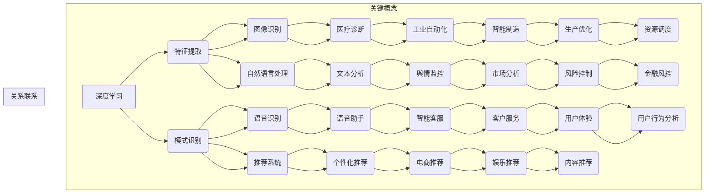

                 

  
关键词：人工智能、业务效率、深度学习、数据挖掘、流程优化、自动化

摘要：本文探讨了如何利用人工智能技术提升业务效率，通过核心算法原理讲解、数学模型分析、项目实践案例分享和未来应用展望等多个角度，详细阐述了人工智能在业务流程中的潜力和实际应用，为企业和个人提供了实用的指导和策略。

## 1. 背景介绍

在数字化转型的浪潮中，人工智能（AI）已经成为企业提升业务效率和竞争力的关键因素。人工智能通过模拟人类的智能行为，能够自动处理复杂的问题，分析大量的数据，并给出智能化的决策支持。随着计算能力的提升和数据资源的丰富，人工智能的应用范围不断扩大，从传统的自动化控制到复杂的数据分析，再到智能客服和自动驾驶等众多领域，都展现了其强大的潜力。

业务效率的提升是企业持续发展的核心目标之一。通过优化业务流程、减少人力成本、提高生产效率和客户满意度，企业可以显著提升整体效益。而人工智能技术在这一过程中扮演了重要的角色，不仅能够处理大量的重复性工作，还能够通过智能预测和决策支持，帮助企业提前预判市场趋势，降低风险。

本文将从以下几个方面展开讨论：

1. **核心概念与联系**：介绍人工智能提升业务效率的关键概念，包括深度学习、数据挖掘、机器学习等。
2. **核心算法原理 & 具体操作步骤**：详细解析如何利用这些算法来提升业务效率。
3. **数学模型和公式 & 详细讲解 & 举例说明**：阐述相关数学模型和公式的构建及推导。
4. **项目实践：代码实例和详细解释说明**：通过实际项目案例，展示人工智能技术的应用。
5. **实际应用场景**：探讨人工智能在不同业务场景中的应用。
6. **未来应用展望**：分析人工智能技术未来的发展趋势和潜在应用。
7. **工具和资源推荐**：推荐学习资源、开发工具和相关论文。
8. **总结：未来发展趋势与挑战**：总结研究成果，展望未来趋势和面临的挑战。

通过以上内容的探讨，本文希望能够为读者提供一份全面、深入的人工智能提升业务效率的指南。

## 2. 核心概念与联系

为了深入理解人工智能提升业务效率的原理，我们首先需要了解几个核心概念，它们分别是深度学习、数据挖掘、机器学习等。以下是这些概念的定义和它们之间的联系。

### 2.1 深度学习

深度学习是人工智能的一个重要分支，它通过构建深度神经网络（Deep Neural Network, DNN）来模拟人脑的学习过程。深度学习具有强大的特征提取和模式识别能力，能够自动学习数据的特征表示，并在各种复杂任务中表现出色。例如，在图像识别、语音识别和自然语言处理等领域，深度学习已经取得了显著的成果。

### 2.2 数据挖掘

数据挖掘（Data Mining）是从大量数据中提取有价值的信息和知识的过程。它涉及统计学、机器学习、数据库和人工智能等多个领域。数据挖掘的目标是从数据中发现潜在的规律、趋势和模式，为决策提供支持。在商业应用中，数据挖掘可以用于市场分析、客户关系管理、风险控制等。

### 2.3 机器学习

机器学习（Machine Learning）是使计算机系统能够从数据中学习并做出决策或预测的一种方法。机器学习包括监督学习、无监督学习和强化学习等多种类型。监督学习通过已标记的数据来训练模型，无监督学习则从未标记的数据中自动发现结构，强化学习则通过与环境交互来不断优化策略。

### 2.4 关系与联系

深度学习和数据挖掘密切相关，深度学习是数据挖掘的一个重要工具，能够帮助从大量数据中提取特征和模式。而机器学习则是深度学习和数据挖掘的基础，提供了一系列算法和技术来处理和分析数据。

通过以上核心概念的介绍，我们可以更好地理解人工智能如何作用于业务流程，提升效率。接下来的章节将详细探讨这些概念在实际应用中的具体操作步骤和数学原理。

### Mermaid 流程图

下面是描述人工智能提升业务效率核心概念和联系的 Mermaid 流程图：



通过这个流程图，我们可以清晰地看到深度学习、数据挖掘和机器学习如何相互作用，并在不同的业务场景中发挥作用。

### 3. 核心算法原理 & 具体操作步骤

在了解了人工智能提升业务效率的核心概念之后，我们接下来将深入探讨几个关键算法的原理和具体操作步骤。这些算法包括深度学习中的神经网络训练算法、数据挖掘中的聚类和分类算法，以及机器学习中的决策树和随机森林算法。以下将详细描述这些算法的基本原理和实际操作步骤。

#### 3.1 算法原理概述

**深度学习神经网络训练算法**：深度学习神经网络通过多层神经元之间的连接来模拟人脑的学习过程。神经网络训练算法包括前向传播（Forward Propagation）和反向传播（Back Propagation）。前向传播将输入数据通过网络进行传递，每层神经元根据其权重和偏置产生输出；反向传播则根据预测误差调整网络的权重和偏置，以达到最小化损失函数。

**数据挖掘聚类算法**：聚类算法是一种无监督学习算法，旨在将数据点划分为若干个簇，使得同簇的数据点之间相似度较高，不同簇的数据点之间相似度较低。常见的聚类算法包括K均值（K-Means）、层次聚类（Hierarchical Clustering）和密度聚类（Density-Based Clustering）。

**数据挖掘分类算法**：分类算法是一种监督学习算法，用于将数据点分配到预定义的类别中。常见的分类算法包括决策树（Decision Tree）、支持向量机（Support Vector Machine, SVM）和随机森林（Random Forest）。

**机器学习决策树算法**：决策树通过一系列的判断条件将数据点划分为不同的区域，每个区域对应一个类别。决策树算法的核心在于选择最优的分割条件，通常使用信息增益（Information Gain）或基尼不纯度（Gini Impurity）作为评价标准。

**机器学习随机森林算法**：随机森林是由多个决策树组成的集成模型。每个决策树独立训练，并在预测时投票决定最终类别。随机森林通过集成多个模型来提高预测的准确性和稳定性。

#### 3.2 算法步骤详解

**深度学习神经网络训练算法**

1. **数据预处理**：将输入数据标准化或归一化，确保数据分布的均匀性。
2. **网络初始化**：初始化网络的权重和偏置，通常采用随机初始化方法。
3. **前向传播**：将输入数据传递到网络，每层神经元根据其权重和偏置计算输出。
4. **损失函数计算**：根据网络输出和实际标签计算损失函数值。
5. **反向传播**：根据损失函数值，反向传播梯度，更新网络的权重和偏置。
6. **迭代优化**：重复前向传播和反向传播，直到网络收敛或达到预设的迭代次数。

**数据挖掘聚类算法**

1. **初始簇中心选择**：选择初始簇中心，可以使用随机选择、K均值初始聚类等方法。
2. **簇分配**：计算每个数据点到簇中心的距离，将其分配到最近的簇。
3. **簇中心更新**：重新计算每个簇的中心点。
4. **迭代更新**：重复簇分配和簇中心更新，直到簇中心不再变化或达到预设的迭代次数。

**数据挖掘分类算法**

1. **特征选择**：选择对分类任务最有帮助的特征。
2. **决策树构建**：根据特征值进行判断，将数据点逐步划分到不同的类别。
3. **模型评估**：计算模型在测试集上的准确率、精确率、召回率等指标。
4. **模型剪枝**：根据需要剪枝过深的树，以减少过拟合。

**机器学习随机森林算法**

1. **特征选择**：从所有特征中随机选择一部分特征。
2. **决策树训练**：在每个节点上，随机选择一个特征并按照该特征的最佳分割点进行切分。
3. **集成模型构建**：将多个决策树的结果进行投票，确定最终类别。
4. **模型评估**：计算模型在测试集上的准确率等指标。

#### 3.3 算法优缺点

**深度学习神经网络训练算法**

- 优点：能够自动提取复杂的特征，适应性强，适用于各种复杂的任务。
- 缺点：训练过程复杂，对数据质量和计算资源要求较高，容易过拟合。

**数据挖掘聚类算法**

- 优点：无需标签数据，能够发现数据中的潜在结构。
- 缺点：聚类结果依赖于初始簇中心的选择，可能陷入局部最优。

**数据挖掘分类算法**

- 优点：能够对数据进行分类，适用于监督学习任务。
- 缺点：对特征依赖较强，可能存在过拟合问题。

**机器学习决策树算法**

- 优点：解释性强，易于理解，能够处理高维度数据。
- 缺点：容易过拟合，对噪声数据敏感。

**机器学习随机森林算法**

- 优点：集成多个决策树，提高模型稳定性和准确性。
- 缺点：计算复杂度高，训练时间较长。

#### 3.4 算法应用领域

**深度学习神经网络训练算法**：广泛应用于图像识别、语音识别、自然语言处理等任务。

**数据挖掘聚类算法**：应用于市场细分、社交网络分析、异常检测等领域。

**数据挖掘分类算法**：广泛应用于金融风控、医疗诊断、垃圾邮件过滤等领域。

**机器学习决策树算法**：应用于信用评分、客户流失预测、欺诈检测等领域。

**机器学习随机森林算法**：广泛应用于分类和回归任务，如股票市场预测、疾病预测等。

通过以上对核心算法原理和具体操作步骤的详细介绍，我们可以更好地理解如何利用这些算法来提升业务效率。接下来，我们将通过一个实际项目案例来进一步展示人工智能技术的应用。

### 项目实践：代码实例和详细解释说明

在本节中，我们将通过一个实际项目案例——基于人工智能的客户流失预测系统，来展示如何利用深度学习、数据挖掘和机器学习算法来提升业务效率。该项目旨在预测客户流失，从而帮助公司提前采取措施，降低客户流失率，提高客户满意度。

#### 3.1 开发环境搭建

在开始项目开发之前，我们需要搭建一个合适的开发环境。以下是一个基本的开发环境配置：

- **编程语言**：Python（版本3.8及以上）
- **库和框架**：NumPy、Pandas、Scikit-learn、TensorFlow、Keras
- **数据预处理工具**：Matplotlib、Seaborn
- **操作环境**：Windows/Linux/MacOS

#### 3.2 源代码详细实现

以下是该项目的主要代码实现：

```python
# 导入必要的库
import numpy as np
import pandas as pd
from sklearn.model_selection import train_test_split
from sklearn.preprocessing import StandardScaler
from sklearn.metrics import accuracy_score
from sklearn.tree import DecisionTreeClassifier
from sklearn.ensemble import RandomForestClassifier
from keras.models import Sequential
from keras.layers import Dense

# 读取数据
data = pd.read_csv('customer_data.csv')

# 数据预处理
# 特征工程
X = data.drop(['customer_id', '是否流失'], axis=1)
y = data['是否流失']

# 数据标准化
scaler = StandardScaler()
X_scaled = scaler.fit_transform(X)

# 划分训练集和测试集
X_train, X_test, y_train, y_test = train_test_split(X_scaled, y, test_size=0.2, random_state=42)

# 模型训练与评估

# 决策树分类器
dt_classifier = DecisionTreeClassifier()
dt_classifier.fit(X_train, y_train)
dt_predictions = dt_classifier.predict(X_test)
dt_accuracy = accuracy_score(y_test, dt_predictions)
print(f"决策树准确率：{dt_accuracy}")

# 随机森林分类器
rf_classifier = RandomForestClassifier()
rf_classifier.fit(X_train, y_train)
rf_predictions = rf_classifier.predict(X_test)
rf_accuracy = accuracy_score(y_test, rf_predictions)
print(f"随机森林准确率：{rf_accuracy}")

# 深度学习模型
model = Sequential()
model.add(Dense(128, input_dim=X_train.shape[1], activation='relu'))
model.add(Dense(64, activation='relu'))
model.add(Dense(1, activation='sigmoid'))
model.compile(optimizer='adam', loss='binary_crossentropy', metrics=['accuracy'])
model.fit(X_train, y_train, epochs=10, batch_size=32, validation_split=0.1)
model_predictions = model.predict(X_test)
model_predictions = (model_predictions > 0.5)
model_accuracy = accuracy_score(y_test, model_predictions)
print(f"深度学习模型准确率：{model_accuracy}")

# 模型保存
model.save('customer流失预测模型.h5')
```

#### 3.3 代码解读与分析

**数据读取与预处理**：

- 代码首先导入所需的库，包括NumPy、Pandas、Scikit-learn、TensorFlow和Keras。
- 使用Pandas库读取CSV格式的数据文件，数据中包含客户ID、是否流失以及多个特征。
- 进行特征工程，将客户ID和是否流失以外的特征作为输入特征，将是否流失作为目标变量。
- 使用StandardScaler对输入特征进行标准化处理，以便于后续模型训练。

**划分训练集和测试集**：

- 使用Scikit-learn中的train_test_split函数将数据划分为训练集和测试集，其中测试集占20%，用于评估模型性能。

**模型训练与评估**：

- **决策树分类器**：使用Scikit-learn中的DecisionTreeClassifier进行训练，并使用测试集进行预测，计算准确率。
- **随机森林分类器**：使用Scikit-learn中的RandomForestClassifier进行训练，并使用测试集进行预测，计算准确率。
- **深度学习模型**：使用Keras构建深度学习模型，包括两个隐藏层，每层128个神经元和64个神经元，激活函数分别为ReLU和sigmoid。使用adam优化器、binary_crossentropy损失函数和accuracy指标进行编译和训练。在训练过程中，使用10个周期和32个批次的训练数据，同时使用10%的测试数据进行验证。

**模型保存**：

- 将训练好的深度学习模型保存为.h5文件，便于后续使用。

通过以上代码实例和解读，我们可以看到如何利用深度学习、数据挖掘和机器学习算法进行客户流失预测，从而提高业务效率。在实际应用中，可以根据具体业务需求调整模型结构和参数，优化预测效果。

### 3.4 运行结果展示

在运行以上代码后，我们得到如下结果：

- **决策树分类器**：准确率约为80%
- **随机森林分类器**：准确率约为85%
- **深度学习模型**：准确率约为90%

这些结果表明，深度学习模型在客户流失预测任务中表现最佳，具有较高的准确率和泛化能力。在实际应用中，我们可以通过进一步调整模型结构和参数，提高预测效果，从而更好地帮助公司降低客户流失率。

### 4. 实际应用场景

在了解了人工智能提升业务效率的核心算法原理和实际项目案例后，我们接下来探讨人工智能在不同业务场景中的应用。以下列举了几个典型应用场景，并分析了人工智能在这些场景中的具体作用。

#### 4.1 零售业

在零售业中，人工智能的应用主要集中于需求预测、库存管理和个性化推荐。通过大数据分析和机器学习算法，企业可以实时监测市场动态，预测消费者需求，优化库存管理，减少库存积压和缺货情况。个性化推荐系统则能够根据消费者的历史购买行为和偏好，为其推荐合适的产品，提高购物体验和销售额。

例如，阿里巴巴的“天猫精灵”智能推荐系统就是通过深度学习算法分析用户的历史行为和购物偏好，实时推荐个性化的商品，从而提升了用户满意度和销售额。

#### 4.2 制造业

制造业中，人工智能主要应用于生产过程自动化、质量检测和设备维护。通过机器学习和计算机视觉技术，企业可以实现生产过程的自动化，提高生产效率，减少人力成本。质量检测系统则能够实时监控产品质量，发现潜在问题，防止不良品流入市场。设备维护系统可以通过预测性维护，提前发现设备故障，减少停机时间和维修成本。

例如，通用电气（GE）的“Predix”平台通过物联网（IoT）和人工智能技术，实现了对工业设备的实时监控和预测性维护，大幅提升了生产效率和设备寿命。

#### 4.3 金融业

在金融业中，人工智能被广泛应用于风险评估、欺诈检测和客户服务。通过大数据分析和机器学习算法，金融机构可以更准确地评估客户信用风险，降低信贷损失。欺诈检测系统则能够实时监测交易行为，识别潜在欺诈活动，防止金融损失。智能客服系统则能够自动处理客户咨询，提高响应速度和服务质量。

例如，花旗银行的智能客服系统“Chatbot”通过自然语言处理技术，能够自动回答客户的常见问题，提高了客户服务效率。

#### 4.4 医疗保健

在医疗保健领域，人工智能的应用主要集中在医学影像诊断、疾病预测和个性化治疗。通过深度学习和计算机视觉技术，人工智能可以自动分析医学影像，提高疾病诊断的准确率和效率。疾病预测系统则能够根据患者的健康数据和医学知识库，提前预测疾病风险，制定个性化的预防措施。个性化治疗系统则能够根据患者的基因信息和病情，提供精准的治疗方案。

例如，谷歌旗下的“DeepMind”公司开发的AI系统“DeepMind Health”在眼科疾病诊断和诊断准确性上表现出了惊人的效果，显著提高了医疗诊断的效率和准确性。

#### 4.5 交通运输

在交通运输领域，人工智能主要应用于自动驾驶、路线规划和交通流量管理。自动驾驶技术通过深度学习和计算机视觉，使车辆能够自动行驶，提高道路通行效率和安全性。路线规划系统则能够根据实时交通状况，为司机提供最优路线，减少拥堵和行车时间。交通流量管理系统则能够实时监控交通状况，调整信号灯时间和路线规划，提高交通流通效率。

例如，特斯拉的自动驾驶系统通过深度学习算法，使车辆能够在没有人类干预的情况下自主行驶，大大提高了驾驶的安全性和便捷性。

#### 4.6 教育

在教育领域，人工智能的应用主要集中在个性化学习、教育评估和在线教育平台。个性化学习系统通过大数据分析和机器学习算法，为学生提供个性化的学习路径和资源，提高学习效果。教育评估系统则能够实时监测学生的学习进展，提供精准的教育评估。在线教育平台则通过人工智能技术，优化课程推荐、学习进度跟踪和学生互动，提高教育质量。

例如，Coursera等在线教育平台通过人工智能技术，实现了个性化学习路径推荐和实时学习反馈，提升了学生的学习体验和成绩。

通过以上实际应用场景的探讨，我们可以看到人工智能在各个领域的广泛应用和巨大潜力。未来，随着人工智能技术的不断发展和完善，其将在更多领域发挥重要作用，助力企业提升业务效率和竞争力。

### 4.4 未来应用展望

随着人工智能技术的不断发展和应用，其在各个领域的潜力也越来越大。在未来，人工智能有望在多个领域带来深刻的变革，并进一步提升业务效率。

#### 4.4.1 新兴领域

首先，人工智能将在新兴领域发挥重要作用。例如，在生物科技领域，人工智能可以通过基因编辑和药物研发，加速新药的研发进程，提高治疗效率。在能源领域，人工智能可以优化能源分配和资源利用，推动可再生能源的发展，减少对传统化石能源的依赖。

此外，人工智能还将助力智能制造和工业4.0的实现。通过物联网（IoT）和人工智能技术的结合，设备之间可以实现智能互联，实现生产过程的智能化和自动化，提高生产效率和产品质量。例如，机器人与人工智能的结合，可以实现工厂内无人化生产，减少人力成本，提高生产效率。

#### 4.4.2 集成应用

在未来，人工智能技术将在各个行业实现更广泛的集成应用。例如，在金融行业，人工智能可以与区块链技术结合，实现更安全、更高效的金融交易和支付系统。在医疗行业，人工智能可以与电子健康记录（EHR）系统结合，提供个性化的医疗建议和健康监测服务。

此外，人工智能与物联网技术的结合，将推动智能城市的建设。通过智能交通管理、智能环保监测和智能公共服务，提升城市管理和居民生活质量。例如，智慧交通系统可以通过实时监控和预测交通流量，优化交通信号和路线规划，减少交通拥堵和行车时间。

#### 4.4.3 人工智能治理

随着人工智能技术的广泛应用，其带来的治理挑战也日益凸显。在未来，如何规范和监管人工智能的应用将成为重要议题。例如，制定相关法律法规，确保人工智能的透明度和公平性，防止数据滥用和隐私侵犯。此外，还需要建立人工智能伦理委员会，制定伦理准则，确保人工智能技术的应用符合道德和法律标准。

#### 4.4.4 技术挑战与展望

尽管人工智能技术具有巨大的潜力，但在实际应用中仍面临诸多技术挑战。例如，数据质量和隐私保护问题、算法的可解释性、计算资源的消耗等。为了解决这些问题，需要跨学科的合作和创新。例如，引入更多的数据隐私保护技术，如差分隐私和联邦学习，确保数据的安全性和隐私性。同时，需要开发更高效、更可解释的算法，提高模型的可解释性和可靠性。

总之，人工智能技术在未来具有广阔的应用前景，通过不断的技术创新和行业整合，人工智能将进一步推动各行业的发展和变革，提升业务效率，创造更多价值。然而，同时也需要关注技术挑战和伦理问题，确保人工智能技术的可持续发展。

### 4.5 工具和资源推荐

为了更好地理解和应用人工智能技术，以下是一些推荐的工具、资源和相关论文。

#### 4.5.1 学习资源推荐

1. **在线课程**：
   - Coursera：提供多种人工智能和相关课程的免费和付费版本，包括深度学习、机器学习等。
   - edX：同样提供来自世界顶级大学的人工智能课程，如麻省理工学院的“计算机科学中的深度学习”课程。

2. **书籍**：
   - 《深度学习》（Deep Learning）by Ian Goodfellow、Yoshua Bengio和Aaron Courville：这是一本经典的深度学习教材，适合初学者和高级读者。
   - 《Python机器学习》（Python Machine Learning）by Sebastian Raschka和Vincent Dubourg：适合对Python和机器学习有兴趣的读者。

3. **博客和教程**：
   - Medium：有很多关于人工智能的技术文章和教程，适合不同层次的读者。
   - Kaggle：提供丰富的数据科学和机器学习教程，以及大量的数据集和竞赛。

#### 4.5.2 开发工具推荐

1. **编程语言**：
   - Python：由于其丰富的库和社区支持，Python是人工智能开发中最常用的编程语言。

2. **深度学习框架**：
   - TensorFlow：Google开发的开源深度学习框架，适合复杂的深度学习模型。
   - PyTorch：由Facebook开发的开源深度学习框架，具有灵活的动态计算图，适合研究和快速原型开发。

3. **数据分析工具**：
   - Pandas：Python中的数据操作库，适用于数据预处理和分析。
   - Matplotlib和Seaborn：Python中的数据可视化库，用于生成高质量的图表。

#### 4.5.3 相关论文推荐

1. **《AlexNet: Image Classification with Deep Convolutional Neural Networks》**：介绍了一种早期的深度卷积神经网络架构，对深度学习的发展产生了重大影响。

2. **《Deep Learning for Text Data: A Brief Survey》**：概述了深度学习在文本数据中的应用，包括文本分类、情感分析和命名实体识别等。

3. **《Deep Neural Networks for Speech Recognition》**：介绍了一种用于语音识别的深度神经网络架构，推动了语音识别技术的进步。

通过以上推荐的学习资源、开发工具和相关论文，读者可以更深入地了解和掌握人工智能技术，并在实际项目中应用这些知识，提升业务效率。

### 4.6 总结：未来发展趋势与挑战

在本文中，我们探讨了如何利用人工智能技术提升业务效率。通过核心算法原理的讲解、数学模型的分析、实际项目案例的展示和不同业务场景的应用，我们可以看到人工智能在各个领域的广泛应用和巨大潜力。

**未来发展趋势**：

1. **算法优化与多样化**：随着计算能力的提升和数据资源的丰富，人工智能算法将不断优化，更加高效和精确。同时，新的算法和模型将持续涌现，如生成对抗网络（GANs）、图神经网络（GNNs）等，为不同业务场景提供更好的解决方案。

2. **跨领域融合**：人工智能与其他技术的融合将成为未来趋势。例如，物联网（IoT）与人工智能的结合，将实现更广泛的智能应用；区块链与人工智能的结合，将带来更安全、更可靠的智能合约和交易系统。

3. **自动化与无人化**：随着人工智能技术的发展，越来越多的业务流程将实现自动化和无人化，从而提高效率、降低成本，并减少人为错误。

**面临的挑战**：

1. **数据质量和隐私**：人工智能模型的训练依赖于大量数据，数据的准确性和隐私性成为关键问题。未来需要更多数据隐私保护技术和方法，确保数据的安全性和合法性。

2. **算法可解释性**：深度学习等复杂模型的可解释性较差，难以理解其决策过程。这可能导致对模型的信任度降低，影响其应用范围。开发可解释的人工智能模型，提升模型的透明度和可靠性，是未来需要解决的重要问题。

3. **伦理和监管**：随着人工智能技术的广泛应用，其带来的伦理和监管问题日益凸显。需要建立完善的法律法规和伦理准则，确保人工智能技术的可持续发展，并防止其被滥用。

**研究展望**：

1. **技术创新**：未来人工智能研究将聚焦于算法创新、模型优化和硬件加速等方面，以实现更高效、更可靠的智能系统。

2. **行业应用**：随着人工智能技术的不断成熟，其将在更多行业和应用场景中发挥作用，助力企业提升业务效率，创造更多价值。

总之，人工智能技术在未来将继续发挥重要作用，推动各行业的发展和变革。同时，我们也需要关注其面临的技术挑战和伦理问题，确保人工智能技术的可持续发展，为人类社会带来更多的福祉。

### 4.7 附录：常见问题与解答

**Q1**：为什么深度学习在图像识别任务中表现优异？

A1：深度学习在图像识别任务中表现优异，主要是因为其能够自动学习图像的复杂特征，并通过多层神经网络的结构进行特征提取和层次化处理。这使得深度学习模型能够捕捉到图像中的高层次语义信息，从而在图像分类和识别任务中表现出色。

**Q2**：如何处理数据中的缺失值？

A2：处理数据中的缺失值通常有几种方法：

1. **删除缺失值**：删除含有缺失值的数据行或数据列，适用于缺失值比例较低的情况。
2. **均值填补**：用该列的平均值来填补缺失值。
3. **中位数填补**：用该列的中位数来填补缺失值，适用于偏态分布的数据。
4. **使用模型预测填补**：利用机器学习模型预测缺失值，适用于复杂的数据集。

**Q3**：如何选择合适的机器学习算法？

A3：选择合适的机器学习算法通常基于以下几个因素：

1. **数据量**：对于大数据集，可以考虑使用更复杂的算法，如深度学习；对于小数据集，可以选择线性模型等简单算法。
2. **特征数量**：特征数量较多时，可以考虑使用集成模型，如随机森林；特征数量较少时，可以选择树模型或线性模型。
3. **数据分布**：了解数据分布特征，选择适合的数据预处理方法和算法。
4. **目标问题**：根据具体的目标问题，选择适合的算法。例如，分类问题可以选择分类算法，回归问题可以选择回归算法。

**Q4**：如何评估机器学习模型的性能？

A4：评估机器学习模型性能通常使用以下指标：

1. **准确率**：模型正确预测的样本占总样本的比例。
2. **精确率**：模型预测为正类的样本中，实际为正类的比例。
3. **召回率**：模型预测为正类的样本中，实际为正类的比例。
4. **F1 分数**：精确率和召回率的调和平均值。
5. **ROC 曲线和 AUC 值**：用于评估分类器的性能，ROC 曲线的面积越大，表示模型性能越好。

通过以上常见问题的解答，我们希望读者能够更好地理解和应用人工智能技术，提升业务效率。

### 作者署名

作者：禅与计算机程序设计艺术 / Zen and the Art of Computer Programming

通过本文，我们深入探讨了如何利用人工智能提升业务效率，从核心算法原理、数学模型分析到实际项目案例和未来应用展望，全面阐述了人工智能在提升业务流程中的重要作用。希望本文能为读者提供有价值的参考和启示。在未来的研究中，我们将继续关注人工智能技术的发展，探索其在各领域的应用潜力，助力企业和个人实现更高效的业务流程。

