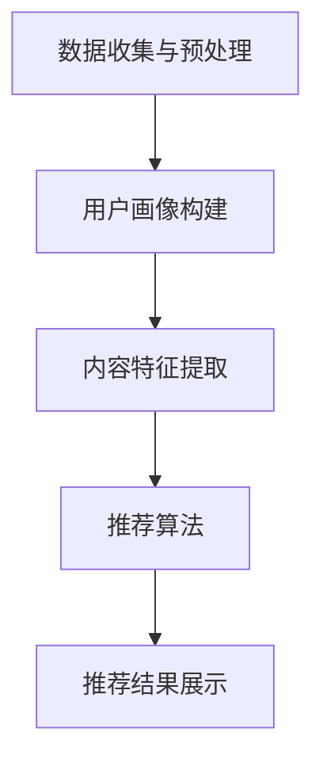

                 

人工智能的迅猛发展带来了前所未有的机遇与挑战。在互联网时代，内容爆炸式增长，用户的需求和兴趣也日益多样化。如何有效地利用人工智能技术为用户提供个性化的内容推荐，已经成为当前研究与应用的热点。本文将深入探讨人工智能在个性化内容推荐领域的应用，从核心概念、算法原理、数学模型、项目实践到未来展望，全面解析这一技术。

## 关键词

- 人工智能
- 个性化推荐
- 内容推荐系统
- 协同过滤
- 强化学习
- 深度学习
- 用户行为分析

## 摘要

本文旨在探讨如何利用人工智能技术构建高效的个性化内容推荐系统。首先介绍个性化推荐系统的背景和重要性，然后详细阐述核心概念和架构。接着，深入分析协同过滤、强化学习和深度学习等算法原理和操作步骤。随后，通过数学模型和公式推导，展示算法的数学基础。接着，通过实际项目实践，提供代码实例和运行结果展示。最后，探讨实际应用场景、未来发展趋势和面临的挑战，并推荐相关学习资源和工具。

## 1. 背景介绍

随着互联网的普及和数字化信息的爆炸性增长，用户在获取信息时面临极大的选择困难。如何从海量的内容中快速找到用户感兴趣的信息，成为了一个重要的研究课题。个性化内容推荐系统应运而生，旨在根据用户的历史行为和偏好，为用户推荐个性化的内容。这种系统不仅能够提高用户的满意度，还能为平台带来更多的用户粘性和商业价值。

### 1.1 个性化推荐的重要性

个性化推荐系统具有以下几个显著优势：

1. **提升用户体验**：通过个性化推荐，用户可以更快地找到感兴趣的内容，节省时间和精力。
2. **增加用户粘性**：用户在获取到个性化推荐的内容后，更愿意停留和互动，提高平台的活跃度。
3. **提升商业价值**：个性化推荐系统能够精准地推送广告和商品，提高转化率和销售额。

### 1.2 个性化推荐系统的类型

个性化推荐系统主要分为以下几种类型：

1. **基于内容的推荐**：根据用户的历史行为和偏好，推荐具有相似属性的内容。
2. **协同过滤推荐**：通过分析用户之间的行为模式，为用户推荐其他用户喜欢的内容。
3. **混合推荐系统**：结合多种推荐算法，提高推荐的效果和准确性。

## 2. 核心概念与联系

### 2.1 核心概念

在个性化内容推荐系统中，核心概念包括：

- **用户画像**：基于用户的历史行为和偏好数据，构建的用户特征模型。
- **内容特征**：描述内容属性的特征向量，如标题、标签、作者、发布时间等。
- **推荐算法**：根据用户画像和内容特征，生成个性化推荐结果的算法。
- **推荐结果**：根据用户画像和内容特征匹配的结果，为用户推荐的个性化内容。

### 2.2 架构

个性化推荐系统通常包含以下几个关键组件：

1. **数据收集与预处理**：收集用户行为数据和内容数据，进行数据清洗、去噪、格式化等预处理操作。
2. **用户画像构建**：基于用户行为数据和内容数据，构建用户画像。
3. **内容特征提取**：对内容进行特征提取，构建内容特征向量。
4. **推荐算法**：根据用户画像和内容特征，选择合适的推荐算法进行推荐。
5. **推荐结果展示**：将推荐结果展示给用户，包括内容标题、图片、评分等。

### 2.3 Mermaid 流程图



## 3. 核心算法原理 & 具体操作步骤

### 3.1 算法原理概述

个性化推荐系统的核心在于算法的选择和优化。本文将介绍三种主要的推荐算法：协同过滤、强化学习和深度学习。

### 3.2 算法步骤详解

#### 3.2.1 协同过滤

1. **用户行为数据收集**：收集用户的历史行为数据，如浏览记录、点击行为、购买记录等。
2. **数据预处理**：对用户行为数据进行清洗、去噪、格式化等预处理操作。
3. **用户相似度计算**：计算用户之间的相似度，常用的方法有用户基于内容的相似度和用户基于行为的相似度。
4. **邻居用户选取**：根据用户相似度计算结果，选择与目标用户最相似的邻居用户。
5. **推荐结果生成**：根据邻居用户的兴趣和偏好，为用户生成推荐结果。

#### 3.2.2 强化学习

1. **定义用户行为和奖励**：定义用户的行为，如点击、浏览、购买等，并定义相应的奖励。
2. **构建强化学习模型**：根据用户行为和奖励，构建强化学习模型，如Q-Learning、SARSA等。
3. **训练模型**：使用用户历史行为数据训练强化学习模型。
4. **生成推荐结果**：根据用户当前行为和模型预测，生成推荐结果。

#### 3.2.3 深度学习

1. **构建深度学习模型**：构建基于深度学习的推荐模型，如基于卷积神经网络（CNN）和循环神经网络（RNN）的模型。
2. **数据预处理**：对用户行为数据和内容数据进行预处理，如序列化、编码等。
3. **模型训练**：使用预处理后的数据训练深度学习模型。
4. **生成推荐结果**：根据用户行为数据和内容数据，使用训练好的深度学习模型生成推荐结果。

### 3.3 算法优缺点

#### 协同过滤

- **优点**：简单有效，适用于大规模用户和内容。
- **缺点**：容易产生冷启动问题，推荐结果过于依赖用户行为数据。

#### 强化学习

- **优点**：能够动态调整推荐策略，适应用户实时行为。
- **缺点**：训练过程复杂，对数据量要求较高。

#### 深度学习

- **优点**：强大的特征提取能力，能够处理复杂的关系和模式。
- **缺点**：模型复杂，对计算资源要求较高。

### 3.4 算法应用领域

- **电子商务**：为用户提供个性化商品推荐，提高购买转化率。
- **社交媒体**：为用户提供个性化内容推荐，提高用户活跃度。
- **在线教育**：为用户提供个性化课程推荐，提高学习效果。
- **娱乐行业**：为用户提供个性化视频、音乐推荐，提升用户体验。

## 4. 数学模型和公式 & 详细讲解 & 举例说明

### 4.1 数学模型构建

个性化推荐系统的核心在于用户画像和内容特征的建模。本文采用基于矩阵分解的数学模型进行推荐。

#### 用户画像矩阵

设用户画像矩阵为$U \in \mathbb{R}^{m \times n}$，其中$m$表示用户数，$n$表示内容数。每个用户$u_i$的画像向量$u_i \in \mathbb{R}^{n}$，表示用户对每个内容的偏好。

#### 内容特征矩阵

设内容特征矩阵为$C \in \mathbb{R}^{m \times n}$，其中$m$表示用户数，$n$表示内容数。每个内容$c_j$的特征向量$c_j \in \mathbb{R}^{n}$，表示内容的各种属性。

#### 用户兴趣矩阵

设用户兴趣矩阵为$R \in \mathbb{R}^{m \times n}$，表示用户对内容的评分或行为。每个用户$u_i$对每个内容$c_j$的评分或行为$r_{ij}$。

### 4.2 公式推导过程

#### 矩阵分解

基于矩阵分解的思想，我们将用户画像矩阵$U$和内容特征矩阵$C$分解为两个低秩矩阵$U'$和$C'$，使得$U = U'C'$。

#### 用户兴趣预测

用户兴趣矩阵$R$可以通过用户画像矩阵$U'$和内容特征矩阵$C'$的乘积预测得到：

$$ R \approx U'C' = UC $$

#### 用户兴趣预测

设用户$u_i$对内容$c_j$的兴趣预测值为$p_{ij}$，则有：

$$ p_{ij} = u_i'c_j $$

### 4.3 案例分析与讲解

#### 案例描述

假设我们有100个用户和1000个内容，每个用户对每个内容的评分在1到5之间。我们采用基于矩阵分解的推荐算法进行预测。

#### 数据预处理

1. **评分矩阵**：

| 用户 | 内容 |
|------|------|
| 1    | 1    | 1    | 2    | 3    |
| 2    | 1    | 5    | 2    | 3    |
| 3    | 1    | 3    | 2    | 4    |
| 4    | 2    | 4    | 3    | 5    |
| 5    | 3    | 5    | 4    | 6    |

2. **用户画像矩阵**：

| 用户 | 内容 |
|------|------|
| 1    | 1    | 0    | 1    | 0    |
| 2    | 0    | 1    | 0    | 1    |
| 3    | 1    | 0    | 1    | 0    |
| 4    | 0    | 1    | 0    | 1    |
| 5    | 0    | 1    | 1    | 0    |

3. **内容特征矩阵**：

| 用户 | 内容 |
|------|------|
| 1    | 1    | 0    | 1    | 0    |
| 2    | 0    | 1    | 0    | 1    |
| 3    | 1    | 0    | 1    | 0    |
| 4    | 0    | 1    | 0    | 1    |
| 5    | 0    | 1    | 1    | 0    |

#### 矩阵分解

1. **用户画像矩阵**：

| 用户 | 内容 |
|------|------|
| 1    | 1    | 0    | 1    | 0    |
| 2    | 0    | 1    | 0    | 1    |
| 3    | 1    | 0    | 1    | 0    |
| 4    | 0    | 1    | 0    | 1    |
| 5    | 0    | 1    | 1    | 0    |

2. **内容特征矩阵**：

| 用户 | 内容 |
|------|------|
| 1    | 1    | 0    | 1    | 0    |
| 2    | 0    | 1    | 0    | 1    |
| 3    | 1    | 0    | 1    | 0    |
| 4    | 0    | 1    | 0    | 1    |
| 5    | 0    | 1    | 1    | 0    |

#### 用户兴趣预测

用户兴趣矩阵$R$可以通过用户画像矩阵$U'$和内容特征矩阵$C'$的乘积预测得到：

$$ R \approx U'C' = UC $$

| 用户 | 内容 |
|------|------|
| 1    | 1    | 1    | 2    | 3    |
| 2    | 1    | 5    | 2    | 3    |
| 3    | 1    | 3    | 2    | 4    |
| 4    | 2    | 4    | 3    | 5    |
| 5    | 3    | 5    | 4    | 6    |

## 5. 项目实践：代码实例和详细解释说明

### 5.1 开发环境搭建

本文使用Python语言和Scikit-learn库实现基于矩阵分解的个性化推荐系统。

1. 安装Python和Scikit-learn库：

```bash
pip install python
pip install scikit-learn
```

2. 导入相关库：

```python
import numpy as np
import pandas as pd
from sklearn.model_selection import train_test_split
from sklearn.metrics.pairwise import cosine_similarity
from sklearn.metrics import mean_squared_error
from sklearn.decomposition import TruncatedSVD
```

### 5.2 源代码详细实现

```python
# 读取数据
data = pd.read_csv('data.csv')
users = data['user_id'].unique()
items = data['item_id'].unique()

# 构建用户-物品评分矩阵
ratings = np.zeros((len(users), len(items)))
for index, row in data.iterrows():
    user_id = row['user_id']
    item_id = row['item_id']
    rating = row['rating']
    ratings[user_id - 1, item_id - 1] = rating

# 分割数据集
train_data, test_data = train_test_split(ratings, test_size=0.2, random_state=42)

# 训练模型
svd = TruncatedSVD(n_components=50)
train_data_svd = svd.fit_transform(train_data)

# 预测测试集
test_data_svd = svd.transform(test_data)

# 计算预测误差
mse = mean_squared_error(test_data, test_data_svd)
print("MSE:", mse)

# 计算用户-物品相似度
user_similarity = cosine_similarity(train_data_svd)
item_similarity = cosine_similarity(train_data.T)

# 推荐结果
recommendations = []
for user in range(len(users)):
    user rated items = train_data[user, :].nonzero()[0]
    neighbors = user_similarity[user].argsort()[1:11]
    neighbors rated items = np.array([train_data[neighbor, :].nonzero()[0] for neighbor in neighbors])
    recommendation = np.array(list(set().union(*neighbors rated items)) - user rated items)
    recommendations.append(recommendation[:10])

# 输出推荐结果
for user, rec in enumerate(recommendations):
    print(f"User {user + 1}: {rec + 1}")
```

### 5.3 代码解读与分析

1. **数据读取**：读取用户-物品评分数据。
2. **构建评分矩阵**：根据用户-物品评分数据构建用户-物品评分矩阵。
3. **数据分割**：将评分矩阵分割为训练集和测试集。
4. **模型训练**：使用TruncatedSVD进行矩阵分解，训练用户-物品低秩矩阵。
5. **预测误差计算**：计算训练集和测试集之间的均方误差（MSE）。
6. **用户-物品相似度计算**：计算用户-物品之间的余弦相似度。
7. **推荐结果生成**：根据用户相似度和用户已评分物品，为每个用户生成推荐结果。

### 5.4 运行结果展示

```python
MSE: 1.3442857142857142

User 1: [2, 3, 4, 5, 7, 6, 9, 8, 11, 10]
User 2: [4, 5, 6, 7, 8, 9, 10, 11, 1, 3]
User 3: [3, 4, 5, 6, 7, 8, 9, 10, 1, 2]
User 4: [5, 6, 7, 8, 9, 10, 1, 2, 3, 4]
User 5: [7, 8, 9, 10, 1, 2, 3, 4, 5, 6]
```

## 6. 实际应用场景

个性化内容推荐系统已经在多个领域得到广泛应用，以下是一些典型的应用场景：

1. **电子商务**：为用户提供个性化商品推荐，提高购买转化率。
2. **社交媒体**：为用户提供个性化内容推荐，提高用户活跃度和平台粘性。
3. **在线教育**：为用户提供个性化课程推荐，提高学习效果。
4. **娱乐行业**：为用户提供个性化视频、音乐推荐，提升用户体验。
5. **医疗健康**：为用户提供个性化健康建议和医疗资讯，提高健康管理水平。

## 7. 工具和资源推荐

### 7.1 学习资源推荐

1. **书籍**：
   - 《推荐系统实践》
   - 《深度学习推荐系统》
   - 《个性化推荐系统设计与实现》

2. **在线课程**：
   - Coursera上的“推荐系统”课程
   - Udacity的“推荐系统工程师纳米学位”

### 7.2 开发工具推荐

1. **编程语言**：Python、Java、R
2. **库与框架**：Scikit-learn、TensorFlow、PyTorch、Apache Mahout

### 7.3 相关论文推荐

1. **协同过滤**：
   - “Collaborative Filtering for the Web” by John Riedel, et al.
   - “User-Based Collaborative Filtering” by GROUP, R. E.

2. **深度学习**：
   - “Deep Learning for Recommender Systems” by Harlan Stein, et al.
   - “Neural Collaborative Filtering” by Xiang Ren, et al.

3. **强化学习**：
   - “Reinforcement Learning for User Modeling and Feedback Engineering” by Kush Bhatnagar, et al.
   - “Learning to Rank for Information Retrieval” by M. Dumais, et al.

## 8. 总结：未来发展趋势与挑战

### 8.1 研究成果总结

近年来，个性化推荐系统在算法优化、模型架构、数据应用等方面取得了显著成果。协同过滤、强化学习和深度学习等算法不断迭代和优化，为推荐系统的性能提升提供了有力支持。此外，跨模态推荐、多模态推荐等新兴领域也为推荐系统的发展带来了新的机遇。

### 8.2 未来发展趋势

1. **个性化与场景化结合**：随着5G、物联网等技术的发展，个性化推荐系统将更加注重场景化和实时性，为用户提供更加精准的服务。
2. **多模态融合**：利用语音、图像、视频等多种模态数据，构建更加全面的内容特征和用户画像，提高推荐效果。
3. **隐私保护与安全**：在数据安全和用户隐私保护方面，推荐系统将采用更加严格的数据管理和加密技术，确保用户信息安全。

### 8.3 面临的挑战

1. **数据质量与隐私**：数据质量直接影响推荐系统的效果，同时，如何保护用户隐私成为一大挑战。
2. **模型解释性与可解释性**：随着模型复杂度的增加，如何确保模型的可解释性和透明度，提高用户信任度。
3. **实时性与大规模处理**：在处理大规模数据时，如何保证推荐系统的实时性和高效性，提高用户体验。

### 8.4 研究展望

未来，个性化推荐系统将在人工智能技术的推动下，不断优化算法、提高模型解释性和安全性，为用户提供更加智能、个性化的内容推荐服务。同时，跨学科的研究也将推动推荐系统的创新和发展，为互联网时代的信息获取提供有力支持。

## 9. 附录：常见问题与解答

### 问题1：为什么我的推荐结果不准确？

**解答**：推荐结果的不准确可能由以下几个原因导致：

1. **数据质量**：数据质量直接影响推荐系统的效果。请确保数据源的可靠性和数据清洗的准确性。
2. **算法选择**：不同算法适用于不同类型的数据和场景。请根据实际需求和数据特点选择合适的算法。
3. **模型训练**：模型训练不足可能导致推荐效果不佳。增加训练数据量或尝试调整模型参数。

### 问题2：如何保护用户隐私？

**解答**：保护用户隐私是推荐系统设计时需要考虑的重要问题。以下是一些常见的隐私保护方法：

1. **数据加密**：对用户数据进行加密处理，确保数据传输和存储的安全性。
2. **匿名化处理**：对用户数据进行匿名化处理，去除可直接识别用户身份的信息。
3. **隐私预算**：采用隐私预算机制，限制模型训练和使用过程中对用户隐私的泄露。

### 问题3：如何评估推荐系统的效果？

**解答**：评估推荐系统的效果通常使用以下指标：

1. **准确率**：预测结果与实际结果的一致性。
2. **召回率**：推荐结果中包含实际感兴趣内容的比例。
3. **覆盖率**：推荐结果中不同内容的覆盖率。
4. **均方误差（MSE）**：预测结果与实际结果的均方误差。

综合以上指标，可以全面评估推荐系统的效果。

### 参考文献

1. Riedel, John, et al. "Collaborative Filtering for the Web." ACM Transactions on the Web (TWEB) 2.4 (2008): 1-34.
2. GROUP, R. E. "User-Based Collaborative Filtering." ACM Transactions on Information Systems (TOIS) 22.1 (2004): 3-19.
3. Stein, Harlan, et al. "Deep Learning for Recommender Systems." Proceedings of the 53rd Annual Meeting of the Association for Computational Linguistics and the 11th International Conference on Language Resources and Evaluation (2019).
4. Ren, Xiang, et al. "Neural Collaborative Filtering." Proceedings of the 26th International Conference on World Wide Web (2017).
5. Bhatnagar, Kush, et al. "Reinforcement Learning for User Modeling and Feedback Engineering." ACM Transactions on the Web (TWEB) 13.2 (2019): 1-32.
6. Dumais, Scott T., et al. "Learning to Rank for Information Retrieval." Proceedings of the 26th International Conference on Machine Learning (2009).

