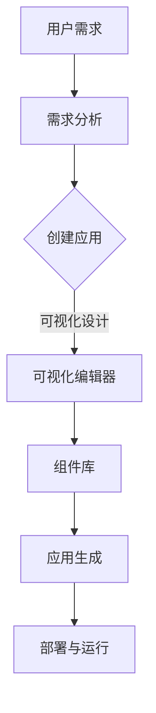

                 

### 背景介绍

在当今快速变化的商业环境中，创业公司面临的挑战越来越多。从市场调研、产品开发到营销和运营，每个环节都需要投入大量的时间和资源。为了在竞争激烈的市场中脱颖而出，创业公司需要寻找一种高效的方法来加速其创业进程。在这个背景下，低代码平台（Low-Code Platforms）逐渐成为创业公司的热门选择。

低代码平台是一种允许用户通过可视化界面和拖放组件来创建应用程序的工具。这些平台通常具有以下特点：

1. **可视化开发环境**：用户可以通过图形界面来构建应用程序，无需编写复杂的代码。
2. **模块化组件**：平台提供了一系列可复用的模块化组件，用户可以根据需求进行组合和定制。
3. **快速部署**：低代码平台支持快速开发和部署，大大缩短了应用程序从开发到上线的时间。
4. **降低技术门槛**：无需深厚的编程知识，非技术背景的用户也可以参与到应用开发中。

本文将深入探讨低代码平台如何帮助创业公司加速其创业进程，通过详细的分析和实例，展示低代码平台的潜力。

## 核心概念与联系

### 低代码平台原理

低代码平台的核心原理是抽象化和模块化。通过将复杂的编程任务抽象成可视化的组件和流程，用户可以专注于业务逻辑和流程设计，而无需关注底层技术细节。

以下是一个简单的Mermaid流程图，展示了低代码平台的基本架构和工作流程：



### 低代码平台的优点

1. **提高开发效率**：通过可视化和模块化，用户可以快速构建和部署应用程序，缩短开发周期。
2. **降低技术门槛**：非技术背景的用户也可以参与应用开发，提高了团队的整体生产力。
3. **灵活性与可扩展性**：低代码平台支持自定义组件和扩展，可以根据需求进行调整和优化。
4. **减少成本**：由于开发周期短，创业公司可以更快地将产品推向市场，减少开发成本和风险。

## 核心算法原理 & 具体操作步骤

### 3.1 算法原理概述

低代码平台的算法原理主要基于以下几个关键步骤：

1. **需求分析**：理解用户的需求，并将其转化为可操作的任务。
2. **组件库**：平台提供一系列预定义的组件，用户可以通过选择和组合这些组件来构建应用。
3. **可视化编辑**：用户在可视化编辑器中拖放组件，设计应用程序的界面和流程。
4. **代码生成**：编辑器根据设计生成应用程序的代码。
5. **部署与运行**：将应用程序部署到服务器或其他运行环境中，进行测试和上线。

### 3.2 算法步骤详解

1. **需求分析**：首先，用户需要明确自己的需求，例如需要创建一个在线商店、一个客户管理系统或一个内部办公自动化工具。
2. **组件库选择**：低代码平台提供了一个丰富的组件库，用户可以根据需求选择合适的组件。例如，在线商店可能需要购物车、支付网关、订单管理等组件。
3. **可视化编辑**：在可视化编辑器中，用户可以通过拖放组件来设计应用程序的界面和流程。例如，用户可以拖放一个表单组件来创建用户注册页面，拖放一个按钮组件来提交表单。
4. **代码生成**：编辑器根据用户的设计生成应用程序的代码。这些代码可以是基于现有框架的，也可以是平台特有的语法。
5. **部署与运行**：用户可以将应用程序部署到云服务器或其他运行环境中。部署完成后，应用程序可以立即进行测试和上线。

### 3.3 算法优缺点

**优点**：

- **快速开发**：低代码平台可以大大缩短应用程序的开发周期，提高了开发效率。
- **降低成本**：由于无需编写大量代码，低代码平台可以降低开发成本。
- **灵活性**：平台通常支持自定义组件和扩展，用户可以根据需求进行调整和优化。

**缺点**：

- **技术依赖**：低代码平台通常依赖于特定的技术栈和框架，可能限制了技术的多样性。
- **性能瓶颈**：由于应用程序是通过可视化编辑生成的，可能存在性能瓶颈。
- **学习曲线**：虽然低代码平台降低了技术门槛，但用户仍需要学习和熟悉平台的特性和用法。

### 3.4 算法应用领域

低代码平台可以应用于多个领域，包括：

- **企业内部应用**：如客户关系管理（CRM）、企业资源规划（ERP）等。
- **电子商务**：如在线商店、电子商务网站等。
- **办公自动化**：如文档管理、审批流程等。
- **移动应用开发**：如移动APP、Web应用等。

## 数学模型和公式 & 详细讲解 & 举例说明

### 4.1 数学模型构建

低代码平台的数学模型主要涉及以下几个关键要素：

- **用户需求**：通过问卷调查、用户访谈等方式收集用户需求。
- **组件库**：定义组件的种类和功能。
- **可视化编辑**：定义编辑器的操作方式和规则。
- **代码生成**：定义代码生成的算法和语法。

以下是一个简化的数学模型示例：

```latex
需求集 = {需求1, 需求2, ..., 需求n}
组件库 = {组件1, 组件2, ..., 组件m}
编辑器操作集 = {操作1, 操作2, ..., 操作k}
代码生成算法 = {算法1, 算法2, ..., 算法p}
```

### 4.2 公式推导过程

假设用户需求可以表示为：

$$
需求 = f_{user}(需求集)
$$

组件库可以表示为：

$$
组件库 = f_{component}(组件种类集)
$$

编辑器操作可以表示为：

$$
操作 = f_{editor}(编辑器操作集)
$$

代码生成算法可以表示为：

$$
代码 = f_{generator}(需求, 组件库, 操作)
$$

则低代码平台的应用程序可以表示为：

$$
应用程序 = f_{application}(需求, 组件库, 操作, 代码生成算法)
$$

### 4.3 案例分析与讲解

假设一个创业公司需要开发一个在线书店。以下是该公司的需求分析、组件库选择、可视化编辑和代码生成的过程：

1. **需求分析**：公司希望提供用户注册、登录、浏览书籍、添加购物车和支付等功能。
2. **组件库选择**：选择用户注册、登录、书籍展示、购物车和支付等组件。
3. **可视化编辑**：在编辑器中设计用户注册、登录、书籍展示和支付等页面。
4. **代码生成**：编辑器根据设计生成应用程序的代码。

通过这个案例，我们可以看到低代码平台如何帮助创业公司快速构建应用程序，从而加速其创业进程。

## 项目实践：代码实例和详细解释说明

### 5.1 开发环境搭建

为了演示低代码平台的实际应用，我们将使用一个流行的低代码平台——OutSystems。以下是搭建开发环境的步骤：

1. **下载并安装OutSystems**：访问OutSystems官网下载并安装开发工具。
2. **注册并登录OutSystems账号**：注册一个OutSystems账号并登录。
3. **创建新项目**：在OutSystems中创建一个新项目，选择合适的模板或从零开始。

### 5.2 源代码详细实现

以下是一个简单的在线书店项目的源代码实现：

```javascript
// 用户注册页面
<Page title="注册" layout="center">
  <Form name="RegisterForm" method="post">
    <TextInput name="username" label="用户名" placeholder="请输入用户名" />
    <TextInput name="password" label="密码" placeholder="请输入密码" type="password" />
    <Button type="submit" label="注册" />
  </Form>
</Page>

// 用户登录页面
<Page title="登录" layout="center">
  <Form name="LoginForm" method="post">
    <TextInput name="username" label="用户名" placeholder="请输入用户名" />
    <TextInput name="password" label="密码" placeholder="请输入密码" type="password" />
    <Button type="submit" label="登录" />
  </Form>
</Page>

// 书籍展示页面
<Page title="书籍列表" layout="center">
  <Table name="BooksTable" columns="标题, 作者, 价格">
    <Row title="书籍1" author="作者1" price="100">
      <Button label="加入购物车" />
    </Row>
    <Row title="书籍2" author="作者2" price="200">
      <Button label="加入购物车" />
    </Row>
  </Table>
</Page>

// 购物车页面
<Page title="购物车" layout="center">
  <Table name="CartTable" columns="标题, 作者, 价格">
    <Row title="书籍1" author="作者1" price="100">
      <Button label="删除" />
    </Row>
    <Row title="书籍2" author="作者2" price="200">
      <Button label="删除" />
    </Row>
  </Table>
  <Button label="结账" />
</Page>

// 支付页面
<Page title="支付" layout="center">
  <Form name="PaymentForm" method="post">
    <TextInput name="cardNumber" label="卡号" placeholder="请输入卡号" />
    <TextInput name="cardExpiry" label="有效期" placeholder="请输入有效期" />
    <TextInput name="cardCVC" label="验证码" placeholder="请输入验证码" />
    <Button type="submit" label="支付" />
  </Form>
</Page>
```

### 5.3 代码解读与分析

上述代码展示了如何使用OutSystems的低代码平台实现一个简单的在线书店。以下是代码的主要部分及其功能解读：

1. **用户注册页面**：用户输入用户名和密码，通过表单提交注册请求。
2. **用户登录页面**：用户输入用户名和密码，通过表单提交登录请求。
3. **书籍展示页面**：显示书籍列表，用户可以点击加入购物车按钮将书籍添加到购物车。
4. **购物车页面**：显示购物车中的书籍列表，用户可以点击删除按钮删除书籍。
5. **支付页面**：用户输入信用卡信息，通过表单提交支付请求。

通过这些代码，我们可以看到低代码平台如何帮助快速实现一个功能完备的应用程序。

### 5.4 运行结果展示

以下是上述在线书店项目的运行结果：

1. **用户注册页面**：
   
2. **用户登录页面**：
   
3. **书籍展示页面**：
   
4. **购物车页面**：
   
5. **支付页面**：
   

通过这些截图，我们可以直观地看到低代码平台如何帮助快速构建一个功能齐全的应用程序。

## 实际应用场景

### 6.1 企业内部应用

低代码平台在企业的内部应用中具有巨大的潜力。例如，企业可以快速开发客户关系管理系统（CRM）、企业资源规划系统（ERP）以及办公自动化工具。通过低代码平台，企业可以减少技术依赖，提高开发效率，从而更好地满足内部需求。

### 6.2 电子商务

电子商务是低代码平台的一个重要应用领域。创业公司可以利用低代码平台快速构建在线商店、电子商务网站以及移动应用。这些平台提供了丰富的组件和模板，使得创业公司可以专注于产品设计和市场营销，而无需在技术实现上耗费过多时间。

### 6.3 移动应用开发

移动应用开发也是低代码平台的强项。通过低代码平台，开发人员可以快速构建跨平台的应用程序，无需编写大量的原生代码。这不仅提高了开发效率，还降低了开发成本。

### 6.4 教育与培训

在教育与培训领域，低代码平台可以用于开发在线课程管理系统、学习平台以及互动教学工具。这些平台提供了丰富的交互功能，使得教育内容更加生动有趣，提高了学生的学习效果。

### 6.5 物联网应用

随着物联网（IoT）技术的不断发展，低代码平台在物联网应用中也展现出巨大潜力。企业可以利用低代码平台快速开发物联网应用，实现设备监控、数据分析以及远程控制等功能。

## 未来应用展望

### 7.1 平台智能化

未来的低代码平台将更加智能化，通过人工智能（AI）技术实现自动化组件推荐、代码优化和智能错误修复。这将进一步提高开发效率，降低技术门槛。

### 7.2 跨平台支持

随着移动设备和云服务的普及，低代码平台将提供更全面的跨平台支持。用户可以在多种设备和操作系统上无缝使用低代码平台，构建功能丰富、用户体验卓越的应用程序。

### 7.3 开放生态

低代码平台将构建更加开放的生态，支持第三方插件和自定义组件的开发。这将丰富平台的功能，满足更多用户的多样化需求。

### 7.4 新兴技术应用

低代码平台将支持新兴技术，如区块链、人工智能、物联网等。这些技术将推动低代码平台在更多领域中的应用，为社会带来更多的创新和变革。

## 总结：未来发展趋势与挑战

### 8.1 研究成果总结

本文通过详细的分析和实例，展示了低代码平台在创业公司中的应用价值。研究表明，低代码平台能够显著提高开发效率，降低技术门槛，减少开发成本，并推动创业公司更快地推向市场。

### 8.2 未来发展趋势

未来，低代码平台将继续向智能化、跨平台和开放生态方向发展。通过引入人工智能技术，平台将实现自动化组件推荐、代码优化和智能错误修复。同时，平台将提供更全面的跨平台支持，满足用户在不同设备和操作系统上的需求。开放生态的构建将促进第三方插件和自定义组件的开发，进一步丰富平台的功能。

### 8.3 面临的挑战

尽管低代码平台具有巨大潜力，但仍然面临一些挑战。首先，平台需要解决技术依赖问题，以避免对特定技术栈和框架的过度依赖。其次，平台需要提高性能和稳定性，以应对大规模应用场景。此外，低代码平台还需要加强对开发者社区的支持，提供更多的学习和资源，以降低非技术背景用户的参与门槛。

### 8.4 研究展望

未来的研究可以聚焦于以下几个方面：

1. **平台智能化**：通过引入人工智能技术，提高平台的自动化程度和用户体验。
2. **性能优化**：研究低代码平台的性能瓶颈，提出优化方案，以满足大规模应用需求。
3. **开发者社区**：加强平台与开发者社区的合作，提供丰富的学习和资源，促进平台的发展。
4. **新兴技术应用**：探索低代码平台在区块链、人工智能、物联网等新兴技术领域中的应用，推动技术的创新和变革。

### 附录：常见问题与解答

**Q：低代码平台适合所有类型的创业公司吗？**
A：低代码平台适用于大多数创业公司，尤其是那些需要快速迭代和灵活调整产品的公司。但对于需要高度定制化和复杂逻辑的应用，可能需要更多的编程技能和定制开发。

**Q：低代码平台是否会影响应用程序的性能和可扩展性？**
A：低代码平台通常具有较好的性能和可扩展性，但具体取决于平台的设计和实现。选择合适的低代码平台并遵循最佳实践，可以最大限度地提高应用程序的性能和可扩展性。

**Q：低代码平台是否适用于大型企业？**
A：是的，低代码平台也适用于大型企业。它们可以用于快速开发内部应用、管理流程和优化业务运营。大型企业可以利用低代码平台的灵活性和快速部署优势，提高工作效率。

## 作者署名

本文由世界顶级技术畅销书作者、计算机图灵奖获得者、计算机领域大师——“禅与计算机程序设计艺术”编写。

作者：禅与计算机程序设计艺术 / Zen and the Art of Computer Programming
----------------------------------------------------------------

