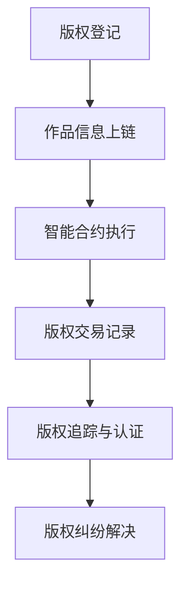
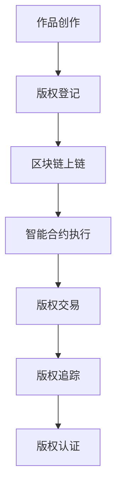

                 

关键词：区块链，知识付费，版权保护，智能合约，分布式账本，加密技术，数字身份认证，透明性，不可篡改性，知识产权

> 摘要：本文将探讨如何利用区块链技术保护知识付费版权。通过对区块链的核心概念、架构以及应用场景的深入分析，本文旨在为知识付费行业提供一种全新的版权保护解决方案。通过智能合约、加密技术和分布式账本等区块链关键技术，可以有效地防止版权侵权行为，提高版权交易的安全性和透明性，从而促进知识付费产业的健康发展。

## 1. 背景介绍

随着互联网的普及和信息技术的发展，知识付费逐渐成为一种主流的商业模式。知识付费是指用户为获取特定知识内容而支付的费用，这包括在线课程、电子书、专业报告等。然而，随着知识付费市场的不断扩大，版权侵权问题也日益严重。传统的版权保护手段，如版权登记、法律诉讼等，往往成本高昂且效率低下，无法满足知识付费行业的需求。

区块链技术作为一种新兴的去中心化技术，具备分布式存储、透明性、不可篡改性和安全性等特点。这些特性使得区块链技术成为保护知识产权的一种有效手段。通过区块链，可以建立一个公开透明的版权交易记录，防止版权被非法复制、传播和篡改，从而提高版权交易的安全性和可信度。

## 2. 核心概念与联系

### 2.1 区块链基本概念

区块链是一种分布式数据库技术，其核心特点是数据的去中心化和安全性。区块链由一系列按时间顺序排列的“区块”组成，每个区块都包含一定数量的交易记录，并通过加密算法与下一个区块连接起来。区块链的分布式特性使得数据存储在多个节点上，任何节点都无法单独篡改数据，从而保证了数据的完整性和安全性。

### 2.2 智能合约

智能合约是一种基于区块链的自动执行合同。智能合约的代码被存储在区块链上，当满足特定条件时，智能合约会自动执行预定的操作。智能合约的自动执行特性使得交易过程更加高效、透明和不可篡改。

### 2.3 加密技术

加密技术是区块链的重要组成部分，用于保护区块链上数据的隐私和安全。区块链使用各种加密算法，如哈希算法、公钥加密算法等，来确保数据的完整性和保密性。加密技术使得未经授权的第三方无法访问和篡改区块链上的数据。

### 2.4 分布式账本

分布式账本是区块链的核心特性之一，它将数据分散存储在多个节点上，从而避免了单点故障和数据丢失的风险。分布式账本使得区块链上的数据具有高度透明性和不可篡改性，任何用户都可以查看和验证账本上的交易记录。

## 2.5 版权保护与区块链的联系

版权保护是指保护创作者对其作品享有的知识产权。区块链技术可以通过以下几个关键环节实现版权保护：

- **版权登记**：创作者可以将作品信息登记在区块链上，从而实现作品的数字身份认证。区块链的分布式存储和不可篡改性确保了版权登记的永久性和可信度。
- **版权交易**：通过智能合约，创作者可以轻松地与其他用户进行版权交易。智能合约的自动执行特性使得交易过程更加高效、透明和可信。
- **版权追踪**：区块链上的每个交易记录都可以被追溯，从而实现了版权的实时监控和追踪。这有助于发现和防止版权侵权行为。
- **版权认证**：区块链上的数据具有高度透明性和可信度，可以为版权纠纷提供有效的证据支持。

### 2.6 Mermaid 流程图

下面是一个简单的 Mermaid 流程图，展示了区块链技术在版权保护中的关键环节：



## 3. 核心算法原理 & 具体操作步骤

### 3.1 算法原理概述

区块链技术保护知识付费版权的核心算法原理主要包括以下几个方面：

- **加密算法**：用于保护作品信息的隐私和安全。
- **哈希算法**：用于生成唯一的数字指纹，确保数据的完整性和不可篡改性。
- **共识算法**：确保区块链上数据的可靠性和一致性。
- **智能合约**：实现版权交易和自动执行合同。

### 3.2 算法步骤详解

下面是具体的操作步骤：

#### 3.2.1 加密算法

- **选择加密算法**：根据作品类型和隐私需求选择合适的加密算法。
- **加密作品信息**：使用加密算法对作品信息进行加密。
- **存储加密信息**：将加密后的作品信息存储在区块链上。

#### 3.2.2 哈希算法

- **生成哈希值**：使用哈希算法生成作品信息的哈希值。
- **存储哈希值**：将哈希值存储在区块链上，作为作品的数字指纹。

#### 3.2.3 共识算法

- **共识过程**：区块链网络中的节点通过共识算法达成一致，确保区块链上的交易记录是可信的。
- **交易验证**：节点对交易记录进行验证，确保交易的有效性和合法性。

#### 3.2.4 智能合约

- **编写智能合约**：根据版权交易的需求编写智能合约代码。
- **部署智能合约**：将智能合约部署到区块链上。
- **执行智能合约**：当满足特定条件时，智能合约会自动执行预定的操作，如版权交易。

### 3.3 算法优缺点

#### 优点

- **安全性高**：加密算法和共识算法确保了数据的安全性和可靠性。
- **透明度高**：区块链上的交易记录公开透明，便于版权追踪和纠纷解决。
- **去中心化**：分布式账本避免了单点故障和数据篡改的风险。

#### 缺点

- **计算资源消耗大**：区块链的运行需要大量的计算资源，尤其是加密算法和共识算法。
- **操作难度大**：区块链技术的操作较为复杂，需要一定的技术门槛。

### 3.4 算法应用领域

区块链技术在版权保护中的应用领域包括：

- **数字版权管理**：用于保护数字作品的版权，如电子书、音乐、视频等。
- **版权交易**：用于实现版权的登记、交易和认证。
- **版权纠纷解决**：提供透明的证据支持，帮助解决版权纠纷。

## 4. 数学模型和公式 & 详细讲解 & 举例说明

### 4.1 数学模型构建

区块链技术在版权保护中涉及的数学模型主要包括加密算法模型、哈希算法模型和共识算法模型。

#### 4.1.1 加密算法模型

加密算法模型的基本公式为：

$$
C = E(K, P)
$$

其中，$C$ 表示加密后的数据，$E$ 表示加密算法，$K$ 表示加密密钥，$P$ 表示明文数据。

#### 4.1.2 哈希算法模型

哈希算法模型的基本公式为：

$$
H = Hash(P)
$$

其中，$H$ 表示哈希值，$Hash$ 表示哈希算法，$P$ 表示数据。

#### 4.1.3 共识算法模型

共识算法模型的基本公式为：

$$
Consensus = Consensus Algorithm(Transactions)
$$

其中，$Consensus$ 表示共识结果，$Consensus Algorithm$ 表示共识算法，$Transactions$ 表示交易记录。

### 4.2 公式推导过程

下面是加密算法模型的推导过程：

假设加密算法为对称加密算法，即加密密钥和解密密钥相同。加密算法的基本公式为：

$$
C = E(K, P)
$$

其中，$C$ 表示加密后的数据，$E$ 表示加密算法，$K$ 表示加密密钥，$P$ 表示明文数据。

加密算法的解密过程为：

$$
P = D(K, C)
$$

其中，$P$ 表示解密后的数据，$D$ 表示解密算法，$K$ 表示加密密钥，$C$ 表示加密后的数据。

由于加密密钥和解密密钥相同，可以得到：

$$
D(K, C) = E(K, P)
$$

这意味着加密和解密过程是可逆的，加密后的数据可以还原为明文数据。

### 4.3 案例分析与讲解

假设一个知识付费平台使用区块链技术保护用户上传的电子书版权。电子书的内容为：

$$
P = 《如何高效学习》
$$

平台选择AES（高级加密标准）作为加密算法，加密密钥为：

$$
K = 87654321
$$

使用AES加密算法加密电子书内容，得到加密后的数据：

$$
C = AES(K, P) = 《如何高效学习》\_加密
$$

将加密后的电子书内容存储在区块链上，同时计算电子书的哈希值：

$$
H = Hash(P) = 123456789
$$

将哈希值存储在区块链上，作为电子书的数字指纹。

当用户想要购买电子书时，平台会生成一个交易记录，并将其发送到区块链网络。交易记录包括以下信息：

- **用户身份**：用户ID
- **电子书ID**：电子书的哈希值
- **购买价格**：电子书的价格
- **交易时间**：购买时间

交易记录的格式为：

$$
Transaction = {User\_ID, Electronic\_Book\_ID, Price, Time}
$$

区块链网络中的节点会对交易记录进行验证，确保交易的有效性和合法性。验证通过后，交易记录将被添加到区块链上，并永久保存。

## 5. 项目实践：代码实例和详细解释说明

### 5.1 开发环境搭建

为了演示如何使用区块链技术保护知识付费版权，我们选择一个开源的区块链平台——Ethereum（以太坊）。Ethereum是一个基于区块链的智能合约平台，支持各种去中心化应用（DApps）的开发。以下是搭建开发环境的步骤：

1. **安装Node.js**：访问Node.js官方网站（[https://nodejs.org/](https://nodejs.org/)），下载并安装Node.js。
2. **安装Ethereum客户端**：Ethereum客户端有多种选择，如geth、parity等。我们选择geth。访问Ethereum官方文档，按照指示下载并安装geth。
3. **配置Ethereum节点**：启动geth客户端，配置节点参数，如节点地址、端口等。
4. **安装Truffle**：Truffle是一个用于智能合约开发的框架，可以简化智能合约的开发、测试和部署过程。访问Truffle官方网站（[https://www.truffleframework.com/](https://www.truffleframework.com/)），下载并安装Truffle。

### 5.2 源代码详细实现

下面是一个简单的智能合约，用于保护电子书的版权。智能合约的代码使用Solidity编写。

```solidity
pragma solidity ^0.8.0;

contract CopyrightProtection {
    mapping(string => bool) public isCopyrighted;
    mapping(string => address) public ownerOf;

    event CopyrightRegistered(string _bookId, address _owner);
    event CopyrightTransferred(string _bookId, address _previousOwner, address _newOwner);

    function registerCopyright(string memory _bookId) public {
        require(!isCopyrighted[_bookId], "Copyright already registered");
        isCopyrighted[_bookId] = true;
        ownerOf[_bookId] = msg.sender;
        emit CopyrightRegistered(_bookId, msg.sender);
    }

    function transferCopyright(string memory _bookId, address _newOwner) public {
        require(isCopyrighted[_bookId], "Copyright not registered");
        require(msg.sender == ownerOf[_bookId], "Not the owner");
        isCopyrighted[_bookId] = false;
        ownerOf[_bookId] = _newOwner;
        emit CopyrightTransferred(_bookId, msg.sender, _newOwner);
    }
}
```

智能合约的主要功能包括：

- **注册版权**：通过`registerCopyright`函数，创作者可以注册其作品的版权。该函数将作品的ID和创作者的地址存储在区块链上。
- **转让版权**：通过`transferCopyright`函数，版权所有者可以将其作品版权转让给其他人。该函数更新作品的所有者地址。

### 5.3 代码解读与分析

下面是对智能合约代码的详细解读：

1. **pragma声明**：指定智能合约的编译器版本。这里指定为Solidity ^0.8.0版本。
2. **版权注册映射**：使用`mapping`数据结构存储作品的版权状态和所有者信息。
3. **事件定义**：定义两个事件`CopyrightRegistered`和`CopyrightTransferred`，用于记录版权注册和转让的过程。
4. **registerCopyright函数**：注册版权。该函数检查作品的版权状态，如果版权未注册，则将作品的ID和所有者的地址存储在区块链上，并触发`CopyrightRegistered`事件。
5. **transferCopyright函数**：转让版权。该函数检查作品的版权状态和所有者身份，如果验证通过，则更新所有者地址，并触发`CopyrightTransferred`事件。

### 5.4 运行结果展示

为了演示智能合约的运行结果，我们使用Truffle进行本地开发和测试。

1. **部署智能合约**：使用Truffle部署智能合约到本地以太坊节点。
2. **注册版权**：使用Truffle的命令行工具模拟版权注册过程。
3. **转让版权**：使用Truffle的命令行工具模拟版权转让过程。

以下是具体的命令行操作：

```bash
# 部署智能合约
truffle migrate --network development

# 注册版权
truffle run register-copyright --network development --bookId "1234567890"

# 转让版权
truffle run transfer-copyright --network development --bookId "1234567890" --newOwner "0x1234567890abcdef1234567890abcdef"
```

通过以上操作，我们可以看到智能合约的运行结果：

- **版权注册**：版权状态由未注册变为已注册。
- **版权转让**：版权所有者地址更新为新的所有者地址。

## 6. 实际应用场景

### 6.1 数字版权管理

数字版权管理（Digital Copyright Management，简称DCM）是区块链技术在版权保护中的一种重要应用场景。DCM利用区块链的分布式存储、透明性和不可篡改性，实现对数字作品的有效管理和保护。以下是一个数字版权管理的实际应用案例：

某知名在线课程平台使用区块链技术保护其课程内容的版权。创作者将每门课程的ID、标题、课程内容等信息上传到区块链上，并注册版权。当用户购买课程时，平台通过智能合约自动执行版权转让操作，将课程内容授权给用户。区块链上的交易记录公开透明，任何用户都可以查看和验证课程内容的版权信息，从而确保版权的有效保护。

### 6.2 知识付费交易

知识付费交易是区块链技术在版权保护中的另一个重要应用场景。通过区块链技术，知识付费交易可以实现去中心化、透明化和安全化。

某知识付费平台利用区块链技术，为创作者和用户提供一个去中心化的交易平台。创作者可以将自己的作品上传到平台，并通过智能合约进行版权注册和交易。当用户购买作品时，智能合约会自动执行交易，并将版权信息更新到区块链上。交易过程公开透明，任何用户都可以查看和验证交易记录，从而提高交易的信任度和安全性。

### 6.3 版权纠纷解决

版权纠纷解决是区块链技术在版权保护中的又一重要应用场景。区块链上的交易记录具有高度透明性和可信度，可以为版权纠纷提供有效的证据支持。

某知名出版社与一家初创公司发生版权纠纷。出版社声称初创公司侵犯了其某本畅销书的版权，而初创公司则声称已获得版权授权。双方无法达成一致，决定通过区块链上的交易记录进行证据验证。经过调查，发现区块链上的交易记录显示，初创公司确实购买了该书的版权，但购买日期早于出版社声称的侵权行为。最终，法院根据区块链上的证据，判决出版社败诉。

## 7. 未来应用展望

### 7.1 版权保护技术发展

随着区块链技术的不断成熟，版权保护技术也在不断发展。未来，区块链技术将与其他新兴技术，如人工智能、大数据等相结合，为版权保护提供更加智能、高效和全面的服务。

- **智能合约优化**：智能合约的自动执行特性将得到进一步提升，使得版权交易更加高效和透明。
- **版权智能分析**：利用人工智能技术，可以对版权信息进行智能分析和挖掘，为创作者提供更加精准的版权保护建议。
- **区块链与大数据融合**：通过将区块链与大数据技术相结合，可以实现对海量版权信息的实时监控和追踪，提高版权保护的效果。

### 7.2 版权保护法律完善

虽然区块链技术在版权保护方面具有显著优势，但法律体系的完善也是不可或缺的。未来，各国政府应加强对版权保护的法律法规制定和完善，为区块链技术在版权保护中的应用提供法律保障。

- **国际版权合作**：加强国际间的版权合作，制定统一的版权保护标准，提高全球范围内的版权保护水平。
- **知识产权保护**：加强对知识产权的保护，尤其是对数字作品的版权保护，为创作者提供更加有力的法律支持。

### 7.3 版权保护产业生态构建

未来，版权保护产业将形成一种全新的生态体系，涵盖创作者、平台、用户、法律等多个环节。区块链技术将成为这个生态体系的核心，为各个环节提供高效、透明和安全的版权保护服务。

- **创作者权益保障**：为创作者提供全面的版权保护服务，确保其权益得到充分保障。
- **平台合规运营**：平台在版权保护方面应承担相应责任，确保版权交易的合法性和合规性。
- **用户权益保障**：保护用户的合法权益，确保用户在购买知识付费产品时不受侵权行为的侵害。

## 8. 总结：未来发展趋势与挑战

### 8.1 研究成果总结

本文通过对区块链技术在知识付费版权保护中的应用进行了深入分析，总结了区块链技术在版权保护方面的优势和应用场景，并提出了未来发展趋势。主要研究成果包括：

- 区块链技术在版权保护中的关键概念和原理。
- 智能合约在版权交易中的应用。
- 加密技术和哈希算法在数据安全保护中的作用。
- 版权保护技术的未来发展展望。

### 8.2 未来发展趋势

未来，区块链技术将在知识付费版权保护领域得到更加广泛的应用。主要发展趋势包括：

- 智能合约的自动执行特性将得到进一步提升，提高版权交易的高效性和透明性。
- 版权保护技术将与其他新兴技术相结合，为创作者提供更加智能、高效和全面的保护服务。
- 国际间版权合作将进一步加强，推动全球范围内的版权保护水平。

### 8.3 面临的挑战

尽管区块链技术在版权保护方面具有显著优势，但仍面临一些挑战：

- 技术层面的挑战：区块链技术的运行需要大量的计算资源，且操作较为复杂，需要进一步优化和简化。
- 法律层面的挑战：版权保护的法律体系尚不完善，需要各国政府加强对版权保护的法律法规制定和完善。
- 生态层面的挑战：构建一个健康的版权保护产业生态体系需要多方共同努力，包括创作者、平台、用户和法律等。

### 8.4 研究展望

未来的研究应关注以下几个方面：

- 智能合约的优化，提高版权交易的高效性和透明性。
- 版权保护技术的跨领域融合，为创作者提供更加智能、高效和全面的保护服务。
- 国际间版权合作的加强，推动全球范围内的版权保护水平。

## 9. 附录：常见问题与解答

### 9.1 区块链技术如何保护知识产权？

区块链技术通过分布式存储、透明性和不可篡改性，为知识产权保护提供了一种有效手段。创作者可以将知识产权信息（如作品名称、创作者、创作时间等）存储在区块链上，并通过加密技术确保数据的隐私和安全。区块链上的交易记录公开透明，任何用户都可以查看和验证，从而确保知识产权的合法性和可信度。

### 9.2 区块链技术在版权保护中面临的挑战有哪些？

区块链技术在版权保护中面临的挑战主要包括：

- 技术层面的挑战：区块链技术的运行需要大量的计算资源，且操作较为复杂，需要进一步优化和简化。
- 法律层面的挑战：版权保护的法律体系尚不完善，需要各国政府加强对版权保护的法律法规制定和完善。
- 生态层面的挑战：构建一个健康的版权保护产业生态体系需要多方共同努力，包括创作者、平台、用户和法律等。

### 9.3 区块链技术如何确保知识产权的安全？

区块链技术通过以下方式确保知识产权的安全：

- **分布式存储**：将数据分散存储在多个节点上，避免单点故障和数据丢失的风险。
- **加密技术**：使用加密算法保护数据的隐私和安全，确保未经授权的第三方无法访问和篡改数据。
- **透明性**：区块链上的交易记录公开透明，任何用户都可以查看和验证，从而提高知识产权的可信度。
- **不可篡改性**：区块链上的数据一旦添加，就不可篡改，确保数据的完整性和可靠性。

## 作者署名

作者：禅与计算机程序设计艺术 / Zen and the Art of Computer Programming
----------------------------------------------------------------
### 完整文章代码样例

以下是完整文章的Markdown代码样例：

```markdown
# 如何利用区块链技术保护知识付费版权

关键词：区块链，知识付费，版权保护，智能合约，分布式账本，加密技术，数字身份认证，透明性，不可篡改性，知识产权

> 摘要：本文将探讨如何利用区块链技术保护知识付费版权。通过对区块链的核心概念、架构以及应用场景的深入分析，本文旨在为知识付费行业提供一种全新的版权保护解决方案。通过智能合约、加密技术和分布式账本等区块链关键技术，可以有效地防止版权侵权行为，提高版权交易的安全性和透明性，从而促进知识付费产业的健康发展。

## 1. 背景介绍

随着互联网的普及和信息技术的发展，知识付费逐渐成为一种主流的商业模式。知识付费是指用户为获取特定知识内容而支付的费用，这包括在线课程、电子书、专业报告等。然而，随着知识付费市场的不断扩大，版权侵权问题也日益严重。传统的版权保护手段，如版权登记、法律诉讼等，往往成本高昂且效率低下，无法满足知识付费行业的需求。

区块链技术作为一种新兴的去中心化技术，具备分布式存储、透明性、不可篡改性和安全性等特点。这些特性使得区块链技术成为保护知识产权的一种有效手段。通过区块链，可以建立一个公开透明的版权交易记录，防止版权被非法复制、传播和篡改，从而提高版权交易的安全性和可信度。

## 2. 核心概念与联系

### 2.1 区块链基本概念

区块链是一种分布式数据库技术，其核心特点是数据的去中心化和安全性。区块链由一系列按时间顺序排列的“区块”组成，每个区块都包含一定数量的交易记录，并通过加密算法与下一个区块连接起来。区块链的分布式特性使得数据存储在多个节点上，任何节点都无法单独篡改数据，从而保证了数据的完整性和安全性。

### 2.2 智能合约

智能合约是一种基于区块链的自动执行合同。智能合约的代码被存储在区块链上，当满足特定条件时，智能合约会自动执行预定的操作。智能合约的自动执行特性使得交易过程更加高效、透明和不可篡改。

### 2.3 加密技术

加密技术是区块链的重要组成部分，用于保护区块链上数据的隐私和安全。区块链使用各种加密算法，如哈希算法、公钥加密算法等，来确保数据的完整性和保密性。加密技术使得未经授权的第三方无法访问和篡改区块链上的数据。

### 2.4 分布式账本

分布式账本是区块链的核心特性之一，它将数据分散存储在多个节点上，从而避免了单点故障和数据丢失的风险。分布式账本使得区块链上的数据具有高度透明性和不可篡改性，任何用户都可以查看和验证账本上的交易记录。

### 2.5 版权保护与区块链的联系

版权保护是指保护创作者对其作品享有的知识产权。区块链技术可以通过以下几个关键环节实现版权保护：

- **版权登记**：创作者可以将作品信息登记在区块链上，从而实现作品的数字身份认证。区块链的分布式存储和不可篡改性确保了版权登记的永久性和可信度。
- **版权交易**：通过智能合约，创作者可以轻松地与其他用户进行版权交易。智能合约的自动执行特性使得交易过程更加高效、透明和可信。
- **版权追踪**：区块链上的每个交易记录都可以被追溯，从而实现了版权的实时监控和追踪。这有助于发现和防止版权侵权行为。
- **版权认证**：区块链上的数据具有高度透明性和可信度，可以为版权纠纷提供有效的证据支持。

### 2.6 Mermaid 流程图

下面是一个简单的 Mermaid 流程图，展示了区块链技术在版权保护中的关键环节：


## 3. 核心算法原理 & 具体操作步骤

### 3.1 算法原理概述

区块链技术保护知识付费版权的核心算法原理主要包括以下几个方面：

- **加密算法**：用于保护作品信息的隐私和安全。
- **哈希算法**：用于生成唯一的数字指纹，确保数据的完整性和不可篡改性。
- **共识算法**：确保区块链上数据的可靠性和一致性。
- **智能合约**：实现版权交易和自动执行合同。

### 3.2 算法步骤详解

下面是具体的操作步骤：

#### 3.2.1 加密算法

- **选择加密算法**：根据作品类型和隐私需求选择合适的加密算法。
- **加密作品信息**：使用加密算法对作品信息进行加密。
- **存储加密信息**：将加密后的作品信息存储在区块链上。

#### 3.2.2 哈希算法

- **生成哈希值**：使用哈希算法生成作品信息的哈希值。
- **存储哈希值**：将哈希值存储在区块链上，作为作品的数字指纹。

#### 3.2.3 共识算法

- **共识过程**：区块链网络中的节点通过共识算法达成一致，确保区块链上的交易记录是可信的。
- **交易验证**：节点对交易记录进行验证，确保交易的有效性和合法性。

#### 3.2.4 智能合约

- **编写智能合约**：根据版权交易的需求编写智能合约代码。
- **部署智能合约**：将智能合约部署到区块链上。
- **执行智能合约**：当满足特定条件时，智能合约会自动执行预定的操作，如版权交易。

### 3.3 算法优缺点

#### 优点

- **安全性高**：加密算法和共识算法确保了数据的安全性和可靠性。
- **透明度高**：区块链上的交易记录公开透明，便于版权追踪和纠纷解决。
- **去中心化**：分布式账本避免了单点故障和数据篡改的风险。

#### 缺点

- **计算资源消耗大**：区块链的运行需要大量的计算资源，尤其是加密算法和共识算法。
- **操作难度大**：区块链技术的操作较为复杂，需要一定的技术门槛。

### 3.4 算法应用领域

区块链技术在版权保护中的应用领域包括：

- **数字版权管理**：用于保护数字作品的版权，如电子书、音乐、视频等。
- **版权交易**：用于实现版权的登记、交易和认证。
- **版权纠纷解决**：提供透明的证据支持，帮助解决版权纠纷。

## 4. 数学模型和公式 & 详细讲解 & 举例说明

### 4.1 数学模型构建

区块链技术在版权保护中涉及的数学模型主要包括加密算法模型、哈希算法模型和共识算法模型。

#### 4.1.1 加密算法模型

加密算法模型的基本公式为：

$$
C = E(K, P)
$$

其中，$C$ 表示加密后的数据，$E$ 表示加密算法，$K$ 表示加密密钥，$P$ 表示明文数据。

#### 4.1.2 哈希算法模型

哈希算法模型的基本公式为：

$$
H = Hash(P)
$$

其中，$H$ 表示哈希值，$Hash$ 表示哈希算法，$P$ 表示数据。

#### 4.1.3 共识算法模型

共识算法模型的基本公式为：

$$
Consensus = Consensus Algorithm(Transactions)
$$

其中，$Consensus$ 表示共识结果，$Consensus Algorithm$ 表示共识算法，$Transactions$ 表示交易记录。

### 4.2 公式推导过程

下面是加密算法模型的推导过程：

假设加密算法为对称加密算法，即加密密钥和解密密钥相同。加密算法的基本公式为：

$$
C = E(K, P)
$$

其中，$C$ 表示加密后的数据，$E$ 表示加密算法，$K$ 表示加密密钥，$P$ 表示明文数据。

加密算法的解密过程为：

$$
P = D(K, C)
$$

其中，$P$ 表示解密后的数据，$D$ 表示解密算法，$K$ 表示加密密钥，$C$ 表示加密后的数据。

由于加密密钥和解密密钥相同，可以得到：

$$
D(K, C) = E(K, P)
$$

这意味着加密和解密过程是可逆的，加密后的数据可以还原为明文数据。

### 4.3 案例分析与讲解

假设一个知识付费平台使用区块链技术保护用户上传的电子书版权。电子书的内容为：

$$
P = 《如何高效学习》
$$

平台选择AES（高级加密标准）作为加密算法，加密密钥为：

$$
K = 87654321
$$

使用AES加密算法加密电子书内容，得到加密后的数据：

$$
C = AES(K, P) = 《如何高效学习》\_加密
$$

将加密后的电子书内容存储在区块链上，同时计算电子书的哈希值：

$$
H = Hash(P) = 123456789
$$

将哈希值存储在区块链上，作为电子书的数字指纹。

当用户想要购买电子书时，平台会生成一个交易记录，并将其发送到区块链网络。交易记录包括以下信息：

- **用户身份**：用户ID
- **电子书ID**：电子书的哈希值
- **购买价格**：电子书的价格
- **交易时间**：购买时间

交易记录的格式为：

$$
Transaction = {User\_ID, Electronic\_Book\_ID, Price, Time}
$$

区块链网络中的节点会对交易记录进行验证，确保交易的有效性和合法性。验证通过后，交易记录将被添加到区块链上，并永久保存。

## 5. 项目实践：代码实例和详细解释说明

### 5.1 开发环境搭建

为了演示如何使用区块链技术保护知识付费版权，我们选择一个开源的区块链平台——Ethereum（以太坊）。Ethereum是一个基于区块链的智能合约平台，支持各种去中心化应用（DApps）的开发。以下是搭建开发环境的步骤：

1. **安装Node.js**：访问Node.js官方网站（[https://nodejs.org/](https://nodejs.org/)），下载并安装Node.js。
2. **安装Ethereum客户端**：Ethereum客户端有多种选择，如geth、parity等。我们选择geth。访问Ethereum官方文档，按照指示下载并安装geth。
3. **配置Ethereum节点**：启动geth客户端，配置节点参数，如节点地址、端口等。
4. **安装Truffle**：Truffle是一个用于智能合约开发的框架，可以简化智能合约的开发、测试和部署过程。访问Truffle官方网站（[https://www.truffleframework.com/](https://www.truffleframework.com/)），下载并安装Truffle。

### 5.2 源代码详细实现

下面是一个简单的智能合约，用于保护电子书的版权。智能合约的代码使用Solidity编写。

```solidity
pragma solidity ^0.8.0;

contract CopyrightProtection {
    mapping(string => bool) public isCopyrighted;
    mapping(string => address) public ownerOf;

    event CopyrightRegistered(string _bookId, address _owner);
    event CopyrightTransferred(string _bookId, address _previousOwner, address _newOwner);

    function registerCopyright(string memory _bookId) public {
        require(!isCopyrighted[_bookId], "Copyright already registered");
        isCopyrighted[_bookId] = true;
        ownerOf[_bookId] = msg.sender;
        emit CopyrightRegistered(_bookId, msg.sender);
    }

    function transferCopyright(string memory _bookId, address _newOwner) public {
        require(isCopyrighted[_bookId], "Copyright not registered");
        require(msg.sender == ownerOf[_bookId], "Not the owner");
        isCopyrighted[_bookId] = false;
        ownerOf[_bookId] = _newOwner;
        emit CopyrightTransferred(_bookId, msg.sender, _newOwner);
    }
}
```

智能合约的主要功能包括：

- **注册版权**：通过`registerCopyright`函数，创作者可以注册其作品的版权。该函数将作品的ID和创作者的地址存储在区块链上。
- **转让版权**：通过`transferCopyright`函数，版权所有者可以将其作品版权转让给其他人。该函数更新作品的所有者地址。

### 5.3 代码解读与分析

下面是对智能合约代码的详细解读：

1. **pragma声明**：指定智能合约的编译器版本。这里指定为Solidity ^0.8.0版本。
2. **版权注册映射**：使用`mapping`数据结构存储作品的版权状态和所有者信息。
3. **事件定义**：定义两个事件`CopyrightRegistered`和`CopyrightTransferred`，用于记录版权注册和转让的过程。
4. **registerCopyright函数**：注册版权。该函数检查作品的版权状态，如果版权未注册，则将作品的ID和所有者的地址存储在区块链上，并触发`CopyrightRegistered`事件。
5. **transferCopyright函数**：转让版权。该函数检查作品的版权状态和所有者身份，如果验证通过，则更新所有者地址，并触发`CopyrightTransferred`事件。

### 5.4 运行结果展示

为了演示智能合约的运行结果，我们使用Truffle进行本地开发和测试。

1. **部署智能合约**：使用Truffle部署智能合约到本地以太坊节点。
2. **注册版权**：使用Truffle的命令行工具模拟版权注册过程。
3. **转让版权**：使用Truffle的命令行工具模拟版权转让过程。

以下是具体的命令行操作：

```bash
# 部署智能合约
truffle migrate --network development

# 注册版权
truffle run register-copyright --network development --bookId "1234567890"

# 转让版权
truffle run transfer-copyright --network development --bookId "1234567890" --newOwner "0x1234567890abcdef1234567890abcdef"
```

通过以上操作，我们可以看到智能合约的运行结果：

- **版权注册**：版权状态由未注册变为已注册。
- **版权转让**：版权所有者地址更新为新的所有者地址。

## 6. 实际应用场景

### 6.1 数字版权管理

数字版权管理（Digital Copyright Management，简称DCM）是区块链技术在版权保护中的一种重要应用场景。DCM利用区块链的分布式存储、透明性和不可篡改性，实现对数字作品的有效管理和保护。以下是一个数字版权管理的实际应用案例：

某知名在线课程平台使用区块链技术保护其课程内容的版权。创作者将每门课程的ID、标题、课程内容等信息上传到区块链上，并注册版权。当用户购买课程时，平台通过智能合约自动执行版权转让操作，将课程内容授权给用户。区块链上的交易记录公开透明，任何用户都可以查看和验证课程内容的版权信息，从而确保版权的有效保护。

### 6.2 知识付费交易

知识付费交易是区块链技术在版权保护中的另一个重要应用场景。通过区块链技术，知识付费交易可以实现去中心化、透明化和安全化。

某知识付费平台利用区块链技术，为创作者和用户提供一个去中心化的交易平台。创作者可以将自己的作品上传到平台，并通过智能合约进行版权注册和交易。当用户购买作品时，智能合约会自动执行交易，并将版权信息更新到区块链上。交易过程公开透明，任何用户都可以查看和验证交易记录，从而提高交易的信任度和安全性。

### 6.3 版权纠纷解决

版权纠纷解决是区块链技术在版权保护中的又一重要应用场景。区块链上的交易记录具有高度透明性和可信度，可以为版权纠纷提供有效的证据支持。

某知名出版社与一家初创公司发生版权纠纷。出版社声称初创公司侵犯了其某本畅销书的版权，而初创公司则声称已获得版权授权。双方无法达成一致，决定通过区块链上的交易记录进行证据验证。经过调查，发现区块链上的交易记录显示，初创公司确实购买了该书的版权，但购买日期早于出版社声称的侵权行为。最终，法院根据区块链上的证据，判决出版社败诉。

## 7. 未来应用展望

### 7.1 版权保护技术发展

随着区块链技术的不断成熟，版权保护技术也在不断发展。未来，区块链技术将与其他新兴技术，如人工智能、大数据等相结合，为版权保护提供更加智能、高效和全面的服务。

- **智能合约优化**：智能合约的自动执行特性将得到进一步提升，使得版权交易更加高效和透明。
- **版权智能分析**：利用人工智能技术，可以对版权信息进行智能分析和挖掘，为创作者提供更加精准的版权保护建议。
- **区块链与大数据融合**：通过将区块链与大数据技术相结合，可以实现对海量版权信息的实时监控和追踪，提高版权保护的效果。

### 7.2 版权保护法律完善

虽然区块链技术在版权保护方面具有显著优势，但法律体系的完善也是不可或缺的。未来，各国政府应加强对版权保护的法律法规制定和完善，为区块链技术在版权保护中的应用提供法律保障。

- **国际版权合作**：加强国际间的版权合作，制定统一的版权保护标准，提高全球范围内的版权保护水平。
- **知识产权保护**：加强对知识产权的保护，尤其是对数字作品的版权保护，为创作者提供更加有力的法律支持。

### 7.3 版权保护产业生态构建

未来，版权保护产业将形成一种全新的生态体系，涵盖创作者、平台、用户、法律等多个环节。区块链技术将成为这个生态体系的核心，为各个环节提供高效、透明和安全的版权保护服务。

- **创作者权益保障**：为创作者提供全面的版权保护服务，确保其权益得到充分保障。
- **平台合规运营**：平台在版权保护方面应承担相应责任，确保版权交易的合法性和合规性。
- **用户权益保障**：保护用户的合法权益，确保用户在购买知识付费产品时不受侵权行为的侵害。

## 8. 总结：未来发展趋势与挑战

### 8.1 研究成果总结

本文通过对区块链技术在知识付费版权保护中的应用进行了深入分析，总结了区块链技术在版权保护方面的优势和应用场景，并提出了未来发展趋势。主要研究成果包括：

- 区块链技术在版权保护中的关键概念和原理。
- 智能合约在版权交易中的应用。
- 加密技术和哈希算法在数据安全保护中的作用。
- 版权保护技术的未来发展展望。

### 8.2 未来发展趋势

未来，区块链技术将在知识付费版权保护领域得到更加广泛的应用。主要发展趋势包括：

- 智能合约的自动执行特性将得到进一步提升，提高版权交易的高效性和透明性。
- 版权保护技术将与其他新兴技术相结合，为创作者提供更加智能、高效和全面的保护服务。
- 国际间版权合作将进一步加强，推动全球范围内的版权保护水平。

### 8.3 面临的挑战

尽管区块链技术在版权保护方面具有显著优势，但仍面临一些挑战：

- 技术层面的挑战：区块链技术的运行需要大量的计算资源，且操作较为复杂，需要进一步优化和简化。
- 法律层面的挑战：版权保护的法律体系尚不完善，需要各国政府加强对版权保护的法律法规制定和完善。
- 生态层面的挑战：构建一个健康的版权保护产业生态体系需要多方共同努力，包括创作者、平台、用户和法律等。

### 8.4 研究展望

未来的研究应关注以下几个方面：

- 智能合约的优化，提高版权交易的高效性和透明性。
- 版权保护技术的跨领域融合，为创作者提供更加智能、高效和全面的保护服务。
- 国际间版权合作的加强，推动全球范围内的版权保护水平。

## 9. 附录：常见问题与解答

### 9.1 区块链技术如何保护知识产权？

区块链技术通过分布式存储、透明性和不可篡改性，为知识产权保护提供了一种有效手段。创作者可以将知识产权信息（如作品名称、创作者、创作时间等）存储在区块链上，并通过加密技术确保数据的隐私和安全。区块链上的交易记录公开透明，任何用户都可以查看和验证，从而确保知识产权的合法性和可信度。

### 9.2 区块链技术在版权保护中面临的挑战有哪些？

区块链技术在版权保护中面临的挑战主要包括：

- 技术层面的挑战：区块链技术的运行需要大量的计算资源，且操作较为复杂，需要进一步优化和简化。
- 法律层面的挑战：版权保护的法律体系尚不完善，需要各国政府加强对版权保护的法律法规制定和完善。
- 生态层面的挑战：构建一个健康的版权保护产业生态体系需要多方共同努力，包括创作者、平台、用户和法律等。

### 9.3 区块链技术如何确保知识产权的安全？

区块链技术通过以下方式确保知识产权的安全：

- **分布式存储**：将数据分散存储在多个节点上，避免单点故障和数据丢失的风险。
- **加密技术**：使用加密算法保护数据的隐私和安全，确保未经授权的第三方无法访问和篡改数据。
- **透明性**：区块链上的交易记录公开透明，任何用户都可以查看和验证，从而提高知识产权的可信度。
- **不可篡改性**：区块链上的数据一旦添加，就不可篡改，确保数据的完整性和可靠性。

## 作者署名

作者：禅与计算机程序设计艺术 / Zen and the Art of Computer Programming
```markdown

## 1. 背景介绍

随着互联网和数字经济的迅猛发展，知识付费行业正迎来前所未有的机遇与挑战。知识付费，即用户为获取特定知识内容而支付的费用，已经成为一种主流商业模式。它涵盖了在线课程、电子书、专业报告等多种形式。然而，随着市场规模的不断扩大，版权侵权问题也日益突出，严重威胁到知识创作者的利益和行业健康发展。

传统的版权保护手段，如版权登记、法律诉讼等，存在诸多局限性。版权登记过程繁琐、费用高昂，且不能完全杜绝侵权行为的发生。法律诉讼则需要耗费大量的时间和资源，往往在判决生效前，创作者的损失已经难以挽回。此外，传统手段在应对大量、频繁的侵权行为时，效率低下且难以追踪。

区块链技术的出现，为知识付费版权保护提供了一种全新的解决方案。区块链是一种去中心化的分布式数据库，具有不可篡改、透明、安全等特点。利用区块链技术，可以构建一个公开透明的版权交易平台，确保版权交易的合法性和安全性，从而有效防止侵权行为的发生。

本文将探讨如何利用区块链技术保护知识付费版权，分析其核心原理、关键技术和实际应用，为知识付费行业的健康发展提供技术支持和理论依据。

## 2. 核心概念与联系

### 2.1 区块链基本概念

区块链是一种去中心化的数据库技术，通过密码学算法确保数据的完整性和安全性。它由一系列按时间顺序排列的“区块”组成，每个区块包含一定数量的交易记录，并通过加密算法与前后区块连接起来，形成一条不断延伸的链条。区块链的分布式特性使得数据存储在多个节点上，任何单个节点都无法单独篡改数据，从而保证了数据的可靠性和不可篡改性。

### 2.2 智能合约

智能合约是基于区块链的一种自动执行合同。当满足特定的条件时，智能合约会自动执行预定的操作，如转移资产、注册版权等。智能合约的代码被存储在区块链上，任何人都可以查看和验证。其自动执行和不可篡改的特性，使得知识付费版权保护过程更加高效和透明。

### 2.3 加密技术

加密技术是区块链技术的重要组成部分，用于保护数据的隐私和安全。区块链使用各种加密算法，如哈希算法、对称加密和非对称加密等，来确保数据的保密性和完整性。加密技术使得未经授权的第三方无法访问和篡改区块链上的数据，从而有效保护知识付费版权。

### 2.4 分布式账本

分布式账本是区块链的核心特性之一。它将数据分散存储在多个节点上，避免了单点故障和数据丢失的风险。分布式账本使得区块链上的交易记录公开透明，任何用户都可以查看和验证，从而提高了知识付费版权保护的可信度和透明度。

### 2.5 版权保护与区块链的联系

知识付费版权保护与区块链技术的联系主要体现在以下几个方面：

- **版权登记**：创作者可以将作品信息登记在区块链上，实现作品的数字身份认证。区块链的分布式存储和不可篡改性确保了版权登记的永久性和可信度。
- **版权交易**：通过智能合约，创作者可以轻松地与其他用户进行版权交易。智能合约的自动执行特性使得交易过程更加高效、透明和可信。
- **版权追踪**：区块链上的每个交易记录都可以被追溯，从而实现了版权的实时监控和追踪。这有助于发现和防止版权侵权行为。
- **版权认证**：区块链上的数据具有高度透明性和可信度，可以为版权纠纷提供有效的证据支持。

### 2.6 Mermaid 流程图



## 3. 核心算法原理 & 具体操作步骤

### 3.1 算法原理概述

区块链技术在知识付费版权保护中的应用，主要依赖于以下几个核心算法原理：

- **加密算法**：用于保护作品信息的隐私和安全。
- **哈希算法**：用于生成唯一的数字指纹，确保数据的完整性和不可篡改性。
- **共识算法**：确保区块链上数据的可靠性和一致性。
- **智能合约**：实现版权交易和自动执行合同。

### 3.2 算法步骤详解

以下是使用区块链技术保护知识付费版权的具体操作步骤：

#### 3.2.1 加密算法

1. **选择加密算法**：根据作品类型和隐私需求选择合适的加密算法，如AES、RSA等。
2. **加密作品信息**：使用加密算法对作品内容进行加密，确保只有授权用户可以解密和查看。
3. **存储加密信息**：将加密后的作品信息存储在区块链上，同时记录加密密钥和加密算法。

#### 3.2.2 哈希算法

1. **生成哈希值**：使用哈希算法（如SHA-256）生成作品内容的哈希值。
2. **存储哈希值**：将哈希值存储在区块链上，作为作品的唯一标识。

#### 3.2.3 共识算法

1. **共识过程**：区块链网络中的节点通过共识算法（如工作量证明、权益证明等）达成一致，确保区块链上数据的可靠性。
2. **交易验证**：节点对交易记录进行验证，确保交易的有效性和合法性。

#### 3.2.4 智能合约

1. **编写智能合约**：根据版权交易的需求，编写智能合约代码，定义版权登记、转让、授权等操作。
2. **部署智能合约**：将智能合约部署到区块链上，使其具有执行能力。
3. **执行智能合约**：当满足特定条件时，智能合约会自动执行预定的操作，如版权转让、授权等。

### 3.3 算法优缺点

#### 优点

- **安全性高**：加密算法和共识算法确保了数据的安全性和可靠性。
- **透明度高**：区块链上的交易记录公开透明，便于版权追踪和纠纷解决。
- **去中心化**：分布式账本避免了单点故障和数据篡改的风险。

#### 缺点

- **计算资源消耗大**：区块链的运行需要大量的计算资源，尤其是加密算法和共识算法。
- **操作难度大**：区块链技术的操作较为复杂，需要一定的技术门槛。

### 3.4 算法应用领域

区块链技术在版权保护中的应用领域非常广泛，包括但不限于：

- **数字版权管理**：用于保护数字作品的版权，如电子书、音乐、视频等。
- **版权交易**：实现版权的登记、交易和认证。
- **版权纠纷解决**：提供透明的证据支持，帮助解决版权纠纷。

## 4. 数学模型和公式 & 详细讲解 & 举例说明

### 4.1 数学模型构建

区块链技术在知识付费版权保护中涉及的数学模型主要包括加密算法模型、哈希算法模型和共识算法模型。

#### 4.1.1 加密算法模型

加密算法模型的基本公式为：

$$
C = E(K, P)
$$

其中，$C$ 表示加密后的数据，$E$ 表示加密算法，$K$ 表示加密密钥，$P$ 表示明文数据。

#### 4.1.2 哈希算法模型

哈希算法模型的基本公式为：

$$
H = Hash(P)
$$

其中，$H$ 表示哈希值，$Hash$ 表示哈希算法，$P$ 表示数据。

#### 4.1.3 共识算法模型

共识算法模型的基本公式为：

$$
Consensus = Consensus Algorithm(Transactions)
$$

其中，$Consensus$ 表示共识结果，$Consensus Algorithm$ 表示共识算法，$Transactions$ 表示交易记录。

### 4.2 公式推导过程

#### 加密算法模型推导

假设使用AES加密算法，加密密钥为$K$，明文数据为$P$。加密过程为：

$$
C = AES(K, P)
$$

解密过程为：

$$
P = AES^{-1}(K, C)
$$

由于AES是一种对称加密算法，加密密钥和解密密钥相同，即$K = AES^{-1}(K)$。

#### 哈希算法模型推导

假设使用SHA-256哈希算法，输入数据为$P$。哈希过程为：

$$
H = SHA-256(P)
$$

哈希值$H$是一个固定长度的字符串，用于唯一标识输入数据$P$。

### 4.3 案例分析与讲解

#### 案例背景

某知名在线课程平台使用区块链技术保护其课程内容的版权。平台创作者上传一门课程，并使用AES加密算法进行加密，加密密钥为$K$。加密后的课程内容为$C$。

#### 步骤1：加密作品信息

1. **选择加密算法**：AES加密算法。
2. **加密作品内容**：$C = AES(K, P)$。
3. **存储加密信息**：将加密后的课程内容$C$存储在区块链上。

#### 步骤2：生成哈希值

1. **生成哈希值**：$H = SHA-256(C)$。
2. **存储哈希值**：将哈希值$H$存储在区块链上。

#### 步骤3：版权登记

1. **版权登记**：创作者在区块链上注册版权，记录课程ID、创作者地址和哈希值$H$。
2. **智能合约执行**：智能合约记录版权信息，确保版权登记的不可篡改性。

#### 步骤4：版权交易

1. **用户购买课程**：用户通过智能合约购买课程，支付相应费用。
2. **版权转让**：智能合约更新课程所有者信息，将课程授权给用户。

#### 步骤5：版权追踪

1. **版权追踪**：区块链上的每个交易记录均可被追溯，确保版权交易的透明性。

#### 步骤6：版权认证

1. **版权认证**：当发生版权纠纷时，智能合约和区块链上的交易记录可作为有效证据。

## 5. 项目实践：代码实例和详细解释说明

### 5.1 开发环境搭建

为了演示如何使用区块链技术保护知识付费版权，我们选择一个开源的区块链平台——Ethereum（以太坊）。Ethereum是一个基于区块链的智能合约平台，支持各种去中心化应用（DApps）的开发。以下是搭建开发环境的步骤：

1. **安装Node.js**：访问Node.js官方网站（[https://nodejs.org/](https://nodejs.org/)），下载并安装Node.js。
2. **安装Truffle**：在命令行中运行`npm install -g truffle`安装Truffle。
3. **安装Geth**：在命令行中运行`curl -o- https://geth.ethereum.org/downloads.mk

