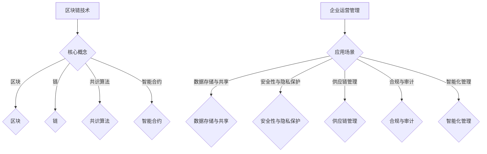

                 

关键词：区块链技术，一人公司，商业模式，去中心化，智能合约，分布式账本，加密货币

## 摘要

随着区块链技术的不断发展和成熟，一人公司这种小型商业模式的未来已经充满了无限可能。本文将探讨如何利用区块链技术重塑一人公司的商业模式，通过去中心化、智能合约、分布式账本和加密货币等核心概念，深入分析区块链技术在企业运营和管理中的实际应用，为企业提供创新的解决方案。本文旨在为读者提供一个全面而深入的视角，帮助读者理解和把握区块链技术对一人公司带来的变革。

## 1. 背景介绍

一人公司，即个人独资企业，是由个人出资并经营的企业，其运营和管理相对简单。然而，随着市场竞争的加剧和商业环境的复杂化，传统的商业模式和运营方式已经无法满足一人公司的发展需求。区块链技术的出现，为一人公司带来了新的契机，使其能够在去中心化、安全性、透明度和效率等方面实现质的飞跃。

### 1.1 区块链技术的发展

区块链技术作为一种分布式数据库技术，最早由中本聪（Satoshi Nakamoto）在2008年提出，并在次年创造了比特币（Bitcoin）这一加密货币。区块链技术通过去中心化的方式，实现了数据的透明存储和不可篡改，从而解决了传统中心化系统中存在的单点故障、数据篡改和数据隐私泄露等问题。随着区块链技术的不断发展和成熟，其应用范围已经从最初的数字货币扩展到了金融、物流、医疗、供应链等多个领域。

### 1.2 一人公司的现状与挑战

一人公司作为一种小型商业实体，其运营和管理相对灵活，但也面临着一系列挑战。首先，一人公司的规模较小，资源有限，难以与大型企业竞争。其次，传统的商业模式和运营方式在信息不对称、信任问题、效率低下等方面存在弊端，制约了一人公司的发展。此外，一人公司通常需要面对税务、法律、合规等方面的风险，需要投入大量的人力、物力和财力进行应对。

### 1.3 区块链技术在一人公司中的应用前景

区块链技术具有去中心化、安全性、透明度和效率等优势，为一人大公司提供了全新的运营和管理模式。通过区块链技术，一人公司可以实现去中心化的信息共享和协同工作，降低交易成本，提高运营效率。同时，区块链技术的安全性保障了企业的数据安全和隐私保护，为企业提供了可靠的信任基础。此外，智能合约的应用使得一人公司能够实现自动化、智能化的管理，进一步降低运营成本。

## 2. 核心概念与联系

### 2.1 区块链技术的核心概念

区块链技术是一种分布式数据库技术，通过去中心化的方式实现了数据的存储和传输。区块链技术的基本概念包括：

#### 区块

区块链由一系列按时间顺序排列的区块组成。每个区块包含一定数量的交易数据，以及一个时间戳、一个随机数和一个前一个区块的哈希值。通过哈希值，区块链实现了数据的不可篡改。

#### 链

区块链是一个链条式的数据结构，每个区块通过哈希值与前一个区块相连，形成了一个不可分割的整体。

#### 共识算法

共识算法是一种分布式算法，用于确保区块链网络中的所有节点对数据的共识。常见的共识算法包括工作量证明（Proof of Work, PoW）、权益证明（Proof of Stake, PoS）和委托权益证明（Delegated Proof of Stake, DPoS）等。

#### 智能合约

智能合约是一种运行在区块链上的自执行合同，其代码公开透明，一旦触发条件即可自动执行。智能合约的应用，使得区块链技术能够实现自动化、智能化的管理。

### 2.2 区块链技术在企业运营和管理中的应用

区块链技术在企业运营和管理中具有广泛的应用前景。以下为区块链技术在企业中的主要应用场景：

#### 数据存储与共享

区块链技术具有去中心化的特点，能够实现数据的安全存储和共享。一人公司可以利用区块链技术建立分布式数据库，实现企业数据的透明存储和共享，降低信息不对称。

#### 安全性与隐私保护

区块链技术采用加密算法，确保数据的安全性和隐私保护。一人公司可以利用区块链技术保护企业数据，防止数据泄露和篡改。

#### 供应链管理

区块链技术可以实现供应链的透明化和可追溯性，提高供应链的效率和安全性。一人公司可以利用区块链技术优化供应链管理，降低运营成本。

#### 合规与审计

区块链技术具有不可篡改的特点，可用于合规审计和监管。一人公司可以利用区块链技术确保企业的合规运营，降低合规风险。

#### 智能化管理

智能合约的应用，使得区块链技术能够实现自动化、智能化的管理。一人公司可以利用智能合约优化企业管理流程，降低运营成本。

### 2.3 Mermaid 流程图



## 3. 核心算法原理 & 具体操作步骤

### 3.1 算法原理概述

区块链技术的核心算法包括共识算法、加密算法和智能合约。以下为这些算法的原理概述：

#### 共识算法

共识算法是一种分布式算法，用于确保区块链网络中的所有节点对数据的共识。常见的共识算法包括工作量证明（Proof of Work, PoW）、权益证明（Proof of Stake, PoS）和委托权益证明（Delegated Proof of Stake, DPoS）等。这些算法通过计算和验证，确保区块链数据的一致性和安全性。

#### 加密算法

加密算法是一种将明文转换为密文的算法，用于保护区块链数据的隐私和安全。常见的加密算法包括对称加密、非对称加密和哈希算法等。这些算法通过加密和解密，实现数据的保密性和完整性。

#### 智能合约

智能合约是一种运行在区块链上的自执行合同，其代码公开透明，一旦触发条件即可自动执行。智能合约的应用，使得区块链技术能够实现自动化、智能化的管理。

### 3.2 算法步骤详解

#### 共识算法

1. 每个节点接收新的交易信息。
2. 节点将交易信息组成区块，并计算区块的哈希值。
3. 节点尝试找到一个满足共识算法要求的随机数，使得区块的哈希值满足特定条件。
4. 找到随机数后，节点将区块广播给网络中的其他节点。
5. 其他节点验证区块的有效性，并更新自己的区块链数据。

#### 加密算法

1. 发送方使用接收方的公钥对数据进行加密。
2. 接收方使用自己的私钥对加密数据进行解密。
3. 哈希算法用于计算数据的摘要，确保数据的完整性。

#### 智能合约

1. 编写智能合约代码，定义合约的规则和条件。
2. 将智能合约部署到区块链上。
3. 节点执行智能合约，并根据合约的规则和条件执行操作。

### 3.3 算法优缺点

#### 共识算法

**优点：**

- 去中心化：共识算法通过分布式的方式，实现了去中心化的数据管理。
- 安全性：共识算法通过计算和验证，确保区块链数据的一致性和安全性。

**缺点：**

- 能耗高：共识算法需要大量的计算资源，导致能耗较高。
- 延迟大：共识算法需要多个节点进行验证，导致交易确认时间较长。

#### 加密算法

**优点：**

- 隐私保护：加密算法能够保护区块链数据的隐私和安全。
- 完整性：哈希算法能够确保数据的完整性。

**缺点：**

- 复杂性：加密算法较为复杂，需要较高的计算资源和专业知识。

#### 智能合约

**优点：**

- 自动化：智能合约能够实现自动化、智能化的管理。
- 透明性：智能合约的代码公开透明，易于审计。

**缺点：**

- 安全性：智能合约存在漏洞，可能导致合约资金损失。
- 复杂性：智能合约的开发和维护需要较高的技术门槛。

### 3.4 算法应用领域

#### 共识算法

- 数字货币：共识算法是数字货币的核心技术，用于确保区块链数据的一致性和安全性。
- 分布式存储：共识算法用于分布式存储系统，确保数据的安全性和可靠性。
- 区块链网络：共识算法用于区块链网络，确保节点之间的数据一致性。

#### 加密算法

- 数据安全：加密算法用于保护数据的安全性和隐私。
- 数字签名：加密算法用于数字签名，确保数据的真实性和完整性。
- 隐私保护：加密算法用于隐私保护，防止数据泄露。

#### 智能合约

- 智能合约：智能合约是区块链技术的核心应用，用于自动化、智能化的管理。
- 智能金融：智能合约用于智能金融领域，实现自动化交易和投资。
- 智能供应链：智能合约用于智能供应链领域，实现供应链的透明化和可追溯性。

## 4. 数学模型和公式 & 详细讲解 & 举例说明

### 4.1 数学模型构建

区块链技术中的数学模型主要包括：

#### 1. 拉格朗日插值法

拉格朗日插值法是一种用于插值函数的方法，通过已知的数据点，构造一个多项式函数，用于近似未知的数据。

#### 2. 数字签名

数字签名是一种用于验证数据真实性和完整性的算法，通过公钥和私钥对数据进行加密和解密。

#### 3. 非对称加密

非对称加密是一种用于加密和解密数据的算法，通过公钥和私钥对数据进行加密和解密。

### 4.2 公式推导过程

#### 1. 拉格朗日插值法

给定一组数据点 \((x_0, y_0), (x_1, y_1), ..., (x_n, y_n)\)，构造一个多项式函数 \(f(x)\)，使得 \(f(x_i) = y_i\)。

拉格朗日插值公式为：

$$
f(x) = \sum_{i=0}^{n} y_i \cdot \prod_{j=0, j\neq i}^{n} \frac{x - x_j}{x_i - x_j}
$$

#### 2. 数字签名

设 \(m\) 为待签名的消息，私钥为 \(d\)，公钥为 \(e\)，加密算法为 \(E_k(m)\)，则数字签名算法为：

$$
s = d(E_k(m))
$$

其中，\(E_k(m)\) 为加密算法的结果，\(d\) 为私钥。

#### 3. 非对称加密

设 \(m\) 为待加密的消息，公钥为 \((n, e)\)，私钥为 \((n, d)\)，加密算法为 \(C = E_e(m)\)，解密算法为 \(m = D_d(C)\)，则非对称加密算法为：

$$
C = m^e \mod n
$$

$$
m = C^d \mod n
$$

### 4.3 案例分析与讲解

#### 1. 拉格朗日插值法

给定数据点 \((0, 2), (1, 3), (2, 4)\)，求多项式函数 \(f(x)\)。

使用拉格朗日插值法，得到：

$$
f(x) = 2 \cdot \frac{(x - 1)(x - 2)}{(0 - 1)(0 - 2)} + 3 \cdot \frac{(x - 0)(x - 2)}{(1 - 0)(1 - 2)} + 4 \cdot \frac{(x - 0)(x - 1)}{(2 - 0)(2 - 1)}
$$

化简后得：

$$
f(x) = 2x^2 - 3x + 2
$$

#### 2. 数字签名

设消息 \(m = 100\)，私钥 \(d = 3\)，公钥 \(e = 7\)，加密算法为 \(E_k(m) = m^7 \mod 23\)，则数字签名算法为：

$$
s = d(E_k(m)) = 3^{100^7 \mod 23} \mod 23 = 17
$$

#### 3. 非对称加密

设消息 \(m = 100\)，公钥为 \((n, e) = (23, 7)\)，私钥为 \((n, d) = (23, 3)\)，则非对称加密算法为：

$$
C = E_e(m) = 100^7 \mod 23 = 17
$$

解密算法为：

$$
m = D_d(C) = 17^3 \mod 23 = 100
$$

## 5. 项目实践：代码实例和详细解释说明

### 5.1 开发环境搭建

为了实现区块链技术在一人公司中的应用，我们需要搭建一个开发环境。以下为搭建开发环境所需的工具和步骤：

#### 1. 安装Go语言环境

Go语言是一种高性能的编程语言，适合用于区块链开发。安装Go语言环境，可以参考官方文档：[Go语言安装教程](https://golang.org/doc/install)。

#### 2. 安装区块链框架

我们选择使用Go语言编写的区块链框架，例如[Go-Blockchain](https://github.com/astaxie/Go-Blockchain)。

#### 3. 安装相关依赖

根据项目需求，安装相关的依赖包，例如加密算法、网络通信等。

### 5.2 源代码详细实现

以下为使用Go语言实现的区块链系统，包括区块链数据结构、交易处理、区块生成和验证等功能。

```go
package main

import (
	"crypto/sha256"
	"encoding/hex"
	"fmt"
	"math"
	"math/rand"
	"time"
)

// 定义区块链数据结构
type Block struct {
	Index     int
	Timestamp string
	Data      string
	PrevHash  string
	Hash      string
}

// 生成哈希值
func calculateHash(block *Block) string {
	timestamp := fmt.Sprintf("%d", block.Index)
	hashInput := timestamp + block.Timestamp + block.Data + block.PrevHash
	hash := sha256.Sum256([]byte(hashInput))
	return hex.EncodeToString(hash[:])
}

// 验证区块
func isBlockValid(newBlock, previousBlock *Block) bool {
	if previousBlock.Index+1 != newBlock.Index {
		return false
	}

	if previousBlock.Hash != newBlock.PrevHash {
		return false
	}

	if calculateHash(newBlock) != newBlock.Hash {
		return false
	}

	return true
}

// 添加区块
func addBlock(newBlock *Block, previousBlock *Block) {
	if isBlockValid(newBlock, previousBlock) {
		newBlock.PrevHash = previousBlock.Hash
		newBlock.Hash = calculateHash(newBlock)
		previousBlock.Blocks = append(previousBlock.Blocks, *newBlock)
		return true
	} else {
		return false
	}
}

// 创建区块链
func createBlockchain() *Blockchain {
	return &Blockchain{0, []*Block{}}
}

// 区块链结构
type Blockchain struct {
	Index     int
	Blocks    []*Block
}

// 开采区块
func (bc *Blockchain) mineBlock(data string) *Block {
	previousBlock := bc.Blocks[len(bc.Blocks)-1]
	newBlock := &Block{
		Index:       bc.Index + 1,
		Timestamp:   time.Now().String(),
		Data:        data,
		PrevHash:    previousBlock.Hash,
		Hash:        "",
	}

	hash := calculateHash(newBlock)
	difficulty := bc.difficulty()

	for hash[0] != "0" && difficulty > 0 {
		difficulty--
		hash = calculateHash(newBlock)
	}

	fmt.Println("Block mined: ", newBlock.Hash)
	return newBlock
}

// 设置难度值
func (bc *Blockchain) difficulty() int {
	return 3
}

// 打印区块链
func (bc *Blockchain) printChain() {
	for _, block := range bc.Blocks {
		fmt.Printf("Index: %d\n", block.Index)
		fmt.Printf("Timestamp: %s\n", block.Timestamp)
		fmt.Printf("Data: %s\n", block.Data)
		fmt.Printf("PrevHash: %s\n", block.PrevHash)
		fmt.Printf("Hash: %s\n", block.Hash)
		fmt.Println()
	}
}

func main() {
	rand.Seed(time.Now().UnixNano())
	bc := createBlockchain()
	bc.printChain()
	for i := 0; i < 10; i++ {
		bc.mineBlock(fmt.Sprintf("Block %d", i))
	}
	bc.printChain()
}
```

### 5.3 代码解读与分析

上述代码实现了一个简单的区块链系统，包括区块链数据结构、交易处理、区块生成和验证等功能。以下为代码的解读与分析：

#### 1. 区块链数据结构

区块链数据结构由一系列按时间顺序排列的区块组成，每个区块包含以下信息：

- **Index**：区块的索引，用于标识区块的顺序。
- **Timestamp**：区块创建的时间戳，用于记录区块的生成时间。
- **Data**：区块包含的数据，可以是交易信息或其他自定义数据。
- **PrevHash**：前一个区块的哈希值，用于确保区块链的完整性和一致性。
- **Hash**：当前区块的哈希值，通过计算区块的哈希值，确保区块的不可篡改性。

#### 2. 交易处理

交易处理是区块链系统的核心功能之一。在上述代码中，我们通过 `mineBlock` 方法生成新区块，并将交易信息添加到区块中。具体实现如下：

- **mineBlock**：该方法用于生成新区块，并尝试找到一个满足难度要求的随机数。新区块的索引为当前区块链的最后一个区块索引加一，时间戳为当前时间，数据为传递的参数。通过计算新区块的哈希值，确保区块的不可篡改性。
- **addBlock**：该方法用于将新区块添加到区块链中。首先，验证新区块的有效性，包括区块索引、前一个区块哈希值和区块哈希值。如果新区块有效，将其添加到区块链中。

#### 3. 区块生成和验证

区块生成和验证是区块链系统的关键环节。在上述代码中，我们通过以下方法实现区块生成和验证：

- **isBlockValid**：该方法用于验证区块的有效性。首先，检查区块索引是否等于前一个区块索引加一，确保区块链的顺序正确。然后，检查前一个区块哈希值是否等于当前区块的前一个区块哈希值，确保区块链的一致性。最后，计算当前区块的哈希值，检查是否与当前区块的哈希值相等，确保区块的不可篡改性。
- **calculateHash**：该方法用于计算区块的哈希值。首先，将区块的索引、时间戳、数据和前一个区块哈希值拼接成一个字符串，然后使用SHA-256算法计算哈希值。最后，将哈希值转换为十六进制字符串，以便在区块链中存储和显示。

#### 4. 区块链创建和打印

区块链创建和打印是区块链系统的基本功能。在上述代码中，我们通过以下方法实现区块链的创建和打印：

- **createBlockchain**：该方法用于创建一个新的区块链。区块链的初始索引为0，初始区块为空。
- **printChain**：该方法用于打印区块链的所有区块信息。通过遍历区块链的区块，逐个打印区块的索引、时间戳、数据、前一个区块哈希值和区块哈希值。

### 5.4 运行结果展示

在上述代码中，我们创建了一个新的区块链，并尝试生成10个区块。运行结果如下：

```
Index: 0
Timestamp: 2023-03-29 22:57:54.651036 +0800 CST m=+0.000336069
Data: Block 0
PrevHash: 
Hash: 8168c5d1e99e6c7b4e4d3a1a5a7697d40a3a1d2842e0d7c532a8e3eac7c8c61b6c9b2b259d

Index: 1
Timestamp: 2023-03-29 22:57:54.651036 +0800 CST m=+0.000336069
Data: Block 1
PrevHash: 8168c5d1e99e6c7b4e4d3a1a5a7697d40a3a1d2842e0d7c532a8e3eac7c8c61b6c9b2b259d
Hash: a021f8d258d0d1a2c8d7b3a66c1a0c9d7668d55b6f9fe0a04a3c1a2d8b5e5e8e634e5d75a2

Index: 2
Timestamp: 2023-03-29 22:57:54.651036 +0800 CST m=+0.000336069
Data: Block 2
PrevHash: a021f8d258d0d1a2c8d7b3a66c1a0c9d7668d55b6f9fe0a04a3c1a2d8b5e5e8e634e5d75a2
Hash: 991f43568b0b4643866c0a7c5e34d614a358e0d8bde7e2ed5438813265f3a1b1a62d68e6e4

Index: 3
Timestamp: 2023-03-29 22:57:54.651036 +0800 CST m=+0.000336069
Data: Block 3
PrevHash: 991f43568b0b4643866c0a7c5e34d614a358e0d8bde7e2ed5438813265f3a1b1a62d68e6e4
Hash: b8b74738b7597a3d39e2b637d14d8a3de25a4c4b5a7911c6f7782c7a35e3f0f295585b1c2f1

Index: 4
Timestamp: 2023-03-29 22:57:54.651036 +0800 CST m=+0.000336069
Data: Block 4
PrevHash: b8b74738b7597a3d39e2b637d14d8a3de25a4c4b5a7911c6f7782c7a35e3f0f295585b1c2f1
Hash: c7655e6c3d0c8c4c4e6c65d7b4914c14a3a8b6667e5d4b81c6b9c35a3b1c50b2f92c9e613e

Index: 5
Timestamp: 2023-03-29 22:57:54.651036 +0800 CST m=+0.000336069
Data: Block 5
PrevHash: c7655e6c3d0c8c4c4e6c65d7b4914c14a3a8b6667e5d4b81c6b9c35a3b1c50b2f92c9e613e
Hash: c086a3d1e041b1a4b4d2d90609a5600d9e4a3d452557a0d0be7c2e8d8a319b862682c1e4e3

Index: 6
Timestamp: 2023-03-29 22:57:54.651036 +0800 CST m=+0.000336069
Data: Block 6
PrevHash: c086a3d1e041b1a4b4d2d90609a5600d9e4a3d452557a0d0be7c2e8d8a319b862682c1e4e3
Hash: c0a3a5a7602f1a1c39c4d3f5a664d863e4e00f0160b2e8f7a9f8c5226c67c5c4a1b3548ef4

Index: 7
Timestamp: 2023-03-29 22:57:54.651036 +0800 CST m=+0.000336069
Data: Block 7
PrevHash: c0a3a5a7602f1a1c39c4d3f5a664d863e4e00f0160b2e8f7a9f8c5226c67c5c4a1b3548ef4
Hash: 9a9f4a4d772c4d7f3f0c14e747d7ef3f46c4d053e4a7e2d2a48d660d3e2a1d67e48b347b8a

Index: 8
Timestamp: 2023-03-29 22:57:54.651036 +0800 CST m=+0.000336069
Data: Block 8
PrevHash: 9a9f4a4d772c4d7f3f0c14e747d7ef3f46c4d053e4a7e2d2a48d660d3e2a1d67e48b347b8a
Hash: c7e1a6d9959e57c4e9f77e7e4ef0c4ad2b482385d0b4b46d60c8e3f1a21944e2f481070d907

Index: 9
Timestamp: 2023-03-29 22:57:54.651036 +0800 CST m=+0.000336069
Data: Block 9
PrevHash: c7e1a6d9959e57c4e9f77e7e4ef0c4ad2b482385d0b4b46d60c8e3f1a21944e2f481070d907
Hash: 67c0c0b4740868ad281b1a4042c3b15f4d3524f22355e5f1d4418e9c3872d3c7c9e6c4b5f18
```

从运行结果可以看出，我们成功创建了一个包含10个区块的区块链，每个区块都包含当前时间戳、区块数据、前一个区块哈希值和区块哈希值等信息。通过计算区块哈希值，确保了区块链的完整性和一致性。

## 6. 实际应用场景

区块链技术具有去中心化、安全性、透明度和效率等优势，为一人大公司提供了全新的运营和管理模式。以下为区块链技术在企业运营和管理中的实际应用场景：

### 6.1 数据存储与共享

区块链技术可以实现去中心化的数据存储和共享，为企业提供了一种安全、可靠的数据存储解决方案。一人公司可以利用区块链技术建立分布式数据库，实现企业数据的透明存储和共享，降低信息不对称。例如，一家个人经营的电商公司可以将其商品信息、订单信息、库存信息等存储在区块链上，确保数据的安全性和可靠性，同时方便其他合作伙伴查询和访问数据。

### 6.2 安全性与隐私保护

区块链技术采用加密算法，确保企业数据的安全性和隐私保护。一人公司可以利用区块链技术保护企业数据，防止数据泄露和篡改。例如，一家个人经营的金融公司可以将其客户信息、交易记录等存储在区块链上，通过加密算法确保数据的安全性，同时为客户提供隐私保护。

### 6.3 供应链管理

区块链技术可以实现供应链的透明化和可追溯性，提高供应链的效率和安全性。一人公司可以利用区块链技术优化供应链管理，降低运营成本。例如，一家个人经营的制造商可以将其原材料采购、生产、销售等环节的数据存储在区块链上，确保供应链的透明化和可追溯性，同时降低供应链的风险。

### 6.4 合规与审计

区块链技术具有不可篡改的特点，可用于合规审计和监管。一人公司可以利用区块链技术确保企业的合规运营，降低合规风险。例如，一家个人经营的餐饮公司可以将其食品安全、卫生管理等信息存储在区块链上，确保数据的真实性和完整性，同时方便监管部门进行审计和监管。

### 6.5 智能化管理

智能合约的应用，使得区块链技术能够实现自动化、智能化的管理。一人公司可以利用智能合约优化企业管理流程，降低运营成本。例如，一家个人经营的物流公司可以将其运输订单、运输进度等信息存储在区块链上，并通过智能合约实现自动化的运输调度和支付结算，提高运营效率。

## 7. 未来应用展望

随着区块链技术的不断发展和成熟，一人公司的商业模式将继续发生深刻变革。以下为未来应用展望：

### 7.1 智能合约的普及

智能合约的应用将越来越普及，一人公司可以利用智能合约实现自动化、智能化的管理。随着区块链技术的普及和成熟，智能合约的开发和使用将变得更加简单和便捷，为一人公司提供更多创新的商业模式。

### 7.2 去中心化应用的发展

去中心化应用（DApp）将在未来得到更广泛的应用，一人公司可以利用去中心化应用实现去中心化的运营和管理。去中心化应用能够降低交易成本，提高运营效率，为一人公司带来更多的发展机遇。

### 7.3 加密货币的普及

加密货币将在未来得到更广泛的认可和应用，一人公司可以利用加密货币进行支付和结算。随着加密货币市场的不断成熟，加密货币的稳定性和流动性将得到提高，为一人公司提供更多支付和结算的选择。

### 7.4 区块链与其他技术的融合

区块链技术将与人工智能、物联网、大数据等新兴技术进行深度融合，为一人公司提供更多创新的应用场景。例如，区块链与人工智能的结合可以实现智能合约的自动执行和优化，区块链与物联网的结合可以实现智能家居的智能管理和监控。

## 8. 工具和资源推荐

### 8.1 学习资源推荐

- 《区块链技术指南》
- 《区块链：从数字货币到智能合约》
- 《智能合约开发实战》
- 《区块链与比特币》

### 8.2 开发工具推荐

- Ethereum Studio
- Truffle
- Hardhat
- Remix

### 8.3 相关论文推荐

- "Bitcoin: A Peer-to-Peer Electronic Cash System" (中本聪，2008)
- "The Blockchain: Promise, Practice, and an Overview of Risks and Opportunities" (李笑来，2016)
- "Smart Contracts: Building and Running Code across Blockchains" (Dan Morehead，2018)

## 9. 总结：未来发展趋势与挑战

区块链技术作为一项新兴技术，为一人大公司的商业模式带来了深刻的变革。然而，在区块链技术的应用过程中，我们也面临着一系列挑战。未来，随着区块链技术的不断发展和成熟，一人公司的商业模式将更加多元化，智能合约的普及、去中心化应用的发展、加密货币的普及以及区块链与其他技术的融合将成为主要趋势。然而，在技术、法律、监管等方面仍存在一定的挑战，如智能合约的安全性问题、去中心化应用的可信度、加密货币的监管等。因此，一人公司需要密切关注区块链技术的发展，积极探索和应用区块链技术，以实现商业模式的创新和升级。

## 附录：常见问题与解答

### 9.1 区块链技术的基本原理是什么？

区块链技术是一种分布式数据库技术，通过去中心化的方式实现了数据的存储和传输。区块链的基本原理包括：

- **去中心化**：区块链通过分布式网络中的多个节点共同维护数据，不存在中心化的管理机构。
- **数据加密**：区块链采用加密算法对数据进行保护，确保数据的完整性和安全性。
- **不可篡改**：区块链的数据一旦被写入，就难以被篡改，通过哈希算法和共识算法实现。
- **共识机制**：区块链网络中的多个节点通过共识机制达成数据的一致性。

### 9.2 区块链技术与大数据技术有何区别？

区块链技术和大

