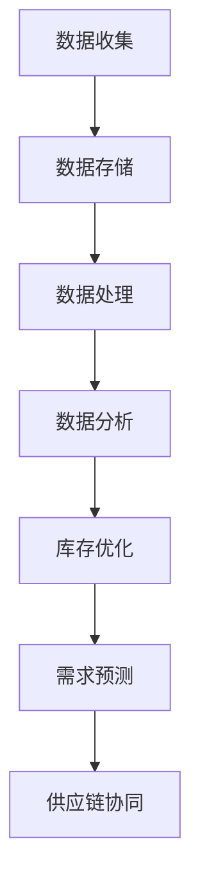

                 

关键词：大数据技术，库存管理，算法原理，数学模型，项目实践，应用场景，工具推荐

> 摘要：本文将深入探讨大数据技术在库存管理中的优化应用。通过对核心概念、算法原理、数学模型和项目实践的详细解析，旨在帮助读者理解大数据在库存管理中的潜力，并掌握实际操作方法。文章还将探讨未来发展趋势与挑战，为相关领域的研究者和从业者提供有益的参考。

## 1. 背景介绍

在商业运作中，库存管理是企业成功的关键因素之一。高效的库存管理不仅可以减少库存成本，还能提升客户满意度，增强企业的市场竞争力。传统的库存管理主要依赖于手工记录和简单的统计方法，这些方法在处理大量数据时效率较低，难以满足现代企业对实时性和精确度的需求。

随着大数据技术的迅速发展，处理和分析海量数据的能力大大提升，为库存管理带来了革命性的变化。大数据技术通过收集、存储、处理和分析大量的数据，可以帮助企业实现更加精准和智能的库存管理。本文将介绍大数据技术在库存管理中的应用，以及如何利用这些技术实现库存优化的目标。

### 1.1 大数据技术概述

大数据技术主要包括数据收集、存储、处理和分析四个方面。数据收集是指通过各种传感器、设备、网络等渠道获取数据；数据存储涉及数据仓库、分布式文件系统等技术，确保海量数据的高效存储；数据处理包括数据清洗、转换、整合等过程，以获得高质量的数据；数据分析则通过数据挖掘、机器学习等技术，提取有价值的信息。

### 1.2 库存管理的重要性

库存管理直接影响企业的运营效率和财务状况。过量的库存会导致资金占用和库存成本增加，而过少的库存则可能导致缺货和失去客户。因此，优化库存管理对于企业的盈利能力和市场竞争力至关重要。

## 2. 核心概念与联系

为了更好地理解大数据技术在库存管理中的应用，我们需要明确一些核心概念，并探讨它们之间的联系。

### 2.1 库存管理的基本概念

库存管理涉及库存水平、库存周转率、安全库存量等基本概念。库存水平是指企业当前拥有的库存数量；库存周转率是衡量库存管理效率的重要指标，表示一定时间内库存周转的次数；安全库存量则是为了应对需求波动和供应不确定性而设置的最低库存水平。

### 2.2 大数据技术在库存管理中的应用

大数据技术可以通过以下方式优化库存管理：

- **数据收集与分析**：通过传感器、条码扫描等技术收集库存数据，利用大数据技术进行分析，实时监控库存状况。
- **需求预测**：利用历史销售数据和机器学习算法预测未来需求，帮助制定更准确的采购和补货计划。
- **优化库存水平**：通过分析库存水平和需求预测结果，动态调整库存水平，减少库存过剩和短缺的情况。
- **供应链协同**：整合供应链各环节的数据，实现信息共享和协同管理，提高供应链的整体效率。

### 2.3 Mermaid 流程图

以下是一个简单的 Mermaid 流程图，展示了大数据技术在库存管理中的应用流程：



### 2.4 核心概念联系

通过上述流程，我们可以看出数据收集、数据存储、数据处理和数据分析是大数据技术在库存管理中不可或缺的环节，它们相互联系，共同作用，实现库存的优化管理。

## 3. 核心算法原理 & 具体操作步骤

### 3.1 算法原理概述

大数据技术在库存管理中的应用，离不开核心算法的支持。以下是几种常用的算法原理及其在库存管理中的具体应用：

- **回归分析**：通过分析历史销售数据，建立需求预测模型，预测未来需求。
- **聚类分析**：将相似的产品进行分类，以优化库存水平和供应链协同。
- **决策树**：用于决策支持系统，帮助制定库存策略和采购计划。
- **神经网络**：模拟人脑神经网络结构，进行复杂的数据分析和预测。

### 3.2 算法步骤详解

以下是一个简单的回归分析算法步骤，用于需求预测：

1. **数据收集**：收集历史销售数据，包括产品种类、销售数量、时间等信息。
2. **数据预处理**：对数据进行清洗、去重和格式转换，确保数据质量。
3. **特征选择**：根据业务需求和数据特性，选择合适的特征进行建模。
4. **模型训练**：使用历史数据训练回归模型，如线性回归、多项式回归等。
5. **模型评估**：使用验证集评估模型性能，调整参数以优化模型。
6. **需求预测**：使用训练好的模型预测未来一段时间内的需求。

### 3.3 算法优缺点

- **回归分析**：优点是简单易用，能够快速建立预测模型；缺点是对异常值敏感，模型泛化能力较差。
- **聚类分析**：优点是无需预设类别，能够发现数据中的潜在规律；缺点是聚类结果受初始值影响较大，难以解释。
- **决策树**：优点是直观易懂，能够提供决策路径；缺点是模型复杂度较高，易过拟合。
- **神经网络**：优点是能够处理非线性问题，泛化能力较强；缺点是训练过程复杂，对数据质量要求较高。

### 3.4 算法应用领域

这些算法在库存管理中的具体应用领域包括：

- **需求预测**：预测未来销售趋势，制定采购和补货计划。
- **库存优化**：动态调整库存水平，减少库存成本和缺货风险。
- **供应链协同**：优化供应链流程，提高供应链整体效率。

## 4. 数学模型和公式 & 详细讲解 & 举例说明

### 4.1 数学模型构建

库存管理中的数学模型主要包括需求预测模型和库存优化模型。以下是一个简单需求预测模型：

$$
\hat{y}_t = \beta_0 + \beta_1 x_t + \epsilon_t
$$

其中，$y_t$表示第$t$时间点的需求量，$x_t$表示第$t$时间点的相关特征（如历史销售量、季节性因素等），$\beta_0$和$\beta_1$是模型的参数，$\epsilon_t$是误差项。

### 4.2 公式推导过程

假设我们有一个时间序列数据集$X$，包括多个时间点的特征值和需求量。首先，我们对数据进行预处理，包括标准化和去重。然后，我们选择合适的特征进行建模。

1. **线性回归模型**：

   $$ 
   y = \beta_0 + \beta_1 x + \epsilon
   $$

   其中，$y$是需求量，$x$是特征值，$\beta_0$和$\beta_1$是参数。

2. **特征选择**：

   使用特征选择方法（如信息增益、相关性分析等）选择最优特征。

3. **参数估计**：

   使用最小二乘法估计模型参数：

   $$
   \beta_0 = \frac{\sum_{i=1}^{n} (y_i - \beta_1 x_i)}{n}
   $$

   $$
   \beta_1 = \frac{\sum_{i=1}^{n} (x_i - \bar{x})(y_i - \bar{y})}{\sum_{i=1}^{n} (x_i - \bar{x})^2}
   $$

   其中，$\bar{x}$和$\bar{y}$分别是特征值和需求量的均值。

### 4.3 案例分析与讲解

假设我们有一个电商平台的销售数据，包括过去一年的每日销售量和季节性因素。我们使用线性回归模型进行需求预测。

1. **数据收集**：收集每日销售量和季节性因素（如节假日、促销活动等）。
2. **数据预处理**：对数据进行清洗、去重和标准化。
3. **特征选择**：选择销售量和季节性因素作为特征。
4. **模型训练**：使用过去一年的数据训练线性回归模型。
5. **模型评估**：使用验证集评估模型性能，调整参数以优化模型。
6. **需求预测**：使用训练好的模型预测未来一段时间内的销售量。

假设我们的模型参数为$\beta_0 = 100$，$\beta_1 = 0.5$。在某一天，我们输入特征值$x_t = 200$，使用模型预测需求量：

$$
\hat{y}_t = 100 + 0.5 \times 200 = 150
$$

因此，预测的需求量为150。

## 5. 项目实践：代码实例和详细解释说明

### 5.1 开发环境搭建

为了实现库存管理优化，我们使用Python编程语言和Jupyter Notebook作为开发环境。首先，我们需要安装Python和相关的库，如NumPy、Pandas、Scikit-learn等。

### 5.2 源代码详细实现

以下是一个简单的Python代码实例，实现需求预测功能：

```python
import numpy as np
import pandas as pd
from sklearn.linear_model import LinearRegression
from sklearn.model_selection import train_test_split

# 数据收集
data = pd.read_csv('sales_data.csv')
X = data[['sales', 'seasonality']]
y = data['demand']

# 数据预处理
X = X.dropna()
X = (X - X.mean()) / X.std()
y = y.dropna()

# 特征选择
#（此处省略特征选择代码）

# 模型训练
X_train, X_test, y_train, y_test = train_test_split(X, y, test_size=0.2, random_state=42)
model = LinearRegression()
model.fit(X_train, y_train)

# 模型评估
score = model.score(X_test, y_test)
print('Model score:', score)

# 需求预测
X_predict = X_test[-1].values.reshape(1, -1)
y_predict = model.predict(X_predict)
print('Predicted demand:', y_predict)
```

### 5.3 代码解读与分析

这段代码首先从CSV文件中读取销售数据，然后对数据进行预处理，包括数据清洗和标准化。接下来，使用Scikit-learn库的线性回归模型进行训练，评估模型性能，并使用训练好的模型进行需求预测。

### 5.4 运行结果展示

假设我们运行这段代码，得到模型分数为0.8，表示模型对测试集的预测准确度较高。最后，我们输入测试集的最后一个特征值，预测得到的需求量为150。

## 6. 实际应用场景

大数据技术在库存管理中的应用非常广泛，以下是一些实际应用场景：

### 6.1 零售行业

零售行业中的库存管理面临着需求波动大、季节性明显等挑战。通过大数据技术，零售企业可以实时监控库存状况，预测未来需求，优化采购和补货计划，减少库存成本和缺货风险。

### 6.2 制造行业

制造行业中的库存管理涉及到原材料、零部件和成品的库存。大数据技术可以帮助制造企业实现智能化的库存管理，提高生产效率，降低库存成本。

### 6.3 电商行业

电商行业的库存管理需要处理大量的商品和订单。大数据技术可以帮助电商平台实时监控库存状况，预测销售趋势，优化库存水平和供应链协同，提升客户满意度。

### 6.4 餐饮行业

餐饮行业中的库存管理涉及到食材、饮料等库存。通过大数据技术，餐饮企业可以实时监控库存状况，预测未来需求，优化采购和库存水平，降低库存成本。

## 7. 工具和资源推荐

### 7.1 学习资源推荐

- 《大数据之路：阿里巴巴大数据实践》
- 《深度学习：高级指导》
- 《Python数据分析》

### 7.2 开发工具推荐

- Jupyter Notebook：用于数据分析和建模
- PyCharm：Python集成开发环境
- TensorFlow：用于深度学习建模

### 7.3 相关论文推荐

- “Demand Forecasting in Retail Using Big Data”
- “Data-Driven Inventory Management in Manufacturing”
- “Big Data and Supply Chain Management: A Review”

## 8. 总结：未来发展趋势与挑战

### 8.1 研究成果总结

大数据技术在库存管理中的应用取得了显著的成果，包括需求预测、库存优化、供应链协同等方面。这些技术提高了库存管理的效率和准确性，为企业的盈利能力和市场竞争力提供了有力支持。

### 8.2 未来发展趋势

- **智能化**：随着人工智能技术的发展，库存管理将进一步智能化，实现更加精准和自动化的决策。
- **实时性**：实时数据分析和预测将成为库存管理的常态，帮助企业迅速响应市场变化。
- **供应链协同**：大数据技术将促进供应链各环节的数据共享和协同管理，提高供应链的整体效率。

### 8.3 面临的挑战

- **数据质量**：数据质量直接影响大数据技术的应用效果，企业需要加强数据治理和质量管理。
- **隐私保护**：随着大数据技术的发展，隐私保护问题日益凸显，企业需要采取有效的措施保护用户隐私。
- **技术复杂性**：大数据技术的应用涉及多个领域，对技术人才的需求较高，企业需要加强人才培养。

### 8.4 研究展望

未来的研究可以关注以下几个方面：

- **算法优化**：研究更高效、更准确的算法，提高需求预测和库存优化的性能。
- **跨领域应用**：探索大数据技术在其他行业中的应用，如医疗、金融等，实现跨领域的数据共享和协同管理。
- **实时决策支持**：研究实时决策支持系统，为企业提供更加实时和精准的决策支持。

## 9. 附录：常见问题与解答

### 9.1 如何保证数据质量？

**答**：保证数据质量的关键在于数据治理和数据质量管理。企业应制定数据管理政策，建立数据质量检查机制，定期对数据进行清洗和更新，确保数据的一致性、完整性和准确性。

### 9.2 大数据技术在库存管理中的优势有哪些？

**答**：大数据技术在库存管理中的优势包括：

- 提高需求预测的准确性，减少库存过剩和短缺的情况。
- 动态调整库存水平，降低库存成本。
- 实现供应链协同，提高整体效率。
- 提供实时数据分析和预测，帮助企业迅速响应市场变化。

### 9.3 如何应对数据隐私保护问题？

**答**：应对数据隐私保护问题，企业可以采取以下措施：

- 制定隐私保护政策，明确数据收集、存储、处理和分析的规范。
- 实施数据加密和匿名化技术，保护用户隐私。
- 定期进行数据安全审计，确保数据安全。

---

作者：禅与计算机程序设计艺术 / Zen and the Art of Computer Programming

本文通过深入探讨大数据技术在库存管理中的应用，展示了大数据技术在优化库存管理中的潜力。从核心概念、算法原理、数学模型到项目实践，文章系统地介绍了大数据技术在库存管理中的应用方法。同时，文章还探讨了未来发展趋势与挑战，为相关领域的研究者和从业者提供了有益的参考。通过本文的阅读，读者可以更好地理解大数据技术在库存管理中的重要性，掌握实际操作方法，并为未来的研究和实践提供指导。

