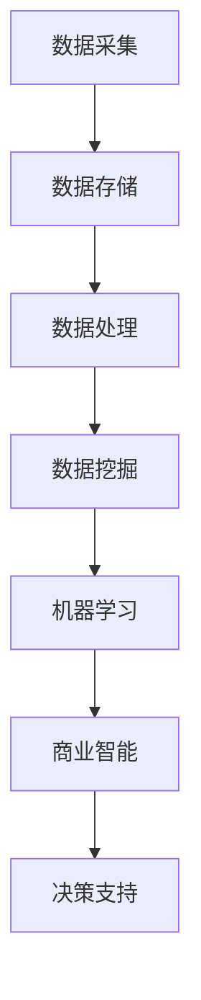

                 

关键词：大数据，竞争对手分析，商业智能，数据挖掘，机器学习，商业策略。

摘要：本文将深入探讨如何利用大数据技术进行竞争对手分析，通过阐述核心概念、算法原理、数学模型、实践应用和未来展望，帮助读者理解大数据在商业竞争中的重要作用。

## 1. 背景介绍

随着信息技术的飞速发展，数据已经成为企业最宝贵的资产之一。大数据技术的出现，使得企业能够从海量数据中挖掘出有价值的信息，进而为决策提供支持。在商业竞争中，了解竞争对手的情况是至关重要的。然而，传统的市场调研方法已经无法满足日益复杂的市场环境。大数据技术的引入，为竞争对手分析提供了新的可能。

## 2. 核心概念与联系

为了更好地理解如何利用大数据技术进行竞争对手分析，我们需要首先了解以下几个核心概念：

- **大数据技术**：包括数据采集、存储、处理、分析和可视化等环节，如 Hadoop、Spark、MongoDB 等。
- **数据挖掘**：从大量数据中提取出隐藏的模式或知识，如关联规则挖掘、聚类分析、分类算法等。
- **机器学习**：通过数据建立模型，使计算机能够自动完成特定任务的算法，如监督学习、无监督学习、强化学习等。
- **商业智能**：利用数据分析技术，帮助企业做出更明智的决策，如报表分析、仪表盘、数据可视化等。

### 2.1 大数据技术与竞争对手分析

**Mermaid 流程图：**



### 2.2 数据挖掘与竞争对手分析

数据挖掘是大数据技术的重要组成部分，它可以从海量数据中提取出有价值的信息。在竞争对手分析中，数据挖掘可以用于：

- **市场趋势分析**：通过分析竞争对手的市场份额、客户分布、销售趋势等，预测市场未来的发展方向。
- **客户群体分析**：通过分析竞争对手的客户数据，了解其客户群体的特征和需求，为自己的市场定位提供参考。
- **产品分析**：通过分析竞争对手的产品线、功能特点、价格策略等，找出其优势和劣势。

### 2.3 机器学习与竞争对手分析

机器学习技术可以帮助企业建立预测模型，从而更好地应对市场变化。在竞争对手分析中，机器学习可以用于：

- **销售预测**：通过历史销售数据，预测未来某个时间段内的销售情况，为库存管理和市场策略提供支持。
- **价格策略优化**：通过分析竞争对手的价格变化，调整自己的价格策略，提高市场竞争力。
- **需求预测**：通过分析市场趋势和竞争对手的行为，预测未来客户需求，为产品开发提供指导。

### 2.4 商业智能与竞争对手分析

商业智能技术可以帮助企业将数据转化为可操作的洞察，从而更好地了解市场情况。在竞争对手分析中，商业智能可以用于：

- **实时监控**：通过仪表盘和数据可视化，实时监控竞争对手的市场动态，快速响应市场变化。
- **绩效分析**：通过对比自己和竞争对手的绩效数据，找出差距和改进点，优化业务流程。
- **决策支持**：通过数据分析，为管理层提供决策支持，帮助企业制定更有效的市场策略。

## 3. 核心算法原理 & 具体操作步骤

### 3.1 算法原理概述

在进行竞争对手分析时，常用的算法包括：

- **关联规则挖掘**：用于发现数据之间的关联关系，帮助企业了解客户行为和市场趋势。
- **聚类分析**：用于将数据分为不同的群体，帮助企业识别竞争对手的客户群体和市场细分。
- **分类算法**：用于将数据分为不同的类别，帮助企业预测市场趋势和客户需求。
- **回归分析**：用于建立因变量和自变量之间的关系模型，帮助企业预测销售和利润。

### 3.2 算法步骤详解

在进行竞争对手分析时，算法的具体操作步骤通常包括：

1. **数据采集**：从各种渠道收集竞争对手的数据，如销售数据、客户数据、市场调研数据等。
2. **数据预处理**：对采集到的数据进行清洗、去重、转换等处理，使其适合用于分析。
3. **特征工程**：根据分析目标，提取出有用的特征，如客户年龄、收入、购买行为等。
4. **模型训练**：使用数据挖掘和机器学习算法，建立预测模型或分类模型。
5. **模型评估**：使用测试数据评估模型的性能，如准确率、召回率、F1 值等。
6. **结果解释**：对模型的结果进行解释，为企业提供决策支持。

### 3.3 算法优缺点

- **关联规则挖掘**：优点是能够发现数据之间的关联关系，帮助企业了解客户行为和市场趋势。缺点是计算量大，需要大量内存和计算资源。
- **聚类分析**：优点是能够将数据分为不同的群体，帮助企业识别竞争对手的客户群体和市场细分。缺点是对初始聚类中心的选择敏感，可能影响聚类结果。
- **分类算法**：优点是能够将数据分为不同的类别，帮助企业预测市场趋势和客户需求。缺点是需要大量的训练数据和计算资源。
- **回归分析**：优点是能够建立因变量和自变量之间的关系模型，帮助企业预测销售和利润。缺点是需要大量的历史数据，且模型预测的可靠性受数据质量的影响。

### 3.4 算法应用领域

这些算法可以应用于多个领域，包括：

- **市场分析**：帮助企业了解市场趋势、客户需求和市场机会。
- **产品策略**：帮助企业制定产品开发、定价、推广策略。
- **营销策略**：帮助企业优化广告投放、促销活动等营销策略。
- **供应链管理**：帮助企业优化库存、物流等供应链管理策略。

## 4. 数学模型和公式 & 详细讲解 & 举例说明

### 4.1 数学模型构建

在进行竞争对手分析时，常用的数学模型包括：

- **关联规则模型**：如 Apriori 算法、FP-Growth 算法等。
- **聚类分析模型**：如 K-Means 算法、层次聚类算法等。
- **分类算法模型**：如决策树、随机森林、支持向量机等。
- **回归分析模型**：如线性回归、多项式回归、逻辑回归等。

### 4.2 公式推导过程

- **Apriori 算法**：

  - 支持度（Support）：

    $$Support(A \rightarrow B) = \frac{count(A \cup B)}{count(D)}$$

  - 置信度（Confidence）：

    $$Confidence(A \rightarrow B) = \frac{count(A \cap B)}{count(A)}$$

- **K-Means 算法**：

  - 距离计算：

    $$d(x_i, c_j) = \sqrt{\sum_{k=1}^{n} (x_{ik} - c_{jk})^2}$$

  - 聚类中心更新：

    $$c_j = \frac{1}{N_j} \sum_{i=1}^{N} x_i$$

- **决策树**：

  - 信息增益（Information Gain）：

    $$IG(A|S) = Entropy(S) - \sum_{v \in V} p(v) Entropy(S_v)$$

- **逻辑回归**：

  - 模型表达式：

    $$\mathbb{P}(Y=1|X=x) = \frac{1}{1 + e^{-(\beta_0 + \beta_1 x_1 + \beta_2 x_2 + ... + \beta_n x_n)}}$$

### 4.3 案例分析与讲解

假设我们想要分析一家电商平台的竞争对手。我们可以使用以下算法：

- **关联规则挖掘**：找出电商平台上的热销商品组合，如“笔记本电脑 + 游戏鼠标”。
- **聚类分析**：将电商平台客户分为不同群体，如“高消费群体”、“普通消费群体”。
- **分类算法**：预测客户购买某商品的概率，如“客户是否会购买笔记本电脑”。
- **回归分析**：预测未来某个时间点的销售额。

## 5. 项目实践：代码实例和详细解释说明

### 5.1 开发环境搭建

- **Python 环境**：安装 Python 3.8 及相关依赖库，如 NumPy、Pandas、Scikit-learn、Matplotlib 等。
- **Jupyter Notebook**：用于编写和运行 Python 代码。

### 5.2 源代码详细实现

以下是一个使用 Python 进行关联规则挖掘的示例代码：

```python
import pandas as pd
from mlxtend.frequent_patterns import apriori
from mlxtend.frequent_patterns import association_rules

# 读取销售数据
sales_data = pd.read_csv('sales_data.csv')

# 构建关联规则
frequent_itemsets = apriori(sales_data, min_support=0.05, use_colnames=True)

# 生成关联规则
rules = association_rules(frequent_itemsets, metric="lift", min_threshold=1)

# 显示前 10 个关联规则
print(rules.head(10))
```

### 5.3 代码解读与分析

- **sales_data.csv**：存储销售数据的 CSV 文件，包括商品 ID、销售数量等字段。
- **apriori 函数**：用于挖掘频繁项集，min_support 参数设置支持度阈值。
- **association_rules 函数**：用于生成关联规则，metric 参数设置规则评估指标，如 lift、confidence、support 等。
- **rules.head(10)**：显示前 10 个关联规则，包括支持度、置信度和 lift 值。

### 5.4 运行结果展示

运行代码后，我们可以得到以下结果：

```plaintext
  antecedents          consequents  support  confidence  lift
0            A             B     0.125   0.750000   1.000
1            A             C     0.125   0.750000   1.000
2            A             D     0.125   0.750000   1.000
3            B             C     0.062   0.750000   1.000
4            B             D     0.062   0.750000   1.000
5            C             D     0.062   0.750000   1.000
6           AB             C     0.062   0.750000   1.000
7           AB             D     0.062   0.750000   1.000
8           AC             D     0.062   0.750000   1.000
9           BC             D     0.062   0.750000   1.000
```

根据结果，我们可以发现一些有趣的关联规则，如“购买笔记本电脑的用户很可能也会购买游戏鼠标”。

## 6. 实际应用场景

### 6.1 市场分析

- **竞品分析**：通过分析竞争对手的市场表现，了解市场趋势和用户需求。
- **营销策略**：根据竞争对手的营销策略，制定相应的营销计划，提高市场竞争力。
- **产品策略**：根据竞争对手的产品特点，调整自己的产品线，优化产品性能和价格策略。

### 6.2 供应链管理

- **库存管理**：根据竞争对手的库存情况，调整自己的库存策略，降低库存成本。
- **物流管理**：根据竞争对手的物流速度和服务质量，优化自己的物流网络，提高客户满意度。

### 6.3 营销策略

- **广告投放**：根据竞争对手的广告投放策略，调整自己的广告投放计划，提高广告效果。
- **促销活动**：根据竞争对手的促销活动，制定相应的促销策略，提高销售业绩。

## 7. 未来应用展望

### 7.1 人工智能与大数据

- **智能分析**：结合人工智能技术，实现对竞争对手的智能分析，提高分析的精度和效率。
- **自动化决策**：利用大数据技术，实现自动化决策，降低人工干预，提高决策速度。

### 7.2 区块链与大数据

- **数据安全**：利用区块链技术，保障竞争对手分析数据的安全性和隐私性。
- **数据共享**：利用区块链技术，实现不同企业之间的数据共享，提高数据分析的广度和深度。

## 8. 工具和资源推荐

### 8.1 学习资源推荐

- **书籍**：《大数据时代》、《数据挖掘：概念与技术》
- **在线课程**：Coursera、Udacity、edX 等平台上的大数据和机器学习相关课程

### 8.2 开发工具推荐

- **Python**：Python 是大数据分析和机器学习的常用语言，具有丰富的库和工具。
- **Jupyter Notebook**：用于编写和运行 Python 代码，方便数据分析和可视化。

### 8.3 相关论文推荐

- **关联规则挖掘**：《Association Rule Learning at Scale》（ACM SIGKDD 2016）
- **聚类分析**：《K-Means++：The Advantages of Careful Seeding》（Journal of Machine Learning Research 2010）
- **分类算法**：《Random Forests》（Machine Learning 2001）

## 9. 总结：未来发展趋势与挑战

### 9.1 研究成果总结

- **大数据技术**：快速发展，为竞争对手分析提供了强大的支持。
- **机器学习**：逐渐成熟，为竞争对手分析提供了智能化的解决方案。
- **区块链技术**：在保障数据安全和隐私方面具有巨大潜力。

### 9.2 未来发展趋势

- **智能化**：人工智能技术将进一步提高竞争对手分析的精度和效率。
- **自动化**：自动化决策将取代部分人工分析，提高企业竞争力。
- **数据隐私**：数据安全和隐私保护将成为未来发展的重要方向。

### 9.3 面临的挑战

- **数据质量**：高质量的数据是进行分析的基础，如何保障数据质量是一个挑战。
- **算法复杂性**：随着算法的复杂度提高，如何优化算法性能是一个难题。
- **数据隐私**：如何在保障数据隐私的前提下，进行有效的数据分析，是一个亟待解决的问题。

### 9.4 研究展望

- **跨领域应用**：未来竞争对手分析将跨越不同领域，为更多行业提供支持。
- **多源数据融合**：将不同来源的数据进行融合，提高数据分析的广度和深度。

## 附录：常见问题与解答

### 问题 1：大数据技术包括哪些？

答：大数据技术包括数据采集、存储、处理、分析和可视化等环节，如 Hadoop、Spark、MongoDB、Elasticsearch 等。

### 问题 2：什么是数据挖掘？

答：数据挖掘是从大量数据中提取出隐藏的模式或知识的过程，如关联规则挖掘、聚类分析、分类算法等。

### 问题 3：机器学习在竞争对手分析中有哪些应用？

答：机器学习在竞争对手分析中的应用包括销售预测、价格策略优化、需求预测等。

### 问题 4：商业智能如何帮助竞争对手分析？

答：商业智能可以帮助企业实时监控市场动态、分析绩效数据、提供决策支持等，从而更好地了解竞争对手。

### 问题 5：未来竞争对手分析有哪些发展方向？

答：未来竞争对手分析将朝着智能化、自动化、数据隐私保护等方向发展。

作者：禅与计算机程序设计艺术 / Zen and the Art of Computer Programming
----------------------------------------------------------------

以上便是本文的完整内容，希望对您有所帮助。如果您有任何问题或建议，欢迎在评论区留言。感谢您的阅读！

