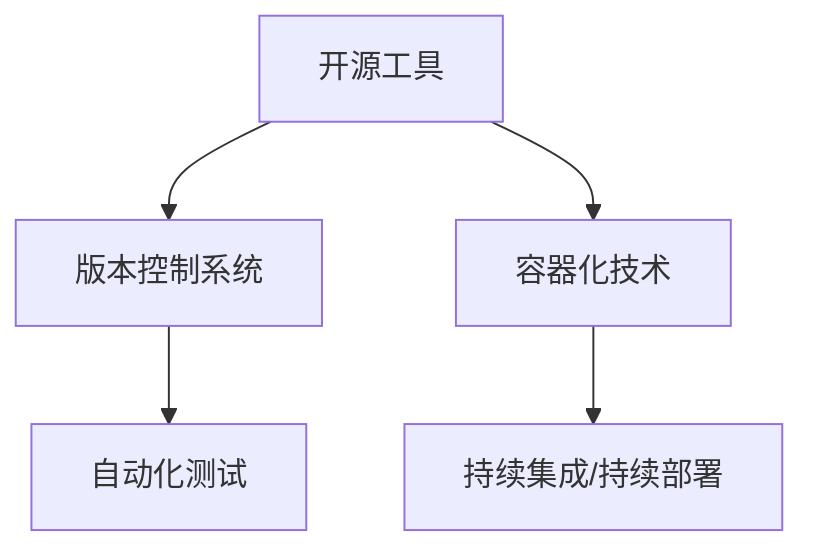

                 

在这个快速变化的技术时代，产品迭代的速度是决定企业竞争成败的关键因素之一。开源生态的蓬勃发展，为开发者提供了丰富的工具和资源，使得产品迭代变得更加高效和灵活。本文将探讨如何利用开源生态加速产品迭代，分享一些实用的策略和实践经验。

## 文章关键词

- 开源生态
- 产品迭代
- 高效开发
- 开源工具
- 自动化测试
- 持续集成

## 文章摘要

本文将介绍开源生态对产品迭代的重要性，以及如何通过利用开源工具、自动化测试、持续集成等策略来加速产品迭代。文章还将提供一些实际案例，帮助读者更好地理解和应用这些方法。

### 1. 背景介绍

在现代软件行业中，开源项目已经成为开发者和企业不可或缺的一部分。开源生态的兴起，不仅为开发者提供了丰富的技术资源，还改变了传统的软件开发模式。随着开源项目的数量和影响力的不断增加，越来越多的企业开始重视并利用开源生态来加速产品的开发与迭代。

产品迭代是软件开发过程中必不可少的一环。通过不断迭代，产品可以更好地满足用户需求，提高市场竞争力。然而，传统的产品迭代往往面临时间成本高、沟通成本高、质量难以保障等问题。而开源生态的引入，为解决这些问题提供了新的思路和解决方案。

### 2. 核心概念与联系

要利用开源生态加速产品迭代，我们需要了解以下几个核心概念：

- **开源工具**：如Git、Docker、Kubernetes等，这些工具能够大大提高开发效率，降低开发和维护成本。
- **版本控制系统**：如Git，它能够帮助开发者更好地管理代码版本，提高协作效率。
- **容器化技术**：如Docker，它可以将应用程序及其依赖环境打包成一个独立的容器，实现一次编写，到处运行。
- **自动化测试**：通过编写自动化测试脚本，可以快速检测代码的稳定性和功能完整性。
- **持续集成/持续部署**：通过自动化构建和部署流程，可以快速将代码推向生产环境。

下面是一个简单的 Mermaid 流程图，展示了这些核心概念之间的联系：



### 3. 核心算法原理 & 具体操作步骤

#### 3.1 算法原理概述

要利用开源生态加速产品迭代，我们需要遵循以下核心原理：

- **模块化开发**：将产品划分为多个模块，每个模块可以独立开发、测试和部署。
- **敏捷开发**：采用敏捷开发方法，快速迭代，及时反馈和调整。
- **自动化测试**：通过编写自动化测试脚本，确保每次迭代的产品质量。
- **持续集成**：通过持续集成系统，自动构建和部署代码，缩短开发周期。
- **社区协作**：积极参与开源社区，利用社区资源和经验，提高开发效率。

#### 3.2 算法步骤详解

1. **模块化开发**：

   - 设计模块架构，确定模块间的关系和接口。
   - 每个模块独立开发，实现所需功能。
   - 模块之间通过API进行通信，确保模块间的兼容性。

2. **敏捷开发**：

   - 采用Scrum或Kanban等敏捷开发方法，快速迭代。
   - 每个迭代周期结束后，进行代码评审和测试。
   - 根据用户反馈，及时调整开发方向和计划。

3. **自动化测试**：

   - 编写自动化测试脚本，覆盖主要功能和边界条件。
   - 使用自动化测试框架，如JUnit、pytest等，执行测试用例。
   - 通过持续集成系统，自动运行测试脚本，确保产品质量。

4. **持续集成**：

   - 使用Jenkins、GitLab CI等持续集成工具，自动构建和部署代码。
   - 集成自动化测试，确保每次构建都是可部署的。
   - 通过持续集成系统，快速反馈构建和测试结果，提高开发效率。

#### 3.3 算法优缺点

**优点**：

- **提高开发效率**：模块化开发、敏捷开发、自动化测试和持续集成可以大大提高开发效率。
- **保证产品质量**：自动化测试和持续集成可以确保产品质量，降低bug率。
- **降低成本**：开源工具和社区协作可以降低开发和维护成本。

**缺点**：

- **需要一定的技术积累**：要有效地利用开源生态，需要开发者有一定的技术积累和经验。
- **安全性问题**：开源项目可能存在安全漏洞，需要谨慎使用。

#### 3.4 算法应用领域

开源生态和加速产品迭代的算法适用于各个领域，如Web开发、移动应用、大数据处理、人工智能等。以下是一些具体的应用案例：

- **Web开发**：使用Django、Flask等开源框架，快速构建Web应用。
- **移动应用**：使用React Native、Flutter等跨平台框架，实现一次编写，多处运行。
- **大数据处理**：使用Hadoop、Spark等开源工具，处理海量数据。
- **人工智能**：使用TensorFlow、PyTorch等开源框架，进行机器学习和深度学习研究。

### 4. 数学模型和公式 & 详细讲解 & 举例说明

要利用开源生态加速产品迭代，我们需要了解一些基本的数学模型和公式。以下是一个简单的数学模型，用于计算产品的迭代速度：

#### 4.1 数学模型构建

设 \( V \) 为产品的迭代速度，\( T \) 为每次迭代的时间，\( C \) 为每次迭代的产品质量。则迭代速度 \( V \) 可以表示为：

\[ V = \frac{C}{T} \]

其中，\( C \) 表示每次迭代的产品质量，\( T \) 表示每次迭代的时间。

#### 4.2 公式推导过程

- 假设每次迭代的产品质量为 \( C \)，则 \( C \) 是一个常数。
- 假设每次迭代的时间为 \( T \)，则 \( T \) 是一个变量。
- 根据迭代速度的定义，迭代速度 \( V \) 是每次迭代的产品质量 \( C \) 除以每次迭代的时间 \( T \)。

因此，迭代速度 \( V \) 的计算公式为：

\[ V = \frac{C}{T} \]

#### 4.3 案例分析与讲解

假设一个产品的迭代速度为 \( V = 10 \)，每次迭代的时间为 \( T = 2 \) 周。则每次迭代的产品质量为：

\[ C = V \times T = 10 \times 2 = 20 \]

这意味着，每两周产品可以迭代20个质量点。

现在，假设我们将迭代时间缩短到 \( T = 1 \) 周，则新的迭代速度为：

\[ V = \frac{C}{T} = \frac{20}{1} = 20 \]

这意味着，每周产品可以迭代20个质量点。

通过这个简单的例子，我们可以看到，缩短迭代时间可以显著提高产品的迭代速度。

### 5. 项目实践：代码实例和详细解释说明

为了更好地理解如何利用开源生态加速产品迭代，我们将通过一个实际的代码实例来展示整个过程。

#### 5.1 开发环境搭建

首先，我们需要搭建一个开发环境。这里我们使用Docker来容器化我们的开发环境。

1. 安装Docker：

   ```bash
   sudo apt-get update
   sudo apt-get install docker-ce docker-ce-cli containerd.io
   ```

2. 启动Docker服务：

   ```bash
   sudo systemctl start docker
   ```

3. 创建一个Dockerfile，定义我们的开发环境：

   ```Dockerfile
   FROM python:3.8-slim

   RUN pip install flask

   WORKDIR /app

   COPY . .

   CMD ["flask", "run", "--host=0.0.0.0"]
   ```

4. 构建Docker镜像：

   ```bash
   docker build -t my-flask-app .
   ```

5. 运行Docker容器：

   ```bash
   docker run -d -p 5000:5000 my-flask-app
   ```

现在，我们的开发环境已经搭建完毕。

#### 5.2 源代码详细实现

接下来，我们创建一个简单的Flask应用，实现一个简单的Web服务。

```python
# app.py

from flask import Flask

app = Flask(__name__)

@app.route('/')
def hello():
    return 'Hello, World!'

if __name__ == '__main__':
    app.run(host='0.0.0.0', port=5000)
```

我们将这个应用打包成Docker镜像，并运行在Docker容器中。

#### 5.3 代码解读与分析

这个简单的Flask应用由一个Python文件 `app.py` 组成。该文件定义了一个名为 `hello` 的路由，当访问应用的主页时，会返回一个字符串 `'Hello, World!'`。

通过Docker，我们能够将这个应用容器化，实现一次编写，到处运行。这意味着，无论是在本地开发环境，还是在生产环境，我们都可以使用相同的Docker镜像来运行这个应用。

#### 5.4 运行结果展示

现在，我们通过浏览器访问本地Docker容器的5000端口，可以看到应用返回的结果：

```bash
$ curl localhost:5000
Hello, World!
```

这个简单的例子展示了如何利用Docker来加速产品的迭代。通过容器化，我们可以快速搭建开发环境，缩短部署时间，提高开发效率。

### 6. 实际应用场景

开源生态的引入，使得产品迭代在多个实际应用场景中变得更加高效和灵活。以下是一些典型的应用场景：

- **Web应用开发**：使用Django、Flask等开源框架，可以快速搭建Web应用，实现敏捷开发。
- **移动应用开发**：使用React Native、Flutter等跨平台框架，实现一次编写，多处运行，提高开发效率。
- **大数据处理**：使用Hadoop、Spark等开源工具，处理海量数据，实现快速迭代。
- **人工智能应用**：使用TensorFlow、PyTorch等开源框架，进行机器学习和深度学习研究，加速模型迭代。

### 7. 未来应用展望

随着开源生态的不断发展，未来产品迭代将变得更加高效和智能化。以下是一些未来应用展望：

- **自动化测试**：利用人工智能技术，自动化测试将更加智能化，提高测试效率。
- **持续集成/持续部署**：随着容器化和微服务架构的普及，持续集成/持续部署将变得更加普及和高效。
- **开源社区协作**：开源社区将发挥更大的作用，为企业提供更多的技术支持和创新动力。

### 8. 工具和资源推荐

为了更好地利用开源生态加速产品迭代，以下是一些推荐的工具和资源：

- **开发工具**：Visual Studio Code、PyCharm、IntelliJ IDEA等。
- **版本控制系统**：Git、SVN等。
- **容器化技术**：Docker、Kubernetes等。
- **自动化测试工具**：JUnit、pytest、Selenium等。
- **持续集成工具**：Jenkins、GitLab CI、Travis CI等。
- **开源社区**：GitHub、GitLab、Bitbucket等。

### 9. 总结：未来发展趋势与挑战

开源生态的蓬勃发展，为产品迭代带来了巨大的机遇和挑战。未来，产品迭代将朝着更加高效、智能和协作的方向发展。然而，在这个过程中，我们也需要应对一些挑战，如开源项目的安全性、社区协作的效率等。只有不断探索和实践，才能充分利用开源生态的优势，加速产品迭代。

### 10. 附录：常见问题与解答

**Q：如何选择合适的开源工具和框架？**

A：选择开源工具和框架时，应考虑以下几个方面：

- **适用性**：工具和框架是否符合项目需求，能否解决实际问题。
- **稳定性**：工具和框架的稳定性和性能如何，是否经过大量用户测试。
- **社区支持**：工具和框架是否有活跃的社区，能否得到及时的技术支持。
- **文档和教程**：工具和框架是否有详细的文档和教程，便于学习和使用。

**Q：如何保证开源项目中的安全性？**

A：为了保证开源项目中的安全性，可以采取以下措施：

- **代码审计**：对开源项目的代码进行审计，查找潜在的安全漏洞。
- **依赖管理**：使用工具如Snyk、Spectacle等，自动检测和管理项目中的依赖库。
- **安全培训**：对开发者和贡献者进行安全培训，提高安全意识和技能。

### 作者署名

作者：禅与计算机程序设计艺术 / Zen and the Art of Computer Programming

### 参考文献

[1] 《大话开源》
[2] 《持续集成实战》
[3] 《Docker实战》
[4] 《Python Web开发实战》
[5] 《开源社区协作之道》

以上，我们通过详细的分析和实际案例，介绍了如何利用开源生态加速产品迭代。希望通过本文，读者能够更好地理解开源生态的价值和应用，并在实际项目中取得更好的效果。
----------------------------------------------------------------
### 结论

在本文中，我们深入探讨了如何利用开源生态加速产品迭代。通过引入模块化开发、敏捷开发、自动化测试和持续集成等策略，我们可以大幅提高开发效率，保证产品质量，降低成本。同时，我们还介绍了一些实用的开源工具和资源，以及实际应用场景和未来展望。

开源生态的快速发展，为产品迭代提供了丰富的资源和机会。然而，我们也要意识到其中可能存在的挑战，如开源项目的安全性、社区协作的效率等。只有通过不断探索和实践，才能充分发挥开源生态的优势，实现产品迭代的快速和高效。

我们鼓励读者在项目中积极利用开源工具和资源，勇于尝试新的开发方法。同时，也欢迎读者参与到开源社区中，为开源生态的发展贡献自己的力量。让我们一起，用开源的力量，推动产品迭代，共创美好未来。

