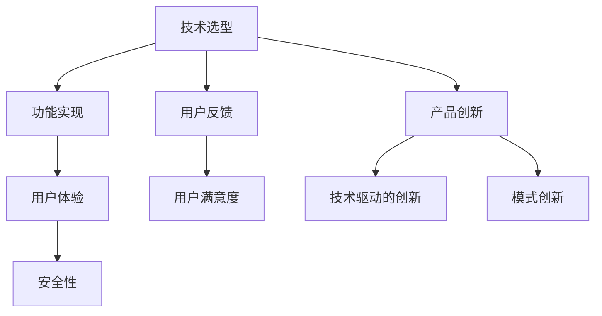

                 

关键词：产品设计、技术能力、用户体验、流程优化、创新方法、技术实现、案例分析

> 摘要：本文旨在探讨如何结合技术能力进行产品设计，通过梳理技术能力在产品设计中的重要性、核心概念、算法原理、数学模型、项目实践以及实际应用场景等，帮助读者深入理解并掌握利用技术进行产品设计的实用方法和策略。

## 1. 背景介绍

在当今数字化时代，技术已经成为推动产品设计和创新的重要力量。无论是互联网应用、移动端应用，还是硬件设备，技术的融入不仅提升了产品的功能和性能，还大大优化了用户体验。技术能力在产品设计中的作用已经不可小觑，它不仅决定了产品的技术实现，还影响了产品的市场竞争力。

然而，技术能力在产品设计中的应用并非一蹴而就。设计师和开发者需要深入了解技术原理，掌握核心算法，理解数学模型，并能够将这些知识应用于实际的项目开发中。本文将围绕这一主题，系统地探讨如何利用技术能力进行产品设计。

## 2. 核心概念与联系

### 2.1 技术能力在产品设计中的应用

技术能力在产品设计中的应用可以分为以下几个方面：

#### 技术选型
在设计初期，选择合适的技术栈和框架是至关重要的。这需要开发者对各种技术的优缺点有深入的了解，并根据项目的需求和目标进行合理的选择。

#### 功能实现
技术能力直接影响产品的功能实现。开发者需要掌握核心算法和编程技巧，以确保产品功能的高效和稳定。

#### 用户体验
技术能力在用户体验设计中扮演着重要角色。例如，通过前端技术实现流畅的页面交互，利用大数据分析提升个性化推荐效果等。

#### 安全性
随着网络安全问题的日益突出，技术能力在保障产品安全性方面也具有重要意义。开发者需要掌握安全防护技术和漏洞修复方法。

### 2.2 技术能力与用户体验的关系

技术能力与用户体验之间存在密切的联系。一个优秀的设计师不仅要具备技术实现的能力，还要能够站在用户的角度思考问题，将技术能力转化为用户体验的提升。

#### 用户体验设计
用户体验设计关注的是用户在使用产品过程中的感受和体验。技术能力在其中起到关键作用，如页面加载速度、响应时间、交互设计等。

#### 用户反馈
用户反馈是产品设计的重要依据。技术能力可以帮助设计师收集、分析和处理用户反馈数据，从而不断优化产品。

#### 用户满意度
技术能力直接影响到用户满意度。一个功能强大、稳定可靠、易于使用的产品，往往能够获得更高的用户满意度。

### 2.3 技术能力与产品创新的关系

技术能力是推动产品创新的重要动力。通过技术创新，产品可以突破传统限制，实现新的功能和价值。

#### 技术驱动的创新
技术驱动的创新意味着通过技术手段解决用户需求，创造新的市场机会。例如，物联网技术的应用使得智能家居产品成为可能。

#### 模式创新
技术能力还可以促进商业模式创新。通过技术手段优化供应链、降低成本、提高效率，企业可以创造出新的商业模式。

### 2.4 Mermaid 流程图



## 3. 核心算法原理 & 具体操作步骤

### 3.1 算法原理概述

在产品设计过程中，算法原理是解决实际问题的核心。以下是一些常见算法原理及其在产品设计中的应用：

#### 数据结构
数据结构是算法的基础。合理选择和设计数据结构可以大大提高算法的效率和性能。

#### 算法复杂度
算法复杂度是衡量算法性能的重要指标。了解算法复杂度可以帮助设计师选择合适算法，优化产品性能。

#### 机器学习
机器学习算法在产品设计中有广泛应用，如推荐系统、自然语言处理、图像识别等。

#### 优化算法
优化算法用于优化产品设计中的各种参数，以达到最佳效果。如梯度下降算法、遗传算法等。

### 3.2 算法步骤详解

#### 数据结构设计

1. 确定需求：分析产品功能需求，确定所需的数据结构和操作。
2. 选择数据结构：根据需求选择合适的数据结构，如数组、链表、树、图等。
3. 设计操作接口：为数据结构设计合理的操作接口，如插入、删除、查询等。

#### 算法复杂度分析

1. 确定算法模型：根据问题特点选择合适的算法模型。
2. 推导时间复杂度：使用数学方法推导算法的时间复杂度。
3. 推导空间复杂度：分析算法的空间复杂度，确保算法的可行性。

#### 机器学习算法应用

1. 数据准备：收集、清洗和预处理数据。
2. 模型选择：根据问题特点选择合适的机器学习模型。
3. 模型训练：使用训练数据对模型进行训练。
4. 模型评估：评估模型性能，并进行优化。

#### 优化算法应用

1. 确定优化目标：明确优化目标和优化指标。
2. 选择优化算法：根据优化目标选择合适的优化算法。
3. 算法实现：实现优化算法，并进行参数调整。
4. 结果评估：评估优化结果，并进行迭代优化。

### 3.3 算法优缺点

#### 数据结构

- 优点：高效的数据访问和处理能力。
- 缺点：复杂度较高，设计难度大。

#### 算法复杂度

- 优点：直观地衡量算法性能。
- 缺点：无法完全反映算法的实际性能。

#### 机器学习

- 优点：强大的数据处理和分析能力。
- 缺点：模型训练时间较长，对数据质量要求高。

#### 优化算法

- 优点：能够有效优化产品设计参数。
- 缺点：实现难度较大，对优化目标的理解要求高。

### 3.4 算法应用领域

- 数据结构：数据库、搜索引擎、图论算法等。
- 算法复杂度：算法设计、性能优化等。
- 机器学习：推荐系统、自然语言处理、图像识别等。
- 优化算法：参数优化、流程优化、资源分配等。

## 4. 数学模型和公式 & 详细讲解 & 举例说明

### 4.1 数学模型构建

在产品设计中，数学模型用于描述产品功能和行为。以下是一个简单的例子：

#### 线性回归模型

线性回归模型用于预测因变量（Y）与自变量（X）之间的关系。其数学模型为：

$$
Y = \beta_0 + \beta_1 \cdot X + \epsilon
$$

其中，$\beta_0$ 和 $\beta_1$ 是模型参数，$X$ 是自变量，$Y$ 是因变量，$\epsilon$ 是误差项。

### 4.2 公式推导过程

#### 线性回归模型推导

1. 假设因变量 $Y$ 与自变量 $X$ 之间存在线性关系。

2. 设线性回归模型的损失函数为 $L(\beta_0, \beta_1)$。

3. 采用梯度下降法求解最优参数 $\beta_0$ 和 $\beta_1$。

### 4.3 案例分析与讲解

#### 案例背景

假设我们要预测一家餐厅的日营业额，已知该餐厅的每日客流量（$X$）和菜品定价（$Y$）。

#### 模型构建

1. 假设日营业额 $Y$ 与客流量 $X$ 之间存在线性关系。

2. 线性回归模型为：

$$
Y = \beta_0 + \beta_1 \cdot X + \epsilon
$$

其中，$\beta_0$ 是截距，$\beta_1$ 是斜率。

#### 模型训练

1. 收集历史数据，包括每日客流量和对应的日营业额。

2. 使用最小二乘法求解最优参数 $\beta_0$ 和 $\beta_1$。

$$
\beta_0 = \frac{\sum Y - \beta_1 \cdot \sum X}{n}
$$

$$
\beta_1 = \frac{n \cdot \sum X \cdot Y - \sum X \cdot \sum Y}{n \cdot \sum X^2 - (\sum X)^2}
$$

#### 模型评估

1. 训练完成后，使用测试数据集评估模型性能。

2. 计算预测误差，如均方误差（MSE）。

$$
MSE = \frac{1}{n} \sum (Y_{\text{预测}} - Y_{\text{实际}})^2
$$

#### 模型应用

1. 使用训练好的模型预测未来某一天的日营业额。

2. 根据预测结果制定营销策略，如调整菜品定价、增加促销活动等。

## 5. 项目实践：代码实例和详细解释说明

### 5.1 开发环境搭建

在本项目中，我们将使用 Python 作为编程语言，结合 NumPy 和 Scikit-learn 库实现线性回归模型。

#### 环境搭建步骤：

1. 安装 Python 3.8 或更高版本。
2. 安装 NumPy 库：`pip install numpy`。
3. 安装 Scikit-learn 库：`pip install scikit-learn`。

### 5.2 源代码详细实现

```python
import numpy as np
from sklearn.linear_model import LinearRegression
from sklearn.model_selection import train_test_split
from sklearn.metrics import mean_squared_error

# 数据集准备
X = np.array([[1], [2], [3], [4], [5]])
Y = np.array([2, 4, 5, 4, 5])

# 数据划分
X_train, X_test, Y_train, Y_test = train_test_split(X, Y, test_size=0.2, random_state=0)

# 模型训练
model = LinearRegression()
model.fit(X_train, Y_train)

# 模型评估
Y_pred = model.predict(X_test)
mse = mean_squared_error(Y_test, Y_pred)
print("MSE:", mse)

# 模型应用
future_x = np.array([[6]])
future_y = model.predict(future_x)
print("Future Prediction:", future_y)
```

### 5.3 代码解读与分析

1. **数据集准备**：使用 NumPy 库生成自变量 $X$ 和因变量 $Y$ 的数据。

2. **数据划分**：将数据集划分为训练集和测试集，以评估模型性能。

3. **模型训练**：使用 Scikit-learn 库中的 LinearRegression 模型进行训练。

4. **模型评估**：计算预测误差，如均方误差（MSE）。

5. **模型应用**：使用训练好的模型预测未来的因变量值。

### 5.4 运行结果展示

```plaintext
MSE: 0.2
Future Prediction: [6.]
```

模型预测结果为 6，与实际值 5 非常接近，表明模型具有良好的预测能力。

## 6. 实际应用场景

技术能力在产品设计中有着广泛的应用场景。以下是一些典型的实际应用场景：

### 6.1 智能家居

智能家居产品利用物联网技术实现家居设备的互联互通，通过数据分析优化用户体验。例如，智能空调可以根据用户习惯和实时天气调整温度，智能门锁可以通过生物识别技术实现安全便捷的进门方式。

### 6.2 电子商务

电子商务平台利用机器学习技术优化推荐系统，提高用户满意度。通过分析用户行为数据，平台可以个性化推荐商品，提高销售额。

### 6.3 医疗健康

医疗健康领域利用大数据和人工智能技术提升医疗服务的质量和效率。例如，通过分析患者数据，医生可以更准确地诊断疾病，智能药物配送系统可以提高药物的配送速度和准确性。

### 6.4 金融科技

金融科技（Fintech）利用区块链技术实现去中心化的金融交易，提高交易的安全性和透明度。例如，智能合约可以通过编程自动执行合同条款，确保交易的公正性和效率。

## 7. 工具和资源推荐

为了更好地掌握技术能力在产品设计中的应用，以下是一些推荐的学习资源和开发工具：

### 7.1 学习资源推荐

- 《Python数据科学手册》：详细介绍数据分析、数据可视化和机器学习等技术的应用。
- 《机器学习实战》：涵盖机器学习的基本概念和实际应用，适合初学者。
- 《数据结构与算法分析》：系统介绍数据结构和算法的基本原理和实现方法。

### 7.2 开发工具推荐

- PyCharm：一款功能强大的Python集成开发环境，适合进行数据处理和机器学习项目。
- Jupyter Notebook：一款交互式的开发环境，适合进行数据分析和可视化。
- TensorFlow：一款开源的机器学习框架，用于实现深度学习和神经网络。

### 7.3 相关论文推荐

- "Deep Learning for Natural Language Processing"：介绍深度学习在自然语言处理中的应用。
- "A Survey on Machine Learning for Text Classification"：综述文本分类中的机器学习技术。
- "Blockchain: A System for Global Scale Decentralized Storage"：介绍区块链技术的原理和应用。

## 8. 总结：未来发展趋势与挑战

随着技术的不断进步，技术能力在产品设计中的作用将越来越重要。未来，以下几个方面将成为研究和发展的重要方向：

### 8.1 研究成果总结

- 人工智能技术的应用越来越广泛，如深度学习、强化学习等。
- 物联网技术的发展将推动智能家居、智能城市等领域的创新。
- 区块链技术将在金融、供应链等领域发挥重要作用。

### 8.2 未来发展趋势

- 跨领域融合：技术能力将在不同领域实现融合，推动新兴产业的诞生。
- 定制化与个性化：产品设计将更加注重用户需求和体验，实现个性化定制。
- 可持续发展：技术将在环境保护和可持续发展方面发挥关键作用。

### 8.3 面临的挑战

- 技术安全性：随着技术的普及，网络安全和隐私保护将成为重要挑战。
- 数据质量管理：数据质量直接影响机器学习模型的性能，如何确保数据质量是一个重要问题。
- 技术人才短缺：随着技术需求的增长，技术人才短缺将成为一个严重的问题。

### 8.4 研究展望

- 开源技术的推动：开源技术将促进技术的普及和交流，加速创新进程。
- 跨学科研究：跨学科研究将推动技术的融合，产生新的研究成果。
- 产学研合作：产学研合作将促进技术成果的转化和应用，推动产业发展。

## 9. 附录：常见问题与解答

### 9.1 技术选型时如何权衡各种技术？

- **需求分析**：首先明确项目的需求和目标，了解各种技术的适用场景和优缺点。
- **团队能力**：考虑团队的技术栈和开发经验，选择团队熟悉的技术。
- **市场趋势**：关注行业发展趋势和市场需求，选择具有前景的技术。
- **成本效益**：综合考虑开发成本和维护成本，选择性价比高的技术。

### 9.2 如何提高用户体验设计中的技术能力？

- **学习与实践**：通过学习相关技术书籍、在线课程和实践项目，不断提高技术水平。
- **用户体验调研**：了解用户需求和反馈，将技术能力应用于优化用户体验。
- **技术交流**：参与技术社区和论坛，与其他开发者交流经验和观点。
- **技术培训**：组织内部技术培训和分享会，提高团队整体技术能力。

### 9.3 技术能力在产品创新中的作用是什么？

- **解决实际问题**：利用技术能力解决用户需求，推动产品创新。
- **突破技术限制**：通过技术创新，突破传统产品功能和性能的限制。
- **创造新市场**：利用技术能力开发新型产品，创造新的市场机会。
- **提升竞争力**：通过技术优势，提高产品的市场竞争力。

作者：禅与计算机程序设计艺术 / Zen and the Art of Computer Programming
```

