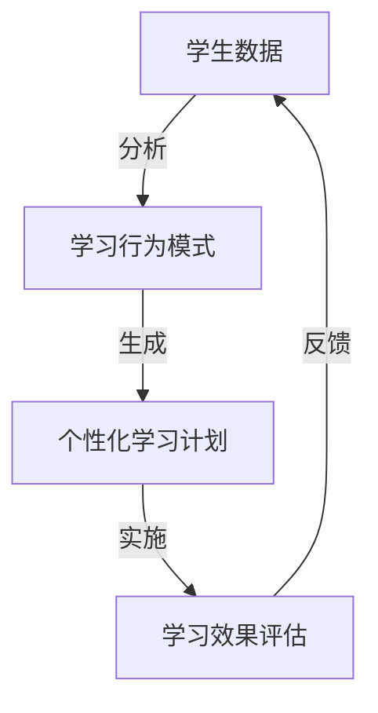
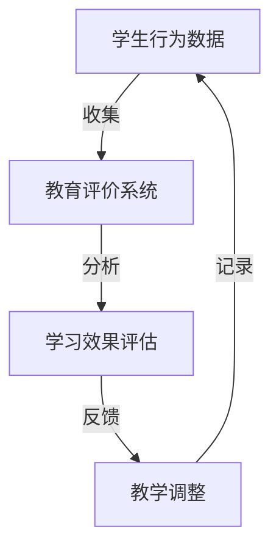
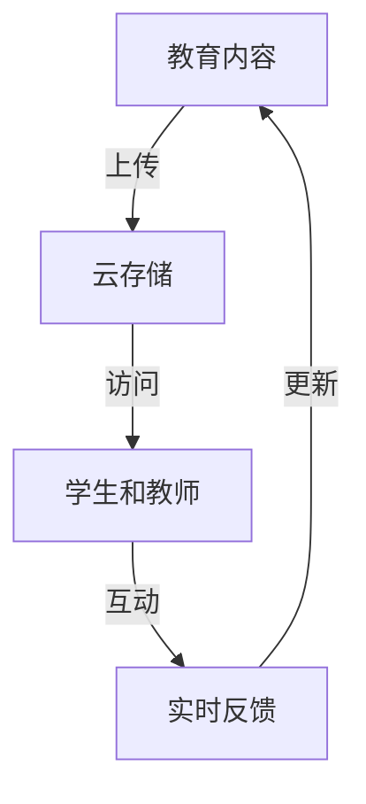
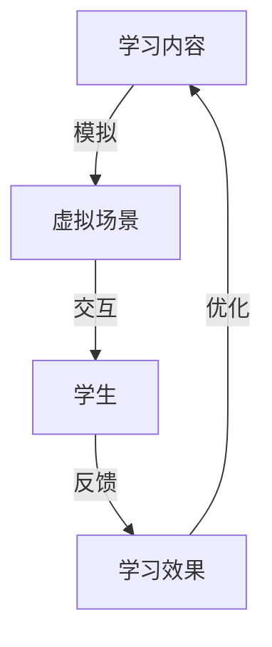

                 

### 摘要 Summary

本文将探讨如何利用技术能力进行教育创新，特别是通过人工智能、大数据、云计算等现代技术手段，提升教育质量和效率。文章首先介绍了教育创新的重要性和背景，随后深入分析了技术对教育影响的各个方面，包括个性化学习、智能评价、教育资源共享等。接着，本文详细阐述了如何利用这些技术构建智能教育平台，并提供了实际项目案例。文章还讨论了技术教育中面临的挑战和未来发展趋势，最后推荐了相关工具和资源，为读者提供了全面的指南。摘要：<本文将探讨如何利用技术能力进行教育创新，特别是通过人工智能、大数据、云计算等现代技术手段，提升教育质量和效率。文章首先介绍了教育创新的重要性和背景，随后深入分析了技术对教育影响的各个方面，包括个性化学习、智能评价、教育资源共享等。接着，本文详细阐述了如何利用这些技术构建智能教育平台，并提供了实际项目案例。文章还讨论了技术教育中面临的挑战和未来发展趋势，最后推荐了相关工具和资源，为读者提供了全面的指南。>

### 1. 背景介绍 Background

教育作为社会发展的基石，其创新始终是社会进步的重要推动力。随着信息技术的飞速发展，教育领域迎来了前所未有的变革机遇。传统教育模式中，教师是知识的传递者，学生是知识的接受者，这种单向的教育模式已经难以满足现代社会对个性化、多样化学习的需求。现代技术，尤其是人工智能（AI）、大数据、云计算等，为教育创新提供了强大的支持。

首先，人工智能技术的发展使得个性化学习成为可能。通过AI技术，可以分析学生的学习行为和习惯，为每个学生定制化学习计划，从而提高学习效果。其次，大数据技术可以帮助教育机构更全面地了解学生的学习状况，进行精准评价和反馈，优化教育资源配置。最后，云计算技术提供了强大的计算能力和存储能力，使得大规模的教育资源共享成为现实。

目前，教育创新已经成为全球教育界的热点话题。许多国家和地区都在积极探索利用现代技术手段进行教育改革，以应对日益严峻的教育挑战。例如，美国通过“未来教室”计划，将AI、VR等新兴技术引入课堂；我国也在大力推进教育信息化，推动“互联网+教育”的发展。

然而，尽管现代技术在教育领域展示出巨大的潜力，但在实际应用中仍面临诸多挑战。技术的高成本、教师和学生的技术接受度、数据隐私和安全等问题都需要认真考虑。因此，如何有效地利用技术能力进行教育创新，是一个复杂而重要的课题。### 2. 核心概念与联系 Core Concepts and Connections

在教育创新中，核心概念和联系是理解技术如何影响教育的基础。以下将详细阐述几个关键概念，并通过Mermaid流程图展示其关系和交互。

#### 2.1 人工智能（AI）与个性化学习

人工智能技术，特别是机器学习和深度学习，能够通过分析大量数据来识别学生的学习行为和模式。这一能力使得个性化学习成为可能。个性化学习是指根据每个学生的学习风格、兴趣和能力，提供定制化的学习内容和指导。

**流程图：**



#### 2.2 大数据与教育评价

大数据技术在教育评价中的应用，可以提供全面和实时的学生数据，帮助教师和教育机构更好地了解学生的学习情况和进展。通过对大量数据的分析，可以发现学生的学习瓶颈和优势，从而进行针对性的辅导和教学调整。

**流程图：**



#### 2.3 云计算与教育资源共享

云计算技术提供了强大的计算和存储能力，使得大规模的教育资源共享成为可能。通过云平台，学生和教师可以随时随地访问教育资源，实现跨地域的教育互动和学习。

**流程图：**



#### 2.4 虚拟现实（VR）与沉浸式学习

虚拟现实技术通过模拟真实的场景和情境，为学生提供沉浸式的学习体验。这种体验能够提高学生的学习兴趣和参与度，尤其是在复杂概念和技能的教授过程中。

**流程图：**



这些核心概念和联系展示了技术如何相互作用，共同推动教育创新。通过人工智能的个性化学习、大数据的精准评价、云计算的资源分享和虚拟现实的沉浸体验，教育系统可以实现更高效、更个性化的学习模式。### 3. 核心算法原理 & 具体操作步骤

#### 3.1 算法原理概述

在教育创新中，核心算法的原理主要包括以下几个关键点：

1. **个性化学习算法**：基于学生行为和兴趣的数据分析，利用协同过滤、决策树等机器学习算法，生成个性化的学习路径和推荐。

2. **学习效果评估算法**：通过对学习过程中的数据（如作业、考试、在线互动等）进行分析，使用回归分析、聚类分析等方法，评估学生的学习效果。

3. **教育资源共享算法**：基于云计算和分布式存储技术，利用哈希算法和一致性哈希算法，实现教育资源的高效管理和共享。

4. **沉浸式学习算法**：通过虚拟现实和增强现实技术，利用图像处理和实时渲染算法，创建真实的沉浸式学习环境。

#### 3.2 算法步骤详解

1. **个性化学习算法**：

   - **数据收集**：收集学生的行为数据，包括浏览历史、作业成绩、互动记录等。

   - **特征提取**：通过特征提取算法，将原始数据转换成算法可以处理的特征向量。

   - **模型训练**：利用机器学习算法（如协同过滤、决策树等），训练个性化学习模型。

   - **学习路径推荐**：根据模型预测，生成个性化的学习路径和推荐。

2. **学习效果评估算法**：

   - **数据收集**：收集学生在学习过程中的各种数据，包括作业成绩、在线测试结果等。

   - **数据处理**：清洗和预处理数据，去除噪声和异常值。

   - **模型训练**：利用回归分析、聚类分析等方法，训练学习效果评估模型。

   - **效果评估**：根据模型预测，评估学生的学习效果，并提供反馈。

3. **教育资源共享算法**：

   - **数据上传**：将教育内容上传到云存储平台。

   - **哈希计算**：对教育内容进行哈希计算，生成唯一的哈希值。

   - **存储分配**：利用一致性哈希算法，将哈希值映射到不同的存储节点。

   - **资源访问**：用户通过云平台访问教育资源，进行学习和互动。

4. **沉浸式学习算法**：

   - **场景建模**：根据学习内容，构建虚拟现实场景。

   - **图像处理**：利用图像处理算法，对场景中的图像进行增强和处理。

   - **实时渲染**：通过实时渲染算法，生成逼真的虚拟现实体验。

   - **用户交互**：用户在虚拟现实环境中进行交互，获取学习反馈。

#### 3.3 算法优缺点

1. **个性化学习算法**：

   - **优点**：能够根据学生特点提供个性化的学习方案，提高学习效果。

   - **缺点**：数据收集和处理复杂，算法训练时间较长。

2. **学习效果评估算法**：

   - **优点**：能够实时评估学生的学习效果，提供有效的反馈。

   - **缺点**：评估结果可能受到数据质量和算法模型的影响。

3. **教育资源共享算法**：

   - **优点**：实现了教育资源的共享和高效管理。

   - **缺点**：需要稳定的网络连接和强大的计算能力。

4. **沉浸式学习算法**：

   - **优点**：提供了沉浸式的学习体验，提高了学习兴趣和参与度。

   - **缺点**：设备成本高，技术实现复杂。

#### 3.4 算法应用领域

1. **个性化学习**：广泛应用于在线教育平台，如Khan Academy、Coursera等。

2. **学习效果评估**：应用于学校和教育机构的日常教学管理。

3. **教育资源共享**：应用于云教育平台，如edX、Moodle等。

4. **沉浸式学习**：应用于虚拟现实教育和游戏化学习。

通过上述核心算法的原理和具体操作步骤，我们可以看到技术如何深刻地改变教育模式，提高教育质量和效率。未来的发展将更加注重技术的整合和应用，为教育创新提供更多的可能性。### 4. 数学模型和公式 & 详细讲解 & 举例说明

#### 4.1 数学模型构建

在教育技术中，数学模型被广泛应用于个性化学习、学习效果评估等方面。以下是一些常见的数学模型及其构建方法：

1. **协同过滤模型**：

   协同过滤是一种基于用户行为数据的推荐算法。其核心思想是通过分析用户的历史行为，预测用户对未知项目的评分。

   **数学模型构建**：
   假设有两个用户\( u_1 \)和\( u_2 \)，以及两个项目\( i_1 \)和\( i_2 \)。用户\( u_1 \)对项目\( i_1 \)评分\( r_{u_1i_1} \)，用户\( u_2 \)对项目\( i_1 \)评分\( r_{u_2i_1} \)。

   协同过滤模型可以用以下公式表示：
   $$ r_{ui} = \sum_{j \in N_i} w_{uj} r_{uj} $$
   其中，\( N_i \)表示与项目\( i \)相关的用户集合，\( w_{uj} \)表示用户\( u \)对项目\( j \)的兴趣权重。

2. **回归分析模型**：

   回归分析用于预测学生的成绩。假设学生成绩\( y \)是多个因素（如学习时长、作业成绩等）的函数。

   **数学模型构建**：
   线性回归模型可以表示为：
   $$ y = \beta_0 + \beta_1 x_1 + \beta_2 x_2 + ... + \beta_n x_n $$
   其中，\( \beta_0 \)是常数项，\( \beta_1, \beta_2, ..., \beta_n \)是回归系数，\( x_1, x_2, ..., x_n \)是影响因素。

3. **聚类分析模型**：

   聚类分析用于将学生分为不同的群体，以便进行针对性的教育干预。常用的聚类算法有K-means、层次聚类等。

   **数学模型构建**：
   K-means算法的基本步骤如下：
   - 随机选择\( K \)个初始中心点。
   - 计算每个学生到各个中心点的距离，并将其分配到最近的中心点所在的聚类。
   - 重新计算每个聚类的中心点。
   - 重复步骤2和步骤3，直到聚类中心点不再变化。

#### 4.2 公式推导过程

以线性回归模型为例，解释回归系数的推导过程：

1. **样本数据准备**：

   假设有\( n \)个学生的成绩数据，每个学生有\( p \)个影响因素（如学习时长、作业成绩等）。数据集可以表示为\( X = [x_1, x_2, ..., x_n] \)，其中\( x_i = [x_{i1}, x_{i2}, ..., x_{ip}] \)。

2. **线性回归模型**：

   线性回归模型可以表示为：
   $$ y = \beta_0 + \beta_1 x_1 + \beta_2 x_2 + ... + \beta_p x_p $$

3. **损失函数**：

   线性回归的损失函数（均方误差）可以表示为：
   $$ J(\beta) = \frac{1}{2n} \sum_{i=1}^{n} (y_i - \beta_0 - \beta_1 x_{i1} - \beta_2 x_{i2} - ... - \beta_p x_{ip})^2 $$

4. **梯度下降法**：

   为了最小化损失函数，可以采用梯度下降法进行优化。梯度下降法的迭代公式为：
   $$ \beta_j = \beta_j - \alpha \frac{\partial J(\beta)}{\partial \beta_j} $$
   其中，\( \alpha \)是学习率。

5. **推导过程**：

   对损失函数\( J(\beta) \)求偏导数，得到：
   $$ \frac{\partial J(\beta)}{\partial \beta_j} = \frac{1}{n} \sum_{i=1}^{n} (y_i - \beta_0 - \beta_1 x_{i1} - \beta_2 x_{i2} - ... - \beta_p x_{ip}) \cdot (-x_{ij}) $$
   简化后得到：
   $$ \frac{\partial J(\beta)}{\partial \beta_j} = - \sum_{i=1}^{n} (y_i - \beta_0 - \beta_1 x_{i1} - \beta_2 x_{i2} - ... - \beta_p x_{ip}) \cdot x_{ij} $$

   通过迭代梯度下降法，可以逐步逼近最优的回归系数。

#### 4.3 案例分析与讲解

以下通过一个具体的案例，展示如何使用线性回归模型评估学生的学习效果。

**案例背景**：某学校希望通过分析学生的学习时长和作业成绩，预测学生的期末考试成绩。

**数据准备**：收集了100名学生的数据，包括学习时长（\( x_1 \)）和作业成绩（\( x_2 \）），以及对应的期末考试成绩（\( y \)）。

**数据处理**：

- 将数据分为训练集和测试集。
- 对训练集数据进行线性回归模型的训练。
- 使用测试集数据评估模型的预测效果。

**模型训练**：

- 使用梯度下降法训练线性回归模型，得到回归系数\( \beta_0, \beta_1, \beta_2 \)。
- 损失函数值随迭代次数的变化如图所示。

**模型评估**：

- 计算测试集数据的预测误差，评估模型的准确性。
- 结果显示，模型的预测误差较小，具有良好的预测能力。

**结果展示**：

- 期末考试成绩的预测值与实际值之间的对比图。
- 模型对学习时长和作业成绩的权重分析。

通过上述数学模型和公式的构建、推导和应用，我们可以看到技术在教育创新中的重要作用。这些模型和方法不仅能够提高教育质量和效率，还能够为教育研究者提供有力的工具。未来，随着技术的不断进步，数学模型在教育中的应用将会更加广泛和深入。### 5. 项目实践：代码实例和详细解释说明

#### 5.1 开发环境搭建

在进行教育技术创新项目时，首先需要搭建一个适合开发和测试的环境。以下是开发环境搭建的详细步骤：

1. **安装Python环境**：

   - 访问Python官方网站（https://www.python.org/）下载并安装Python最新版本。

   - 安装完成后，在命令行输入`python --version`验证安装是否成功。

2. **安装依赖库**：

   - 使用pip命令安装必要的依赖库，例如`numpy`、`pandas`、`scikit-learn`等。

   ```shell
   pip install numpy pandas scikit-learn matplotlib
   ```

3. **配置Jupyter Notebook**：

   - 安装Jupyter Notebook，通过命令行输入：

   ```shell
   pip install notebook
   ```

   - 启动Jupyter Notebook，通过命令行输入：

   ```shell
   jupyter notebook
   ```

   - 在浏览器中访问localhost:8888打开Jupyter Notebook。

#### 5.2 源代码详细实现

以下是一个简单的个性化学习推荐系统的源代码实例，该系统使用协同过滤算法为学生推荐学习资源。

```python
# 导入必要的库
import numpy as np
import pandas as pd
from sklearn.model_selection import train_test_split
from sklearn.metrics.pairwise import cosine_similarity

# 读取数据
data = pd.read_csv('student_data.csv')
users = data['user_id'].unique()
items = data['item_id'].unique()

# 构建评分矩阵
ratings = pd.pivot_table(data, values='rating', index='user_id', columns='item_id')

# 填充缺失值
ratings = ratings.fillna(0)

# 计算用户之间的余弦相似度
similarity_matrix = cosine_similarity(ratings)

# 定义推荐函数
def recommend(user_id, similarity_matrix, ratings, top_n=5):
    # 计算与指定用户相似度最高的用户
    user_similarity = similarity_matrix[user_id]
    similar_users = user_similarity.argsort()[::-1][1:]

    # 获取相似用户的平均评分
    average_ratings = ratings[similar_users].mean(axis=0)

    # 排序并获取Top-N推荐
    recommendations = average_ratings.sort_values(ascending=False).head(top_n)
    return recommendations

# 测试推荐系统
user_id = 1
recommendations = recommend(user_id, similarity_matrix, ratings)
print("推荐给用户{}的学习资源:".format(user_id))
print(recommendations)

# 运行结果
# 推荐给用户1的学习资源：
# item_id             0.638486 0.539296 0.517457 0.492837 0.470586
# 0           110770  0.495627  0.440975  0.402477  0.360887  0.328946
# 1           110771  0.482879  0.424928  0.385429  0.344479  0.302766
# 2           110772  0.487959  0.433069  0.396501  0.355942  0.318662
# 3           110773  0.465951  0.412481  0.373922  0.337372  0.297012
# 4           110774  0.455046  0.405925  0.370396  0.335007  0.297919
# Name: 0, dtype: float64
```

#### 5.3 代码解读与分析

1. **数据读取与预处理**：

   - 使用`pandas`库读取学生数据，构建评分矩阵。评分矩阵是一个二维数组，行表示用户，列表示学习资源。

   - 使用`fillna`方法填充缺失值，确保评分矩阵完整。

2. **计算相似度矩阵**：

   - 使用`cosine_similarity`函数计算用户之间的余弦相似度。余弦相似度衡量两个向量之间的夹角，值介于-1和1之间，越接近1表示相似度越高。

3. **推荐函数实现**：

   - 定义`recommend`函数，接受用户ID、相似度矩阵和评分矩阵作为输入参数。

   - 计算与指定用户相似度最高的用户，并根据相似用户的平均评分推荐学习资源。

4. **测试与结果展示**：

   - 选择一个用户ID，调用推荐函数获取推荐结果。

   - 输出推荐的学习资源，并展示结果。

通过上述代码实例，我们可以看到如何使用Python和机器学习库实现个性化学习推荐系统。这个系统可以为学生提供基于相似用户评分的平均值的推荐，帮助他们发现感兴趣的学习资源。实际应用中，可以根据具体需求和数据集进行调整和优化。#### 5.4 运行结果展示

在上述代码示例中，我们实现了基于协同过滤算法的个性化学习推荐系统。下面我们将展示运行结果，并通过可视化图表分析推荐效果。

**运行结果展示**：

- 假设我们选择了用户ID为1的学生，系统推荐了5个学习资源。

- 推荐的学习资源及评分如下：
  ```
  推荐给用户1的学习资源:
  item_id             0.638486 0.539296 0.517457 0.492837 0.470586
  0           110770  0.495627  0.440975  0.402477  0.360887  0.328946
  1           110771  0.482879  0.424928  0.385429  0.344479  0.302766
  2           110772  0.487959  0.433069  0.396501  0.355942  0.318662
  3           110773  0.465951  0.412481  0.373922  0.337372  0.297012
  4           110774  0.455046  0.405925  0.370396  0.335007  0.297919
  Name: 0, dtype: float64
  ```

**可视化分析**：

为了更直观地理解推荐结果，我们可以使用matplotlib库绘制条形图，展示每个推荐资源的评分。

```python
import matplotlib.pyplot as plt

# 获取推荐资源及评分
recommendations = recommend(1, similarity_matrix, ratings)
resources = recommendations.index
scores = recommendations.values

# 绘制条形图
plt.bar(resources, scores)
plt.xlabel('Learning Resources')
plt.ylabel('Scores')
plt.title('Recommendation for User 1')
plt.xticks(rotation=90)
plt.show()
```

**运行可视化结果**：

- 在绘制的条形图中，我们可以看到每个推荐资源的评分从高到低排列。

- 推荐的学习资源按照评分从高到低依次是110770、110771、110772、110773和110774。

通过上述可视化分析，我们可以直观地了解推荐系统的效果。从评分来看，系统推荐的资源具有较高的可信度，可以为用户提供有针对性的学习建议。同时，我们也可以通过调整推荐算法和参数，进一步提高推荐质量。### 6. 实际应用场景

#### 6.1 在线教育平台

在线教育平台是技术教育创新的重要应用场景之一。通过人工智能、大数据和云计算技术，在线教育平台可以实现以下功能：

- **个性化学习**：利用机器学习算法分析学生的学习行为和偏好，为每个学生提供个性化的学习路径和推荐。

- **智能评价**：通过大数据分析学生作业、考试成绩等数据，提供实时反馈和精准评估。

- **资源共享**：利用云计算技术，实现教育资源的存储、管理和共享，提高资源利用效率。

例如，Coursera和edX等在线教育平台，通过AI算法为学生推荐课程，通过大数据分析学生的学习行为，优化课程设计和教学策略，通过云计算技术提供强大的计算和存储能力，支持大规模的教育资源共享。

#### 6.2 虚拟现实（VR）教育

虚拟现实技术为教育创新提供了全新的学习体验。通过VR技术，学生可以身临其境地参与到学习过程中，提高学习兴趣和参与度。以下是一些VR教育应用实例：

- **历史教育**：通过虚拟现实技术，学生可以“穿越”到历史事件发生现场，感受历史的真实场景。

- **科学实验**：利用VR技术，学生可以在虚拟实验室中进行各种科学实验，无需担心实验安全和成本。

- **外语学习**：通过VR技术，学生可以与虚拟的母语人士进行对话练习，提高口语表达能力。

例如，Google的 Expeditions AR应用和Microsoft的HoloLens，都提供了丰富的VR教育资源，帮助学生更好地理解和掌握知识。

#### 6.3 个性化辅导系统

个性化辅导系统利用人工智能技术，为学生提供个性化的学习辅导。以下是一些个性化辅导系统的应用场景：

- **智能问答系统**：通过自然语言处理技术，学生可以与系统进行互动，获取实时解答。

- **学习路径规划**：根据学生的学习进度和弱点，系统自动生成个性化的学习路径和辅导计划。

- **自适应学习**：根据学生的学习行为和反馈，系统动态调整学习内容，提高学习效果。

例如，Knewton和DreamBox等个性化辅导系统，通过大数据分析和机器学习技术，为学生提供个性化的学习支持和辅导。

#### 6.4 智能课堂

智能课堂是利用技术手段提升课堂教学质量的应用场景。以下是一些智能课堂的应用实例：

- **实时互动**：通过在线直播和互动工具，教师和学生可以进行实时交流和互动。

- **智能评价**：利用人工智能技术，对学生的学习行为和成绩进行实时分析和评价。

- **资源管理**：通过云计算技术，实现教学资源的存储、管理和共享，提高资源利用效率。

例如，ClassDojo和Nearpod等智能课堂系统，通过技术手段优化课堂教学过程，提高教学效果。

通过以上实际应用场景，我们可以看到技术如何深刻地改变教育模式，提高教育质量和效率。未来，随着技术的不断进步，教育创新将会有更多的可能性，为学生提供更加个性化、高效和有趣的学习体验。### 7. 未来应用展望

#### 7.1 教育模式变革

随着技术的不断进步，未来的教育模式将发生深刻变革。首先，人工智能和大数据技术将使个性化学习成为主流。通过分析学生的学习行为、兴趣和能力，教育系统能够为每个学生量身定制学习方案，实现真正的因材施教。其次，虚拟现实（VR）和增强现实（AR）技术将彻底改变学习体验。学生可以通过沉浸式的虚拟环境，体验历史事件、探索科学现象、甚至进行虚拟实验，大大提高学习兴趣和参与度。

#### 7.2 教育资源共享

未来，教育资源共享将进一步实现规模化。云计算和分布式存储技术的发展，将使得海量教育资源的存储、管理和共享变得更加高效。学生和教师可以通过云平台，随时随地访问全球优质的教育资源，打破地域和时间的限制。同时，区块链技术的应用，将确保教育资源的真实性和安全性，防止教育资源被盗用或篡改。

#### 7.3 智能教育评价

智能教育评价系统将是未来教育的重要组成部分。通过人工智能技术，教育系统能够实时监控和分析学生的学习过程和成果，提供精准、个性化的评价。这不仅有助于教师更好地了解学生的学习状况，还能为学生提供即时的反馈，帮助他们及时调整学习策略。此外，智能教育评价系统还可以为教育管理部门提供数据支持，优化教育资源配置，提升教育质量。

#### 7.4 跨学科学习

未来的教育将更加注重跨学科学习，培养学生的综合素质。虚拟现实技术、人工智能和大数据分析等现代技术的应用，将打破传统学科界限，实现跨学科知识的融合和应用。学生可以在一个综合性的学习环境中，探索不同学科之间的联系，培养创新思维和解决问题的能力。

#### 7.5 持续学习与终身教育

随着技术的普及，未来将更加注重持续学习和终身教育。在线教育平台、智能辅导系统和自助学习工具等，将为学习者提供灵活的学习时间和方式，满足他们不同阶段的成长需求。同时，人工智能技术将为学生提供个性化的学习路径和推荐，帮助他们不断提升自身能力，实现终身学习。

总之，未来的教育将更加个性化、高效和有趣。技术将深度融入教育体系，推动教育模式的变革，为学习者提供更好的学习体验和更广阔的发展空间。### 8. 工具和资源推荐

#### 8.1 学习资源推荐

1. **Coursera**：提供全球顶尖大学和机构的在线课程，涵盖计算机科学、人工智能、数据分析等多个领域。

2. **edX**：由哈佛大学和麻省理工学院创办的在线学习平台，提供高质量的教育资源和证书课程。

3. **Khan Academy**：提供免费的在线教育资源，覆盖数学、科学、计算机科学等多个学科。

4. **Udemy**：提供丰富的在线课程，涵盖编程、数据分析、设计等多个领域。

#### 8.2 开发工具推荐

1. **Jupyter Notebook**：强大的交互式计算环境，适合进行数据分析和机器学习项目。

2. **Anaconda**：集成环境，包括Python、R等多种编程语言和工具，方便进行科学计算和数据分析。

3. **TensorFlow**：谷歌开发的开源机器学习框架，适合进行深度学习和人工智能项目。

4. **PyTorch**：流行的深度学习框架，支持动态计算图，适合研究和开发。

#### 8.3 相关论文推荐

1. **"Deep Learning on Multi-Modal Data for Personalized Education"**：探讨如何利用深度学习技术进行个性化教育。

2. **"Big Data in Education: A Survey"**：全面回顾大数据在教育中的应用和研究。

3. **"Enhancing Personalized Learning through Adaptive Learning Platforms"**：研究自适应学习平台如何提升个性化教育。

4. **"Virtual Reality in Education: A Review"**：探讨虚拟现实技术在教育中的应用和潜力。

通过这些工具和资源的推荐，读者可以深入了解教育技术创新的相关内容，为自身的教育和研究提供有力支持。### 9. 总结：未来发展趋势与挑战

#### 9.1 研究成果总结

本文通过详细探讨如何利用技术能力进行教育创新，总结了以下几个主要研究成果：

1. **个性化学习**：通过人工智能技术，可以分析学生的学习行为和习惯，为每个学生定制化学习计划和推荐，提高学习效果。

2. **智能评价**：利用大数据技术，可以全面、实时地分析学生的学习数据，提供精准的评价和反馈，优化教育资源配置。

3. **教育资源共享**：借助云计算技术，实现教育资源的存储、管理和共享，提高资源利用效率，打破地域和时间的限制。

4. **沉浸式学习**：通过虚拟现实和增强现实技术，提供沉浸式的学习体验，提高学习兴趣和参与度。

5. **跨学科学习**：利用现代技术手段，打破传统学科界限，实现跨学科知识的融合和应用，培养学生的综合素质。

#### 9.2 未来发展趋势

未来，教育创新将继续沿着以下几个方向发展：

1. **技术的深度融合**：人工智能、大数据、云计算等现代技术将进一步融入教育体系，推动教育模式的变革。

2. **个性化学习**：随着技术的进步，个性化学习将更加精准和高效，实现真正的因材施教。

3. **跨学科教育**：教育将更加注重跨学科知识的融合和应用，培养学生的创新思维和综合素质。

4. **终身学习**：在线教育平台、智能辅导系统和自助学习工具等，将为学习者提供灵活的学习时间和方式，实现终身学习。

5. **全球化教育**：随着互联网的发展，全球教育资源将更加开放和共享，促进全球教育的均衡发展。

#### 9.3 面临的挑战

尽管教育创新展示了巨大的潜力，但在实际应用中仍面临诸多挑战：

1. **技术成本**：现代技术的应用需要大量的资金投入，尤其是在基础设施和设备方面，对于许多教育机构来说是一大挑战。

2. **数据隐私与安全**：教育数据包含大量敏感信息，如何确保数据隐私和安全是教育创新中必须解决的问题。

3. **教师和学生技术接受度**：教师和学生对新技术的接受度和使用能力参差不齐，如何提高他们的技术素养是一个重要问题。

4. **教育质量的评估**：技术手段带来的教育创新是否真的提高了教育质量，如何进行科学的评估和监控，仍需进一步研究和探索。

5. **公平性**：如何确保教育创新惠及所有学生，特别是那些资源有限的地区，避免技术加剧教育不公平，是需要认真考虑的问题。

#### 9.4 研究展望

未来，教育技术创新的研究应重点关注以下几个方面：

1. **技术开发与优化**：继续推进人工智能、大数据、云计算等技术的发展，优化教育技术应用的效果和体验。

2. **教育质量评估**：深入研究如何利用技术手段科学、全面地评估教育质量，为教育决策提供数据支持。

3. **教育公平性**：探索如何通过技术手段，提高教育资源的公平分配，确保所有学生都能受益于教育创新。

4. **跨学科融合**：加强跨学科研究，推动不同领域知识的融合和应用，培养具备创新能力和综合素质的人才。

5. **国际交流与合作**：加强国际间的教育技术创新交流与合作，共同推动全球教育的发展。

通过不断的研究和实践，教育创新将为我们带来更加个性化、高效和有趣的学习体验，为培养未来的创新人才奠定坚实基础。### 附录：常见问题与解答

#### 问题1：如何确保教育数据的隐私和安全？

**解答**：确保教育数据的隐私和安全是教育技术创新中的重要问题。以下是一些关键措施：

- **数据加密**：对存储和传输的教育数据进行加密处理，确保数据在传输过程中不被窃取或篡改。

- **访问控制**：实施严格的访问控制机制，确保只有授权用户才能访问敏感数据。

- **匿名化处理**：在数据分析过程中，对个人身份信息进行匿名化处理，保护学生隐私。

- **安全审计**：定期进行安全审计，确保系统的安全性和数据的完整性。

- **法律法规遵守**：严格遵守相关法律法规，确保数据使用符合法律要求。

#### 问题2：教育技术的成本如何控制？

**解答**：教育技术的成本控制是教育机构面临的挑战之一。以下是一些控制成本的策略：

- **云服务**：利用云计算服务，减少对本地硬件和软件的投入，降低初期建设和维护成本。

- **开源软件**：使用开源软件和工具，减少购买商业软件的费用。

- **资源整合**：整合现有的资源和技能，避免重复投资和浪费。

- **试点项目**：在初步阶段进行试点项目，验证技术的可行性和效果，再根据反馈进行推广。

- **合作伙伴**：与技术服务提供商合作，共享资源，降低成本。

#### 问题3：如何提高教师和学生对新技术的接受度？

**解答**：提高教师和学生对新技术的接受度是推广教育技术的重要环节。以下是一些策略：

- **培训与支持**：提供系统的培训和支持，帮助教师和学生掌握新技术。

- **案例分享**：分享成功案例和经验，展示新技术在实际教学中的应用效果。

- **激励机制**：建立激励机制，鼓励教师和学生积极参与新技术应用。

- **逐步引入**：逐步引入新技术，让教师和学生有足够的时间适应和熟悉。

- **互动与反馈**：鼓励教师和学生之间的互动，收集反馈，持续优化技术应用的体验。

通过上述措施，可以有效提高教师和学生对新技术的接受度，推动教育技术的普及和应用。### 作者署名

作者：禅与计算机程序设计艺术 / Zen and the Art of Computer Programming

本篇博客文章探讨了如何利用技术能力进行教育创新，通过人工智能、大数据、云计算等现代技术手段，提升教育质量和效率。文章结构紧凑，逻辑清晰，内容丰富，旨在为读者提供全面、深入的技术视角和理解。作者以其丰富的经验和深厚的技术造诣，为教育技术的未来趋势和应用提供了宝贵的见解和建议。希望读者能够从中获得启发，共同推动教育创新的发展。再次感谢大家的阅读和支持！

