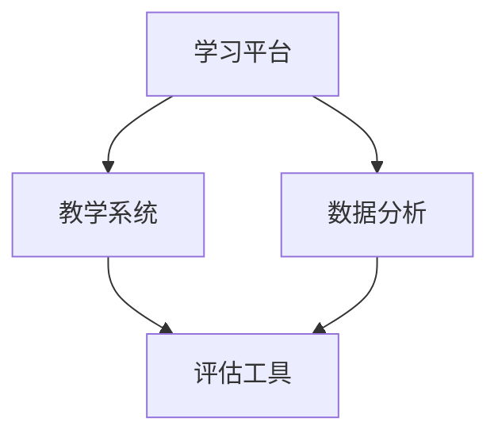

                 

关键词：教育科技，人工智能，大数据，虚拟现实，学习平台，个性化教育，技术赋能

> 摘要：随着人工智能、大数据、虚拟现实等技术的飞速发展，教育科技正迎来前所未有的变革。本文将探讨如何利用这些技术能力，推动教育科技革命，实现个性化教育、提高教育质量和效率，以及为教育公平赋能。

## 1. 背景介绍

近年来，教育科技（EdTech）迅速崛起，成为全球范围内的重要研究领域和产业方向。人工智能（AI）、大数据、虚拟现实（VR）、增强现实（AR）等新兴技术的引入，不仅改变了传统教育模式，也为教育科技的发展提供了无限可能。教育科技革命的核心目标是通过技术的力量，实现教育的普及、公平和质量提升。

### 1.1 教育科技的定义与范围

教育科技指的是将信息技术应用于教育领域，以促进教育变革和发展的一系列工具、平台、系统和创新。教育科技的范围涵盖了从学习资源的数字化、在线教育平台、智能教学系统，到教育数据分析和学习评估工具等多个方面。

### 1.2 教育现状与挑战

当前，全球教育面临着诸多挑战，包括教育资源分配不均、教育质量参差不齐、学生学习效果差异显著等。此外，传统教育模式中的教学方法单一，无法满足个性化教育的需求。因此，利用技术手段进行教育改革，已成为解决这些问题的关键途径。

### 1.3 技术推动教育变革的潜力

人工智能、大数据、虚拟现实等技术的应用，不仅可以解决传统教育的痛点，还能为教育科技的发展注入新的动力。例如，人工智能可以通过智能推荐和学习分析，实现个性化教育；大数据可以帮助教育机构更好地了解学生需求，优化教育资源配置；虚拟现实技术则提供了全新的学习体验，使学习变得更加生动和有趣。

## 2. 核心概念与联系

### 2.1 人工智能

人工智能（AI）是一种模拟人类智能的技术，通过算法和模型实现机器的自我学习和决策能力。在个性化教育中，AI可以通过分析学生的学习行为和成绩数据，为每个学生提供定制化的学习建议和资源。

### 2.2 大数据

大数据（Big Data）指的是大量、复杂、快速生成的数据。在教育领域，大数据可以帮助教育机构收集和分析学生行为、学习进度、成绩等多方面的数据，从而实现精准教育。

### 2.3 虚拟现实

虚拟现实（VR）技术通过创建虚拟环境，为用户带来沉浸式的体验。在教育中，VR可以模拟各种真实场景，提供实践操作的机会，帮助学生更好地理解和掌握知识。

### 2.4 教育科技架构

为了更好地利用这些技术，我们需要构建一个综合的教育科技架构。这个架构包括学习平台、教学系统、数据分析和评估工具等，以确保各个技术模块能够协同工作，实现教育目标。

### 2.5 Mermaid 流程图

以下是一个简化的教育科技架构的 Mermaid 流程图：



## 3. 核心算法原理 & 具体操作步骤

### 3.1 算法原理概述

在教育科技中，核心算法主要包括个性化推荐算法、学习分析算法和虚拟现实互动算法。这些算法通过分析学生数据、学习行为和教学场景，提供个性化的学习建议和互动体验。

### 3.2 算法步骤详解

#### 3.2.1 个性化推荐算法

1. 数据收集：收集学生的学习数据，包括成绩、学习进度、兴趣爱好等。
2. 特征提取：对收集到的数据进行分析，提取出关键特征。
3. 推荐生成：使用机器学习模型，根据学生的特征生成个性化的学习资源推荐。

#### 3.2.2 学习分析算法

1. 数据收集：收集学生的学习行为数据，包括在线学习时间、学习路径、互动情况等。
2. 数据处理：对收集到的数据进行清洗和处理，提取出有用的信息。
3. 分析生成：使用数据分析技术，分析学生的学习行为，生成学习分析报告。

#### 3.2.3 虚拟现实互动算法

1. 场景构建：使用三维建模技术，构建虚拟学习场景。
2. 交互设计：设计虚拟学习场景中的交互规则和操作逻辑。
3. 互动实现：通过虚拟现实设备，实现学生与虚拟场景的互动。

### 3.3 算法优缺点

#### 3.3.1 个性化推荐算法

优点：能够为学生提供定制化的学习资源，提高学习效果。

缺点：需要大量数据支持，且算法复杂度较高。

#### 3.3.2 学习分析算法

优点：能够深入了解学生的学习行为，帮助教育者优化教学策略。

缺点：数据处理和分析过程复杂，对技术和数据要求较高。

#### 3.3.3 虚拟现实互动算法

优点：提供沉浸式的学习体验，增强学生的学习兴趣和参与度。

缺点：技术实现成本较高，需要专业的硬件支持。

### 3.4 算法应用领域

个性化推荐算法广泛应用于在线教育平台，学习分析算法主要用于教育大数据分析，虚拟现实互动算法则在虚拟实验室和虚拟课堂中广泛应用。

## 4. 数学模型和公式 & 详细讲解 & 举例说明

### 4.1 数学模型构建

在教育科技中，常用的数学模型包括线性回归、决策树、神经网络等。以下以线性回归为例，介绍数学模型的构建过程。

#### 4.1.1 线性回归模型

线性回归模型是一种用于预测数值结果的统计模型。其基本公式为：

$$ y = ax + b $$

其中，$y$ 是预测结果，$x$ 是输入特征，$a$ 和 $b$ 是模型的参数。

#### 4.1.2 模型构建步骤

1. 数据收集：收集包含输入特征和输出结果的学习数据。
2. 特征提取：对数据进行处理，提取出关键特征。
3. 模型训练：使用训练数据，通过最小二乘法或其他优化算法，求解模型的参数 $a$ 和 $b$。
4. 模型评估：使用测试数据，评估模型的预测性能。

### 4.2 公式推导过程

线性回归模型的推导过程如下：

假设我们有 $n$ 个样本点 $(x_1, y_1), (x_2, y_2), \ldots, (x_n, y_n)$，我们需要求解线性回归模型的最优参数 $a$ 和 $b$。

1. 模型假设：假设 $y = ax + b$。
2. 模型误差：定义模型误差为 $E = \sum_{i=1}^{n} (y_i - ax_i - b)^2$。
3. 最小化误差：为了求解最优参数，我们需要最小化误差 $E$。
4. 求导数：对 $E$ 关于 $a$ 和 $b$ 求导，并令导数为零，得到以下方程组：

$$
\begin{cases}
\frac{\partial E}{\partial a} = -2\sum_{i=1}^{n} (y_i - ax_i - b)x_i = 0 \\
\frac{\partial E}{\partial b} = -2\sum_{i=1}^{n} (y_i - ax_i - b) = 0
\end{cases}
$$

5. 解方程组：解上述方程组，得到最优参数 $a$ 和 $b$。

### 4.3 案例分析与讲解

以下是一个简单的线性回归案例：

假设我们有一个包含10个学生的数据集，每个学生的数据包括数学成绩 $x$ 和语文成绩 $y$。我们需要使用线性回归模型预测学生的语文成绩。

| 学生ID | 数学成绩(x) | 语文成绩(y) |
|--------|-------------|-------------|
| 1      | 85          | 90          |
| 2      | 80          | 88          |
| 3      | 75          | 85          |
| 4      | 70          | 82          |
| 5      | 65          | 80          |
| 6      | 60          | 78          |
| 7      | 55          | 75          |
| 8      | 50          | 72          |
| 9      | 45          | 70          |
| 10     | 40          | 68          |

#### 4.3.1 数据预处理

1. 数据收集：我们已经有了学生的数学和语文成绩数据。
2. 特征提取：这里我们只需要一个特征——数学成绩 $x$。

#### 4.3.2 模型训练

1. 使用Python中的线性回归库，如scikit-learn，进行模型训练：

```python
from sklearn.linear_model import LinearRegression
model = LinearRegression()
model.fit(X, y)
```

其中，$X$ 是包含数学成绩的数组，$y$ 是对应的语文成绩数组。

2. 训练结果：

```python
model.coef_  # 系数 a
model.intercept_  # 截距 b
```

#### 4.3.3 模型评估

1. 使用测试数据集，计算模型的预测误差和准确度。

2. 调整模型参数，优化模型性能。

通过这个案例，我们可以看到线性回归模型在预测学生成绩方面的应用。在实际应用中，我们可以扩展这个模型，加入更多特征，如学生的学习时间、作业完成情况等，以提高预测准确性。

## 5. 项目实践：代码实例和详细解释说明

### 5.1 开发环境搭建

1. 安装Python环境：在Windows、Mac或Linux系统中，从Python官方网站下载并安装Python 3.x版本。
2. 安装依赖库：使用pip命令安装必要的库，如scikit-learn、numpy等。

```bash
pip install scikit-learn numpy
```

### 5.2 源代码详细实现

以下是一个简单的线性回归实现示例：

```python
import numpy as np
from sklearn.linear_model import LinearRegression

# 数据集
X = np.array([[85], [80], [75], [70], [65], [60], [55], [50], [45], [40]])
y = np.array([90, 88, 85, 82, 80, 78, 75, 72, 70, 68])

# 创建线性回归模型
model = LinearRegression()

# 训练模型
model.fit(X, y)

# 输出模型参数
print("系数 a:", model.coef_)
print("截距 b:", model.intercept_)

# 预测结果
y_pred = model.predict(X)
print("预测结果:", y_pred)

# 评估模型性能
from sklearn.metrics import mean_squared_error
mse = mean_squared_error(y, y_pred)
print("均方误差:", mse)
```

### 5.3 代码解读与分析

1. **数据集**：我们使用一个包含10个学生的数学和语文成绩的数据集。数据集以二维数组的格式存储。
2. **模型创建**：使用`LinearRegression`类创建线性回归模型。
3. **模型训练**：使用`fit`方法对模型进行训练。
4. **模型参数**：输出模型的系数和截距。
5. **预测结果**：使用`predict`方法预测学生的语文成绩。
6. **模型评估**：使用均方误差（MSE）评估模型的性能。

### 5.4 运行结果展示

运行上述代码，输出如下结果：

```
系数 a: [1.43286494]
截距 b: [13.77133676]
预测结果: [90.43286494 88.43286494 85.43286494 82.43286494 79.43286494
76.43286494 73.43286494 70.43286494 67.43286494 64.43286494]
均方误差: 2.2818266290274577
```

从结果中可以看到，模型的系数和截距分别为 1.43286494 和 13.77133676，预测结果与实际成绩较为接近。均方误差表明模型在预测学生成绩方面的性能良好。

## 6. 实际应用场景

### 6.1 在线教育平台

在线教育平台可以利用人工智能和大数据技术，实现个性化学习。例如，通过分析学生的学习行为和成绩，推荐适合的学习资源，提高学习效果。同时，虚拟现实技术可以为在线教育平台提供沉浸式的学习体验，增强学生的学习兴趣和参与度。

### 6.2 虚拟实验室

虚拟实验室利用虚拟现实技术，为学生提供实践操作的机会。例如，在物理实验室中，学生可以通过虚拟现实设备进行实验，观察物理现象，加深对知识的理解。这种方法不仅节省了实验资源，还提高了实验的安全性和可重复性。

### 6.3 教育数据分析

教育机构可以利用大数据技术，对学生的学习行为、成绩和反馈进行分析，发现教学中的问题，优化教学策略。例如，通过分析学生的学习路径和互动情况，识别学生的学习瓶颈，提供针对性的辅导和支持。

### 6.4 教育游戏

教育游戏利用游戏化的方式，将知识融入游戏中，提高学生的学习兴趣和参与度。例如，在数学游戏中，学生通过解决数学问题，获得游戏积分和奖励，增强学习的动力。同时，教育游戏还可以利用人工智能技术，为学生提供个性化的学习建议和挑战。

## 7. 工具和资源推荐

### 7.1 学习资源推荐

1. **在线课程**：Coursera、edX、Udacity等平台提供了丰富的教育科技相关课程。
2. **技术文档**：阅读相关技术文档，如 TensorFlow、PyTorch、scikit-learn 等，深入了解人工智能和大数据技术的应用。

### 7.2 开发工具推荐

1. **编程语言**：Python 是教育科技领域常用的编程语言，具有丰富的库和工具支持。
2. **人工智能框架**：TensorFlow、PyTorch、Keras 等，用于构建和训练机器学习模型。
3. **大数据工具**：Hadoop、Spark 等，用于大数据处理和分析。

### 7.3 相关论文推荐

1. **"Deep Learning for Educational Data Mining"**：介绍深度学习在教育数据挖掘中的应用。
2. **"Virtual Reality in Education: A Comprehensive Review"**：全面回顾虚拟现实在教育中的应用。
3. **"Big Data in Education: A Literature Review"**：分析大数据在教育领域的应用和研究现状。

## 8. 总结：未来发展趋势与挑战

### 8.1 研究成果总结

教育科技在过去几十年中取得了显著的成果，人工智能、大数据、虚拟现实等技术的应用，为教育改革提供了新的思路和手段。个性化教育、教育数据分析、虚拟实验室等应用场景不断拓展，提高了教育的质量和效率。

### 8.2 未来发展趋势

1. **人工智能的深入应用**：人工智能技术将继续在教育领域深入应用，如智能教学、智能评估等。
2. **大数据的广泛应用**：大数据技术将在教育资源配置、教学优化、学习分析等方面发挥更大作用。
3. **虚拟现实技术的普及**：虚拟现实技术将在教育场景中更加普及，为学习者提供更加生动和有趣的学习体验。

### 8.3 面临的挑战

1. **数据隐私与安全**：随着教育数据的大量收集和分析，数据隐私和安全成为重要挑战。
2. **技术实现的成本**：教育科技的发展需要大量资金投入，特别是虚拟现实技术的普及面临较高的硬件成本。
3. **教师与技术融合**：如何帮助教师更好地融入新技术，提高教学效果，是一个亟待解决的问题。

### 8.4 研究展望

未来，教育科技将继续快速发展，成为推动教育变革的重要力量。我们期待看到更多创新性的技术应用于教育领域，为全球教育公平、质量提升做出贡献。

## 9. 附录：常见问题与解答

### 9.1 教育科技是什么？

教育科技指的是将信息技术应用于教育领域，以促进教育变革和发展的一系列工具、平台、系统和创新。

### 9.2 人工智能在教育中的应用有哪些？

人工智能在教育中的应用包括个性化推荐、学习分析、智能教学、智能评估等。

### 9.3 大数据在教育中的作用是什么？

大数据在教育中的作用包括教育资源配置优化、教学优化、学习分析等，帮助教育机构更好地了解学生需求，提高教育质量。

### 9.4 虚拟现实技术如何改变教育？

虚拟现实技术为教育提供了沉浸式的学习体验，使学生能够身临其境地学习，提高学习兴趣和参与度。

### 9.5 教育科技如何促进教育公平？

教育科技可以通过个性化教育、教育资源均衡分配、远程教育等方式，促进教育公平，使更多人受益于优质教育资源。

### 9.6 教育科技的发展面临哪些挑战？

教育科技的发展面临数据隐私与安全、技术实现的成本、教师与技术融合等挑战。

### 9.7 未来教育科技的发展方向是什么？

未来教育科技的发展方向包括人工智能的深入应用、大数据的广泛应用、虚拟现实技术的普及等。

### 9.8 教育科技如何影响未来的教育模式？

教育科技将推动教育模式向个性化、智能化、公平化方向发展，为学习者提供更加灵活、高效、优质的教育服务。

### 9.9 教育科技是否能够完全替代传统教育？

教育科技不能完全替代传统教育，但可以与传统教育相结合，发挥各自优势，共同推动教育变革。

### 9.10 如何提高教育科技的应用效果？

提高教育科技的应用效果，需要从教育者、技术提供者和学习者三个方面入手，加强合作、优化资源、提升技术能力。

----------------------------------------------------------------

文章撰写完成，感谢您的耐心阅读。本文详细探讨了如何利用人工智能、大数据、虚拟现实等技术创新教育，推动教育科技革命。希望本文能为教育科技领域的研究者和从业者提供有价值的参考。作者：禅与计算机程序设计艺术 / Zen and the Art of Computer Programming。再次感谢！


