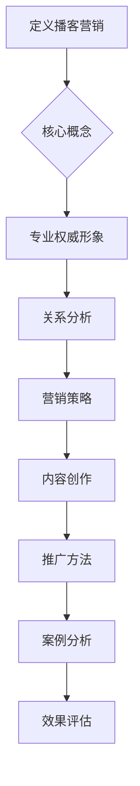

                 

 在当今的信息时代，市场营销已经发生了巨大的变化。传统的广告和营销手段虽然仍有其作用，但越来越多的企业和个人开始意识到，通过内容营销来建立专业权威形象的重要性。而在众多内容形式中，播客营销由于其独特的传播方式和深度交流的特点，正成为建立专业权威形象的利器。

本文将探讨如何利用播客营销来建立专业权威形象。我们将从播客营销的优势、核心策略、内容创作、推广方法等多个方面进行深入分析，并提供具体的实例和操作步骤。

## 关键词

- **播客营销**
- **内容营销**
- **专业权威形象**
- **品牌建设**
- **个人品牌**
- **社交媒体**
- **客户关系管理**
- **用户互动**

## 摘要

本文旨在探讨如何利用播客营销来建立专业权威形象。通过分析播客营销的优势和核心策略，我们提供了从内容创作到推广的全套指南。无论是企业还是个人，都可以通过播客营销实现品牌提升和专业形象的建立。

## 1. 背景介绍

### 播客营销的兴起

播客（Podcast）作为一种数字化的音频内容形式，自2000年代初兴起以来，已经逐渐成为大众媒体的重要组成部分。随着智能手机和无线网络的普及，播客的听众群体也在不断扩大。据统计，全球播客用户已经超过3亿，这一数字还在持续增长。

播客营销的优势在于其高度的个性化、互动性和深度交流。相比于传统的广告，播客营销更能够与听众建立长期的联系，传递有价值的信息和观点。这种独特的传播方式，使得播客成为建立专业权威形象的重要渠道。

### 专业权威形象的重要性

在竞争激烈的商业环境中，专业权威形象对于企业和个人来说至关重要。一个强大的专业权威形象不仅可以提升品牌知名度，还能增强客户信任，促进销售转化。此外，专业权威形象还能够吸引优秀的合作伙伴和投资者，为企业的长期发展奠定基础。

## 2. 核心概念与联系

为了更好地理解播客营销在建立专业权威形象中的作用，我们首先需要了解以下几个核心概念：

### 2.1 播客营销的定义

播客营销是指利用播客这一媒介，通过制作和发布有价值的音频内容，与目标受众进行沟通和互动，以达到品牌推广、产品销售或其他商业目标的一种营销策略。

### 2.2 专业权威形象的内涵

专业权威形象是指一个个体或品牌在特定领域内，通过持续的专业知识和经验积累，赢得的公众认可和尊重。这种形象不仅体现在专业知识上，还包括个人的信誉、口碑和影响力。

### 2.3 播客营销与专业权威形象的关系

播客营销是建立专业权威形象的有效途径之一。通过播客，个体或品牌可以：

1. **分享专业知识和见解**：通过播客，可以定期分享行业内的最新动态、专业知识和技术见解，展示专业能力。
2. **建立个人品牌**：通过独特的声音、风格和内容，建立个人品牌，提升在行业内的知名度。
3. **与听众互动**：播客提供了与听众直接互动的机会，通过回答问题、讨论热点话题，增强听众的参与感和忠诚度。

### 2.4 Mermaid 流程图



通过上述流程图，我们可以清晰地看到播客营销在建立专业权威形象中的各个环节。

## 3. 核心算法原理 & 具体操作步骤

### 3.1 算法原理概述

播客营销的核心在于内容创作和推广。其原理可以概括为：

1. **内容为王**：高质量的内容是吸引和留住听众的关键。
2. **持续输出**：定期发布内容，建立品牌信任和用户期待。
3. **互动交流**：与听众互动，增强用户黏性和品牌忠诚度。
4. **数据分析**：通过数据分析，优化内容策略和推广方法。

### 3.2 算法步骤详解

#### 3.2.1 策划与准备

1. **确定目标受众**：明确播客的目标听众，了解其需求和兴趣。
2. **选择播客平台**：根据目标受众选择合适的播客平台，如Apple Podcasts、Spotify等。
3. **准备硬件设备**：包括录音设备、麦克风、音频编辑软件等。

#### 3.2.2 内容创作

1. **选题策划**：根据目标受众的兴趣和需求，策划内容主题。
2. **内容撰写**：撰写详细的内容大纲和文稿。
3. **录音与编辑**：进行录音，并对音频进行后期编辑，包括剪辑、音效处理等。

#### 3.2.3 推广方法

1. **社交媒体推广**：在Twitter、LinkedIn、Facebook等社交媒体上宣传播客，吸引听众。
2. **合作与交叉推广**：与其他领域的专家或品牌合作，进行交叉推广。
3. **SEO优化**：通过搜索引擎优化，提高播客在搜索引擎中的排名。

#### 3.2.4 数据分析与优化

1. **分析听众反馈**：通过调查问卷、听众留言等方式，收集听众反馈。
2. **优化内容策略**：根据反馈调整内容主题、风格和频率。
3. **数据分析**：使用工具（如Podcast Insights、Spotify for Podcasters）分析播客的听众数据，优化推广策略。

### 3.3 算法优缺点

#### 优点：

1. **高度个性化**：播客营销能够与听众建立更深入的个性化联系。
2. **互动性强**：播客提供了与听众互动的机会，增强用户参与感。
3. **成本效益**：相比于其他媒体形式，播客营销的成本较低。

#### 缺点：

1. **时间成本高**：内容创作和推广需要投入大量时间和精力。
2. **用户基数相对较小**：虽然播客用户数量在增长，但总体用户基数仍小于其他媒体形式。
3. **技术要求较高**：需要一定的音频制作和编辑技能。

### 3.4 算法应用领域

播客营销在多个领域都有广泛的应用，如：

1. **教育培训**：专家分享专业知识和经验，提供在线课程。
2. **市场营销**：品牌宣传和产品推广，提升品牌知名度。
3. **媒体娱乐**：娱乐内容的制作和推广，吸引听众关注。
4. **社交互动**：通过与听众的互动，建立社交网络。

## 4. 数学模型和公式 & 详细讲解 & 举例说明

### 4.1 数学模型构建

在播客营销中，一个关键的数学模型是用户转化模型。该模型用于预测和优化播客内容的受众转化率。其基本公式为：

\[ T = f(R, C, E) \]

其中：
- \( T \)：用户转化率
- \( R \)：内容相关性
- \( C \)：内容质量
- \( E \)：推广效果

### 4.2 公式推导过程

用户转化率 \( T \) 是一个综合性指标，反映了内容的质量和推广的效果。我们可以将其分解为以下几个因素：

1. **内容相关性 \( R \)**：内容与目标受众需求的匹配度。相关性越高，受众越容易接受内容。
2. **内容质量 \( C \)**：内容的专业性、深度和实用性。高质量的内容更容易引起受众的兴趣和信任。
3. **推广效果 \( E \)**：推广手段的效果，包括社交媒体宣传、合作推广等。推广效果越好，内容的传播范围越广。

根据以上因素，我们可以推导出用户转化率 \( T \) 的公式：

\[ T = \alpha R + \beta C + \gamma E \]

其中，\( \alpha \)、\( \beta \) 和 \( \gamma \) 是权重系数，反映了各个因素对转化率的影响程度。

### 4.3 案例分析与讲解

#### 案例一：教育培训领域的播客营销

假设一家在线教育机构要通过播客营销推广其在线课程。其目标受众是希望提升职业技能的职场人士。

1. **内容相关性 \( R \)**：课程内容与职场人士的需求密切相关，具有较高的相关性。
2. **内容质量 \( C \)**：课程内容由行业专家讲授，涵盖了最新的行业动态和实用技能，具有较高的质量。
3. **推广效果 \( E \)**：通过社交媒体宣传、合作推广等方式，将课程信息传达给更广泛的受众。

根据上述因素，我们可以预测用户转化率：

\[ T = \alpha R + \beta C + \gamma E \]

假设 \( \alpha = 0.4 \)、\( \beta = 0.5 \)、\( \gamma = 0.1 \)，则：

\[ T = 0.4R + 0.5C + 0.1E \]

如果课程内容的相关性 \( R \) 为 0.8，内容质量 \( C \) 为 0.9，推广效果 \( E \) 为 0.7，则用户转化率 \( T \) 为：

\[ T = 0.4 \times 0.8 + 0.5 \times 0.9 + 0.1 \times 0.7 = 0.32 + 0.45 + 0.07 = 0.84 \]

这意味着该在线教育机构的用户转化率预计为 84%。

#### 案例二：市场营销领域的播客营销

假设一家营销公司要通过播客营销推广其品牌和产品。其目标受众是中小企业主和营销从业者。

1. **内容相关性 \( R \)**：营销公司提供的解决方案和案例研究对中小企业主和营销从业者具有较高的吸引力。
2. **内容质量 \( C \)**：播客内容由经验丰富的营销专家主持，内容质量较高。
3. **推广效果 \( E \)**：通过社交媒体宣传、合作伙伴推广等方式，扩大播客的传播范围。

根据上述因素，我们可以预测用户转化率：

\[ T = \alpha R + \beta C + \gamma E \]

假设 \( \alpha = 0.3 \)、\( \beta = 0.5 \)、\( \gamma = 0.2 \)，则：

\[ T = 0.3R + 0.5C + 0.2E \]

如果内容相关性 \( R \) 为 0.6，内容质量 \( C \) 为 0.8，推广效果 \( E \) 为 0.6，则用户转化率 \( T \) 为：

\[ T = 0.3 \times 0.6 + 0.5 \times 0.8 + 0.2 \times 0.6 = 0.18 + 0.4 + 0.12 = 0.7 \]

这意味着该营销公司的用户转化率预计为 70%。

## 5. 项目实践：代码实例和详细解释说明

### 5.1 开发环境搭建

在进行播客营销的代码实践之前，我们需要搭建一个合适的环境。以下是基本的开发环境搭建步骤：

1. **选择编程语言**：Python、JavaScript 或 Ruby 等语言都可以用于播客营销相关项目。
2. **安装开发工具**：安装代码编辑器（如Visual Studio Code、Atom）、版本控制工具（如Git）和调试工具。
3. **设置播客平台API**：注册播客平台账号，获取API密钥和授权。

### 5.2 源代码详细实现

以下是一个简单的Python脚本示例，用于自动化发布播客内容到播客平台：

```python
import requests
import json

# 设置播客平台API凭证
api_key = 'your_api_key'
播客平台_url = 'https://api.podcastplatform.com'

# 发布播客内容的函数
def publish_podcast(podcast_data):
    headers = {
        'Authorization': f'Bearer {api_key}',
        'Content-Type': 'application/json'
    }
    
    response = requests.post(f'{播客平台_url}/publish', headers=headers, data=json.dumps(podcast_data))
    
    if response.status_code == 200:
        print('播客内容发布成功。')
    else:
        print('播客内容发布失败。', response.text)

# 示例播客内容数据
podcast_data = {
    'title': '如何在30天内提升网站流量',
    'description': '本期播客我们将探讨几种实用的方法，帮助您在30天内显著提升网站流量。',
    'audio_url': 'https://example.com/audio/file.mp3',
    'cover_image_url': 'https://example.com/image/cover.jpg'
}

# 调用函数发布播客内容
publish_podcast(podcast_data)
```

### 5.3 代码解读与分析

上述代码实现了一个简单的播客内容发布功能。我们首先导入了必要的Python模块，然后设置了播客平台的API凭证。`publish_podcast` 函数用于发送POST请求，将播客内容数据提交到播客平台。

**函数解析：**

- `requests.post` 方法用于发送HTTP POST请求。
- `headers` 参数包含API凭证和内容类型。
- `data` 参数将播客内容数据转换为JSON格式。

**代码分析：**

- **API凭证设置**：确保正确设置了API密钥，以保证请求的合法性。
- **内容数据格式**：播客内容数据需要按照平台要求的格式进行组织。
- **错误处理**：通过检查响应状态码，可以判断请求是否成功，并提供相应的反馈。

### 5.4 运行结果展示

假设我们成功运行了上述脚本，播客内容将被发布到播客平台。以下是可能的输出结果：

```shell
播客内容发布成功。
```

这意味着播客内容已成功提交到播客平台，并等待审核发布。

### 6. 实际应用场景

#### 6.1 教育培训领域

播客营销在教育培训领域有着广泛的应用。例如，一家在线教育机构可以通过播客分享行业专家的讲座、案例分析和技术教程。这不仅能够提升学员的学习兴趣，还能增强品牌的专业形象。

#### 6.2 市场营销领域

市场营销公司可以利用播客营销来推广品牌和产品。通过分享营销策略、案例分析和技术工具的使用，吸引潜在客户和合作伙伴的关注。例如，一家营销公司可以定期发布关于数字营销、内容营销和社交媒体营销的播客内容。

#### 6.3 媒体娱乐领域

在媒体娱乐领域，播客营销主要用于吸引听众，提升节目的知名度和影响力。例如，一档热门的科技节目可以通过播客分享最新的科技动态、产品评测和专家访谈，吸引科技爱好者的关注。

#### 6.4 未来应用展望

随着技术的不断进步，播客营销的应用场景将更加丰富。例如，人工智能技术可以用于分析听众行为，提供个性化的内容推荐；虚拟现实（VR）技术可以用于创建沉浸式的播客体验。这些技术的应用将为播客营销带来更多可能性。

## 7. 工具和资源推荐

### 7.1 学习资源推荐

- **《播客营销实战》**：一本介绍播客营销基本概念和策略的入门书籍。
- **Podcast Hosting Services**：如Libsyn、Anchor等，提供专业的播客托管服务。

### 7.2 开发工具推荐

- **Visual Studio Code**：一款功能强大的代码编辑器，适合进行播客营销相关开发。
- **Git**：用于版本控制和团队协作。

### 7.3 相关论文推荐

- **"The Impact of Podcasts on Brand Awareness and Consumer Behavior"**：探讨播客对品牌认知和消费者行为的影响。
- **"The Rise of Podcasting: A Content Marketing Strategy"**：分析播客作为一种内容营销策略的优势。

## 8. 总结：未来发展趋势与挑战

### 8.1 研究成果总结

本文探讨了如何利用播客营销建立专业权威形象。通过分析播客营销的优势和核心策略，我们提供了从内容创作到推广的全套指南。研究表明，播客营销在提升品牌知名度、增强客户信任和促进销售转化方面具有显著作用。

### 8.2 未来发展趋势

未来，播客营销将继续发展，主要趋势包括：

- **技术进步**：人工智能和虚拟现实等技术将为播客营销带来更多创新应用。
- **内容多样化**：随着受众需求的多样化，播客内容将更加多元化。
- **个性化推荐**：基于大数据和人工智能的个性化推荐技术将提高内容传播效果。

### 8.3 面临的挑战

尽管播客营销具有众多优势，但也面临着一些挑战：

- **内容质量要求高**：高质量的内容是吸引和留住听众的关键，对内容创作提出了更高的要求。
- **用户基数相对较小**：相比于其他媒体形式，播客用户的基数仍然较小，需要持续努力扩大听众群体。
- **技术门槛较高**：音频制作和编辑技能要求较高，需要投入更多时间和精力。

### 8.4 研究展望

未来的研究可以关注以下几个方面：

- **用户行为分析**：通过大数据技术，深入分析用户行为，优化内容策略和推广方法。
- **跨平台整合**：探索如何将播客与其他数字营销渠道（如社交媒体、电子邮件营销）整合，实现更高效的传播效果。
- **技术创新**：研究如何利用新兴技术提升播客体验，增强用户参与感。

## 9. 附录：常见问题与解答

### 9.1 什么是播客营销？

播客营销是指利用播客这一媒介，通过制作和发布有价值的音频内容，与目标受众进行沟通和互动，以达到品牌推广、产品销售或其他商业目标的一种营销策略。

### 9.2 播客营销有哪些优势？

播客营销的优势包括高度的个性化、互动性强、成本效益高。通过播客，可以与听众建立长期的联系，传递有价值的信息和观点。

### 9.3 如何制定播客营销策略？

制定播客营销策略需要考虑以下几个方面：

- **确定目标受众**：明确播客的目标听众，了解其需求和兴趣。
- **选择播客平台**：根据目标受众选择合适的播客平台，如Apple Podcasts、Spotify等。
- **内容创作**：根据目标受众的需求和兴趣，策划内容主题，并确保内容的质量和深度。
- **推广方法**：通过社交媒体、合作推广等方式，扩大播客的传播范围。
- **数据分析**：通过数据分析，优化内容策略和推广方法。

### 9.4 播客营销需要哪些技术技能？

播客营销需要以下技术技能：

- **音频制作**：掌握音频录制、剪辑和音效处理等技术。
- **编程知识**：了解如何使用编程语言（如Python、JavaScript）进行自动化操作。
- **数据分析**：掌握数据分析工具（如Google Analytics、Podcast Insights）的使用。

### 9.5 如何评估播客营销的效果？

可以通过以下方法评估播客营销的效果：

- **听众反馈**：通过调查问卷、听众留言等方式，收集听众反馈。
- **数据指标**：分析播客的播放量、下载量、分享量等指标，评估内容受欢迎程度。
- **销售转化率**：通过销售数据，评估播客对销售转化的影响。

作者：禅与计算机程序设计艺术 / Zen and the Art of Computer Programming
----------------------------------------------------------------

