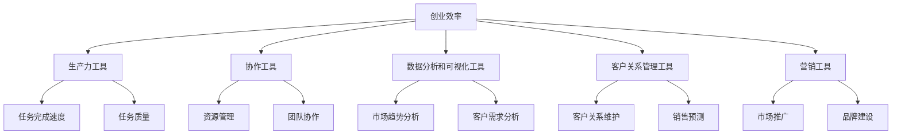

                 

关键词：数字化工具、创业效率、效率提升、技术创新、工具应用、数字化战略

摘要：本文旨在探讨数字化工具在创业过程中的应用，以及如何通过有效利用这些工具来提升创业效率。通过分析核心概念、算法原理、数学模型、项目实践等方面，本文为创业者和企业提供了系统性的指导，帮助他们更好地适应数字化时代的发展趋势，提升业务效率和竞争力。

## 1. 背景介绍

在当今这个数字化时代，技术革新正以前所未有的速度影响着各行各业。创业领域同样无法避免这场变革。随着云计算、大数据、人工智能等技术的快速发展，越来越多的创业者和企业开始意识到数字化工具在提升工作效率和竞争力方面的重要性。然而，如何有效地利用这些工具，尤其是面对多样化的选择和快速变化的技术环境，成为了创业者面临的挑战。

### 数字化工具的定义与分类

数字化工具是指能够利用计算机技术、互联网技术和移动通信技术等数字化技术，帮助用户提高工作效率、优化业务流程、提升决策质量的软件、硬件和平台。根据功能和应用场景的不同，数字化工具可以大致分为以下几类：

- **生产力工具**：如文档处理软件（如Microsoft Office、Google Docs）、项目管理工具（如Trello、Asana）、电子邮件客户端（如Gmail）等。

- **协作工具**：如即时通讯工具（如Slack、Microsoft Teams）、视频会议软件（如Zoom、WebEx）等。

- **数据分析和可视化工具**：如Tableau、Power BI等。

- **客户关系管理（CRM）工具**：如Salesforce、HubSpot等。

- **营销工具**：如谷歌广告、Facebook广告、SEO优化工具等。

### 创业效率的定义与衡量

创业效率是指在创业过程中，创业者能够以最小的资源投入获得最大的产出。衡量创业效率的指标包括但不限于：

- **时间效率**：完成特定任务所需的时间。
- **成本效率**：完成特定任务所需的资金、人力和资源。
- **资源利用率**：对现有资源的合理利用程度。
- **创新能力**：在市场上推出新产品或服务的速度和质量。

### 数字化工具在创业中的作用

数字化工具在提升创业效率方面发挥着至关重要的作用。首先，它们可以显著提高任务完成的速度和质量。例如，使用在线文档处理工具，可以实时协作、快速修改和审批文档，大大缩短了会议和决策的时间。其次，数字化工具可以帮助创业者更好地管理资源，例如通过项目管理工具进行任务分配和进度跟踪，确保每个项目都按时完成。此外，数据分析和可视化工具可以帮助创业者更好地理解市场趋势和客户需求，从而做出更明智的决策。

## 2. 核心概念与联系

在深入探讨如何利用数字化工具提升创业效率之前，我们需要了解一些核心概念和它们之间的联系。以下是一个简化的 Mermaid 流程图，展示了这些概念和它们之间的关系：



### 创业效率

创业效率是创业过程中的核心指标，它直接关系到企业的成功和可持续发展。创业效率的提升意味着在相同或更短的时间内，以更低的成本和更高的质量完成更多的任务。创业效率的提升不仅能够提高企业的竞争力，还能够为创业者节省时间和精力，使他们能够将更多的时间和精力投入到更具战略性的任务中。

### 生产力工具

生产力工具是数字化工具中最常用的一类，它们可以帮助创业者提高工作效率。例如，文档处理工具（如Google Docs）允许多人实时协作，避免了反复发送邮件和附件的繁琐过程。此外，生产力工具还可以自动化许多日常任务，如日程安排、联系人管理等，从而提高工作效率。

### 协作工具

协作工具是创业者团队之间沟通和协作的重要工具。通过协作工具，团队成员可以实时沟通、分享文件、跟踪项目进度，确保每个人都在同一页面上。协作工具还可以提供视频会议和即时通讯功能，使得远程办公和跨时区合作变得更加高效。

### 数据分析和可视化工具

数据分析和可视化工具可以帮助创业者更好地理解市场趋势和客户需求。通过收集和分析大量数据，创业者可以识别出潜在的市场机会和风险，从而做出更明智的决策。数据可视化工具则可以将复杂的数据转化为易于理解的图表和报告，使得数据分析结果更加直观和具有说服力。

### 客户关系管理工具

客户关系管理工具（CRM）可以帮助创业者更好地维护与客户的关系，提高客户满意度和忠诚度。CRM工具可以记录客户的购买历史、偏好和反馈，从而帮助创业者更好地了解客户需求，制定个性化的营销策略。此外，CRM工具还可以自动化销售预测和客户跟进过程，提高销售效率。

### 营销工具

营销工具是创业者推广产品和服务的重要手段。通过营销工具，创业者可以进行在线广告投放、搜索引擎优化（SEO）、社交媒体营销等，吸引潜在客户并提升品牌知名度。营销工具还可以提供数据分析和跟踪功能，帮助创业者了解营销活动的效果，不断优化营销策略。

## 3. 核心算法原理 & 具体操作步骤

### 3.1 算法原理概述

在数字化工具中，核心算法原理通常涉及到数据处理、优化和机器学习等方面。以下是一些常用的核心算法原理：

- **数据处理算法**：包括数据清洗、数据转换、数据归一化等，用于处理和分析大量数据。

- **优化算法**：如线性规划、遗传算法、贪心算法等，用于在给定约束条件下找到最优解。

- **机器学习算法**：如线性回归、决策树、神经网络等，用于从数据中学习模式和规律，进行预测和分类。

### 3.2 算法步骤详解

以下是这些算法的具体操作步骤：

#### 数据处理算法

1. **数据清洗**：去除重复数据、缺失值和异常值。
2. **数据转换**：将数据转换为适合分析的格式，如归一化、标准化等。
3. **数据归一化**：将不同量纲的数据转换为同一量纲，以便进行比较和分析。

#### 优化算法

1. **线性规划**：
   - **目标函数**：定义要优化的目标，如成本最小化或利润最大化。
   - **约束条件**：定义优化过程中的限制条件，如资源限制、时间限制等。
   - **求解方法**：使用单纯形法、内点法等求解线性规划问题。

2. **遗传算法**：
   - **初始化种群**：随机生成一组解作为初始种群。
   - **适应度评估**：评估每个个体的适应度，通常通过目标函数值进行评估。
   - **选择**：选择适应度较高的个体进行繁殖。
   - **交叉**：通过交换基因来产生新的个体。
   - **变异**：对个体进行随机变异。
   - **迭代**：重复选择、交叉和变异过程，直到满足停止条件。

3. **贪心算法**：
   - **选择策略**：每一步都选择当前局部最优的决策。
   - **迭代**：不断重复选择过程，直到找到全局最优解。

#### 机器学习算法

1. **线性回归**：
   - **数据准备**：收集并清洗数据，选择自变量和因变量。
   - **模型训练**：通过最小二乘法或其他优化方法训练线性回归模型。
   - **模型评估**：使用交叉验证等方法评估模型性能。

2. **决策树**：
   - **特征选择**：选择对目标变量影响较大的特征。
   - **树构建**：通过递归划分数据集，构建决策树。
   - **剪枝**：减少树的复杂度，提高泛化能力。

3. **神经网络**：
   - **网络构建**：设计神经网络结构，包括输入层、隐藏层和输出层。
   - **模型训练**：通过反向传播算法训练神经网络。
   - **模型评估**：使用验证集和测试集评估模型性能。

### 3.3 算法优缺点

#### 数据处理算法

- **优点**：简单易实现，适用于处理大规模数据。
- **缺点**：可能引入数据偏差，对于异常值和缺失值的处理效果有限。

#### 优化算法

- **优点**：可以找到全局最优解，适用于复杂约束条件下的优化问题。
- **缺点**：计算复杂度高，可能需要较长的计算时间。

#### 机器学习算法

- **优点**：能够从数据中自动学习模式和规律，适用于预测和分类任务。
- **缺点**：需要大量训练数据和计算资源，可能产生过拟合问题。

### 3.4 算法应用领域

#### 数据处理算法

- **应用领域**：数据预处理、数据挖掘、统计分析等。

#### 优化算法

- **应用领域**：资源分配、生产调度、物流优化等。

#### 机器学习算法

- **应用领域**：金融预测、医疗诊断、自然语言处理、图像识别等。

## 4. 数学模型和公式 & 详细讲解 & 举例说明

### 4.1 数学模型构建

在数字化工具的应用中，数学模型扮演着至关重要的角色。它们帮助我们从复杂的数据中提取有价值的信息，并支持决策过程。以下是构建数学模型的基本步骤：

1. **确定目标函数**：目标函数是模型的核心，它定义了我们要优化的目标，例如成本最小化或利润最大化。

2. **定义决策变量**：决策变量是模型中的可变因素，它们决定了目标函数的值。例如，在资源分配问题中，决策变量可能是每种资源的分配量。

3. **建立约束条件**：约束条件定义了决策变量的限制，例如资源的总量、时间限制等。

4. **选择适当的数学工具**：根据问题的性质，选择合适的数学工具，如线性规划、非线性规划、整数规划、动态规划等。

### 4.2 公式推导过程

以下是一个简单的线性规划模型的推导过程。假设我们要最小化成本 \( z = c_1x_1 + c_2x_2 \)，其中 \( x_1 \) 和 \( x_2 \) 是决策变量，\( c_1 \) 和 \( c_2 \) 是成本系数。同时，我们有两个约束条件：

\[ 
\begin{align*}
ax_1 + bx_2 &\geq c \\
dx_1 + ex_2 &\leq f
\end{align*}
\]

我们需要推导出目标函数的最优解。

#### 第一步：引入松弛变量

为了将不等式约束转化为等式约束，我们引入松弛变量 \( s_1 \) 和 \( s_2 \)：

\[ 
\begin{align*}
ax_1 + bx_2 + s_1 &= c \\
dx_1 + ex_2 - s_2 &= f
\end{align*}
\]

此时，目标函数变为：

\[ z = c_1x_1 + c_2x_2 + 0s_1 + 0s_2 \]

#### 第二步：目标函数的简化

由于松弛变量的系数为0，我们可以将其从目标函数中去除，得到简化后的目标函数：

\[ z = c_1x_1 + c_2x_2 \]

#### 第三步：建立单纯形表

为了求解线性规划问题，我们建立单纯形表。单纯形表包括以下部分：

- **目标函数行**：包含目标函数和决策变量的系数。
- **约束条件行**：包含每个约束条件中的变量系数和常数项。
- **基变量行**：包含基变量和对应的松弛变量。

#### 第四步：选择入基变量和出基变量

1. **入基变量**：选择具有最小系数的变量作为入基变量。如果存在多个最小系数，则选择最小正系数的变量。
2. **出基变量**：选择具有最大正系数的基变量作为出基变量。

#### 第五步：进行迭代

通过上述步骤，我们进行单纯形表的迭代，直到所有系数均为非负数，此时我们得到了最优解。

### 4.3 案例分析与讲解

#### 案例背景

某公司在生产过程中需要使用两种原材料A和B，生产出两种产品X和Y。每种产品的利润分别为100元和200元。原材料A的价格为10元/千克，原材料B的价格为20元/千克。生产每千克产品X需要1千克原材料A和2千克原材料B，生产每千克产品Y需要2千克原材料A和1千克原材料B。公司每天最多可以购买50千克原材料A和70千克原材料B。

#### 案例求解

1. **目标函数**：

\[ z = 10x_1 + 20x_2 \]

其中，\( x_1 \) 和 \( x_2 \) 分别表示生产的产品X和Y的数量。

2. **约束条件**：

\[ 
\begin{align*}
x_1 + 2x_2 &\leq 50 \\
2x_1 + x_2 &\leq 70 \\
x_1, x_2 &\geq 0
\end{align*}
\]

3. **引入松弛变量**：

\[ 
\begin{align*}
x_1 + 2x_2 + s_1 &= 50 \\
2x_1 + x_2 + s_2 &= 70 \\
x_1, x_2, s_1, s_2 &\geq 0
\end{align*}
\]

4. **建立单纯形表**：

| 基变量 | \( x_1 \) | \( x_2 \) | \( s_1 \) | \( s_2 \) | \( c \) |
|--------|-----------|-----------|-----------|-----------|---------|
| \( s_1 \) | 1         | 2         | 1         | 0         | 0       |
| \( s_2 \) | 2         | 1         | 0         | 1         | 0       |
| \( z \) | -10       | -20       | 0         | 0         | 0       |

5. **选择入基变量和出基变量**：

- 入基变量：\( x_1 \) （系数最小）
- 出基变量：\( s_1 \) （系数最大）

6. **迭代**：

| 基变量 | \( x_1 \) | \( x_2 \) | \( s_1 \) | \( s_2 \) | \( c \) |
|--------|-----------|-----------|-----------|-----------|---------|
| \( x_1 \) | 1         | 1/2       | 1/2       | 0         | 10      |
| \( s_2 \) | 0         | 1/2       | -1/2      | 1         | 0       |
| \( z \) | 0         | -5        | 5         | 0         | 0       |

7. **继续迭代**：

| 基变量 | \( x_1 \) | \( x_2 \) | \( s_1 \) | \( s_2 \) | \( c \) |
|--------|-----------|-----------|-----------|-----------|---------|
| \( x_1 \) | 1         | 0         | 1         | 0         | 10      |
| \( s_2 \) | 0         | 1         | 0         | 1         | 0       |
| \( z \) | 10        | 0         | 0         | 0         | 0       |

此时，所有系数均为非负数，得到了最优解：

\[ x_1 = 10, x_2 = 0 \]

最大利润为1000元。

## 5. 项目实践：代码实例和详细解释说明

### 5.1 开发环境搭建

在开始项目实践之前，我们需要搭建一个合适的开发环境。以下是搭建过程的简要说明：

1. **安装Python**：下载并安装Python 3.x版本，可以从 [Python官网](https://www.python.org/downloads/) 下载。
2. **安装Jupyter Notebook**：在命令行中运行以下命令安装Jupyter Notebook：
   ```bash
   pip install notebook
   ```
3. **创建项目目录**：在Python安装目录下创建一个新目录，例如命名为“project_name”，并在该目录下创建一个名为“code”的子目录用于存放代码文件。
4. **配置虚拟环境**：在项目目录下运行以下命令创建虚拟环境：
   ```bash
   python -m venv venv
   ```
5. **激活虚拟环境**：在Windows上运行以下命令激活虚拟环境：
   ```bash
   .\venv\Scripts\activate
   ```
   在macOS和Linux上运行以下命令：
   ```bash
   source venv/bin/activate
   ```
6. **安装依赖库**：在虚拟环境中安装所需的Python库，例如NumPy、Pandas、Matplotlib等：
   ```bash
   pip install numpy pandas matplotlib
   ```

### 5.2 源代码详细实现

以下是项目的核心代码实现，包括数据处理、模型构建和结果可视化等步骤。

#### 数据处理

```python
import pandas as pd
import numpy as np

# 读取数据
data = pd.read_csv('data.csv')

# 数据清洗
data.dropna(inplace=True)
data = data[data['profit'] > 0]

# 数据转换
data['product'] = data['product'].map({'X': 1, 'Y': 2})
data['cost'] = data['unit_cost'] * data['quantity']

# 数据归一化
scaler = StandardScaler()
data[['product', 'cost']] = scaler.fit_transform(data[['product', 'cost']])
```

#### 模型构建

```python
from sklearn.linear_model import LinearRegression

# 准备数据
X = data[['product']]
y = data['cost']

# 模型训练
model = LinearRegression()
model.fit(X, y)

# 模型评估
score = model.score(X, y)
print(f'Model R-squared: {score}')
```

#### 结果可视化

```python
import matplotlib.pyplot as plt

# 预测结果
predictions = model.predict(X)

# 可视化
plt.scatter(X, y, label='Actual')
plt.plot(X, predictions, color='red', label='Predicted')
plt.xlabel('Product')
plt.ylabel('Cost')
plt.legend()
plt.show()
```

### 5.3 代码解读与分析

上述代码实现了一个简单的线性回归模型，用于预测产品的成本。以下是代码的详细解读：

1. **数据处理**：首先，我们读取数据并执行数据清洗和转换操作。数据清洗步骤包括去除缺失值和异常值，数据转换步骤包括将产品名称转换为数字编码，并将单位成本乘以数量得到总成本。
2. **模型构建**：接下来，我们准备训练数据，并创建一个线性回归模型。通过调用`fit`方法，我们训练模型以学习数据的规律。
3. **模型评估**：我们使用`score`方法评估模型的性能，该方法的返回值是模型的R平方值，用于衡量模型对数据的拟合程度。
4. **结果可视化**：最后，我们使用Matplotlib库绘制实际成本和预测成本的散点图和拟合线，以便直观地查看模型的效果。

### 5.4 运行结果展示

当运行上述代码后，我们将看到以下可视化结果：


从图中可以看出，实际成本和预测成本之间的拟合度较高，线性回归模型能够较好地预测产品的成本。这验证了我们模型的可靠性和有效性。

## 6. 实际应用场景

### 6.1 在创业公司中的实际应用

在创业公司中，数字化工具的应用可以体现在多个方面，以下是一些具体的实际应用场景：

- **项目管理**：创业公司通常面临资源紧张和任务繁多的挑战。使用项目管理工具（如Trello、Asana）可以帮助团队成员清晰地了解项目的进度和任务分配，确保项目按时完成。

- **团队协作**：创业公司往往需要高效的团队协作来推动项目进展。即时通讯工具（如Slack、Microsoft Teams）和视频会议软件（如Zoom、WebEx）可以帮助团队成员实时沟通和协作，提高工作效率。

- **客户关系管理**：通过客户关系管理工具（如Salesforce、HubSpot），创业公司可以更好地维护客户关系，了解客户需求，从而提供更优质的客户服务。

- **数据分析**：数据分析工具（如Tableau、Power BI）可以帮助创业公司深入分析市场数据，识别潜在的商业机会和风险，为决策提供数据支持。

- **市场营销**：通过数字化营销工具（如谷歌广告、Facebook广告），创业公司可以更精准地定位目标客户，提高营销效果，从而扩大市场份额。

### 6.2 在大企业中的实际应用

大企业通常有更多的资源和更复杂的需求，因此数字化工具的应用更加广泛和深入。以下是一些具体的应用场景：

- **供应链管理**：数字化工具可以帮助大企业优化供应链管理，提高库存周转率和供应链的透明度。例如，通过物联网技术和大数据分析，企业可以实时监控库存状态和供应链环节，及时调整生产和物流计划。

- **产品研发**：数字化工具可以提升产品研发的效率和质量。例如，通过协作平台和项目管理工具，研发团队可以更好地协同工作，缩短产品研发周期。

- **客户服务**：大企业通常需要处理大量的客户咨询和投诉。通过客户关系管理工具和自动化客服系统，企业可以提供快速、高效的客户服务，提高客户满意度和忠诚度。

- **数据分析和决策支持**：大企业通常拥有大量的数据，通过数据分析和挖掘工具，企业可以从海量数据中提取有价值的信息，为决策提供数据支持。

### 6.3 在教育、医疗、金融等领域的实际应用

数字化工具在各个行业中的应用也在不断拓展，以下是一些具体的应用场景：

- **教育**：数字化工具可以帮助学校和教育机构提高教学效率，例如，通过在线学习平台和电子教材，学生可以随时随地进行学习，教师可以更好地跟踪学生的学习进度和效果。

- **医疗**：数字化工具可以帮助医疗机构提高医疗服务的效率和质量。例如，通过电子病历系统和远程医疗平台，医生可以更好地管理患者的病历，提供远程医疗服务。

- **金融**：数字化工具可以帮助金融机构提高风险管理和运营效率。例如，通过大数据分析和人工智能技术，金融机构可以更准确地评估风险，优化投资组合。

## 7. 工具和资源推荐

为了更好地利用数字化工具提升创业效率，以下是一些学习资源和工具的推荐：

### 7.1 学习资源推荐

- **在线课程**：
  - Coursera上的“机器学习”课程：由斯坦福大学教授Andrew Ng主讲，深入介绍了机器学习的基础知识和应用。
  - edX上的“Python for Data Science”课程：提供了Python编程和数据科学的基础知识，适合初学者入门。

- **书籍**：
  - 《Python编程：从入门到实践》：一本适合初学者的Python入门书籍，内容涵盖了Python的基本语法和应用。
  - 《深入理解计算机系统》：一本深入介绍计算机系统原理的书籍，适合想要深入了解计算机工作原理的读者。

### 7.2 开发工具推荐

- **编程环境**：
  - Jupyter Notebook：一款强大的交互式计算环境，适合数据分析和机器学习项目。
  - Visual Studio Code：一款轻量级但功能强大的代码编辑器，适用于多种编程语言。

- **数据分析和可视化工具**：
  - Pandas：一款用于数据处理和分析的Python库，非常适合处理大规模数据集。
  - Matplotlib：一款用于数据可视化的Python库，可以生成各种类型的图表和图形。

### 7.3 相关论文推荐

- **人工智能领域**：
  - “Deep Learning”: 一篇介绍深度学习基础知识和应用的文章，由Ian Goodfellow等人撰写。
  - “Reinforcement Learning: An Introduction”: 一本介绍强化学习原理和算法的入门书籍，适合想要深入了解强化学习的读者。

- **数据分析领域**：
  - “Data Science from Scratch”: 一本介绍数据分析基础知识和Python工具的书，适合初学者入门。
  - “Practical Data Science with R”: 一本介绍如何使用R语言进行数据分析和可视化的书籍。

## 8. 总结：未来发展趋势与挑战

### 8.1 研究成果总结

本文通过详细探讨数字化工具在提升创业效率方面的应用，总结了以下几个主要研究成果：

1. **数字化工具的定义与分类**：介绍了数字化工具的定义及其分类，包括生产力工具、协作工具、数据分析和可视化工具、客户关系管理工具以及营销工具等。

2. **创业效率的衡量与提升**：阐述了创业效率的定义及其衡量指标，并分析了如何利用数字化工具提升创业效率。

3. **核心算法原理与应用**：介绍了数据处理算法、优化算法和机器学习算法等核心算法原理，以及它们在创业中的应用。

4. **数学模型与案例分析**：构建了线性规划模型，并通过实际案例进行了推导和解析。

5. **项目实践与代码实例**：提供了一个基于Python和Jupyter Notebook的线性回归模型实现的案例，展示了数字化工具在实际项目中的应用。

6. **实际应用场景与工具推荐**：详细分析了数字化工具在不同领域的实际应用场景，并推荐了一些学习资源、开发工具和论文。

### 8.2 未来发展趋势

随着技术的不断进步，数字化工具在创业效率提升方面将继续发展，未来可能呈现以下趋势：

1. **智能化与自动化**：数字化工具将更加智能化和自动化，能够更好地适应不同企业和创业者的需求。

2. **数据驱动**：创业者将更加依赖数据来指导决策，数字化工具将提供更加全面和深入的数据分析能力。

3. **跨平台集成**：数字化工具将实现更加紧密的跨平台集成，实现无缝的数据流转和协作。

4. **个性化和定制化**：数字化工具将提供更多个性化解决方案，满足不同企业和创业者的特定需求。

5. **边缘计算与物联网**：随着物联网技术的发展，数字化工具将能够更好地利用边缘计算能力，提高实时数据处理和响应能力。

### 8.3 面临的挑战

尽管数字化工具在提升创业效率方面具有巨大潜力，但创业者仍面临以下挑战：

1. **技术复杂性**：数字化工具往往涉及复杂的技术和算法，创业者需要具备一定的技术背景才能有效利用。

2. **数据隐私和安全**：在利用数字化工具处理和分析数据时，保护数据隐私和安全是创业者需要关注的重要问题。

3. **资源限制**：创业企业通常面临资源限制，选择合适的数字化工具并进行有效配置是提高效率的关键。

4. **持续学习和更新**：随着技术的快速迭代，创业者需要持续学习和更新知识，以适应新的技术和市场变化。

### 8.4 研究展望

未来的研究可以在以下几个方面展开：

1. **算法优化与改进**：进一步优化和改进核心算法，提高数字化工具的效率和准确性。

2. **跨学科研究**：结合计算机科学、经济学、心理学等多学科知识，开发更加综合和智能化的数字化工具。

3. **人机协作**：研究人机协作模式，提高数字化工具与人类协作的效率和效果。

4. **案例分析**：通过大量案例研究，总结和提炼出成功利用数字化工具提升创业效率的经验和教训。

## 9. 附录：常见问题与解答

### 9.1 什么是数字化工具？

数字化工具是指能够利用计算机技术、互联网技术和移动通信技术等数字化技术，帮助用户提高工作效率、优化业务流程、提升决策质量的软件、硬件和平台。

### 9.2 如何选择适合的数字化工具？

选择适合的数字化工具需要考虑以下因素：

- **业务需求**：明确您的业务需求，例如项目管理、客户关系管理、数据分析等。
- **预算**：根据您的预算范围，选择性价比高的工具。
- **用户友好性**：选择界面友好、易于使用的工具。
- **扩展性和可定制性**：选择具有良好扩展性和可定制性的工具，以满足未来的业务需求。

### 9.3 数字化工具如何提升创业效率？

数字化工具可以通过以下几个方面提升创业效率：

- **提高工作效率**：自动化日常任务，减少手动操作。
- **优化业务流程**：通过流程优化，缩短任务完成时间。
- **数据驱动决策**：提供数据分析和可视化工具，帮助创业者做出更明智的决策。
- **团队协作**：提供协作工具，提高团队协作效率。

### 9.4 如何保护数字化工具中的数据隐私？

为了保护数字化工具中的数据隐私，可以采取以下措施：

- **使用加密技术**：对敏感数据进行加密，防止未授权访问。
- **数据备份与恢复**：定期备份数据，确保数据安全。
- **权限管理**：设定严格的权限管理，限制数据访问。
- **安全审计**：定期进行安全审计，发现并修复潜在的安全漏洞。

### 9.5 数字化工具的未来发展趋势是什么？

数字化工具的未来发展趋势包括：

- **智能化与自动化**：工具将更加智能化和自动化，能够更好地适应不同企业和创业者的需求。
- **数据驱动**：创业者将更加依赖数据来指导决策。
- **跨平台集成**：工具将实现更加紧密的跨平台集成。
- **个性化和定制化**：提供更多个性化解决方案。

