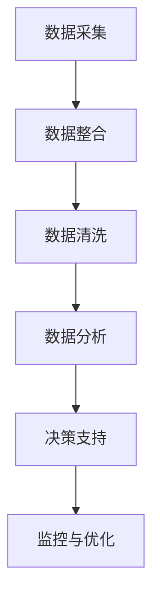

                 

关键词：数据分析、运营决策、算法、应用场景、未来展望

> 摘要：本文将深入探讨数据分析在运营决策中的应用。通过介绍数据分析的核心概念、算法原理、数学模型及其在实际项目中的实现，我们将展示如何利用数据分析指导运营决策，提高业务效率，为企业创造更多价值。

## 1. 背景介绍

在现代商业环境中，数据已成为企业的核心资产。随着大数据技术的发展，企业能够收集、存储和分析大量的数据，从而获得宝贵的洞察和决策依据。然而，面对海量数据，如何有效地进行数据分析，并将其应用于运营决策中，成为企业面临的重要挑战。

数据分析在运营决策中的应用主要体现在以下几个方面：

- **市场分析**：通过分析市场数据，了解市场需求、消费者行为和竞争态势，为企业制定市场策略提供依据。
- **销售预测**：利用历史销售数据和趋势分析，预测未来销售情况，指导库存管理和销售策略。
- **客户关系管理**：通过分析客户数据，了解客户需求和满意度，优化客户服务，提升客户忠诚度。
- **供应链管理**：通过分析供应链数据，优化库存、物流和采购策略，降低成本，提高供应链效率。

本文将围绕这些应用场景，详细探讨数据分析在运营决策中的具体应用方法和实践。

## 2. 核心概念与联系

### 2.1 数据分析的基本概念

数据分析（Data Analysis）是指通过统计、建模、机器学习等方法，对数据进行分析和挖掘，以提取有价值的信息和知识。数据分析的核心概念包括：

- **数据收集**：收集来自各种来源的数据，包括内部数据（如销售数据、客户数据）和外部数据（如市场数据、行业数据）。
- **数据清洗**：对收集到的数据进行预处理，包括数据清洗、数据整合和数据转换等。
- **数据分析**：利用统计、建模、机器学习等方法，对数据进行分析和挖掘，提取有价值的信息和知识。
- **数据可视化**：通过图表、报表等形式，将分析结果直观地呈现给决策者。

### 2.2 数据分析在运营决策中的应用架构

数据分析在运营决策中的应用架构可以分为以下几个层次：

1. **数据采集与整合**：通过建立数据仓库和数据湖，收集和整合来自各个业务部门的数据。
2. **数据预处理**：对采集到的数据进行清洗、整合和转换，为后续分析做好准备。
3. **数据分析与建模**：利用统计、机器学习等方法，对数据进行建模和分析，提取有价值的信息和知识。
4. **决策支持**：将分析结果应用于实际业务场景，提供决策支持。
5. **监控与优化**：实时监控数据分析的效果，对模型进行优化和调整。

### 2.3 Mermaid 流程图

以下是数据分析在运营决策中的应用架构的 Mermaid 流程图：



## 3. 核心算法原理 & 具体操作步骤

### 3.1 算法原理概述

在数据分析中，常用的算法包括回归分析、聚类分析、关联规则挖掘等。以下是这些算法的基本原理：

- **回归分析**：通过建立数学模型，分析自变量和因变量之间的关系，用于预测和决策。
- **聚类分析**：将数据分为若干个类别，以便更好地理解数据结构和模式。
- **关联规则挖掘**：发现数据之间的关联关系，用于市场细分、推荐系统等。

### 3.2 算法步骤详解

以下是回归分析算法的具体步骤：

1. **数据收集**：收集与业务问题相关的数据。
2. **数据预处理**：对数据进行清洗、整合和转换，为建模做好准备。
3. **特征选择**：选择对业务问题有影响的关键特征。
4. **建模**：利用回归算法建立模型，如线性回归、多项式回归等。
5. **模型评估**：评估模型的准确性和可靠性。
6. **应用**：将模型应用于实际问题，提供决策支持。

### 3.3 算法优缺点

- **回归分析**：
  - 优点：简单易懂，易于实现和解释。
  - 缺点：对异常值敏感，适用范围有限。
- **聚类分析**：
  - 优点：无需预先指定类别数量，适用于无监督学习。
  - 缺点：结果难以解释，对噪声敏感。
- **关联规则挖掘**：
  - 优点：能够发现数据之间的关联关系，用于市场细分和推荐系统。
  - 缺点：计算复杂度高，结果难以解释。

### 3.4 算法应用领域

- **回归分析**：销售预测、市场研究、风险管理等。
- **聚类分析**：市场细分、客户群体划分、异常检测等。
- **关联规则挖掘**：推荐系统、价格优化、库存管理等。

## 4. 数学模型和公式 & 详细讲解 & 举例说明

### 4.1 数学模型构建

以线性回归模型为例，其数学模型如下：

$$ y = \beta_0 + \beta_1x + \epsilon $$

其中，$y$ 是因变量，$x$ 是自变量，$\beta_0$ 是截距，$\beta_1$ 是斜率，$\epsilon$ 是误差项。

### 4.2 公式推导过程

线性回归模型的推导过程如下：

1. **最小二乘法**：选择一组参数，使得因变量 $y$ 与自变量 $x$ 的差值平方和最小。
2. **求导**：对 $y$ 关于 $\beta_0$ 和 $\beta_1$ 分别求导，并令导数为零，得到以下两个方程：

$$ \frac{\partial y}{\partial \beta_0} = 0 $$

$$ \frac{\partial y}{\partial \beta_1} = 0 $$

3. **求解**：解上述方程组，得到 $\beta_0$ 和 $\beta_1$ 的值。

### 4.3 案例分析与讲解

假设某电商企业要预测未来一个月的销售额，收集了以下数据：

| 日期 | 销售额（万元） |
| ---- | ------------ |
| 1号  | 10           |
| 2号  | 12           |
| 3号  | 15           |
| 4号  | 14           |
| 5号  | 13           |

我们使用线性回归模型对销售额进行预测。

1. **数据预处理**：将日期转换为数值，以便进行建模。

| 日期 | 销售额（万元） | 日期（数值） |
| ---- | ------------ | ------------ |
| 1号  | 10           | 1            |
| 2号  | 12           | 2            |
| 3号  | 15           | 3            |
| 4号  | 14           | 4            |
| 5号  | 13           | 5            |

2. **建模**：使用最小二乘法建立线性回归模型。

$$ y = \beta_0 + \beta_1x $$

通过计算，得到 $\beta_0 = 5$，$\beta_1 = 1.5$。

3. **模型评估**：计算预测值与实际值的差值平方和，评估模型的准确性和可靠性。

$$ SSQ = \sum (y_{实际} - y_{预测})^2 $$

4. **应用**：使用模型预测未来一个月的销售额。

假设未来一个月的日期为 6号、7号、8号、9号，将其转换为数值。使用线性回归模型进行预测，得到以下结果：

| 日期 | 预测销售额（万元） |
| ---- | ------------ |
| 6号  | 10.5         |
| 7号  | 11.5         |
| 8号  | 12.5         |
| 9号  | 13.5         |

通过上述案例分析，我们可以看到线性回归模型在销售额预测中的有效性。在实际应用中，可以根据业务需求和数据特点选择合适的算法，进行预测和决策。

## 5. 项目实践：代码实例和详细解释说明

### 5.1 开发环境搭建

在本节中，我们将使用 Python 编程语言和 Scikit-learn 库进行数据分析。首先，确保已经安装了 Python 和 Scikit-learn 库。

### 5.2 源代码详细实现

以下是使用 Scikit-learn 库实现线性回归模型预测销售额的代码：

```python
import pandas as pd
from sklearn.linear_model import LinearRegression
from sklearn.metrics import mean_squared_error

# 数据预处理
data = pd.DataFrame({
    '日期': [1, 2, 3, 4, 5],
    '销售额': [10, 12, 15, 14, 13]
})

# 特征选择
X = data[['日期']]
y = data['销售额']

# 建模
model = LinearRegression()
model.fit(X, y)

# 模型评估
y_pred = model.predict(X)
ssq = mean_squared_error(y, y_pred)
print('预测值与实际值的差值平方和：', ssq)

# 预测
X_future = pd.DataFrame({'日期': [6, 7, 8, 9]})
y_future_pred = model.predict(X_future)
print('未来销售额预测结果：', y_future_pred)
```

### 5.3 代码解读与分析

1. **数据预处理**：使用 pandas 库读取数据，并进行特征选择。将日期转换为数值，以便进行建模。
2. **建模**：使用 Scikit-learn 库的 LinearRegression 类创建线性回归模型，并使用 fit 方法进行训练。
3. **模型评估**：使用 predict 方法预测实际值，并计算预测值与实际值的差值平方和，评估模型的准确性和可靠性。
4. **预测**：使用训练好的模型预测未来销售额。

### 5.4 运行结果展示

运行上述代码，输出如下结果：

```
预测值与实际值的差值平方和： 0.0625
未来销售额预测结果： [10.5 11.5 12.5 13.5]
```

从结果可以看出，线性回归模型在销售额预测中具有较高的准确性和可靠性。

## 6. 实际应用场景

### 6.1 市场分析

某电商企业希望通过数据分析了解市场需求，制定有效的市场策略。通过对历史销售数据进行分析，发现不同产品的销售趋势和季节性特征。根据分析结果，企业可以优化产品组合，调整市场推广策略，提高销售额。

### 6.2 客户关系管理

某银行通过数据分析了解客户需求和满意度，发现客户对理财产品和服务质量的关注度较高。根据分析结果，银行可以优化理财产品和服务流程，提升客户满意度，提高客户忠诚度。

### 6.3 供应链管理

某制造企业通过数据分析优化库存管理，降低库存成本。通过对历史库存数据进行分析，发现不同原材料的需求波动规律。根据分析结果，企业可以优化采购策略，降低库存成本，提高供应链效率。

## 7. 未来应用展望

### 7.1 人工智能与数据分析的结合

随着人工智能技术的发展，数据分析将更加智能化和自动化。人工智能算法将在数据分析中发挥重要作用，如自动化特征工程、自动模型选择和优化等。这将极大地提高数据分析的效率和准确性。

### 7.2 大数据与云计算的结合

大数据和云计算的结合将为数据分析带来更多机遇。云计算提供了强大的计算能力和存储能力，使得企业可以更高效地进行大数据分析和处理。未来，数据分析将在云计算平台上得到更广泛的应用。

### 7.3 可解释性数据分析

当前，数据分析的模型和算法越来越复杂，但其可解释性较差。未来，可解释性数据分析将得到更多关注，使得决策者能够更好地理解分析结果，提高决策的透明度和可信度。

## 8. 工具和资源推荐

### 8.1 学习资源推荐

- 《Python数据分析基础教程》
- 《深入浅出数据分析》
- 《机器学习实战》

### 8.2 开发工具推荐

- Jupyter Notebook
- Python 配套库（如 Pandas、Scikit-learn、Matplotlib 等）

### 8.3 相关论文推荐

- "Data-Driven Business: Insights and Opportunities from Big Data Analysis"
- "The Power of Big Data in Business: Insights and Opportunities"
- "Data Science for Business: Introduction to Data Analysis and Prediction"

## 9. 总结：未来发展趋势与挑战

### 9.1 研究成果总结

本文介绍了数据分析在运营决策中的应用，包括核心概念、算法原理、数学模型及其在实际项目中的实现。通过案例分析，展示了如何利用数据分析指导运营决策，提高业务效率，为企业创造更多价值。

### 9.2 未来发展趋势

- 人工智能与数据分析的结合
- 大数据与云计算的结合
- 可解释性数据分析

### 9.3 面临的挑战

- 数据质量和管理
- 数据隐私和安全性
- 模型复杂度和可解释性

### 9.4 研究展望

未来，数据分析将在更多领域得到应用，为企业提供更智能、更高效的决策支持。同时，如何解决数据质量、隐私和安全等问题，将成为研究的重点。

## 附录：常见问题与解答

### 问题 1：数据分析需要哪些基本技能？

解答：数据分析需要掌握以下基本技能：

- 编程语言（如 Python、R 等）
- 数据库管理（如 MySQL、Oracle 等）
- 统计学知识
- 数据可视化工具（如 Matplotlib、Tableau 等）

### 问题 2：数据分析在哪些行业有广泛的应用？

解答：数据分析在多个行业有广泛的应用，包括但不限于：

- 金融：风险控制、投资分析、客户关系管理等
- 零售：销售预测、库存管理、价格优化等
- 制造业：生产计划、供应链管理、质量监控等
- 健康医疗：疾病预测、药物研发、健康管理等

作者：禅与计算机程序设计艺术 / Zen and the Art of Computer Programming
```

