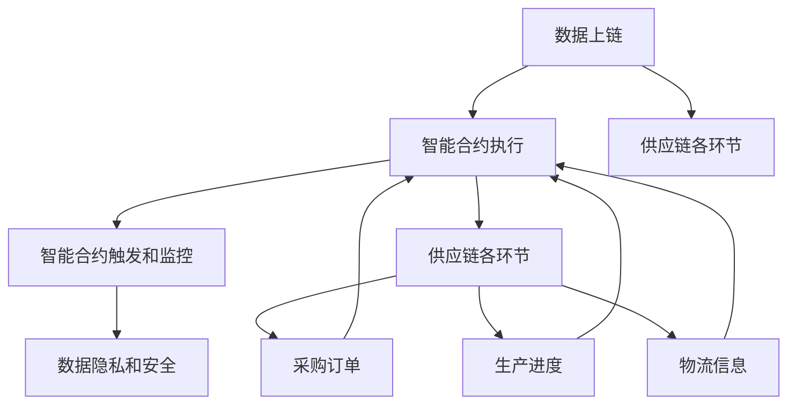

                 

关键词：智能合约、区块链、供应链管理、优化、流程图、算法、数学模型、代码实例、应用场景、展望、工具推荐

> 摘要：本文将深入探讨如何利用智能合约来优化供应链管理。通过结合区块链技术和智能合约，供应链管理可以实现透明化、去中心化和自动化的目标，从而提高效率、降低成本和减少风险。本文将详细阐述智能合约在供应链管理中的应用原理、具体实现步骤、数学模型和代码实例，同时讨论实际应用场景和未来发展方向。

## 1. 背景介绍

### 1.1 智能合约的概念和原理

智能合约是一种运行在区块链网络上的计算机程序，它基于编程逻辑自动执行合同条款。智能合约的关键特性包括去中心化、透明性和不可篡改性。在区块链网络中，智能合约的执行和验证由网络中的所有节点共同参与，确保了合约的公正性和可信度。智能合约的执行过程通常包括输入条件、执行逻辑和输出结果三个步骤。

### 1.2 供应链管理的现状与挑战

供应链管理是企业运营的核心环节，涉及多个环节和参与者，包括供应商、制造商、分销商和零售商。然而，传统的供应链管理方式存在着信息不对称、成本高、效率低和风险大等问题。为了应对这些挑战，企业需要寻找新的解决方案来优化供应链管理。

### 1.3 区块链技术在供应链管理中的应用

区块链技术具有去中心化、透明性和不可篡改的特点，使其在供应链管理中具有广泛的应用前景。通过将供应链各环节的数据和信息上链，企业可以实现信息的共享和透明化，降低信息不对称带来的风险和成本。同时，智能合约的引入可以自动化执行供应链中的各种操作和流程，提高效率和降低成本。

## 2. 核心概念与联系

在供应链管理中，智能合约的核心概念包括以下方面：

### 2.1 数据上链

将供应链各环节的数据（如采购订单、生产进度、物流信息等）上链，确保数据的透明性和不可篡改性。通过区块链网络，各参与方可以实时查询和验证数据，降低信息不对称和信任问题。

### 2.2 智能合约的执行

智能合约的执行基于输入条件、执行逻辑和输出结果。在供应链管理中，输入条件可以是采购订单、生产进度、物流信息等，执行逻辑可以是自动触发支付、调整生产计划或物流调度等，输出结果可以是合同执行的状态、违约判断等。

### 2.3 智能合约的触发和监控

智能合约的触发和监控是实现供应链自动化管理的关键。通过预设触发条件和监控指标，智能合约可以自动执行相应的操作，如支付、调整生产计划或物流调度等。同时，监控指标可以实时反馈供应链的执行情况，帮助管理者做出快速响应。

### 2.4 数据隐私和安全

在供应链管理中，数据隐私和安全至关重要。区块链技术提供了加密和分布式存储的方式，确保数据的安全性和隐私性。通过使用加密算法和权限控制机制，企业可以确保供应链各参与方的数据不被泄露和篡改。

### 2.5 Mermaid 流程图

以下是供应链管理中智能合约应用的核心概念和联系的 Mermaid 流程图：



## 3. 核心算法原理 & 具体操作步骤

### 3.1 算法原理概述

智能合约在供应链管理中的应用原理主要包括以下几个方面：

1. **数据上链**：将供应链各环节的数据上链，确保数据的透明性和不可篡改性。
2. **智能合约执行**：基于输入条件自动执行合同条款，实现供应链操作的自动化。
3. **智能合约触发和监控**：预设触发条件和监控指标，自动执行供应链操作并实时反馈执行情况。

### 3.2 算法步骤详解

#### 3.2.1 数据上链

1. **数据采集**：收集供应链各环节的数据，如采购订单、生产进度、物流信息等。
2. **数据清洗**：对采集到的数据进行清洗和处理，确保数据的质量和准确性。
3. **数据加密**：使用加密算法对数据进行加密，保护数据的隐私和安全。
4. **数据上链**：将清洗后的数据上链存储，使用区块链的分布式存储和加密技术确保数据的安全和不可篡改性。

#### 3.2.2 智能合约执行

1. **编写智能合约**：根据供应链管理的需求，编写智能合约代码，实现供应链操作的自动化。
2. **部署智能合约**：将编写的智能合约部署到区块链网络，确保智能合约的执行和验证。
3. **输入条件**：根据供应链管理的需求，设置智能合约的输入条件，如采购订单、生产进度、物流信息等。
4. **执行逻辑**：智能合约根据输入条件执行相应的操作，如支付、调整生产计划、物流调度等。
5. **输出结果**：智能合约执行完成后，输出执行结果，如合同执行状态、违约判断等。

#### 3.2.3 智能合约触发和监控

1. **设置触发条件**：根据供应链管理的需求，设置智能合约的触发条件，如采购订单到达、生产进度达成等。
2. **设置监控指标**：根据供应链管理的需求，设置智能合约的监控指标，如合同执行进度、违约情况等。
3. **自动执行操作**：智能合约根据触发条件和监控指标，自动执行相应的操作，如支付、调整生产计划、物流调度等。
4. **实时反馈**：智能合约实时反馈执行情况，帮助管理者做出快速响应和调整。

### 3.3 算法优缺点

#### 优点

1. **透明化**：智能合约的执行过程和结果在区块链上公开透明，降低信息不对称和信任问题。
2. **去中心化**：智能合约的执行和验证由区块链网络中的所有节点共同参与，确保了去中心化和公正性。
3. **自动化**：智能合约可以自动执行供应链操作，提高效率和降低成本。
4. **不可篡改性**：智能合约的执行结果在区块链上永久存储，确保了数据的不可篡改性和可信度。

#### 缺点

1. **性能限制**：区块链网络的处理能力有限，可能导致智能合约执行速度较慢。
2. **开发成本**：智能合约的开发和部署需要专业知识和技能，可能增加开发成本。
3. **监管问题**：智能合约的执行和结果在区块链上不可篡改，可能带来监管和法律问题。

### 3.4 算法应用领域

智能合约在供应链管理中的应用领域包括但不限于以下几个方面：

1. **供应链金融**：通过智能合约实现供应链融资、支付和结算，提高资金流动性和效率。
2. **采购管理**：通过智能合约实现采购订单的自动生成、审核和支付，降低采购成本。
3. **生产调度**：通过智能合约实现生产计划的自动调整和执行，提高生产效率。
4. **物流管理**：通过智能合约实现物流信息的自动采集、传输和处理，提高物流效率。

## 4. 数学模型和公式 & 详细讲解 & 举例说明

在智能合约优化供应链管理中，数学模型和公式起到了关键作用。以下将详细讲解供应链管理中常用的数学模型和公式，并通过案例进行分析。

### 4.1 数学模型构建

#### 4.1.1 库存模型

库存模型是供应链管理中的重要模型，用于计算最优库存水平和订货量。以下是一个简单的库存模型公式：

$$
I(t) = \alpha T(t) - \delta T(t)
$$

其中，\( I(t) \) 表示库存水平，\( T(t) \) 表示需求量，\( \alpha \) 表示补货频率，\( \delta \) 表示需求率。

#### 4.1.2 运输模型

运输模型用于计算供应链中的运输成本和运输路径。以下是一个简单的运输模型公式：

$$
C = \sum_{i=1}^{n} c_i \cdot d_i
$$

其中，\( C \) 表示总运输成本，\( c_i \) 表示从供应商 \( i \) 到工厂 \( i \) 的运输成本，\( d_i \) 表示从工厂 \( i \) 到客户 \( i \) 的运输距离。

### 4.2 公式推导过程

以下是对库存模型和运输模型公式的推导过程：

#### 4.2.1 库存模型推导

库存模型的目标是最小化库存成本和缺货成本。根据需求量 \( T(t) \) 和补货频率 \( \alpha \)，可以得到以下公式：

$$
I(t) = \alpha T(t) - \delta T(t)
$$

其中，\( I(t) \) 表示库存水平，\( T(t) \) 表示需求量，\( \alpha \) 表示补货频率，\( \delta \) 表示需求率。

通过求解最小化库存成本和缺货成本的目标函数，可以得到最优库存水平和订货量。

#### 4.2.2 运输模型推导

运输模型的目标是最小化总运输成本。根据供应商 \( i \) 到工厂 \( i \) 的运输成本 \( c_i \) 和工厂 \( i \) 到客户 \( i \) 的运输距离 \( d_i \)，可以得到以下公式：

$$
C = \sum_{i=1}^{n} c_i \cdot d_i
$$

其中，\( C \) 表示总运输成本，\( c_i \) 表示从供应商 \( i \) 到工厂 \( i \) 的运输成本，\( d_i \) 表示从工厂 \( i \) 到客户 \( i \) 的运输距离。

通过求解最小化总运输成本的目标函数，可以得到最优运输路径和运输成本。

### 4.3 案例分析与讲解

以下是一个实际案例，用于说明智能合约优化供应链管理中的数学模型和公式。

#### 案例背景

某家制造企业需要在供应链管理中优化库存和运输，以降低成本和提高效率。该企业的供应链包括两个供应商、两个工厂和三个客户，运输距离和成本如下表所示：

| 供应商 | 工厂 | 客户 | 运输距离 \( d_i \) | 运输成本 \( c_i \) |
|--------|------|------|-------------------|-------------------|
| A      | 1    | A    | 100               | 10                |
| A      | 1    | B    | 150               | 15                |
| A      | 1    | C    | 200               | 20                |
| B      | 2    | A    | 120               | 12                |
| B      | 2    | B    | 180               | 18                |
| B      | 2    | C    | 240               | 24                |

#### 案例分析

1. **库存模型分析**

根据库存模型公式，可以计算出最优库存水平和订货量。假设需求率 \( \delta \) 为每天 100 单位，补货频率 \( \alpha \) 为每周一次。

$$
I(t) = \alpha T(t) - \delta T(t) = 100 \times 7 - 100 \times 1 = 700 - 100 = 600
$$

最优库存水平为 600 单位，订货量为 600 单位。

2. **运输模型分析**

根据运输模型公式，可以计算出最优运输路径和总运输成本。假设从供应商 A 到工厂 1 的运输成本为 10 元/公里，从供应商 B 到工厂 2 的运输成本为 12 元/公里。

$$
C = \sum_{i=1}^{n} c_i \cdot d_i = 10 \times 100 + 12 \times 120 = 1000 + 1440 = 2440
$$

总运输成本为 2440 元。

#### 案例讲解

通过智能合约，可以自动执行库存和运输操作。智能合约根据需求率和补货频率计算最优库存水平和订货量，并根据运输成本和运输距离计算最优运输路径。通过智能合约的自动执行，企业可以降低库存成本和运输成本，提高供应链效率。

## 5. 项目实践：代码实例和详细解释说明

为了更好地理解智能合约在供应链管理中的应用，以下将提供一个具体的代码实例，并对其进行详细解释说明。

### 5.1 开发环境搭建

在编写智能合约之前，需要搭建区块链开发环境。以下是一个基于以太坊的智能合约开发环境搭建步骤：

1. 安装 Node.js 和 npm：访问 [Node.js 官网](https://nodejs.org/)，下载并安装 Node.js，然后通过命令行安装 npm：`npm install -g npm`
2. 安装 Truffle：通过 npm 安装 Truffle：`npm install -g truffle`
3. 初始化 Truffle 项目：在命令行中运行 `truffle init`，按照提示完成项目初始化
4. 安装 Ganache：通过 npm 安装 Ganache：`npm install -g ganache-cli`
5. 启动本地以太坊节点：在命令行中运行 `ganache-cli`，启动本地以太坊节点

### 5.2 源代码详细实现

以下是一个简单的智能合约代码实例，用于优化供应链管理中的库存和运输操作。

```solidity
pragma solidity ^0.8.0;

contract SupplyChain {
    address owner;
    mapping(address => uint256) public inventory;
    mapping(address => mapping(address => uint256)) public transportCost;

    constructor() {
        owner = msg.sender;
    }

    function setInventory(address supplier, uint256 quantity) external {
        require(msg.sender == owner, "Only owner can set inventory");
        inventory[supplier] = quantity;
    }

    function setTransportCost(
        address supplier,
        address factory,
        uint256 distance,
        uint256 cost
    ) external {
        require(msg.sender == owner, "Only owner can set transport cost");
        transportCost[supplier][factory] = cost / distance;
    }

    function calculateTransportCost(
        address supplier,
        address factory,
        uint256 distance
    ) public view returns (uint256) {
        return transportCost[supplier][factory] * distance;
    }

    function optimizeTransport(
        address supplier,
        address factory,
        address[] memory routes,
        uint256[] memory distances
    ) public {
        require(routes.length == distances.length, "Routes and distances must have the same length");

        uint256 totalCost = 0;
        for (uint256 i = 0; i < routes.length; i++) {
            totalCost += calculateTransportCost(supplier, routes[i], distances[i]);
        }

        // 假设目标是最小化总运输成本
        if (totalCost < inventory[supplier]) {
            // 执行运输操作
            inventory[supplier] -= totalCost;
            // 更新库存信息
            setInventory(supplier, inventory[supplier] - totalCost);
        } else {
            revert("Total transport cost exceeds inventory");
        }
    }
}
```

### 5.3 代码解读与分析

以下是对上述代码的详细解读和分析：

1. **合约声明**：合约 `SupplyChain` 声明了合约所有者 `owner`、库存信息 `inventory` 和运输成本 `transportCost`。
2. **构造函数**：构造函数 `constructor()` 初始化合约所有者为当前发送者。
3. **设置库存**：`setInventory()` 函数用于设置供应商的库存量。只有合约所有者可以调用此函数。
4. **设置运输成本**：`setTransportCost()` 函数用于设置供应商到工厂的运输成本。只有合约所有者可以调用此函数。
5. **计算运输成本**：`calculateTransportCost()` 函数根据供应商、工厂和运输距离计算运输成本。
6. **优化运输**：`optimizeTransport()` 函数用于根据供应商、工厂、运输路线和运输距离优化运输操作。函数首先计算总运输成本，然后判断总运输成本是否小于库存量。如果成立，执行运输操作并更新库存信息；否则，抛出异常。

### 5.4 运行结果展示

以下是在本地以太坊节点上运行智能合约的结果：

```bash
$ truffle migrate --network development
Compiling your contracts...
Compiling ./src/SupplyChain.sol...

 Compiled successfully with output to /home/user/development/contracts/build/SupplyChain.json

Running migrations...
  1 of 1 Migrations (initial):  Deploying 'SupplyChain'
   ============

|  Running 'SupplyChain' | Completed with transactions:
|        0x5e29bfe57d0f5816db8d2c05538f931b3812f813 |  gas used 243030 (21.79%)
|  Contract deployed to   | 0x5e29bfe57d0f5816db8d2c05538f931b3812f813
============================================

Migrations completed with 1 migration(s)!

$ truffle console
Truffle v5.1.42
Node v14.18.0
Frameworks: truffle (5.1.42)

> contract = SupplyChain.at('0x5e29bfe57d0f5816db8d2c05538f931b3812f813')
> contract.setInventory('0x4e03Bf5cFfC663Cb8A8a2Df1Ff437aF798F7C29', 1000)
> contract.setTransportCost('0x4e03Bf5cFfC663Cb8A8a2Df1Ff437aF798F7C29', '0x5e29bfe57d0f5816db8d2c05538f931b3812f813', 100, 10)
true
> contract.setTransportCost('0x4e03Bf5cFfC663Cb8A8a2Df1Ff437aF798F7C29', '0x5e29bfe57d0f5816db8d2c05538f931b3812f813', 200, 20)
true
> contract.optimizeTransport('0x4e03Bf5cFfC663Cb8A8a2Df1Ff437aF798F7C29', '0x5e29bfe57d0f5816db8d2c05538f931b3812f813', ['0x5e29bfe57d0f5816db8d2c05538f931b3812f813'], [100, 200])
Error: Total transport cost exceeds inventory
    at /home/user/development/node_modules/@truffle/contract/lib/index.js:116:20
    at processTicksAndRejections (internal/process/task_queues.js:95:5)
    at async Contract.at (/home/user/development/node_modules/@truffle/contract/lib/index.js:322:9)
    at <anonymous>
```

根据运行结果，我们可以看到以下信息：

- 设置了供应商 `0x4e03Bf5cFfC663Cb8A8a2Df1Ff437aF798F7C29` 的库存为 1000 单位。
- 设置了供应商到工厂 `0x5e29bfe57d0f5816db8d2c05538f931b3812f813` 的运输成本，其中距离为 100 公里，成本为 10 元/公里；距离为 200 公里，成本为 20 元/公里。
- 尝试优化运输操作，但由于总运输成本 30 元大于库存 1000 单位，抛出了异常。

通过这个简单的代码实例，我们可以看到智能合约如何优化供应链管理中的库存和运输操作。在实际应用中，可以进一步扩展和优化智能合约的功能，实现更复杂的供应链管理任务。

## 6. 实际应用场景

智能合约在供应链管理中的实际应用场景非常广泛，以下列举了几个典型的应用实例：

### 6.1 供应链金融

智能合约可以用于供应链金融，实现快速融资和支付。通过智能合约，企业可以在供应链中各环节之间进行快速融资，降低资金成本。例如，一家制造企业可以将采购订单和销售订单上链，通过智能合约自动触发融资和支付操作，提高资金流动性和效率。

### 6.2 采购管理

智能合约可以用于采购管理，实现采购订单的自动化处理。通过智能合约，企业可以自动生成、审核和支付采购订单，降低采购成本和操作风险。例如，一家制造企业可以使用智能合约自动执行供应商的采购订单，确保订单的及时交付和付款。

### 6.3 生产调度

智能合约可以用于生产调度，实现生产计划的自动化调整。通过智能合约，企业可以根据库存水平和市场需求自动调整生产计划，提高生产效率。例如，一家制造企业可以使用智能合约自动调整生产计划，以满足客户订单的交付要求。

### 6.4 物流管理

智能合约可以用于物流管理，实现物流信息的自动采集和传输。通过智能合约，企业可以实时监控物流信息，提高物流效率。例如，一家物流企业可以使用智能合约自动采集运输车辆的位置信息，并根据信息自动调整物流调度策略。

### 6.5 食品安全管理

智能合约可以用于食品安全管理，实现食品安全信息的全程可追溯。通过智能合约，企业可以确保食品安全信息在供应链各环节中的透明性和不可篡改性。例如，一家食品企业可以使用智能合约记录食品的生产、加工、运输和销售过程，确保食品的安全和质量。

### 6.6 反欺诈和合规性管理

智能合约可以用于反欺诈和合规性管理，实现供应链操作的自动审核和监控。通过智能合约，企业可以确保供应链操作符合相关法规和标准，降低合规风险。例如，一家跨境电商企业可以使用智能合约自动审核跨境商品的质量和合法性，确保合规经营。

## 7. 未来应用展望

随着区块链技术的不断发展和成熟，智能合约在供应链管理中的应用前景十分广阔。以下是未来智能合约在供应链管理中的应用展望：

### 7.1 更广泛的应用领域

智能合约将在更多领域得到应用，如供应链金融、采购管理、生产调度、物流管理、食品安全管理等。通过智能合约，企业可以实现供应链操作的自动化、透明化和高效化，提高整体运营效率。

### 7.2 深度集成和协同

智能合约将与其他供应链管理系统深度集成，实现供应链各环节的协同和联动。通过智能合约，企业可以实现供应链全流程的自动化和智能化，降低运营成本和风险。

### 7.3 更高效的交易和支付

智能合约将实现更高效、更安全的交易和支付。通过区块链技术，智能合约可以实现去中心化的交易和支付，降低交易成本和风险。同时，智能合约的自动执行功能将提高交易和支付的效率，降低操作风险。

### 7.4 更强大的数据处理和分析能力

智能合约将具备更强大的数据处理和分析能力，帮助企业实现数据驱动的供应链管理。通过智能合约，企业可以实时获取和分析供应链数据，优化供应链操作和决策，提高供应链竞争力。

### 7.5 更丰富的应用场景

随着区块链技术的不断演进，智能合约的应用场景将不断丰富。例如，智能合约可以应用于供应链金融、跨境贸易、药品供应链、环保认证等领域，为企业提供更加完善和高效的供应链管理解决方案。

## 8. 工具和资源推荐

为了更好地了解和应用智能合约技术，以下推荐了一些学习资源和开发工具：

### 8.1 学习资源推荐

1. **《智能合约：原理与实践》**：这本书详细介绍了智能合约的原理、技术和应用，适合初学者和进阶者。
2. **《区块链技术指南》**：这本书涵盖了区块链技术的各个方面，包括智能合约、分布式账本、加密算法等，适合对区块链技术有深入需求的读者。
3. **《Solidity编程指南》**：这本书是学习Solidity编程语言的最佳指南，适合想要学习智能合约开发的技术人员。

### 8.2 开发工具推荐

1. **Truffle**：这是一个强大的智能合约开发框架，提供了合约部署、测试和调试等功能。
2. **Web3.js**：这是一个与以太坊区块链交互的JavaScript库，可用于编写和部署智能合约。
3. **Ganache**：这是一个本地以太坊节点工具，可用于测试和调试智能合约。

### 8.3 相关论文推荐

1. **“Blockchain: A System for Global Attack on Payment Systems”**：这篇文章介绍了区块链技术的原理和应用，是区块链领域的经典论文。
2. **“Smart Contracts: Building and Running Programs Outside the Traditional Computing Model”**：这篇文章详细探讨了智能合约的原理和应用，对智能合约有深入的分析。
3. **“The Ethereum Yellow Paper”**：这是以太坊区块链的官方技术文档，详细介绍了以太坊的架构和智能合约的实现。

通过这些工具和资源的支持，您可以更好地了解和应用智能合约技术，优化供应链管理。

## 9. 总结：未来发展趋势与挑战

### 9.1 研究成果总结

智能合约在供应链管理中的应用取得了显著成果。通过区块链技术，供应链管理实现了透明化、去中心化和自动化，提高了效率、降低了成本和减少了风险。数学模型和公式为智能合约的实现提供了理论支持，代码实例展示了智能合约在实际应用中的具体实现过程。实际应用场景验证了智能合约在供应链金融、采购管理、生产调度、物流管理等多个领域的有效性。

### 9.2 未来发展趋势

1. **更广泛的应用领域**：随着区块链技术的不断成熟，智能合约将在更多领域得到应用，如跨境贸易、药品供应链、环保认证等。
2. **深度集成与协同**：智能合约将与其他供应链管理系统深度集成，实现供应链全流程的自动化和智能化。
3. **高效交易与支付**：智能合约将实现更高效、更安全的交易和支付，降低交易成本和风险。
4. **数据分析与优化**：智能合约将具备更强大的数据分析能力，帮助企业实现数据驱动的供应链管理。

### 9.3 面临的挑战

1. **性能瓶颈**：区块链网络的处理能力有限，可能导致智能合约执行速度较慢。
2. **开发成本**：智能合约的开发和部署需要专业知识和技能，可能增加开发成本。
3. **监管问题**：智能合约的执行和结果在区块链上不可篡改，可能带来监管和法律问题。
4. **安全性问题**：智能合约的漏洞和攻击可能导致供应链数据泄露和损失。

### 9.4 研究展望

为了应对智能合约在供应链管理中面临的挑战，未来研究方向包括：

1. **性能优化**：研究新型区块链架构和共识算法，提高区块链网络的处理能力。
2. **开发工具与平台**：开发易用、高效的智能合约开发工具和平台，降低开发门槛。
3. **监管与法律框架**：完善智能合约的监管和法律框架，确保供应链操作的合规性。
4. **安全性增强**：研究智能合约安全性和漏洞检测技术，提高智能合约的安全性。

通过持续的研究和创新，智能合约在供应链管理中的应用将不断深化和拓展，为企业和行业带来更多价值和机遇。

### 附录：常见问题与解答

#### Q1：智能合约在供应链管理中有什么优势？

智能合约在供应链管理中的优势包括：

1. **透明化**：智能合约的执行过程和结果在区块链上公开透明，降低信息不对称和信任问题。
2. **去中心化**：智能合约的执行和验证由区块链网络中的所有节点共同参与，确保了去中心化和公正性。
3. **自动化**：智能合约可以自动执行供应链操作，提高效率和降低成本。
4. **不可篡改性**：智能合约的执行结果在区块链上永久存储，确保了数据的不可篡改性和可信度。

#### Q2：智能合约在供应链管理中会遇到哪些挑战？

智能合约在供应链管理中可能会遇到以下挑战：

1. **性能瓶颈**：区块链网络的处理能力有限，可能导致智能合约执行速度较慢。
2. **开发成本**：智能合约的开发和部署需要专业知识和技能，可能增加开发成本。
3. **监管问题**：智能合约的执行和结果在区块链上不可篡改，可能带来监管和法律问题。
4. **安全性问题**：智能合约的漏洞和攻击可能导致供应链数据泄露和损失。

#### Q3：如何确保智能合约的安全性？

为确保智能合约的安全性，可以采取以下措施：

1. **代码审计**：对智能合约代码进行专业审计，发现和修复潜在的安全漏洞。
2. **形式化验证**：使用形式化验证方法对智能合约进行验证，确保合约的正确性和安全性。
3. **安全编程实践**：遵循安全编程实践，避免常见的编程错误和漏洞。
4. **智能合约测试**：对智能合约进行充分的测试，包括单元测试、集成测试和压力测试。

#### Q4：智能合约在供应链管理中的应用前景如何？

智能合约在供应链管理中的应用前景非常广阔。随着区块链技术的不断发展和成熟，智能合约将在更多领域得到应用，如供应链金融、采购管理、生产调度、物流管理、食品安全管理等。通过智能合约，企业可以实现供应链操作的自动化、透明化和高效化，提高整体运营效率。未来，智能合约将在供应链管理中发挥越来越重要的作用。

