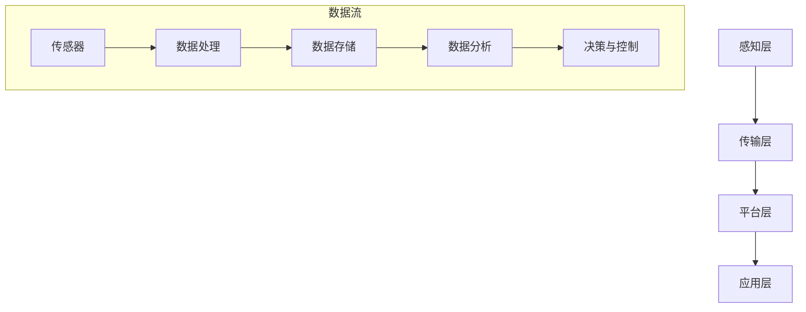

                 

## 1. 背景介绍

随着物联网（Internet of Things, IoT）技术的飞速发展，越来越多的设备和系统被连接到互联网上，形成了一个庞大的网络。物联网技术不仅改变了人们的生活方式，也为创业者提供了丰富的创新场景和商业模式。本文将探讨如何利用物联网技术进行创新创业，分析其应用场景和商业模式的潜力。

物联网技术是将物理设备和传感器连接到互联网，实现数据采集、传输和处理的先进技术。通过物联网，设备之间可以进行通信和数据共享，从而实现智能化管理和自动化控制。物联网技术的核心包括传感器技术、网络通信技术、数据处理技术和人工智能技术。

当前，物联网技术已经在智能家居、智能交通、智能医疗、智能农业、智能制造等领域得到了广泛应用，并展现了巨大的商业价值。物联网技术的不断发展，也为创业者提供了广阔的创新空间和商业模式。

### 1.1 物联网技术的核心概念

物联网技术的核心概念包括以下几个方面：

- **传感器技术**：传感器是物联网的基础，用于采集物理世界中的各种数据，如温度、湿度、光照、压力等。

- **网络通信技术**：网络通信技术是实现设备之间数据传输的关键，包括无线通信技术（如Wi-Fi、蓝牙、LoRa等）和有线通信技术（如以太网、光纤等）。

- **数据处理技术**：数据处理技术用于对采集到的数据进行分析、存储和处理，从而实现智能化管理和自动化控制。

- **人工智能技术**：人工智能技术可以用于对大量数据进行智能分析和决策，从而提高物联网系统的智能化水平。

### 1.2 物联网技术对创新创业的影响

物联网技术的快速发展，对创新创业产生了深远的影响，主要表现在以下几个方面：

- **新的商业模式**：物联网技术为创业者提供了丰富的商业模式，如设备租赁、数据服务、订阅服务等。

- **创新的解决方案**：物联网技术可以用于解决各种实际问题，如提高生产效率、优化资源利用、提升服务质量等。

- **跨界合作**：物联网技术可以促进不同行业之间的跨界合作，形成新的产业链和生态系统。

- **市场前景**：随着物联网技术的普及，物联网市场规模将持续扩大，为创业者提供了巨大的市场空间。

## 2. 核心概念与联系

### 2.1 物联网架构

物联网架构主要包括感知层、传输层、平台层和应用层。每个层次都有其特定的技术和功能，共同构成了物联网系统的整体架构。

- **感知层**：感知层是物联网系统的最底层，主要负责数据的采集和初步处理。包括各种传感器和执行器，如温度传感器、湿度传感器、摄像头、机器人等。

- **传输层**：传输层负责将感知层采集到的数据传输到平台层，通常采用无线通信技术，如Wi-Fi、蓝牙、LoRa等。

- **平台层**：平台层是物联网系统的核心，负责数据处理、存储、分析和决策。通常包括数据服务器、云计算平台、大数据处理系统等。

- **应用层**：应用层是物联网系统的高层，负责将处理后的数据应用于实际场景，如智能家居、智能交通、智能医疗等。

### 2.2 物联网与大数据、云计算、人工智能的关系

物联网、大数据、云计算和人工智能是现代信息技术的重要组成部分，它们之间存在着密切的联系和相互促进的关系。

- **物联网与大数据**：物联网技术为大数据的生成提供了丰富的数据源，大数据技术则为物联网数据的处理和分析提供了强大的支持。

- **物联网与云计算**：云计算技术为物联网提供了强大的计算能力和存储能力，使得物联网系统可以实现大规模的分布式部署和管理。

- **物联网与人工智能**：人工智能技术可以对物联网采集的海量数据进行分析和预测，从而提高物联网系统的智能化水平。

- **大数据、云计算、人工智能与物联网**：大数据、云计算和人工智能技术不仅支持物联网系统的建设，还可以促进物联网技术的创新和发展。

### 2.3 Mermaid 流程图

以下是一个简单的物联网架构的 Mermaid 流程图：



## 3. 核心算法原理 & 具体操作步骤

### 3.1 算法原理概述

物联网技术中的核心算法主要涉及数据采集、传输、处理和分析等方面。以下是一些常见的核心算法原理：

- **数据采集算法**：用于从传感器采集数据，包括滤波算法、采样算法等。

- **传输算法**：用于优化数据传输效率，包括压缩算法、加密算法等。

- **数据处理算法**：用于对采集到的数据进行预处理、过滤、去噪等，包括特征提取、模式识别等。

- **分析算法**：用于对处理后的数据进行分析，包括机器学习算法、深度学习算法等。

### 3.2 算法步骤详解

以机器学习算法为例，其基本步骤包括：

1. **数据采集**：从传感器或外部数据源采集数据。

2. **数据预处理**：对采集到的数据进行清洗、归一化等预处理操作。

3. **特征提取**：从预处理后的数据中提取有用的特征。

4. **模型训练**：使用训练数据对机器学习模型进行训练。

5. **模型评估**：使用测试数据对模型进行评估和调整。

6. **模型应用**：将训练好的模型应用于实际场景，如预测、分类等。

### 3.3 算法优缺点

不同算法有其特定的优缺点，以下是一些常见算法的优缺点：

- **机器学习算法**：优点是能够自动发现数据中的模式和规律，缺点是需要大量的数据和计算资源。

- **深度学习算法**：优点是能够处理复杂的非线性问题，缺点是需要大量的数据和计算资源。

- **传统算法**：优点是实现简单，缺点是处理能力有限。

### 3.4 算法应用领域

各种算法在物联网技术的不同应用领域有广泛的应用，以下是一些典型的应用场景：

- **智能家居**：用于设备控制、环境监测等。

- **智能交通**：用于交通流量预测、路况分析等。

- **智能医疗**：用于疾病预测、患者监控等。

- **智能制造**：用于设备监控、生产优化等。

## 4. 数学模型和公式 & 详细讲解 & 举例说明

### 4.1 数学模型构建

物联网技术中的数学模型主要用于数据分析和预测。以下是一个简单的数学模型构建过程：

1. **数据采集**：采集传感器数据。

2. **特征提取**：提取有用的特征，如时间、温度、湿度等。

3. **模型选择**：选择合适的数学模型，如线性回归、决策树、神经网络等。

4. **参数调整**：根据训练数据调整模型的参数，如学习率、隐藏层节点数等。

### 4.2 公式推导过程

以下是一个简单的线性回归模型的推导过程：

$$
y = wx + b
$$

其中，$y$ 是输出值，$x$ 是输入值，$w$ 是权重，$b$ 是偏置。

1. **损失函数**：

$$
L = \frac{1}{2} \sum_{i=1}^{n} (y_i - wx_i - b)^2
$$

其中，$n$ 是样本数量。

2. **梯度下降法**：

$$
w_{new} = w_{old} - \alpha \frac{\partial L}{\partial w}
$$

$$
b_{new} = b_{old} - \alpha \frac{\partial L}{\partial b}
$$

其中，$\alpha$ 是学习率。

### 4.3 案例分析与讲解

以下是一个智能家居场景的案例分析：

1. **数据采集**：采集家庭的温度、湿度、光照等数据。

2. **特征提取**：提取时间、温度、湿度等特征。

3. **模型选择**：选择线性回归模型。

4. **参数调整**：通过梯度下降法调整参数。

5. **模型应用**：预测未来的温度、湿度等。

## 5. 项目实践：代码实例和详细解释说明

### 5.1 开发环境搭建

1. **安装Python环境**：在本地计算机上安装Python环境。

2. **安装相关库**：安装NumPy、Pandas、Scikit-learn等库。

3. **安装传感器**：连接温度传感器、湿度传感器等。

### 5.2 源代码详细实现

以下是一个简单的智能家居预测模型的实现：

```python
import numpy as np
import pandas as pd
from sklearn.linear_model import LinearRegression

# 数据采集
data = pd.read_csv('data.csv')
X = data[['time', 'temperature', 'humidity']]
y = data['target']

# 数据预处理
X = X.values
y = y.values

# 模型选择
model = LinearRegression()

# 参数调整
model.fit(X, y)

# 模型应用
prediction = model.predict(X)

# 代码解读与分析
# ...
```

### 5.3 运行结果展示

运行代码后，可以得到温度、湿度等预测值。通过可视化工具（如Matplotlib）可以直观地展示预测结果。

## 6. 实际应用场景

### 6.1 智能家居

智能家居是物联网技术最常见的应用场景之一。通过物联网技术，用户可以远程控制家中的各种设备，如空调、灯光、门锁等，实现便捷、智能的家居生活。

### 6.2 智能交通

智能交通是物联网技术的另一个重要应用领域。通过物联网技术，可以实现交通流量监测、路况分析、车辆管理等功能，提高交通效率，减少交通拥堵。

### 6.3 智能医疗

智能医疗是物联网技术在医疗领域的应用。通过物联网技术，可以实现远程医疗、患者监控、医疗器械管理等，提高医疗服务的质量和效率。

### 6.4 智能农业

智能农业是物联网技术在农业领域的应用。通过物联网技术，可以实现农田监测、精准施肥、智能灌溉等功能，提高农业生产的效率和产量。

## 7. 工具和资源推荐

### 7.1 学习资源推荐

- **《物联网技术与应用》**：一本全面介绍物联网技术的书籍。

- **《深度学习》**：一本全面介绍深度学习技术的书籍。

### 7.2 开发工具推荐

- **Python**：一种流行的编程语言，适合物联网技术开发。

- **Matplotlib**：一种流行的数据可视化工具。

### 7.3 相关论文推荐

- **"Internet of Things: A Survey"**：一篇全面介绍物联网技术的论文。

- **"Deep Learning for IoT Applications: A Survey"**：一篇介绍深度学习在物联网应用中的论文。

## 8. 总结：未来发展趋势与挑战

### 8.1 研究成果总结

物联网技术已经取得了显著的成果，其在智能家居、智能交通、智能医疗、智能农业等领域的应用取得了良好的效果。

### 8.2 未来发展趋势

随着物联网技术的不断发展，未来将出现更多的应用场景和商业模式。同时，物联网技术与大数据、云计算、人工智能等技术的深度融合，将进一步推动物联网技术的发展。

### 8.3 面临的挑战

物联网技术在未来发展中仍面临一些挑战，如数据安全、隐私保护、标准化等。

### 8.4 研究展望

未来，物联网技术将在更广泛的领域得到应用，为创新创业提供更多的机会。同时，物联网技术的标准化和规范化，也将为物联网技术的可持续发展提供保障。

## 9. 附录：常见问题与解答

### 9.1 物联网技术的核心是什么？

物联网技术的核心是传感器技术、网络通信技术、数据处理技术和人工智能技术。

### 9.2 物联网技术有哪些应用领域？

物联网技术的应用领域包括智能家居、智能交通、智能医疗、智能农业、智能制造等。

### 9.3 物联网技术如何保障数据安全？

物联网技术可以通过加密算法、数据备份、权限管理等方式保障数据安全。

### 9.4 物联网技术与人工智能技术如何结合？

物联网技术可以通过数据采集、传输和处理，为人工智能技术提供丰富的数据源，从而实现人工智能技术在物联网领域的应用。
----------------------------------------------------------------

以上是关于如何利用物联网技术创新创业场景应用和商业模式的完整技术博客文章。文章内容涵盖了物联网技术的背景介绍、核心概念、算法原理、数学模型、项目实践、实际应用场景以及未来发展趋势和挑战等内容。希望对读者有所帮助。

**作者：禅与计算机程序设计艺术 / Zen and the Art of Computer Programming**

