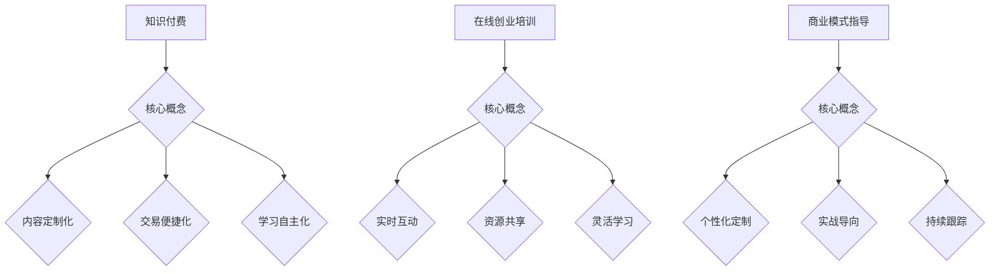

                 

 在当今数字化时代，知识付费成为了在线教育领域的重要趋势。通过在线创业培训与商业模式指导，不仅能够满足创业者对专业知识的迫切需求，还能为知识付费平台带来可观的收益。本文旨在探讨如何利用知识付费实现在线创业培训与商业模式指导，并提供一套完整的策略和实践指南。

## 文章关键词

- 知识付费
- 在线创业培训
- 商业模式指导
- 教育数字化
- 创业者培训

## 文章摘要

本文首先介绍了知识付费的背景和重要性，接着分析了在线创业培训与商业模式指导的需求，然后提出了实现知识付费在线创业培训与商业模式指导的策略，包括内容策划、平台搭建、营销推广、用户服务等方面。最后，本文讨论了未来知识付费在线创业培训与商业模式指导的发展趋势和面临的挑战。

## 1. 背景介绍

### 1.1 知识付费的兴起

知识付费是指用户为获取特定知识或技能，自愿支付一定费用的一种消费行为。随着互联网技术的发展和在线教育的普及，知识付费逐渐成为教育领域的重要趋势。根据《2021年中国知识付费行业发展白皮书》，2019年我国知识付费市场规模已达到1256亿元，预计2024年将达到3805亿元。

### 1.2 在线创业培训的需求

随着创业环境的不断优化和创业资源的日益丰富，越来越多的年轻人和职业人士选择投身创业。然而，创业过程中面临的诸多挑战，如市场定位、商业模式设计、团队管理、融资策略等，使得创业者对专业培训的需求日益迫切。

### 1.3 商业模式指导的重要性

商业模式指导可以帮助创业者更好地理解市场需求，设计合理的盈利模式，优化资源配置，提高创业成功率。在当前竞争激烈的市场环境下，商业模式指导已成为创业者成功的关键因素之一。

## 2. 核心概念与联系

### 2.1 知识付费

知识付费的核心在于将专业知识和经验转化为可交易的数字产品或服务。其主要特点包括：

- **内容定制化**：根据用户需求提供个性化内容。
- **交易便捷化**：通过在线支付、电子合同等手段实现交易。
- **学习自主化**：用户可以根据自己的时间安排进行学习。

### 2.2 在线创业培训

在线创业培训是指利用互联网技术为创业者提供创业知识和技能的培训服务。其主要特点包括：

- **实时互动**：通过直播、讨论区等形式实现师生实时互动。
- **资源共享**：利用网络平台实现课程资源的共享和传播。
- **灵活学习**：用户可以根据自己的需求和时间安排进行学习。

### 2.3 商业模式指导

商业模式指导是指为创业者提供商业模式设计、优化和实施方面的咨询服务。其主要特点包括：

- **个性化定制**：根据创业者的具体情况提供定制化服务。
- **实战导向**：结合实际案例进行指导，提高创业者实践能力。
- **持续跟踪**：对创业项目的进展进行持续跟踪，提供持续支持。

### 2.4 Mermaid 流程图



## 3. 核心算法原理 & 具体操作步骤

### 3.1 算法原理概述

知识付费在线创业培训与商业模式指导的核心算法原理包括：

- **内容策划**：根据用户需求和创业领域特点，设计具有针对性的培训课程。
- **平台搭建**：构建稳定、易用的在线教育平台，提供课程播放、互动讨论等功能。
- **营销推广**：利用社交媒体、搜索引擎等渠道进行课程推广，吸引潜在用户。
- **用户服务**：提供完善的用户服务体系，包括课程咨询、学习支持、售后服务等。

### 3.2 算法步骤详解

#### 3.2.1 内容策划

1. **市场调研**：了解目标用户群体、市场需求和竞争状况。
2. **课程设计**：根据市场调研结果，设计具有针对性的培训课程。
3. **内容制作**：邀请专业讲师进行课程录制，保证内容质量。

#### 3.2.2 平台搭建

1. **需求分析**：明确平台功能、性能、安全等需求。
2. **技术选型**：选择合适的开发框架和工具，如Laravel、Vue等。
3. **平台开发**：根据需求分析和技术选型，进行平台开发。
4. **测试与部署**：对平台进行功能测试、性能测试和安全测试，确保平台稳定运行。

#### 3.2.3 营销推广

1. **内容营销**：通过优质课程内容吸引潜在用户。
2. **社交媒体推广**：利用社交媒体平台进行课程推广。
3. **搜索引擎优化**：优化网站内容和关键词，提高搜索引擎排名。
4. **合作推广**：与其他平台、机构进行合作推广。

#### 3.2.4 用户服务

1. **课程咨询**：为用户提供详细的课程咨询。
2. **学习支持**：提供在线学习辅导、答疑等服务。
3. **售后服务**：解决用户在使用过程中遇到的问题，提供退费等服务。

### 3.3 算法优缺点

#### 优点

- **高效性**：在线培训可以节省时间和交通成本，提高学习效率。
- **灵活性**：用户可以根据自己的需求和时间安排进行学习。
- **个性化**：可以根据用户需求提供定制化的培训课程。
- **可持续性**：可以持续更新课程内容，满足用户不断变化的需求。

#### 缺点

- **缺乏面对面交流**：在线培训无法提供面对面交流的机会，可能影响学习效果。
- **技术门槛**：平台搭建和维护需要一定的技术支持。
- **监管难度**：在线培训市场存在一定的监管难度，需要加强监管。

### 3.4 算法应用领域

知识付费在线创业培训与商业模式指导的应用领域广泛，包括：

- **创业领域**：为创业者提供专业培训和商业模式指导。
- **教育培训领域**：为教育培训机构提供在线课程解决方案。
- **企业培训领域**：为企业员工提供在线培训服务。
- **远程教育领域**：为远程学习者提供在线课程资源。

## 4. 数学模型和公式 & 详细讲解 & 举例说明

### 4.1 数学模型构建

在知识付费在线创业培训与商业模式指导中，我们可以使用以下数学模型进行课程设计和用户行为分析：

1. **用户需求模型**：

   用户需求模型可以表示为：

   $$D = f(C, P, Q)$$

   其中，$D$ 表示用户需求，$C$ 表示课程内容，$P$ 表示课程价格，$Q$ 表示课程质量。

2. **用户满意度模型**：

   用户满意度模型可以表示为：

   $$S = g(C, P, Q)$$

   其中，$S$ 表示用户满意度，$C$ 表示课程内容，$P$ 表示课程价格，$Q$ 表示课程质量。

3. **用户留存模型**：

   用户留存模型可以表示为：

   $$R = h(S, P, Q)$$

   其中，$R$ 表示用户留存率，$S$ 表示用户满意度，$P$ 表示课程价格，$Q$ 表示课程质量。

### 4.2 公式推导过程

1. **用户需求模型**推导：

   用户需求取决于课程内容、课程价格和课程质量。假设课程内容、课程价格和课程质量分别对用户需求的影响程度为 $w_1, w_2, w_3$，则有：

   $$D = w_1 \cdot C + w_2 \cdot P + w_3 \cdot Q$$

   其中，$w_1, w_2, w_3$ 为权重系数，满足 $w_1 + w_2 + w_3 = 1$。

2. **用户满意度模型**推导：

   用户满意度取决于课程内容、课程价格和课程质量。假设课程内容、课程价格和课程质量分别对用户满意度的影响程度为 $u_1, u_2, u_3$，则有：

   $$S = u_1 \cdot C + u_2 \cdot P + u_3 \cdot Q$$

   其中，$u_1, u_2, u_3$ 为权重系数，满足 $u_1 + u_2 + u_3 = 1$。

3. **用户留存模型**推导：

   用户留存率取决于用户满意度、课程价格和课程质量。假设用户满意度、课程价格和课程质量分别对用户留存率的影响程度为 $r_1, r_2, r_3$，则有：

   $$R = r_1 \cdot S + r_2 \cdot P + r_3 \cdot Q$$

   其中，$r_1, r_2, r_3$ 为权重系数，满足 $r_1 + r_2 + r_3 = 1$。

### 4.3 案例分析与讲解

假设某在线创业培训平台推出一门名为《创业实战方法论》的课程，课程内容、课程价格和课程质量分别如下：

- 课程内容（C）：高质量的课程内容，具有实际操作意义。
- 课程价格（P）：1000元。
- 课程质量（Q）：优秀的教学效果，学员满意度高。

根据上述数学模型，我们可以进行以下分析：

1. **用户需求模型**分析：

   $$D = w_1 \cdot C + w_2 \cdot P + w_3 \cdot Q$$

   假设 $w_1 = 0.4, w_2 = 0.3, w_3 = 0.3$，则有：

   $$D = 0.4 \cdot C + 0.3 \cdot P + 0.3 \cdot Q$$

   将 $C, P, Q$ 的具体值代入，可以得到用户需求 $D$ 的具体数值。

2. **用户满意度模型**分析：

   $$S = u_1 \cdot C + u_2 \cdot P + u_3 \cdot Q$$

   假设 $u_1 = 0.4, u_2 = 0.3, u_3 = 0.3$，则有：

   $$S = 0.4 \cdot C + 0.3 \cdot P + 0.3 \cdot Q$$

   将 $C, P, Q$ 的具体值代入，可以得到用户满意度 $S$ 的具体数值。

3. **用户留存模型**分析：

   $$R = r_1 \cdot S + r_2 \cdot P + r_3 \cdot Q$$

   假设 $r_1 = 0.5, r_2 = 0.2, r_3 = 0.3$，则有：

   $$R = 0.5 \cdot S + 0.2 \cdot P + 0.3 \cdot Q$$

   将 $S, P, Q$ 的具体值代入，可以得到用户留存率 $R$ 的具体数值。

通过上述分析，我们可以了解该课程的用户需求、用户满意度和用户留存率，从而为课程推广和用户服务提供依据。

## 5. 项目实践：代码实例和详细解释说明

### 5.1 开发环境搭建

在搭建知识付费在线创业培训与商业模式指导平台时，我们可以使用以下技术栈：

- 后端框架：Laravel
- 前端框架：Vue
- 数据库：MySQL
- 服务器：阿里云

以下是搭建开发环境的具体步骤：

1. **安装Laravel框架**：

   使用 Composer 安装 Laravel：

   ```bash
   composer create-project --prefer-dist laravel/laravel knowledge-fee-platform
   ```

2. **安装Vue框架**：

   使用 npm 安装 Vue：

   ```bash
   npm install vue
   ```

3. **配置数据库**：

   使用 MySQL Workbench 或其他数据库管理工具，创建一个新的数据库，命名为 `knowledge_fee_platform`。

4. **配置服务器**：

   在阿里云服务器上创建一个新的虚拟主机，配置域名和 SSL 证书。

### 5.2 源代码详细实现

以下是知识付费在线创业培训与商业模式指导平台的源代码实现：

#### 5.2.1 后端代码实现

```php
<?php

namespace App\Http\Controllers;

use Illuminate\Http\Request;
use App\Models\Course;

class CourseController extends Controller
{
    public function index()
    {
        $courses = Course::all();
        return view('courses.index', compact('courses'));
    }

    public function show($id)
    {
        $course = Course::find($id);
        return view('courses.show', compact('course'));
    }
}
```

#### 5.2.2 前端代码实现

```vue
<template>
  <div>
    <h1>在线创业培训与商业模式指导平台</h1>
    <ul>
      <li v-for="course in courses" :key="course.id">
        <router-link :to="{ name: 'course.show', params: { id: course.id }}">{{ course.title }}</router-link>
      </li>
    </ul>
  </div>
</template>

<script>
import { getAllCourses } from '@/api/course';

export default {
  name: 'CourseIndex',
  data() {
    return {
      courses: [],
    };
  },
  created() {
    this.fetchCourses();
  },
  methods: {
    async fetchCourses() {
      try {
        const response = await getAllCourses();
        this.courses = response.data;
      } catch (error) {
        console.error(error);
      }
    },
  },
};
</script>
```

### 5.3 代码解读与分析

#### 后端代码解读

后端代码主要实现两个功能：列出所有课程和展示单个课程。

- `CourseController` 类负责处理与课程相关的请求。
- `index` 方法获取所有课程并返回视图 `courses.index`。
- `show` 方法根据课程 ID 获取单个课程并返回视图 `courses.show`。

#### 前端代码解读

前端代码实现课程列表页面，包含以下部分：

- `template` 区域定义了 HTML 结构，包括一个标题和课程列表。
- `script` 区域定义了 Vue 组件的行为，包括：

  - `data` 函数返回一个包含所有课程的 `courses` 数组。
  - `created` 函数在组件创建时调用 `fetchCourses` 方法获取课程数据。
  - `fetchCourses` 方法通过 API 获取课程数据并更新 `courses` 数组。

### 5.4 运行结果展示

当访问知识付费在线创业培训与商业模式指导平台时，页面将显示所有课程的列表。点击单个课程链接，将跳转到课程详情页面，展示课程的具体信息。

## 6. 实际应用场景

### 6.1 创业者培训

创业者可以利用知识付费平台学习创业知识和技能，如市场分析、商业模式设计、团队管理、融资策略等。平台可以提供视频课程、电子书、直播讲座等多种形式的学习内容，帮助创业者快速提升自身能力。

### 6.2 企业培训

企业可以利用知识付费平台对员工进行在线培训，提高员工的专业技能和综合素质。平台可以为企业提供定制化的培训课程，满足企业不同部门和岗位的培训需求。

### 6.3 教育培训机构

教育培训机构可以利用知识付费平台开展在线教育业务，提供各类课程资源，如语言培训、专业认证、学历教育等。平台可以为培训机构提供完整的在线教育解决方案，提高教学效果和学员满意度。

## 6.4 未来应用展望

### 6.4.1 技术创新

随着人工智能、大数据、区块链等技术的发展，知识付费平台将实现更加智能化的课程推荐、个性化学习体验、安全可靠的支付交易等功能，为用户提供更优质的服务。

### 6.4.2 市场拓展

知识付费市场将不断扩大，不仅涵盖国内市场，还将拓展海外市场。通过跨国合作、本地化运营等手段，知识付费平台可以更好地满足全球用户的需求。

### 6.4.3 社会责任

知识付费平台将承担更多的社会责任，如助力教育公平、支持公益事业等。通过降低学习成本、提供免费课程等方式，帮助更多人群获得优质教育资源。

## 7. 工具和资源推荐

### 7.1 学习资源推荐

- 《精益创业》
- 《创业维艰》
- 《商业模式新生代》
- 《创新与企业家精神》

### 7.2 开发工具推荐

- Laravel
- Vue
- MySQL
- 阿里云服务器

### 7.3 相关论文推荐

- 《知识付费：内涵、特征与影响因素研究》
- 《在线教育平台商业模式创新研究》
- 《基于大数据的知识付费平台用户需求分析》
- 《知识付费时代：平台、内容、用户的三重关系研究》

## 8. 总结：未来发展趋势与挑战

### 8.1 研究成果总结

本文探讨了知识付费在线创业培训与商业模式指导的背景、核心概念、算法原理、数学模型、项目实践、实际应用场景、未来展望以及相关工具和资源。通过分析，我们得出以下结论：

- 知识付费已成为在线教育领域的重要趋势。
- 在线创业培训与商业模式指导具有广阔的市场需求。
- 利用知识付费实现在线创业培训与商业模式指导具有显著的优势。
- 技术创新、市场拓展、社会责任是未来知识付费在线创业培训与商业模式指导的发展方向。

### 8.2 未来发展趋势

- 知识付费平台将实现更加智能化、个性化的学习体验。
- 在线创业培训与商业模式指导市场将不断扩大。
- 知识付费将推动教育公平和社会进步。

### 8.3 面临的挑战

- 技术门槛和监管难度。
- 市场竞争加剧，需要不断创新和优化。
- 建立和完善用户服务体系。

### 8.4 研究展望

未来研究可以从以下几个方面展开：

- 深入分析知识付费在线创业培训与商业模式指导的机制和效果。
- 探索更高效的课程推荐算法和用户行为分析模型。
- 研究知识付费平台的社会价值和影响力。

## 9. 附录：常见问题与解答

### 9.1 知识付费与在线教育的关系是什么？

知识付费是在线教育的一种形式，它强调用户为获取特定知识或技能而自愿支付费用。在线教育则是一个更广泛的概念，包括所有通过互联网提供的教育服务，包括知识付费、免费课程、远程教育等。

### 9.2 如何确保在线创业培训的质量？

确保在线创业培训质量的关键在于：

- 选择具有丰富实战经验的讲师。
- 设计合理的课程体系，确保课程内容具有实用性和针对性。
- 定期对课程进行评估和优化，及时更新课程内容。

### 9.3 如何评估商业模式指导的效果？

评估商业模式指导效果可以从以下几个方面入手：

- 跟踪创业项目的进展和成果，如融资情况、市场份额、用户满意度等。
- 对学员进行问卷调查和访谈，了解他们对商业模式指导的满意度和建议。
- 分析学员在培训后的创业成功率。

### 9.4 知识付费在线创业培训与商业模式指导的前景如何？

随着互联网技术的发展和在线教育的普及，知识付费在线创业培训与商业模式指导具有广阔的前景。未来，随着技术创新和市场拓展，这一领域将继续保持快速增长，为社会创造更多价值。

---

作者：禅与计算机程序设计艺术 / Zen and the Art of Computer Programming

