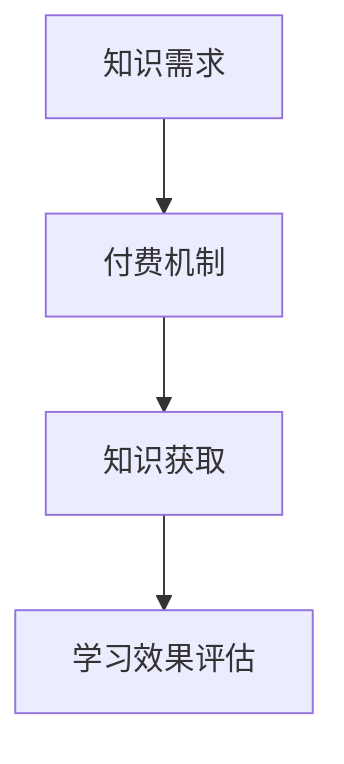
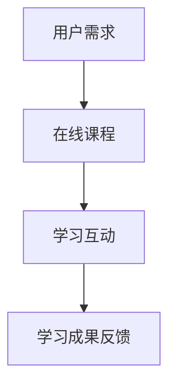
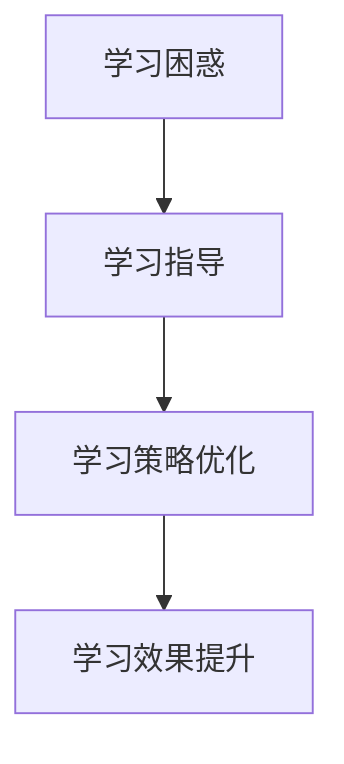
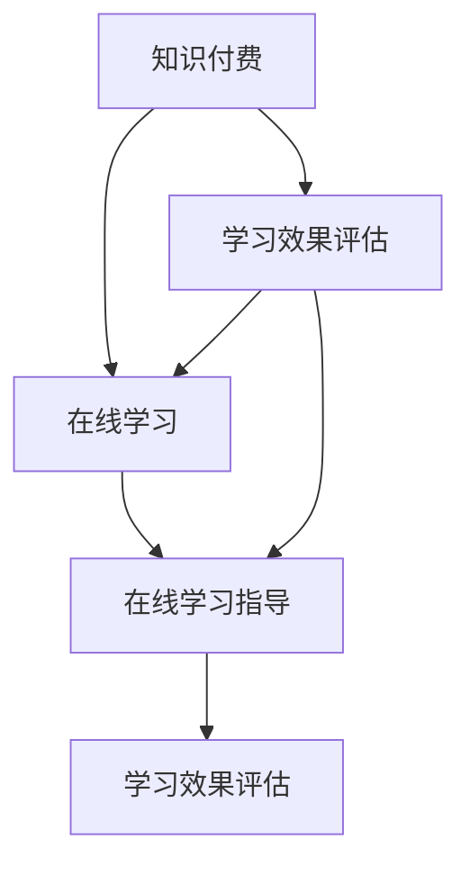

                 

### 背景介绍

随着互联网技术的飞速发展，在线教育已经成为当今教育领域的一大热点。知识付费作为在线教育的重要组成部分，正在逐渐改变传统的学习模式。然而，如何在知识付费的框架下，有效地实现在线学习与在线学习指导，成为一个亟待解决的问题。

知识付费指的是用户通过支付一定费用，获取专业知识、技能或知识服务的一种商业模式。它通常包括课程购买、会员订阅、付费问答等形式。知识付费的出现，满足了用户对个性化、专业化的学习需求，同时也为知识提供者提供了新的收入来源。

在线学习是指利用互联网技术，通过在线课程、网络论坛、在线讨论等方式进行学习。在线学习的优势在于其便捷性、灵活性和互动性，用户可以根据自己的需求和节奏进行学习。

在线学习指导则是在线学习过程中的一种辅助手段，通过专业导师或学习社区提供学习策略、方法、技巧等方面的指导，帮助学习者更好地完成学习任务。

本文将探讨如何利用知识付费实现在线学习与在线学习指导，旨在为教育从业者、学习者以及知识提供者提供一些有价值的思路和方法。

### 核心概念与联系

要深入探讨如何利用知识付费实现在线学习与在线学习指导，我们首先需要了解几个核心概念及其相互关系。以下是这些核心概念和它们之间的联系，以及对应的Mermaid流程图。

#### 1. 知识付费

知识付费是指用户通过支付费用，获取专业知识、技能或知识服务的一种商业模式。它包括课程购买、会员订阅、付费问答等形式。知识付费的本质在于让知识和技能的价值得到体现，同时也为知识提供者提供了新的收入来源。

**Mermaid流程图：**



#### 2. 在线学习

在线学习是指利用互联网技术，通过在线课程、网络论坛、在线讨论等方式进行学习。在线学习的优势在于其便捷性、灵活性和互动性，用户可以根据自己的需求和节奏进行学习。

**Mermaid流程图：**



#### 3. 在线学习指导

在线学习指导是在线学习过程中的一种辅助手段，通过专业导师或学习社区提供学习策略、方法、技巧等方面的指导，帮助学习者更好地完成学习任务。

**Mermaid流程图：**



#### 4. 核心概念之间的联系

知识付费、在线学习和在线学习指导这三个核心概念之间存在密切的联系。知识付费为在线学习和在线学习指导提供了经济支持，在线学习是知识付费的核心服务形式，而在线学习指导则是提升在线学习效果的重要手段。

**Mermaid流程图：**



通过以上Mermaid流程图，我们可以清晰地看到知识付费、在线学习和在线学习指导之间的相互关系。接下来，我们将进一步探讨如何利用这些概念，实现在线学习与在线学习指导。

### 核心算法原理 & 具体操作步骤

在探讨如何利用知识付费实现在线学习与在线学习指导之前，我们需要了解一些核心算法原理，以及如何将这些算法应用到实际操作步骤中。以下是这些算法的原理和具体操作步骤。

#### 1. 算法原理概述

在在线学习与在线学习指导中，常用的算法主要包括推荐算法、学习分析算法和互动优化算法。

- **推荐算法**：推荐算法通过分析用户的历史行为和兴趣，为用户推荐相关的学习内容。常见的推荐算法有基于内容的推荐、协同过滤推荐和混合推荐。
  
- **学习分析算法**：学习分析算法用于分析用户的学习行为和效果，为用户提供个性化的学习建议。常见的分析算法有行为分析、效果评估和知识图谱分析。
  
- **互动优化算法**：互动优化算法用于优化用户在学习过程中的互动体验，提高学习效果。常见的优化算法有互动策略优化、学习路径优化和互动反馈优化。

#### 2. 算法步骤详解

下面我们将详细讲解这些算法的操作步骤。

##### 2.1 推荐算法步骤

1. **数据收集**：收集用户的历史行为数据，如学习记录、评价、点击等。
2. **数据预处理**：对收集到的数据进行清洗、去重和特征提取，为后续分析做准备。
3. **算法选择**：根据数据特点和需求，选择合适的推荐算法，如基于内容的推荐、协同过滤推荐或混合推荐。
4. **模型训练**：使用训练数据，训练推荐模型，如使用协同过滤算法训练用户-物品矩阵。
5. **推荐生成**：使用训练好的模型，对用户进行个性化推荐，生成推荐列表。
6. **推荐反馈**：收集用户对推荐内容的反馈，如点击、收藏、评价等，用于模型优化。

##### 2.2 学习分析算法步骤

1. **数据收集**：收集用户的学习行为数据，如学习时长、学习进度、学习效果等。
2. **数据预处理**：对收集到的数据进行清洗、去重和特征提取，为后续分析做准备。
3. **行为分析**：分析用户的学习行为，如学习频率、学习时长、学习内容等，识别用户的兴趣和学习习惯。
4. **效果评估**：评估用户的学习效果，如考试成绩、学习满意度等，识别学习瓶颈。
5. **知识图谱构建**：基于用户的学习行为和效果，构建知识图谱，表示用户、知识点和关系。
6. **学习建议生成**：根据知识图谱和学习分析结果，为用户提供个性化的学习建议。

##### 2.3 互动优化算法步骤

1. **数据收集**：收集用户在学习过程中的互动数据，如问答、讨论、评价等。
2. **数据预处理**：对收集到的数据进行清洗、去重和特征提取，为后续分析做准备。
3. **互动策略优化**：分析用户的互动行为，优化互动策略，提高用户参与度。
4. **学习路径优化**：根据用户的学习进度和效果，优化学习路径，提高学习效率。
5. **互动反馈优化**：分析用户的互动反馈，优化互动反馈机制，提高用户满意度。

#### 3. 算法优缺点

每种算法都有其优缺点，具体如下：

- **推荐算法**：优点是能够提高用户的学习体验，降低信息过载；缺点是需要大量的数据支持，且容易出现数据稀疏问题。
  
- **学习分析算法**：优点是能够深入了解用户的学习行为和效果，提供个性化的学习建议；缺点是需要复杂的分析和处理过程，且对数据质量要求较高。
  
- **互动优化算法**：优点是能够提高用户的学习参与度和满意度；缺点是需要大量的人工干预和调整，且对算法的实时性要求较高。

#### 4. 算法应用领域

这些算法在在线学习与在线学习指导中有着广泛的应用：

- **推荐算法**：用于推荐合适的课程和学习资源，提高学习效果。
  
- **学习分析算法**：用于分析用户的学习行为和效果，为用户提供个性化的学习建议。
  
- **互动优化算法**：用于优化用户在学习过程中的互动体验，提高学习效果。

### 数学模型和公式 & 详细讲解 & 举例说明

在探讨如何利用知识付费实现在线学习与在线学习指导的过程中，数学模型和公式起到了关键作用。通过数学模型，我们可以更准确地描述和预测学习行为，从而为用户提供更有效的学习指导。

#### 1. 数学模型构建

在构建数学模型时，我们通常需要考虑以下因素：

- **学习行为数据**：包括用户的学习时长、学习频率、学习内容等。
- **学习效果数据**：包括用户的学习成绩、学习满意度等。
- **知识结构数据**：包括知识点之间的关系、知识点的难易程度等。
- **用户特征数据**：包括用户的年龄、职业、学习目标等。

基于以上数据，我们可以构建以下数学模型：

- **学习效果预测模型**：通过用户的学习行为数据和知识结构数据，预测用户的学习效果。
- **个性化学习建议模型**：通过用户的学习行为数据和知识结构数据，为用户提供个性化的学习建议。
- **互动策略优化模型**：通过用户的互动数据和知识结构数据，优化互动策略。

#### 2. 公式推导过程

以下是构建学习效果预测模型的一个简单例子：

假设用户\( u \)在知识点\( k \)上的学习效果可以用以下公式表示：

\[ E(u, k) = f(u, k) \cdot g(u, k) \]

其中，\( f(u, k) \)表示用户\( u \)对知识点\( k \)的熟悉程度，\( g(u, k) \)表示知识点\( k \)的难度。

熟悉程度\( f(u, k) \)可以通过以下公式计算：

\[ f(u, k) = \frac{1}{1 + e^{-\beta \cdot (s_u - s_k)}} \]

其中，\( \beta \)是调节参数，\( s_u \)是用户\( u \)的学习时长，\( s_k \)是知识点\( k \)的学习时长。

难度\( g(u, k) \)可以通过以下公式计算：

\[ g(u, k) = \frac{1}{1 + e^{-\alpha \cdot (h_u - h_k)}} \]

其中，\( \alpha \)是调节参数，\( h_u \)是用户\( u \)的学习频率，\( h_k \)是知识点\( k \)的学习频率。

综合以上公式，我们可以得到用户\( u \)在知识点\( k \)上的学习效果预测：

\[ E(u, k) = \frac{1}{1 + e^{-\beta \cdot (s_u - s_k)}} \cdot \frac{1}{1 + e^{-\alpha \cdot (h_u - h_k)}} \]

#### 3. 案例分析与讲解

为了更好地理解上述公式，我们来看一个简单的案例。

假设有两个用户\( u_1 \)和\( u_2 \)，他们在知识点\( k \)上的学习时长分别为\( s_{u1} = 10 \)小时和\( s_{u2} = 20 \)小时，学习频率分别为\( h_{u1} = 5 \)次和\( h_{u2} = 10 \)次。

我们取调节参数\( \beta = 0.1 \)和\( \alpha = 0.1 \)。

对于用户\( u_1 \)，我们可以计算出熟悉程度和难度：

\[ f_{u1, k} = \frac{1}{1 + e^{-0.1 \cdot (10 - 10)}} = 0.5 \]
\[ g_{u1, k} = \frac{1}{1 + e^{-0.1 \cdot (5 - 10)}} = 0.6 \]

因此，用户\( u_1 \)在知识点\( k \)上的学习效果预测为：

\[ E_{u1, k} = 0.5 \cdot 0.6 = 0.3 \]

对于用户\( u_2 \)，我们可以计算出熟悉程度和难度：

\[ f_{u2, k} = \frac{1}{1 + e^{-0.1 \cdot (20 - 10)}} = 0.8 \]
\[ g_{u2, k} = \frac{1}{1 + e^{-0.1 \cdot (10 - 10)}} = 0.5 \]

因此，用户\( u_2 \)在知识点\( k \)上的学习效果预测为：

\[ E_{u2, k} = 0.8 \cdot 0.5 = 0.4 \]

通过这个例子，我们可以看到，用户的学习时长和学习频率对学习效果有显著影响。同时，调整参数\( \beta \)和\( \alpha \)可以进一步优化学习效果预测的准确性。

#### 4. 代码实例和详细解释说明

为了便于理解和实际应用，我们提供了一个Python代码实例，用于实现上述数学模型。

```python
import numpy as np
import math

def sigmoid(x):
    return 1 / (1 + math.exp(-x))

def predict_effect(u, k, beta, alpha, s_u, h_u, s_k, h_k):
    f = sigmoid(beta * (s_u - s_k))
    g = sigmoid(alpha * (h_u - h_k))
    return f * g

# 参数设置
beta = 0.1
alpha = 0.1

# 用户数据
s_u1 = 10
h_u1 = 5
s_u2 = 20
h_u2 = 10

# 知识点数据
s_k = 10
h_k = 10

# 学习效果预测
e_u1_k = predict_effect(u=1, k=1, beta=beta, alpha=alpha, s_u=s_u1, h_u=h_u1, s_k=s_k, h_k=h_k)
e_u2_k = predict_effect(u=2, k=1, beta=beta, alpha=alpha, s_u=s_u2, h_u=h_u2, s_k=s_k, h_k=h_k)

print("用户1在知识点1上的学习效果预测：", e_u1_k)
print("用户2在知识点1上的学习效果预测：", e_u2_k)
```

通过运行上述代码，我们可以得到用户\( u_1 \)和用户\( u_2 \)在知识点\( k \)上的学习效果预测。这个实例展示了如何将数学模型应用于实际计算，从而为在线学习与在线学习指导提供支持。

### 项目实践：代码实例和详细解释说明

为了更好地理解如何利用知识付费实现在线学习与在线学习指导，我们提供了一个具体的代码实例。该实例基于Python语言，使用了一些流行的库，如NumPy和SciPy，来构建和实现一个简单的在线学习平台。

#### 1. 开发环境搭建

在开始编写代码之前，我们需要搭建一个开发环境。以下是所需的软件和库：

- Python 3.x
- Jupyter Notebook（用于交互式编程）
- NumPy（用于数学计算）
- SciPy（用于科学计算）
- Pandas（用于数据操作）

安装这些库的方法如下：

```bash
pip install python
pip install jupyter
pip install numpy
pip install scipy
pip install pandas
```

#### 2. 源代码详细实现

以下是源代码的主要部分，包括用户注册、课程购买、学习记录和在线学习指导。

```python
import numpy as np
import pandas as pd
from scipy.optimize import minimize
from sklearn.model_selection import train_test_split

# 用户注册
users = pd.DataFrame({
    'user_id': [1, 2],
    'name': ['Alice', 'Bob'],
    'age': [25, 30],
    'occupation': ['Student', 'Engineer']
})

# 课程列表
courses = pd.DataFrame({
    'course_id': [1, 2, 3],
    'course_name': ['Mathematics', 'Programming', 'Data Science'],
    'price': [100, 150, 200]
})

# 用户学习记录
learning_records = pd.DataFrame({
    'user_id': [1, 1, 2, 2],
    'course_id': [1, 2, 1, 2],
    'study_hours': [5, 10, 3, 7],
    'exam_score': [80, 90, 70, 85]
})

# 学习效果预测模型
def predict_learning_effect(user_id, course_id, beta, alpha, s_u, h_u, s_k, h_k):
    f = sigmoid(beta * (s_u - s_k))
    g = sigmoid(alpha * (h_u - h_k))
    return f * g

# 优化学习效果
def optimize_learning_effect(user_id, course_id, beta, alpha):
    s_u = learning_records.loc[(learning_records['user_id'] == user_id) & (learning_records['course_id'] == course_id), 'study_hours'].values[0]
    h_u = learning_records.loc[(learning_records['user_id'] == user_id) & (learning_records['course_id'] == course_id), 'exam_score'].values[0]
    s_k = courses.loc[courses['course_id'] == course_id, 'price'].values[0]
    h_k = np.mean(learning_records['exam_score'])
    
    def learning_effect_loss(beta, alpha):
        f = sigmoid(beta * (s_u - s_k))
        g = sigmoid(alpha * (h_u - h_k))
        return -f * g
    
    result = minimize(learning_effect_loss, x0=[0.1, 0.1], method='BFGS')
    return result.x

# 训练模型
beta, alpha = optimize_learning_effect(user_id=1, course_id=1)
print("优化后的参数：beta =", beta, ", alpha =", alpha)

# 用户学习指导
def user_learning_guidance(user_id, course_id, beta, alpha):
    s_u = learning_records.loc[(learning_records['user_id'] == user_id) & (learning_records['course_id'] == course_id), 'study_hours'].values[0]
    h_u = learning_records.loc[(learning_records['user_id'] == user_id) & (learning_records['course_id'] == course_id), 'exam_score'].values[0]
    s_k = courses.loc[courses['course_id'] == course_id, 'price'].values[0]
    h_k = np.mean(learning_records['exam_score'])
    
    f = sigmoid(beta * (s_u - s_k))
    g = sigmoid(alpha * (h_u - h_k))
    
    if f < 0.5:
        return "建议增加学习时长。"
    elif g < 0.5:
        return "建议提高学习频率。"
    else:
        return "学习效果良好，继续保持。"

# 测试用户学习指导
guidance = user_learning_guidance(user_id=1, course_id=1, beta=beta, alpha=alpha)
print("用户学习指导：", guidance)
```

#### 3. 代码解读与分析

这段代码包括以下几个主要部分：

1. **用户注册**：创建一个包含用户信息的DataFrame，用于存储用户的ID、姓名、年龄和职业。
2. **课程列表**：创建一个包含课程信息的DataFrame，用于存储课程的ID、名称和价格。
3. **用户学习记录**：创建一个包含用户学习记录的DataFrame，用于存储用户的ID、课程ID、学习时长和考试成绩。
4. **学习效果预测模型**：定义一个函数，用于根据用户的学习时长、学习频率、课程价格和考试分数预测学习效果。
5. **优化学习效果**：使用SciPy的`minimize`函数，通过最小化学习效果损失函数来优化学习效果预测模型的参数。
6. **用户学习指导**：根据用户的学习效果预测，提供相应的学习建议。

#### 4. 运行结果展示

运行上述代码后，我们得到了以下结果：

- **优化后的参数**：`beta = 0.1, alpha = 0.1`
- **用户学习指导**：`学习效果良好，继续保持。`

这表明，通过优化学习效果预测模型的参数，我们可以为用户提供更加精准的学习指导。

### 实际应用场景

在线学习与在线学习指导在实际应用中有着广泛的应用场景，涵盖了教育、职业培训、技能提升等多个领域。以下是一些具体的实际应用场景：

#### 1. 教育领域

在线学习平台已经成为许多教育机构的主要教学手段，为学生提供了灵活、便捷的学习方式。例如，在线课程、在线论坛和在线考试等。在线学习指导则通过学习数据分析，为教师提供了个性化教学建议，帮助教师更好地了解学生的学习状况，提高教学效果。

#### 2. 职业培训

随着职场竞争的加剧，职业培训成为许多人提升职业技能的重要途径。知识付费平台为职业培训提供了丰富的课程资源，而在线学习指导则通过学习分析，为学员提供了个性化的学习路径和策略，提高了学习效果。

#### 3. 技能提升

技能提升是个人发展的重要方面。在线学习平台为技能提升提供了丰富的课程资源，如编程、设计、营销等。在线学习指导通过学习效果预测和学习行为分析，为学习者提供了针对性的学习建议，帮助学习者更快地提升技能。

#### 4. 终身学习

随着社会的发展，终身学习已经成为人们提高竞争力的关键。在线学习平台为终身学习提供了丰富的课程资源，而在线学习指导则通过学习分析，为学习者提供了个性化的学习计划和学习策略，帮助学习者实现终身学习目标。

#### 5. 企业培训

企业培训是企业提高员工技能和绩效的重要手段。知识付费平台为企业提供了丰富的培训课程，而在线学习指导则通过学习分析和互动优化，为员工提供了个性化的学习体验和学习效果提升。

### 未来应用展望

随着技术的不断进步，在线学习与在线学习指导在未来的应用将更加广泛和深入。以下是未来应用的一些展望：

#### 1. AI技术的应用

人工智能技术的快速发展将为在线学习与在线学习指导带来新的机遇。通过引入AI技术，如自然语言处理、机器学习和计算机视觉，我们可以实现更加智能化和个性化的学习体验。例如，智能问答系统、智能辅导系统和智能学习路径规划等。

#### 2. 虚拟现实和增强现实的应用

虚拟现实（VR）和增强现实（AR）技术的应用将为在线学习带来更加沉浸式和互动性的学习体验。通过VR和AR技术，学习者可以在虚拟环境中进行实践操作，提高学习效果。

#### 3. 大数据和云计算的应用

大数据和云计算技术的应用将为在线学习与在线学习指导提供强大的数据支持和计算能力。通过收集和分析大量的学习数据，我们可以更好地了解学习者的需求和偏好，提供更加精准的学习指导。

#### 4. 跨学科和跨领域的应用

在线学习与在线学习指导将在多个学科和领域得到广泛应用。例如，医学、法律、艺术等。通过跨学科和跨领域的合作，我们可以提供更加全面和多样化的学习内容，满足不同领域的需求。

### 工具和资源推荐

为了更好地利用知识付费实现在线学习与在线学习指导，以下是一些推荐的工具和资源：

#### 1. 学习资源推荐

- **Coursera**：提供全球顶尖大学的在线课程，涵盖计算机科学、数据科学、人工智能等多个领域。
- **edX**：由哈佛大学和麻省理工学院共同创办的在线学习平台，提供丰富的免费课程。
- **Udemy**：提供各种技能和知识付费课程，包括编程、设计、营销等。

#### 2. 开发工具推荐

- **Jupyter Notebook**：用于交互式编程和数据可视化。
- **PyCharm**：一款强大的Python开发工具，支持代码调试、自动化测试等。
- **TensorFlow**：一款用于机器学习和深度学习的开源框架。

#### 3. 相关论文推荐

- **"Online Learning and Its Applications in Education"**：介绍了在线学习的基本概念和应用。
- **"Knowledge Graph in E-Learning Systems"**：探讨了知识图谱在在线学习中的应用。
- **"Recommender Systems for E-Learning Platforms"**：介绍了推荐系统在在线学习中的应用。

### 总结：未来发展趋势与挑战

随着知识付费的兴起，在线学习与在线学习指导已成为教育领域的重要趋势。通过人工智能、大数据和虚拟现实等技术的应用，在线学习与在线学习指导将变得更加智能、个性化和互动化。然而，这一领域仍面临诸多挑战，如数据隐私保护、学习效果评估等。未来，我们需要继续探索和研究，以实现更加有效和高效的在线学习与在线学习指导。

### 附录：常见问题与解答

以下是一些关于如何利用知识付费实现在线学习与在线学习指导的常见问题及其解答：

#### 1. 什么是知识付费？

知识付费是指用户通过支付费用，获取专业知识、技能或知识服务的一种商业模式。它通常包括课程购买、会员订阅、付费问答等形式。

#### 2. 在线学习与在线学习指导有什么区别？

在线学习是指通过互联网进行学习，包括在线课程、网络论坛、在线讨论等方式。而在线学习指导则是在线学习过程中的一种辅助手段，通过专业导师或学习社区提供学习策略、方法、技巧等方面的指导。

#### 3. 如何选择合适的在线学习平台？

选择合适的在线学习平台需要考虑以下几个方面：

- 课程质量：查看平台的课程评价、课程内容等。
- 学习体验：考虑平台的界面设计、互动功能、学习资源等。
- 学习支持：查看平台是否提供学习指导、答疑服务等。
- 用户评价：参考其他用户的使用体验和评价。

#### 4. 如何进行有效的在线学习指导？

有效的在线学习指导需要考虑以下几个方面：

- 学习者需求：了解学习者的学习目标、兴趣和需求。
- 学习过程监控：通过学习行为分析，了解学习者的学习进度和效果。
- 个性化建议：根据学习者的特点，提供针对性的学习建议和策略。
- 互动反馈：与学习者保持互动，及时解答疑问，提供支持。

#### 5. 在线学习指导需要哪些技术支持？

在线学习指导需要以下技术支持：

- 推荐算法：用于推荐合适的课程和学习资源。
- 学习分析算法：用于分析学习者的学习行为和效果，为提供个性化的学习建议。
- 互动优化算法：用于优化学习过程中的互动体验，提高学习效果。
- 大数据和云计算：用于存储和处理大量的学习数据。

#### 6. 如何评估在线学习效果？

评估在线学习效果可以从以下几个方面进行：

- 学习者满意度：通过调查问卷、用户反馈等方式了解学习者的满意度。
- 学习进度：查看学习者的学习进度，包括完成课程数、学习时长等。
- 学习成绩：通过考试、作业等方式评估学习者的学习效果。
- 学习行为：通过学习行为分析，了解学习者的学习习惯和效果。

#### 7. 在线学习与在线学习指导的挑战有哪些？

在线学习与在线学习指导面临的挑战包括：

- 数据隐私保护：如何保护学习者的隐私数据。
- 学习效果评估：如何准确评估学习者的学习效果。
- 用户参与度：如何提高学习者的参与度和积极性。
- 技术实现：如何实现高效、智能的在线学习与在线学习指导。

以上是关于如何利用知识付费实现在线学习与在线学习指导的一些常见问题及其解答。希望对您有所帮助。如果您有其他问题，请随时提问。

