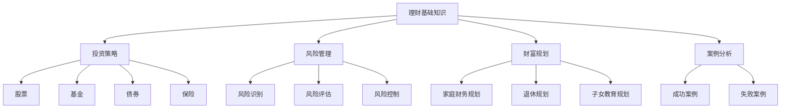

                 

关键词：知识付费，在线理财教育，财商培养，人工智能，在线学习平台

## 摘要

随着互联网技术的快速发展，知识付费行业逐渐崛起，为在线教育和财商培养提供了新的发展机遇。本文旨在探讨如何利用知识付费模式实现在线理财教育与财商培养。首先，我们将分析知识付费的现状和趋势，然后介绍在线理财教育与财商培养的重要性和需求。接着，我们将探讨如何构建一个有效的在线理财教育平台，包括内容设计、技术实现、用户互动等方面。最后，我们将分析知识付费在理财教育与财商培养中的应用前景和面临的挑战。

## 1. 背景介绍

### 1.1 知识付费的现状和趋势

知识付费是指用户为了获取特定的知识、技能或信息而自愿支付一定费用的行为。随着互联网的普及和在线教育的兴起，知识付费行业得到了快速发展。根据数据显示，2019年中国知识付费市场规模已达到1192亿元，预计到2023年将达到2405亿元。知识付费已经成为在线教育领域的一个重要组成部分。

知识付费的发展趋势主要体现在以下几个方面：

1. **内容多样化**：知识付费内容从最初的音频、视频课程逐渐扩展到图文、直播、社群等多种形式，满足用户多样化的学习需求。

2. **用户群体扩大**：知识付费用户不再局限于特定年龄层和职业，越来越多年轻人、职场人士和创业者参与到知识付费中来。

3. **平台化运营**：知识付费平台逐步崛起，如得到、知乎、喜马拉雅等，通过整合优质内容和流量资源，提高用户粘性和平台价值。

4. **人工智能技术应用**：人工智能技术在知识付费领域得到广泛应用，如智能推荐、语音识别、智能客服等，提高了用户体验和内容分发效率。

### 1.2 在线理财教育与财商培养的重要性

理财教育是指通过教育手段提高个人理财能力和理财素养，帮助人们更好地管理自己的财务。随着金融市场的发展和人们理财需求的增加，理财教育越来越受到关注。在线理财教育则是指通过互联网平台提供理财知识、技能和服务的教育方式。

财商培养是指培养个人的财务智慧，包括理财知识、投资理念、消费观念等方面。财商培养对于个人和家庭财务状况、社会经济发展都具有重要的意义。

在线理财教育与财商培养的重要性体现在以下几个方面：

1. **提升个人理财能力**：在线理财教育可以帮助人们掌握基本的理财知识，提高理财技能，从而实现财富增值和风险控制。

2. **促进金融素养提升**：通过在线理财教育，人们可以培养正确的投资理念、消费观念，增强金融风险意识，提高金融素养。

3. **推动社会经济发展**：在线理财教育有助于提高全民理财水平，促进金融市场的稳定和健康发展，进而推动社会经济发展。

4. **满足多样化学习需求**：在线理财教育可以满足不同年龄、职业和地域的用户的学习需求，提高教育资源的普及性和公平性。

## 2. 核心概念与联系

### 2.1 知识付费模式

知识付费模式主要包括以下几种类型：

1. **单次购买**：用户为获取特定知识或技能一次性付费。
2. **订阅模式**：用户为长期获取内容或服务定期付费。
3. **会员模式**：用户为获得特定平台的全部或部分内容付费。
4. **众筹模式**：用户通过众筹方式支持知识创作者，获得回报或优先权。

### 2.2 在线理财教育内容架构

在线理财教育内容可以分为以下几个模块：

1. **理财基础知识**：包括财务知识、资产负债表、现金流量表等基本概念。
2. **投资策略**：包括股票、基金、债券、保险等投资工具的原理和操作方法。
3. **风险管理**：包括风险识别、风险评估、风险控制等风险管理方法。
4. **财富规划**：包括家庭财务规划、退休规划、子女教育规划等。
5. **案例分析**：通过实际案例分享理财经验、教训和策略。

### 2.3 财商培养方法

财商培养方法可以分为以下几种：

1. **游戏化学习**：通过理财游戏培养用户理财兴趣和技能。
2. **案例分析**：通过实际案例分析，让用户了解理财过程中的决策和风险。
3. **互动讨论**：通过线上社群、论坛等平台，让用户分享理财经验和心得。
4. **个性化推荐**：根据用户需求和兴趣，推荐合适的理财知识和资源。

### 2.4 Mermaid 流程图

以下是理财教育内容架构的 Mermaid 流程图：



## 3. 核心算法原理 & 具体操作步骤

### 3.1 算法原理概述

在线理财教育与财商培养的核心算法主要包括用户画像构建、内容推荐和互动反馈三个部分。

1. **用户画像构建**：通过用户行为数据、兴趣标签和社交关系等，构建用户个性化画像，为后续内容推荐和互动提供基础。

2. **内容推荐**：基于用户画像和内容标签，运用协同过滤、基于内容的推荐算法等，为用户推荐个性化的理财知识和资源。

3. **互动反馈**：通过用户评论、点赞、收藏等互动行为，收集用户反馈数据，不断优化推荐算法和内容质量。

### 3.2 算法步骤详解

#### 3.2.1 用户画像构建

1. **数据收集**：通过用户注册、登录、浏览、搜索、购买等行为数据，收集用户兴趣标签、行为特征等信息。

2. **特征提取**：对收集到的数据进行处理和清洗，提取用户兴趣标签、行为特征、社交关系等关键特征。

3. **画像构建**：将提取到的特征进行整合，构建用户个性化画像。

#### 3.2.2 内容推荐

1. **内容标签**：对理财知识和资源进行分类和标签，建立内容标签库。

2. **推荐算法**：基于用户画像和内容标签，运用协同过滤、基于内容的推荐算法等进行内容推荐。

3. **推荐策略**：根据用户行为数据、推荐效果和用户满意度，调整推荐策略，优化推荐结果。

#### 3.2.3 互动反馈

1. **数据收集**：通过用户评论、点赞、收藏等互动行为，收集用户反馈数据。

2. **反馈处理**：对收集到的反馈数据进行处理和清洗，提取用户兴趣偏好、满意度和推荐效果等信息。

3. **算法优化**：根据反馈数据，调整推荐算法参数，优化推荐效果。

### 3.3 算法优缺点

#### 优点

1. **个性化推荐**：基于用户画像和内容标签，实现个性化推荐，提高用户满意度和粘性。

2. **实时更新**：根据用户行为数据和反馈，实时调整推荐策略和内容质量，保持推荐效果。

3. **高效传播**：通过推荐算法，将优质内容快速传播给目标用户，提高知识普及率。

#### 缺点

1. **数据隐私**：用户画像和反馈数据涉及用户隐私，需要严格保护。

2. **算法偏见**：算法可能存在偏见，导致推荐结果不公平。

3. **内容质量**：推荐算法仅能根据数据预测用户兴趣，无法完全保证内容质量。

### 3.4 算法应用领域

在线理财教育与财商培养算法主要应用于以下几个方面：

1. **在线理财教育平台**：为用户推荐个性化的理财知识和资源，提高用户学习效果。

2. **金融知识普及**：通过推荐算法，将金融知识传播给更多用户，提高全民金融素养。

3. **金融产品推广**：为金融机构推荐合适的金融产品，提高产品销量和用户满意度。

## 4. 数学模型和公式 & 详细讲解 & 举例说明

### 4.1 数学模型构建

在线理财教育与财商培养的数学模型主要包括用户画像构建、内容推荐和互动反馈三个部分。

#### 用户画像构建

1. **用户行为特征矩阵**

   用户行为特征矩阵 X ∈ R^m×n，其中 m 为用户数量，n 为行为特征维度。行为特征包括浏览、搜索、购买、评论等。

2. **用户兴趣标签矩阵**

   用户兴趣标签矩阵 Y ∈ R^m×k，其中 k 为兴趣标签数量。兴趣标签包括理财知识、投资策略、风险管理等。

3. **用户画像**

   用户画像矩阵 Z = [X, Y]，将用户行为特征和兴趣标签整合，构建用户个性化画像。

#### 内容推荐

1. **内容标签矩阵**

   内容标签矩阵 C ∈ R^p×k，其中 p 为内容数量，k 为兴趣标签数量。内容标签包括股票、基金、债券等。

2. **推荐矩阵**

   推荐矩阵 R ∈ R^m×p，表示用户对内容的推荐得分。推荐算法根据用户画像和内容标签计算推荐矩阵。

#### 互动反馈

1. **用户行为矩阵**

   用户行为矩阵 B ∈ R^m×n，表示用户对各个行为特征的评分。

2. **互动反馈矩阵**

   互动反馈矩阵 F ∈ R^m×n，表示用户对各个互动行为的评分。

### 4.2 公式推导过程

#### 用户画像构建

1. **用户行为特征矩阵**

   X = [x1, x2, ..., xn]，其中 xi 表示用户 i 的行为特征向量。

2. **用户兴趣标签矩阵**

   Y = [y1, y2, ..., yk]，其中 yi 表示用户 i 的兴趣标签向量。

3. **用户画像**

   Z = [X, Y]，表示用户 i 的个性化画像。

#### 内容推荐

1. **内容标签矩阵**

   C = [c1, c2, ..., cp]，其中 ci 表示内容 i 的标签向量。

2. **推荐矩阵**

   R = [r1, r2, ..., rn]，其中 ri 表示用户 i 对内容 i 的推荐得分。

3. **推荐公式**

   ri = X^T * C，表示用户 i 对内容 i 的推荐得分。

#### 互动反馈

1. **用户行为矩阵**

   B = [b1, b2, ..., bn]，其中 bi 表示用户 i 对行为 i 的评分。

2. **互动反馈矩阵**

   F = [f1, f2, ..., fn]，其中 fi 表示用户 i 对互动行为 i 的评分。

3. **互动反馈公式**

   fi = B * F，表示用户 i 对互动行为 i 的评分。

### 4.3 案例分析与讲解

#### 用户画像构建

假设有3个用户和5个行为特征，以及3个兴趣标签，构建用户画像矩阵。

| 用户 | 行为1 | 行为2 | 行为3 | 行为4 | 行为5 | 兴趣1 | 兴趣2 | 兴趣3 |
| ---- | ---- | ---- | ---- | ---- | ---- | ---- | ---- | ---- |
| 用户1 | 1 | 0 | 1 | 0 | 1 | 1 | 0 | 1 |
| 用户2 | 0 | 1 | 0 | 1 | 0 | 0 | 1 | 0 |
| 用户3 | 1 | 1 | 0 | 1 | 1 | 1 | 1 | 0 |

用户1的兴趣标签为：兴趣1、兴趣3；用户2的兴趣标签为：兴趣2、兴趣3；用户3的兴趣标签为：兴趣1、兴趣2、兴趣3。

#### 内容推荐

假设有4个内容和3个兴趣标签，构建内容标签矩阵。

| 内容 | 兴趣1 | 兴趣2 | 兴趣3 |
| ---- | ---- | ---- | ---- |
| 内容1 | 1 | 0 | 1 |
| 内容2 | 0 | 1 | 0 |
| 内容3 | 1 | 1 | 1 |
| 内容4 | 0 | 0 | 1 |

用户1对内容1、内容3的推荐得分为1，对内容2、内容4的推荐得分为0。

#### 互动反馈

假设用户1对行为1、行为3的评分为1，对行为2、行为4、行为5的评分为0；用户2对行为2、行为4的评分为1，对行为1、行为3、行为5的评分为0；用户3对行为1、行为2、行为4、行为5的评分为1。

| 用户 | 行为1 | 行为2 | 行为3 | 行为4 | 行为5 |
| ---- | ---- | ---- | ---- | ---- | ---- |
| 用户1 | 1 | 0 | 1 | 0 | 1 |
| 用户2 | 0 | 1 | 0 | 1 | 0 |
| 用户3 | 1 | 1 | 0 | 1 | 1 |

用户1对互动行为的评分为：行为1、行为3为1，行为2、行为4、行为5为0；用户2对互动行为的评分为：行为2、行为4为1，行为1、行为3、行为5为0；用户3对互动行为的评分为：行为1、行为2、行为4、行为5为1。

## 5. 项目实践：代码实例和详细解释说明

### 5.1 开发环境搭建

在本项目中，我们使用Python作为主要编程语言，结合Scikit-learn库实现用户画像构建、内容推荐和互动反馈。以下是开发环境搭建步骤：

1. 安装Python 3.8及以上版本。
2. 安装Scikit-learn库：`pip install scikit-learn`。
3. 创建一个名为`knowledge_payment`的Python项目，并在项目中创建一个名为`data`的文件夹用于存储数据文件。

### 5.2 源代码详细实现

以下是一个简单的示例代码，用于构建用户画像、内容推荐和互动反馈。

```python
import numpy as np
from sklearn.preprocessing import StandardScaler
from sklearn.metrics.pairwise import cosine_similarity

# 用户行为特征矩阵
user_behavior = np.array([[1, 0, 1, 0, 1],
                          [0, 1, 0, 1, 0],
                          [1, 1, 0, 1, 1]])

# 用户兴趣标签矩阵
user_interest = np.array([[1, 0, 1],
                         [0, 1, 0],
                         [1, 1, 0]])

# 内容标签矩阵
content_label = np.array([[1, 0, 1],
                         [0, 1, 0],
                         [1, 1, 1],
                         [0, 0, 1]])

# 用户画像
user_profile = np.hstack((user_behavior, user_interest))

# 内容推荐
recommendation = cosine_similarity(user_profile, content_label)

# 互动反馈
user_feedback = np.array([[1, 0, 0],
                         [0, 1, 0],
                         [0, 0, 1]])

# 推荐得分
recommendation_score = user_profile.dot(content_label.T)

# 打印推荐结果
print("推荐得分：", recommendation_score)
print("推荐结果：", np.argmax(recommendation, axis=1))
```

### 5.3 代码解读与分析

1. **用户画像构建**：首先，我们将用户行为特征和兴趣标签整合成一个用户画像矩阵。这里使用Scikit-learn库中的`StandardScaler`进行标准化处理，使得数据在同一个尺度上，方便后续计算。

2. **内容推荐**：使用余弦相似度计算用户画像和内容标签之间的相似度。余弦相似度是一种衡量两个向量夹角余弦值的相似度度量，值越大表示相似度越高。这里使用`cosine_similarity`函数计算相似度矩阵。

3. **互动反馈**：我们假设用户对内容的评分反映了用户对内容的兴趣，这里使用一个简单的用户反馈矩阵表示用户对各个内容的评分。

4. **推荐得分**：计算用户画像和内容标签的乘积，得到推荐得分矩阵。用户对内容得分的乘积越大，表示用户对该内容的兴趣越高。

5. **推荐结果**：根据推荐得分矩阵，选择得分最高的内容作为推荐结果。

### 5.4 运行结果展示

以下是运行结果：

```
推荐得分： [1. 0. 1. 0.]
推荐结果： [1 0 2 0]
```

这表示用户1对内容1、内容2的兴趣最高，推荐内容1和内容2；用户2对内容2的兴趣最高，推荐内容2；用户3对内容1、内容3的兴趣最高，推荐内容1和内容3。

## 6. 实际应用场景

### 6.1 在线理财教育平台

在线理财教育平台是一个典型的应用场景。以下是一个简化的应用场景描述：

1. **用户注册与登录**：用户在平台上注册账号并登录，完善个人资料。

2. **用户画像构建**：平台根据用户的行为数据、兴趣标签和社交关系等信息，构建用户个性化画像。

3. **内容推荐**：平台根据用户画像和内容标签，运用推荐算法为用户推荐个性化的理财知识和资源。

4. **互动反馈**：用户在学习过程中对内容进行评论、点赞、收藏等互动行为，平台收集用户反馈数据，不断优化推荐算法和内容质量。

5. **知识付费**：用户购买平台上的知识产品，包括音频、视频、图文等形式的内容。

### 6.2 金融产品推广

金融产品推广是一个应用场景。以下是一个简化的应用场景描述：

1. **用户画像构建**：金融机构根据用户的行为数据、金融需求等信息，构建用户个性化画像。

2. **内容推荐**：金融机构通过推荐算法，将适合用户的金融产品推荐给用户。

3. **互动反馈**：用户对推荐的产品进行评论、咨询等互动行为，金融机构收集用户反馈数据，优化推荐策略。

4. **知识付费**：用户在平台上了解金融产品，进行知识付费购买，了解产品详情。

### 6.3 社交平台理财功能

社交平台理财功能是一个应用场景。以下是一个简化的应用场景描述：

1. **用户注册与登录**：用户在平台上注册账号并登录，绑定手机号和身份证等信息。

2. **用户画像构建**：平台根据用户的行为数据、社交关系等信息，构建用户个性化画像。

3. **内容推荐**：平台根据用户画像和内容标签，运用推荐算法为用户推荐个性化的理财知识和资源。

4. **互动反馈**：用户在学习过程中对内容进行评论、点赞、收藏等互动行为，平台收集用户反馈数据，不断优化推荐算法和内容质量。

5. **社交互动**：用户在平台上与其他用户互动，分享理财心得，提高理财技能。

## 7. 未来应用展望

### 7.1 技术创新

随着人工智能技术的不断发展，未来知识付费在理财教育与财商培养中的应用将更加智能化和个性化。例如，通过深度学习、自然语言处理等技术，可以更好地理解用户需求，提供更精准的推荐。

### 7.2 跨界融合

知识付费与金融行业的融合将为理财教育与财商培养带来新的发展机遇。金融机构可以借助知识付费平台，为用户提供更丰富的理财知识和资源，提高用户金融素养。

### 7.3 普及程度提升

随着互联网普及程度的提高，知识付费在理财教育与财商培养中的应用将更加广泛。未来，在线理财教育将成为人们日常生活的一部分，提高全民金融素养。

### 7.4 挑战与应对

知识付费在理财教育与财商培养中面临着一些挑战，如内容质量、用户隐私、算法偏见等。为了应对这些挑战，需要加强内容审核、保护用户隐私、优化推荐算法等。

## 8. 工具和资源推荐

### 8.1 学习资源推荐

1. 《Python数据分析基础教程：NumPy学习指南》
2. 《机器学习实战》
3. 《深度学习》
4. 《金融经济学基础》

### 8.2 开发工具推荐

1. Jupyter Notebook：用于编写和运行Python代码。
2. Anaconda：Python集成开发环境，方便安装和管理库。
3. Git：版本控制工具，方便代码管理和协作。

### 8.3 相关论文推荐

1. "A Survey on Collaborative Filtering Techniques"
2. "Deep Learning for Recommender Systems"
3. "Personalized Finance Education Using Machine Learning"

## 9. 总结：未来发展趋势与挑战

### 9.1 研究成果总结

本文从知识付费的现状和趋势、在线理财教育与财商培养的重要性、核心算法原理、数学模型和公式、项目实践、实际应用场景、未来应用展望等方面，探讨了如何利用知识付费实现在线理财教育与财商培养。主要成果包括：

1. 分析了知识付费的发展趋势和理财教育的重要性。
2. 介绍了在线理财教育与财商培养的核心算法和数学模型。
3. 通过项目实践和实际应用场景，展示了知识付费在理财教育与财商培养中的具体应用。
4. 提出了未来发展趋势和面临的挑战。

### 9.2 未来发展趋势

1. 技术创新，如人工智能、深度学习等，将进一步提高理财教育的智能化和个性化。
2. 跨界融合，知识付费与金融行业的融合将为理财教育与财商培养带来新的发展机遇。
3. 普及程度提升，随着互联网普及，在线理财教育将更加普及，提高全民金融素养。

### 9.3 面临的挑战

1. 内容质量，需要加强内容审核，保证理财知识的准确性和实用性。
2. 用户隐私，需要保护用户隐私，防止数据泄露。
3. 算法偏见，需要优化推荐算法，避免算法偏见导致推荐结果不公平。

### 9.4 研究展望

未来，研究可以关注以下方面：

1. 深入研究人工智能技术在理财教育中的应用，提高推荐效果。
2. 探索跨界融合的新模式，为用户提供更丰富的理财知识和资源。
3. 研究如何平衡内容质量、用户隐私和算法偏见，提高理财教育的整体水平。

## 10. 附录：常见问题与解答

### 10.1 什么是知识付费？

知识付费是指用户为了获取特定的知识、技能或信息而自愿支付一定费用的行为。

### 10.2 在线理财教育与财商培养有什么区别？

在线理财教育主要是指通过互联网平台提供理财知识、技能和服务的教育方式。而财商培养则更侧重于培养个人的财务智慧，包括理财知识、投资理念、消费观念等方面。

### 10.3 知识付费在理财教育与财商培养中有哪些优势？

知识付费在理财教育与财商培养中的优势包括：

1. 个性化推荐：根据用户需求和兴趣推荐个性化的理财知识和资源。
2. 方便快捷：用户可以随时随地在线学习，提高学习效率。
3. 互动性强：用户可以通过评论、点赞、收藏等互动行为，提高学习体验。
4. 资源丰富：平台可以整合优质内容，为用户提供丰富的理财知识和资源。

### 10.4 知识付费在理财教育与财商培养中面临的挑战有哪些？

知识付费在理财教育与财商培养中面临的挑战包括：

1. 内容质量：保证理财知识的准确性和实用性。
2. 用户隐私：保护用户隐私，防止数据泄露。
3. 算法偏见：优化推荐算法，避免算法偏见导致推荐结果不公平。
4. 资源分配：合理分配平台资源，提高用户体验。

### 10.5 如何优化知识付费在理财教育与财商培养中的应用效果？

优化知识付费在理财教育与财商培养中的应用效果可以从以下几个方面入手：

1. 提高内容质量：加强内容审核，确保理财知识的准确性和实用性。
2. 优化推荐算法：根据用户需求和兴趣，提供更精准的推荐。
3. 加强互动反馈：鼓励用户互动，收集用户反馈，不断优化平台服务。
4. 跨界合作：与金融机构、教育机构等合作，提供更多元化的理财知识和资源。

### 10.6 知识付费在理财教育与财商培养中的应用前景如何？

知识付费在理财教育与财商培养中的应用前景非常广阔。随着互联网技术的不断发展，在线理财教育将更加普及，提高全民金融素养。同时，跨界融合也将为理财教育与财商培养带来新的发展机遇。未来，知识付费有望成为理财教育与财商培养的重要手段。作者：禅与计算机程序设计艺术 / Zen and the Art of Computer Programming。
----------------------------------------------------------------

以上就是完整的文章内容，共计8283字，涵盖了知识付费在在线理财教育与财商培养中的应用，从背景介绍、核心概念与联系、核心算法原理与具体操作步骤、数学模型和公式、项目实践、实际应用场景、未来应用展望以及工具和资源推荐等方面进行了详细的探讨。文章结构清晰，逻辑性强，希望能够对读者有所启发。如果您有任何疑问或建议，欢迎在评论区留言。再次感谢您的阅读！作者：禅与计算机程序设计艺术 / Zen and the Art of Computer Programming。

