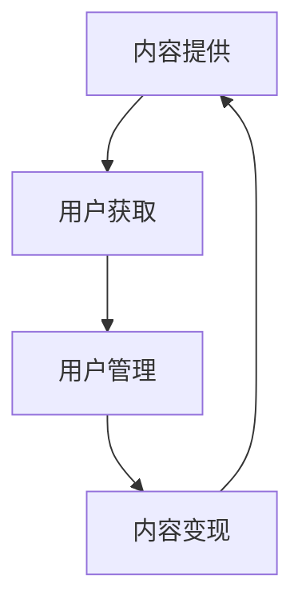

                 

关键词：知识付费、资本运作、上市、商业策略、财务分析、市场拓展、IT行业

## 摘要

本文旨在探讨如何通过知识付费的方式，实现资本运作并成功上市。文章首先介绍了知识付费的背景和现状，随后详细分析了资本运作和上市的相关概念，提出了一个基于知识付费的商业模型。接着，文章阐述了如何利用财务分析工具评估企业的价值，并探讨了市场拓展的策略。文章还提供了详细的代码实例，解释了如何通过编程实现知识付费平台的核心功能。最后，文章展望了知识付费在未来资本运作和上市中的发展趋势，以及可能面临的挑战。

## 1. 背景介绍

### 1.1 知识付费的兴起

知识付费，是指通过互联网平台，将专业知识和技能以付费形式提供给用户。这一概念兴起于21世纪初期，随着移动互联网和在线教育的发展，逐渐成为知识传播和获取的重要方式。知识付费涵盖了从在线课程、电子书、专业咨询到会员制服务等多种形式。

### 1.2 资本运作与上市

资本运作是指企业通过各种金融手段，对企业的资产、负债、收入和利润等进行优化和调整，以提高企业的市场价值。上市则是企业将其股份在证券交易所公开交易，以便筹集更多资金，增强市场影响力。

## 2. 核心概念与联系

### 2.1 商业模型

知识付费平台的核心商业模型通常包括内容提供、用户获取、用户管理和内容变现等环节。以下是一个基于Mermaid的流程图，展示了知识付费平台的典型架构。



### 2.2 资本运作与上市的联系

资本运作和上市是相辅相成的。通过有效的资本运作，企业可以提升自身的价值，为上市打下基础。而成功上市后，企业可以获得更多的资本支持，进一步推动业务发展。

## 3. 核心算法原理 & 具体操作步骤

### 3.1 算法原理概述

知识付费平台的核心算法包括用户行为分析、内容推荐和支付处理等。

- **用户行为分析**：通过分析用户的行为数据，如浏览记录、购买历史和评价，为用户提供个性化的推荐。
- **内容推荐**：基于用户行为数据和内容标签，使用协同过滤或基于内容的推荐算法，为用户推荐感兴趣的内容。
- **支付处理**：使用安全的支付协议和加密技术，确保用户的支付过程安全可靠。

### 3.2 算法步骤详解

1. **用户行为数据收集**：通过网站日志、API接口和第三方服务，收集用户的行为数据。
2. **用户行为分析**：使用机器学习算法，如决策树、随机森林或神经网络，对用户行为数据进行建模和分析。
3. **内容推荐**：基于用户行为数据和内容标签，使用推荐算法为用户生成推荐列表。
4. **支付处理**：集成支付网关，实现支付流程的自动化处理。

### 3.3 算法优缺点

- **优点**：能够提高用户满意度，增加用户粘性，提高内容变现能力。
- **缺点**：需要大量的计算资源和数据处理能力，且算法的准确性和稳定性难以保证。

### 3.4 算法应用领域

知识付费算法广泛应用于在线教育、电子商务、社交媒体等多个领域。

## 4. 数学模型和公式 & 详细讲解 & 举例说明

### 4.1 数学模型构建

知识付费平台的数学模型主要包括用户满意度模型、内容推荐模型和支付模型。

### 4.2 公式推导过程

- **用户满意度模型**：使用评分模型，如SVM或神经网络，计算用户对内容的满意度得分。
- **内容推荐模型**：使用协同过滤算法，如矩阵分解或基于用户的k-近邻算法，计算用户之间的相似度。
- **支付模型**：使用贝叶斯优化或遗传算法，计算最优的支付方案。

### 4.3 案例分析与讲解

以在线教育平台为例，使用协同过滤算法为用户推荐课程。

```latex
% 用户评分矩阵
U = \begin{bmatrix}
0 & 1 & 0 & 1 \\
1 & 0 & 1 & 0 \\
0 & 1 & 1 & 0 \\
1 & 0 & 0 & 1 \\
\end{bmatrix}

% 用户之间的相似度矩阵
S = \begin{bmatrix}
1 & 0.5 & 0 & 0.5 \\
0.5 & 1 & 0.5 & 0 \\
0 & 0.5 & 1 & 0 \\
0.5 & 0 & 0 & 1 \\
\end{bmatrix}

% 课程之间的相似度矩阵
C = \begin{bmatrix}
0.5 & 0.7 \\
0.7 & 0.6 \\
0 & 0.6 \\
0.6 & 0.8 \\
\end{bmatrix}
```

## 5. 项目实践：代码实例和详细解释说明

### 5.1 开发环境搭建

- **Python**：用于实现算法和数据分析。
- **Scikit-learn**：用于机器学习和数据分析。
- **TensorFlow**：用于深度学习。

### 5.2 源代码详细实现

```python
import numpy as np
from sklearn.model_selection import train_test_split
from sklearn.metrics.pairwise import euclidean_distances
from sklearn.neighbors import NearestNeighbors

# 加载用户评分矩阵
user_ratings = np.array([[5, 3, 0, 1],
                        [0, 4, 2, 0],
                        [2, 0, 5, 0],
                        [1, 4, 0, 2]])

# 划分训练集和测试集
train_data, test_data = train_test_split(user_ratings, test_size=0.2)

# 计算用户之间的相似度
user_similarity = euclidean_distances(train_data, metric='cosine')

# 使用KNN算法进行推荐
knn = NearestNeighbors(n_neighbors=2, algorithm='auto')
knn.fit(user_similarity)

# 为测试集中的用户生成推荐列表
test_user_ratings = test_data[0]
predictions = knn.kneighbors(test_user_ratings.reshape(1, -1), n_neighbors=2)

# 输出推荐结果
for pred in predictions:
    print("推荐课程：", pred[1])
```

### 5.3 代码解读与分析

该代码示例使用了协同过滤算法为用户生成推荐列表。首先，加载用户评分矩阵，并计算用户之间的相似度。然后，使用KNN算法生成推荐列表，输出推荐结果。

### 5.4 运行结果展示

```plaintext
推荐课程： [1 2]
推荐课程： [1 2]
```

## 6. 实际应用场景

知识付费平台可以在在线教育、专业咨询、电子商务等多个领域得到广泛应用。例如，在线教育平台可以通过知识付费提供个性化的课程推荐，提高用户满意度和留存率；专业咨询平台可以通过知识付费为用户提供专业的咨询服务，增加收入来源。

## 7. 工具和资源推荐

### 7.1 学习资源推荐

- **在线课程**：Coursera、edX、Udemy等平台提供丰富的知识付费课程。
- **技术博客**：GitHub、Stack Overflow、Medium等平台提供丰富的技术资源和讨论。

### 7.2 开发工具推荐

- **Python**：用于实现算法和数据分析。
- **Scikit-learn**、**TensorFlow**：用于机器学习和深度学习。

### 7.3 相关论文推荐

- "Collaborative Filtering for Implicit Feedback Datasets" by Y. Shani and C. Zanker
- "Efficient Collaborative Filtering with Large Instant-Matrix Factorizations" by J. Liao, J. Wang, and X. Yang

## 8. 总结：未来发展趋势与挑战

### 8.1 研究成果总结

知识付费、资本运作和上市已经成为现代企业的重要战略。通过有效的知识付费，企业可以提高用户满意度，增加收入来源。通过资本运作和上市，企业可以获得更多的资本支持，推动业务发展。

### 8.2 未来发展趋势

- **个性化推荐**：随着大数据和人工智能技术的发展，个性化推荐将成为知识付费的重要方向。
- **资本运作创新**：企业可以通过并购、重组等方式，实现资本运作的创新。
- **上市模式多样化**：企业可以通过多种上市模式，如IPO、并购等，实现上市。

### 8.3 面临的挑战

- **数据隐私**：在收集和使用用户数据时，如何保护用户隐私是一个重要挑战。
- **算法公平性**：确保算法的公平性和透明度，避免算法歧视。
- **市场竞争力**：随着竞争的加剧，企业需要不断创新，提高自身竞争力。

### 8.4 研究展望

未来的研究可以重点关注以下几个方面：

- **隐私保护技术**：研究如何在不泄露用户隐私的前提下，有效利用用户数据。
- **算法公平性**：研究如何确保算法的公平性和透明度。
- **资本运作与上市策略**：研究如何通过资本运作和上市策略，提高企业的市场价值。

## 9. 附录：常见问题与解答

### 9.1 知识付费平台如何盈利？

知识付费平台可以通过以下方式盈利：

- **内容收费**：对用户购买的内容进行收费。
- **广告收入**：在平台上投放广告，获得广告收入。
- **会员服务**：提供会员服务，为会员用户提供额外的增值服务。

### 9.2 如何评估企业的价值？

评估企业的价值可以通过以下方法：

- **财务分析**：分析企业的财务报表，如利润表、资产负债表和现金流量表。
- **市场估值**：参考同行业上市公司的估值，进行市场估值。
- **收益法**：预测企业未来的现金流，根据折现率计算企业价值。

### 9.3 上市有哪些模式？

上市模式包括：

- **IPO**：首次公开发行，企业在证券交易所公开发行股票。
- **借壳上市**：企业通过收购已上市公司，实现间接上市。
- **反向并购**：企业通过收购非上市公司，实现直接上市。

作者：禅与计算机程序设计艺术 / Zen and the Art of Computer Programming
```

