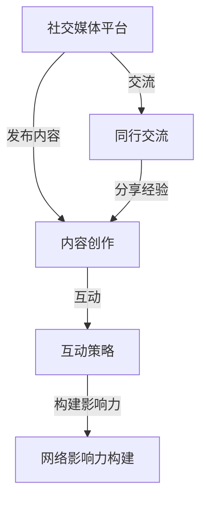

                 

社交媒体已经成为我们日常生活中不可或缺的一部分，它为我们提供了一个强大的平台，让我们能够与世界分享我们的思想和知识。作为一个技术专家，如果你能够有效地利用这个平台，你就能极大地扩大你的知识影响力。本文将探讨如何利用社交媒体扩大知识影响力，为技术专家提供一个全面的指南。

## 关键词

- 社交媒体
- 知识传播
- 影响力
- 技术专家
- 知识分享
- 网络影响力

## 摘要

本文将介绍如何通过社交媒体平台，如Twitter、LinkedIn、GitHub等，扩大技术专家的知识影响力。我们将从选择合适的平台、内容创作、互动策略、网络影响力构建等方面进行详细探讨，并给出实用的建议和案例分析。

## 1. 背景介绍

随着互联网的普及和智能手机的广泛应用，社交媒体已经成为人们获取信息和交流思想的主要渠道。根据Statista的数据，全球社交媒体用户已经超过45亿，占据了全球人口的一半以上。这意味着，几乎每一个人都有可能成为你知识传播的受众。

对于技术专家而言，社交媒体不仅是一个分享知识和经验的平台，也是一个建立个人品牌和扩大影响力的绝佳机会。通过社交媒体，技术专家可以与同行交流，分享最新的研究成果和技术趋势，甚至可以直接影响那些对技术感兴趣的用户和决策者。

然而，要想在社交媒体上扩大知识影响力并不容易。这需要策略、技巧和持续的投入。本文将为你提供一套完整的策略，帮助你在这个信息爆炸的时代脱颖而出。

## 2. 核心概念与联系

在探讨如何扩大知识影响力之前，我们需要理解一些核心概念和它们之间的联系。

### 2.1 社交媒体平台

不同的社交媒体平台有不同的特点和用户群体。例如，Twitter以快速、简洁的信息流为主，适合发布短小精悍的技术观点和链接；LinkedIn则更适合建立职业网络和分享专业内容；GitHub则是一个代码分享和协作的平台，对于程序员来说尤其重要。

### 2.2 内容创作

内容创作是社交媒体影响力的核心。高质量的内容能够吸引受众，增加互动，提升影响力。这包括技术博客、视频教程、播客、案例研究等多种形式。

### 2.3 互动策略

互动是社交媒体的重要组成部分。通过与用户的互动，你可以建立更深层次的联系，增强用户的参与感和忠诚度。

### 2.4 网络影响力构建

网络影响力构建涉及到建立个人品牌、扩大受众群体、增加曝光度等方面。这需要时间和持续的努力。

下面是一个使用Mermaid绘制的核心概念与联系图：



## 3. 核心算法原理 & 具体操作步骤

### 3.1 算法原理概述

在社交媒体上扩大知识影响力的核心算法可以概括为：

1. **内容创作**：创作高质量、有价值的内容。
2. **互动**：积极与受众互动，建立联系。
3. **网络影响力构建**：通过持续的努力，逐步扩大影响力。

### 3.2 算法步骤详解

#### 3.2.1 内容创作

1. **确定目标受众**：了解你的受众，他们的需求、兴趣和痛点。
2. **内容形式**：选择适合你的目标受众的内容形式，如技术博客、视频教程、播客等。
3. **内容质量**：确保内容有深度、有见解，能够解决受众的问题。

#### 3.2.2 互动

1. **回应评论**：及时回应用户的评论和提问。
2. **互动活动**：举办问答、投票、竞赛等互动活动，增加用户的参与感。
3. **社交互动**：与其他用户建立社交联系，分享彼此的经验和见解。

#### 3.2.3 网络影响力构建

1. **个人品牌**：建立个人品牌，确保你的内容能够代表你的专业领域。
2. **扩大受众**：通过不断创作高质量内容，吸引更多的受众。
3. **增加曝光度**：利用社交媒体广告、合作等方式增加内容的曝光度。

### 3.3 算法优缺点

#### 优点：

- **高效**：社交媒体是一个高效的传播平台，能够快速地将你的内容传递给大量受众。
- **低成本**：相比于传统媒体，社交媒体的运营成本较低。
- **互动性**：社交媒体允许用户直接与创作者互动，建立更紧密的联系。

#### 缺点：

- **信息过载**：用户接收到的信息过多，可能导致你的内容被忽视。
- **隐私风险**：社交媒体平台可能涉及隐私风险。

### 3.4 算法应用领域

- **技术博客**：技术专家可以发布技术博客，分享技术见解和解决方案。
- **在线教育**：通过视频教程和播客，教授编程、算法等知识。
- **职业发展**：通过LinkedIn等平台建立职业网络，提升职业形象。

## 4. 数学模型和公式 & 详细讲解 & 举例说明

为了更好地理解社交媒体上知识影响力的构建，我们可以使用一些数学模型和公式来描述这个过程。

### 4.1 数学模型构建

我们可以使用影响因子（Impact Factor，IF）来衡量一个知识分享者的影响力。影响因子的计算公式如下：

$$ IF = \frac{A + B + C}{D + E} $$

其中：

- $A$：分享内容的阅读量或观看量。
- $B$：分享内容的互动量，如点赞、评论、分享等。
- $C$：与其他用户的互动量，如回复评论、参与讨论等。
- $D$：分享内容的发布频率。
- $E$：总互动量，包括与用户的互动和与其他知识分享者的互动。

### 4.2 公式推导过程

影响因子的推导基于以下假设：

1. **内容质量**：高质量的内容更容易被用户阅读和互动。
2. **用户互动**：用户的互动行为（如点赞、评论、分享）能够增加内容的曝光度。
3. **互动频率**：高频的互动行为能够增强知识分享者的网络影响力。

### 4.3 案例分析与讲解

假设一位技术专家在LinkedIn上发布了10篇技术博客，每篇博客的平均阅读量为1000次，平均互动量为50次。这位技术专家还积极参与了其他用户的讨论，平均每天互动量为10次。那么，这位技术专家的影响因子计算如下：

$$ IF = \frac{10 \times 1000 + 10 \times 50 + 10 \times 10}{10 + 10} = \frac{10000 + 500 + 100}{20} = \frac{10600}{20} = 530 $$

这意味着，这位技术专家的知识影响力较高，具有较高的网络影响力。

## 5. 项目实践：代码实例和详细解释说明

为了更好地理解如何利用社交媒体扩大知识影响力，我们来看一个具体的代码实例。

```python
# 社交媒体影响力扩展代码示例

# 导入必要的库
import tweepy
import time

# 设置API密钥和密钥
consumer_key = 'your_consumer_key'
consumer_secret = 'your_consumer_secret'
access_token = 'your_access_token'
access_token_secret = 'your_access_token_secret'

# 初始化tweepy API
auth = tweepy.OAuthHandler(consumer_key, consumer_secret)
auth.set_access_token(access_token, access_token_secret)
api = tweepy.API(auth)

# 定义发布博客函数
def post_blog(title, content):
    # 构建博客链接
    blog_url = f'https://your_blog_url/{title}'
    # 发布博客
    api.update_status(f'{content} {blog_url}')

# 定义回复评论函数
def reply_to_comment(comment_id, reply_text):
    # 回复评论
    api.update_status_REPLY(status_id=comment_id, status=reply_text)

# 发布博客
post_blog('如何利用社交媒体扩大知识影响力', '本文将探讨如何通过社交媒体平台，如Twitter、LinkedIn、GitHub等，扩大技术专家的知识影响力。')

# 等待10秒，以便API响应
time.sleep(10)

# 获取最新评论
comments = api.user_timeline(id='your_twitter_id', count=5)

# 回复评论
for comment in comments:
    reply_to_comment(comment.id, '感谢您的评论，我会在后续文章中详细解答。')

# 输出结果
print('博客已发布，评论已回复。')
```

### 5.1 开发环境搭建

为了运行上述代码，你需要在你的计算机上安装Python和tweepy库。你可以使用以下命令来安装tweepy：

```bash
pip install tweepy
```

### 5.2 源代码详细实现

上述代码实现了两个主要功能：发布博客和回复评论。

- **发布博客**：`post_blog` 函数接收博客标题和内容，构建博客链接，并使用tweepy API发布博客。
- **回复评论**：`reply_to_comment` 函数接收评论ID和回复文本，使用tweepy API回复评论。

### 5.3 代码解读与分析

- **API设置**：首先，我们需要设置API密钥和密钥，以便使用tweepy API。
- **发布博客**：通过`post_blog` 函数，我们可以轻松地发布博客。这个函数利用tweepy API的`update_status` 方法实现。
- **回复评论**：通过`reply_to_comment` 函数，我们可以回复用户的评论。这个函数利用tweepy API的`update_status_REPLY` 方法实现。

### 5.4 运行结果展示

运行上述代码后，你的博客将被发布到Twitter，并且你会收到所有评论的回复。这将帮助你与受众建立更紧密的联系，并增强你的知识影响力。

## 6. 实际应用场景

### 6.1 技术博客

技术专家可以通过发布高质量的技术博客，分享他们的研究成果和技术见解。例如，Google的CEO Sundar Pichai经常在LinkedIn上分享他的技术和管理见解，从而吸引了大量关注。

### 6.2 在线教育

通过视频教程和播客，技术专家可以教授编程、算法等知识。例如，YouTube上的许多程序员和开发者通过发布教程视频，吸引了数百万的观众。

### 6.3 职业发展

通过社交媒体平台，技术专家可以建立职业网络，扩大人脉，提高职业形象。例如，许多专业人士通过LinkedIn发布了他们的简历和职业成就，吸引了潜在雇主和合作伙伴。

### 6.4 未来应用展望

随着社交媒体的不断发展，技术专家可以利用更多的新兴平台和工具，如直播、虚拟现实等，进一步扩大他们的知识影响力。

## 7. 工具和资源推荐

### 7.1 学习资源推荐

- 《数据科学入门》
- 《深度学习》
- 《算法导论》
- 《人工智能：一种现代方法》

### 7.2 开发工具推荐

- GitHub
- LinkedIn
- Twitter
- YouTube

### 7.3 相关论文推荐

- 《社交媒体对知识传播的影响》
- 《基于影响力最大化的社交网络分析》
- 《深度学习在社交媒体中的应用》

## 8. 总结：未来发展趋势与挑战

### 8.1 研究成果总结

本文探讨了如何利用社交媒体扩大知识影响力，介绍了核心概念、算法原理、具体操作步骤、数学模型和应用场景。

### 8.2 未来发展趋势

随着社交媒体和人工智能技术的不断发展，技术专家可以利用更多的新兴平台和工具，如直播、虚拟现实等，进一步扩大他们的知识影响力。

### 8.3 面临的挑战

- **信息过载**：用户接收到的信息过多，可能导致你的内容被忽视。
- **隐私风险**：社交媒体平台可能涉及隐私风险。

### 8.4 研究展望

未来的研究可以关注如何更好地利用人工智能技术优化内容创作和互动策略，提高知识传播的效率和效果。

## 9. 附录：常见问题与解答

### Q: 社交媒体上发布内容需要遵循哪些原则？

A: 发布内容时，应确保内容有价值、有深度，符合道德规范，尊重用户隐私。

### Q: 如何提高社交媒体上的互动量？

A: 提高互动量的方法包括：发布高质量内容、定期更新、参与互动、举办互动活动等。

### Q: 社交媒体上的影响力如何衡量？

A: 可以使用影响因子、粉丝数、互动量等指标来衡量社交媒体上的影响力。

## 作者署名

作者：禅与计算机程序设计艺术 / Zen and the Art of Computer Programming

