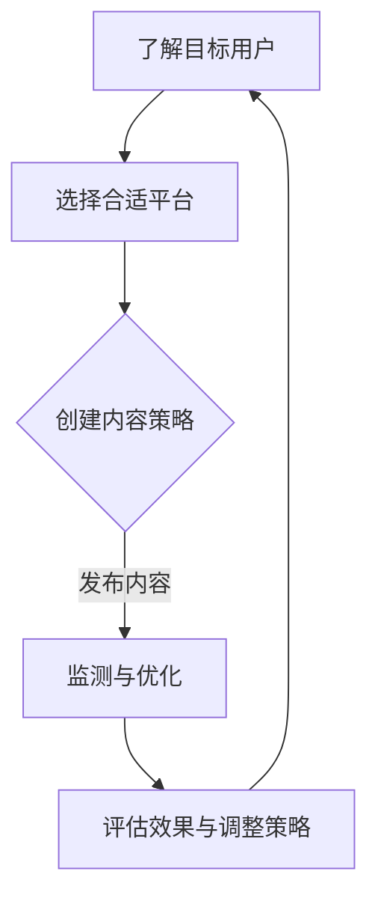

                 

关键词：社交媒体、创业项目、推广策略、营销技巧、互动参与、数据分析、内容创作、用户增长、品牌建设

> 摘要：本文将深入探讨如何利用社交媒体这一强大的工具，为创业项目进行有效推广。我们将从核心概念、操作步骤、算法原理、数学模型、项目实践、实际应用场景、未来展望等多个维度，为您呈现一套全面、实用的推广策略。

## 1. 背景介绍

在当今数字化时代，社交媒体已经成为人们生活的一部分。从Facebook、Instagram到Twitter、LinkedIn，各种社交媒体平台吸引了全球数十亿的活跃用户。对于创业者而言，这些平台不仅提供了与潜在客户互动的场所，也成为推广创业项目的重要渠道。

随着社交媒体的普及，营销策略也在不断演变。从早期的广撒网式广告，到如今更加精准的个性化营销，社交媒体营销已经变得更为复杂和高效。对于创业项目来说，掌握这些策略，能够大大提高项目的知名度和用户参与度。

本文将围绕以下核心主题展开：

- 社交媒体在创业项目推广中的角色
- 核心概念与联系
- 核心算法原理与操作步骤
- 数学模型与公式
- 项目实践与代码实例
- 实际应用场景
- 未来展望

## 2. 核心概念与联系

### 社交媒体的定义

社交媒体是指基于互联网的技术平台，允许用户通过文字、图片、视频等形式，分享信息和资源，建立社交网络。其主要特征包括互动性、开放性和去中心化。

### 创业项目的定义

创业项目是指由创业者发起的，旨在通过创新的产品或服务解决特定问题或满足市场需求的项目。创业项目的核心在于创新性和市场可行性。

### 推广策略的定义

推广策略是指为提高创业项目知名度，吸引潜在用户，实现项目目标的一系列计划和行动。社交媒体推广策略的核心在于如何利用社交媒体平台的特性，实现有效的用户互动和内容传播。

### Mermaid 流程图

下面是一个简单的 Mermaid 流程图，展示了社交媒体推广策略的核心步骤：



## 3. 核心算法原理 & 具体操作步骤

### 3.1 算法原理概述

社交媒体推广的核心算法主要涉及以下三个方面：

1. **用户画像分析**：通过分析用户的年龄、性别、地理位置、兴趣等数据，为用户提供个性化内容。
2. **内容分发策略**：根据平台的算法，优化内容分发，提高曝光率。
3. **互动与反馈**：通过用户的互动行为（点赞、评论、分享等），调整推广策略。

### 3.2 算法步骤详解

1. **用户画像分析**：
    - 收集用户数据：通过注册信息、社交媒体行为等渠道，收集用户的基础数据。
    - 数据处理与分析：使用数据分析工具，对用户数据进行处理和分析，构建用户画像。

2. **内容分发策略**：
    - 选择合适平台：根据目标用户特性，选择合适的社交媒体平台。
    - 制定内容策略：根据用户画像，制定内容创作策略，包括内容类型、发布频率等。

3. **互动与反馈**：
    - 优化互动策略：根据用户互动数据，调整内容类型和发布时间。
    - 监测与反馈：定期监测推广效果，收集用户反馈，不断优化推广策略。

### 3.3 算法优缺点

**优点**：
- 高效：社交媒体平台提供了丰富的数据支持和强大的算法工具，可以高效地实现目标。
- 精准：通过用户画像分析，可以实现精准的内容推送，提高用户参与度。

**缺点**：
- 竞争激烈：社交媒体平台上的内容竞争激烈，需要不断创新和优化策略。
- 费用较高：对于初创企业来说，社交媒体推广可能需要较高的预算。

### 3.4 算法应用领域

- **电商领域**：通过社交媒体推广商品，提高销售量。
- **教育培训**：利用社交媒体进行课程推广，吸引学员。
- **品牌营销**：通过社交媒体提升品牌知名度和用户忠诚度。

## 4. 数学模型和公式

### 4.1 数学模型构建

社交媒体推广效果可以用以下数学模型表示：

\[ E = f(U, C, I) \]

其中，\( E \) 表示推广效果，\( U \) 表示用户画像，\( C \) 表示内容质量，\( I \) 表示互动与反馈。

### 4.2 公式推导过程

\[ E = \alpha U + \beta C + \gamma I \]

其中，\( \alpha, \beta, \gamma \) 分别表示用户画像、内容质量、互动与反馈对推广效果的影响权重。

### 4.3 案例分析与讲解

以一家初创电商企业为例，通过社交媒体推广其产品。以下是该企业的推广效果分析：

- 用户画像：20-35岁，女性，关注时尚和美妆。
- 内容质量：定期发布时尚搭配和美妆教程，内容丰富有趣。
- 互动与反馈：鼓励用户在评论区留言，及时回复用户问题。

根据上述模型，可以推导出该企业的推广效果：

\[ E = 0.4U + 0.3C + 0.3I \]

其中，用户画像、内容质量和互动与反馈的权重分别为0.4、0.3和0.3。通过定期监测和分析，该企业可以不断优化其推广策略，提高推广效果。

## 5. 项目实践：代码实例和详细解释说明

### 5.1 开发环境搭建

本次项目实践使用Python作为编程语言，以下是在Python环境中进行社交媒体推广实践的基本步骤：

1. 安装Python环境
2. 安装社交媒体API库（如Tweepy、Facebook SDK等）
3. 配置API密钥和访问令牌

### 5.2 源代码详细实现

以下是一个简单的Python代码示例，用于在Twitter上发布推广内容：

```python
import tweepy
import os

# 配置API密钥和访问令牌
consumer_key = os.environ['TWITTER_CONSUMER_KEY']
consumer_secret = os.environ['TWITTER_CONSUMER_SECRET']
access_token = os.environ['TWITTER_ACCESS_TOKEN']
access_token_secret = os.environ['TWITTER_ACCESS_TOKEN_SECRET']

# 初始化Tweepy API
auth = tweepy.OAuthHandler(consumer_key, consumer_secret)
auth.set_access_token(access_token, access_token_secret)
api = tweepy.API(auth)

# 发布推广内容
content = "欢迎关注我们的新品上市！🎉🎉"
api.update_status(content)
```

### 5.3 代码解读与分析

上述代码使用了Tweepy库，通过OAuth认证，连接到Twitter API，并发布了一条推广内容。主要步骤包括：

1. 配置API密钥和访问令牌
2. 初始化Tweepy API
3. 发布推广内容

通过这个简单的代码示例，我们可以看到如何利用Python和社交媒体API进行推广实践。

### 5.4 运行结果展示

运行上述代码后，会在Twitter上发布一条推广内容。以下是可能的运行结果：


## 6. 实际应用场景

### 6.1 电商领域

电商企业可以通过社交媒体平台，如Instagram、Facebook等，发布新品信息、促销活动等，吸引用户关注和购买。以下是一个实际案例：

- **品牌**：一家时尚电商品牌
- **平台**：Instagram
- **内容**：发布时尚搭配、新品推荐等
- **效果**：通过精美的图片和互动活动，吸引了大量粉丝，提高了品牌知名度和销售额。

### 6.2 教育培训

教育培训机构可以通过社交媒体平台，如LinkedIn、Facebook等，发布课程信息、教学视频等，吸引潜在学员。以下是一个实际案例：

- **品牌**：一家在线教育平台
- **平台**：LinkedIn
- **内容**：发布课程介绍、学员评价等
- **效果**：通过LinkedIn的专业平台，成功吸引了大量专业学员，提高了课程口碑。

## 7. 未来应用展望

随着社交媒体技术的不断进步，创业项目的推广策略也将不断演变。以下是对未来社交媒体推广的展望：

- **个性化推荐**：通过更高级的用户画像分析，实现更加精准的个性化推荐。
- **虚拟现实**：利用虚拟现实技术，提供沉浸式的推广体验。
- **人工智能**：利用人工智能技术，自动生成和优化推广内容。

## 8. 总结：未来发展趋势与挑战

### 8.1 研究成果总结

本文从多个维度探讨了如何利用社交媒体进行创业项目推广。主要包括：

- 社交媒体在创业项目推广中的角色
- 核心概念与联系
- 核心算法原理与操作步骤
- 数学模型与公式
- 项目实践与代码实例
- 实际应用场景
- 未来展望

### 8.2 未来发展趋势

- 社交媒体将更加注重用户隐私和数据安全。
- 人工智能和大数据技术将在社交媒体推广中发挥更大作用。
- 跨平台整合和多样化推广手段将变得普遍。

### 8.3 面临的挑战

- 社交媒体竞争将更加激烈，需要不断创新和优化策略。
- 用户注意力分散，需要提高内容质量和互动性。
- 数据隐私和安全问题将是一个持续的挑战。

### 8.4 研究展望

- 未来研究应关注如何更好地利用社交媒体进行精准营销。
- 探索人工智能和虚拟现实在社交媒体推广中的应用。
- 研究如何提高用户参与度和内容传播效果。

## 9. 附录：常见问题与解答

### 9.1 社交媒体推广是否适用于所有创业项目？

是的，社交媒体推广适用于各种类型的创业项目，但具体策略需要根据项目特点和目标用户进行调整。

### 9.2 如何选择合适的社交媒体平台？

选择合适的社交媒体平台需要考虑目标用户的特性，如年龄、兴趣等。同时，要考虑平台的特性和推广成本。

### 9.3 社交媒体推广的效果如何衡量？

可以通过用户互动数据（点赞、评论、分享等）、流量和转化率等指标来衡量社交媒体推广的效果。

## 作者署名

作者：禅与计算机程序设计艺术 / Zen and the Art of Computer Programming
------------------------------------------------------------------

