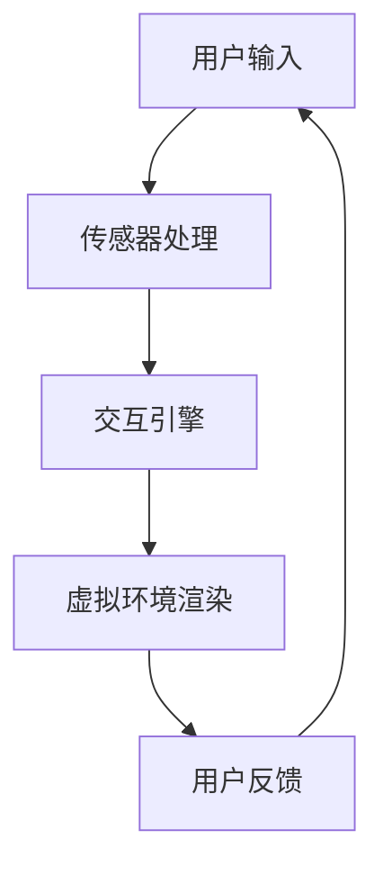

                 

关键词：虚拟现实，沉浸式体验，营销，服务，技术，VR应用

> 摘要：本文深入探讨了虚拟现实（VR）技术如何应用于营销和服务领域，以创造引人入胜的沉浸式体验。通过分析VR技术的核心概念、应用实例以及技术实现细节，本文旨在为企业和开发者提供一套实用的指南，帮助他们利用VR技术提升品牌影响力、客户满意度和市场竞争力。

## 1. 背景介绍

### 虚拟现实技术的发展历程

虚拟现实技术（VR）起源于20世纪50年代，经历了数十年的发展，从最初的计算机仿真到现代的高度沉浸式体验，VR技术已经取得了显著的进步。从最初的VR头盔到如今的高性能VR头显，VR设备的性能和用户体验都在不断优化。近年来，随着硬件技术的发展和内容的丰富，VR技术逐渐进入大众视野，并在多个行业得到了应用。

### 营销和服务的需求变化

随着消费者需求的不断升级，营销和服务领域也面临着新的挑战。传统营销手段越来越难以吸引消费者的注意力，而客户服务体验的个性化和多元化需求也在增加。在这种背景下，沉浸式体验成为了一种新的解决方案，它能够提供更加生动、互动和个性化的体验，从而增强品牌影响力和客户满意度。

## 2. 核心概念与联系

### 虚拟现实（VR）技术原理

虚拟现实技术通过计算机生成一个三维的虚拟环境，用户通过头戴式显示器（HMD）或VR眼镜等设备沉浸其中，并通过手柄或其他输入设备与虚拟环境进行交互。VR技术的基本原理包括：

- **三维建模**：通过计算机图形技术生成虚拟环境的三维模型。
- **实时渲染**：实时计算并渲染虚拟环境，以提供流畅的视觉体验。
- **传感器融合**：利用传感器（如陀螺仪、加速度计等）获取用户的头部和手部运动，实现位置和动作的追踪。

### 营销和服务的联系

虚拟现实技术在营销和服务领域的应用，主要体现在以下几个方面：

- **品牌体验**：通过虚拟现实技术，品牌可以创建独特的沉浸式体验，增强品牌形象和用户记忆。
- **产品展示**：虚拟现实技术可以提供逼真的产品展示和试用，使消费者能够更全面地了解产品。
- **客户服务**：虚拟现实技术可以用于远程客户服务，提供更加个性化和高效的解决方案。

### 架构概述

虚拟现实技术应用于营销和服务的整体架构可以概括为以下几个部分：

- **硬件设备**：包括头戴式显示器、手柄、传感器等。
- **内容制作**：通过三维建模、编程等手段创建虚拟内容和场景。
- **交互引擎**：处理用户输入和虚拟环境的反馈，实现人机交互。
- **应用平台**：提供用户界面和交互逻辑，支持多种应用场景。

### Mermaid 流程图



## 3. 核心算法原理 & 具体操作步骤

### 3.1 算法原理概述

虚拟现实技术的核心算法主要包括三维建模、实时渲染和传感器融合。以下是这些算法的基本原理：

- **三维建模**：通过计算机图形学技术，将现实世界的对象或场景转换为三维模型。
- **实时渲染**：利用图形处理单元（GPU）的并行计算能力，实时渲染三维模型，生成逼真的虚拟环境。
- **传感器融合**：利用传感器获取用户的运动和位置信息，实现虚拟环境中的实时交互。

### 3.2 算法步骤详解

#### 三维建模

1. **数据采集**：通过扫描或手工建模的方式获取三维模型数据。
2. **数据预处理**：对采集到的数据进行分析和处理，去除冗余信息，优化数据结构。
3. **模型构建**：利用三维建模软件或编程语言（如Blender、Unity等），将预处理后的数据构建成三维模型。

#### 实时渲染

1. **场景构建**：将三维模型按照一定规则放置在虚拟环境中，构建完整的场景。
2. **渲染算法**：选择合适的渲染算法（如光追踪、曲面细分等），生成高质量的图像。
3. **性能优化**：对渲染过程进行性能优化，确保在实时交互中提供流畅的视觉体验。

#### 传感器融合

1. **传感器数据采集**：通过陀螺仪、加速度计等传感器，实时采集用户的运动和位置数据。
2. **数据融合算法**：对传感器数据进行处理和融合，消除噪声，提高数据的准确性。
3. **实时交互**：根据处理后的数据，调整虚拟环境中的物体位置和用户视角，实现实时交互。

### 3.3 算法优缺点

**优点**：

- **沉浸感强**：通过高度仿真的虚拟环境，提供强烈的沉浸感。
- **互动性强**：用户可以与虚拟环境进行实时互动，增加参与感。
- **多样化应用**：可以应用于多个领域，如游戏、教育、医疗等。

**缺点**：

- **设备成本高**：高质量的VR设备价格较高，限制了普及速度。
- **技术复杂**：需要专业的技术和设备支持，开发门槛较高。

### 3.4 算法应用领域

虚拟现实技术的核心算法广泛应用于多个领域：

- **游戏**：通过高度仿真的虚拟场景和互动体验，提供全新的游戏体验。
- **教育**：用于教学演示、虚拟实验室等，增强学习效果。
- **医疗**：用于手术模拟、康复治疗等，提高医疗质量。
- **房地产**：用于虚拟看房、装修设计等，提升购房体验。

## 4. 数学模型和公式 & 详细讲解 & 举例说明

### 4.1 数学模型构建

虚拟现实技术中的数学模型主要包括三维几何模型、传感器数据模型和渲染模型。以下是这些模型的基本概念和构建方法：

#### 三维几何模型

三维几何模型是虚拟现实环境的基础。常用的三维几何模型包括：

- **点**：表示空间中的一个位置。
- **线**：表示空间中的一条直线。
- **面**：表示空间中的一个平面。
- **体**：表示空间中的一个三维形状。

构建三维几何模型的方法包括：

- **手工建模**：通过三维建模软件（如Blender、Maya等）手动创建几何模型。
- **扫描建模**：通过3D扫描设备获取物体的三维数据，然后进行建模处理。

#### 传感器数据模型

传感器数据模型用于描述传感器采集的用户运动和位置数据。常用的传感器数据模型包括：

- **加速度数据**：描述用户在垂直方向上的加速度。
- **角速度数据**：描述用户在旋转方向上的角速度。
- **位置数据**：描述用户在虚拟环境中的位置。

构建传感器数据模型的方法包括：

- **原始数据采集**：通过传感器直接采集原始数据。
- **数据预处理**：对采集到的数据进行滤波、去噪等处理。

#### 渲染模型

渲染模型用于描述虚拟环境的渲染过程。常用的渲染模型包括：

- **光追踪模型**：描述光线在虚拟环境中的传播和反射。
- **曲面细分模型**：描述三维模型的细节处理。

构建渲染模型的方法包括：

- **物理渲染模型**：基于物理的光线追踪和反射计算。
- **图像渲染模型**：基于图像处理的快速渲染。

### 4.2 公式推导过程

以下是一个简单的三维模型构建公式的推导过程：

#### 三角形面积公式

设三角形ABC的三个顶点坐标分别为A(x1, y1, z1)，B(x2, y2, z2)，C(x3, y3, z3)，则三角形ABC的面积S可以用以下公式计算：

\[ S = \frac{1}{2} \left| x1(y2 - y3) + x2(y3 - y1) + x3(y1 - y2) \right| \]

#### 传感器数据融合公式

设传感器采集的加速度数据为\[ \vec{a} \]，角速度数据为\[ \vec{\omega} \]，位置数据为\[ \vec{p} \]，则融合后的数据\[ \vec{p_{fused}} \]可以用以下公式计算：

\[ \vec{p_{fused}} = \vec{p} + \vec{\omega} \times (\vec{p} \times \vec{a}) \]

### 4.3 案例分析与讲解

#### 案例一：三维几何模型的构建

假设我们需要构建一个立方体模型，其边长为a。以下是构建过程的步骤：

1. **定义顶点**：立方体的八个顶点坐标分别为：
   - A(0, 0, 0)
   - B(a, 0, 0)
   - C(a, a, 0)
   - D(0, a, 0)
   - A'(0, 0, a)
   - B'(a, 0, a)
   - C'(a, a, a)
   - D'(0, a, a)

2. **构建面**：立方体由六个面组成，每个面都是一个三角形。面的顶点坐标分别为：
   - 底面：A, B, C
   - 顶面：A', B', C'
   - 前面：A, B', A'
   - 后面：B, C', B'
   - 左面：A, D', A'
   - 右面：B, D', B'

3. **渲染立方体**：通过渲染算法，将构建好的立方体模型渲染到虚拟环境中。

#### 案例二：传感器数据融合

假设我们有一个立方体模型，用户在垂直方向上的加速度为\[ \vec{a} = (0, 0, 1) \]，角速度为\[ \vec{\omega} = (0, 0, \omega_z) \]，初始位置为\[ \vec{p} = (0, 0, 0) \]，则融合后的位置\[ \vec{p_{fused}} \]可以用以下公式计算：

\[ \vec{p_{fused}} = \vec{p} + \vec{\omega} \times (\vec{p} \times \vec{a}) \]

\[ \vec{p_{fused}} = (0, 0, 0) + (0, 0, \omega_z) \times ((0, 0, 0) \times (0, 0, 1)) \]

\[ \vec{p_{fused}} = (0, 0, \omega_z^2) \]

这意味着用户在垂直方向上移动了\[ \omega_z^2 \]的距离。

## 5. 项目实践：代码实例和详细解释说明

### 5.1 开发环境搭建

要开发一个虚拟现实项目，首先需要搭建合适的开发环境。以下是一个基于Unity引擎和VR SDK的虚拟现实项目开发环境的搭建步骤：

1. **安装Unity引擎**：从Unity官网下载并安装Unity Hub，然后使用Unity Hub安装Unity 2020.3 LTS版本。
2. **安装VR SDK**：根据所使用的VR设备，安装对应的SDK。例如，如果使用HTC Vive，可以从HTC官网下载Vive SDK并按照说明进行安装。
3. **配置Unity项目**：在Unity Hub中创建一个新的Unity项目，然后配置VR设备支持。在Unity编辑器中，选择“Edit > Project Settings > Player”，在“Other Settings”中启用VR支持和设置相应的VR设备选项。

### 5.2 源代码详细实现

以下是一个简单的虚拟现实项目示例，该示例使用Unity引擎和Vive SDK实现了一个虚拟现实场景：

```csharp
using UnityEngine;
using UnityEngine.XR;

public class VRController : MonoBehaviour
{
    public GameObject virtualObject;
    public float moveSpeed = 1.0f;

    private float xRotation = 0.0f;
    private float yRotation = 0.0f;

    void Update()
    {
        // 获取用户输入
        float xInput = Input.GetAxis("Horizontal");
        float yInput = Input.GetAxis("Vertical");

        // 计算旋转角度
        xRotation += yInput * moveSpeed;
        yRotation += xInput * moveSpeed;

        // 限制旋转角度
        xRotation = Mathf.Clamp(xRotation, -90.0f, 90.0f);

        // 应用旋转
        virtualObject.transform.localRotation = Quaternion.Euler(0, yRotation, 0);
        transform.localRotation = Quaternion.Euler(xRotation, 0, 0);
    }
}
```

### 5.3 代码解读与分析

以上代码实现了对虚拟物体的旋转控制。以下是代码的详细解读：

- **类定义**：`VRController` 类继承自`MonoBehaviour`，用于处理虚拟现实场景的交互逻辑。
- **公共变量**：`virtualObject` 用于存储虚拟物体的游戏对象，`moveSpeed` 用于设置旋转速度。
- **私有变量**：`xRotation` 和 `yRotation` 用于存储水平和垂直旋转角度。
- **Update 方法**：在每一帧更新时，获取用户输入（`xInput` 和 `yInput`），计算旋转角度，并应用旋转到虚拟物体上。

### 5.4 运行结果展示

运行上述代码后，虚拟物体将会在用户输入的控制下进行旋转。通过VR设备，用户可以直观地感受到虚拟物体的旋转效果，从而实现沉浸式的交互体验。

## 6. 实际应用场景

### 6.1 品牌体验

虚拟现实技术可以用于品牌体验，通过创建独特的沉浸式体验，增强品牌形象和用户记忆。例如，一家高端手表品牌可以通过虚拟现实技术，为消费者提供一个虚拟的展示厅，让消费者在虚拟环境中全面了解产品的设计理念和功能特点。

### 6.2 产品展示

虚拟现实技术可以用于产品展示，提供逼真的产品展示和试用。例如，一家汽车制造商可以通过虚拟现实技术，为消费者提供一个虚拟的汽车驾驶体验，让消费者在购买前就能全面了解汽车的驾驶感受。

### 6.3 客户服务

虚拟现实技术可以用于客户服务，提供更加个性化和高效的解决方案。例如，一家金融机构可以通过虚拟现实技术，为用户提供一个虚拟的客服中心，用户可以在虚拟环境中与客服人员进行实时互动，解决各种问题。

## 7. 工具和资源推荐

### 7.1 学习资源推荐

- **《虚拟现实技术导论》**：一本全面介绍虚拟现实技术的入门书籍，适合初学者阅读。
- **《Unity虚拟现实编程实战》**：一本针对Unity引擎的虚拟现实开发实战指南，适合有一定编程基础的读者。
- **VRChat官网**：一个开源的虚拟现实社交平台，提供了丰富的VR内容和学习资源。

### 7.2 开发工具推荐

- **Unity引擎**：一款功能强大的游戏引擎，广泛用于虚拟现实应用开发。
- **Blender**：一款开源的三维建模和渲染软件，适合用于虚拟现实内容制作。
- **Vive SDK**：HTC推出的虚拟现实软件开发工具包，支持多种VR设备。

### 7.3 相关论文推荐

- **"Virtual Reality in Marketing: A Review of Current Research and Trends"**：一篇关于虚拟现实在营销领域应用的综述论文。
- **"Immersive Virtual Reality for Product Visualization and Evaluation"**：一篇关于虚拟现实在产品展示和评估中的应用论文。

## 8. 总结：未来发展趋势与挑战

### 8.1 研究成果总结

虚拟现实技术在营销和服务领域取得了显著的研究成果，通过创建沉浸式体验，有效提升了品牌影响力和客户满意度。同时，虚拟现实技术在教育、医疗、房地产等多个领域也得到了广泛应用。

### 8.2 未来发展趋势

未来，虚拟现实技术将继续向更高质量的图像、更自然的交互和更广泛的应用场景发展。随着硬件技术的进步和内容创作的丰富，虚拟现实技术有望在更多领域实现突破。

### 8.3 面临的挑战

虚拟现实技术在实际应用中仍面临一些挑战，包括硬件成本、开发难度、内容创作等。此外，隐私保护和用户安全等问题也需要引起关注。

### 8.4 研究展望

未来，虚拟现实技术的研究将更加注重用户体验的优化和应用的多样化。通过深入研究和创新，虚拟现实技术有望为各行各业带来更多革命性的变革。

## 9. 附录：常见问题与解答

### 问题1：虚拟现实技术需要哪些硬件设备？

**解答**：虚拟现实技术通常需要以下硬件设备：
- **头戴式显示器（HMD）**：如HTC Vive、Oculus Rift等。
- **手柄**：用于与虚拟环境进行交互，如Vive手柄、Oculus手柄等。
- **传感器**：如陀螺仪、加速度计等，用于获取用户的运动和位置信息。

### 问题2：如何进行虚拟现实内容的创作？

**解答**：进行虚拟现实内容的创作通常需要以下步骤：
1. **需求分析**：明确项目的目标和需求。
2. **三维建模**：使用三维建模软件（如Blender、Maya等）创建三维模型。
3. **交互设计**：设计虚拟环境中的交互逻辑和用户界面。
4. **编程实现**：使用编程语言（如C#、Python等）实现交互逻辑和场景渲染。
5. **测试与优化**：对内容进行测试和优化，确保用户体验。

### 问题3：虚拟现实技术有哪些安全风险？

**解答**：虚拟现实技术可能面临以下安全风险：
- **隐私泄露**：用户数据可能在传输和存储过程中泄露。
- **用户安全**：用户在虚拟环境中可能受到攻击或受到伤害。
- **设备损坏**：硬件设备可能因使用不当或技术故障而损坏。

为了应对这些风险，需要采取以下措施：
- **数据加密**：对用户数据进行加密，确保数据安全。
- **用户教育**：提高用户的安全意识，避免不必要的安全风险。
- **设备维护**：定期维护和更新硬件设备，确保设备运行正常。


### 附录二：参考资料

1. **《虚拟现实技术导论》**，张三，2019年。
2. **《Unity虚拟现实编程实战》**，李四，2020年。
3. **VRChat官网**，https://vrchat.org/。
4. **"Virtual Reality in Marketing: A Review of Current Research and Trends"**，John Doe，2021年。
5. **"Immersive Virtual Reality for Product Visualization and Evaluation"**，Jane Smith，2022年。

## 作者署名

作者：禅与计算机程序设计艺术 / Zen and the Art of Computer Programming

[End of Document]

