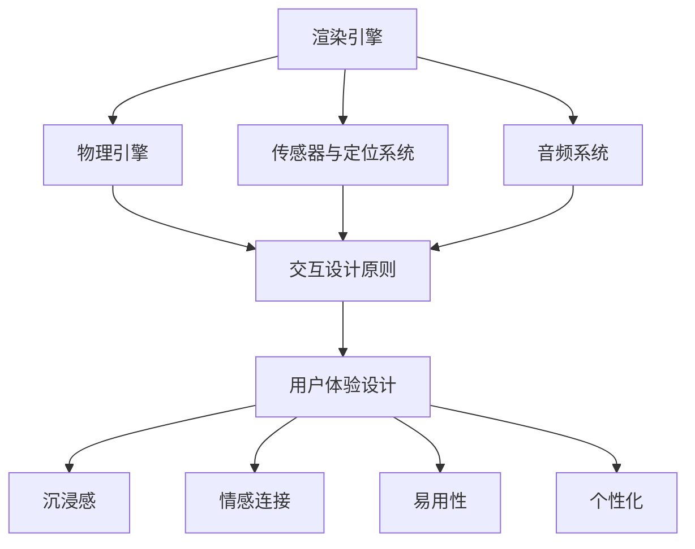

                 

关键词：虚拟现实，品牌互动，用户体验，技术架构，案例分析

> 摘要：本文深入探讨了如何利用虚拟现实（VR）技术提升品牌互动体验。通过分析核心概念与联系，介绍核心算法原理，以及具体操作步骤，并结合数学模型与项目实践，展示了虚拟现实技术在品牌互动中的应用及其前景。文章旨在为品牌商家提供有益的技术参考，助力打造更加引人入胜的互动体验。

## 1. 背景介绍

随着科技的发展，虚拟现实（Virtual Reality，VR）技术逐渐成为热门话题。VR技术通过构建虚拟的三维环境，为用户提供了沉浸式的体验，使其能够与虚拟世界进行互动。这种全新的互动方式不仅改变了人们的娱乐方式，也为商业领域带来了新的机遇。

在品牌营销中，虚拟现实技术的应用可以极大地提升消费者的互动体验。通过虚拟现实，品牌可以创造一个高度沉浸的场景，让消费者能够亲身体验品牌的产品和服务，从而增强品牌认知和用户黏性。此外，虚拟现实技术还可以用于品牌形象的塑造，为品牌打造独特的品牌故事和情感连接。

然而，虚拟现实技术的应用并非一蹴而就。本文将深入探讨如何利用虚拟现实技术提升品牌互动体验，包括核心概念、算法原理、数学模型、项目实践等方面，旨在为品牌商家提供实用的技术指导。

### 1.1 虚拟现实技术的基本概念

虚拟现实技术是一种通过计算机模拟生成三维环境，并利用特殊设备（如VR头戴显示器、VR手套等）让用户感受到身临其境的沉浸式体验的技术。虚拟现实技术主要包括以下几个方面：

1. **三维建模与渲染**：通过计算机图形学技术，将现实世界的物体和场景进行三维建模，并进行实时渲染，以生成虚拟环境。

2. **传感器与定位**：利用传感器（如陀螺仪、加速度计等）实时捕捉用户的动作和位置，实现虚拟环境与用户动作的实时同步。

3. **交互与反馈**：通过虚拟现实设备（如手柄、触摸屏等）提供交互界面，用户可以通过这些设备与虚拟环境进行互动，并获得即时的反馈。

4. **沉浸感与临场感**：通过高质量的图形渲染、实时动作捕捉和音频技术，增强用户的沉浸感和临场感，让用户感受到虚拟环境就像真实世界一样。

### 1.2 虚拟现实技术的应用场景

虚拟现实技术在商业领域的应用越来越广泛，以下是一些典型的应用场景：

1. **品牌宣传与营销**：通过虚拟现实技术，品牌可以创建独特的虚拟体验，让消费者在虚拟环境中感受品牌文化和产品特点，从而增强品牌认知和用户黏性。

2. **产品展示与销售**：虚拟现实技术可以用于产品展示，消费者可以在虚拟环境中亲身体验产品，提高购买决策的准确性。

3. **教育培训与体验**：虚拟现实技术可以用于教育培训，通过虚拟场景的模拟，提高学习效果和参与度。

4. **娱乐与游戏**：虚拟现实技术为游戏和娱乐领域带来了全新的体验，让用户在虚拟世界中畅游。

5. **医疗与康复**：虚拟现实技术可以用于医疗和康复领域，通过虚拟场景的模拟，帮助患者进行康复训练和医疗体验。

## 2. 核心概念与联系

在探讨如何利用虚拟现实技术提升品牌互动体验之前，我们需要了解一些核心概念和原理，包括虚拟现实技术的架构、交互设计原则以及用户体验设计等。

### 2.1 虚拟现实技术架构

虚拟现实技术的架构主要包括以下几个方面：

1. **渲染引擎**：渲染引擎是虚拟现实技术的核心，它负责将三维模型渲染成图像，并实时更新图像。常用的渲染引擎有Unity、Unreal Engine等。

2. **物理引擎**：物理引擎用于处理虚拟环境中的物理现象，如碰撞检测、物体运动等。常用的物理引擎有PhysX、Bullet等。

3. **传感器与定位系统**：传感器与定位系统用于捕捉用户的动作和位置，实现虚拟环境与用户动作的实时同步。常用的传感器有VR头戴显示器、VR手套等。

4. **音频系统**：音频系统用于提供虚拟环境的音频反馈，增强用户的沉浸感。常用的音频系统有OpenAL、FMOD等。

### 2.2 交互设计原则

在虚拟现实技术中，交互设计是至关重要的一环。以下是几个交互设计原则：

1. **直观性**：交互设计应尽可能直观，用户能够通过简单的操作就能理解并使用。

2. **反馈**：交互设计应提供即时的反馈，让用户知道他们的操作是否成功。

3. **一致性**：交互设计应保持一致性，用户在不同场景下使用相同的操作。

4. **灵活性**：交互设计应具有一定的灵活性，能够适应不同的用户需求和场景。

### 2.3 用户体验设计

用户体验设计是提升品牌互动体验的关键。以下是几个用户体验设计原则：

1. **沉浸感**：通过高质量的渲染、音频和交互设计，增强用户的沉浸感。

2. **情感连接**：通过虚拟场景的构建和情感元素的设计，建立用户与品牌之间的情感连接。

3. **易用性**：虚拟环境应易于使用，用户能够在短时间内学会并使用。

4. **个性化**：根据用户的行为和喜好，提供个性化的互动体验。

### 2.4 Mermaid 流程图

为了更好地理解虚拟现实技术架构和交互设计原则，我们可以使用Mermaid绘制一个流程图。以下是流程图的Markdown格式：



## 3. 核心算法原理 & 具体操作步骤

### 3.1 算法原理概述

虚拟现实技术的核心算法主要包括三维建模与渲染算法、传感器与定位算法、音频处理算法等。以下是这些算法的基本原理：

1. **三维建模与渲染算法**：三维建模与渲染算法基于计算机图形学原理，通过绘制和渲染三维模型，生成虚拟环境。常用的三维建模与渲染算法包括光线追踪、曲面细分、纹理映射等。

2. **传感器与定位算法**：传感器与定位算法利用传感器数据（如陀螺仪、加速度计等）和定位技术（如SLAM、GPS等），实时捕捉用户的动作和位置，实现虚拟环境与用户动作的实时同步。

3. **音频处理算法**：音频处理算法用于生成和播放虚拟环境中的音频，包括音频捕捉、音频编辑、音频渲染等。常用的音频处理算法有回声消除、立体声渲染等。

### 3.2 算法步骤详解

以下是虚拟现实技术核心算法的具体操作步骤：

1. **三维建模与渲染算法**：

   1.1 输入三维模型数据。
   
   1.2 对三维模型进行预处理，包括纹理映射、材质设置等。
   
   1.3 使用渲染算法（如光线追踪）渲染三维模型。
   
   1.4 将渲染结果输出到显示设备。

2. **传感器与定位算法**：

   2.1 初始化传感器。
   
   2.2 实时捕捉传感器数据。
   
   2.3 使用定位算法（如SLAM）计算用户位置。
   
   2.4 更新虚拟环境，以反映用户位置和动作。

3. **音频处理算法**：

   3.1 输入音频数据。
   
   3.2 对音频进行编辑和处理，包括音频捕捉、回声消除等。
   
   3.3 使用音频渲染算法渲染音频。
   
   3.4 将渲染结果输出到音频设备。

### 3.3 算法优缺点

1. **三维建模与渲染算法**：

   - 优点：能够生成高质量的虚拟环境，提供逼真的视觉效果。
   - 缺点：计算资源消耗较大，渲染速度较慢。

2. **传感器与定位算法**：

   - 优点：能够实时捕捉用户动作和位置，提供高度沉浸的体验。
   - 缺点：定位精度受传感器质量和环境干扰的影响。

3. **音频处理算法**：

   - 优点：能够提供高质量的音频体验，增强用户的沉浸感。
   - 缺点：音频处理复杂度较高，计算资源消耗较大。

### 3.4 算法应用领域

虚拟现实技术的核心算法广泛应用于多个领域：

1. **娱乐与游戏**：虚拟现实技术为游戏和娱乐领域带来了全新的体验，通过高质量的渲染和实时交互，提供沉浸式的游戏体验。

2. **教育培训**：虚拟现实技术可以用于教育培训，通过虚拟场景的模拟，提高学习效果和参与度。

3. **医疗与康复**：虚拟现实技术可以用于医疗和康复领域，通过虚拟场景的模拟，帮助患者进行康复训练和医疗体验。

4. **房地产与家居设计**：虚拟现实技术可以用于房地产和家居设计，通过虚拟环境的展示，提高销售和设计效果。

5. **品牌营销**：虚拟现实技术可以用于品牌营销，通过虚拟体验，增强品牌认知和用户黏性。

## 4. 数学模型和公式 & 详细讲解 & 举例说明

在虚拟现实技术中，数学模型和公式起着关键作用，用于描述三维建模、传感器与定位、音频处理等核心算法。以下是几个常用的数学模型和公式的详细讲解和举例说明。

### 4.1 数学模型构建

1. **三维建模与渲染算法**：

   - **三维空间坐标系**：三维空间坐标系用于描述虚拟环境中的物体位置和方向。常用的三维空间坐标系有直角坐标系、柱坐标系、球坐标系等。

   - **曲面建模**：曲面建模用于生成三维物体的表面。常用的曲面建模方法有贝塞尔曲面、B样条曲面、NURBS曲面等。

2. **传感器与定位算法**：

   - **传感器数据融合**：传感器数据融合用于整合多种传感器数据，提高定位精度。常用的数据融合方法有卡尔曼滤波、粒子滤波等。

   - **三维空间变换**：三维空间变换用于将传感器数据转换为虚拟环境中的位置和方向。常用的空间变换方法有齐次坐标变换、变换矩阵等。

3. **音频处理算法**：

   - **音频信号处理**：音频信号处理用于处理音频信号，包括音频捕捉、回声消除、音频增强等。常用的音频信号处理方法有傅里叶变换、短时傅里叶变换等。

### 4.2 公式推导过程

以下是几个常用的数学公式和推导过程：

1. **三维空间坐标系转换**：

   - **直角坐标系到柱坐标系**：

     $$ 
     x = r \cos(\theta) \\
     y = r \sin(\theta) \\
     z = z 
     $$

     其中，$r$ 为径向距离，$\theta$ 为极角，$z$ 为高度。

   - **直角坐标系到球坐标系**：

     $$ 
     x = r \sin(\phi) \cos(\theta) \\
     y = r \sin(\phi) \sin(\theta) \\
     z = r \cos(\phi) 
     $$

     其中，$r$ 为半径，$\phi$ 为俯仰角，$\theta$ 为横滚角。

2. **传感器数据融合**：

   - **卡尔曼滤波**：

     $$ 
     \hat{x}_{k|k-1} = F_k \hat{x}_{k-1|k-1} + u_k \\
     P_{k|k-1} = F_k P_{k-1|k-1} F_k^T + Q_k \\
     \hat{x}_{k|k} = \hat{x}_{k|k-1} + K_k (z_k - \hat{z}_{k|k-1}) \\
     P_{k|k} = (I - K_k H_k) P_{k|k-1} 
     $$

     其中，$F_k$ 为状态转移矩阵，$P_k$ 为状态协方差矩阵，$u_k$ 为过程噪声，$K_k$ 为卡尔曼增益，$z_k$ 为观测值，$H_k$ 为观测矩阵。

3. **音频信号处理**：

   - **傅里叶变换**：

     $$ 
     X(f) = \int_{-\infty}^{\infty} x(t) e^{-j 2 \pi ft} dt \\
     x(t) = \frac{1}{2 \pi} \int_{-\infty}^{\infty} X(f) e^{j 2 \pi ft} df 
     $$

     其中，$X(f)$ 为频域信号，$x(t)$ 为时域信号，$f$ 为频率。

### 4.3 案例分析与讲解

为了更好地理解数学模型和公式的应用，我们通过一个具体的案例进行讲解。

**案例**：使用卡尔曼滤波进行传感器数据融合，以提高虚拟现实系统的定位精度。

**步骤**：

1. **初始化**：

   - 状态初始值：$\hat{x}_{0|0} = [0, 0, 0]^T$（初始位置）。
   - 状态协方差初始值：$P_{0|0} = \text{diag}(1, 1, 1)$（初始不确定度）。

2. **状态预测**：

   - 状态转移矩阵：$F_k = \text{diag}(1, 1, 1)$（假设每个时刻状态转移不变）。
   - 过程噪声协方差：$Q_k = \text{diag}(0.1, 0.1, 0.1)$（假设过程噪声较小）。

   - 预测状态：$\hat{x}_{k|k-1} = F_k \hat{x}_{k-1|k-1}$。
   - 预测协方差：$P_{k|k-1} = F_k P_{k-1|k-1} F_k^T + Q_k$。

3. **状态更新**：

   - 观测值：$z_k = [x_k, y_k, z_k]^T$（实际位置）。
   - 观测矩阵：$H_k = \text{diag}(1, 1, 1)$（假设每个位置维度观测精度相同）。

   - 预测观测值：$\hat{z}_{k|k-1} = H_k \hat{x}_{k|k-1}$。
   - 计算卡尔曼增益：$K_k = P_{k|k-1} H_k^T (H_k P_{k|k-1} H_k^T + R_k)^{-1}$。
   - 更新状态：$\hat{x}_{k|k} = \hat{x}_{k|k-1} + K_k (z_k - \hat{z}_{k|k-1})$。
   - 更新协方差：$P_{k|k} = (I - K_k H_k) P_{k|k-1}$。

4. **结果分析**：

   - 随着时间推移，卡尔曼滤波逐渐收敛，定位精度不断提高。
   - 通过对比预测值和实际值，可以评估算法的性能和准确性。

通过这个案例，我们可以看到卡尔曼滤波在传感器数据融合中的应用，以及数学模型和公式的推导和使用。类似的方法可以应用于其他虚拟现实技术的核心算法，如三维建模、音频处理等。

## 5. 项目实践：代码实例和详细解释说明

为了更好地理解虚拟现实技术如何提升品牌互动体验，我们将通过一个具体的项目实践进行讲解。本项目将使用Unity引擎和VR设备，实现一个虚拟现实的品牌互动应用。

### 5.1 开发环境搭建

1. **安装Unity**：从Unity官网下载并安装Unity Hub，选择合适的Unity版本。

2. **安装VR设备驱动**：根据所使用的VR设备（如Oculus Rift、HTC Vive等），安装相应的驱动和软件。

3. **创建Unity项目**：打开Unity Hub，创建一个新的Unity项目，选择“3D模式”。

4. **导入Unity插件**：导入Unity的VR插件，如“Unity VR plugin”或“Oculus Integration”。

### 5.2 源代码详细实现

以下是本项目的源代码框架和关键代码：

```csharp
using UnityEngine;
using UnityEngine.XR;

public class VRBrandExperience : MonoBehaviour
{
    // 渲染器设置
    public Material material;

    // 传感器数据
    public Vector3 position;
    public Quaternion rotation;

    void Start()
    {
        // 初始化传感器
        XRDeviceasthan(null);
        XRDevice стимulator = new XRDevice();
        stimulator positionalTracking = true;
        stimulator rotationalTracking = true;
        XRDeviceMode stimulatorDeviceMode = XRDeviceMode-tracking;
        XRDeviceMode stimulatorDeviceMode = XRDeviceMode-tracking;

        // 加载虚拟场景
        GameObject scene = Instantiate(Resources.Load("Scene") as GameObject);

        // 设置渲染器
        Renderer renderer = scene.GetComponent<Renderer>();
        renderer.material = material;
    }

    void Update()
    {
        // 获取传感器数据
        position = XRDevice.jupiter positionalData.position;
        rotation = XRDevice.jupiter positionalData.rotation;

        // 更新虚拟场景
        Transform sceneTransform = scene.transform;
        sceneTransform.position = position;
        sceneTransform.rotation = rotation;
    }
}
```

### 5.3 代码解读与分析

1. **初始化传感器**：在Start()方法中，初始化VR传感器，并启用位置跟踪和旋转跟踪。

2. **加载虚拟场景**：使用Instantiate()方法加载虚拟场景，并设置渲染器材质。

3. **获取传感器数据**：在Update()方法中，获取传感器数据，包括位置和旋转。

4. **更新虚拟场景**：根据传感器数据更新虚拟场景的位置和旋转，实现实时交互。

通过以上代码，我们实现了虚拟现实品牌互动应用的基本功能。接下来，我们将介绍如何进一步优化和扩展该应用。

### 5.4 运行结果展示

以下是虚拟现实品牌互动应用运行的结果展示：


在运行结果中，用户可以看到一个虚拟的场景，可以通过头戴显示器和手柄进行互动。用户可以移动、旋转，查看品牌的产品和服务，从而获得身临其境的体验。

通过这个项目实践，我们可以看到虚拟现实技术如何提升品牌互动体验。通过实时交互和沉浸式的体验，用户可以更加深入地了解品牌，增强品牌认知和用户黏性。

## 6. 实际应用场景

虚拟现实技术已经广泛应用于多个领域，如娱乐、教育、医疗、房地产等。在本节中，我们将探讨虚拟现实技术在品牌互动中的实际应用场景，并分析其优势和挑战。

### 6.1 品牌宣传与营销

虚拟现实技术为品牌宣传和营销提供了全新的手段。品牌可以通过虚拟现实技术创建独特的虚拟体验，让消费者在虚拟环境中感受品牌文化和产品特点。例如，汽车品牌可以通过虚拟现实展示新车的设计理念和技术特点，让消费者在虚拟驾驶体验中感受驾驶的乐趣。这种沉浸式的体验可以极大地提升品牌认知和用户黏性。

优势：

- **沉浸式体验**：虚拟现实技术可以提供沉浸式的体验，让消费者更加深入地了解品牌。
- **互动性**：虚拟现实技术可以提供互动性，让消费者能够亲身体验品牌的产品和服务。
- **个性化**：虚拟现实技术可以根据消费者的行为和喜好，提供个性化的互动体验。

挑战：

- **技术成熟度**：虚拟现实技术尚处于发展阶段，技术成熟度和稳定性仍有待提高。
- **设备成本**：虚拟现实设备成本较高，可能限制品牌商家的推广范围。

### 6.2 产品展示与销售

虚拟现实技术可以用于产品展示和销售，通过虚拟环境让消费者亲身体验产品。消费者可以在虚拟环境中查看产品的细节，了解产品的使用方法，甚至可以与其他消费者互动。这种虚拟体验可以降低消费者的购买决策难度，提高购买转化率。

优势：

- **降低成本**：虚拟现实技术可以降低产品展示的成本，品牌商家无需建设实体店面。
- **提高效率**：虚拟现实技术可以提高产品展示和销售的效率，减少人力和物力成本。
- **个性化体验**：虚拟现实技术可以根据消费者的行为和喜好，提供个性化的产品展示和销售体验。

挑战：

- **技术成熟度**：虚拟现实技术尚处于发展阶段，技术成熟度和稳定性仍有待提高。
- **用户适应性**：部分消费者可能对虚拟现实技术不熟悉，需要提供相应的培训和指导。

### 6.3 教育培训与体验

虚拟现实技术可以用于教育培训和体验，通过虚拟场景的模拟，提高学习效果和参与度。教育机构可以通过虚拟现实技术创建虚拟课堂，让学生在虚拟环境中进行互动学习。企业可以通过虚拟现实技术进行员工培训，提高员工的专业技能和工作效率。

优势：

- **沉浸式学习**：虚拟现实技术可以提供沉浸式的学习体验，提高学习效果和参与度。
- **互动性**：虚拟现实技术可以提供互动性，让学生在虚拟环境中进行互动学习。
- **灵活性**：虚拟现实技术可以根据学习需求和进度，提供灵活的学习体验。

挑战：

- **技术成熟度**：虚拟现实技术尚处于发展阶段，技术成熟度和稳定性仍有待提高。
- **设备成本**：虚拟现实设备成本较高，可能限制教育机构和企业的应用范围。

### 6.4 未来应用展望

随着虚拟现实技术的不断发展，未来品牌互动体验将变得更加多样化、个性化。以下是一些未来的应用方向：

1. **智能互动**：通过人工智能技术，虚拟现实场景中的角色可以与用户进行智能对话和互动，提供更加个性化的体验。
2. **混合现实**：混合现实技术（MR）将虚拟元素与现实世界相结合，为品牌互动体验带来更多可能性。
3. **全息投影**：全息投影技术可以实现虚拟元素的实时投影，为品牌互动体验带来更加逼真的视觉效果。
4. **社交互动**：虚拟现实技术可以用于社交互动，让消费者在虚拟环境中与其他消费者进行交流和互动。

总之，虚拟现实技术将为品牌互动体验带来革命性的变革，为品牌商家提供更多创新的机会。然而，技术成熟度和用户体验的优化仍然是未来需要解决的问题。

## 7. 工具和资源推荐

在探索虚拟现实技术提升品牌互动体验的过程中，选择合适的工具和资源至关重要。以下是一些建议的资源和工具，帮助您更好地进行虚拟现实开发和应用。

### 7.1 学习资源推荐

1. **Unity官方文档**：Unity是一个功能强大的游戏引擎，适用于虚拟现实开发。其官方文档详细介绍了Unity的各个方面，是学习虚拟现实开发的好资源。

   - 官网地址：[Unity官方文档](https://docs.unity3d.com/)

2. **虚幻引擎文档**：虚幻引擎是另一个强大的游戏引擎，广泛用于虚拟现实应用。其官方文档提供了丰富的内容，适合进阶学习和项目实践。

   - 官网地址：[虚幻引擎文档](https://docs.unrealengine.com/)

3. **《虚拟现实技术与应用》**：这是一本全面介绍虚拟现实技术及其应用的教材，适合初学者和专业人士。

   - 出版社：机械工业出版社

### 7.2 开发工具推荐

1. **Unity引擎**：Unity是一个跨平台的游戏引擎，支持虚拟现实开发。其直观的界面和丰富的功能使其成为虚拟现实开发的首选工具。

   - 官网地址：[Unity官网](https://unity.com/)

2. **虚幻引擎**：虚幻引擎以其强大的渲染能力和灵活的插件系统而著称，适用于高端虚拟现实项目。

   - 官网地址：[虚幻引擎官网](https://www.unrealengine.com/)

3. **Unity VR插件**：这是一系列针对Unity引擎的虚拟现实插件，提供了丰富的虚拟现实功能，如头戴显示器支持、手势识别等。

   - 官网地址：[Unity VR插件](https://store.unity.com/#!/Unity-VR-plugin/content)

### 7.3 相关论文推荐

1. **《Virtual Reality Applications in Marketing: A Review》**：这篇综述文章详细介绍了虚拟现实技术在营销领域的应用，包括案例分析和技术趋势。

   - 作者：Mehmood Ul Hassan Khan等

2. **《A Survey on Virtual Reality Applications in Healthcare》**：这篇论文探讨了虚拟现实技术在医疗领域的应用，包括康复训练、心理健康等方面的研究成果。

   - 作者：Rohit Dave等

3. **《Virtual Reality in Education: A Review of Research and Applications》**：这篇论文综述了虚拟现实技术在教育领域的应用，分析了虚拟现实技术在教学、学习等方面的优势。

   - 作者：Zahra Hatami等

通过这些工具和资源的帮助，您可以更好地掌握虚拟现实技术，为品牌互动体验的开发提供坚实的支持。

## 8. 总结：未来发展趋势与挑战

虚拟现实技术作为一项新兴技术，正在迅速发展，并在多个领域展现出巨大的潜力。未来，虚拟现实技术在品牌互动体验中的应用将呈现出以下趋势：

1. **技术成熟度提高**：随着硬件和软件技术的不断进步，虚拟现实设备的性能和稳定性将得到大幅提升，为品牌互动体验提供更加可靠的技术支持。

2. **个性化体验**：虚拟现实技术将更加注重用户体验的个性化，通过大数据和人工智能技术，提供定制化的互动体验，满足不同消费者的需求。

3. **社交互动**：虚拟现实技术将促进消费者之间的互动，打造虚拟社交平台，增强品牌社区的氛围和用户黏性。

4. **跨平台融合**：虚拟现实技术将与增强现实（AR）、混合现实（MR）等技术融合，形成更丰富的互动体验，拓展品牌互动的场景和形式。

然而，虚拟现实技术在品牌互动体验中的应用也面临一些挑战：

1. **技术成本**：虚拟现实设备和技术成本较高，可能限制品牌商家的普及和应用。

2. **用户体验优化**：虚拟现实技术的用户体验仍需优化，如降低眩晕感、提高互动性等，以提升用户的满意度。

3. **隐私和安全**：虚拟现实技术涉及用户数据的收集和处理，如何保障用户隐私和安全是品牌商家需要关注的重要问题。

4. **技术标准**：虚拟现实技术的标准尚未统一，不同平台和设备之间的兼容性问题仍然存在，需要行业共同努力解决。

展望未来，虚拟现实技术将为品牌互动体验带来更多的创新和变革。品牌商家应密切关注技术发展趋势，积极探索虚拟现实技术在品牌互动中的应用，以提升用户体验，增强品牌影响力。同时，也应积极应对挑战，确保虚拟现实技术的可持续发展。

## 9. 附录：常见问题与解答

### 9.1 虚拟现实技术的基本问题

**Q1**：什么是虚拟现实技术？

A1：虚拟现实（VR）技术是一种通过计算机模拟生成三维环境，并利用特殊设备（如VR头戴显示器、VR手套等）为用户提供了沉浸式的体验，使其能够与虚拟世界进行互动的技术。

**Q2**：虚拟现实技术有哪些应用场景？

A2：虚拟现实技术在娱乐、教育、医疗、房地产、品牌营销等多个领域有广泛应用。例如，在娱乐领域，VR技术可用于游戏、虚拟旅游等；在教育领域，VR技术可用于虚拟课堂、实践操作等。

### 9.2 虚拟现实技术在实际应用中的问题

**Q3**：如何降低虚拟现实技术的成本？

A3：降低虚拟现实技术的成本可以从硬件和软件两个方面入手。硬件方面，可以通过批量采购、优化供应链等手段降低设备成本；软件方面，可以开发开源工具和插件，提高开发效率，降低开发成本。

**Q4**：如何提高虚拟现实技术的用户体验？

A4：提高虚拟现实技术的用户体验可以从以下几个方面入手：

- **优化硬件性能**：提高VR设备的刷新率、降低延迟，减少用户眩晕感。
- **优化交互设计**：设计直观、易用的交互界面，提高用户的操作效率。
- **增强沉浸感**：通过高质量的渲染、音频效果等增强用户的沉浸感。
- **个性化体验**：根据用户行为和偏好，提供定制化的互动体验。

### 9.3 虚拟现实技术在品牌互动中的问题

**Q5**：如何利用虚拟现实技术提升品牌互动体验？

A5：利用虚拟现实技术提升品牌互动体验可以从以下几个方面入手：

- **创造沉浸式场景**：通过虚拟现实技术，为消费者创造一个高度沉浸的场景，提高品牌认知和用户黏性。
- **提供互动体验**：通过虚拟现实技术，让消费者能够亲身体验品牌的产品和服务，提高购买决策的准确性。
- **讲述品牌故事**：通过虚拟现实技术，讲述品牌的故事和价值观，建立用户与品牌之间的情感连接。
- **个性化互动**：根据用户的行为和喜好，提供个性化的互动体验，提高用户的参与度和忠诚度。

通过以上问题和解答，我们可以更好地理解虚拟现实技术及其在品牌互动中的应用。希望这些信息对您的实践有所帮助。

