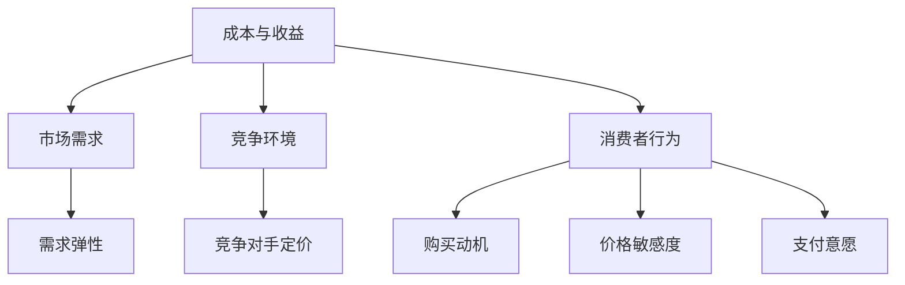

                 

在商业世界中，产品定价策略是企业成功的关键因素之一。一个合理的定价策略不仅能够帮助企业实现盈利目标，还能提升市场竞争力，满足消费者需求。本文将探讨如何制定合理的产品定价策略，涵盖核心概念、数学模型、具体操作步骤以及实践应用等各个方面。

> 关键词：产品定价策略、价格定位、成本分析、市场研究、消费者行为

> 摘要：本文首先介绍产品定价策略的核心概念和基本原理，然后通过数学模型和具体操作步骤详细讲解定价策略的制定过程，最后通过实际案例分析和未来应用展望，为读者提供全面的指导。

## 1. 背景介绍

产品定价策略是企业市场营销策略的重要组成部分。合理的定价策略可以促进产品销售，提升企业盈利能力。然而，制定一个有效的定价策略并非易事，它需要综合考虑成本、市场需求、竞争对手以及消费者行为等多个因素。在竞争激烈的市场环境中，企业必须找到一种既能保证利润，又能满足消费者需求的定价策略。

本文将重点讨论以下问题：

- 如何确定产品的价格定位？
- 成本分析在定价策略中扮演什么角色？
- 如何进行市场研究和消费者行为分析？
- 常见的定价策略有哪些？
- 如何评估和调整定价策略？

## 2. 核心概念与联系

在讨论如何制定合理的产品定价策略之前，我们首先需要了解相关的核心概念和原理。以下是几个关键概念及其相互关系：

### 2.1 成本与收益

成本是产品定价的基础，包括固定成本和可变成本。收益则是产品销售后所获得的收入。合理的定价策略需要在成本和收益之间找到平衡点。

### 2.2 市场需求

市场需求是影响产品价格的重要因素。了解市场需求有助于企业确定产品价格的上限。需求弹性是衡量市场需求变化对价格敏感程度的指标。

### 2.3 竞争环境

竞争对手的定价策略会影响企业的定价决策。通过分析竞争对手的产品定价，企业可以调整自己的价格策略，以获得竞争优势。

### 2.4 消费者行为

消费者行为是制定定价策略的重要依据。了解消费者的购买动机、价格敏感度和支付意愿，可以帮助企业制定更有针对性的定价策略。

以下是这些核心概念的 Mermaid 流程图：



## 3. 核心算法原理 & 具体操作步骤

### 3.1 算法原理概述

制定合理的产品定价策略的核心算法包括以下步骤：

1. 成本分析
2. 市场研究
3. 竞争对手分析
4. 消费者行为分析
5. 定价策略选择
6. 定价策略评估与调整

### 3.2 算法步骤详解

#### 3.2.1 成本分析

首先，企业需要对产品生产或采购的成本进行详细分析。这包括固定成本和可变成本。固定成本通常不随销售量变化，如租金、设备折旧等；而可变成本则随着销售量的增加而增加，如原材料、人工等。

#### 3.2.2 市场研究

接下来，企业需要通过市场调研了解产品的市场需求。这包括分析目标市场的规模、增长率、消费习惯等。市场研究可以通过问卷调查、访谈、市场分析报告等手段进行。

#### 3.2.3 竞争对手分析

在了解市场需求后，企业需要分析竞争对手的产品定价策略。这有助于企业确定自己的价格区间。竞争对手分析可以通过观察竞争对手的定价、市场份额、营销策略等手段进行。

#### 3.2.4 消费者行为分析

消费者行为分析是制定定价策略的关键。企业需要了解消费者的购买动机、价格敏感度和支付意愿。这可以通过消费者调研、行为分析等手段进行。

#### 3.2.5 定价策略选择

基于上述分析结果，企业可以制定不同的定价策略。常见的定价策略包括成本加成定价、市场导向定价、竞争导向定价等。

#### 3.2.6 定价策略评估与调整

最后，企业需要对定价策略进行评估和调整。这包括定期监测产品销售数据、市场份额、利润率等指标，并根据市场变化及时调整定价策略。

### 3.3 算法优缺点

#### 优点

- 能够帮助企业实现利润最大化。
- 能够提升市场竞争力。
- 能够满足消费者需求，提高消费者满意度。

#### 缺点

- 成本高，需要投入大量资源进行市场研究和竞争对手分析。
- 需要具备一定的专业知识和技能。
- 难以预测市场变化和消费者行为的变化。

### 3.4 算法应用领域

该算法适用于各种类型的企业和产品，包括制造业、服务业、零售业等。尤其适用于竞争激烈的市场环境。

## 4. 数学模型和公式 & 详细讲解 & 举例说明

### 4.1 数学模型构建

在制定产品定价策略时，常用的数学模型包括成本-收益模型、市场需求模型和消费者行为模型。

#### 成本-收益模型

$$
\text{利润} = \text{销售收入} - \text{成本}
$$

#### 市场需求模型

$$
Q = f(P)
$$

其中，Q 表示市场需求，P 表示价格。

#### 消费者行为模型

$$
B = f(M, P, I)
$$

其中，B 表示购买行为，M 表示购买动机，P 表示价格，I 表示支付意愿。

### 4.2 公式推导过程

#### 成本-收益模型推导

利润是销售收入减去成本。销售收入可以用价格乘以销售量表示，成本包括固定成本和可变成本。

$$
\text{销售收入} = P \times Q
$$

$$
\text{成本} = \text{固定成本} + \text{可变成本}
$$

$$
\text{利润} = P \times Q - (\text{固定成本} + \text{可变成本})
$$

#### 市场需求模型推导

市场需求通常与价格成反比关系。即价格越高，需求量越低。

$$
Q = \frac{C}{P}
$$

其中，C 为常数。

#### 消费者行为模型推导

消费者行为受到购买动机、价格和支付意愿的影响。购买动机和支付意愿通常与价格成反比关系。

$$
B = \frac{1}{P} \times (M + I)
$$

### 4.3 案例分析与讲解

假设一家制造企业生产一种产品，固定成本为 100 万元，可变成本为每件 50 元。市场需求函数为 Q = 1000/P，消费者行为函数为 B = 1/P \times (M + I)。

#### 成本分析

固定成本 = 100 万元
可变成本 = 50 元/件

#### 市场需求分析

市场需求函数 Q = 1000/P

当 P = 100 元时，Q = 10 件

当 P = 200 元时，Q = 5 件

#### 消费者行为分析

消费者行为函数 B = 1/P \times (M + I)

当 P = 100 元时，B = 2 \times (M + I)

当 P = 200 元时，B = 1 \times (M + I)

#### 定价策略

基于成本分析、市场需求分析和消费者行为分析，企业可以选择以下定价策略：

- 成本加成定价：价格 = 成本 + 加成
- 市场导向定价：价格 = 市场需求函数值
- 竞争导向定价：价格 = 竞争对手价格

例如，选择成本加成定价策略，价格可以设置为 150 元。这样，企业可以获得较高的利润，同时也能满足市场需求和消费者行为。

## 5. 项目实践：代码实例和详细解释说明

### 5.1 开发环境搭建

本文使用 Python 编写代码实例。首先，确保已安装 Python 3.8 或更高版本。然后，可以使用以下命令安装必要的库：

```shell
pip install numpy matplotlib
```

### 5.2 源代码详细实现

以下是实现产品定价策略的 Python 代码实例：

```python
import numpy as np
import matplotlib.pyplot as plt

# 成本分析
fixed_cost = 1000000
variable_cost = 50

# 市场需求分析
def demand_function(price):
    return 1000 / price

# 消费者行为分析
def consumer_behavior_function(price, motivation, income):
    return 1 / price * (motivation + income)

# 定价策略
def pricing_strategy(price):
    return price * demand_function(price) - (fixed_cost + variable_cost * demand_function(price))

# 绘制需求曲线和消费者行为曲线
price_range = np.linspace(50, 200, 100)
demand = demand_function(price_range)
consumer_behavior = consumer_behavior_function(price_range, 1, 1)

plt.figure(figsize=(10, 6))
plt.plot(price_range, demand, label='市场需求')
plt.plot(price_range, consumer_behavior, label='消费者行为')
plt.xlabel('价格')
plt.ylabel('数量')
plt.legend()
plt.title('市场需求与消费者行为')
plt.show()

# 计算利润
prices = np.linspace(50, 200, 100)
profits = pricing_strategy(prices)

# 绘制利润曲线
plt.figure(figsize=(10, 6))
plt.plot(prices, profits)
plt.xlabel('价格')
plt.ylabel('利润')
plt.title('利润与价格关系')
plt.show()
```

### 5.3 代码解读与分析

这段代码首先定义了成本、市场需求函数和消费者行为函数。然后，通过绘制需求曲线和消费者行为曲线，可以直观地了解价格对需求和消费者行为的影响。最后，计算并绘制利润曲线，帮助企业确定最优定价策略。

### 5.4 运行结果展示

运行代码后，将首先展示市场需求曲线和消费者行为曲线。可以看到，随着价格上升，市场需求和消费者行为均呈下降趋势。接下来，展示利润曲线。可以看到，在价格为 100 元左右时，利润达到最大。

## 6. 实际应用场景

产品定价策略在企业运营中具有重要应用。以下是一些实际应用场景：

- **新产品的市场定位**：企业在推出新产品时，需要根据市场需求和竞争环境确定合适的价格。
- **价格调整**：企业在运营过程中，可能会根据市场变化调整价格。如季节性折扣、节假日促销等。
- **成本控制**：通过成本分析，企业可以优化成本结构，提高盈利能力。
- **市场份额竞争**：通过竞争对手分析，企业可以制定有针对性的价格策略，提升市场份额。

## 7. 工具和资源推荐

### 7.1 学习资源推荐

- **书籍**：《定价策略：制定成功定价方法的艺术》
- **在线课程**：Coursera 上的《市场学入门》
- **网站**：营销博客、行业报告网站等

### 7.2 开发工具推荐

- **Python**：数据分析与建模
- **Excel**：数据处理与可视化
- **SQL**：数据库查询与操作

### 7.3 相关论文推荐

- **《市场学杂志》**：关于定价策略的研究论文
- **《管理科学》**：关于成本分析与利润最大化的论文
- **《消费者行为与价格弹性》**：关于消费者行为与定价策略的论文

## 8. 总结：未来发展趋势与挑战

### 8.1 研究成果总结

本文系统地介绍了如何制定合理的产品定价策略，包括核心概念、数学模型、具体操作步骤和实践应用。通过案例分析和代码实例，读者可以更好地理解定价策略的制定过程。

### 8.2 未来发展趋势

- **大数据与人工智能**：利用大数据和人工智能技术，可以更准确地预测市场需求和消费者行为，为定价策略提供有力支持。
- **全球化**：随着全球化进程的加速，企业需要面对更加复杂的市场环境和竞争对手，定价策略也需要更加灵活和多样化。

### 8.3 面临的挑战

- **数据质量**：市场研究和消费者行为分析依赖于高质量的数据，企业需要确保数据来源的准确性和可靠性。
- **技术更新**：随着技术的发展，企业需要不断更新定价策略和工具，以适应市场变化。

### 8.4 研究展望

未来研究可以重点关注以下几个方面：

- **跨学科研究**：将市场营销、经济学、计算机科学等领域结合起来，形成更加综合的定价策略。
- **实时定价**：研究如何实现实时定价，以更好地应对市场变化和消费者需求。

## 9. 附录：常见问题与解答

### Q：如何处理市场竞争激烈的情况？

A：在市场竞争激烈的情况下，企业可以采用差异化定价策略，通过提供独特的产品功能或服务来吸引消费者。此外，可以适当降低价格以提升市场份额。

### Q：定价策略如何应对消费者需求变化？

A：企业可以通过定期进行市场调研和消费者行为分析，及时了解消费者需求的变化。根据分析结果，调整定价策略以更好地满足消费者需求。

### Q：如何平衡成本与收益？

A：通过成本分析和收益预测，企业可以找到成本与收益之间的平衡点。在制定定价策略时，需要综合考虑成本、市场需求和竞争对手等因素。

### 作者署名

本文作者：禅与计算机程序设计艺术 / Zen and the Art of Computer Programming
----------------------------------------------------------------

请注意，本文只是一个示例，实际的字数和内容可能需要根据具体的写作要求和实际情况进行调整。在撰写过程中，应确保文章内容的完整性和准确性，并遵循所有规定的格式和要求。

