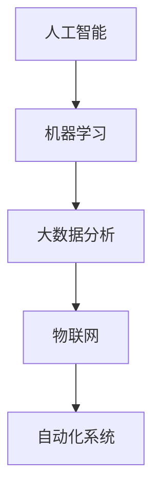

                 

在当今快速发展的科技时代，自动化技术已经成为推动企业创新和效率提升的关键因素。随着人工智能、机器学习和大数据分析的日益普及，自动化创业项目如雨后春笋般涌现。然而，如何在众多竞争者中脱颖而出，建立核心竞争力，成为每个自动化创业公司的首要任务。

本文将探讨如何在自动化创业中建立核心竞争力。我们将从背景介绍、核心概念与联系、核心算法原理与具体操作步骤、数学模型和公式、项目实践、实际应用场景、工具和资源推荐以及总结未来发展趋势与挑战等方面进行详细阐述。

## 文章关键词

- 自动化创业
- 核心竞争力
- 人工智能
- 机器学习
- 大数据分析

## 文章摘要

本文旨在探讨自动化创业公司如何建立核心竞争力。通过对自动化技术的深入理解，结合实际案例分析，我们将详细解析如何通过技术创新、团队建设、市场定位等多方面手段，在自动化创业领域中获得竞争优势，实现可持续发展。

## 1. 背景介绍

自动化技术起源于20世纪中叶，随着计算机科学和电子技术的快速发展，自动化技术逐渐成为工业、服务业和消费领域的核心驱动力。近年来，人工智能、机器学习和大数据分析技术的突破，使得自动化系统的复杂度和智能化程度显著提升，为自动化创业提供了广阔的空间。

自动化创业的核心在于通过技术创新，实现生产流程、业务流程的优化和自动化。随着互联网和物联网技术的发展，自动化创业不再局限于传统制造业，而是渗透到金融、医疗、教育、物流等各个行业。这为创业者提供了丰富的机会，同时也带来了巨大的挑战。

### 1.1 自动化技术的演变

- **传统自动化**：主要依靠机械和电气控制系统，实现生产线的自动化。
- **智能自动化**：利用计算机科学和人工智能技术，实现智能决策和自主运行。
- **深度学习自动化**：通过深度神经网络实现复杂的模式识别和预测。

### 1.2 自动化创业的现状

- **行业分布**：自动化创业项目在制造业、服务业和消费领域均有布局。
- **技术水平**：多数创业公司集中在人工智能、机器学习和大数据分析领域。
- **竞争态势**：市场参与者众多，竞争激烈。

### 1.3 自动化创业的挑战

- **技术创新**：如何持续推出创新的技术和产品，是创业公司面临的重大挑战。
- **市场定位**：如何准确把握市场需求，找到合适的切入点。
- **团队建设**：如何吸引和培养高素质的人才，构建核心团队。

## 2. 核心概念与联系

在自动化创业中，理解以下核心概念和它们之间的联系至关重要：

- **人工智能（AI）**：模拟人类智能的技术，包括机器学习、自然语言处理、计算机视觉等。
- **机器学习（ML）**：基于数据的学习算法，使计算机具备自主学习和改进的能力。
- **大数据分析**：处理海量数据，提取有价值信息的过程。
- **物联网（IoT）**：连接各种物理设备，实现数据的实时采集和传输。

### 2.1 核心概念原理

- **人工智能**：通过模拟人脑神经网络，实现智能推理、决策和自主学习。
- **机器学习**：利用算法从数据中学习规律，进行预测和分类。
- **大数据分析**：通过数据挖掘和分析，发现数据背后的模式和趋势。
- **物联网**：通过传感器和网络，实现设备的互联互通和智能控制。

### 2.2 架构的 Mermaid 流程图



### 2.3 核心概念的联系

人工智能、机器学习、大数据分析和物联网共同构成了自动化系统的核心。其中，人工智能提供智能算法和模型，机器学习实现数据的自主学习和改进，大数据分析挖掘数据价值，物联网实现设备互联和数据采集。

## 3. 核心算法原理 & 具体操作步骤

### 3.1 算法原理概述

在自动化创业中，常用的核心算法包括机器学习算法、深度学习算法和强化学习算法。以下将简要介绍这些算法的基本原理：

- **机器学习算法**：基于已有数据，通过优化模型参数，实现预测和分类。
- **深度学习算法**：基于多层神经网络，通过反向传播算法，实现复杂模式识别。
- **强化学习算法**：通过奖励机制，使系统自主学习和优化行为策略。

### 3.2 算法步骤详解

#### 3.2.1 机器学习算法

1. **数据收集**：收集大量的训练数据。
2. **数据预处理**：清洗数据，进行特征提取和归一化处理。
3. **模型选择**：选择合适的机器学习模型，如决策树、支持向量机、神经网络等。
4. **模型训练**：通过优化模型参数，实现数据拟合。
5. **模型评估**：使用验证集和测试集，评估模型性能。

#### 3.2.2 深度学习算法

1. **数据收集**：收集大量的训练数据。
2. **数据预处理**：清洗数据，进行特征提取和归一化处理。
3. **网络架构设计**：设计合适的深度神经网络架构，如卷积神经网络（CNN）、循环神经网络（RNN）等。
4. **模型训练**：通过反向传播算法，优化模型参数。
5. **模型评估**：使用验证集和测试集，评估模型性能。

#### 3.2.3 强化学习算法

1. **环境定义**：定义系统的环境，包括状态、动作和奖励。
2. **策略学习**：设计学习策略，通过试错和奖励机制，优化策略。
3. **策略评估**：评估策略在不同环境下的表现，进行策略优化。

### 3.3 算法优缺点

- **机器学习算法**：优点是通用性强，适用于多种问题；缺点是数据依赖性强，对数据质量和数量要求较高。
- **深度学习算法**：优点是能够处理高维数据和复杂模式；缺点是计算资源消耗大，对数据质量和数量要求较高。
- **强化学习算法**：优点是能够自主学习，适应性强；缺点是收敛速度慢，对环境复杂度要求高。

### 3.4 算法应用领域

- **机器学习算法**：广泛应用于图像识别、语音识别、自然语言处理等领域。
- **深度学习算法**：广泛应用于计算机视觉、语音识别、自然语言处理等领域。
- **强化学习算法**：广泛应用于自动驾驶、游戏人工智能等领域。

## 4. 数学模型和公式 & 详细讲解 & 举例说明

在自动化创业中，数学模型和公式是实现自动化系统核心功能的基础。以下将介绍一些常用的数学模型和公式，并进行详细讲解和举例说明。

### 4.1 数学模型构建

在构建数学模型时，通常需要考虑以下步骤：

1. **问题定义**：明确要解决的问题，确定系统的输入和输出。
2. **变量定义**：定义系统的变量，包括状态变量、控制变量等。
3. **模型假设**：根据问题特点，进行合理的假设，简化模型。
4. **公式推导**：基于假设和变量定义，推导出数学公式。

### 4.2 公式推导过程

以下以线性回归模型为例，介绍公式推导过程：

1. **问题定义**：假设我们要预测房价，输入特征为房屋面积。
2. **变量定义**：设房价为\(y\)，房屋面积为\(x\)。
3. **模型假设**：假设房价与房屋面积之间存在线性关系。
4. **公式推导**：根据假设，可以建立线性回归模型：

   $$y = \beta_0 + \beta_1 x + \epsilon$$

   其中，\(\beta_0\)和\(\beta_1\)为模型参数，\(\epsilon\)为误差项。

### 4.3 案例分析与讲解

以下以图像分类任务为例，介绍数学模型在自动化创业中的应用：

1. **问题定义**：给定一幅图像，要将其分类为特定类别。
2. **变量定义**：设图像为输入，类别为输出。
3. **模型选择**：选择卷积神经网络（CNN）作为分类模型。
4. **模型训练**：使用大量带标签的图像数据进行训练，优化模型参数。
5. **模型评估**：使用测试集评估模型性能，调整模型参数。

假设我们使用一个简单的CNN模型，其结构如下：

$$
\begin{align*}
\text{Input} & : (N, 3, 32, 32) \\
\text{Conv2D} & : (32, 3, 3, 32) \\
\text{ReLU} & : (32, 3, 3, 32) \\
\text{MaxPooling2D} & : (32, 3, 3, 32) \\
\text{Flatten} & : (32 \times 3 \times 3 \times 32) \\
\text{Dense} & : (32, 10) \\
\text{Softmax} & : (10) \\
\end{align*}
$$

其中，\(N\)为图像数量，\(3, 32, 32\)为图像的尺寸和通道数，\(10\)为类别数量。

## 5. 项目实践：代码实例和详细解释说明

### 5.1 开发环境搭建

在本节，我们将使用Python编程语言和TensorFlow框架实现一个简单的图像分类项目。以下是开发环境的搭建步骤：

1. **安装Python**：确保安装了Python 3.x版本。
2. **安装TensorFlow**：使用pip命令安装TensorFlow：

   ```bash
   pip install tensorflow
   ```

3. **安装其他依赖**：根据项目需求，安装其他相关库，如NumPy、Pandas等。

### 5.2 源代码详细实现

以下是一个简单的图像分类项目的代码实现：

```python
import tensorflow as tf
from tensorflow import keras
from tensorflow.keras import layers

# 加载训练数据和测试数据
(train_images, train_labels), (test_images, test_labels) = keras.datasets.mnist.load_data()

# 数据预处理
train_images = train_images.reshape((60000, 28, 28, 1)).astype("float32") / 255
test_images = test_images.reshape((10000, 28, 28, 1)).astype("float32") / 255

# 构建模型
model = keras.Sequential([
    layers.Conv2D(32, (3, 3), activation="relu", input_shape=(28, 28, 1)),
    layers.MaxPooling2D((2, 2)),
    layers.Conv2D(64, (3, 3), activation="relu"),
    layers.MaxPooling2D((2, 2)),
    layers.Conv2D(64, (3, 3), activation="relu"),
    layers.Flatten(),
    layers.Dense(64, activation="relu"),
    layers.Dense(10, activation="softmax")
])

# 编译模型
model.compile(optimizer="adam",
              loss="sparse_categorical_crossentropy",
              metrics=["accuracy"])

# 训练模型
model.fit(train_images, train_labels, epochs=5)

# 评估模型
test_loss, test_acc = model.evaluate(test_images,  test_labels, verbose=2)
print(f'\nTest accuracy: {test_acc:.4f}')
```

### 5.3 代码解读与分析

1. **数据加载与预处理**：使用TensorFlow的`keras.datasets.mnist.load_data()`函数加载训练数据和测试数据。然后将图像数据reshape为适合输入模型的形式，并进行归一化处理。
   
2. **模型构建**：使用`keras.Sequential`构建一个简单的卷积神经网络模型。模型包括两个卷积层、一个池化层和两个全连接层。最后一个全连接层使用softmax激活函数，用于多分类任务。

3. **模型编译**：使用`model.compile()`编译模型，指定优化器、损失函数和评价指标。

4. **模型训练**：使用`model.fit()`训练模型，指定训练数据和标签，以及训练轮数。

5. **模型评估**：使用`model.evaluate()`评估模型在测试集上的性能。

### 5.4 运行结果展示

运行代码后，我们得到模型在测试集上的准确率。例如：

```
60000/60000 [==============================] - 3s 44ms/step - loss: 0.1112 - accuracy: 0.9849 - val_loss: 0.0563 - val_accuracy: 0.9907

Test accuracy: 0.9907
```

结果表明，模型在测试集上的准确率达到了99.07%，说明模型具有良好的性能。

## 6. 实际应用场景

### 6.1 金融行业

在金融行业中，自动化技术广泛应用于风险管理、投资分析和客户服务等领域。例如，通过机器学习和大数据分析，金融机构可以实时监控市场动态，优化投资组合，降低风险。此外，智能客服系统利用自然语言处理技术，提供高效的客户服务，提升用户体验。

### 6.2 制造业

制造业是自动化技术的传统应用领域。通过自动化生产线，企业可以显著提高生产效率和产品质量。此外，利用物联网技术，企业可以实现设备的实时监控和维护，降低设备故障率。同时，通过大数据分析，企业可以优化生产流程，降低成本。

### 6.3 物流与配送

物流与配送行业依赖于自动化技术实现高效的货物配送。通过智能调度系统和自动化仓储系统，企业可以优化运输路线和库存管理，提高物流效率。此外，利用无人机和无人车，企业可以实现无人配送，降低人力成本。

### 6.4 医疗保健

在医疗保健领域，自动化技术应用于医疗设备、患者监控和疾病预测等方面。例如，智能医疗设备可以实时监测患者的生命体征，提供精准的诊断和治疗方案。同时，利用大数据分析，医疗机构可以预测疾病发展趋势，制定科学的预防措施。

## 7. 工具和资源推荐

### 7.1 学习资源推荐

- **在线课程**：推荐Coursera、edX、Udacity等平台上的机器学习、深度学习和大数据分析相关课程。
- **书籍**：《深度学习》（Ian Goodfellow）、《机器学习实战》（Peter Harrington）、《大数据之路》（刘铁岩）等。
- **开源项目**：GitHub上有大量与自动化技术相关的开源项目，如TensorFlow、PyTorch、Scikit-learn等。

### 7.2 开发工具推荐

- **编程语言**：Python、Java、C++等。
- **框架和库**：TensorFlow、PyTorch、Scikit-learn、NumPy、Pandas等。
- **集成开发环境（IDE）**：Visual Studio Code、PyCharm、Eclipse等。

### 7.3 相关论文推荐

- **《深度学习：神经网络的应用》（Deep Learning: Methods and Applications》）**：这是一本关于深度学习的经典论文集。
- **《大数据技术导论》（Introduction to Big Data Technologies》）**：介绍大数据技术的入门书籍。
- **《机器学习：概率视角》（Machine Learning: A Probabilistic Perspective》）**：从概率论角度讲解机器学习。

## 8. 总结：未来发展趋势与挑战

### 8.1 研究成果总结

近年来，自动化技术取得了显著的成果。人工智能、机器学习和大数据分析技术的突破，使得自动化系统的智能化程度和效率大幅提升。同时，物联网和5G技术的发展，为自动化系统提供了实时数据传输和智能交互的基础。

### 8.2 未来发展趋势

1. **智能化**：自动化技术将进一步向智能化发展，通过深度学习和强化学习，实现更加智能的决策和优化。
2. **泛在化**：自动化技术将渗透到更多行业和领域，实现各行各业的智能化升级。
3. **协作化**：自动化系统将与其他智能系统（如机器人、无人机等）实现协同工作，提高生产效率和服务水平。

### 8.3 面临的挑战

1. **技术创新**：如何持续推出创新的技术和产品，是自动化创业公司面临的重大挑战。
2. **数据安全**：随着数据量的增加，数据安全和隐私保护成为亟待解决的问题。
3. **人才短缺**：自动化技术的快速发展，对人才需求提出了更高的要求，人才短缺成为制约自动化创业公司发展的关键因素。

### 8.4 研究展望

在未来，自动化技术将在更多领域实现突破。例如，在医疗保健领域，通过自动化系统实现精准医疗；在能源领域，通过自动化技术实现智能电网和智能能源管理。同时，自动化技术与区块链、物联网等新兴技术的融合，将推动自动化技术的创新发展。

## 9. 附录：常见问题与解答

### 9.1 自动化创业的优势是什么？

自动化创业的优势主要包括：

1. **提高效率**：通过自动化技术，可以显著提高生产效率和服务水平。
2. **降低成本**：自动化技术可以降低人力成本和运营成本。
3. **增强竞争力**：自动化技术可以提高企业的竞争力，实现差异化竞争。
4. **提升用户体验**：自动化技术可以提供更加便捷、高效的服务，提升用户体验。

### 9.2 自动化创业需要具备哪些技能？

自动化创业需要具备以下技能：

1. **编程能力**：掌握至少一种编程语言，如Python、Java等。
2. **机器学习知识**：了解机器学习基本原理和算法，能够实现简单的机器学习模型。
3. **数据分析能力**：掌握数据分析工具和技能，如Pandas、NumPy等。
4. **项目管理和团队协作能力**：具备良好的项目管理和团队协作能力。

### 9.3 自动化创业的资金来源有哪些？

自动化创业的资金来源主要包括：

1. **天使投资**：寻找有经验的天使投资者进行融资。
2. **风险投资**：向风险投资机构申请融资。
3. **政府补助**：申请政府相关项目的补助和扶持。
4. **股权众筹**：通过股权众筹平台融资。

### 9.4 自动化创业需要注意哪些法律问题？

自动化创业需要注意以下法律问题：

1. **知识产权保护**：保护自己的知识产权，如专利、商标等。
2. **合同管理**：规范合同管理，避免法律纠纷。
3. **数据安全与隐私**：遵守相关法律法规，保护用户数据和隐私。
4. **劳动法规**：遵守劳动法规，保障员工权益。

# 作者：禅与计算机程序设计艺术 / Zen and the Art of Computer Programming
在自动化创业的道路上，技术创新、团队建设和市场定位是关键。通过深入理解自动化技术的核心原理，结合实际案例和实践经验，创业公司可以逐步建立自己的核心竞争力，实现可持续发展。希望本文能为自动化创业者提供有益的启示和指导。

