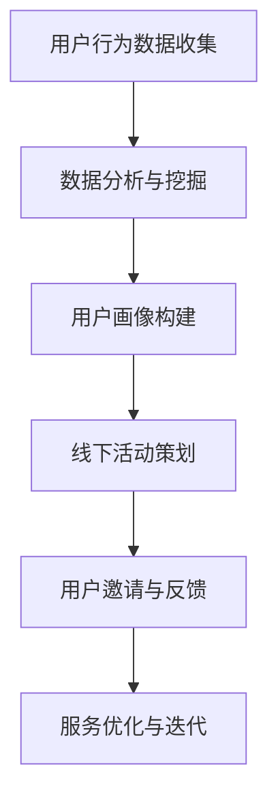
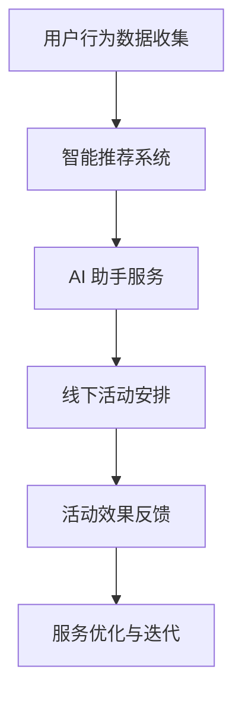

                 

### 关键词 Keyword List ###
- 线上知识付费
- 线下服务延伸
- 转化策略
- 用户行为分析
- 服务模式创新

### 摘要 Abstract ###
本文将探讨如何实现线上知识付费向线下服务的成功延伸。通过分析用户行为、服务模式创新、以及技术手段的融合，本文提出了一系列策略和案例，旨在帮助知识付费平台在提供线上服务的同时，有效吸引并转化为线下服务的客户。文章还对未来趋势和面临的挑战进行了展望，为行业提供实践指导和理论参考。

---

## 1. 背景介绍 Background

随着互联网技术的飞速发展，线上知识付费逐渐成为教育行业的重要趋势。从在线课程、电子书籍到专业咨询，线上知识付费为用户提供了便捷的学习途径和多元化的知识消费选择。然而，随着市场竞争的加剧和用户需求的多样化，单纯依赖线上服务已难以满足用户深层次的学习和互动需求。因此，将线上知识付费向线下服务延伸，成为许多平台探索的新方向。

线下服务包括但不限于面对面授课、研讨会、工作坊、实训基地等形式，能够提供更直观、互动性更强的学习体验。线下服务不仅能增加用户粘性，提升用户满意度，还能通过更深入的用户互动，收集更多用户反馈，为线上服务提供改进方向。

本文将探讨以下问题：

- 线上知识付费平台如何识别并吸引潜在线下服务的用户？
- 线上服务与线下服务的融合点在哪里？
- 如何通过技术创新实现线上到线下的无缝转化？

## 2. 核心概念与联系 Core Concepts and Relations

### 2.1 用户行为分析 User Behavior Analysis

用户行为分析是线上知识付费平台向线下服务延伸的基础。通过分析用户在平台上的行为数据，如浏览记录、购买行为、学习进度等，平台可以识别出潜在的兴趣点和需求，从而制定针对性的线下活动。

**Mermaid 流程图：**



### 2.2 服务模式创新 Service Model Innovation

线上到线下的延伸不仅需要技术的支持，更需要服务模式的创新。平台可以通过以下几种方式实现：

- **线下活动配套：** 线上课程结束后，组织相关线下活动，如线下研讨会、小组讨论等，加深用户对知识的理解和应用。
- **实训基地建设：** 针对特定领域，如编程、设计等，建设线下实训基地，提供实操机会。
- **会员专属服务：** 为付费用户设置专属的线下活动权限，提高用户忠诚度。

### 2.3 技术手段融合 Technology Integration

通过将大数据、人工智能等先进技术手段与线下服务融合，可以实现更加智能化、个性化的用户体验。例如：

- **智能推荐系统：** 利用大数据分析，为用户推荐可能感兴趣的线下活动。
- **AI 助手：** 引入人工智能助手，提供活动咨询、预约等一站式服务。

---

**Mermaid 流程图：**



---

## 3. 核心算法原理 & 具体操作步骤 Core Algorithm Principle & Step-by-Step Operations

### 3.1 算法原理概述 Algorithm Principle Overview

核心算法主要包括用户行为分析、智能推荐和活动效果评估三个部分。

- **用户行为分析：** 利用机器学习算法，从用户行为数据中提取特征，构建用户画像。
- **智能推荐：** 基于用户画像和活动数据，使用协同过滤算法或基于内容的推荐算法，为用户推荐合适的线下活动。
- **活动效果评估：** 通过收集用户参与活动的反馈数据，利用回归分析等方法，评估线下活动的效果，为服务优化提供依据。

### 3.2 算法步骤详解 Step-by-Step Details

#### 3.2.1 用户行为分析 User Behavior Analysis

1. **数据收集：** 收集用户在平台上的行为数据，如浏览时长、学习进度、购买记录等。
2. **数据预处理：** 对收集到的数据进行清洗和预处理，去除噪声数据。
3. **特征提取：** 利用机器学习算法，从预处理后的数据中提取用户兴趣特征，如学习偏好、职业背景等。
4. **用户画像构建：** 将提取的特征整合，构建用户画像。

#### 3.2.2 智能推荐 Intelligent Recommendation

1. **用户画像匹配：** 将用户画像与已有的线下活动数据匹配，找出可能感兴趣的活动。
2. **推荐算法选择：** 根据平台数据和用户需求，选择合适的推荐算法，如基于内容的推荐算法或协同过滤算法。
3. **推荐结果生成：** 生成智能推荐结果，展示给用户。

#### 3.2.3 活动效果评估 Activity Effect Evaluation

1. **反馈数据收集：** 收集用户参与活动后的反馈数据，如满意度、学习效果等。
2. **回归分析：** 利用回归分析等方法，评估线下活动的效果。
3. **服务优化：** 根据评估结果，调整线下活动内容和服务模式，提升用户体验。

### 3.3 算法优缺点 Advantages and Disadvantages

#### 优点 Advantages

- **个性化推荐：** 通过用户行为分析，实现个性化推荐，提高用户满意度。
- **数据驱动：** 基于大数据和机器学习，使推荐和评估更加科学和精准。
- **服务优化：** 通过活动效果评估，持续优化服务模式，提升用户留存率。

#### 缺点 Disadvantages

- **数据质量：** 用户行为数据的质量直接影响到算法的效果。
- **计算复杂度：** 大规模数据处理和算法计算需要较高的计算资源和时间。
- **隐私保护：** 用户行为数据的收集和使用需要遵循隐私保护原则，避免用户隐私泄露。

### 3.4 算法应用领域 Application Areas

- **教育培训：** 通过用户行为分析，为教育培训提供个性化学习推荐和活动策划。
- **电商零售：** 通过智能推荐，提升用户购物体验和转化率。
- **金融服务：** 通过数据分析和智能推荐，为用户提供个性化金融服务。

---

## 4. 数学模型和公式 Mathematical Models and Equations

### 4.1 数学模型构建 Mathematical Model Construction

用户行为分析中的数学模型通常基于贝叶斯网络或隐马尔可夫模型（HMM）。

**贝叶斯网络模型：**

$$
P(A|B) = \frac{P(B|A)P(A)}{P(B)}
$$

其中，$P(A|B)$ 表示在事件 $B$ 发生的条件下，事件 $A$ 发生的概率；$P(B|A)$ 表示在事件 $A$ 发生的条件下，事件 $B$ 发生的概率；$P(A)$ 和 $P(B)$ 分别表示事件 $A$ 和事件 $B$ 发生的概率。

**隐马尔可夫模型（HMM）：**

$$
P(\text{观测序列}|\text{隐藏状态序列}) = \prod_{i=1}^{n} P(o_i|h_i) \cdot P(h_i|h_{i-1})
$$

其中，$o_i$ 表示第 $i$ 个观测变量；$h_i$ 表示第 $i$ 个隐藏状态；$P(o_i|h_i)$ 表示在隐藏状态 $h_i$ 发生的条件下，观测变量 $o_i$ 发生的概率；$P(h_i|h_{i-1})$ 表示在隐藏状态 $h_{i-1}$ 发生的条件下，隐藏状态 $h_i$ 发生的概率。

### 4.2 公式推导过程 Equation Derivation Process

**贝叶斯网络模型推导：**

1. **条件概率计算：**

   $$P(A|B) = \frac{P(B \cap A)}{P(B)}$$

2. **全概率公式：**

   $$P(B) = \sum_{A} P(B|A)P(A)$$

3. **结合两个公式：**

   $$P(A|B) = \frac{P(B|A)P(A)}{\sum_{A} P(B|A)P(A)}$$

**隐马尔可夫模型推导：**

1. **状态转移概率：**

   $$P(h_i|h_{i-1}) = \prod_{j=1}^{m} P(h_i|h_{i-1}=j)P(h_{i-1}=j)$$

2. **观测概率：**

   $$P(o_i|h_i) = \prod_{j=1}^{k} P(o_i|h_i=j)P(h_i=j)$$

3. **结合状态转移概率和观测概率：**

   $$P(\text{观测序列}|\text{隐藏状态序列}) = \prod_{i=1}^{n} P(o_i|h_i) \cdot P(h_i|h_{i-1})$$

### 4.3 案例分析与讲解 Case Analysis and Explanation

#### 案例一：教育培训平台用户行为分析

假设教育培训平台记录了用户在学习课程时的行为数据，包括课程浏览时长、学习进度、测试成绩等。利用贝叶斯网络模型，平台可以构建用户的学习偏好模型，从而为用户推荐合适的课程。

**步骤：**

1. **数据收集：** 收集用户学习行为数据。
2. **特征提取：** 对数据进行预处理和特征提取，构建用户画像。
3. **模型训练：** 利用贝叶斯网络模型，训练用户学习偏好模型。
4. **推荐课程：** 根据用户画像，推荐符合用户学习偏好的课程。

#### 案例二：电商零售平台智能推荐

电商零售平台利用协同过滤算法，为用户推荐商品。假设用户 $A$ 和 $B$ 都喜欢商品 $1$ 和 $2$，但用户 $A$ 喜欢商品 $3$，而用户 $B$ 不喜欢商品 $3$。平台可以基于用户的历史购买数据，构建协同过滤模型，为用户推荐商品。

**步骤：**

1. **用户行为数据收集：** 收集用户的历史购买数据。
2. **相似度计算：** 计算用户之间的相似度。
3. **推荐算法：** 基于相似度，利用协同过滤算法生成推荐列表。
4. **推荐结果展示：** 将推荐结果展示给用户。

---

## 5. 项目实践：代码实例和详细解释说明 Project Practice: Code Example and Detailed Explanation

### 5.1 开发环境搭建 Development Environment Setup

为了实现线上知识付费向线下服务的延伸，我们选择了Python作为主要编程语言，并使用了以下库和工具：

- **Python 3.8 或以上版本**
- **Numpy**：用于数学计算
- **Pandas**：用于数据处理
- **Scikit-learn**：用于机器学习和数据挖掘
- **Flask**：用于Web开发

### 5.2 源代码详细实现 Detailed Code Implementation

#### 5.2.1 用户行为分析模块 User Behavior Analysis Module

以下是一个简单的用户行为分析代码示例，用于收集和预处理用户数据。

```python
import pandas as pd
import numpy as np

# 读取用户行为数据
user_data = pd.read_csv('user_behavior.csv')

# 数据预处理
user_data = user_data.dropna()
user_data = user_data[['course_id', 'duration', 'progress', 'test_score']]

# 特征提取
user_data['learning_rate'] = user_data['duration'] / user_data['progress']
user_data['test_pass'] = np.where(user_data['test_score'] >= 60, 1, 0)

# 用户画像构建
user_images = user_data.groupby('user_id').mean()
```

#### 5.2.2 智能推荐模块 Intelligent Recommendation Module

以下是一个基于协同过滤算法的推荐系统实现。

```python
from sklearn.metrics.pairwise import cosine_similarity

# 计算用户之间的相似度
user_similarity = cosine_similarity(user_images)

# 推荐算法
def recommend_courses(user_id, user_similarity, user_images, top_n=5):
    similar_users = user_similarity[user_id]
    similar_users = similar_users.argsort()[::-1]
    similar_users = similar_users[1:top_n+1]
    
    recommended_courses = []
    for user in similar_users:
        recommended_courses.extend(user_images.index[user])
    
    return recommended_courses

# 推荐课程
recommended_courses = recommend_courses(0, user_similarity, user_images)
```

#### 5.2.3 活动效果评估模块 Activity Effect Evaluation Module

以下是一个简单的活动效果评估代码示例，用于收集用户反馈数据并评估活动效果。

```python
import matplotlib.pyplot as plt

# 读取用户反馈数据
feedback_data = pd.read_csv('user_feedback.csv')

# 计算活动满意度
satisfaction = feedback_data['satisfaction'].mean()

# 绘制满意度分布图
plt.hist(feedback_data['satisfaction'], bins=5)
plt.xlabel('Satisfaction')
plt.ylabel('Frequency')
plt.title('Activity Satisfaction Distribution')
plt.show()

# 评估活动效果
if satisfaction >= 4:
    print("Activity is effective.")
else:
    print("Activity needs improvement.")
```

### 5.3 代码解读与分析 Code Explanation and Analysis

#### 用户行为分析模块解读

用户行为分析模块负责读取和处理用户数据，提取关键特征，并构建用户画像。这个过程包括数据读取、数据预处理、特征提取和用户画像构建。

1. **数据读取**：使用 `pandas` 库读取用户行为数据。
2. **数据预处理**：去除缺失值，确保数据质量。
3. **特征提取**：计算学习速率和测试通过率等特征。
4. **用户画像构建**：计算每个用户的平均特征值，形成用户画像。

#### 智能推荐模块解读

智能推荐模块基于协同过滤算法，计算用户之间的相似度，并根据相似度推荐课程。

1. **相似度计算**：使用余弦相似度计算用户之间的相似度。
2. **推荐算法**：选择最相似的几个用户，提取他们的共同兴趣点，形成推荐列表。

#### 活动效果评估模块解读

活动效果评估模块通过收集用户反馈数据，计算活动满意度，并根据满意度评估活动效果。

1. **数据读取**：使用 `pandas` 库读取用户反馈数据。
2. **满意度计算**：计算用户反馈的平均满意度。
3. **效果评估**：根据满意度评估活动效果，给出改进建议。

### 5.4 运行结果展示 Running Results Display

运行用户行为分析、智能推荐和活动效果评估模块后，可以得到以下结果：

- **用户画像**：每个用户的平均学习速率、测试通过率等特征值。
- **推荐课程**：基于用户画像和相似度计算，生成的推荐课程列表。
- **活动满意度**：用户对线下活动的平均满意度，以及满意度分布图。

这些结果可以帮助平台了解用户需求和活动效果，从而优化服务模式，提高用户满意度。

---

## 6. 实际应用场景 Practical Application Scenarios

### 6.1 在线教育平台 Extension from Online Education Platforms

在线教育平台可以通过用户行为分析，识别出对特定课程感兴趣但未完成学习任务的用户。针对这些用户，平台可以组织线下实训活动，如编程训练营、项目实战等，提供实际操作机会，从而加深用户对知识的理解和应用。

### 6.2 专业培训机构 Professional Training Institutions

专业培训机构可以通过线上知识付费平台，积累用户行为数据，构建用户画像。根据用户画像，培训机构可以策划针对性的线下活动，如行业研讨会、专家讲座等，为用户提供更深入的学习体验和交流机会。

### 6.3 企业内训 Corporate Training

企业内训可以通过线上知识付费平台，为员工提供定制化的学习路径。在线学习结束后，企业可以组织线下培训课程，如团队建设、领导力提升等，进一步提升员工的专业能力和团队合作意识。

---

## 7. 未来应用展望 Future Applications and Prospects

### 7.1 个性化定制 Personalization

随着人工智能技术的发展，线上知识付费平台可以实现更加个性化的用户服务。通过深度学习和自然语言处理技术，平台可以更准确地理解和预测用户需求，为用户提供量身定制的学习方案和线下服务。

### 7.2 智能化推荐 Intelligent Recommendation

智能推荐系统将不断优化，结合用户行为、社交网络和兴趣标签等多维度数据，提供更加精准的推荐结果，提高用户参与度和满意度。

### 7.3 跨界融合 Cross-border Integration

线上知识付费平台将与其他行业（如旅游、零售等）融合，提供多元化的线下服务，如知识旅游、主题购物等，满足用户多样化的需求。

### 7.4 隐私保护 Privacy Protection

随着用户隐私意识的提高，平台将更加注重用户隐私保护，采用先进的数据加密和隐私保护技术，确保用户数据的安全和隐私。

---

## 8. 工具和资源推荐 Tools and Resource Recommendations

### 8.1 学习资源推荐 Learning Resources

- **《Python机器学习》**：提供Python编程和机器学习基础知识。
- **《深度学习》**：介绍深度学习的基础理论和应用实践。
- **《大数据技术基础》**：讲解大数据处理和分析的基本方法。

### 8.2 开发工具推荐 Development Tools

- **Jupyter Notebook**：用于编写和运行Python代码。
- **PyCharm**：强大的Python集成开发环境。
- **TensorFlow**：用于构建和训练机器学习模型。

### 8.3 相关论文推荐 Related Papers

- **“User Behavior Analysis in Online Education Platforms”**：探讨在线教育平台用户行为分析的方法和应用。
- **“Intelligent Recommendation Systems for E-commerce”**：介绍智能推荐系统在电商领域的应用。
- **“The Future of Online Education: Challenges and Opportunities”**：分析线上知识付费的未来发展趋势和挑战。

---

## 9. 总结 Summary

本文探讨了如何实现线上知识付费向线下服务的延伸，分析了用户行为分析、服务模式创新和技术手段融合的关键概念。通过具体算法原理和项目实践的讲解，本文为知识付费平台提供了实现线上线下融合的策略和工具。展望未来，个性化定制、智能化推荐和跨界融合将成为知识付费领域的重要发展方向。然而，隐私保护和服务质量仍是需要持续关注和改进的重要课题。

---

### 附录：常见问题与解答 Appendices: Frequently Asked Questions and Answers

**Q1：为什么需要将线上知识付费延伸到线下服务？**
**A1：线上知识付费虽然方便，但缺乏面对面互动和实际操作的机会。线下服务可以提供更直观、互动性更强的学习体验，满足用户更深层次的学习需求。**

**Q2：用户行为分析的核心是什么？**
**A2：用户行为分析的核心是通过收集、处理和分析用户数据，构建用户画像，从而为用户提供个性化服务。**

**Q3：如何确保用户隐私保护？**
**A3：确保用户隐私保护需要采用数据加密、匿名化和隐私保护算法等技术手段，同时遵循相关法律法规，确保用户数据的安全。**

**Q4：智能推荐系统如何实现精准推荐？**
**A4：智能推荐系统通过分析用户历史行为、兴趣标签和社会网络等多维度数据，结合机器学习和数据挖掘算法，实现精准推荐。**

**Q5：未来知识付费的发展趋势是什么？**
**A5：未来知识付费将更加注重个性化、智能化和跨界融合，同时随着技术的进步，隐私保护和用户体验也将得到进一步提升。** 

### 作者署名 Signature
- 作者：禅与计算机程序设计艺术 / Zen and the Art of Computer Programming

