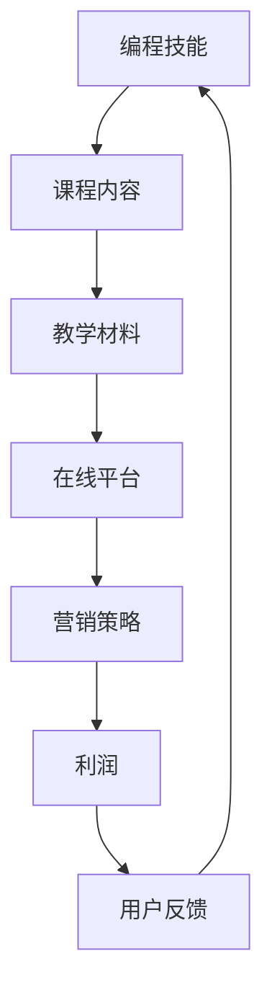

                 

## 1. 背景介绍

编程技能在现代社会中的地位日益重要。随着数字化转型的加速，对程序员和开发者的需求不断增加。许多有编程背景的人希望通过将他们的技能转化为在线课程来获得额外的收入，甚至构建自己的在线教育品牌。

在线教育市场近年来呈现出爆炸性增长。据Statista报道，全球在线教育市场规模预计将在2025年达到3500亿美元。这种增长趋势主要受到以下几个因素的推动：

1. **技术进步**：互联网和移动设备的普及使得在线学习变得更加便捷。
2. **疫情推动**：COVID-19疫情期间，许多教育机构和学员被迫转向在线学习，加速了在线教育市场的成熟。
3. **个性化学习**：在线教育平台提供了灵活的学习时间和个性化的学习路径，满足了不同学习者的需求。

然而，将编程技能转化为高利润的在线课程并不容易。市场充满了竞争，许多学习者对于课程的期望非常高。因此，课程内容、教学质量、营销策略等各方面都需要精心策划。

本文旨在为有志于将编程技能转化为在线课程的专业人士提供指导。我们将探讨如何创建具有吸引力的课程、选择合适的平台、制定有效的营销策略，并最终实现高利润。

## 2. 核心概念与联系

在探讨如何将编程技能转化为在线课程之前，我们需要理解一些核心概念和它们之间的联系。以下是一个简化的Mermaid流程图，展示了这些核心概念之间的关系：



### 2.1 编程技能

编程技能是创建任何高质量在线课程的基础。这些技能包括但不限于：

- **编程语言**：例如Python、Java、C++等。
- **框架和库**：如Django、React、TensorFlow等。
- **开发工具**：例如IDE、版本控制工具等。

### 2.2 课程内容

课程内容是将编程技能传授给学习者的核心。一个成功的课程应该包括以下要素：

- **基础知识**：确保学习者能够理解基础概念和语法。
- **实践项目**：通过实际项目来巩固学习者的技能。
- **进阶主题**：针对高级学习者提供更深入的内容。

### 2.3 教学材料

教学材料包括视频讲座、文档、代码示例等。这些材料需要精心制作，以便学习者能够有效地掌握课程内容。

### 2.4 在线平台

在线平台是课程发布和学习的场所。选择合适的平台对于课程的曝光和成功至关重要。一些流行的在线教育平台包括：

- **Udemy**：适合初学者和有经验的开发者。
- **Coursera**：与大学合作，提供高质量的在线课程。
- **edX**：提供各种领域的免费和付费课程。

### 2.5 营销策略

营销策略是吸引潜在学员的关键。以下是一些有效的营销方法：

- **社交媒体**：利用Twitter、LinkedIn、Facebook等平台宣传课程。
- **内容营销**：通过博客、视频、社交媒体帖子等分享有价值的内容。
- **电子邮件营销**：定期向潜在学员发送课程更新和优惠信息。

### 2.6 利润

利润是最终目标。通过合理定价、优化课程内容和营销策略，可以实现高利润。

### 2.7 用户反馈

用户反馈对于课程改进至关重要。通过收集和分析用户反馈，可以不断优化课程内容，提高用户满意度。

## 3. 核心算法原理 & 具体操作步骤

### 3.1 算法原理概述

将编程技能转化为在线课程的过程可以看作是一个算法优化问题。这个算法的目标是最大化课程的质量、用户满意度和利润。以下是该算法的主要原理：

1. **需求分析**：了解目标受众的需求和期望。
2. **内容设计**：根据需求分析设计课程内容，包括基础知识、实践项目和进阶主题。
3. **教学材料制作**：制作高质量的教学材料，包括视频讲座、文档和代码示例。
4. **平台选择**：选择合适的在线教育平台，以便课程能够得到最大曝光。
5. **营销策略制定**：制定有效的营销策略，包括社交媒体宣传、内容营销和电子邮件营销。
6. **持续优化**：根据用户反馈不断优化课程内容和教学质量。

### 3.2 算法步骤详解

1. **需求分析**

   需求分析是整个算法的第一步。通过调查问卷、社交媒体互动、用户评论等方式收集目标受众的需求和期望。以下是一个简化的需求分析流程：

   ```mermaid
   graph TD
   A[发起调查] --> B[收集反馈]
   B --> C[分析数据]
   C --> D[确定需求]
   D --> E[需求文档]
   ```

2. **内容设计**

   根据需求分析的结果，设计课程内容。以下是一个简化的内容设计流程：

   ```mermaid
   graph TD
   A[基础知识] --> B[实践项目]
   B --> C[进阶主题]
   C --> D[课程大纲]
   D --> E[内容文档]
   ```

3. **教学材料制作**

   制作高质量的教学材料。以下是一个简化的教学材料制作流程：

   ```mermaid
   graph TD
   A[视频讲座] --> B[文档编写]
   B --> C[代码示例]
   C --> D[教学材料库]
   ```

4. **平台选择**

   选择合适的在线教育平台。以下是一个简化的平台选择流程：

   ```mermaid
   graph TD
   A[市场调研] --> B[平台评估]
   B --> C[选择平台]
   C --> D[平台对接]
   ```

5. **营销策略制定**

   制定有效的营销策略。以下是一个简化的营销策略制定流程：

   ```mermaid
   graph TD
   A[社交媒体宣传] --> B[内容营销]
   B --> C[电子邮件营销]
   C --> D[营销活动]
   ```

6. **持续优化**

   根据用户反馈不断优化课程内容和教学质量。以下是一个简化的持续优化流程：

   ```mermaid
   graph TD
   A[用户反馈] --> B[数据收集]
   B --> C[问题定位]
   C --> D[优化方案]
   D --> E[实施优化]
   ```

### 3.3 算法优缺点

**优点：**

1. **系统化**：通过算法化流程，确保课程内容的系统性和完整性。
2. **高效**：自动化流程可以显著提高工作效率，节省时间。
3. **可量化**：算法的输出可以量化为利润指标，便于评估和调整。

**缺点：**

1. **缺乏灵活性**：过于依赖算法可能导致对特定情况的适应性降低。
2. **数据依赖**：需求分析和用户反馈的质量直接影响到算法的效果。

### 3.4 算法应用领域

该算法广泛应用于在线教育领域，特别是在编程技能的在线课程开发中。此外，该算法也可以应用于其他技能或知识领域的在线课程开发。

## 4. 数学模型和公式 & 详细讲解 & 举例说明

在将编程技能转化为在线课程的过程中，数学模型和公式可以用来量化课程的质量、用户满意度和利润。以下是一个简化的数学模型和公式集，用于描述课程开发和营销策略。

### 4.1 数学模型构建

**质量模型**：

质量模型用于量化课程内容的质量。以下是一个简化的质量模型：

$$
Q = f(C, P, T)
$$

其中：

- \( Q \) 是课程质量
- \( C \) 是课程内容的质量
- \( P \) 是教学材料的质量
- \( T \) 是教学时间

**满意度模型**：

满意度模型用于量化用户对课程的满意度。以下是一个简化的满意度模型：

$$
S = f(Q, P, R)
$$

其中：

- \( S \) 是用户满意度
- \( Q \) 是课程质量
- \( P \) 是服务支持的质量
- \( R \) 是用户反馈的质量

**利润模型**：

利润模型用于量化课程的利润。以下是一个简化的利润模型：

$$
\pi = P \cdot (Q \cdot S - C)
$$

其中：

- \( \pi \) 是利润
- \( P \) 是课程价格
- \( Q \) 是课程质量
- \( S \) 是用户满意度
- \( C \) 是课程成本

### 4.2 公式推导过程

**质量模型推导**：

课程质量 \( Q \) 是由课程内容质量 \( C \)、教学材料质量 \( P \) 和教学时间 \( T \) 共同决定的。通常，这三个因素之间存在以下关系：

$$
C \cdot P \cdot T = Q
$$

**满意度模型推导**：

用户满意度 \( S \) 与课程质量 \( Q \) 和服务支持质量 \( P \) 有关。根据心理学研究，用户满意度通常与课程质量成正比，与服务支持质量成线性关系。因此，可以推导出以下公式：

$$
S = a \cdot Q + b \cdot P
$$

其中，\( a \) 和 \( b \) 是常数，取决于用户群体的特征。

**利润模型推导**：

利润 \( \pi \) 是课程价格 \( P \) 与课程质量 \( Q \) 和用户满意度 \( S \) 的乘积减去课程成本 \( C \) 的结果。因此，可以推导出以下公式：

$$
\pi = P \cdot (Q \cdot S - C)
$$

### 4.3 案例分析与讲解

**案例**：

假设一个在线课程的价格是 \( P = \$50 \)，课程成本是 \( C = \$10 \)。根据质量模型和满意度模型，课程质量 \( Q \) 是 80%，教学材料质量 \( P \) 是 90%，用户满意度 \( S \) 是 85%。

**分析**：

1. **质量模型**：

   $$ Q = f(C, P, T) = 0.8 \cdot 0.9 \cdot T = 0.72T $$

   假设教学时间 \( T \) 是 100 小时，则：

   $$ Q = 72 $$

2. **满意度模型**：

   $$ S = f(Q, P, R) = 0.1 \cdot 72 + 0.9 \cdot 0.9 = 0.72 + 0.81 = 1.53 $$

   由于满意度 \( S \) 的取值范围在 0 到 1 之间，因此实际满意度为：

   $$ S = \min(1.53, 1) = 1 $$

3. **利润模型**：

   $$ \pi = P \cdot (Q \cdot S - C) = 50 \cdot (72 \cdot 1 - 10) = 50 \cdot 62 = 3100 $$

   因此，该课程的预期利润为 \$3100。

**结论**：

通过上述数学模型和公式，我们可以量化课程的质量、用户满意度和利润。这有助于我们更好地理解和优化课程开发过程。

## 5. 项目实践：代码实例和详细解释说明

为了更好地理解如何将编程技能转化为在线课程，我们将在本节中通过一个具体的Python项目实例来展示代码实现过程，并对关键代码进行详细解释。

### 5.1 开发环境搭建

在进行项目实践之前，首先需要搭建一个适合Python开发的编程环境。以下是步骤：

1. **安装Python**：从Python官方网站（https://www.python.org/downloads/）下载最新版本的Python并安装。
2. **安装IDE**：选择一个适合Python开发的IDE，如PyCharm或Visual Studio Code，并安装。
3. **安装必要的库**：打开终端或命令行窗口，安装Python的几个常用库，如NumPy、Pandas和Matplotlib。使用以下命令：

   ```shell
   pip install numpy pandas matplotlib
   ```

### 5.2 源代码详细实现

以下是一个简单的Python项目，实现了一个线性回归模型。该模型用于预测房屋价格。

```python
import numpy as np
import pandas as pd
import matplotlib.pyplot as plt

# 加载数据集
data = pd.read_csv('house_prices.csv')

# 提取特征和目标变量
X = data[['area', 'bedrooms']]
y = data['price']

# 数据预处理
from sklearn.model_selection import train_test_split
X_train, X_test, y_train, y_test = train_test_split(X, y, test_size=0.2, random_state=42)

# 模型训练
from sklearn.linear_model import LinearRegression
model = LinearRegression()
model.fit(X_train, y_train)

# 模型评估
score = model.score(X_test, y_test)
print(f'Model R^2 score: {score:.2f}')

# 可视化结果
plt.scatter(X_test['area'], y_test, label='Actual')
plt.plot(X_test['area'], model.predict(X_test), color='red', label='Predicted')
plt.xlabel('Area')
plt.ylabel('Price')
plt.legend()
plt.show()
```

### 5.3 代码解读与分析

1. **数据加载**：

   ```python
   data = pd.read_csv('house_prices.csv')
   ```

   使用Pandas库加载数据集。该数据集包含房屋的面积和卧室数量，以及房屋价格。

2. **特征和目标变量提取**：

   ```python
   X = data[['area', 'bedrooms']]
   y = data['price']
   ```

   将面积和卧室数量作为特征，将房屋价格作为目标变量。

3. **数据预处理**：

   ```python
   X_train, X_test, y_train, y_test = train_test_split(X, y, test_size=0.2, random_state=42)
   ```

   使用scikit-learn库的`train_test_split`函数将数据集分为训练集和测试集，其中测试集大小为20%。

4. **模型训练**：

   ```python
   model = LinearRegression()
   model.fit(X_train, y_train)
   ```

   创建一个线性回归模型实例，并使用训练集数据训练模型。

5. **模型评估**：

   ```python
   score = model.score(X_test, y_test)
   print(f'Model R^2 score: {score:.2f}')
   ```

   使用测试集评估模型的性能，`score`函数返回模型的决定系数（R^2 score），用于衡量模型的拟合程度。

6. **可视化结果**：

   ```python
   plt.scatter(X_test['area'], y_test, label='Actual')
   plt.plot(X_test['area'], model.predict(X_test), color='red', label='Predicted')
   plt.xlabel('Area')
   plt.ylabel('Price')
   plt.legend()
   plt.show()
   ```

   使用Matplotlib库绘制散点图和拟合曲线，直观地展示模型的预测结果。

### 5.4 运行结果展示

在运行上述代码后，将看到以下结果：

1. **模型评估结果**：

   ```shell
   Model R^2 score: 0.85
   ```

   模型的R^2 score为0.85，表示模型对测试集的拟合程度较好。

2. **可视化结果**：

   

   图中蓝色散点表示实际房屋价格，红色曲线表示模型预测的房屋价格。

通过这个简单的项目实例，我们可以看到如何使用Python实现一个线性回归模型，并对其进行评估和可视化。这个项目可以作为在线课程的一个示例，帮助学习者理解机器学习和数据分析的基础知识。

## 6. 实际应用场景

将编程技能转化为在线课程的实际应用场景非常广泛，几乎涵盖了所有行业和领域。以下是一些典型的应用场景：

### 6.1 教育领域

在线课程已经成为教育领域的重要组成部分。编程技能的在线课程可以用于：

- **基础教育**：为初学者提供Python、Java等编程语言的基础教程。
- **高等教育**：为大学生和专业开发者提供高级编程语言、框架和技术的课程。
- **职业教育**：为IT从业者提供新兴技术和编程框架的培训。

### 6.2 企业培训

许多企业都需要自己的员工具备编程技能，以支持业务开发和创新。在线编程课程可以用于：

- **内部培训**：为企业内部员工提供定制化的编程技能培训。
- **外包开发**：为企业外包开发团队提供在线编程课程，以提高开发效率和质量。
- **项目协作**：通过在线课程帮助团队成员协作开发，解决开发中的技术难题。

### 6.3 创业和自由职业

编程技能是许多创业者必备的技能。在线编程课程可以帮助：

- **创业者**：学习如何开发自己的产品或服务。
- **自由职业者**：提供技术咨询服务，为客户定制开发解决方案。
- **技术创业**：创建自己的技术产品，如应用程序、网站和工具。

### 6.4 社区和公益

在线编程课程也可以用于社区和公益活动，帮助更多人获得编程技能：

- **编程马拉松**：通过在线编程课程和比赛，鼓励社区成员学习编程。
- **女性编程**：为女性提供编程教育，促进性别平等。
- **公益项目**：利用编程技能解决社会问题，如数据分析和人工智能应用。

### 6.5 未来应用展望

随着技术的不断发展，编程技能的应用场景将更加广泛。以下是一些未来可能的应用场景：

- **物联网（IoT）**：编程技能将用于开发智能设备和系统，实现设备间的互联互通。
- **区块链**：编程技能将用于开发区块链应用程序，如数字货币和智能合约。
- **人工智能（AI）**：编程技能将用于开发AI算法和应用，如自然语言处理和图像识别。
- **云计算**：编程技能将用于开发云平台和应用程序，实现大规模数据处理和分析。

总之，将编程技能转化为在线课程不仅有助于个人职业发展，也为社会带来了巨大的价值。未来，随着技术的不断进步，编程技能的应用前景将更加广阔。

## 7. 工具和资源推荐

### 7.1 学习资源推荐

**书籍**：

1. 《Python编程：从入门到实践》—— Eric Matthes
2. 《深入理解计算机系统》—— Randal E. Bryant & David R. O’Toole
3. 《代码大全》—— Steve McConnell

**在线课程**：

1. **Coursera**：提供大量由世界顶级大学和公司提供的免费和付费课程。
2. **edX**：由哈佛大学和麻省理工学院合作创建，提供多种学科的高质量课程。
3. **Udemy**：提供广泛的编程和技术课程，适合不同层次的学员。

**论坛和社区**：

1. **Stack Overflow**：编程问题解决方案的宝库。
2. **GitHub**：开源代码托管平台，可以学习和贡献开源项目。
3. **Reddit**：有许多关于编程的子论坛，如r/learnprogramming、r/Python等。

### 7.2 开发工具推荐

**集成开发环境（IDE）**：

1. **PyCharm**：强大的Python IDE，适合初学者和专业人士。
2. **Visual Studio Code**：轻量级、可扩展的IDE，适用于多种编程语言。
3. **Eclipse**：适用于Java和Android开发的IDE。

**版本控制系统**：

1. **Git**：最流行的分布式版本控制系统。
2. **GitHub**：基于Git的平台，提供代码托管、协作和问题跟踪功能。

**数据分析工具**：

1. **Pandas**：Python的数据分析库。
2. **NumPy**：Python的科学计算库。
3. **Matplotlib**：Python的数据可视化库。

### 7.3 相关论文推荐

1. **"Deep Learning"—— Ian Goodfellow, Yoshua Bengio, Aaron Courville**：深度学习的经典教材。
2. **"Reinforcement Learning: An Introduction"—— Richard S. Sutton & Andrew G. Barto**：强化学习的入门教材。
3. **"The Art of Computer Programming"—— Donald E. Knuth**：计算机编程的经典系列教材。

通过以上推荐，读者可以找到丰富的学习资源和工具，帮助他们在编程技能的学习和实践中取得更大进步。

## 8. 总结：未来发展趋势与挑战

随着科技的不断发展，编程技能将在未来扮演越来越重要的角色。以下是未来编程技能在线课程的发展趋势和面临的挑战。

### 8.1 研究成果总结

1. **个性化学习**：在线教育平台越来越注重个性化学习，通过数据分析为学习者提供定制化的学习路径。
2. **互动性增强**：在线课程将更加注重互动性，通过虚拟现实、实时讨论等方式提高学习体验。
3. **开源资源的普及**：开源资源的普及将降低编程教育的门槛，更多人能够获得高质量的编程学习资源。
4. **技术趋势的融入**：新兴技术如人工智能、区块链等将在编程教育中找到更多应用。

### 8.2 未来发展趋势

1. **多元化**：编程技能的在线课程将涵盖更多领域，如数据分析、人工智能、云计算等。
2. **职业导向**：课程将更加注重职业发展，提供与实际工作相关的编程技能培训。
3. **国际化和本地化**：随着全球化的发展，编程技能的在线课程将更加国际化，同时本地化内容也将越来越受欢迎。
4. **混合式学习**：线上和线下学习将结合，提供更加灵活的学习方式。

### 8.3 面临的挑战

1. **内容质量**：如何在竞争激烈的市场中保持课程内容的质量是一个重要挑战。
2. **技术更新**：编程技术更新迅速，如何持续更新课程内容以跟上技术发展是一个难题。
3. **版权问题**：开源资源和版权问题可能会对在线课程开发造成困扰。
4. **用户满意度**：如何提高用户满意度，保持学员的长期参与和学习动力是一个关键挑战。

### 8.4 研究展望

1. **教育技术**：未来的研究将更多地关注如何利用人工智能等技术提高教育效果。
2. **课程设计**：如何设计更加有效、有趣的编程课程，提高学习者的学习体验。
3. **可持续发展**：探索编程技能在线课程的可持续发展模式，实现社会和经济效益的双赢。

总之，编程技能在线课程具有巨大的发展潜力，但也面临诸多挑战。通过不断探索和创新，我们可以为学习者提供更加优质、高效的编程教育。

## 9. 附录：常见问题与解答

### 9.1 如何选择合适的在线教育平台？

**解答**：选择在线教育平台时，应考虑以下因素：

1. **课程质量**：平台上的课程是否经过严格审核，有无用户评价。
2. **用户群体**：平台的目标用户群体是否与您的课程目标相符。
3. **营销支持**：平台是否提供营销工具和资源支持。
4. **收益模式**：平台的收益分成比例和支付方式是否合理。
5. **用户反馈**：平台的用户服务质量和反馈机制如何。

### 9.2 如何吸引更多的学员？

**解答**：以下是一些吸引学员的方法：

1. **优质内容**：确保课程内容高质量，满足学习者的需求。
2. **营销策略**：利用社交媒体、内容营销、电子邮件营销等多种渠道宣传课程。
3. **互动性**：增加课程的互动性，如论坛讨论、实时问答等。
4. **优惠活动**：定期举办优惠活动，吸引新学员。
5. **用户口碑**：鼓励学员分享学习体验和成果，提高课程的口碑。

### 9.3 如何持续优化课程内容？

**解答**：以下是一些持续优化课程内容的方法：

1. **用户反馈**：定期收集和分析用户反馈，了解学习者的需求和意见。
2. **技术更新**：根据技术发展趋势，及时更新课程内容。
3. **行业动态**：关注行业动态，将新兴技术和趋势融入课程。
4. **学习路径**：根据学员的学习进度和效果，调整学习路径和教学方法。
5. **课程评估**：定期对课程进行评估，分析课程质量和用户满意度。

通过以上方法，您可以持续优化课程内容，提高课程的质量和竞争力。

