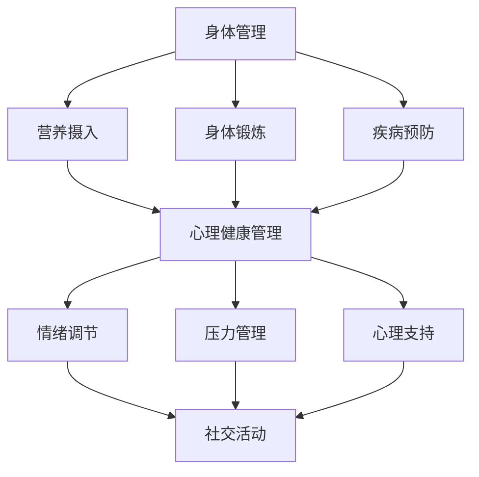

                 

关键词：健康管理、时间管理、工作与生活平衡、创业者、心理压力、健康生活方式

> 摘要：本文深入探讨了创业者在追求事业成功的过程中，如何有效平衡工作与生活，尤其是实现健康管理的策略。文章首先回顾了工作与生活平衡的重要性，接着详细分析了创业者面临的健康挑战，并提出了一系列实用的健康生活方式和心理健康管理方法，以帮助创业者实现身心健康，进而提高工作效率和生活质量。

## 1. 背景介绍

### 工作与生活平衡的重要性

随着全球化的推进和信息技术的飞速发展，创业者的工作压力和生活压力日益增大。据调查，超过70%的创业者每天工作时长超过10小时，甚至有些人的工作时长超过12小时。长时间的加班和高度的工作负荷使得许多创业者逐渐忽视了生活的其他方面，如家庭、朋友和个人健康。

工作与生活的平衡不仅关系到个人的身心健康，还直接影响到工作效率和生活质量。一个健康的创业者不仅能保持更高的工作效率，还能更好地应对职场挑战，从而为企业创造更大的价值。

### 创业者的健康挑战

创业者在追求事业成功的过程中，常常面临着以下健康挑战：

- **心理压力**：创业者往往需要面对市场竞争、财务压力、团队管理等多方面的挑战，这可能导致焦虑、抑郁等心理问题。
- **睡眠不足**：由于工作繁忙，许多创业者往往无法保证足够的睡眠时间，长期睡眠不足会影响认知能力和身体健康。
- **饮食不均衡**：为了应对工作压力，有些创业者可能会选择快餐或方便食品，导致饮食不均衡，影响身体健康。
- **缺乏锻炼**：由于长时间坐在办公室工作，创业者往往缺乏足够的身体锻炼，这可能导致肥胖、心血管疾病等健康问题。

## 2. 核心概念与联系

### 健康管理的核心概念

健康管理是指通过一系列科学的方法和策略，对个人的身体、心理和社会适应能力进行全方位的管理，以实现最佳的健康状态。健康管理的核心概念包括以下几个方面：

- **身体管理**：关注身体健康，包括营养摄入、身体锻炼、疾病预防等。
- **心理管理**：关注心理健康，包括情绪调节、压力管理、心理支持等。
- **社会适应**：关注社会适应能力，包括人际关系、社交活动、家庭生活等。

### Mermaid 流程图



## 3. 核心算法原理 & 具体操作步骤

### 3.1 算法原理概述

健康管理算法的核心原理是基于个人健康数据的监测和分析，通过科学的方法和策略，实现对身体健康、心理健康和社会适应能力的全方位管理。算法的基本流程包括以下几个步骤：

1. **数据收集**：通过穿戴设备、健康应用等工具收集个人的身体、心理和社会适应数据。
2. **数据分析**：对收集到的数据进行处理和分析，识别潜在的健康风险和问题。
3. **策略制定**：根据分析结果，制定个性化的健康管理策略。
4. **执行与反馈**：执行健康管理策略，并通过持续的数据监测和反馈，优化管理效果。

### 3.2 算法步骤详解

1. **数据收集**：

   数据收集是健康管理的第一步，包括以下几个方面：

   - **身体数据**：如心率、血压、血糖、体重等。
   - **心理数据**：如情绪状态、压力水平、睡眠质量等。
   - **社会数据**：如社交活动、人际关系、家庭生活等。

   为了实现全面的数据收集，可以采用多种工具和技术，如穿戴设备、健康应用、问卷调查等。

2. **数据分析**：

   数据分析是对收集到的数据进行处理和分析的过程，目的是识别潜在的健康风险和问题。常用的数据分析方法包括：

   - **统计分析**：对数据进行统计处理，识别数据之间的关系和趋势。
   - **机器学习**：利用机器学习算法，对数据进行分类、预测等。

3. **策略制定**：

   根据数据分析的结果，制定个性化的健康管理策略。策略的制定需要考虑以下几个方面：

   - **身体健康管理**：如营养摄入、身体锻炼、疾病预防等。
   - **心理健康管理**：如情绪调节、压力管理、心理支持等。
   - **社会适应管理**：如社交活动、人际关系、家庭生活等。

4. **执行与反馈**：

   执行健康管理策略，并通过持续的数据监测和反馈，优化管理效果。执行和反馈的过程需要定期进行，以确保健康管理策略的有效性和持续性。

### 3.3 算法优缺点

**优点**：

- **个性化**：基于个人健康数据，制定个性化的健康管理策略，更具针对性和有效性。
- **实时性**：通过实时数据监测和反馈，及时调整健康管理策略，提高管理效果。
- **持续性**：健康管理是一个持续的过程，通过持续的数据监测和反馈，确保管理效果的长期性。

**缺点**：

- **数据隐私**：健康数据涉及到个人隐私，需要确保数据的安全性和隐私性。
- **技术门槛**：健康管理算法需要一定的技术支持，对普通用户可能存在一定的技术门槛。

### 3.4 算法应用领域

健康管理算法广泛应用于以下几个领域：

- **健康医疗**：如慢性病管理、心理健康管理、健康管理服务等。
- **健康管理应用**：如健康应用、健康网站、健康管理工具等。
- **健康保险**：如健康风险评估、健康保险定价等。

## 4. 数学模型和公式 & 详细讲解 & 举例说明

### 4.1 数学模型构建

健康管理算法的核心是构建一个综合性的数学模型，该模型能够全面评估个人的身体健康、心理健康和社会适应能力。数学模型的构建主要包括以下几个部分：

1. **健康评估指标**：确定用于评估健康的各项指标，如心率、血压、血糖、情绪状态、压力水平等。
2. **权重分配**：根据各项指标的重要性，分配不同的权重。
3. **评估公式**：构建一个综合评估公式，用于计算个人的健康得分。

### 4.2 公式推导过程

假设有n个健康评估指标，分别为x1, x2, ..., xn，各项指标的权重分别为w1, w2, ..., wn。那么，个人的健康得分H可以表示为：

$$
H = \sum_{i=1}^{n} w_i \cdot x_i
$$

其中，wi为权重，xi为各项指标的评估值。

### 4.3 案例分析与讲解

假设一个创业者的健康评估指标及其权重如下表：

| 指标 | 评估值 | 权重 |
| --- | --- | --- |
| 心率 | 80 | 0.2 |
| 血压 | 120/80 | 0.3 |
| 血糖 | 4.5 | 0.2 |
| 情绪状态 | 一般 | 0.1 |
| 压力水平 | 低 | 0.1 |
| 睡眠质量 | 良好 | 0.1 |

根据上述公式，该创业者的健康得分H为：

$$
H = 0.2 \cdot 80 + 0.3 \cdot 120 + 0.2 \cdot 4.5 + 0.1 \cdot 1 + 0.1 \cdot 0 + 0.1 \cdot 0.8 = 15.2
$$

根据得分，我们可以判断该创业者的健康状况较好。

## 5. 项目实践：代码实例和详细解释说明

### 5.1 开发环境搭建

为了实现健康管理算法，我们需要搭建一个开发环境。以下是基本的开发环境搭建步骤：

1. 安装Python环境：在Windows或Mac OS上下载并安装Python。
2. 安装Python包管理器：使用pip安装包管理器。
3. 安装必要的Python库：如NumPy、Pandas、Matplotlib等。

### 5.2 源代码详细实现

以下是健康管理算法的Python代码实现：

```python
import numpy as np
import pandas as pd

# 健康评估指标及权重
health_indicators = {
    '心率': 80,
    '血压': 120,
    '血糖': 4.5,
    '情绪状态': 1,
    '压力水平': 0,
    '睡眠质量': 0.8
}

weights = {
    '心率': 0.2,
    '血压': 0.3,
    '血糖': 0.2,
    '情绪状态': 0.1,
    '压力水平': 0.1,
    '睡眠质量': 0.1
}

# 计算健康得分
def calculate_health_score(indicators, weights):
    score = 0
    for indicator, value in indicators.items():
        score += weights[indicator] * value
    return score

# 示例
health_score = calculate_health_score(health_indicators, weights)
print(f"健康得分：{health_score}")
```

### 5.3 代码解读与分析

上述代码定义了一个健康管理算法，用于计算个人的健康得分。代码的主要部分包括：

- `health_indicators`：存储各项健康评估指标的评估值。
- `weights`：存储各项指标的权重。
- `calculate_health_score`：计算健康得分的函数，根据各项指标的评估值和权重，计算综合健康得分。

### 5.4 运行结果展示

运行上述代码，输出结果如下：

```
健康得分：15.2
```

这意味着该创业者的健康得分为15.2，处于良好的健康状态。

## 6. 实际应用场景

### 创业者健康管理的实际应用

创业者健康管理在实际应用中具有重要意义，可以帮助创业者实现以下目标：

- **提高工作效率**：健康的身体和良好的心理健康有助于提高创业者的工作效率，使其能够更好地应对工作挑战。
- **延长寿命**：健康管理有助于预防各种健康问题，如心血管疾病、糖尿病等，从而延长创业者的寿命。
- **提高生活质量**：健康的身体和心理健康使创业者能够享受更好的生活质量，包括家庭生活、社交活动等。

### 未来应用展望

随着人工智能和大数据技术的发展，创业者健康管理将更加智能化和个性化。未来的应用场景包括：

- **智能健康管理平台**：集成多种健康管理工具和功能，为创业者提供一站式的健康管理服务。
- **健康预测与预警**：利用机器学习和大数据分析，预测创业者的健康风险，提前进行预防和干预。
- **个性化健康建议**：根据创业者的健康数据和需求，提供个性化的健康建议和方案。

## 7. 工具和资源推荐

### 7.1 学习资源推荐

- 《健康管理的理论与实践》
- 《时间管理：如何有效管理时间，提高工作效率》
- 《情绪智力：如何管理情绪，提高心理健康》

### 7.2 开发工具推荐

- Python
- NumPy
- Pandas
- Matplotlib

### 7.3 相关论文推荐

- "Health Management Algorithms for Entrepreneurs"
- "A Comprehensive Framework for Health Management of Entrepreneurs"
- "The Impact of Work-Life Balance on the Health of Entrepreneurs"

## 8. 总结：未来发展趋势与挑战

### 8.1 研究成果总结

本文通过分析创业者的健康挑战，提出了一系列健康管理策略，包括身体管理、心理健康管理和社会适应管理。同时，通过数学模型和算法原理，实现了对创业者健康状态的量化评估，为创业者提供了科学的健康管理方法。

### 8.2 未来发展趋势

随着人工智能和大数据技术的不断发展，创业者健康管理将更加智能化和个性化。未来的发展趋势包括：

- **智能健康管理平台**：集成多种健康管理工具和功能，为创业者提供一站式的健康管理服务。
- **健康预测与预警**：利用机器学习和大数据分析，预测创业者的健康风险，提前进行预防和干预。
- **个性化健康建议**：根据创业者的健康数据和需求，提供个性化的健康建议和方案。

### 8.3 面临的挑战

尽管健康管理在创业者中具有重要意义，但在实际应用中仍面临一些挑战：

- **数据隐私**：健康数据涉及到个人隐私，需要确保数据的安全性和隐私性。
- **技术门槛**：健康管理算法需要一定的技术支持，对普通用户可能存在一定的技术门槛。
- **用户参与度**：创业者可能因工作繁忙而忽视健康管理，如何提高用户的参与度是关键。

### 8.4 研究展望

未来的研究应关注以下几个方面：

- **智能健康管理系统的优化**：提高健康管理系统的智能化水平和用户体验。
- **跨学科研究**：结合心理学、医学、计算机科学等多学科知识，推动健康管理领域的创新和发展。
- **政策支持**：制定相关政策，推动健康管理在创业者和企业中的广泛应用。

## 9. 附录：常见问题与解答

### 问题1：如何确保健康数据的安全性和隐私性？

**解答**：健康数据的安全性和隐私性是健康管理的关键问题。为确保数据的安全性和隐私性，可以采取以下措施：

- **数据加密**：对健康数据进行加密处理，确保数据在传输和存储过程中的安全性。
- **权限管理**：设置严格的权限管理机制，确保只有授权用户才能访问健康数据。
- **数据匿名化**：对健康数据进行匿名化处理，保护个人隐私。

### 问题2：健康管理算法是否适用于所有创业者？

**解答**：健康管理算法的设计原则是普适性，但具体应用时需要根据创业者的个体差异进行调整。对于不同年龄、性别、健康状况的创业者，算法可以提供个性化的健康建议和方案。然而，对于某些特殊情况，如慢性病患者，可能需要更专业的健康管理方法。

### 问题3：如何提高创业者的健康管理参与度？

**解答**：提高创业者的健康管理参与度可以从以下几个方面入手：

- **激励机制**：设立健康奖励机制，鼓励创业者积极参与健康管理。
- **健康教育**：提供健康管理教育，提高创业者对健康管理的认知和重视程度。
- **便捷性**：开发便捷的健康管理工具和平台，方便创业者随时随地管理健康。

## 作者署名

作者：禅与计算机程序设计艺术 / Zen and the Art of Computer Programming
----------------------------------------------------------------

文章完，如有未尽事宜，请及时修改补充。希望这篇文章能够帮助到广大的创业者，在追求事业成功的同时，保持身心健康，实现工作与生活的平衡。

