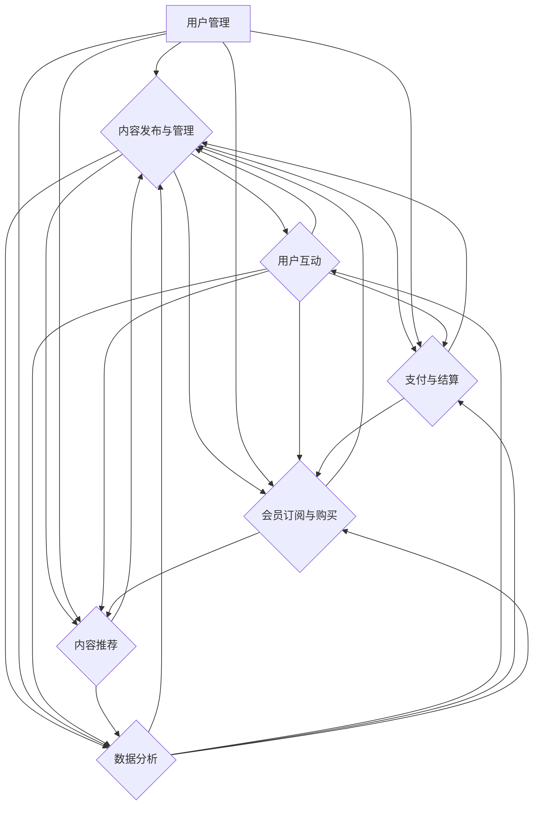

                 

关键词：个人知识付费平台、知识变现、在线教育、内容管理、用户互动、技术架构

> 摘要：本文将探讨如何构建一个个人知识付费平台，从概念设计到技术实现，再到运营策略，提供一整套构建个人知识付费平台的指导方案。

## 1. 背景介绍

在互联网高速发展的今天，知识经济时代已然到来。知识付费作为一种新型商业模式，正在迅速崛起。越来越多的人希望通过在线平台分享自己的专业知识和技能，实现知识变现。个人知识付费平台作为知识共享和交易的重要载体，不仅为知识创作者提供了广阔的舞台，也为求知者提供了便捷的学习途径。

构建个人知识付费平台，不仅需要创新的内容生产方式，还需要完善的技术支持和运营策略。本文将围绕以下几个方面展开讨论：

- **核心概念与联系**：介绍构建个人知识付费平台所需的核心概念，并使用Mermaid流程图展示整体架构。
- **核心算法原理与操作步骤**：详细讲解技术实现中的核心算法原理和操作步骤。
- **数学模型与公式**：介绍构建平台所需的基础数学模型和公式，并进行案例说明。
- **项目实践**：提供实际代码实例，详细解释平台的实现过程。
- **实际应用场景**：分析个人知识付费平台在不同行业中的应用。
- **工具和资源推荐**：推荐构建平台所需的学习资源和开发工具。
- **未来发展趋势与挑战**：展望个人知识付费平台的未来发展方向和面临的挑战。

通过本文的阅读，您将了解到如何从零开始打造一个个人知识付费平台，并从中获得丰富的实践经验。

### 1.1 市场分析

在互联网教育行业中，知识付费已经成为一个不可忽视的市场。根据最新数据显示，全球在线教育市场规模已达到数百亿美元，而知识付费作为在线教育的重要组成部分，其增长速度更是迅猛。以下是市场分析中的一些关键点：

- **用户需求**：随着信息化和数字化的发展，用户对于获取高质量、专业化的知识需求日益增长。尤其是在职场技能提升、兴趣培养和终身学习等方面，用户更倾向于通过付费方式获取有价值的内容。
- **商业模式**：知识付费平台主要通过内容销售、会员订阅、广告投放等模式实现盈利。其中，内容销售和会员订阅是主要的收入来源，而广告投放则为平台提供了额外的收入渠道。
- **竞争格局**：当前市场上已经涌现出一批知名的知识付费平台，如Coursera、Udemy、网易云课堂等。这些平台通过大规模内容采购和优质讲师资源，吸引了大量用户。同时，一些垂直领域的知识付费平台也在不断涌现，如编程学习平台、心理咨询平台等。
- **行业趋势**：随着人工智能、大数据等技术的应用，知识付费平台正朝着个性化、智能化、社交化的方向发展。未来，平台将更加注重用户数据分析和个性化推荐，以提供更精准的学习体验。

综上所述，个人知识付费平台具有广阔的市场前景和发展潜力。然而，如何在竞争激烈的市场中脱颖而出，实现可持续发展，仍需要平台运营者深入思考和精心布局。

### 1.2 构建个人知识付费平台的必要性

构建个人知识付费平台对于知识创作者和求知者来说，都具有重要的意义。以下是构建个人知识付费平台的必要性分析：

- **知识创作者的角度**：

  - **知识变现**：个人知识付费平台为知识创作者提供了直接变现的途径。通过创作高质量的内容，知识创作者可以吸引粉丝，实现知识到金钱的转化。

  - **品牌建设**：一个独立的个人知识付费平台不仅有助于知识创作者建立个人品牌，还能提升其在行业内的知名度和影响力。

  - **自由控制**：相较于在现有平台上发布内容，个人知识付费平台给予知识创作者更大的自主权，可以自由设置内容形式、收费模式等，更好地满足用户需求。

- **求知者的角度**：

  - **个性化学习**：个人知识付费平台可以根据用户的需求和兴趣，提供个性化的学习内容和路径，提高学习效率。

  - **优质内容保障**：个人知识付费平台通常注重内容的质量，力求为用户提供有价值、有深度的知识，这对于求知者来说是一个重要的吸引力。

  - **互动与交流**：个人知识付费平台往往设有论坛、社群等互动功能，使得求知者能够与其他用户进行交流和讨论，共同进步。

综上所述，构建个人知识付费平台不仅有助于知识创作者实现知识变现，提升个人品牌，还能为求知者提供更好的学习体验。这对于促进知识共享和知识经济的发展具有重要意义。

### 1.3 个人知识付费平台的核心功能

构建一个成功的个人知识付费平台，需要实现一系列核心功能，以满足知识创作者和求知者的需求。以下是个人知识付费平台的主要功能：

- **内容发布与管理**：平台应支持知识创作者方便地上传和发布各类内容，包括文本、图片、音频和视频等。同时，应提供内容分类、标签管理等功能，以便用户能够快速找到所需内容。

- **用户管理**：平台需要实现用户注册、登录、个人信息管理等功能。此外，应支持用户角色划分，如知识创作者、求知者等，以提供不同的权限和功能。

- **支付与结算**：平台应集成支付系统，支持多种支付方式，如支付宝、微信支付等。同时，应实现自动结算和退款功能，确保交易的顺利进行。

- **会员订阅与购买**：平台应支持会员订阅和单次购买两种模式，为用户不同的消费需求提供选择。会员订阅模式可以提供定期内容更新、优惠价格等福利，吸引长期用户。

- **内容推荐**：平台应利用大数据和机器学习技术，实现个性化内容推荐。通过分析用户行为和偏好，为用户推荐相关度高、感兴趣的内容。

- **评论与互动**：平台应提供评论功能，让用户能够对内容进行评价和讨论。同时，应支持私信、社群等互动方式，增强用户粘性。

- **数据分析**：平台应具备数据收集和分析功能，通过用户行为数据、内容访问数据等，为运营决策提供支持。例如，分析用户活跃度、内容受欢迎程度等，以优化内容生产和推荐策略。

- **安全与合规**：平台需要确保用户数据和交易信息的安全，遵守相关法律法规，如数据保护法、隐私法等。

通过实现上述核心功能，个人知识付费平台可以提供优质的内容和服务，满足用户的需求，提升用户体验。

## 2. 核心概念与联系

### 2.1 个人知识付费平台的基本概念

在构建个人知识付费平台之前，我们首先需要明确一些核心概念，这些概念是理解平台功能和实现技术的基础。

- **知识创作者**：指的是在平台上发布内容和提供知识服务的人。他们可以是专业人士、行业专家、学者或者对某一领域有深入研究的爱好者。
- **求知者**：平台的服务对象，他们通过平台获取知识、学习技能、解决问题。
- **内容**：平台提供的主要产品，可以包括文字、图片、音频、视频等多种形式。内容的质量和实用性是平台竞争力的关键。
- **付费模式**：平台采用的内容收费方式，包括单次购买、会员订阅、限时优惠等。多样化的付费模式有助于满足不同用户的需求。
- **用户互动**：平台提供的用户评论、私信、社群等功能，用于增强用户之间的互动和连接，提高用户黏性。

### 2.2 核心概念之间的联系

个人知识付费平台的核心概念之间存在着紧密的联系，它们共同构建了一个完整的知识共享和交易生态系统。以下是这些概念之间的联系：

- **知识创作者**与**内容**：知识创作者通过平台发布高质量的内容，这些内容是平台的核心价值所在。平台提供了内容上传、编辑、发布等功能，使得知识创作者能够轻松地分享自己的知识。
- **内容**与**求知者**：求知者通过平台搜索、浏览、购买内容，实现知识的获取和学习。平台通过内容推荐系统，根据用户的兴趣和行为，为用户提供个性化内容。
- **付费模式**与**求知者**：求知者可以根据自己的需求和预算选择不同的付费模式。平台通过灵活的付费模式，提高了用户的参与度和满意度。
- **用户互动**与**求知者**：用户互动功能增强了求知者之间的交流和合作，使得学习过程更加生动和有趣。互动功能还促进了社区建设，提升了平台的社交属性。

### 2.3 个人知识付费平台的整体架构

为了更好地理解个人知识付费平台，我们使用Mermaid流程图来展示其整体架构。以下是一个简化的架构图：



### 2.4 概念图解释

- **用户管理**（A）：负责用户注册、登录、个人信息管理等功能，确保用户身份认证和数据安全。
- **内容发布与管理**（B）：提供内容上传、编辑、发布、分类、标签管理等功能，支持多种内容形式，如文本、图片、音频和视频。
- **用户互动**（C）：实现评论、私信、社群等功能，增强用户之间的互动和交流，提高用户黏性。
- **支付与结算**（D）：集成多种支付方式，如支付宝、微信支付等，实现自动结算和退款功能。
- **会员订阅与购买**（E）：提供会员订阅和单次购买两种模式，满足不同用户的需求。
- **内容推荐**（F）：利用大数据和机器学习技术，根据用户行为和偏好，实现个性化内容推荐。
- **数据分析**（G）：收集和分析用户行为数据、内容访问数据等，为内容生产、推荐策略和运营决策提供支持。

通过上述核心概念和整体架构的介绍，我们可以更好地理解个人知识付费平台的设计思路和实现方法。

## 3. 核心算法原理 & 具体操作步骤

### 3.1 算法原理概述

个人知识付费平台中的核心算法主要涉及内容推荐、用户行为分析和支付处理等方面。以下是这些算法的基本原理：

- **内容推荐算法**：基于用户的历史行为、兴趣爱好以及内容的相关性，为用户推荐可能感兴趣的知识内容。常见的推荐算法有协同过滤、基于内容的推荐和混合推荐等。

- **用户行为分析算法**：通过分析用户的浏览记录、购买行为、评论互动等数据，了解用户的需求和偏好，为内容推荐和个性化服务提供依据。常用的分析算法包括机器学习中的分类、聚类和关联规则挖掘等。

- **支付处理算法**：确保支付流程的安全和高效。包括支付请求的验证、支付金额的计算、支付结果的通知等。通常采用加密算法和分布式架构来保障交易的安全性。

### 3.2 算法步骤详解

#### 3.2.1 内容推荐算法

**步骤 1：数据收集与预处理**
- 收集用户行为数据，如浏览历史、购买记录、评论等。
- 对原始数据进行清洗和预处理，去除噪声数据，提取有用信息。

**步骤 2：特征提取**
- 对用户和内容进行特征提取，如用户兴趣标签、内容类别、关键词等。
- 利用文本处理技术（如词频分析、词向量表示）对文本内容进行特征提取。

**步骤 3：模型训练**
- 使用机器学习算法（如协同过滤、内容匹配、混合模型等）训练推荐模型。
- 模型训练过程中，使用交叉验证和超参数调优等方法提高模型性能。

**步骤 4：推荐生成**
- 根据用户当前的行为和偏好，调用推荐模型生成推荐列表。
- 对推荐结果进行排序和筛选，确保推荐内容的相关性和质量。

#### 3.2.2 用户行为分析算法

**步骤 1：数据收集与预处理**
- 收集用户行为数据，包括浏览历史、购买记录、评论互动等。
- 对原始数据进行清洗和预处理，去除噪声数据，提取有用信息。

**步骤 2：特征提取**
- 提取用户特征，如用户年龄、性别、职业等。
- 提取内容特征，如内容类别、关键词、作者等。

**步骤 3：数据建模**
- 使用机器学习算法（如分类、聚类、关联规则挖掘等）建立用户行为分析模型。
- 使用交叉验证和超参数调优等方法提高模型性能。

**步骤 4：行为预测与优化**
- 利用训练好的模型预测用户的行为和偏好。
- 根据预测结果优化内容推荐策略和个性化服务。

#### 3.2.3 支付处理算法

**步骤 1：支付请求验证**
- 接收支付请求，对支付金额、支付方式等进行验证。
- 使用加密算法（如RSA、AES等）确保支付数据的安全。

**步骤 2：支付金额计算**
- 根据购买内容的价格和支付方式，计算支付金额。
- 对订单进行加密处理，防止篡改。

**步骤 3：支付处理**
- 与第三方支付平台（如支付宝、微信支付等）进行通信，完成支付处理。
- 记录支付日志，确保交易的透明和可追溯。

**步骤 4：支付结果通知**
- 向用户发送支付结果通知，包括支付成功、支付失败等信息。
- 对于支付失败的情况，提供退款和重试功能。

### 3.3 算法优缺点

#### 3.3.1 内容推荐算法

**优点**：
- 能够提高用户对内容的满意度，提升用户黏性。
- 基于用户的兴趣和行为，提供个性化推荐，提升用户体验。

**缺点**：
- 数据量较大时，推荐算法的计算复杂度较高。
- 用户行为和兴趣的变化可能导致推荐结果的不稳定。

#### 3.3.2 用户行为分析算法

**优点**：
- 能够准确了解用户的需求和偏好，为个性化服务提供依据。
- 有助于平台优化内容推荐策略，提高内容质量和用户满意度。

**缺点**：
- 需要大量用户行为数据，数据质量和完整性直接影响算法效果。
- 可能存在隐私泄露和数据滥用等问题。

#### 3.3.3 支付处理算法

**优点**：
- 确保支付流程的安全和高效，防止欺诈和资金损失。
- 支持多种支付方式，方便用户进行支付。

**缺点**：
- 支付平台对接和维护成本较高。
- 可能存在支付失败的风险，需要提供退款和重试等功能。

### 3.4 算法应用领域

#### 3.4.1 内容推荐算法

- 在电子商务平台上，用于推荐商品。
- 在社交媒体平台上，用于推荐文章、视频等内容。
- 在在线教育平台上，用于推荐课程和教程。

#### 3.4.2 用户行为分析算法

- 在金融行业，用于风险控制和客户管理。
- 在市场营销领域，用于用户行为分析和市场预测。
- 在医疗行业，用于疾病诊断和治疗方案推荐。

#### 3.4.3 支付处理算法

- 在电子商务平台，用于处理在线支付和退款。
- 在在线教育平台，用于处理课程购买和会员订阅。
- 在游戏平台上，用于处理虚拟物品交易和支付。

通过上述算法原理和步骤的介绍，我们可以更好地理解个人知识付费平台的技术实现方法，为平台的开发和优化提供指导。

### 4. 数学模型和公式 & 详细讲解 & 举例说明

#### 4.1 数学模型构建

在个人知识付费平台中，数学模型的应用至关重要。以下介绍几种常见的数学模型，并解释其在平台中的具体应用。

##### 4.1.1 协同过滤模型

协同过滤（Collaborative Filtering）是一种常用的推荐系统算法，通过分析用户之间的行为相似度来实现推荐。以下是协同过滤模型的基本公式：

$$
R_{ui} = \frac{\sum_{j \in N_i} r_{uj} \cdot s_{ij}}{\sum_{j \in N_i} s_{ij}}
$$

其中，$R_{ui}$ 表示用户 $u$ 对项目 $i$ 的评分预测，$r_{uj}$ 表示用户 $u$ 对项目 $j$ 的实际评分，$N_i$ 表示与项目 $i$ 相似的项目集合，$s_{ij}$ 表示用户 $u$ 对项目 $i$ 和项目 $j$ 的相似度。

在个人知识付费平台中，我们可以使用协同过滤模型来预测用户对课程的兴趣，从而为其推荐相关课程。

##### 4.1.2 内容匹配模型

内容匹配（Content-Based Filtering）模型基于用户已评价的内容和内容特征进行推荐。其基本公式如下：

$$
R_{ui} = \sum_{j \in N_i} w_{ij} \cdot r_{uj}
$$

其中，$R_{ui}$ 表示用户 $u$ 对项目 $i$ 的评分预测，$w_{ij}$ 表示项目 $i$ 与用户 $u$ 的兴趣特征的相似度权重，$r_{uj}$ 表示用户 $u$ 对项目 $j$ 的实际评分。

在个人知识付费平台中，我们可以通过分析用户已学习的课程内容和课程特征，预测其对新课程的可能评分，从而实现个性化推荐。

##### 4.1.3 混合推荐模型

混合推荐（Hybrid Recommendation）模型结合了协同过滤和内容匹配的优势，通过融合多种推荐策略提高推荐效果。其基本公式如下：

$$
R_{ui} = \lambda R_{ui}^{CF} + (1 - \lambda) R_{ui}^{CB}
$$

其中，$R_{ui}^{CF}$ 表示协同过滤模型的推荐评分，$R_{ui}^{CB}$ 表示内容匹配模型的推荐评分，$\lambda$ 是权重参数，用于调节两种推荐策略的比重。

在个人知识付费平台中，我们可以使用混合推荐模型来提高推荐系统的准确性和多样性。

#### 4.2 公式推导过程

以下以协同过滤模型为例，详细讲解公式的推导过程。

##### 4.2.1 相似度计算

首先，我们需要计算用户之间的相似度。假设用户 $u$ 和 $v$ 的评分矩阵分别为 $R_u$ 和 $R_v$，则用户 $u$ 和 $v$ 的相似度可以通过以下公式计算：

$$
s_{uv} = \frac{\sum_{i=1}^{n} (r_{ui} - \bar{r}_u) (r_{vi} - \bar{r}_v)}{\sqrt{\sum_{i=1}^{n} (r_{ui} - \bar{r}_u)^2} \sqrt{\sum_{i=1}^{n} (r_{vi} - \bar{r}_v)^2}}
$$

其中，$\bar{r}_u$ 和 $\bar{r}_v$ 分别表示用户 $u$ 和 $v$ 的平均评分，$n$ 表示用户 $u$ 和 $v$ 共享评分的项目数量。

##### 4.2.2 预测评分计算

接着，我们根据用户之间的相似度，计算用户 $u$ 对项目 $i$ 的评分预测。具体推导如下：

$$
R_{ui} = \bar{r}_u + \sum_{v \in N_u} s_{uv} (r_{vi} - \bar{r}_v)
$$

其中，$N_u$ 表示与用户 $u$ 相似度较高的用户集合，$s_{uv}$ 表示用户 $u$ 和 $v$ 的相似度。

对上式进行变形，得到：

$$
R_{ui} = \frac{\sum_{v \in N_u} s_{uv} r_{vi}}{\sum_{v \in N_u} s_{uv}}
$$

进一步，我们可以将相似度公式代入，得到协同过滤模型的最终公式：

$$
R_{ui} = \frac{\sum_{j \in N_i} r_{uj} \cdot s_{ij}}{\sum_{j \in N_i} s_{ij}}
$$

#### 4.3 案例分析与讲解

以下通过一个实际案例，讲解协同过滤模型在个人知识付费平台中的应用。

##### 4.3.1 案例背景

假设有一个在线教育平台，用户可以浏览和购买课程。平台希望通过协同过滤模型为用户推荐可能感兴趣的课程。

##### 4.3.2 数据准备

收集用户行为数据，包括用户 $u_1$ 和 $u_2$ 对课程的评分：

| 用户 | 课程 $c_1$ | 课程 $c_2$ | 课程 $c_3$ | 课程 $c_4$ |
|------|------------|------------|------------|------------|
| $u_1$ | 4          | 3          | 5          | 0          |
| $u_2$ | 4          | 5          | 0          | 3          |

##### 4.3.3 模型计算

1. **相似度计算**：

   首先计算用户 $u_1$ 和 $u_2$ 的相似度：

   $$ 
   s_{u_1u_2} = \frac{(4-4.5)(4-4.5) + (3-4.5)(5-4.5) + (5-4.5)(0-4.5) + (0-4.5)(3-4.5)}{\sqrt{(4-4.5)^2 + (3-4.5)^2 + (5-4.5)^2 + (0-4.5)^2} \sqrt{(4-4.5)^2 + (5-4.5)^2 + (0-4.5)^2 + (3-4.5)^2}} \approx 0.408
   $$

2. **预测评分计算**：

   使用协同过滤模型预测用户 $u_1$ 对课程 $c_4$ 的评分：

   $$ 
   R_{u_1c_4} = \frac{0.408 \cdot 3 + 0.408 \cdot 0}{0.408 + 0.408} = 1.536
   $$

   由于预测评分通常需要归一化处理，我们可以将预测评分转化为实际评分范围，如 [0,5]：

   $$ 
   R_{u_1c_4} = \frac{1.536}{0.408} \cdot 5 \approx 3.75
   $$

##### 4.3.4 结果分析

根据协同过滤模型的预测，用户 $u_1$ 对课程 $c_4$ 的评分为 3.75。这表示用户 $u_1$ 对课程 $c_4$ 有一定的兴趣，但兴趣程度较中等。平台可以根据这一预测结果，为用户 $u_1$ 推荐其他类似课程，以进一步提升用户的兴趣和学习体验。

通过上述案例，我们可以看到协同过滤模型在个人知识付费平台中的应用方法。实际应用中，平台可以根据用户行为数据和课程特征，灵活选择和组合不同的数学模型，以提高推荐效果和用户体验。

## 5. 项目实践：代码实例和详细解释说明

### 5.1 开发环境搭建

在开始构建个人知识付费平台之前，我们需要搭建一个合适的开发环境。以下是所需的技术栈和开发环境：

- **前端技术**：HTML、CSS、JavaScript，可以使用React或Vue.js等现代前端框架。
- **后端技术**：Node.js或Python，可以使用Express或Flask等Web框架。
- **数据库**：MySQL或PostgreSQL，用于存储用户数据、课程数据等。
- **版本控制**：Git，用于代码管理和协作开发。
- **开发工具**：Visual Studio Code或PyCharm，用于编写和调试代码。

### 5.2 源代码详细实现

以下是一个简单的示例代码，展示如何使用Node.js和Express框架构建一个基本的知识付费平台。

#### 5.2.1 用户管理

**用户注册**：

```javascript
// 用户注册路由
app.post('/api/users/register', async (req, res) => {
  const { username, email, password } = req.body;

  // 检查用户名和邮箱是否已存在
  const userExists = await User.findOne({ $or: [{ username }, { email }] });
  if (userExists) {
    return res.status(400).json({ error: '用户名或邮箱已存在' });
  }

  // 创建新用户
  const newUser = new User({ username, email, password });
  await newUser.save();

  res.status(201).json({ message: '用户注册成功' });
});
```

**用户登录**：

```javascript
// 用户登录路由
app.post('/api/users/login', async (req, res) => {
  const { email, password } = req.body;

  // 查询用户
  const user = await User.findOne({ email });
  if (!user || user.password !== password) {
    return res.status(401).json({ error: '邮箱或密码错误' });
  }

  // 登录成功，生成token
  const token = jwt.sign({ userId: user._id }, process.env.JWT_SECRET);
  res.status(200).json({ token });
});
```

#### 5.2.2 内容管理

**上传课程**：

```javascript
// 上传课程路由
app.post('/api/courses', async (req, res) => {
  const { title, description, price, author } = req.body;

  // 创建新课程
  const newCourse = new Course({ title, description, price, author });
  await newCourse.save();

  res.status(201).json({ message: '课程上传成功', course: newCourse });
});
```

**获取课程列表**：

```javascript
// 获取课程列表路由
app.get('/api/courses', async (req, res) => {
  const courses = await Course.find().populate('author');
  res.status(200).json({ courses });
});
```

#### 5.2.3 支付处理

**支付接口**：

```javascript
// 支付接口路由
app.post('/api/payments', async (req, res) => {
  const { courseId, userId } = req.body;

  // 查询课程和用户
  const course = await Course.findById(courseId);
  const user = await User.findById(userId);

  // 计算支付金额
  const paymentAmount = course.price;

  // 处理支付请求
  const paymentResult = await paymentGateway.processPayment(paymentAmount, user.email);

  if (paymentResult.success) {
    // 更新用户课程状态
    user.courses.push(courseId);
    await user.save();

    res.status(200).json({ message: '支付成功', paymentResult });
  } else {
    res.status(400).json({ error: '支付失败', paymentResult });
  }
});
```

### 5.3 代码解读与分析

#### 5.3.1 用户管理

上述代码展示了用户注册和登录的接口实现。用户注册时，需要检查用户名和邮箱是否已存在，确保唯一性。用户登录时，需要验证用户输入的邮箱和密码是否正确，并生成JWT token用于后续的认证。

#### 5.3.2 内容管理

课程上传接口允许管理员或课程作者上传新的课程信息。获取课程列表接口则返回所有课程的列表，并使用populate方法关联到作者信息，以便在前端展示时能够显示作者的相关信息。

#### 5.3.3 支付处理

支付接口接收课程ID和用户ID，查询相应的课程和用户信息。然后，调用支付网关处理支付请求，并根据支付结果更新用户课程状态。这个过程中，需要确保支付金额正确，并处理可能的支付失败情况。

### 5.4 运行结果展示

通过上述代码的运行，我们可以实现以下功能：

1. 用户注册和登录：
   - 用户注册后，可以在登录接口获取JWT token。
   - 用户登录成功后，会接收到一个有效的JWT token。

2. 课程上传：
   - 管理员或课程作者可以上传新的课程。
   - 每个课程都会关联到上传者的信息。

3. 课程列表获取：
   - 用户可以获取所有课程的列表，包括课程标题、描述、价格和作者信息。

4. 课程购买：
   - 用户可以使用支付接口购买课程。
   - 支付成功后，用户的课程状态会更新为已购买。

通过这些功能的实现，个人知识付费平台的基本结构得以搭建。开发者可以根据实际需求进一步扩展和优化平台的功能，如增加评论功能、内容推荐等。

## 6. 实际应用场景

### 6.1 在线教育

个人知识付费平台在在线教育领域的应用最为广泛。通过这样的平台，教师和行业专家可以分享他们的课程和教学资源，学生和职场人士可以随时随地学习新的知识和技能。例如，Udemy和Coursera等平台就是通过个人知识付费模式实现了全球范围内的知识共享。

**应用场景**：

- **职业培训**：提供职场技能培训，如项目管理、数据分析、编程语言等。
- **兴趣爱好**：为爱好者和业余爱好者提供艺术、音乐、语言等领域的课程。
- **学术研究**：发布学术论文、研究方法和案例研究，为学术交流和知识传播提供平台。

**优势**：

- **灵活的学习时间**：用户可以根据自己的时间安排进行学习。
- **个性化的学习体验**：通过推荐算法为用户提供定制化的学习内容。
- **便捷的支付和购买**：支持在线支付，方便用户购买和下载课程。

**挑战**：

- **内容质量**：平台需要确保课程内容的质量，以保持用户黏性。
- **用户隐私**：保护用户的学习数据和个人信息。

### 6.2 职业咨询

个人知识付费平台还可以为职业咨询服务，提供专业的职业规划、求职指导和面试技巧等。通过这样的平台，专业人士可以分享他们的经验和见解，帮助求职者提升职业竞争力。

**应用场景**：

- **职业规划**：为职业人士提供职业发展方向的建议和规划。
- **求职指导**：提供简历撰写、面试技巧和求职策略。
- **职业提升**：分享行业动态和职业成长路径，帮助职场人士不断提升。

**优势**：

- **专业的指导**：专业人士提供高质量的咨询服务。
- **灵活的学习方式**：用户可以根据需求选择适合的课程。
- **实时互动**：平台可以提供在线答疑和互动功能，增强用户体验。

**挑战**：

- **信任问题**：用户需要信任平台和咨询专家的专业能力。
- **内容更新**：确保咨询内容的时效性和准确性。

### 6.3 自我提升

个人知识付费平台还可以为自我提升提供丰富的学习资源，如心理健康、个人成长、时间管理等。通过这样的平台，用户可以学习到如何更好地管理自己的生活和工作，提升个人素质。

**应用场景**：

- **心理健康**：提供心理健康课程，如情绪管理、压力释放等。
- **个人成长**：分享自我提升的方法和技巧，如时间管理、目标设定等。
- **生活方式**：介绍健康饮食、运动习惯等生活方式的改善建议。

**优势**：

- **丰富的内容**：平台提供多样化的学习资源，满足不同用户的需求。
- **个性化推荐**：通过推荐算法为用户提供相关内容，提高学习效率。
- **便捷的学习**：用户可以在任何时间、任何地点进行学习。

**挑战**：

- **内容多样性**：需要不断更新和丰富内容，保持用户兴趣。
- **用户体验**：优化学习体验，确保用户能够方便地获取所需知识。

### 6.4 专业知识共享

个人知识付费平台还可以用于专业知识的共享和传播，为专业人士提供一个展示和分享自己知识的平台。通过这样的平台，专家和学者可以发布他们的研究成果和专业知识，促进知识的传播和学术交流。

**应用场景**：

- **学术交流**：发布学术论文、研究报告和学术讨论。
- **专业培训**：提供专业技能培训课程，如医学、法学、工程学等。
- **知识库建设**：建立专业领域的知识库，为专业人士提供便捷的查询和学习工具。

**优势**：

- **专业知识传播**：促进知识的广泛传播和共享。
- **学术成长**：为专业人士提供一个展示和提升自己学术水平的机会。
- **知识更新**：定期更新内容，确保知识的时效性和准确性。

**挑战**：

- **内容质量**：确保发布的内容具有高质量和专业性。
- **版权保护**：保护知识创作者的知识产权。

通过以上实际应用场景的分析，我们可以看到个人知识付费平台在不同领域的广泛应用。这些平台不仅为知识创作者提供了一个广阔的舞台，也为求知者提供了丰富的学习资源，推动了知识共享和知识经济的发展。

## 7. 工具和资源推荐

### 7.1 学习资源推荐

- **在线课程平台**：Coursera、Udemy、edX等，提供丰富的在线课程，涵盖各个领域。
- **技术博客和社区**：Medium、Stack Overflow、GitHub等，用于学习编程技术、交流经验。
- **专业书籍**：《算法导论》、《深度学习》、《操作系统概念》等，经典书籍有助于深入理解技术概念。

### 7.2 开发工具推荐

- **前端框架**：React、Vue.js、Angular，用于快速开发用户界面。
- **后端框架**：Express.js、Flask、Django，用于构建服务器端应用程序。
- **数据库**：MySQL、PostgreSQL、MongoDB，用于数据存储和管理。
- **版本控制**：Git，用于代码管理和协作开发。
- **开发环境**：Visual Studio Code、PyCharm，用于编写和调试代码。

### 7.3 相关论文推荐

- **协同过滤算法**：《Collaborative Filtering for the Net》，基于用户评分数据推荐相关内容。
- **内容匹配算法**：《Content-Based Image Retrieval：Techniques and Applications》，用于图像和文本内容的匹配推荐。
- **支付系统设计**：《Designing Payment Systems》，介绍支付系统的设计原则和实现方法。
- **用户行为分析**：《User Behavior Analysis for Personalized Recommendation》，通过分析用户行为数据提供个性化推荐。

通过上述工具和资源的推荐，开发者可以更好地构建和优化个人知识付费平台，提升用户体验和平台竞争力。

## 8. 总结：未来发展趋势与挑战

### 8.1 研究成果总结

个人知识付费平台的研究成果主要体现在以下几个方面：

- **技术实现**：通过内容发布与管理、用户互动、支付处理等功能的实现，为知识创作者和求知者提供了一个便捷、高效的在线学习平台。
- **推荐算法**：利用协同过滤、内容匹配等算法，实现了个性化内容推荐，提高了用户的学习体验和满意度。
- **数学模型**：构建了用户行为分析、支付处理等数学模型，为平台运营和优化提供了理论基础。
- **用户体验**：通过优化用户界面、提升系统响应速度等手段，改善了用户的整体体验。

### 8.2 未来发展趋势

随着科技的不断进步和用户需求的多样化，个人知识付费平台在未来有望实现以下发展趋势：

- **智能化**：利用人工智能和大数据技术，实现更加精准和智能的内容推荐和用户行为分析。
- **社交化**：增强平台社交属性，通过社交互动和社区建设，提升用户黏性和活跃度。
- **多元化**：拓展内容类型和领域，提供更多样化的学习资源和付费模式，满足不同用户的需求。
- **国际化**：通过国际化战略，吸引全球用户，实现知识的全球共享和传播。

### 8.3 面临的挑战

尽管个人知识付费平台具有巨大的发展潜力，但在实际运营过程中也面临着一系列挑战：

- **内容质量**：如何保证平台上的内容质量，提升用户满意度，是一个重要的问题。
- **用户隐私**：在用户数据保护方面，需要加强数据安全措施，防止数据泄露和滥用。
- **支付安全**：确保支付流程的安全和高效，防止欺诈和资金损失。
- **市场竞争**：在激烈的市场竞争中，如何脱颖而出，吸引和维护用户，是平台需要持续关注的问题。
- **合规性**：遵守相关法律法规，如数据保护法、隐私法等，确保平台合法运营。

### 8.4 研究展望

未来的研究可以从以下几个方面展开：

- **算法优化**：继续探索和优化推荐算法，提高推荐的准确性和多样性。
- **用户体验**：深入研究用户需求和行为，不断优化平台功能，提升用户体验。
- **数据安全**：加强数据安全研究，保障用户隐私和平台数据安全。
- **商业模式**：探索新的商业模式和盈利模式，实现平台的可持续发展。
- **国际化**：加强国际化研究和推广，实现全球范围内的知识共享和传播。

通过不断研究和优化，个人知识付费平台有望在未来的发展中取得更大的突破，为知识共享和知识经济的发展做出更大的贡献。

## 9. 附录：常见问题与解答

### 9.1 个人知识付费平台如何保证内容质量？

为了保证内容质量，个人知识付费平台可以采取以下措施：

- **审核机制**：建立严格的内容审核机制，对上传的内容进行审核，确保内容符合平台标准和用户需求。
- **用户反馈**：鼓励用户对内容进行评价和反馈，通过用户的反馈不断优化内容质量。
- **专家评审**：邀请领域专家对课程内容进行评审，确保课程的专业性和准确性。
- **激励机制**：设立内容创作者激励机制，鼓励优质内容的创作和分享。

### 9.2 如何确保用户隐私和安全？

为了确保用户隐私和安全，个人知识付费平台可以采取以下措施：

- **数据加密**：对用户数据进行加密处理，防止数据泄露。
- **隐私政策**：明确平台隐私政策，告知用户其数据如何被收集和使用。
- **安全认证**：获得相关安全认证，如SSL证书、ISO 27001认证等，提高平台可信度。
- **用户权限控制**：对用户数据进行权限控制，确保用户数据仅被授权访问。

### 9.3 个人知识付费平台的收费模式有哪些？

个人知识付费平台的收费模式主要包括以下几种：

- **单次购买**：用户购买特定课程或内容，通常以较低的价格提供。
- **会员订阅**：用户支付一定费用成为会员，享受平台提供的全部课程和资源。
- **限时优惠**：在特定时间段内提供折扣或免费课程，吸引用户购买。
- **积分兑换**：用户通过参与活动或学习获取积分，积分可以兑换课程或资源。

### 9.4 如何提高个人知识付费平台的用户黏性？

要提高个人知识付费平台的用户黏性，可以采取以下措施：

- **内容多样化**：提供丰富多样的内容，满足不同用户的需求。
- **个性化推荐**：利用推荐算法为用户提供个性化内容，提高用户满意度。
- **用户互动**：提供评论、私信、社群等功能，增强用户之间的互动和连接。
- **持续更新**：定期更新内容和功能，保持平台的活力和吸引力。
- **用户激励**：通过积分、优惠券、会员特权等激励措施，提高用户参与度和黏性。

通过上述常见问题的解答，希望为个人知识付费平台的构建和运营提供有益的参考。

