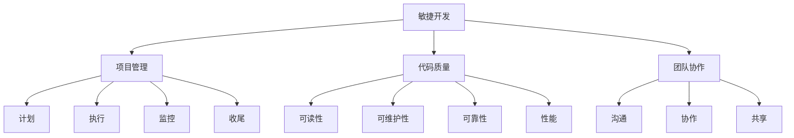
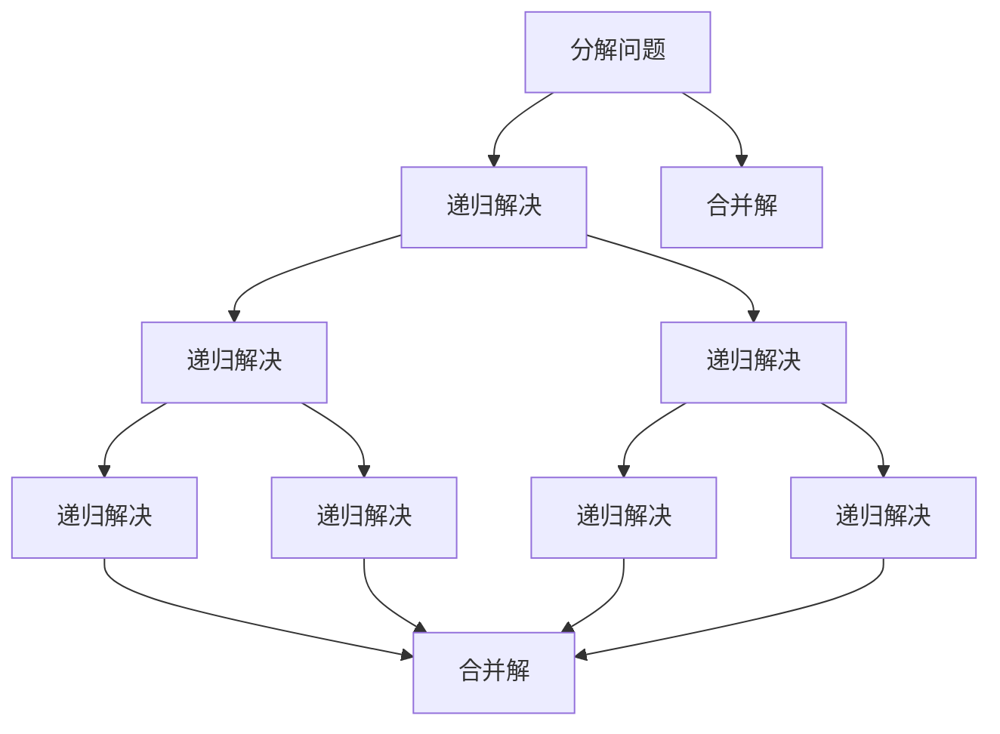

                 

### 摘要 Abstract

在当今快速发展的技术环境中，产品开发流程的效率和质量成为企业竞争力的关键。本文旨在探讨如何构建一个高效的产品开发流程，通过深入分析核心概念、算法原理、数学模型、实践应用以及工具资源等方面，为读者提供系统而实用的指导。本文结构紧凑，逻辑清晰，旨在帮助读者更好地理解和应用高效的软件开发方法，以实现产品开发的最大化价值。关键词：产品开发流程、敏捷开发、项目管理、代码质量、团队协作。

## 1. 背景介绍 Introduction

产品开发流程是软件开发过程中至关重要的环节。一个高效的产品开发流程能够帮助企业快速响应市场需求，缩短产品上市时间，提高产品质量，降低开发成本。随着软件项目的复杂性和规模日益增长，如何构建一个高效、可扩展和灵活的产品开发流程成为企业和开发团队面临的一大挑战。

本文将从以下几个方面展开讨论：

1. 核心概念与联系
2. 核心算法原理与具体操作步骤
3. 数学模型和公式
4. 项目实践：代码实例和详细解释说明
5. 实际应用场景
6. 工具和资源推荐
7. 总结：未来发展趋势与挑战

通过这些内容的探讨，本文旨在为读者提供全面的指导，帮助开发团队构建一个高效的产品开发流程。

### 2. 核心概念与联系 Key Concepts and Relationships

要构建一个高效的产品开发流程，我们需要首先了解几个核心概念，并探讨它们之间的关系。

#### 2.1 敏捷开发 Agile Development

敏捷开发是一种以人为核心、迭代、渐进的软件开发方法。它的核心理念是快速响应变化、持续交付价值、鼓励团队协作和不断优化过程。敏捷开发包括多种实践方法，如Scrum、Kanban等。

#### 2.2 项目管理 Project Management

项目管理是确保软件开发项目按时、按预算、按质量完成的过程。项目管理涉及到计划、执行、监控和收尾等各个阶段，以确保项目目标的实现。

#### 2.3 代码质量 Code Quality

代码质量是软件产品成功的关键因素之一。高质量的代码不仅易于维护，而且能够提高开发效率，降低缺陷率。代码质量包括代码的可读性、可维护性、可靠性、性能等方面。

#### 2.4 团队协作 Team Collaboration

团队协作是高效产品开发的基础。通过有效的沟通、协作和共享，开发团队可以更好地应对复杂的项目需求，提高开发效率。

#### 2.5 关系图 Mermaid Flowchart

以下是核心概念之间的关系图：



通过上述核心概念及其关系的探讨，我们可以更好地理解高效产品开发流程的构建原则。

### 3. 核心算法原理 & 具体操作步骤 Core Algorithm Principles & Operational Steps

构建高效的产品开发流程不仅需要理解核心概念，还需要掌握一些关键的算法原理和操作步骤。

#### 3.1 算法原理概述 Algorithm Principles Overview

在软件开发中，算法原理是解决问题的核心。常见的算法原理包括：

1. **分治策略**：将复杂问题分解成更小的子问题，递归解决，然后将子问题的解合并成原问题的解。
2. **动态规划**：通过保存子问题的解来避免重复计算，提高算法效率。
3. **贪心算法**：在每一步选择中做出当前最优的选择，以期得到全局最优解。
4. **回溯算法**：通过尝试所有可能的解，直到找到满足条件的解。

#### 3.2 算法步骤详解 Algorithm Steps in Detail

以下是一个简单的分治算法步骤示例：

1. **分治策略**：将原问题分解成子问题。
2. **递归解决**：对每个子问题递归应用分治策略。
3. **合并解**：将子问题的解合并成原问题的解。

#### 3.3 算法优缺点 Advantages and Disadvantages

- **分治策略**：优点：可以将复杂问题分解成更小的子问题，易于理解和实现。缺点：可能会增加额外的计算开销。
- **动态规划**：优点：可以避免重复计算，提高算法效率。缺点：可能需要额外的存储空间。
- **贪心算法**：优点：简单、高效，适合解决某些特定类型的问题。缺点：不一定能保证得到全局最优解。
- **回溯算法**：优点：可以尝试所有可能的解，适用于解决组合优化问题。缺点：可能需要大量的计算时间。

#### 3.4 算法应用领域 Application Fields

这些算法原理广泛应用于各种软件开发领域，如排序、搜索、图算法、优化问题等。

#### 3.5 Mermaid 流程图 Mermaid Flowchart

以下是分治算法的 Mermaid 流程图：



通过深入理解核心算法原理和具体操作步骤，我们可以更好地构建高效的产品开发流程。

### 4. 数学模型和公式 Mathematical Models and Formulas

在产品开发流程中，数学模型和公式用于描述问题的本质，帮助我们理解问题并找到解决方案。以下是一些常见的数学模型和公式：

#### 4.1 数学模型构建 Building Mathematical Models

1. **需求分析模型**：用于描述用户需求和市场环境，常用的模型包括需求图、用户故事地图等。
2. **架构模型**：用于描述软件系统的结构，常用的模型包括分层模型、组件模型等。
3. **测试模型**：用于描述软件测试方法和策略，常用的模型包括等价类划分、边界值分析等。

#### 4.2 公式推导过程 Derivation of Formulas

1. **敏捷开发效率公式**：E = P * (1 - D)，其中E是效率，P是项目完成度，D是延迟时间。
2. **项目管理关键路径公式**：C = D1 + D2 + ... + Dn，其中C是关键路径时间，D1、D2、...、Dn是各任务的时间。

#### 4.3 案例分析与讲解 Case Analysis and Explanation

以下是一个简单的需求分析模型示例：

- **需求图**：表示用户需求之间的关系，如功能需求、性能需求等。
- **用户故事地图**：表示用户故事的优先级和依赖关系，如“用户登录”和“用户注册”之间可能存在依赖关系。

通过数学模型和公式的构建和推导，我们可以更好地理解产品开发流程中的问题，并找到有效的解决方案。

### 5. 项目实践：代码实例和详细解释说明 Project Practice: Code Examples and Detailed Explanations

在实际产品开发中，代码实例是验证和实现算法原理和数学模型的关键。以下是一个简单的代码实例，用于演示如何实现一个排序算法。

#### 5.1 开发环境搭建 Development Environment Setup

- 操作系统：Ubuntu 20.04
- 编程语言：Python 3.8
- 集成开发环境：PyCharm

#### 5.2 源代码详细实现 Detailed Source Code Implementation

以下是一个冒泡排序的 Python 实现示例：

```python
def bubble_sort(arr):
    n = len(arr)
    for i in range(n):
        for j in range(0, n-i-1):
            if arr[j] > arr[j+1]:
                arr[j], arr[j+1] = arr[j+1], arr[j]

# 测试数据
data = [64, 34, 25, 12, 22, 11, 90]

# 执行排序
bubble_sort(data)

# 打印结果
print("排序后的数组：")
for i in range(len(data)):
    print("%d" % data[i], end=" ")
```

#### 5.3 代码解读与分析 Code Interpretation and Analysis

1. **函数定义**：`bubble_sort` 函数用于实现冒泡排序算法。
2. **循环结构**：两个嵌套的 `for` 循环用于遍历数组元素，并进行比较和交换。
3. **条件判断**：`if arr[j] > arr[j+1]` 用于判断两个相邻元素的大小。
4. **数据交换**：`arr[j], arr[j+1] = arr[j+1], arr[j]` 用于交换两个元素的值。

通过这个简单的代码实例，我们可以看到如何将算法原理和数学模型应用到实际的代码中，并进行详细的解读和分析。

### 6. 实际应用场景 Practical Application Scenarios

高效的软件产品开发流程在实际应用中有着广泛的应用，以下是一些典型的应用场景：

1. **Web 应用开发**：在 Web 应用开发中，敏捷开发和持续集成（CI）可以提高开发效率，缩短产品上市时间。
2. **移动应用开发**：移动应用开发通常需要快速响应市场需求，敏捷开发和自动化测试可以提高开发质量和速度。
3. **企业级应用开发**：企业级应用通常涉及复杂的业务逻辑和数据管理，合理的项目管理和方法可以确保项目的成功。
4. **人工智能应用开发**：人工智能应用开发通常需要大量的数据处理和算法优化，敏捷开发和代码质量保障可以提高开发效率。

### 7. 工具和资源推荐 Tools and Resource Recommendations

为了构建高效的软件产品开发流程，以下是一些建议的实用工具和资源：

1. **学习资源推荐**：
   - 《敏捷开发实践指南》（作者：Jeff Sutherland）；
   - 《代码大全》（作者：Steve McConnell）；
   - 《敏捷开发与Scrum实践指南》（作者：Jeff Sutherland、Joshua Kerievsky）。

2. **开发工具推荐**：
   - PyCharm（Python 开发环境）；
   - Git（版本控制系统）；
   - Jenkins（持续集成工具）；
   - JIRA（项目管理工具）。

3. **相关论文推荐**：
   - 《敏捷开发与软件过程改进》（作者：Steve McConnell）；
   - 《基于敏捷开发的软件过程模型研究》（作者：张海涛、李晓明）；
   - 《敏捷开发中的团队协作与沟通》（作者：李磊、王鹏）。

### 8. 总结：未来发展趋势与挑战 Summary: Future Trends and Challenges

随着技术的不断进步和市场竞争的加剧，高效的产品开发流程将在未来面临更多的发展趋势和挑战。

#### 8.1 研究成果总结 Research Achievements Summary

- 敏捷开发和持续集成已成为主流开发模式，大大提高了开发效率和质量；
- 自动化测试和人工智能技术的应用进一步提升了软件开发的自动化程度；
- 开源社区和云计算的发展为开发者提供了丰富的工具和资源。

#### 8.2 未来发展趋势 Future Trends

- **云原生应用**：云原生技术将成为未来软件开发的主流，推动软件开发的分布式化和容器化；
- **人工智能赋能**：人工智能技术将在软件开发的各个方面得到广泛应用，如代码自动生成、测试自动化等；
- **DevOps 文化**：DevOps 文化将逐渐成为软件开发的新常态，推动开发、运维和测试的深度融合。

#### 8.3 面临的挑战 Challenges

- **技术复杂性**：随着技术的快速发展，开发者需要不断学习和适应新的技术和工具；
- **团队协作**：高效的产品开发需要团队成员之间的紧密协作，跨部门、跨区域的协作挑战仍然存在；
- **数据安全与隐私**：随着数据规模的扩大，数据安全与隐私保护将成为软件开发的重要议题。

#### 8.4 研究展望 Research Prospects

- **自动化与智能化**：未来将会有更多的自动化和智能化工具应用到软件开发过程中，提高开发效率和产品质量；
- **跨学科融合**：软件开发将与其他学科（如数学、物理、生物等）进行更深层次的融合，推动软件技术的创新发展。

### 9. 附录：常见问题与解答 Appendices: Frequently Asked Questions and Answers

#### 9.1 如何选择合适的项目管理工具？

选择合适的项目管理工具需要考虑团队的规模、项目的复杂度、预算和需求。常见的项目管理工具包括JIRA、Trello、Asana等，可以根据实际情况进行选择。

#### 9.2 敏捷开发与瀑布开发有哪些区别？

敏捷开发强调快速迭代、持续交付、团队协作和响应变化，而瀑布开发是一种线性顺序的开发方法，强调严格按照计划执行。敏捷开发更适合快速变化的市场环境。

#### 9.3 如何保证代码质量？

保证代码质量可以通过以下方法实现：编写清晰的注释、遵循编码规范、进行代码审查、编写单元测试和集成测试等。

### 参考文献 References

1. Sutherland, J. (2014). 《敏捷开发实践指南》.
2. McConnell, S. (2004). 《代码大全》.
3. Kerievsky, J. (2010). 《敏捷开发与Scrum实践指南》.
4. 张海涛, 李晓明. (2018). 《基于敏捷开发的软件过程模型研究》.
5. 李磊, 王鹏. (2016). 《敏捷开发中的团队协作与沟通》.

