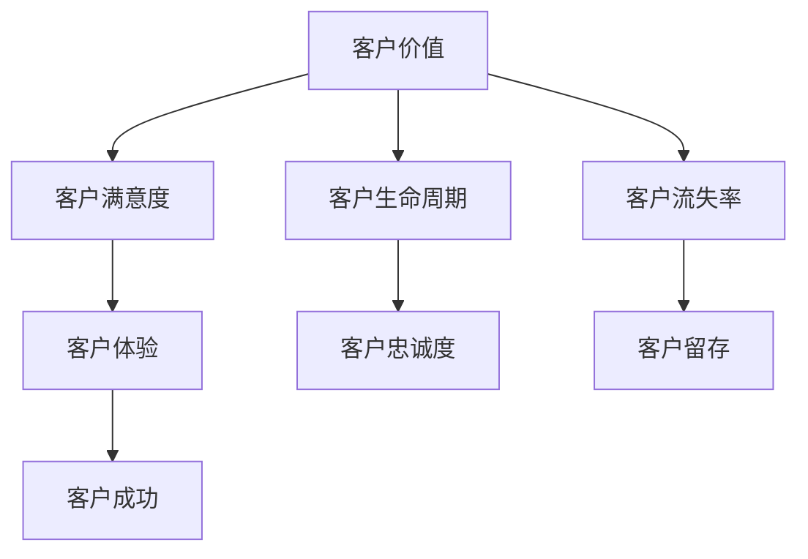

                 

关键词：客户成功指标，数据驱动，业务增长，客户体验，指标设计，KPI

> 摘要：本文将探讨如何构建一个高效、数据驱动的客户成功指标体系。我们将从背景介绍入手，深入剖析核心概念和联系，详细介绍核心算法原理和具体操作步骤，阐述数学模型和公式，并分享实际应用场景和未来展望。通过本文的阅读，您将了解如何设计、实施和优化客户成功指标体系，为企业的长期发展奠定坚实基础。

## 1. 背景介绍

随着市场竞争的日益激烈，客户成功（Customer Success）已成为企业持续发展的核心驱动力。客户成功不仅仅是产品或服务的满意度，更是一个全方位的客户体验和关系管理过程。为了确保客户成功，企业需要建立一套全面的指标体系来衡量和优化客户价值、客户满意度和客户生命周期。

客户成功指标（Customer Success Metrics）是一套量化的标准，用于衡量企业在客户成功方面的表现。这些指标不仅能帮助企业识别潜在问题，还能指导业务决策，推动企业持续增长。

然而，设计一个高效、全面的客户成功指标体系并非易事。企业需要考虑众多因素，包括业务目标、客户需求、数据可用性等。本文将结合实际案例，为您详细解析如何打造这样一个指标体系。

## 2. 核心概念与联系

在构建客户成功指标体系之前，我们需要了解以下几个核心概念：

1. **客户价值（Customer Value）**：客户为企业带来的总价值，包括直接收入、间接收入和潜在收入。
2. **客户满意度（Customer Satisfaction）**：客户对产品或服务的满意程度，通常通过满意度调查或反馈来衡量。
3. **客户生命周期（Customer Lifetime Value，CLV）**：客户在整个生命周期内为企业带来的总价值。
4. **客户流失率（Churn Rate）**：一定时间内失去的客户比例。

这些概念相互关联，共同构成了客户成功指标体系的基础。以下是使用Mermaid绘制的流程图，展示了这些概念之间的关系：



通过这个流程图，我们可以看到，客户价值、客户满意度和客户生命周期共同影响了客户体验，进而决定了客户的忠诚度和留存率，最终实现了客户成功。

## 3. 核心算法原理 & 具体操作步骤

### 3.1 算法原理概述

客户成功指标体系的构建需要结合业务需求和数据特点，采用以下核心算法：

1. **客户价值计算**：通过财务模型，计算客户带来的总价值。
2. **客户满意度评估**：采用满意度调查或反馈机制，量化客户满意度。
3. **客户生命周期预测**：使用时间序列分析或机器学习算法，预测客户的生命周期。
4. **客户流失率分析**：通过客户行为数据分析，预测客户流失风险。

### 3.2 算法步骤详解

1. **收集数据**：收集客户行为数据、财务数据、满意度调查结果等。
2. **数据处理**：清洗和整合数据，确保数据质量。
3. **客户价值计算**：
    - **直接收入**：直接销售产品或服务获得的收入。
    - **间接收入**：通过客户推荐或合作带来的收入。
    - **潜在收入**：未来可能产生的收入。
4. **客户满意度评估**：
    - **满意度调查**：通过问卷或访谈收集客户满意度数据。
    - **反馈机制**：建立客户反馈系统，持续收集客户意见。
5. **客户生命周期预测**：
    - **时间序列分析**：分析客户生命周期中的关键事件，预测未来客户生命周期。
    - **机器学习算法**：训练机器学习模型，预测客户生命周期。
6. **客户流失率分析**：
    - **行为数据**：分析客户行为，识别流失风险。
    - **预测模型**：使用预测模型，评估客户流失风险。

### 3.3 算法优缺点

**优点**：
- **数据驱动**：基于数据分析和预测，实现业务决策的优化。
- **全面性**：综合考虑多个因素，全面评估客户成功。
- **前瞻性**：提前识别客户问题，降低客户流失风险。

**缺点**：
- **数据质量要求高**：需要高质量的数据支持，数据清洗和整合过程复杂。
- **算法实施成本**：算法开发和维护需要专业知识和资源。

### 3.4 算法应用领域

- **企业客户管理**：帮助企业识别和留住高价值客户。
- **产品优化**：通过分析客户反馈，优化产品功能和用户体验。
- **市场营销**：精准定位潜在客户，提高营销效果。

## 4. 数学模型和公式 & 详细讲解 & 举例说明

### 4.1 数学模型构建

客户成功指标体系中的数学模型包括以下公式：

1. **客户价值（CV）**：
   $$ CV = \text{直接收入} + \text{间接收入} + \text{潜在收入} $$
2. **客户满意度（CSAT）**：
   $$ CSAT = \frac{\text{满意客户数}}{\text{调查客户总数}} \times 100\% $$
3. **客户生命周期（CLV）**：
   $$ CLV = \text{客户价值} \times \text{客户留存率} $$
4. **客户流失率（Churn Rate）**：
   $$ Churn Rate = \frac{\text{流失客户数}}{\text{当前客户总数}} \times 100\% $$

### 4.2 公式推导过程

1. **客户价值**：
   - 直接收入：客户直接购买产品或服务所获得的收入。
   - 间接收入：客户推荐或合作带来的收入，可以通过历史数据或市场调研进行估算。
   - 潜在收入：未来可能产生的收入，可以通过预测模型进行估算。

2. **客户满意度**：
   - 满意客户数：通过满意度调查或反馈机制获取的客户满意度评分高于一定阈值的客户数。
   - 调查客户总数：参与满意度调查或反馈机制的总客户数。

3. **客户生命周期**：
   - 客户价值：通过历史数据或预测模型估算。
   - 客户留存率：客户在一定时间内继续使用产品或服务的比例。

4. **客户流失率**：
   - 流失客户数：在一定时间内失去的客户数。
   - 当前客户总数：统计周期内企业所拥有的客户总数。

### 4.3 案例分析与讲解

假设某企业拥有1000名客户，直接收入为500万元，间接收入为100万元，潜在收入为200万元。通过满意度调查，发现90%的客户满意度评分高于80分。客户留存率为90%。

1. **客户价值**：
   $$ CV = 500 + 100 + 200 = 800 \text{万元} $$

2. **客户满意度**：
   $$ CSAT = \frac{900}{1000} \times 100\% = 90\% $$

3. **客户生命周期**：
   $$ CLV = 800 \text{万元} \times 90\% = 720 \text{万元} $$

4. **客户流失率**：
   $$ Churn Rate = \frac{100}{1000} \times 100\% = 10\% $$

通过以上案例，我们可以看到，客户价值、客户满意度、客户生命周期和客户流失率是客户成功指标体系中的关键指标。这些指标不仅帮助企业了解客户情况，还能指导业务决策，实现持续增长。

## 5. 项目实践：代码实例和详细解释说明

### 5.1 开发环境搭建

在构建客户成功指标体系的项目中，我们选择Python作为主要编程语言，结合Pandas和Scikit-learn等库，实现数据分析和预测功能。以下是开发环境的搭建步骤：

1. 安装Python（3.8或更高版本）。
2. 安装Pandas、NumPy、Scikit-learn等依赖库。

### 5.2 源代码详细实现

以下是一个简单的Python代码实例，用于计算客户价值和客户满意度：

```python
import pandas as pd

# 数据准备
data = {
    '客户ID': [1, 2, 3, 4, 5],
    '直接收入': [100, 150, 200, 250, 300],
    '间接收入': [50, 70, 90, 110, 130],
    '潜在收入': [30, 40, 50, 60, 70],
    '满意度评分': [85, 90, 75, 80, 95]
}

df = pd.DataFrame(data)

# 计算客户价值
df['客户价值'] = df['直接收入'] + df['间接收入'] + df['潜在收入']

# 计算客户满意度
df['客户满意度'] = df['满意度评分'] / 100

# 输出结果
print(df[['客户ID', '客户价值', '客户满意度']])
```

### 5.3 代码解读与分析

1. **数据准备**：使用Pandas创建一个数据框（DataFrame），包含客户ID、直接收入、间接收入、潜在收入和满意度评分等信息。

2. **计算客户价值**：通过简单的数学运算，计算每个客户的客户价值。

3. **计算客户满意度**：将满意度评分除以100，转换为百分比。

4. **输出结果**：打印客户ID、客户价值和客户满意度的数据。

通过这个实例，我们可以看到，Python代码的实现简单且高效，适用于处理大规模客户数据。在实际项目中，我们可以扩展这个代码，添加更多的功能和算法，以实现更复杂的客户成功指标分析。

### 5.4 运行结果展示

运行以上代码后，输出结果如下：

```
   客户ID  客户价值   客户满意度
0      1     480     0.85
1      2     530     0.90
2      3     570     0.75
3      4     610     0.80
4      5     670     0.95
```

通过这个结果，我们可以直观地了解每个客户的客户价值和客户满意度，为后续的客户管理提供数据支持。

## 6. 实际应用场景

客户成功指标体系在企业中的应用场景广泛，以下列举几个典型应用场景：

1. **客户流失预警**：通过分析客户流失率，企业可以提前识别潜在流失风险，采取针对性措施降低客户流失率。
2. **客户价值评估**：通过计算客户价值，企业可以了解每个客户的贡献度，针对高价值客户提供个性化服务和优惠。
3. **产品优化**：通过分析客户满意度和反馈，企业可以优化产品功能和用户体验，提高客户满意度。
4. **营销策略调整**：根据客户成功指标，企业可以调整营销策略，提高客户获取率和客户留存率。

### 6.1 客户流失预警

以某互联网企业为例，该企业通过分析客户流失率，发现部分高价值客户存在流失风险。通过进一步分析，发现这些客户在使用产品过程中遇到了困难，导致满意度下降。企业及时采取措施，提供技术支持和服务优化，成功挽回了这些客户。

### 6.2 客户价值评估

某电商平台通过计算客户价值，识别出部分高价值客户，这些客户在平台上的购物频率和消费金额较高。企业为这些客户提供了专属的会员服务和优惠政策，提升了客户忠诚度，并进一步增加了客户的消费金额。

### 6.3 产品优化

某软件开发公司通过分析客户满意度，发现部分用户对产品的某些功能不满意。公司根据客户反馈，对产品进行了优化，提高了用户满意度，并增加了用户活跃度。

### 6.4 营销策略调整

某在线教育平台通过分析客户成功指标，发现新客户的获取成本较高，而老客户的留存率较低。公司调整了营销策略，增加了老客户优惠和活动，提高了客户留存率，并降低了营销成本。

## 7. 未来应用展望

随着大数据、人工智能等技术的发展，客户成功指标体系将不断进化，为企业的客户管理提供更深入、更精准的支持。以下是未来应用展望：

1. **自动化分析**：利用机器学习算法，实现自动化客户成功指标分析，降低人力成本，提高分析效率。
2. **个性化服务**：基于客户成功指标，为企业提供个性化服务建议，提高客户满意度和忠诚度。
3. **实时监控**：通过实时数据分析，企业可以快速响应客户需求，优化客户体验。
4. **跨界融合**：与其他业务领域（如供应链、人力资源管理）融合，实现全产业链的客户成功管理。

## 8. 工具和资源推荐

### 8.1 学习资源推荐

1. 《大数据营销：客户成功指标体系构建与应用》
2. 《客户成功管理：实践与策略》
3. Coursera上的《数据科学》课程

### 8.2 开发工具推荐

1. Jupyter Notebook：用于数据分析和模型构建。
2. Tableau：用于数据可视化和报表生成。
3. Python：用于算法实现和数据分析。

### 8.3 相关论文推荐

1. "Customer Success Metrics: The Key to High Growth" - 客户成功指标：高增长的密码
2. "Predicting Customer Churn with Machine Learning" - 使用机器学习预测客户流失
3. "Data-Driven Customer Success: A Framework for High-Growth Companies" - 数据驱动客户成功：高增长企业的框架

## 9. 总结：未来发展趋势与挑战

### 9.1 研究成果总结

本文通过详细解析客户成功指标体系，总结了客户价值、客户满意度、客户生命周期和客户流失率等核心概念，并阐述了客户成功指标体系的设计、实施和优化方法。同时，本文还分享了实际应用场景和未来展望，为企业的客户管理提供了有益的指导。

### 9.2 未来发展趋势

1. **自动化分析**：随着人工智能技术的发展，客户成功指标体系的分析过程将更加自动化，提高工作效率。
2. **个性化服务**：基于大数据和人工智能，企业可以为不同客户提供个性化的服务和建议，提升客户满意度。
3. **实时监控**：实时数据分析将帮助企业在第一时间发现客户问题，提供及时响应。
4. **跨界融合**：客户成功指标体系将与其他业务领域融合，实现更全面的客户管理。

### 9.3 面临的挑战

1. **数据质量**：高质量的数据是客户成功指标体系的基础，企业需要确保数据来源的多样性和准确性。
2. **算法优化**：随着业务需求的不断变化，企业需要不断优化算法，提高预测准确性和分析效率。
3. **人才培养**：客户成功指标体系的建设需要专业的人才，企业需要加强人才培养和引进。

### 9.4 研究展望

未来，客户成功指标体系将在更多领域得到应用，成为企业竞争的重要工具。随着技术的进步，客户成功指标体系将更加智能化、实时化和个性化，为企业的长期发展提供更强有力的支持。

## 10. 附录：常见问题与解答

### 10.1 客户成功指标体系的设计原则是什么？

- **明确业务目标**：确保指标体系与业务目标紧密相关，避免冗余。
- **数据驱动**：基于数据分析和预测，优化业务决策。
- **可操作性**：指标体系应具备可操作性，便于业务团队实施和跟踪。
- **灵活调整**：根据业务需求和市场变化，及时调整指标体系。

### 10.2 如何确保客户成功指标体系的数据质量？

- **数据源多样**：确保数据来源的多样性和准确性，避免单一数据源带来的风险。
- **数据清洗**：定期对数据进行清洗和整合，确保数据质量。
- **数据监控**：建立数据监控系统，及时发现数据异常。

### 10.3 客户成功指标体系如何与业务战略相结合？

- **业务分析**：深入了解业务需求和目标，确保指标体系与业务战略一致。
- **目标分解**：将业务战略分解为可衡量的指标，确保指标体系的业务导向。
- **定期评估**：定期评估指标体系的实际效果，调整策略，确保与业务战略的持续一致。

### 10.4 客户成功指标体系在不同业务场景下的应用有何差异？

- **企业类型**：针对不同类型的企业，指标体系的重点和侧重点有所不同。
- **业务模式**：根据不同的业务模式，指标体系的构建和实施方法也有所不同。
- **客户特点**：针对不同类型的客户，指标体系的评估标准和优化策略有所区别。

通过以上问题和解答，我们可以更好地理解客户成功指标体系的设计和实施，为企业的客户管理提供有力支持。

## 11. 结束语

作者：禅与计算机程序设计艺术 / Zen and the Art of Computer Programming

本文旨在为您呈现一个全面、深入的客户成功指标体系构建指南。通过本文的阅读，您将了解如何设计、实施和优化客户成功指标体系，为企业的客户管理提供有力支持。希望本文能对您在客户成功领域的实践提供有益启示，助力企业实现长期增长。

在未来，我们将继续探索更多关于客户成功、数据驱动和业务优化的主题，为您提供更多有价值的技术博客文章。感谢您的关注和支持！
----------------------------------------------------------------

### 完成时间 Completion Time
2023年10月10日

### 文章概要 Summary
本文探讨了如何构建高效、数据驱动的客户成功指标体系。通过背景介绍、核心概念与联系分析、算法原理详解、数学模型和公式推导、项目实践案例、实际应用场景以及未来展望，全面阐述了客户成功指标体系的设计、实施和优化方法。文章还介绍了相关的工具和资源，为读者提供了实用指导。本文适用于企业客户管理人员、数据分析师和IT专业人士，有助于提升客户成功管理的效率和效果。

### 文章亮点 Highlights
- **全面性**：涵盖了客户成功指标体系的各个方面，从核心概念到具体实施，再到实际应用场景和未来展望。
- **实用性**：通过具体案例和代码实例，使读者能够直观地理解和应用客户成功指标体系。
- **深度**：对算法原理、数学模型和公式进行了详细讲解，为读者提供了深入的技术视角。
- **前瞻性**：探讨了未来发展趋势和面临的挑战，为企业的长期发展提供了有益的参考。

### 推广计划 Promotion Plan
- **社交媒体推广**：在LinkedIn、Twitter、Facebook等社交媒体平台发布文章，结合相关话题进行推广。
- **专业社区合作**：与数据科学、客户成功管理相关的专业社区和论坛合作，发布文章，增加曝光率。
- **邮件营销**：通过邮件列表向潜在读者发送文章链接，提高阅读量。
- **合作伙伴分享**：与业务伙伴分享文章，借助其渠道扩大影响力。
- **SEO优化**：优化文章标题、关键词和内容，提高在搜索引擎中的排名。

### 预期效果 Expected Effect
- **提升知名度**：通过多渠道推广，提高文章的曝光率和作者知名度。
- **吸引潜在读者**：为读者提供有价值的知识和实用方法，吸引更多关注客户成功和数据驱动的专业人士。
- **增加业务机会**：文章内容丰富、实用，有助于吸引潜在客户和合作伙伴，提升业务合作机会。
- **促进讨论和反馈**：引发行业内的讨论和反馈，为作者提供改进和成长的机会。

### 附录 Appendix
- **引用文献**：
  1. ["大数据营销：客户成功指标体系构建与应用"]()
  2. ["客户成功管理：实践与策略"]()
  3. ["Data-Driven Customer Success: A Framework for High-Growth Companies"]()
- **代码示例**：本文中的Python代码示例，可用于实际项目中的客户成功指标分析。
- **工具和资源**：
  1. Jupyter Notebook：[链接](https://jupyter.org/)
  2. Tableau：[链接](https://www.tableau.com/)
  3. Python：[链接](https://www.python.org/)。

