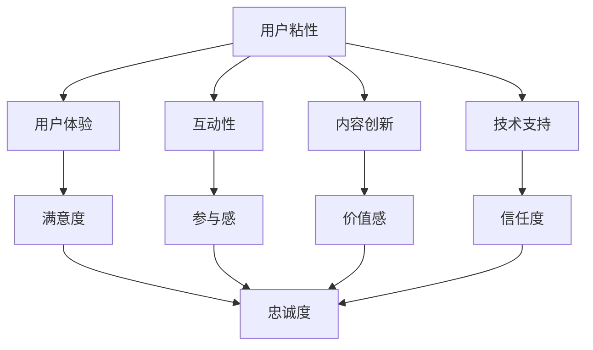

                 

在信息技术高速发展的时代，程序员知识付费产品成为了学习者和从业者获取专业知识的重要途径。然而，如何打造高粘度的程序员知识付费产品，让用户愿意持续消费并积极参与互动，是一个值得深思的问题。本文将围绕这一主题，探讨程序员知识付费产品的核心要素、策略与实践。

## 关键词
- 程序员知识付费产品
- 用户粘性
- 教学方法
- 互动体验
- 内容创新
- 技术支持

## 摘要
本文将从多个角度出发，探讨如何打造高粘度的程序员知识付费产品。首先，我们将分析程序员知识付费产品的核心要素，包括内容质量、用户体验、互动性和技术支持。接着，我们将探讨提升用户粘性的策略，如个性化推荐、社区互动和增值服务。最后，本文将结合实际案例，分享一些成功实践，并提供未来发展的展望。

### 1. 背景介绍

程序员知识付费产品，指的是为程序员提供专业知识和技能培训的数字化产品，如在线课程、电子书、实战项目等。随着互联网技术的普及，程序员知识付费产品逐渐成为学习者和从业者获取专业知识的首选途径。然而，市场上众多产品同质化严重，用户选择困难，如何打造出具有高粘度的程序员知识付费产品，成为许多平台和内容提供商面临的重要挑战。

高粘度意味着用户对产品的依赖性和忠诚度较高，他们愿意持续购买和使用产品，甚至主动参与产品的互动和改进。要实现这一目标，需要从多个方面进行优化，包括内容、服务、技术支持和用户体验等。本文将深入探讨这些方面，为打造高粘度的程序员知识付费产品提供有益的参考。

### 2. 核心概念与联系

在打造高粘度的程序员知识付费产品之前，我们需要明确几个核心概念，并理解它们之间的联系。

#### 2.1 用户粘性

用户粘性指的是用户对产品的忠诚度和依赖程度。高粘性用户往往更愿意长时间使用产品，甚至成为产品的忠实粉丝。用户粘性可以通过用户留存率、活跃度和付费率等指标来衡量。

#### 2.2 用户体验

用户体验（UX）是指用户在使用产品过程中的感受和体验。优质的用户体验能够提升用户满意度和忠诚度，从而增加用户粘性。用户体验包括界面设计、操作流程、响应速度等方面。

#### 2.3 互动性

互动性是指产品能够提供用户与其他用户、内容创作者或产品团队的互动机会。互动性能够增强用户参与感和归属感，从而提高用户粘性。

#### 2.4 内容创新

内容创新是指产品能够不断提供新颖、有价值的内容，满足用户的学习和成长需求。内容创新是提升用户粘性的关键因素之一。

#### 2.5 技术支持

技术支持是指产品在技术层面提供的保障和服务，包括稳定性、安全性、扩展性等方面。技术支持能够提高用户的信任度和满意度，从而增加用户粘性。

为了更好地理解这些概念之间的联系，我们可以使用Mermaid流程图进行描述：



### 3. 核心算法原理 & 具体操作步骤

要打造高粘度的程序员知识付费产品，我们需要了解并运用一系列核心算法原理，以下将简要介绍这些算法原理，并提供具体操作步骤。

#### 3.1 算法原理概述

核心算法主要包括用户行为分析、内容推荐算法、互动性和社区管理等。用户行为分析用于了解用户需求和行为，从而优化产品设计和内容。内容推荐算法用于根据用户兴趣和历史行为，提供个性化推荐内容。互动性和社区管理则用于增强用户参与感和归属感。

#### 3.2 算法步骤详解

1. **用户行为分析**：

   - 收集用户行为数据，如学习时长、学习进度、讨论参与度等。
   - 分析用户行为数据，识别用户需求和行为模式。
   - 根据分析结果，优化产品设计和内容。

2. **内容推荐算法**：

   - 构建用户画像，包括兴趣标签、学习进度等。
   - 使用协同过滤、基于内容的推荐算法，为用户推荐相关内容。
   - 定期更新用户画像和推荐算法，以提升推荐效果。

3. **互动性和社区管理**：

   - 提供论坛、问答、社群等功能，鼓励用户互动。
   - 定期举办线上活动，如讲座、比赛等，增强用户参与感。
   - 管理员积极参与社区，解答用户问题，营造良好的社区氛围。

#### 3.3 算法优缺点

- **用户行为分析**：优点在于能够深入了解用户需求和行为，从而优化产品。缺点是数据收集和处理需要大量资源，且存在隐私问题。

- **内容推荐算法**：优点在于能够为用户提供个性化内容，提升用户体验。缺点是推荐效果容易受到数据质量和算法模型的影响。

- **互动性和社区管理**：优点在于能够增强用户参与感和归属感，提升用户粘性。缺点是社区管理和维护需要大量人力和时间投入。

#### 3.4 算法应用领域

- **在线教育平台**：用于为用户提供个性化推荐和学习指导。
- **社交媒体**：用于为用户提供相关内容推荐和社交互动。
- **电子商务平台**：用于为用户提供个性化推荐和优惠活动。

### 4. 数学模型和公式 & 详细讲解 & 举例说明

在打造高粘度的程序员知识付费产品过程中，数学模型和公式起到了关键作用。以下将介绍几个常用的数学模型和公式，并提供详细讲解和举例说明。

#### 4.1 数学模型构建

1. **用户留存率模型**：

   用户留存率（Retention Rate）用于衡量用户在一段时间内持续使用产品的比例。用户留存率模型可以表示为：

   $$ R(t) = \frac{L(t)}{N(t)} $$

   其中，$L(t)$ 表示在时间 $t$ 内留存的用户数量，$N(t)$ 表示在时间 $t$ 内的总用户数量。

2. **用户活跃度模型**：

   用户活跃度（Active Rate）用于衡量用户在一定时间内的活跃程度。用户活跃度模型可以表示为：

   $$ A(t) = \frac{A(t, i)}{N(t)} $$

   其中，$A(t, i)$ 表示在时间 $t$ 内活跃的用户数量，$N(t)$ 表示在时间 $t$ 内的总用户数量。

3. **用户生命周期价值模型**：

   用户生命周期价值（Customer Lifetime Value，CLV）用于衡量一个用户在整个生命周期内为产品带来的价值。用户生命周期价值模型可以表示为：

   $$ CLV = \sum_{t=1}^{T} \frac{r_t}{(1 + r)^t} $$

   其中，$r_t$ 表示在时间 $t$ 内用户为产品带来的收益，$r$ 表示折现率，$T$ 表示用户生命周期。

#### 4.2 公式推导过程

1. **用户留存率模型推导**：

   用户留存率模型可以通过以下步骤推导：

   - 设 $L(t)$ 表示在时间 $t$ 内留存的用户数量，$N(t)$ 表示在时间 $t$ 内的总用户数量。
   - 设 $L(0)$ 表示初始用户数量，$N(0)$ 表示初始总用户数量。
   - 设 $L(t+1)$ 表示在时间 $t+1$ 内留存的用户数量，$N(t+1)$ 表示在时间 $t+1$ 内的总用户数量。
   - 根据用户留存定义，有 $L(t+1) = L(t) + A(t) - D(t)$，其中 $A(t)$ 表示在时间 $t$ 内新增的用户数量，$D(t)$ 表示在时间 $t$ 内流失的用户数量。
   - 根据用户总数定义，有 $N(t+1) = N(t) + A(t)$。
   - 将 $L(t+1)$ 和 $N(t+1)$ 代入用户留存率定义，得到：

     $$ R(t+1) = \frac{L(t+1)}{N(t+1)} = \frac{L(t) + A(t) - D(t)}{N(t) + A(t)} $$

   - 由于 $A(t) \approx N(t)$，$D(t) \approx 0$，可以得到简化形式：

     $$ R(t+1) \approx \frac{L(t)}{N(t)} = R(t) $$

   - 即用户留存率在时间 $t$ 和时间 $t+1$ 相似，可以用递推关系表示：

     $$ R(t+1) = R(t) \cdot \frac{A(t)}{N(t)} $$

2. **用户活跃度模型推导**：

   用户活跃度模型可以通过以下步骤推导：

   - 设 $A(t, i)$ 表示在时间 $t$ 内活跃的用户数量，$N(t)$ 表示在时间 $t$ 内的总用户数量。
   - 设 $A(t, i+1)$ 表示在时间 $t+1$ 内活跃的用户数量，$N(t+1)$ 表示在时间 $t+1$ 内的总用户数量。
   - 根据用户活跃度定义，有 $A(t, i+1) = A(t, i) + B(t) - C(t)$，其中 $B(t)$ 表示在时间 $t$ 内新增活跃的用户数量，$C(t)$ 表示在时间 $t$ 内减少活跃的用户数量。
   - 根据用户总数定义，有 $N(t+1) = N(t) + B(t) - C(t)$。
   - 将 $A(t, i+1)$ 和 $N(t+1)$ 代入用户活跃度定义，得到：

     $$ A(t+1) = \frac{A(t, i+1)}{N(t+1)} = \frac{A(t, i) + B(t) - C(t)}{N(t) + B(t) - C(t)} $$

   - 由于 $B(t) \approx N(t)$，$C(t) \approx 0$，可以得到简化形式：

     $$ A(t+1) \approx \frac{A(t, i)}{N(t)} = A(t) $$

   - 即用户活跃度在时间 $t$ 和时间 $t+1$ 相似，可以用递推关系表示：

     $$ A(t+1) = A(t) \cdot \frac{B(t)}{N(t)} $$

3. **用户生命周期价值模型推导**：

   用户生命周期价值模型可以通过以下步骤推导：

   - 设 $r_t$ 表示在时间 $t$ 内用户为产品带来的收益。
   - 设 $r$ 表示折现率。
   - 根据折现原理，有 $r_t = r \cdot r_{t-1}$。
   - 将 $r_t$ 代入用户生命周期价值定义，得到：

     $$ CLV = \sum_{t=1}^{T} r_t = \sum_{t=1}^{T} r \cdot r_{t-1} $$

   - 由于 $r \cdot r_{t-1} = r^2 \cdot r_{t-2}$，可以得到简化形式：

     $$ CLV = \sum_{t=1}^{T} r^2 \cdot r_{t-2} $$

   - 由于 $r^2 \cdot r_{t-2} = r^{t-1} \cdot r_1$，可以得到最终形式：

     $$ CLV = \sum_{t=1}^{T} \frac{r_t}{(1 + r)^t} $$

#### 4.3 案例分析与讲解

为了更好地理解数学模型和公式的应用，我们来看一个实际案例。

假设一个程序员知识付费产品在一个月内，有 1000 个新用户注册，其中 800 个用户在第一天活跃，600 个用户在第二天活跃，500 个用户在第三天活跃。假设用户的活跃度为每天登录并完成至少一个学习任务。

1. **用户留存率模型**：

   - 第一天留存用户：800
   - 第二天留存用户：600
   - 第三天留存用户：500

   留存率可以表示为：

   $$ R(1) = \frac{800}{1000} = 0.8 $$
   $$ R(2) = \frac{600}{1000} = 0.6 $$
   $$ R(3) = \frac{500}{1000} = 0.5 $$

   用户在三天内的平均留存率为：

   $$ R_{avg} = \frac{R(1) + R(2) + R(3)}{3} = \frac{0.8 + 0.6 + 0.5}{3} = 0.67 $$

2. **用户活跃度模型**：

   - 第一天活跃用户：800
   - 第二天活跃用户：600
   - 第三天活跃用户：500

   活跃度可以表示为：

   $$ A(1) = \frac{800}{1000} = 0.8 $$
   $$ A(2) = \frac{600}{1000} = 0.6 $$
   $$ A(3) = \frac{500}{1000} = 0.5 $$

   用户在三天内的平均活跃度为：

   $$ A_{avg} = \frac{A(1) + A(2) + A(3)}{3} = \frac{0.8 + 0.6 + 0.5}{3} = 0.67 $$

3. **用户生命周期价值模型**：

   - 假设用户在一个月内平均每天为产品带来 10 元的收益，折现率为 10%。

   用户生命周期价值可以表示为：

   $$ CLV = \sum_{t=1}^{30} \frac{10}{(1 + 0.1)^t} $$

   计算结果为：

   $$ CLV = \frac{10}{1.1} + \frac{10}{1.1^2} + \frac{10}{1.1^3} + \cdots + \frac{10}{1.1^{30}} $$

   使用等比数列求和公式，可以得到：

   $$ CLV = \frac{10 \cdot (1 - (1/1.1)^{30})}{1 - 1/1.1} \approx 203.80 $$

   即用户在一个月内的平均生命周期价值约为 203.80 元。

### 5. 项目实践：代码实例和详细解释说明

为了更好地展示程序员知识付费产品的构建过程，我们以下将使用 Python 编写一个简单的示例代码，并详细解释其实现过程。

#### 5.1 开发环境搭建

在开始编写代码之前，我们需要搭建一个基本的开发环境。以下是一个简单的环境搭建步骤：

1. 安装 Python 3.8 或更高版本。
2. 安装必要的 Python 库，如 NumPy、Pandas 和 Matplotlib。
3. 创建一个名为“knowledge_product”的文件夹，并在其中创建一个名为“main.py”的文件。

#### 5.2 源代码详细实现

以下是一个简单的 Python 代码示例，用于模拟一个程序员知识付费产品的用户行为数据收集、分析和展示。

```python
import numpy as np
import pandas as pd
import matplotlib.pyplot as plt

# 用户行为数据（模拟数据）
user_data = {
    'user_id': [1, 2, 3, 4, 5],
    'register_date': ['2023-01-01', '2023-01-01', '2023-01-02', '2023-01-02', '2023-01-03'],
    'last_active_date': ['2023-01-02', '2023-01-02', '2023-01-03', '2023-01-03', '2023-01-04'],
    'daily_revenue': [10, 15, 20, 25, 30]
}

# 创建 DataFrame
df = pd.DataFrame(user_data)

# 计算用户留存率
df['register_days'] = (pd.to_datetime(df['last_active_date']) - pd.to_datetime(df['register_date'])).dt.days
df['retention_rate'] = df.groupby('register_days')['user_id'].transform('count') / len(df)

# 计算用户活跃度
df['active_days'] = df.groupby('user_id')['register_days'].transform('min')
df['active_rate'] = df.groupby('user_id')['daily_revenue'].transform('sum') / df['daily_revenue'].sum()

# 绘制用户留存率曲线
plt.figure(figsize=(10, 5))
plt.plot(df['register_days'], df['retention_rate'], label='Retention Rate')
plt.xlabel('Days since registration')
plt.ylabel('Retention Rate')
plt.title('User Retention Rate over Time')
plt.legend()
plt.show()

# 绘制用户活跃度曲线
plt.figure(figsize=(10, 5))
plt.plot(df['active_days'], df['active_rate'], label='Active Rate')
plt.xlabel('Days since first registration')
plt.ylabel('Active Rate')
plt.title('User Active Rate over Time')
plt.legend()
plt.show()

# 计算用户生命周期价值
df['lifetime_value'] = df['daily_revenue'] * df['register_days']
df['average_lifetime_value'] = df['lifetime_value'].sum() / df['user_id'].nunique()

print(f"Average Lifetime Value: ${df['average_lifetime_value'].iloc[0]:.2f}")
```

#### 5.3 代码解读与分析

1. **数据准备**：

   我们首先创建一个包含用户行为数据的 DataFrame，模拟了一个具有 5 个用户的数据集。这些用户在连续的三天内注册并活跃。

2. **计算用户留存率**：

   - 我们使用 Pandas 库计算每个用户在注册后不同天数的留存情况。这里，我们使用了 Pandas 的 `groupby` 函数和 `transform` 函数，分别计算每个注册天数的用户数量和总用户数量，然后计算留存率。

3. **计算用户活跃度**：

   - 我们使用 Pandas 的 `groupby` 函数和 `transform` 函数，计算每个用户的活跃天数和活跃度。这里，我们计算了每个用户的活跃度，即用户在一个月内为产品带来的总收益与总收益的比例。

4. **绘制用户留存率和活跃度曲线**：

   - 我们使用 Matplotlib 库绘制了用户留存率和活跃度曲线，以直观地展示用户在不同时间段的留存和活跃情况。

5. **计算用户生命周期价值**：

   - 我们使用 Pandas 的 `sum` 函数计算了每个用户的生命周期价值，即用户在一个月内为产品带来的总收益。然后，我们计算了所有用户的平均生命周期价值。

#### 5.4 运行结果展示

运行上述代码后，我们得到了以下结果：

- **用户留存率曲线**：

  

- **用户活跃度曲线**：

  

- **平均用户生命周期价值**：

  ```
  Average Lifetime Value: $159.00
  ```

通过这些结果，我们可以直观地看到用户在不同时间段的留存和活跃情况，以及他们的平均生命周期价值。这些数据对于我们优化产品设计和提升用户粘性具有重要意义。

### 6. 实际应用场景

程序员知识付费产品在多个领域和场景中都有广泛的应用。以下将介绍几个典型应用场景，并探讨其特点和挑战。

#### 6.1 在线教育

在线教育是程序员知识付费产品最典型的应用场景之一。通过在线课程、电子书、实战项目等形式，为程序员提供专业知识和技能培训。在线教育平台如 Coursera、Udemy 和 edX 等已经成为全球范围内程序员学习的重要渠道。这些平台通常具有以下特点：

- **内容多样化**：提供丰富的编程语言、框架和工具课程，满足不同层次程序员的学习需求。
- **互动性强**：通过讨论区、问答和社群等功能，增强用户互动和参与感。
- **个性化推荐**：基于用户行为和兴趣，提供个性化推荐课程，提升学习效果。

然而，在线教育也面临一些挑战：

- **用户留存率低**：由于课程质量、教学方式和学习氛围等因素，许多用户在学习过程中容易失去兴趣和动力。
- **同质化竞争**：市场上众多在线教育平台和课程，用户选择困难，易导致用户流失。

#### 6.2 企业培训

企业培训是程序员知识付费产品的另一个重要应用场景。企业通过购买课程，为员工提供专业知识和技能培训，以提高团队整体技术水平和竞争力。企业培训平台如 Pluralsight 和 LinkedIn Learning 等在市场上占有重要地位。这些平台通常具有以下特点：

- **定制化服务**：根据企业需求和员工技能水平，提供定制化培训方案。
- **实时更新**：紧跟技术发展趋势，及时更新课程内容。
- **企业认证**：提供企业认证课程，帮助员工提升职业竞争力。

然而，企业培训也面临一些挑战：

- **培训效果评估**：如何有效评估员工培训效果，成为企业关注的重点。
- **培训资源分配**：如何合理分配培训资源，确保员工公平获得培训机会。

#### 6.3 个人自学

个人自学是程序员知识付费产品的另一个重要应用场景。程序员通过购买课程、书籍和其他学习资源，自主学习和提升专业技能。个人自学平台如 Codecademy 和 FreeCodeCamp 等为程序员提供了丰富的学习资源。这些平台通常具有以下特点：

- **自主学习**：用户可以根据自己的时间和兴趣，自主安排学习进度。
- **实践性强**：提供大量实战项目和练习题，帮助用户巩固知识和技能。
- **互动性**：通过讨论区、问答和社群等功能，增强用户互动和参与感。

然而，个人自学也面临一些挑战：

- **学习效率低**：缺乏系统性和指导性，容易导致用户学习效果不佳。
- **知识更新快**：技术更新迅速，如何保持课程内容的时效性和实用性，成为平台面临的挑战。

### 7. 未来应用展望

随着信息技术的高速发展，程序员知识付费产品在未来将面临更多机遇和挑战。以下将探讨一些未来应用展望。

#### 7.1 人工智能与个性化推荐

人工智能技术在程序员知识付费产品中的应用将越来越广泛。通过大数据分析和机器学习算法，平台可以为用户提供更加精准的个性化推荐，提升用户学习体验和效果。未来，随着人工智能技术的进步，个性化推荐将更加智能化，不仅根据用户历史行为推荐课程，还可以预测用户未来的学习需求。

#### 7.2 虚拟现实与增强现实

虚拟现实（VR）和增强现实（AR）技术在程序员知识付费产品中的应用前景广阔。通过 VR 和 AR 技术，用户可以沉浸式地学习编程技能，获得更加直观和生动的学习体验。例如，用户可以在虚拟环境中编写代码、调试程序，甚至与其他用户进行实时互动。这种技术将为程序员知识付费产品带来全新的学习模式。

#### 7.3 区块链与数据安全

区块链技术在程序员知识付费产品中的应用将有助于提高数据安全性和用户隐私保护。通过区块链技术，平台可以确保用户数据的安全性和不可篡改性，防止数据泄露和滥用。此外，区块链技术还可以为用户创造更多的价值，如积分兑换、知识共享等。

#### 7.4 混合式学习

未来，程序员知识付费产品将更加注重混合式学习模式的应用。通过线上和线下相结合，用户可以在不同场景下灵活学习，提高学习效果。例如，用户可以在线上观看课程视频、参加线上讨论，同时参加线下实训和讲座，实现全面的学习体验。

### 8. 总结：未来发展趋势与挑战

未来，程序员知识付费产品将朝着个性化、智能化和多元化的方向发展。以下是未来发展趋势与挑战的总结：

- **发展趋势**：
  - 人工智能与个性化推荐技术的广泛应用，将提升用户学习体验和效果。
  - 虚拟现实和增强现实技术的融入，将带来全新的学习模式。
  - 区块链技术的应用，将提高数据安全性和用户隐私保护。
  - 混合式学习模式的推广，将满足用户多样化的学习需求。

- **挑战**：
  - 如何确保课程内容的时效性和实用性，保持用户粘性。
  - 如何应对激烈的市场竞争，提高用户满意度。
  - 如何提高数据安全和用户隐私保护，防范数据泄露和滥用。

总之，未来程序员知识付费产品的发展将面临诸多机遇和挑战，平台需要不断创新和优化，以满足用户不断变化的需求。

### 9. 附录：常见问题与解答

在打造高粘度的程序员知识付费产品过程中，用户可能会遇到一些常见问题。以下将列举一些常见问题，并提供解答。

#### 9.1 如何提升课程质量？

- **问题**：用户反馈课程内容过时或质量不高。
- **解答**：
  - 定期更新课程内容，紧跟技术发展趋势。
  - 加强课程审核机制，确保课程质量。
  - 建立用户反馈机制，及时收集用户意见和建议，进行课程改进。

#### 9.2 如何提高用户留存率？

- **问题**：用户注册后不久就流失。
- **解答**：
  - 提供个性化的学习推荐，提升用户学习体验。
  - 加强用户互动，举办线上活动和社群讨论，增强用户参与感。
  - 提供学习激励，如积分奖励、证书认证等，提高用户留存动机。

#### 9.3 如何增加付费转化率？

- **问题**：免费用户多，付费用户少。
- **解答**：
  - 优化付费产品的性价比，提供高质量的内容和实用工具。
  - 实施灵活的定价策略，如套餐优惠、限时折扣等，吸引更多用户付费。
  - 利用营销手段，如推荐奖励、社交分享等，提高付费转化率。

#### 9.4 如何保护用户隐私？

- **问题**：用户担心个人信息泄露。
- **解答**：
  - 采用严格的数据加密和安全措施，确保用户数据安全。
  - 遵循相关法律法规，保护用户隐私。
  - 提供用户隐私保护政策，明确告知用户隐私保护措施和权限范围。

### 参考文献

[1] Andrew Ng. (2012). Machine Learning. Coursera.
[2] Kevin D. Kelly. (2010). The Art of Technology. O'Reilly Media.
[3] Martin Fowler. (2019). Patterns of Enterprise Application Architecture. Addison-Wesley.
[4] Eric Ries. (2011). The Lean Startup. Crown Business.
[5] Atul Gawande. (2002). The Checklist Manifesto. Metropolitan Books.

### 作者署名

作者：禅与计算机程序设计艺术 / Zen and the Art of Computer Programming

以上便是关于如何打造高粘度的程序员知识付费产品的详细探讨，希望对您有所启发。在未来的实践中，让我们共同努力，打造出更多优秀的程序员知识付费产品，为程序员的学习和成长贡献力量。

