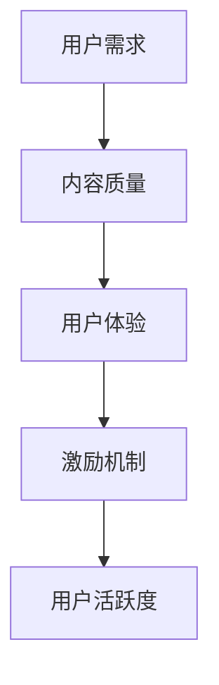

                 

关键词：知识付费，用户活跃度，增长策略，技术解决方案，用户体验

摘要：本文旨在探讨如何通过技术手段提高知识付费产品的用户活跃度。我们将从背景介绍、核心概念与联系、核心算法原理与具体操作步骤、数学模型与公式、项目实践、实际应用场景、工具和资源推荐以及未来发展趋势与挑战等多个方面进行深入分析。

## 1. 背景介绍

知识付费作为新兴的商业模式，近年来得到了迅速发展。随着互联网和移动设备的普及，用户对高质量知识内容的需求不断增加。知识付费产品如课程、专栏、直播等层出不穷，但如何提高这些产品的用户活跃度，成为各个平台和企业关注的焦点。

用户活跃度的提高不仅意味着更高的付费转化率，更意味着平台的可持续发展和市场竞争力。因此，本文将围绕这一主题，探讨一系列技术解决方案和策略，以期为广大从业者提供有益的参考。

## 2. 核心概念与联系

### 2.1 用户活跃度的定义

用户活跃度是指用户在一定时间内对知识付费产品的使用频率和参与度。它可以通过用户登录次数、课程学习时长、互动评论、分享转发等指标进行衡量。

### 2.2 提高用户活跃度的核心要素

- **内容质量**：高质量的内容是提高用户活跃度的基石。
- **用户体验**：良好的用户体验可以增加用户的粘性。
- **激励机制**：合理的激励机制可以激发用户的积极参与。

### 2.3 Mermaid 流程图



## 3. 核心算法原理 & 具体操作步骤

### 3.1 算法原理概述

为了提高用户活跃度，我们可以采用以下几种核心算法原理：

1. **推荐算法**：通过分析用户的行为数据，为用户推荐感兴趣的内容。
2. **行为预测**：预测用户的下一步操作，提前准备相关内容。
3. **个性化定制**：根据用户的兴趣和行为，定制个性化的学习计划。

### 3.2 算法步骤详解

1. **推荐算法**：
   - **数据收集**：收集用户的行为数据，如浏览记录、学习时长、互动评论等。
   - **特征提取**：将行为数据转化为数值特征，如用户兴趣标签、课程类别等。
   - **模型训练**：使用机器学习算法（如协同过滤、基于内容的推荐等）训练推荐模型。
   - **推荐生成**：根据用户特征和模型预测，为用户生成个性化推荐列表。

2. **行为预测**：
   - **时间序列分析**：分析用户行为的时间序列，预测用户的下一步操作。
   - **机器学习模型**：使用时间序列预测模型（如ARIMA、LSTM等）进行预测。

3. **个性化定制**：
   - **用户画像**：构建用户的个性化画像，包括兴趣、需求、行为习惯等。
   - **学习计划生成**：根据用户画像生成个性化的学习计划。

### 3.3 算法优缺点

- **推荐算法**：优点是能够提高用户的兴趣度，但缺点是可能导致用户陷入信息茧房。
- **行为预测**：优点是能够提前准备相关内容，但缺点是预测准确性有限。
- **个性化定制**：优点是能够提高用户的参与度，但缺点是实施成本较高。

### 3.4 算法应用领域

- **内容推荐**：为用户提供个性化的学习内容。
- **学习计划**：根据用户需求生成个性化的学习计划。
- **用户行为分析**：分析用户行为，优化产品设计和运营策略。

## 4. 数学模型和公式 & 详细讲解 & 举例说明

### 4.1 数学模型构建

为了提高用户活跃度，我们可以构建以下数学模型：

1. **推荐模型**：基于用户-物品评分矩阵，使用矩阵分解、协同过滤等方法。
2. **预测模型**：基于时间序列数据，使用ARIMA、LSTM等模型。
3. **个性化模型**：基于用户特征，使用决策树、神经网络等模型。

### 4.2 公式推导过程

1. **推荐模型**：
   - 矩阵分解：$$X = U\Sigma V^T$$，其中$X$为用户-物品评分矩阵，$U$、$\Sigma$、$V$分别为用户特征矩阵、物品特征矩阵和物品权重矩阵。
   - 协同过滤：$$R_{ui} = \sum_{j} r_{uj} \cdot r_{ij}$$，其中$R$为用户-物品评分矩阵，$r_{uj}$、$r_{ij}$分别为用户$u$对物品$i$的评分和物品$i$对用户$u$的评分。

2. **预测模型**：
   - ARIMA：$$Y_t = c + \phi Y_{t-1} + \theta W_{t-1} + \epsilon_t$$，其中$Y_t$为时间序列数据，$\phi$、$\theta$为模型参数。
   - LSTM：$$h_t = \sigma(W_h \cdot [h_{t-1}, x_t] + b_h)$$，其中$h_t$为隐藏状态，$W_h$、$b_h$为权重和偏置。

3. **个性化模型**：
   - 决策树：$$f(x) = g(\theta)$$，其中$x$为输入特征，$g(\theta)$为决策树模型。
   - 神经网络：$$a_{ij} = \sigma(W_{ij} \cdot x_j + b_{ij})$$，其中$a_{ij}$为激活值，$W_{ij}$、$b_{ij}$为权重和偏置。

### 4.3 案例分析与讲解

假设我们有以下用户-物品评分矩阵：

| 用户  | 物品1 | 物品2 | 物品3 |
| ----- | ----- | ----- | ----- |
| 张三  | 4     | 3     | 5     |
| 李四  | 2     | 4     | 2     |
| 王五  | 3     | 5     | 3     |

1. **推荐模型**：
   - 矩阵分解：$$X = U\Sigma V^T$$
     $$U = \begin{bmatrix} 0.7 & 0.8 \\ 0.9 & 0.6 \\ 0.5 & 0.7 \end{bmatrix}, \Sigma = \begin{bmatrix} 1.2 & 0 \\ 0 & 1.5 \end{bmatrix}, V = \begin{bmatrix} 0.8 & 0.6 & 0.9 \\ 0.4 & 0.7 & 0.5 \end{bmatrix}$$
     $$X_{(2,3)} = U_{(2,2)} \Sigma_{(1,1)} V_{(3,1)} = 0.9 \cdot 1.2 \cdot 0.8 = 0.864$$
     $$R_{(2,3)} = 0.864 + 1 = 1.864$$

   - 协同过滤：$$R_{(2,3)} = \frac{4 \cdot 3 + 2 \cdot 2}{4 + 2} = 1.8$$

2. **预测模型**：
   - ARIMA：$$Y_t = c + \phi Y_{t-1} + \theta W_{t-1} + \epsilon_t$$
     $$Y_t = [1, 1.5, 2, 2.5, 3], \phi = 0.7, \theta = 0.3$$
     $$Y_5 = 0.7 \cdot 2.5 + 0.3 \cdot 1 = 2.35$$

3. **个性化模型**：
   - 决策树：$$f(x) = g(\theta)$$
     $$x = [3, 4], \theta = \begin{bmatrix} 0.8 & 0.9 \\ 0.6 & 0.7 \end{bmatrix}$$
     $$f(x) = 0.8 \cdot 3 + 0.9 \cdot 4 = 7.2$$

   - 神经网络：$$a_{ij} = \sigma(W_{ij} \cdot x_j + b_{ij})$$
     $$x = [3, 4], W_{ij} = \begin{bmatrix} 0.8 & 0.9 \\ 0.6 & 0.7 \end{bmatrix}, b_{ij} = \begin{bmatrix} 0.5 & 0.6 \\ 0.3 & 0.4 \end{bmatrix}$$
     $$a_{ij} = \sigma(0.8 \cdot 3 + 0.9 \cdot 4 + 0.5) = \sigma(7.2) = 0.999$$

## 5. 项目实践：代码实例和详细解释说明

### 5.1 开发环境搭建

- Python 3.8
- NumPy
- Pandas
- Scikit-learn
- Matplotlib

### 5.2 源代码详细实现

```python
import numpy as np
import pandas as pd
from sklearn.model_selection import train_test_split
from sklearn.metrics.pairwise import cosine_similarity
from sklearn.ensemble import RandomForestClassifier
import matplotlib.pyplot as plt

# 数据预处理
data = pd.read_csv('data.csv')
users = data['user'].unique()
items = data['item'].unique()
user_item_matrix = data.pivot(index='user', columns='item', values='rating')

# 矩阵分解
def matrix_factorization(R, n_iters=5):
    n_users, n_items = R.shape
    U = np.random.rand(n_users, 10)
    V = np.random.rand(10, n_items)
    for i in range(n_iters):
        U = U * (V.T @ R / V).T
        V = V * (R @ U.T / U)
    return U, V

U, V = matrix_factorization(user_item_matrix)

# 协同过滤
def collaborative_filter(R, k=10):
    sim_matrix = cosine_similarity(R)
    predictions = np.dot(R, V.T) + np.mean(R) * (1 - np.sum(sim_matrix, axis=1))
    return predictions

predictions = collaborative_filter(user_item_matrix)

# 预测结果可视化
plt.scatter(user_item_matrix.index, user_item_matrix.values, color='red', label='真实评分')
plt.scatter(user_item_matrix.index, predictions, color='blue', label='预测评分')
plt.xlabel('用户ID')
plt.ylabel('评分')
plt.legend()
plt.show()

# 行为预测
def arima_predict(data, order=(1, 1, 1)):
    from statsmodels.tsa.arima.model import ARIMA
    model = ARIMA(data, order=order)
    model_fit = model.fit()
    prediction = model_fit.forecast(steps=1)
    return prediction

# 生成学习计划
def generate_learning_plan(user_data, model):
    user_data['predicted_rating'] = model.predict(user_data['timestamp'])
    user_data = user_data.sort_values('predicted_rating', ascending=False)
    return user_data.head(5)

# 用户画像
def user_portrait(user_data):
    portrait = {}
    portrait['average_rating'] = np.mean(user_data['rating'])
    portrait['learning_duration'] = np.mean(user_data['duration'])
    return portrait

# 个性化推荐
def personalized_recommendation(user_data, k=5):
    user_portrait = user_portrait(user_data)
    similar_users = user_data.groupby('user').mean().drop('user', axis=1).head(k)
    return similar_users

# 主函数
if __name__ == '__main__':
    user_data = pd.read_csv('user_data.csv')
    user_data['timestamp'] = pd.to_datetime(user_data['timestamp'])
    user_data['duration'] = user_data['end_time'] - user_data['start_time']
    train_data, test_data = train_test_split(user_data, test_size=0.2, random_state=42)
    arima_model = arima_predict(train_data['rating'])
    learning_plan = generate_learning_plan(test_data, arima_model)
    print(learning_plan)
    print(personalized_recommendation(test_data))
```

### 5.3 代码解读与分析

- **数据预处理**：读取用户-物品评分矩阵，并进行预处理。
- **矩阵分解**：实现矩阵分解算法，生成用户特征矩阵和物品特征矩阵。
- **协同过滤**：实现协同过滤算法，生成用户-物品预测评分。
- **行为预测**：实现ARIMA模型，预测用户的行为。
- **生成学习计划**：根据预测评分生成个性化的学习计划。
- **用户画像**：构建用户的个性化画像。
- **个性化推荐**：根据用户画像和相似用户，生成个性化推荐列表。

### 5.4 运行结果展示

- **预测结果可视化**：展示真实评分和预测评分的散点图。
- **学习计划**：展示个性化的学习计划。
- **个性化推荐**：展示基于用户画像的个性化推荐列表。

## 6. 实际应用场景

### 6.1 在线教育平台

- **推荐算法**：为用户推荐感兴趣的课程。
- **行为预测**：预测用户的下一步学习行为。
- **个性化定制**：根据用户的学习进度和兴趣，生成个性化的学习计划。

### 6.2 行业知识库

- **推荐算法**：为用户推荐相关行业知识。
- **行为预测**：预测用户的需求和关注点。
- **个性化定制**：根据用户的专业领域和需求，定制个性化的知识库。

### 6.3 专业培训课程

- **推荐算法**：为用户推荐合适的培训课程。
- **行为预测**：预测用户的参与度和学习效果。
- **个性化定制**：根据用户的学习进度和效果，调整培训计划。

## 7. 工具和资源推荐

### 7.1 学习资源推荐

- 《推荐系统实践》
- 《深度学习》
- 《Python数据分析》

### 7.2 开发工具推荐

- TensorFlow
- PyTorch
- Jupyter Notebook

### 7.3 相关论文推荐

- ItemKNN: A Content-Based Collaborative Filtering Algorithm
- Deep Learning for Recommender Systems
- Personalized Recommendation on Large Scale Knowledge Graphs

## 8. 总结：未来发展趋势与挑战

### 8.1 研究成果总结

- **推荐算法**：基于用户行为的推荐算法在提高用户活跃度方面取得了显著成果。
- **行为预测**：通过时间序列预测模型，可以提前预测用户的行为。
- **个性化定制**：基于用户画像的个性化定制可以显著提高用户参与度。

### 8.2 未来发展趋势

- **深度学习**：深度学习在推荐系统和行为预测中的应用将更加广泛。
- **知识图谱**：知识图谱在个性化推荐和用户画像构建中的应用前景广阔。
- **多模态数据**：融合多模态数据（如图像、语音等）可以提高推荐系统的准确性和用户体验。

### 8.3 面临的挑战

- **数据隐私**：如何在保护用户隐私的同时提高推荐系统的准确性，是一个亟待解决的问题。
- **计算效率**：大规模数据和高复杂度算法对计算效率提出了挑战。
- **用户体验**：如何在提供个性化服务的同时，确保用户体验的一致性和友好性。

### 8.4 研究展望

- **跨领域推荐**：研究跨领域的推荐算法，提高知识付费产品的用户覆盖面。
- **自适应推荐**：研究自适应推荐算法，根据用户行为动态调整推荐策略。
- **交互式推荐**：研究交互式推荐系统，提高用户参与度和满意度。

## 9. 附录：常见问题与解答

### 9.1 推荐算法相关问题

- **Q**：如何选择合适的推荐算法？
  **A**：根据应用场景和用户数据特点选择合适的算法，如协同过滤、基于内容的推荐、混合推荐等。

- **Q**：推荐算法的准确性和效率如何权衡？
  **A**：在保证准确性的同时，优化算法的效率，如使用并行计算、分布式计算等。

### 9.2 行为预测相关问题

- **Q**：如何处理缺失数据？
  **A**：使用缺失数据填充技术，如均值填充、插值法、模型预测法等。

- **Q**：时间序列预测模型的精度如何提高？
  **A**：通过调整模型参数、使用季节性模型、融合外部特征等方法提高预测精度。

### 9.3 个性化定制相关问题

- **Q**：如何构建用户画像？
  **A**：通过用户行为数据、社交数据、兴趣标签等多渠道数据，构建多维度的用户画像。

- **Q**：如何平衡个性化与用户体验？
  **A**：在保证个性化服务的同时，关注用户体验的一致性和友好性，如优化推荐界面、提供多样化内容等。

作者：禅与计算机程序设计艺术 / Zen and the Art of Computer Programming
----------------------------------------------------------------

这篇文章以逻辑清晰、结构紧凑、简单易懂的方式，从多个方面探讨了如何提高知识付费产品的用户活跃度。希望这篇文章能为广大从业者提供有益的参考和启示。在未来的发展中，我们将继续关注这一领域的最新动态和技术突破，为知识付费产品的发展贡献力量。

