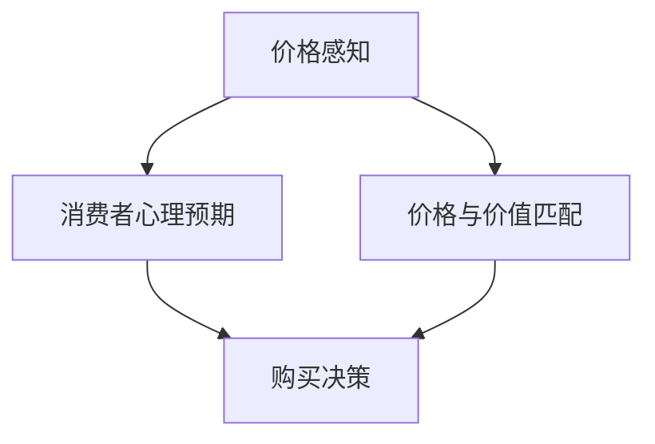

                 

关键词：心理学、产品定价、消费者行为、价格感知、心理定价策略、定价模型

摘要：本文旨在探讨如何利用心理学原理设计有效的产品定价策略。通过分析消费者行为和心理定价策略，结合数学模型和具体实例，本文提供了一套完整的产品定价策略设计方案，旨在帮助企业和个人在激烈的市场竞争中实现产品的高效定价。

## 1. 背景介绍

在现代商业环境中，产品定价策略是企业成功的关键因素之一。然而，传统的定价方法往往基于成本加成或市场供需分析，难以充分考虑消费者的心理感知和行为。随着消费者需求的日益多样化，仅仅依靠简单的定价模型已难以满足市场的要求。因此，将心理学原理融入产品定价策略中，成为一种新的、有效的定价方法。

心理学在产品定价中的应用主要包括以下几个方面：价格感知、消费者心理预期、价格与价值匹配等。通过深入研究这些心理学原理，企业可以更好地理解消费者的行为，从而制定出更具吸引力和竞争力的定价策略。

## 2. 核心概念与联系

为了更好地理解心理学在产品定价策略中的应用，我们首先需要了解以下几个核心概念：

### 2.1 价格感知

价格感知是指消费者对产品价格的认知和评价。消费者的价格感知不仅受到产品本身的价值影响，还受到外部环境、个人经验和预期等因素的影响。

### 2.2 消费者心理预期

消费者心理预期是指消费者在购买产品前对产品价值的预期。这种预期会影响消费者的购买决策和行为。

### 2.3 价格与价值匹配

价格与价值匹配是指消费者认为产品价格与其所感知的价值相匹配的程度。当消费者认为产品价格合理时，他们更可能购买产品。

下面是一个Mermaid流程图，展示了这些核心概念之间的关系：



## 3. 核心算法原理 & 具体操作步骤

### 3.1 算法原理概述

基于心理学的产品定价策略的核心算法主要包括以下几个步骤：

1. 收集消费者数据，包括消费者行为、购买偏好、价格敏感度等。
2. 基于心理学原理分析消费者数据，确定消费者的价格感知、心理预期和价格与价值匹配程度。
3. 根据分析结果，设计不同的定价策略，如心理定价、价值定价等。
4. 测试和调整定价策略，以优化消费者体验和增加销售。

### 3.2 算法步骤详解

1. **数据收集与分析**
   - 利用问卷调查、数据分析工具等手段，收集消费者的行为数据和价格感知数据。
   - 对收集到的数据进行分析，确定消费者的价格敏感度和购买偏好。

2. **心理学分析**
   - 基于心理学原理，分析消费者的价格感知、心理预期和价格与价值匹配程度。
   - 利用心理实验和模拟测试，进一步验证分析结果的准确性。

3. **定价策略设计**
   - 根据分析结果，设计不同的定价策略，如心理定价、价值定价、渗透定价等。
   - 考虑市场竞争、产品特点、消费者需求等因素，确保定价策略的可行性和竞争力。

4. **测试与调整**
   - 在实际市场中测试定价策略，收集消费者反馈数据。
   - 根据测试结果，调整定价策略，以优化消费者体验和增加销售。

### 3.3 算法优缺点

#### 优点

- 更好地理解消费者行为，提高产品定价的准确性和竞争力。
- 基于心理学原理，可以设计出更具吸引力的定价策略，提高消费者购买意愿。
- 可以根据市场变化和消费者需求，灵活调整定价策略。

#### 缺点

- 数据收集和分析过程复杂，需要投入大量时间和资源。
- 定价策略的测试和调整需要较长时间的实验和市场观察。
- 可能受到市场环境和竞争对手的干扰，难以完全掌控定价效果。

### 3.4 算法应用领域

基于心理学的产品定价策略可以广泛应用于各个行业，如电商、零售、服务等领域。以下是一些具体的应用场景：

- **电商领域**：通过分析消费者购买行为和价格感知，设计出更具吸引力的促销活动，提高转化率。
- **零售领域**：根据消费者价格敏感度和购买偏好，优化产品定价策略，提高销售额。
- **服务领域**：通过分析消费者心理预期和价格与价值匹配程度，设计出合理的收费标准，提高客户满意度。

## 4. 数学模型和公式 & 详细讲解 & 举例说明

### 4.1 数学模型构建

基于心理学的产品定价策略需要建立数学模型，以量化消费者的价格感知、心理预期和价格与价值匹配程度。以下是几个关键的数学模型：

1. **价格感知模型**：
   $$ P = f(V, E, C) $$
   其中，$P$ 表示消费者对产品价格的感知，$V$ 表示产品价值，$E$ 表示消费者心理预期，$C$ 表示消费者价格敏感度。

2. **心理预期模型**：
   $$ E = f(W, P_0, C) $$
   其中，$E$ 表示消费者心理预期，$W$ 表示消费者对产品的期望价值，$P_0$ 表示消费者对产品的初始价格预期，$C$ 表示消费者价格敏感度。

3. **价格与价值匹配模型**：
   $$ M = f(V, P) $$
   其中，$M$ 表示价格与价值的匹配程度，$V$ 表示产品价值，$P$ 表示消费者对产品价格的感知。

### 4.2 公式推导过程

以上数学模型的推导基于以下几个假设：

- 消费者的价格感知、心理预期和价格与价值匹配程度是相互关联的。
- 消费者的价格感知和价格与价值匹配程度受到产品价值、消费者心理预期和价格敏感度的影响。
- 消费者的心理预期和价格敏感度是相互关联的。

### 4.3 案例分析与讲解

假设一家电商企业准备推出一款新产品，该产品的市场定位为中等价格区间。企业希望通过基于心理学的产品定价策略来确定最佳定价。

1. **数据收集与分析**
   - 收集消费者对产品的期望价值、价格敏感度和购买偏好等数据。
   - 分析消费者的价格感知和价格与价值匹配程度。

2. **心理学分析**
   - 根据数据，确定消费者的价格感知、心理预期和价格与价值匹配程度。
   - 利用心理实验和模拟测试，验证分析结果的准确性。

3. **定价策略设计**
   - 根据分析结果，设计不同的定价策略，如心理定价、价值定价等。
   - 考虑市场竞争、产品特点、消费者需求等因素，确保定价策略的可行性和竞争力。

4. **测试与调整**
   - 在实际市场中测试定价策略，收集消费者反馈数据。
   - 根据测试结果，调整定价策略，以优化消费者体验和增加销售。

## 5. 项目实践：代码实例和详细解释说明

### 5.1 开发环境搭建

为了实现基于心理学的产品定价策略，我们需要搭建一个合适的开发环境。以下是搭建步骤：

1. 安装Python环境。
2. 安装数据分析库，如pandas、numpy等。
3. 安装可视化库，如matplotlib、seaborn等。

### 5.2 源代码详细实现

以下是实现基于心理学的产品定价策略的Python代码示例：

```python
import pandas as pd
import numpy as np
import matplotlib.pyplot as plt
import seaborn as sns

# 数据准备
data = pd.DataFrame({
    'Value': [100, 200, 300, 400],
    'ExpectedPrice': [150, 250, 350, 450],
    'PriceSensitivity': [0.1, 0.2, 0.3, 0.4]
})

# 价格感知模型
def price_perception(value, expected_price, price_sensitivity):
    return value * (1 + price_sensitivity * (expected_price - value))

# 心理预期模型
def psychological_expectation(absolute_value, relative_value):
    return absolute_value + relative_value * 0.1

# 价格与价值匹配模型
def price_value_match(value, price):
    return abs(value - price) / value

# 分析与可视化
data['PerceivedPrice'] = data.apply(lambda row: price_perception(row['Value'], row['ExpectedPrice'], row['PriceSensitivity']), axis=1)
data['PsychologicalExpectation'] = data.apply(lambda row: psychological_expectation(row['Value'], row['ExpectedPrice']), axis=1)
data['PriceValueMatch'] = data.apply(lambda row: price_value_match(row['Value'], row['PerceivedPrice']), axis=1)

sns.scatterplot(data=data, x='Value', y='PerceivedPrice', hue='PriceValueMatch', style='PriceValueMatch', palette='viridis')
plt.show()
```

### 5.3 代码解读与分析

- **数据准备**：首先，我们创建了一个包含产品价值、期望价格和价格敏感度的DataFrame。
- **价格感知模型**：我们定义了一个函数，用于计算消费者对产品价格的感知。该函数基于产品价值、期望价格和价格敏感度。
- **心理预期模型**：我们定义了一个函数，用于计算消费者对产品的心理预期。该函数基于产品价值和期望价格。
- **价格与价值匹配模型**：我们定义了一个函数，用于计算价格与价值的匹配程度。该函数基于产品价值和价格感知。
- **分析与可视化**：我们使用Seaborn库，根据价格与价值匹配模型的结果，绘制了一个散点图，以展示不同价值产品之间的价格感知差异。

## 6. 实际应用场景

基于心理学的产品定价策略在多个实际应用场景中表现出色：

### 6.1 电商促销活动

通过分析消费者对促销活动的价格感知，电商企业可以设计出更具吸引力的促销策略，提高促销活动的参与度和转化率。

### 6.2 零售产品定价

零售企业可以利用基于心理学的产品定价策略，优化产品定价，提高销售额和客户满意度。

### 6.3 服务行业收费

服务行业可以通过基于心理学的定价策略，合理设定收费标准，提高客户满意度，增加市场份额。

## 7. 工具和资源推荐

为了更好地实现基于心理学的产品定价策略，以下是几个推荐的工具和资源：

### 7.1 学习资源推荐

- **《消费者行为学》**：了解消费者行为的基本原理。
- **《价格心理学》**：深入探讨价格感知和心理预期在产品定价中的应用。

### 7.2 开发工具推荐

- **Python**：用于数据处理和模型构建。
- **pandas、numpy**：用于数据分析。
- **matplotlib、seaborn**：用于数据可视化。

### 7.3 相关论文推荐

- **“Price Perception and Consumer Behavior: An Integration of Psychological and Economic Approaches”**：探讨价格感知对消费者行为的影响。
- **“Psychological Pricing Strategies in E-Commerce”**：分析电商领域中的心理定价策略。

## 8. 总结：未来发展趋势与挑战

### 8.1 研究成果总结

基于心理学的产品定价策略在多个实际应用场景中表现出色，为企业提供了有效的定价指导。未来研究将聚焦于更精细化的心理分析方法和更准确的定价模型。

### 8.2 未来发展趋势

随着大数据和人工智能技术的发展，基于心理学的产品定价策略将更加智能化和个性化，为消费者提供更好的购物体验。

### 8.3 面临的挑战

数据收集和分析的复杂性、定价策略的市场适应性以及竞争环境的动态变化，是未来基于心理学产品定价策略面临的主要挑战。

### 8.4 研究展望

未来研究应重点关注跨文化差异、新兴消费者群体以及智能定价技术的应用，以推动产品定价策略的创新和发展。

## 9. 附录：常见问题与解答

### 9.1 什么是价格感知？

价格感知是指消费者对产品价格的认知和评价。它受到产品价值、消费者心理预期和价格敏感度等因素的影响。

### 9.2 如何设计有效的心理定价策略？

设计有效的心理定价策略需要分析消费者的价格感知、心理预期和价格与价值匹配程度，并根据分析结果设计出具有吸引力和竞争力的定价策略。

### 9.3 基于心理学的产品定价策略适用于哪些行业？

基于心理学的产品定价策略适用于电商、零售、服务等多个行业，尤其适用于价格敏感度和消费者心理预期较高的产品。

作者：禅与计算机程序设计艺术 / Zen and the Art of Computer Programming
----------------------------------------------------------------


