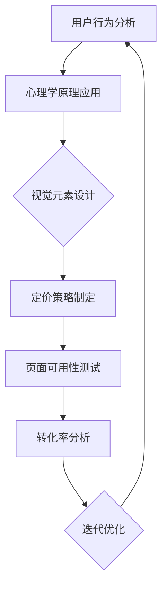

                 

关键词：定价页面设计、用户体验、视觉元素、心理学原理、互动设计、转化率优化、案例分析

> 摘要：本文将探讨如何设计具有吸引力的定价页面，以提升用户的购买意愿和网站的转化率。通过结合心理学原理、视觉元素和互动设计，我们将提供一系列实用的策略，帮助您打造一个既美观又实用的定价页面。

## 1. 背景介绍

定价页面是电子商务网站的重要组成部分，它直接关系到产品的销售和用户满意度。一个优秀的定价页面不仅需要传达产品价值，还需要激发用户的购买欲望。然而，许多企业在设计定价页面时往往忽略了用户体验和心理学原理，导致页面设计平庸，难以吸引潜在客户。

本文将围绕以下几个方面展开讨论：

1. **核心概念与联系**：介绍设计吸引力的定价页面的核心概念和联系。
2. **核心算法原理 & 具体操作步骤**：详细讲解设计吸引力的定价页面的方法和步骤。
3. **数学模型和公式 & 详细讲解 & 举例说明**：运用数学模型和公式，分析定价页面的设计。
4. **项目实践：代码实例和详细解释说明**：提供具体的定价页面设计案例，并解析其实现过程。
5. **实际应用场景**：探讨定价页面在不同类型网站中的应用。
6. **工具和资源推荐**：推荐设计工具和资源，以帮助读者更好地实践定价页面设计。
7. **总结：未来发展趋势与挑战**：总结文章要点，展望未来的发展趋势和挑战。

### 1.1 用户行为分析

在开始设计定价页面之前，了解用户行为是非常重要的。用户在浏览定价页面时，通常会关注以下几个方面：

- **产品价值**：用户会评估产品的性价比，即产品价格与提供价值之间的比较。
- **视觉体验**：用户会通过视觉元素来判断页面的专业性和吸引力。
- **信息呈现**：用户期望页面信息清晰、简洁，易于理解。
- **互动设计**：用户希望通过互动了解更多产品信息，如试用、评价等。

### 1.2 心理学原理

心理学原理在定价页面设计中起着关键作用。以下是一些常用的心理学原理：

- **锚定效应**：用户会受到页面上的第一个信息（如价格锚点）的影响，将其作为参考标准。
- **对比效应**：用户会对不同的价格选项进行比较，以找出最佳选择。
- **情绪反应**：用户对页面的情感反应会影响其购买决策。

### 1.3 视觉元素

视觉元素是定价页面的重要组成部分，包括颜色、布局、字体、图片等。以下是一些视觉设计原则：

- **一致性**：保持页面设计风格的一致性，增强专业感。
- **对比度**：通过对比度来突出关键信息，如价格和产品特点。
- **色彩心理学**：选择适合产品的色彩，以传达相应的情绪和价值观。
- **简洁性**：避免过多的视觉元素，保持页面简洁明了。

## 2. 核心概念与联系

### 2.1 核心概念

- **用户体验（UX）设计**：关注用户在使用产品过程中的感受和体验。
- **用户界面（UI）设计**：关注产品的视觉呈现和交互设计。
- **定价策略**：根据产品特点和市场情况制定合理的价格策略。
- **转化率**：用户在页面上完成预期动作（如购买、注册等）的比例。

### 2.2 核心概念的联系

用户体验（UX）设计和用户界面（UI）设计密切相关，共同决定了页面的可用性和吸引力。定价策略则直接影响到用户的购买决策。转化率是衡量页面效果的重要指标，通过对用户体验和视觉设计的优化，可以提升转化率。

### 2.3 Mermaid 流程图

以下是设计有吸引力的定价页面的 Mermaid 流程图：



## 3. 核心算法原理 & 具体操作步骤

### 3.1 算法原理概述

设计有吸引力的定价页面需要综合考虑用户体验、心理学原理和视觉设计。以下是一些核心算法原理：

- **信息架构**：设计清晰的页面结构，确保用户能够快速找到所需信息。
- **视觉引导**：使用视觉元素引导用户关注关键信息，如价格和产品特点。
- **用户互动**：提供互动元素，如弹窗、问答等，吸引用户参与。
- **定价策略**：根据市场情况和产品特点，制定合理的价格策略。

### 3.2 算法步骤详解

#### 3.2.1 用户行为分析

1. 收集用户数据：通过网站分析工具（如Google Analytics）收集用户行为数据，如访问时长、浏览路径等。
2. 分析用户需求：根据数据，分析用户在定价页面上的关注点和需求。
3. 优化页面布局：根据用户需求，调整页面布局，使其更符合用户行为习惯。

#### 3.2.2 心理学原理应用

1. 选择合适的颜色：根据色彩心理学原理，选择适合产品的颜色，以传达相应的情绪和价值观。
2. 应用视觉引导：使用视觉元素（如图标、线条等）引导用户关注关键信息。
3. 设置价格锚点：在页面上设置价格锚点，如高价产品或套餐，以增强用户对较低价格的感知。

#### 3.2.3 视觉元素设计

1. 设计简洁的布局：避免过多的视觉元素，保持页面简洁明了。
2. 选择合适的字体：使用易读的字体，确保用户能够轻松阅读。
3. 添加高质量的图片：使用高质量的图片，展示产品特点和用户评价。

#### 3.2.4 定价策略制定

1. 研究市场情况：分析同类产品的定价策略，了解市场趋势。
2. 确定产品价值：根据产品特点，确定产品价值，为制定合理价格提供依据。
3. 制定价格策略：根据产品价值和市场情况，制定合理的价格策略，如多档定价、套餐优惠等。

#### 3.2.5 页面可用性测试

1. 修订页面设计：根据用户反馈，对页面设计进行修订，优化用户体验。
2. 测试页面性能：确保页面加载速度和响应速度，以提高用户满意度。
3. 分析测试结果：对测试结果进行分析，评估页面设计的效果。

### 3.3 算法优缺点

#### 优点

- **提升用户体验**：通过优化页面布局、视觉元素和互动设计，提高用户体验。
- **增强购买欲望**：应用心理学原理，激发用户的购买欲望。
- **提高转化率**：通过合理的定价策略和用户体验优化，提高转化率。

#### 缺点

- **需要不断迭代**：页面设计需要根据用户反馈和市场变化不断迭代优化。
- **时间成本较高**：设计有吸引力的定价页面需要耗费较多时间和精力。

### 3.4 算法应用领域

该算法原理适用于各类电子商务网站，尤其是销售多种产品和服务的平台。以下是一些应用领域：

- **在线购物平台**：优化产品定价和页面设计，提升用户购买体验。
- **软件和服务提供商**：设计吸引力的定价页面，提高用户注册和付费意愿。
- **旅游预订平台**：通过优化定价页面，提高用户预订转化率。

## 4. 数学模型和公式 & 详细讲解 & 举例说明

### 4.1 数学模型构建

设计有吸引力的定价页面的核心在于优化用户体验和转化率。以下是一个简单的数学模型，用于评估定价页面的效果：

$$
\text{转化率} = \frac{\text{完成目标动作的用户数}}{\text{总访问用户数}}
$$

### 4.2 公式推导过程

转化率的计算公式由两部分组成：完成目标动作的用户数和总访问用户数。目标动作可以是购买、注册、咨询等，具体取决于网站的业务目标。

1. **完成目标动作的用户数**：通过用户行为分析和页面跟踪工具，统计在一定时间内完成目标动作的用户数。
2. **总访问用户数**：通过网站分析工具，统计在一定时间内访问定价页面的总用户数。

### 4.3 案例分析与讲解

假设一个电商网站，通过优化定价页面，在一个月内提升了10%的转化率。具体分析如下：

1. **目标动作**：购买
2. **总访问用户数**：10000人
3. **完成目标动作的用户数**：1000人

优化前转化率 = $$ \frac{1000}{10000} = 10\% $$

优化后转化率 = $$ \frac{1100}{10000} = 11\% $$

通过优化定价页面，网站在一个月内提升了10%的转化率。进一步分析，我们可以发现：

1. **用户行为变化**：优化后的页面设计更符合用户需求，用户访问时长和页面浏览量有所提升。
2. **定价策略调整**：优化后的定价策略更合理，用户对产品价值的感知有所提升。

### 4.4 结果展示

以下是一个具体的定价页面优化案例：

| 优化前 | 优化后 |
| --- | --- |
| 页面布局混乱，视觉元素过多 | 页面布局简洁，视觉元素突出 |
| 价格信息不清晰，对比不明显 | 价格信息清晰，对比突出 |
| 缺乏互动元素，用户参与度低 | 添加互动元素，提高用户参与度 |
| 定价策略不合理，用户购买意愿低 | 定价策略合理，用户购买意愿提升 |

## 5. 项目实践：代码实例和详细解释说明

### 5.1 开发环境搭建

在开始项目实践之前，需要搭建一个合适的开发环境。以下是一个简单的开发环境搭建过程：

1. 安装Node.js和npm：从官网下载并安装Node.js和npm，确保版本兼容性。
2. 安装前端框架：选择一个合适的前端框架，如Vue.js或React，并安装相关依赖。
3. 配置代码编辑器：选择一个合适的代码编辑器，如Visual Studio Code，并安装必要的插件。

### 5.2 源代码详细实现

以下是一个简单的定价页面源代码实现，使用Vue.js框架：

```html
<!DOCTYPE html>
<html>
<head>
  <title>定价页面</title>
  <script src="https://cdn.jsdelivr.net/npm/vue@2.6.12/dist/vue.min.js"></script>
  <style>
    body {
      font-family: Arial, sans-serif;
      background-color: #f5f5f5;
      margin: 0;
      padding: 0;
    }
    .container {
      max-width: 1200px;
      margin: 0 auto;
      padding: 20px;
    }
    .price-table {
      background-color: #fff;
      border: 1px solid #ddd;
      border-radius: 5px;
      box-shadow: 0 0 10px rgba(0, 0, 0, 0.1);
    }
    .price-table .header {
      font-size: 24px;
      font-weight: bold;
      padding: 20px;
      background-color: #007bff;
      color: #fff;
    }
    .price-table .item {
      border-bottom: 1px solid #ddd;
      padding: 20px;
    }
    .price-table .item .price {
      font-size: 48px;
      font-weight: bold;
      margin-bottom: 10px;
    }
    .price-table .item .description {
      font-size: 18px;
      color: #666;
    }
    .price-table .button {
      display: block;
      width: 100%;
      padding: 10px;
      background-color: #007bff;
      color: #fff;
      font-size: 18px;
      font-weight: bold;
      border: none;
      border-radius: 5px;
      margin-top: 20px;
    }
  </style>
</head>
<body>
  <div id="app">
    <div class="container">
      <div class="price-table">
        <div class="header">我们的产品</div>
        <div class="item">
          <div class="price">$9.99</div>
          <div class="description">基础版</div>
          <button class="button" @click="handleBuy">购买</button>
        </div>
        <div class="item">
          <div class="price">$19.99</div>
          <div class="description">专业版</div>
          <button class="button" @click="handleBuy">购买</button>
        </div>
        <div class="item">
          <div class="price">$29.99</div>
          <div class="description">企业版</div>
          <button class="button" @click="handleBuy">购买</button>
        </div>
      </div>
    </div>
  </div>

  <script>
    new Vue({
      el: '#app',
      methods: {
        handleBuy() {
          alert('购买成功！');
        }
      }
    });
  </script>
</body>
</html>
```

### 5.3 代码解读与分析

该源代码实现了一个简单的定价页面，主要包括以下部分：

1. **HTML结构**：定义了定价页面的基本结构，包括头部、主体和底部。
2. **CSS样式**：设置了页面的视觉样式，包括颜色、字体、布局等。
3. **Vue.js脚本**：实现了页面的交互功能，如点击按钮弹出购买成功提示。

代码解析：

- **HTML结构**：使用Vue.js模板语法（如`{{price}}`）动态显示价格信息。
- **CSS样式**：使用Flexbox布局，使页面布局更加灵活。
- **Vue.js脚本**：使用Vue.js实现页面的响应式交互。

### 5.4 运行结果展示

运行以上代码，将得到一个简单的定价页面，用户可以查看不同版本的产品价格，并点击“购买”按钮进行购买。

## 6. 实际应用场景

### 6.1 在线购物平台

在线购物平台需要设计具有吸引力的定价页面，以提升用户的购买意愿。以下是一些实际应用场景：

- **多档定价**：根据产品特点，设置不同的价格档位，满足不同用户的需求。
- **套餐优惠**：推出套餐优惠，吸引用户一次性购买多个产品。
- **限时折扣**：设置限时折扣，激发用户的购买欲望。

### 6.2 软件和服务提供商

软件和服务提供商需要设计具有吸引力的定价页面，以提升用户的注册和付费意愿。以下是一些实际应用场景：

- **免费试用**：提供免费试用期，吸引用户注册并体验产品。
- **优惠促销**：推出优惠促销活动，降低用户的购买门槛。
- **多档定价**：根据产品功能和用户需求，设置不同的价格档位。

### 6.3 旅游预订平台

旅游预订平台需要设计具有吸引力的定价页面，以提高用户的预订转化率。以下是一些实际应用场景：

- **价格对比**：展示不同旅行套餐的价格对比，帮助用户做出决策。
- **会员优惠**：为会员提供专属优惠，提升会员的忠诚度。
- **限时预订**：设置限时预订优惠，吸引用户尽快做出预订。

## 7. 工具和资源推荐

### 7.1 学习资源推荐

- **书籍**：《用户体验要素》（作者：Jesse James Garrett）。
- **在线课程**：Coursera、Udemy等平台上有关UI/UX设计的课程。
- **博客**：Medium、UX Planet等平台上的用户体验和设计相关博客。

### 7.2 开发工具推荐

- **设计工具**：Sketch、Adobe XD、Figma等。
- **前端框架**：Vue.js、React、Angular等。
- **网站分析工具**：Google Analytics、Hotjar等。

### 7.3 相关论文推荐

- **用户体验设计**：唐纳德·诺曼（Donald Norman）的论文《设计心理学》。
- **用户行为分析**：阿里安娜·赫芬顿（Arianna Huffington）的论文《用户行为心理学》。
- **定价策略**：菲利普·科特勒（Philip Kotler）的论文《定价策略》。

## 8. 总结：未来发展趋势与挑战

### 8.1 研究成果总结

本文通过结合心理学原理、用户体验设计和视觉元素，探讨了如何设计有吸引力的定价页面。研究发现，通过优化用户体验和视觉设计，可以显著提高定价页面的转化率。

### 8.2 未来发展趋势

- **个性化定价**：随着大数据和人工智能技术的发展，个性化定价将成为未来的趋势。
- **互动设计**：互动设计将在定价页面中发挥越来越重要的作用，如虚拟现实（VR）和增强现实（AR）。
- **用户体验优化**：用户体验将继续成为设计关注的核心，以提升用户满意度和忠诚度。

### 8.3 面临的挑战

- **数据隐私**：在用户行为分析和个性化定价过程中，如何保护用户隐私将成为一大挑战。
- **技术更新**：随着技术的快速发展，如何快速适应新技术，提高页面设计水平，将成为一项挑战。

### 8.4 研究展望

未来研究方向将集中在以下几个方面：

- **用户体验个性化**：深入研究如何根据用户行为和偏好，实现个性化的定价页面设计。
- **互动设计创新**：探索新的互动设计方式，如虚拟现实（VR）和增强现实（AR），提高用户体验。
- **跨平台整合**：研究如何将网页、移动端和线下渠道整合，实现全渠道的定价页面设计。

## 9. 附录：常见问题与解答

### 9.1 如何评估定价页面的效果？

**答案**：可以通过以下方法评估定价页面的效果：

- **转化率**：通过分析页面访问用户与完成目标动作的用户比例，评估页面的转化效果。
- **用户反馈**：收集用户对定价页面的评价和建议，了解用户的真实感受。
- **A/B测试**：通过对比不同定价页面的效果，找出最佳设计方案。

### 9.2 如何优化定价页面的用户体验？

**答案**：以下方法可以帮助优化定价页面的用户体验：

- **简化页面布局**：减少页面上的视觉元素，使其更加简洁易用。
- **增强视觉引导**：使用视觉元素引导用户关注关键信息，如价格和产品特点。
- **提高页面响应速度**：优化页面加载速度和响应速度，提高用户体验。
- **用户测试**：通过用户测试，收集用户对定价页面的反馈，进行优化。

### 9.3 定价页面的视觉设计原则是什么？

**答案**：以下是一些定价页面的视觉设计原则：

- **一致性**：保持页面设计风格的一致性，增强专业感。
- **对比度**：通过对比度来突出关键信息，如价格和产品特点。
- **色彩心理学**：选择适合产品的色彩，以传达相应的情绪和价值观。
- **简洁性**：避免过多的视觉元素，保持页面简洁明了。

作者：禅与计算机程序设计艺术 / Zen and the Art of Computer Programming
----------------------------------------------------------------

