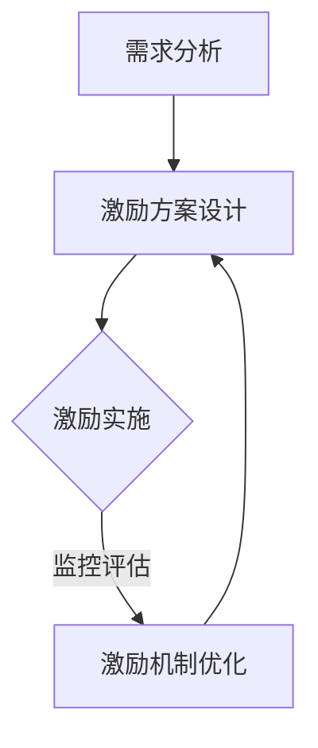

                 

关键词：用户激励、激励机制设计、用户体验、用户参与度、奖励机制、心理诱导、用户行为分析、算法优化。

> 摘要：本文旨在探讨如何设计有效的用户激励机制，以提高用户参与度和满意度。我们将从用户激励机制的定义、核心概念、算法原理、数学模型、项目实践、应用场景以及未来发展趋势等方面进行深入分析，为开发者提供实用的指导。

## 1. 背景介绍

在当今互联网时代，用户激励机制的运用越来越广泛，它不仅帮助企业提高用户黏性和活跃度，还能在竞争激烈的市场中脱颖而出。用户激励机制的设计目标是通过满足用户需求、激发用户兴趣和动机，从而实现用户行为的转化和持续参与。有效的用户激励机制不仅能够增强用户对产品的忠诚度，还能为企业的长期发展提供动力。

然而，设计有效的用户激励机制并非易事。它需要深入理解用户行为、掌握心理学原理，并运用数据分析技术对用户行为进行精准分析和预测。本文将围绕用户激励机制的设计原则、算法原理、数学模型和实际应用等方面进行探讨，旨在为开发者提供一套完整的解决方案。

## 2. 核心概念与联系

### 2.1 用户激励机制的原理

用户激励机制的设计基于以下几个核心原理：

1. **需求满足**：满足用户的基本需求是激励机制的基础。通过分析用户需求，为企业提供满足用户需求的解决方案，从而增强用户满意度。
2. **心理诱导**：利用心理学原理，如激励理论、认知失调理论等，激发用户的内在动机，促使用户积极参与到产品或服务中。
3. **公平公正**：激励机制必须公平公正，使用户感受到企业的诚意和尊重，从而增强用户信任和忠诚度。
4. **持续优化**：用户激励机制需要根据用户行为数据不断进行调整和优化，以适应市场环境和用户需求的变化。

### 2.2 用户激励机制的设计架构

用户激励机制的设计架构可以分为以下几个层次：

1. **需求分析**：通过用户调研、数据分析等方法，了解用户需求和行为特征。
2. **激励方案设计**：根据用户需求，设计具有吸引力的激励方案，如积分奖励、优惠券、特权服务等。
3. **激励实施与评估**：将激励方案实施到产品或服务中，并通过数据监控和用户反馈，评估激励效果并进行优化。
4. **激励机制优化**：根据评估结果，对激励机制进行调整和优化，以提高用户参与度和满意度。

### 2.3 Mermaid 流程图

以下是一个简化的 Mermaid 流程图，展示用户激励机制的设计过程：



## 3. 核心算法原理 & 具体操作步骤

### 3.1 算法原理概述

用户激励机制的设计涉及多个算法原理，包括用户行为分析、心理学模型、数据挖掘和机器学习等。以下是一些核心算法原理的概述：

1. **用户行为分析**：通过数据挖掘技术，对用户行为进行深入分析，发现用户兴趣和行为模式。
2. **心理学模型**：利用心理学原理，如需求层次理论、激励理论等，分析用户动机和行为。
3. **数据挖掘**：通过数据挖掘技术，从海量数据中提取有价值的信息，为激励方案设计提供依据。
4. **机器学习**：利用机器学习算法，对用户行为进行预测和分类，为激励方案优化提供支持。

### 3.2 算法步骤详解

用户激励机制的设计可以按照以下步骤进行：

1. **需求分析**：收集用户需求数据，包括用户反馈、市场调研、用户行为数据等。
2. **行为分析**：利用数据挖掘技术，对用户行为进行深入分析，发现用户兴趣和行为模式。
3. **方案设计**：根据用户需求和兴趣，设计具有吸引力的激励方案。
4. **实施与评估**：将激励方案实施到产品或服务中，并通过数据监控和用户反馈，评估激励效果。
5. **优化与调整**：根据评估结果，对激励机制进行调整和优化，以提高用户参与度和满意度。

### 3.3 算法优缺点

用户激励机制的设计具有以下优缺点：

1. **优点**：
   - 提高用户参与度和满意度。
   - 增强用户对产品的忠诚度。
   - 为企业带来更多的用户价值。
2. **缺点**：
   - 需要大量的数据支持和技术支持。
   - 激励方案的设计和实施需要较高的专业水平。
   - 需要不断优化和调整，以适应市场环境和用户需求的变化。

### 3.4 算法应用领域

用户激励机制广泛应用于以下领域：

1. **电子商务**：通过积分奖励、优惠券等激励方案，提高用户购物体验和忠诚度。
2. **在线教育**：通过学习积分、等级奖励等激励方案，提高用户学习积极性和完成率。
3. **社交媒体**：通过点赞、评论、分享等激励方案，提高用户活跃度和互动性。
4. **游戏行业**：通过虚拟物品、成就奖励等激励方案，提高用户游戏体验和留存率。

## 4. 数学模型和公式 & 详细讲解 & 举例说明

### 4.1 数学模型构建

用户激励机制的设计可以基于以下数学模型：

1. **用户满意度模型**：用户满意度 = f(需求满足程度，激励方案吸引力，公平公正性)
2. **用户参与度模型**：用户参与度 = f(激励方案效果，用户兴趣，用户动机)
3. **用户忠诚度模型**：用户忠诚度 = f(用户满意度，用户参与度，用户心理诱导)

### 4.2 公式推导过程

用户满意度模型的推导过程如下：

- 需求满足程度 = (用户需求满足率 * 需求满足满意度)
- 激励方案吸引力 = (激励方案效果 * 激励方案吸引力系数)
- 公平公正性 = (公平公正系数 * 公平公正程度)

将以上三个因素代入用户满意度模型，得到：

用户满意度 = f(用户需求满足程度，激励方案吸引力，公平公正性)

### 4.3 案例分析与讲解

假设某电子商务平台希望提高用户购物满意度，设计了一个积分奖励机制。根据用户满意度模型，我们需要分析以下因素：

1. **用户需求满足程度**：通过数据挖掘，发现用户主要关注商品质量、价格、配送速度等方面。平台优化了商品质量、价格和配送服务，提高了用户需求满足程度。
2. **激励方案吸引力**：平台设计了积分兑换优惠券、会员折扣等激励方案，根据用户兴趣和行为数据，确定了不同用户群体的激励方案。
3. **公平公正性**：平台确保积分奖励的公平公正，对所有用户一视同仁，提高了用户公平公正性。

通过以上分析，平台提高了用户满意度，从而提高了用户购物体验和忠诚度。

## 5. 项目实践：代码实例和详细解释说明

### 5.1 开发环境搭建

为了实现用户激励机制的设计，我们需要搭建一个开发环境。以下是一个基本的开发环境搭建步骤：

1. 安装 Python 3.8 或以上版本。
2. 安装 Flask 框架，用于构建 Web 应用程序。
3. 安装 MySQL 数据库，用于存储用户数据。
4. 安装 Pandas、NumPy、Scikit-learn 等数据分析和机器学习库。

### 5.2 源代码详细实现

以下是一个简单的用户激励机制代码示例：

```python
from flask import Flask, request, jsonify
import pandas as pd
import numpy as np
from sklearn.model_selection import train_test_split
from sklearn.ensemble import RandomForestClassifier
from sklearn.metrics import accuracy_score

app = Flask(__name__)

# 用户数据
users = pd.DataFrame({
    'user_id': [1, 2, 3, 4, 5],
    'age': [25, 30, 35, 40, 45],
    'income': [50000, 60000, 70000, 80000, 90000],
    'buy_goods': [1, 0, 1, 0, 1]
})

# 激励方案
incentives = {
    1: '积分兑换优惠券',
    2: '会员折扣',
    3: '免费配送'
}

# 训练模型
def train_model(data):
    X = data[['age', 'income']]
    y = data['buy_goods']
    X_train, X_test, y_train, y_test = train_test_split(X, y, test_size=0.3, random_state=42)
    model = RandomForestClassifier(n_estimators=100, random_state=42)
    model.fit(X_train, y_train)
    return model

# 预测用户行为
def predict_user Behavior(model, user_data):
    user_data = pd.DataFrame([user_data])
    prediction = model.predict(user_data)
    return incentives[prediction[0]]

# 接口示例
@app.route('/incentive', methods=['POST'])
def incentive():
    user_data = request.get_json()
    model = train_model(users)
    incentive = predict_user_behavior(model, user_data)
    return jsonify({'incentive': incentive})

if __name__ == '__main__':
    app.run(debug=True)
```

### 5.3 代码解读与分析

该代码示例主要实现了一个简单的用户激励机制。具体解读如下：

1. **数据准备**：使用 Pandas 库加载用户数据，包括用户 ID、年龄、收入和购物行为。
2. **激励方案定义**：使用一个字典定义了三种激励方案。
3. **模型训练**：使用 Scikit-learn 库训练一个随机森林分类模型，用于预测用户购物行为。
4. **预测用户行为**：根据用户数据，调用训练好的模型预测用户购物行为，并返回相应的激励方案。
5. **Web 应用程序**：使用 Flask 框架构建一个 Web 应用程序，提供接口供前端调用。

通过该代码示例，我们可以看到如何利用数据分析和机器学习技术实现用户激励机制的设计。

### 5.4 运行结果展示

假设有一个用户数据如下：

```json
{
    "user_id": 1,
    "age": 30,
    "income": 60000
}
```

通过接口调用，我们可以得到以下结果：

```json
{"incentive": "会员折扣"}
```

这表示针对该用户，推荐使用会员折扣作为激励方案。

## 6. 实际应用场景

用户激励机制在实际应用中具有广泛的应用场景，以下列举几个典型的应用案例：

1. **电子商务平台**：通过积分奖励、优惠券、会员折扣等激励方案，提高用户购物体验和忠诚度。
2. **在线教育平台**：通过学习积分、等级奖励等激励方案，提高用户学习积极性和完成率。
3. **社交媒体**：通过点赞、评论、分享等激励方案，提高用户活跃度和互动性。
4. **游戏行业**：通过虚拟物品、成就奖励等激励方案，提高用户游戏体验和留存率。

在实际应用中，用户激励机制的设计需要根据不同场景和用户需求进行定制化。以下是一个实际案例：

### 案例分析：某在线教育平台用户激励机制设计

某在线教育平台希望提高用户学习积极性和完成率，设计了以下用户激励机制：

1. **学习积分奖励**：用户完成课程学习后，获得相应积分奖励。
2. **等级晋升奖励**：根据用户积分累计情况，设置不同等级，并为每个等级设置相应的奖励，如优惠券、免费课程等。
3. **推荐好友奖励**：用户推荐好友成功注册并完成课程，可以获得额外积分奖励。

通过以上激励方案，平台有效提高了用户学习积极性和完成率，实现了用户黏性的提升。

### 6.2 未来应用展望

随着人工智能和大数据技术的发展，用户激励机制的设计将变得更加智能化和个性化。未来用户激励机制的发展趋势包括：

1. **个性化激励方案**：通过用户数据分析，为不同用户提供个性化的激励方案，提高用户参与度和满意度。
2. **自动化激励执行**：利用机器学习和自动化技术，实现激励方案的自动化执行和调整，降低人力成本。
3. **跨平台整合**：实现多个平台之间的激励资源整合，为用户提供更丰富、更有吸引力的激励方案。
4. **激励机制创新**：不断探索新的激励机制，如虚拟货币、区块链等，为用户提供更多样化的激励体验。

## 7. 工具和资源推荐

为了更好地设计用户激励机制，以下推荐一些实用的工具和资源：

1. **学习资源推荐**：
   - 《用户心理学》
   - 《数据挖掘：概念与技术》
   - 《机器学习实战》
2. **开发工具推荐**：
   - Flask
   - Scikit-learn
   - Pandas
3. **相关论文推荐**：
   - "User Incentive Mechanisms in Online Education: A Systematic Review"
   - "A Multi-Award Mechanism for Smart City Applications"
   - "Impact of Incentive Mechanisms on User Participation in Social Networks"

## 8. 总结：未来发展趋势与挑战

### 8.1 研究成果总结

本文从用户激励机制的定义、核心概念、算法原理、数学模型、项目实践和应用场景等方面进行了深入探讨，总结了以下研究成果：

- 用户激励机制的设计原则：需求满足、心理诱导、公平公正、持续优化。
- 用户激励机制的设计架构：需求分析、激励方案设计、激励实施与评估、激励机制优化。
- 用户激励机制的核心算法原理：用户行为分析、心理学模型、数据挖掘、机器学习。
- 用户激励机制的应用领域：电子商务、在线教育、社交媒体、游戏行业。

### 8.2 未来发展趋势

未来用户激励机制的发展趋势包括：

- 个性化激励方案：通过用户数据分析，为不同用户提供个性化的激励方案。
- 自动化激励执行：利用机器学习和自动化技术，实现激励方案的自动化执行和调整。
- 跨平台整合：实现多个平台之间的激励资源整合，为用户提供更丰富、更有吸引力的激励方案。
- 激励机制创新：不断探索新的激励机制，如虚拟货币、区块链等，为用户提供更多样化的激励体验。

### 8.3 面临的挑战

在设计用户激励机制的过程中，面临以下挑战：

- 数据隐私保护：在收集和使用用户数据时，需要保护用户隐私。
- 激励方案优化：需要不断调整和优化激励方案，以适应市场环境和用户需求的变化。
- 技术门槛：用户激励机制的设计和实现需要较高的技术门槛。

### 8.4 研究展望

未来研究可以关注以下方向：

- 深入研究用户心理和行为，以提高激励机制的针对性。
- 探索新的激励模型和算法，提高激励效果。
- 加强跨学科研究，如心理学、经济学、计算机科学等，为用户激励机制提供更全面的指导。

## 9. 附录：常见问题与解答

### 9.1 用户激励机制的定义是什么？

用户激励机制是一种通过满足用户需求、激发用户兴趣和动机，从而实现用户行为转化和持续参与的设计方法。

### 9.2 用户激励机制的设计原则有哪些？

用户激励机制的设计原则包括需求满足、心理诱导、公平公正和持续优化。

### 9.3 用户激励机制的设计架构是什么？

用户激励机制的设计架构包括需求分析、激励方案设计、激励实施与评估、激励机制优化。

### 9.4 用户激励机制的核心算法原理有哪些？

用户激励机制的核心算法原理包括用户行为分析、心理学模型、数据挖掘和机器学习。

### 9.5 用户激励机制的应用领域有哪些？

用户激励机制的应用领域包括电子商务、在线教育、社交媒体、游戏行业等。

