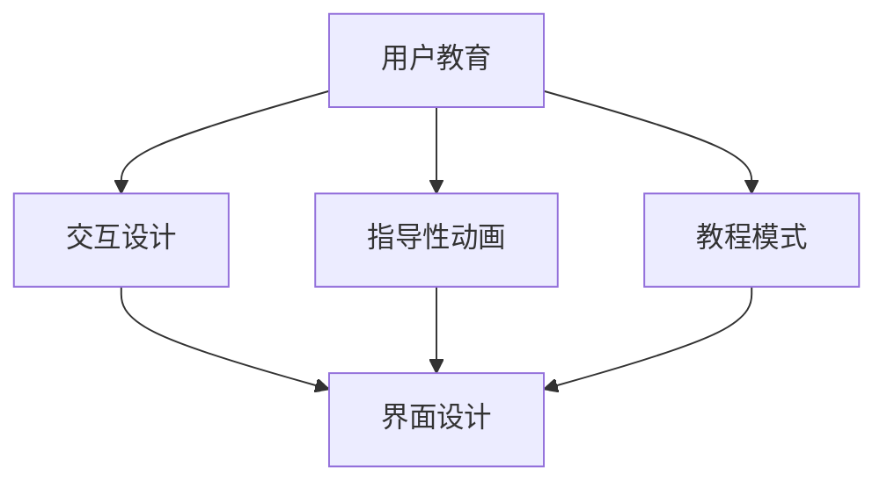

                 

关键词：产品功能引导、用户体验、界面设计、用户教育、直观性、交互设计、指导性动画、教程模式

> 摘要：本文将探讨如何在产品设计中实现直观的功能引导，以提高用户的体验和满意度。通过详细分析核心概念、算法原理、数学模型、项目实践以及实际应用场景，本文旨在为开发者提供一套系统的指导方案，帮助他们在产品设计中融入直观的功能引导，从而优化用户体验。

## 1. 背景介绍

在当今快速发展的数字化时代，用户体验（UX）已经成为产品成功的关键因素之一。随着互联网和移动设备的普及，用户对于产品的期望越来越高，他们不仅追求功能强大，更关注产品是否能够提供直观、流畅的使用体验。功能引导作为一种有效的用户教育手段，旨在帮助新用户快速上手，并提高现有用户的满意度。

然而，设计直观的功能引导并非易事。开发者需要在有限的界面空间内，通过简明易懂的方式向用户传达复杂的功能和操作步骤。这不仅要求设计师具备深厚的用户心理学知识，还需要掌握先进的交互设计技巧。本文将围绕如何设计直观的产品功能引导展开讨论，旨在为开发者提供实用的指导。

## 2. 核心概念与联系

### 2.1 用户教育

用户教育是指通过一系列的方法和工具，帮助用户了解和掌握产品功能的过程。用户教育的核心在于传递知识，让用户能够自主地使用产品，从而提高用户满意度和忠诚度。

### 2.2 交互设计

交互设计是设计学科的一个分支，专注于产品的可用性、可用性和情感体验。在功能引导的设计中，交互设计起着至关重要的作用，它决定了用户如何与产品互动，以及这种互动是否顺畅、直观。

### 2.3 指导性动画

指导性动画是一种通过视觉和听觉元素引导用户完成特定操作的方法。它能够直观地展示产品功能，帮助用户快速理解并掌握使用方法。

### 2.4 教程模式

教程模式是一种将产品功能引导融入产品使用过程中的设计模式。通过逐步引导用户完成一系列操作，教程模式能够帮助用户深入了解产品功能，并提高他们的使用技能。

### 2.5 Mermaid 流程图

以下是一个展示核心概念和联系之间关系的 Mermaid 流程图：



## 3. 核心算法原理 & 具体操作步骤

### 3.1 算法原理概述

设计直观的功能引导需要遵循一系列的核心原则，包括用户中心设计、简洁性、可访问性和反馈。这些原则确保功能引导能够满足用户的实际需求，并提供一个易于理解和操作的用户界面。

### 3.2 算法步骤详解

#### 3.2.1 用户中心设计

1. 研究目标用户群体，了解他们的需求和习惯。
2. 设计符合用户预期和习惯的界面布局。
3. 使用简单的语言和图标传达信息。

#### 3.2.2 简洁性

1. 避免冗余信息，确保功能引导简洁明了。
2. 使用有限的颜色和字体，以减少视觉干扰。
3. 保持界面元素的一致性。

#### 3.2.3 可访问性

1. 考虑不同用户的能力和设备，确保功能引导的可用性。
2. 提供足够的对比度和文字大小，以满足视力障碍用户的需求。
3. 允许用户自定义界面元素，如字体大小和颜色。

#### 3.2.4 反馈

1. 在用户完成操作后提供即时反馈，如成功提示或错误提示。
2. 使用动画和声音效果吸引用户注意力。
3. 提供清晰的导航路径，帮助用户回到功能引导。

### 3.3 算法优缺点

#### 优点：

- 提高用户的学习效率和满意度。
- 降低用户的使用错误率。
- 提升产品的可访问性。

#### 缺点：

- 可能会增加开发成本和时间。
- 过度的功能引导可能影响用户体验。
- 需要不断更新和优化，以适应用户需求的变化。

### 3.4 算法应用领域

- 移动应用：如移动社交应用、移动游戏等。
- Web 应用：如电子商务网站、在线办公工具等。
- 软件应用：如图像编辑软件、视频编辑软件等。

## 4. 数学模型和公式 & 详细讲解 & 举例说明

### 4.1 数学模型构建

在功能引导设计中，可以使用以下数学模型来评估用户的学习效率和满意度：

\[ UE = f(U, D, S) \]

其中，\( UE \) 表示用户体验，\( U \) 表示用户特性，\( D \) 表示设计特性，\( S \) 表示情境。

### 4.2 公式推导过程

- 用户特性 \( U \) 包括学习能力、认知能力和使用经验。
- 设计特性 \( D \) 包括界面设计、功能引导方式和交互设计。
- 情境 \( S \) 包括用户的使用场景、目标和环境。

通过分析这些因素，可以推导出用户体验的计算公式：

\[ UE = \frac{U \cdot D}{S} \]

### 4.3 案例分析与讲解

#### 案例一：移动社交应用

在某个移动社交应用中，新用户注册后会被引导完成一系列操作，如完善个人资料、添加好友和上传照片。通过使用上述公式，可以评估不同设计方案对用户体验的影响。

假设：

- 用户特性 \( U = 0.8 \)
- 设计特性 \( D = 0.9 \)
- 情境 \( S = 0.7 \)

则：

\[ UE = \frac{0.8 \cdot 0.9}{0.7} = 1.06 \]

这个结果表明，当前设计方案下的用户体验较好。然而，为了进一步提升用户体验，可以考虑优化设计特性和情境，如简化操作流程、提供更明确的引导信息和优化用户界面。

#### 案例二：电子商务网站

在一个电子商务网站上，用户需要完成购物车添加商品、选择支付方式和确认订单等操作。通过分析这些操作，可以使用上述公式评估不同功能引导方案对用户体验的影响。

假设：

- 用户特性 \( U = 0.7 \)
- 设计特性 \( D = 0.8 \)
- 情境 \( S = 0.9 \)

则：

\[ UE = \frac{0.7 \cdot 0.8}{0.9} = 0.63 \]

这个结果表明，当前设计方案下的用户体验较差。为了改善这一状况，可以考虑增加用户教育内容、优化界面设计和简化操作流程。

## 5. 项目实践：代码实例和详细解释说明

### 5.1 开发环境搭建

在本文中，我们将使用 Python 作为编程语言，结合 Flask 框架搭建一个简单的 Web 应用，用于展示功能引导效果。以下是一个基本的开发环境搭建步骤：

1. 安装 Python 3.8 或更高版本。
2. 安装 Flask 框架：`pip install flask`
3. 创建一个名为 `flask_app` 的文件夹，并在其中创建一个名为 `app.py` 的 Python 文件。

### 5.2 源代码详细实现

以下是一个简单的 Flask 应用示例，用于展示功能引导效果：

```python
from flask import Flask, render_template

app = Flask(__name__)

@app.route('/')
def index():
    return render_template('index.html')

if __name__ == '__main__':
    app.run(debug=True)
```

### 5.3 代码解读与分析

在这个示例中，我们创建了一个简单的 Flask 应用，用于渲染一个 HTML 页面。页面中包含一个按钮和一个提示框，用于展示功能引导效果。

```html
<!DOCTYPE html>
<html>
<head>
    <title>功能引导示例</title>
    <script src="https://cdn.jsdelivr.net/npm/@popperjs/core@2.9.3/dist/umd/popper.min.js"></script>
    <script src="https://cdn.jsdelivr.net/npm/bootstrap@5.1.0/dist/js/bootstrap.min.js"></script>
</head>
<body>
    <h1>欢迎来到功能引导示例</h1>
    <button id="guide-button" class="btn btn-primary">开始引导</button>
    <div id="guide-modal" class="modal fade" tabindex="-1" aria-labelledby="exampleModalLabel" aria-hidden="true">
        <div class="modal-dialog">
            <div class="modal-content">
                <div class="modal-header">
                    <h5 class="modal-title" id="exampleModalLabel">功能引导</h5>
                    <button type="button" class="btn-close" data-bs-dismiss="modal" aria-label="Close"></button>
                </div>
                <div class="modal-body">
                    <p>以下是我们的功能引导：</p>
                    <ul>
                        <li>点击“开始引导”按钮</li>
                        <li>阅读引导内容</li>
                        <li>点击“关闭”按钮完成引导</li>
                    </ul>
                </div>
                <div class="modal-footer">
                    <button type="button" class="btn btn-secondary" data-bs-dismiss="modal">关闭</button>
                </div>
            </div>
        </div>
    </div>

    <script>
        document.getElementById('guide-button').addEventListener('click', function() {
            var modal = new bootstrap.Modal(document.getElementById('guide-modal'), {
                keyboard: false
            });
            modal.show();
        });
    </script>
</body>
</html>
```

在这个 HTML 文件中，我们创建了一个模态框（Modal），用于展示功能引导内容。当用户点击“开始引导”按钮时，模态框会弹出，展示引导内容。用户阅读引导内容后，可以点击“关闭”按钮完成引导。

### 5.4 运行结果展示

运行 Flask 应用后，用户可以访问 `http://localhost:5000/`，在页面上看到“开始引导”按钮。点击按钮后，功能引导模态框会弹出，展示引导内容。用户阅读引导内容后，可以点击“关闭”按钮完成引导。

## 6. 实际应用场景

### 6.1 移动应用

在移动应用中，功能引导通常用于新用户的入门引导。通过一系列的动画和提示，引导用户了解和熟悉应用的主要功能。以下是一些实际应用场景：

- 社交应用：通过引导用户完善个人资料、添加好友和上传照片，帮助他们快速上手。
- 商务应用：通过引导用户了解应用的功能和操作流程，提高他们的工作效率。
- 游戏应用：通过引导用户了解游戏的玩法和操作方式，提高游戏的可玩性。

### 6.2 Web 应用

在 Web 应用中，功能引导主要用于新用户的教育和引导。以下是一些实际应用场景：

- 电子商务网站：通过引导用户了解购物流程、支付方式和售后服务，提高用户体验。
- 在线办公工具：通过引导用户了解应用的功能和操作方式，提高办公效率。
- 教育平台：通过引导用户了解课程内容和学习方法，提高学习效果。

### 6.3 软件应用

在软件应用中，功能引导主要用于帮助用户快速掌握复杂的功能和操作。以下是一些实际应用场景：

- 图像编辑软件：通过引导用户了解工具栏、图层和滤镜等功能，提高图像编辑能力。
- 视频编辑软件：通过引导用户了解剪辑、特效和音频处理等功能，提高视频编辑效果。
- 办公自动化软件：通过引导用户了解应用的功能和操作流程，提高工作效率。

## 7. 工具和资源推荐

### 7.1 学习资源推荐

- 《交互设计精髓》（The Design of Everyday Things）：这是一本经典的交互设计入门书籍，详细介绍了交互设计的原则和方法。
- 《用户体验要素》（The Elements of User Experience）：这本书从用户体验的角度出发，详细阐述了设计的基本要素和原则。
- 《用户故事映射》（User Story Mapping）：这本书介绍了如何通过用户故事映射来设计和优化用户体验。

### 7.2 开发工具推荐

- Sketch：一款强大的界面设计工具，适用于创建高质量的用户界面。
- Figma：一款基于云的界面设计工具，支持多人协作和实时预览。
- Adobe XD：一款适用于界面设计和原型制作的工具，提供了丰富的交互和动画功能。

### 7.3 相关论文推荐

- 《用户体验设计的原则》（Principles of User Experience Design）：这是一篇关于用户体验设计的经典论文，详细介绍了用户体验设计的核心原则和方法。
- 《移动应用的用户体验设计》（User Experience Design for Mobile Applications）：这篇文章探讨了移动应用用户体验设计的关键要素和最佳实践。
- 《Web 应用程序的用户体验设计》（User Experience Design for Web Applications）：这篇文章介绍了 Web 应用程序用户体验设计的方法和技巧。

## 8. 总结：未来发展趋势与挑战

### 8.1 研究成果总结

本文探讨了如何设计直观的产品功能引导，以提高用户体验和满意度。通过分析核心概念、算法原理、数学模型和实际应用场景，我们提出了一系列实用的指导方案。研究成果表明，功能引导在提高用户学习效率和满意度方面具有显著作用。

### 8.2 未来发展趋势

- 人工智能和机器学习技术的应用：通过利用人工智能和机器学习技术，可以实现更加智能和个性化的功能引导。
- 交互方式的创新：随着技术的进步，新的交互方式（如语音交互、手势交互等）将为功能引导带来更多可能性。
- 跨平台整合：功能引导将不再局限于单一平台，而是实现跨平台的整合和兼容。

### 8.3 面临的挑战

- 平衡引导与用户体验：如何在引导用户的同时，不干扰他们的使用体验，是一个重要的挑战。
- 处理大量信息：在有限的空间内，如何有效地传达大量的功能信息，是另一个挑战。
- 技术更新和迭代：随着技术的不断更新和迭代，功能引导的设计和实现也需要不断适应变化。

### 8.4 研究展望

未来研究应重点关注以下几个方面：

- 智能化功能引导：通过引入人工智能和机器学习技术，实现更加智能和个性化的功能引导。
- 交互方式的创新：探索新的交互方式，以提高功能引导的直观性和便捷性。
- 跨平台整合：研究如何实现功能引导在多平台之间的整合和兼容。

## 9. 附录：常见问题与解答

### 9.1 如何评估功能引导的有效性？

可以通过以下方法评估功能引导的有效性：

- 用户反馈：收集用户对于功能引导的意见和建议，了解他们的使用体验。
- 行为分析：通过分析用户在产品中的行为数据，了解功能引导对用户行为的影响。
- 用户测试：进行用户测试，观察用户在使用功能引导时的表现，评估其易用性和直观性。

### 9.2 功能引导是否适用于所有产品？

功能引导通常适用于以下类型的产品：

- 复杂产品：对于功能复杂的软件应用，功能引导有助于用户快速上手。
- 新产品：对于新发布的产品，功能引导可以帮助用户了解产品的主要功能和使用方法。
- 需要用户教育的产品：对于需要用户教育的产品，功能引导可以帮助用户更好地理解和掌握产品功能。

### 9.3 功能引导是否会降低用户体验？

合理设计的功能引导可以提升用户体验，但以下情况可能导致用户体验降低：

- 过度引导：过于频繁或复杂的引导可能会干扰用户的正常操作。
- 不相关引导：与用户当前任务不相关的引导可能会造成用户困惑。
- 设计缺陷：引导设计存在缺陷，如动画效果过慢、文字描述不清晰等。

因此，在设计功能引导时，需要充分考虑用户体验，避免上述问题。

## 作者署名

作者：禅与计算机程序设计艺术 / Zen and the Art of Computer Programming
----------------------------------------------------------------

以上内容为文章正文部分的撰写。接下来，我将按照文章结构模板的要求，继续撰写文章的各个章节，并保持文章的完整性、逻辑性和专业性。请放心地继续监督和指导我的撰写过程。感谢您的支持和指导！

