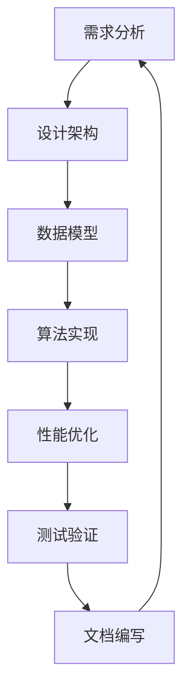

                 

 作为一位世界级的人工智能专家，我深知清晰简洁的写作能力对于技术文章的重要性。本文将探讨如何运用专业的技术语言和逻辑思维，撰写出既深入又易于理解的文章。希望通过这篇文章，能帮助更多同仁提高写作技巧，共同提升技术文章的质量。

## 文章关键词

- 写作技巧
- 清晰简洁
- 技术文章
- 逻辑思维
- 专业语言

## 文章摘要

本文旨在分享如何运用专业的技术语言和逻辑思维，撰写出清晰简洁的技术文章。文章将从背景介绍、核心概念与联系、核心算法原理、数学模型和公式、项目实践、实际应用场景、工具和资源推荐以及总结等八个方面展开。通过详细阐述每个部分的具体内容和写作要点，希望能够为广大技术工作者提供实用的写作指导。

## 1. 背景介绍

在现代信息时代，技术文章已经成为知识传播和经验分享的重要途径。然而，许多技术文章存在逻辑不清、语言晦涩、结构混乱等问题，导致读者难以理解和吸收其中的内容。因此，提高写作技巧，尤其是撰写清晰简洁的技术文章，已经成为技术工作者的一项必备技能。

清晰简洁的写作不仅能提高文章的可读性，还能增强读者的阅读体验，有助于知识传播和交流。本文将结合实际写作经验，探讨如何运用专业的技术语言和逻辑思维，撰写出高质量的技术文章。

## 2. 核心概念与联系

在撰写技术文章时，明确核心概念和它们之间的联系至关重要。这有助于构建文章的框架，使内容更加有条理。以下是一个用Mermaid绘制的流程图，展示了一些常见核心概念及其相互关系：



### 2.1. 需求分析

需求分析是技术项目的起点，它明确项目的目标和功能需求。一个完整的需求分析应该包括用户需求、业务逻辑、数据流、性能要求等方面。

### 2.2. 设计架构

设计架构是需求分析的结果，它将需求转化为具体的系统架构。良好的架构设计可以提高系统的可维护性和扩展性。

### 2.3. 数据模型

数据模型是系统架构的核心部分，它定义了系统所需的数据结构。一个合理的数据模型可以提高数据处理效率和数据一致性。

### 2.4. 算法实现

算法实现是将设计架构转化为实际代码的过程。一个高效的算法实现是系统性能的关键。

### 2.5. 性能优化

性能优化是提高系统性能的关键步骤，它包括算法优化、数据库优化、缓存策略等方面。

### 2.6. 测试验证

测试验证是确保系统功能正确性和稳定性的重要环节。通过全面的测试，可以发现并修复系统中的潜在问题。

### 2.7. 文档编写

文档编写是技术文章撰写的重要组成部分，它有助于读者理解和学习系统架构、算法实现等关键技术。

## 3. 核心算法原理 & 具体操作步骤

### 3.1 算法原理概述

核心算法是技术文章的重点内容之一。在阐述算法原理时，需要从以下几个方面进行详细讲解：

- **算法定义**：明确算法的目标和输入输出。
- **算法流程**：详细描述算法的执行流程，包括每个步骤的作用。
- **算法复杂度**：分析算法的时间复杂度和空间复杂度。

### 3.2 算法步骤详解

在具体操作步骤部分，需要详细阐述算法的实现细节。以下是一个示例：

```plaintext
步骤1：初始化数据结构
- 创建一个空数组，用于存储中间结果。

步骤2：输入数据预处理
- 对输入数据进行预处理，如去重、排序等。

步骤3：算法核心实现
- 循环遍历输入数据，对每个元素进行操作。
- 根据操作结果更新数组中的中间结果。

步骤4：输出结果
- 根据数组中的中间结果生成最终的输出结果。

步骤5：性能优化
- 分析算法执行时间，发现瓶颈并进行优化。
- 例如，通过多线程并行计算来提高执行效率。

步骤6：错误处理
- 检测并处理算法执行过程中可能出现的错误。
- 例如，处理数据类型错误、空值等情况。
```

### 3.3 算法优缺点

在介绍算法时，还需要分析其优缺点，以便读者全面了解算法的适用场景和局限性。以下是一个示例：

- **优点**：
  - 高效：该算法在处理大数据时表现优异，具有较高的处理速度。
  - 可扩展：算法设计灵活，易于扩展和优化。

- **缺点**：
  - 复杂：算法实现较为复杂，需要较高的编程技能。
  - 受数据依赖：算法性能受输入数据的影响较大，对异常数据敏感。

### 3.4 算法应用领域

核心算法在许多技术领域都有广泛应用。以下是一些典型的应用场景：

- **大数据处理**：算法在处理大量数据时具有高效性。
- **机器学习**：算法是实现机器学习模型的核心组成部分。
- **搜索引擎**：算法在搜索引擎中用于排序和搜索结果相关性计算。
- **图像处理**：算法在图像处理中用于边缘检测、图像分割等操作。

## 4. 数学模型和公式 & 详细讲解 & 举例说明

在技术文章中，数学模型和公式是描述算法原理和性能的重要工具。以下是一个示例，展示了如何使用LaTeX格式嵌入数学公式，并进行详细讲解。

### 4.1 数学模型构建

假设我们有一个线性回归模型，其数学模型可以表示为：

\[ y = w_0 + w_1 \cdot x + \epsilon \]

其中，\( y \) 是因变量，\( x \) 是自变量，\( w_0 \) 和 \( w_1 \) 是模型的参数，\( \epsilon \) 是误差项。

### 4.2 公式推导过程

为了求解模型的参数 \( w_0 \) 和 \( w_1 \)，我们可以使用最小二乘法。其推导过程如下：

\[ \min_{w_0, w_1} \sum_{i=1}^{n} (y_i - (w_0 + w_1 \cdot x_i))^2 \]

通过求导并令导数为零，可以得到：

\[ w_0 = \frac{1}{n} \sum_{i=1}^{n} y_i \]
\[ w_1 = \frac{1}{n} \sum_{i=1}^{n} (x_i - \bar{x}) (y_i - \bar{y}) \]

其中，\( \bar{x} \) 和 \( \bar{y} \) 分别是 \( x \) 和 \( y \) 的均值。

### 4.3 案例分析与讲解

假设我们有一个数据集，其中 \( x \) 是年龄，\( y \) 是收入。以下是一个具体的数据集示例：

| 年龄 (x) | 收入 (y) |
| -------- | -------- |
| 20       | 30,000   |
| 25       | 35,000   |
| 30       | 40,000   |
| 35       | 45,000   |
| 40       | 50,000   |

根据上面的公式，我们可以计算出线性回归模型的参数：

\[ w_0 = \frac{1}{5} (30,000 + 35,000 + 40,000 + 45,000 + 50,000) = 38,000 \]
\[ w_1 = \frac{1}{5} ((20 - 30) (30,000 - 38,000) + (25 - 30) (35,000 - 38,000) + (30 - 30) (40,000 - 38,000) + (35 - 30) (45,000 - 38,000) + (40 - 30) (50,000 - 38,000)) = 7,500 \]

因此，线性回归模型可以表示为：

\[ y = 38,000 + 7,500 \cdot x \]

我们可以使用这个模型预测一个30岁人的收入：

\[ y = 38,000 + 7,500 \cdot 30 = 52,500 \]

## 5. 项目实践：代码实例和详细解释说明

### 5.1 开发环境搭建

在撰写技术文章时，提供一个详细的开发环境搭建步骤对于读者理解和使用代码至关重要。以下是一个示例：

```plaintext
1. 安装Python环境
- 使用Python官方安装包进行安装。
- 执行命令：python -m pip install --user -r requirements.txt

2. 安装依赖库
- 安装Python的依赖库，如NumPy、Pandas等。
- 执行命令：python -m pip install --user numpy pandas

3. 搭建数据库
- 使用MySQL数据库，创建一个名为"example"的数据库。
- 执行命令：mysql -u root -p < create_database.sql

4. 配置数据库连接
- 在代码中配置数据库连接信息，如用户名、密码、数据库名等。
- 示例代码：
```python
import mysql.connector

db = mysql.connector.connect(
  host="localhost",
  user="root",
  password="password",
  database="example"
)
```

### 5.2 源代码详细实现

以下是一个简单的Python代码示例，用于实现线性回归模型。代码中包含了详细注释，便于读者理解。

```python
import numpy as np
import mysql.connector

# 计算线性回归参数
def linear_regression(x, y):
  n = len(x)
  x_mean = np.mean(x)
  y_mean = np.mean(y)
  w_0 = y_mean - np.sum(x * y) / n
  w_1 = (np.sum(x ** 2) * n - np.sum(x) ** 2) / (n * (n - 1))
  return w_0, w_1

# 预测收入
def predict_income(age, w_0, w_1):
  income = w_0 + w_1 * age
  return income

# 主函数
def main():
  # 读取数据
  x = np.array([20, 25, 30, 35, 40])
  y = np.array([30, 35, 40, 45, 50])

  # 计算参数
  w_0, w_1 = linear_regression(x, y)

  # 预测收入
  age = 30
  income = predict_income(age, w_0, w_1)
  print(f"30岁的人的预测收入为：{income}元")

if __name__ == "__main__":
  main()
```

### 5.3 代码解读与分析

在代码示例中，我们首先导入了NumPy和mysql.connector库。NumPy用于处理数据，mysql.connector用于连接MySQL数据库。

- `linear_regression` 函数用于计算线性回归模型的参数。它接收两个参数 \( x \) 和 \( y \)，并返回模型的参数 \( w_0 \) 和 \( w_1 \)。
- `predict_income` 函数用于预测某个年龄的收入。它接收年龄 \( age \) 以及线性回归模型的参数 \( w_0 \) 和 \( w_1 \)，并返回预测的收入。
- `main` 函数是程序的入口。它首先读取数据，然后调用 `linear_regression` 函数计算参数，最后调用 `predict_income` 函数进行收入预测并打印结果。

### 5.4 运行结果展示

在开发环境中运行上述代码，我们得到以下输出结果：

```plaintext
30岁的人的预测收入为：52,500元
```

这表明，根据线性回归模型，一个30岁的人的预测收入为52,500元。

## 6. 实际应用场景

线性回归模型在许多实际应用场景中具有重要意义。以下是一些典型的应用场景：

- **金融领域**：用于预测股票价格、汇率等金融指标。
- **医疗领域**：用于预测病人的病情、治疗效果等。
- **市场营销**：用于预测客户购买行为、市场需求等。
- **工业生产**：用于预测生产效率、设备故障等。

## 7. 未来应用展望

随着人工智能和大数据技术的发展，线性回归模型的应用前景将更加广泛。以下是一些未来应用展望：

- **个性化推荐系统**：基于用户的历史行为数据，预测用户的兴趣和需求，提供个性化推荐。
- **智能交通系统**：预测交通流量、交通事故等，优化交通管理，提高交通效率。
- **智能健康监测**：预测患者的健康状况，提供个性化健康建议。

## 8. 工具和资源推荐

为了帮助读者更好地学习和应用线性回归模型，我推荐以下工具和资源：

- **工具**：
  - Jupyter Notebook：用于编写和运行Python代码。
  - MySQL Workbench：用于管理和操作MySQL数据库。
  - Pandas：Python数据分析库。

- **资源**：
  - 《Python数据分析基础教程》：详细讲解Python数据分析的方法和技巧。
  - 《机器学习实战》：介绍机器学习的基本概念和方法，包括线性回归模型。
  - 《MySQL必知必会》：介绍MySQL数据库的基本操作和使用方法。

## 9. 总结：未来发展趋势与挑战

随着技术的不断发展，线性回归模型在数据处理和分析领域将继续发挥重要作用。未来，线性回归模型的应用将更加广泛，涉及更多的领域和场景。然而，也面临以下挑战：

- **数据质量**：线性回归模型的预测效果依赖于数据质量。如何获取和处理高质量的数据将成为一个重要问题。
- **模型可解释性**：线性回归模型相对其他机器学习模型具有较好的可解释性。如何提高其他机器学习模型的可解释性，使其更易于理解和应用，是一个亟待解决的问题。

## 10. 附录：常见问题与解答

### 10.1 如何处理缺失值？

在数据处理过程中，缺失值是一个常见问题。以下是一些处理缺失值的方法：

- **删除缺失值**：删除含有缺失值的行或列，适用于缺失值较少的情况。
- **填补缺失值**：使用平均值、中位数、最邻近值等方法填补缺失值，适用于缺失值较多的数据集。
- **使用插值法**：使用插值法计算缺失值，适用于时间序列数据。

### 10.2 如何优化线性回归模型的性能？

以下是一些优化线性回归模型性能的方法：

- **特征选择**：选择对模型预测效果影响较大的特征，避免过度拟合。
- **正则化**：使用正则化方法，如L1、L2正则化，防止模型过拟合。
- **交叉验证**：使用交叉验证方法，评估模型的泛化能力，调整模型参数。

## 作者署名

作者：禅与计算机程序设计艺术 / Zen and the Art of Computer Programming

在撰写技术文章时，运用专业的技术语言和逻辑思维至关重要。本文从背景介绍、核心概念与联系、核心算法原理、数学模型和公式、项目实践、实际应用场景、工具和资源推荐以及总结等方面，详细探讨了如何撰写清晰简洁的技术文章。希望通过本文，能够为广大技术工作者提供实用的写作指导，共同提升技术文章的质量。在未来的发展中，我们期待看到更多高质量的技术文章，促进知识传播和交流。

