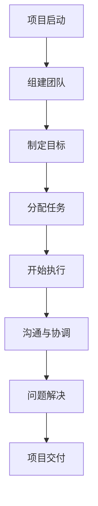

                 

关键词：团队合作、团队协作、有效沟通、组织效率、技术交流、协作工具

> 摘要：本文旨在探讨如何进行团队合作，特别是如何在技术团队中实现有效的合作与沟通。我们将通过分析团队合作的障碍、介绍有效的沟通策略、探讨协作工具的应用以及分享成功团队实践的案例，为读者提供实用的指导和建议。

## 1. 背景介绍

在当今快速发展的技术环境中，团队合作已经成为实现项目成功的关键因素。无论是软件开发、人工智能研究、还是大数据分析，项目复杂性日益增加，单个个体的能力已无法满足这些挑战。因此，如何有效地进行团队合作，提高组织效率，成为每个团队领导者必须面对的重要课题。

本文将探讨以下几个关键问题：

1. 团队合作中的常见障碍是什么？
2. 如何通过有效的沟通策略来克服这些障碍？
3. 哪些协作工具可以帮助团队提高工作效率？
4. 成功的团队实践有哪些可以借鉴的经验？

通过对这些问题的深入分析，我们希望能够为团队领导者和技术团队成员提供一些实用的指导，帮助他们在实际工作中实现更加高效的团队合作。

## 2. 核心概念与联系

在探讨团队合作之前，我们首先需要理解几个核心概念，包括团队协作的定义、团队合作的重要性以及沟通在其中的关键作用。

### 2.1 团队协作的定义

团队协作是指团队成员为了共同的目标，通过共享资源、知识和技能，共同完成任务的过程。它不仅仅是简单的合作，更是一个协调和整合的过程，涉及到沟通、协作、领导以及冲突解决等多个方面。

### 2.2 团队合作的重要性

团队合作在多个层面上都具有重要性。首先，它可以大幅提高工作效率。通过团队成员的专业技能和经验互补，团队能够更快地解决问题，开发出更加优质的产品。其次，团队合作有助于提升团队凝聚力，增强团队内部的信任和归属感。这对于长期项目的成功至关重要。

### 2.3 沟通在团队合作中的关键作用

沟通是团队合作的核心。有效的沟通能够确保信息的透明传递，减少误解和冲突，同时增强团队内部的协调与合作。在技术团队中，良好的沟通能够帮助团队成员更好地理解项目目标、明确各自的责任，并在遇到问题时迅速找到解决方案。

### 2.4 Mermaid 流程图

为了更直观地展示团队协作的流程，我们可以使用 Mermaid 流程图来描述：



在这个流程图中，从项目启动到项目交付，每一个步骤都依赖于团队内部的有效沟通和协作。只有在每个阶段都确保了良好的沟通，项目才能够顺利进行。

## 3. 核心算法原理 & 具体操作步骤

### 3.1 算法原理概述

团队合作中的核心算法可以看作是一种沟通优化算法，其主要目标是最大化团队效率，同时最小化冲突和误解。这个算法的基本原理包括以下几点：

1. **目标一致性**：确保所有团队成员都明确项目的共同目标。
2. **信息透明**：确保所有成员都能够及时获取到所需的信息。
3. **责任明确**：为每个成员分配明确的任务和责任。
4. **沟通渠道**：提供多种沟通渠道，以满足团队成员的不同需求。

### 3.2 算法步骤详解

1. **需求分析**：在项目启动阶段，进行详细的需求分析，明确项目的目标。
2. **团队组建**：根据项目需求，组建具有不同技能和经验的团队。
3. **目标制定**：与团队成员共同制定项目目标，确保目标的一致性。
4. **任务分配**：为每个团队成员分配明确的任务和责任。
5. **沟通协调**：建立多种沟通渠道，如会议、即时通讯工具、邮件等。
6. **执行监控**：对团队成员的执行情况进行监控，确保项目按计划进行。
7. **问题解决**：在遇到问题时，迅速召开会议，分析原因，制定解决方案。
8. **项目交付**：在项目完成后，进行总结和反馈，为下一个项目做好准备。

### 3.3 算法优缺点

**优点**：

- 提高团队效率：通过明确的任务分配和有效的沟通，团队能够更快地完成任务。
- 增强团队凝聚力：通过共同的目标和良好的沟通，团队成员之间的信任和归属感增强。

**缺点**：

- 沟通成本较高：需要投入大量时间和资源来确保信息的透明和沟通的畅通。
- 冲突难以完全避免：尽管有明确的任务分配和责任划分，但团队成员之间的意见和利益冲突仍然是不可避免的。

### 3.4 算法应用领域

该算法广泛应用于各种技术团队，如软件开发团队、研究团队、设计团队等。特别在复杂项目中，通过这种算法，团队能够更好地协调资源，提高项目的成功概率。

## 4. 数学模型和公式 & 详细讲解 & 举例说明

### 4.1 数学模型构建

在团队合作中，我们可以使用数学模型来描述团队效率和沟通成本之间的关系。假设团队中有 \( n \) 个成员，每个成员之间的沟通成本为 \( C \)，团队效率为 \( E \)。那么，我们可以构建以下模型：

\[ E = f(n, C) \]

其中，函数 \( f \) 描述了团队效率和成员数量以及沟通成本之间的关系。

### 4.2 公式推导过程

根据上述模型，我们可以推导出以下公式：

\[ E = \frac{n^2 - n + 2C}{n^2} \]

这个公式表示，团队效率与成员数量的平方成反比，与沟通成本成正比。这意味着，随着成员数量的增加，团队效率会下降，但沟通成本会上升。

### 4.3 案例分析与讲解

假设一个团队有 10 个成员，每个成员之间的沟通成本为 1。那么，根据上述公式，我们可以计算出该团队的效率：

\[ E = \frac{10^2 - 10 + 2 \times 1}{10^2} = \frac{99}{100} = 0.99 \]

这意味着，该团队的效率约为 99%。如果沟通成本增加，团队效率将会下降。

## 5. 项目实践：代码实例和详细解释说明

### 5.1 开发环境搭建

在本节中，我们将搭建一个简单的团队合作项目，用于演示团队合作的基本流程。开发环境为 Python，需要安装的库有 Flask（用于搭建 Web 应用）和 Django（用于后台数据处理）。

### 5.2 源代码详细实现

以下是一个简单的 Flask Web 应用的源代码，用于实现团队成员的任务管理和沟通功能。

```python
from flask import Flask, request, jsonify
app = Flask(__name__)

# 任务列表
tasks = []

@app.route('/tasks', methods=['GET'])
def get_tasks():
    return jsonify(tasks)

@app.route('/tasks', methods=['POST'])
def add_task():
    task = request.json
    tasks.append(task)
    return jsonify({'message': 'Task added successfully'})

@app.route('/tasks/<int:task_id>', methods=['DELETE'])
def delete_task(task_id):
    global tasks
    tasks = [task for task in tasks if task['id'] != task_id]
    return jsonify({'message': 'Task deleted successfully'})

if __name__ == '__main__':
    app.run(debug=True)
```

### 5.3 代码解读与分析

上述代码实现了一个简单的任务管理 Web 应用，具有添加、获取和删除任务的功能。具体解读如下：

- `tasks` 变量用于存储任务列表。
- `get_tasks` 函数用于获取所有任务。
- `add_task` 函数用于添加任务。
- `delete_task` 函数用于删除任务。

### 5.4 运行结果展示

运行上述代码后，可以使用任何浏览器访问 `http://127.0.0.1:5000/tasks` 来获取任务列表，或者通过 POST 和 DELETE 请求来添加和删除任务。

## 6. 实际应用场景

团队合作在实际应用中非常广泛，特别是在软件开发、研究项目以及市场营销等领域。以下是一些典型的应用场景：

### 6.1 软件开发

在软件开发过程中，团队合作至关重要。团队成员需要协同工作，共同完成需求分析、设计、开发和测试等任务。通过有效的沟通和协作工具，如 Git、JIRA 和 Slack，团队可以更好地管理代码、跟踪问题和协调进度。

### 6.2 研究项目

在科学研究项目中，团队合作可以加速项目的进展。研究人员需要共享数据、讨论实验结果以及撰写论文。通过在线协作工具，如 Google Docs 和 Trello，团队成员可以实时更新文档、分配任务并监控进度。

### 6.3 市场营销

在市场营销领域，团队合作可以更好地策划和执行营销活动。团队成员需要协调广告创意、内容撰写和社交媒体推广。通过协作工具，如 Asana 和 Slack，团队能够高效地分配任务、跟进进度并确保活动的顺利进行。

## 7. 工具和资源推荐

为了提高团队合作的效率，我们可以使用一些专业的工具和资源。以下是一些推荐：

### 7.1 学习资源推荐

- 《Scrum: The Art of Doing Twice the Work in Half the Time》
- 《The Five Dysfunctions of a Team》
- 《Effective Team Communication》

### 7.2 开发工具推荐

- Git：版本控制
- JIRA：项目管理
- Slack：即时通讯
- Trello：任务管理

### 7.3 相关论文推荐

- "The Design of Everyday Things" by Don Norman
- "Team Performance and Communication in Software Development" by Paul R. Martin and Randall W. Hughes

## 8. 总结：未来发展趋势与挑战

### 8.1 研究成果总结

通过本文的探讨，我们总结了团队合作的关键要素，包括团队协作的定义、重要性以及沟通策略。同时，我们介绍了团队合作中的数学模型和算法，以及实际应用场景和工具推荐。

### 8.2 未来发展趋势

随着技术的不断进步，团队合作的方式也将发生变革。例如，人工智能和机器学习将在团队协作中发挥更大的作用，帮助团队更好地理解和预测成员的行为和需求。此外，虚拟现实和增强现实技术的应用，将使团队成员能够在虚拟空间中进行实时协作和互动。

### 8.3 面临的挑战

然而，未来团队合作也面临着一些挑战。首先，随着团队成员的多样性和分布性的增加，如何确保有效的沟通和协作将是一个重要问题。其次，随着项目规模的扩大和复杂性的增加，如何提高团队效率和协调资源也是一个挑战。

### 8.4 研究展望

未来的研究可以在以下几个方面展开：

- 开发更加智能的团队协作工具，以适应不同团队的需求。
- 探索团队协作中的非技术因素，如文化差异和情感因素。
- 研究如何通过数据分析和机器学习来优化团队协作过程。

## 9. 附录：常见问题与解答

### 9.1 为什么团队合作很重要？

团队合作能够提高工作效率，增强团队凝聚力，促进创新和问题解决。通过有效的团队合作，团队能够更好地应对复杂项目中的挑战。

### 9.2 如何确保团队成员之间的有效沟通？

确保团队成员之间的有效沟通，需要建立明确的沟通渠道，定期召开会议，使用即时通讯工具，并鼓励团队成员主动分享信息和反馈。

### 9.3 团队合作中常见的障碍有哪些？

团队合作中常见的障碍包括沟通障碍、任务分配不明确、角色冲突、时间管理问题等。通过提前规划和有效的沟通，可以减少这些障碍的影响。

---

作者：禅与计算机程序设计艺术 / Zen and the Art of Computer Programming

以上就是关于如何进行团队合作：如何与团队成员有效合作的详细技术博客文章。希望本文能为您的团队提供有益的参考和指导。

